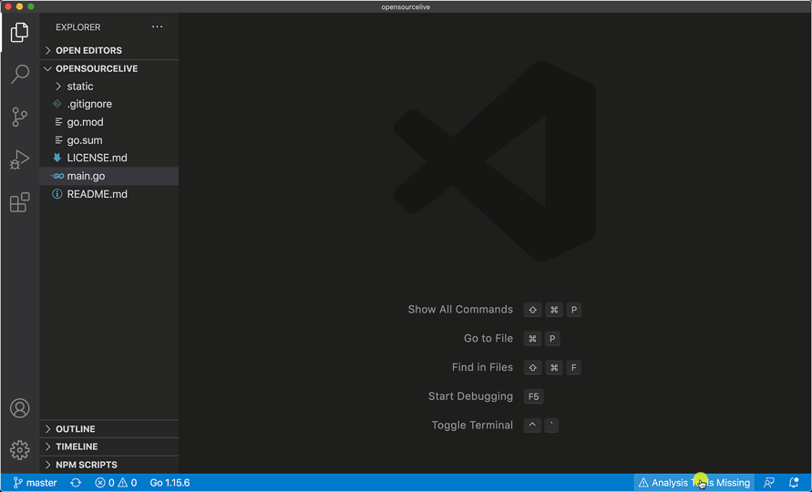

# WEEK021 - 使用 Visual Studio Code 进行 Go 开发

[Visual Studio Code](https://code.visualstudio.com/)（简称 VS Code）是微软于 2015 年 4 月在微软开发者大会（Microsoft Build 2015）上开源的一款非常优秀的跨平台源代码编辑器，它不仅原生支持 JavaScript、TypeScript、CSS 和 HTML，而且可以通过强大的插件系统支持其他任意的编程语言，比如：[Python](https://marketplace.visualstudio.com/items?itemName=ms-python.python)、[Java](https://marketplace.visualstudio.com/items?itemName=vscjava.vscode-java-pack)、[C/C++](https://marketplace.visualstudio.com/items?itemName=ms-vscode.cpptools)、[Go](https://marketplace.visualstudio.com/items?itemName=golang.Go) 等等。你可以在 [插件市场](https://marketplace.visualstudio.com/vscode) 找到更多其他的插件。通过统一的接口模型，VS Code 为不同的编程语言提供了统一的编程体验，你再也不需要在不同语言的 IDE 之间来回切换了。

VS Code 为不同的编程语言提供了如下通用的语言特性：

* 语法高亮（Syntax highlighting）、括号匹配（Bracket matching）
* 代码自动补全（IntelliSense）
* 语法检查（Linting and corrections）
* 代码导航（Go to Definition, Find All References）
* 调试
* 重构

VS Code 使用 [Monaco Editor](https://microsoft.github.io/monaco-editor/) 作为其底层的代码编辑器，不仅可以跨平台使用，而且还可以通过浏览器在线使用，你可以访问 [vscode.dev](https://vscode.dev/)，操作界面和桌面版几乎是一样的。在 2019 年的 Stack Overflow 组织的开发者调查中，VS Code 被认为是最受开发者欢迎的开发环境。

## 安装 Go 插件

[Go 语言](https://go.dev/) 又被称为 Golang，是 Google 开发的一种静态强类型、编译型、并发型，并具有垃圾回收功能的编程语言。它于 2007 年 9 月开始设计，并在 2009 年 11 月正式发布并完全开源，至今已有 13 年的历史了。目前的 Go 语言在国内外的技术社区都非常热门，并诞生了很多著名的开源项目，如 Kubernetes、etcd 和 Prometheus 等，在近年来热门的微服务架构和云原生技术的发展中起到了举足轻重的作用。

在这篇笔记中，我们将学习如何在 VS Code 中进行 Go 语言的开发。首先打开官网的 [Download and install](https://go.dev/doc/install) 页面，按照提示的步骤下载并安装 Go 语言开发环境，然后在 VS Code 中安装 [Go 插件](https://marketplace.visualstudio.com/items?itemName=golang.go)：

此时，我们只需要打开以 `.go` 结尾的文件，就可以激活该插件，左下角会显示出 [Go 的状态栏](https://github.com/golang/vscode-go/wiki/ui#using-the-go-status-bar)，并在状态栏上可以看到当前使用的 Go 版本：

另外，这个插件还依赖 [一些 Go 工具](https://github.com/golang/vscode-go/wiki/tools)，比如 [gopls](https://golang.org/s/gopls)、[dlv](https://github.com/go-delve/delve) 等。gopls 是 Go 官方的 language server，dlv 使用 Delve 进行 Go 语言的调试和测试，都是开发过程中必不可少的组件。如果其中任何一个工具缺失，VS Code 下面的状态栏就会弹出 `⚠️ Analysis Tools Missing` 的警告提示，点击提示将自动下载安装这些工具：

## Go 入门示例

https://go.dev/doc/

## 调试 Go 程序

https://github.com/golang/vscode-go/wiki/debugging

## 参考

1. [Go in Visual Studio Code](https://code.visualstudio.com/docs/languages/go)
1. [VSCode Go Wiki](https://github.com/golang/vscode-go/wiki)
