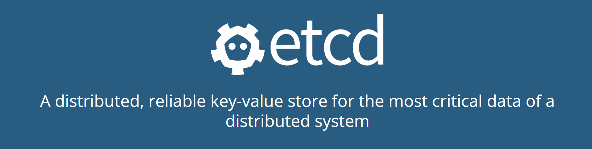
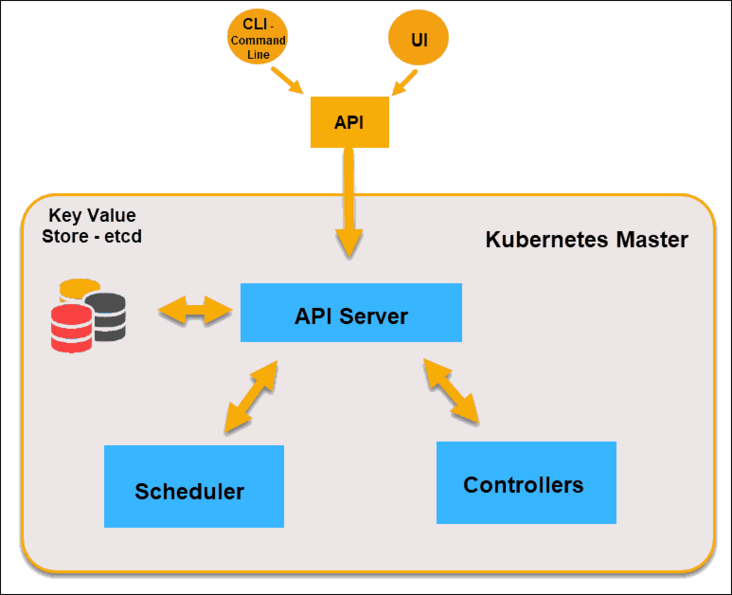

# WEEK022 - etcd 学习笔记

[etcd](https://etcd.io/) 是一个使用 Go 语言编写的用于存储分布式系统中的数据的高可用键值数据库（key-value store），它是 CoreOS 团队在 2013 年 6 月发起的开源项目，并在 2018 年 12 月正式加入 [CNCF](https://www.cncf.io/)。我们知道在 Linux 操作系统中有一个目录叫 `/etc`，它是专门用来存储操作系统配置的地方，`etcd` 这个名词就是源自于此，`etcd = etc + distibuted`，所以它的目的就是用来存储分布式系统中的关键数据。



etcd 内部采用 [Raft 一致性算法](http://thesecretlivesofdata.com/raft/)，以一致和容错的方式存储元数据。利用 etcd 可以实现包括配置管理、服务发现和协调分布式任务这些功能，另外 etcd 还提供了一些常用的分布式模式，包括领导选举，分布式锁和监控机器活动等。

etcd 已经被各大公司和开源项目广泛使用，最著名的莫过于 Kubernetes 就是使用 etcd 来存储配置数据的，etcd 的一致性对于正确安排和运行服务至关重要，Kubernetes 的 API Server 将集群状态持久化在 etcd 中，通过 etcd 的 Watch API 监听集群，并发布关键的配置更改。



## 快速开始

这一节我们将学习如何在本地快速启动一个单节点的 etcd 服务，并学习 etcd 的基本使用。

### 安装

首先从 [GitHub Releases](https://github.com/etcd-io/etcd/releases/) 页面下载和你的操作系统对应的最新版本：

```
$ curl -LO https://github.com/etcd-io/etcd/releases/download/v3.4.20/etcd-v3.4.20-linux-amd64.tar.gz
```

解压并安装到 `/usr/local/etcd` 目录：

```
$ tar xzvf etcd-v3.4.20-linux-amd64.tar.gz -C /usr/local/etcd --strip-components=1
```

目录下包含了 `etcd` 和 `etcdctl` 两个可执行文件，`etcdctl` 是 `etcd` 的命令行客户端。另外，还包含一些 Markdown 文档：

```
$ ls /usr/local/etcd
Documentation  README-etcdctl.md  README.md  READMEv2-etcdctl.md  etcd  etcdctl
```

然后将 `/usr/local/etcd` 目录添加到 `PATH` 环境变量（如果要让配置永远生效，可以将下面一行添加到 `~/.profile` 文件中）：

```
export PATH=$PATH:/usr/local/etcd
```

至此，etcd 就安装好了，使用 `etcd --version` 检查版本：

```
$ etcd --version
etcd Version: 3.4.20
Git SHA: 1e26823
Go Version: go1.16.15
Go OS/Arch: linux/amd64
```

### 启动

直接不带参数运行 `etcd` 命令，即可启动一个单节点的 etcd 服务（a single-member cluster of etcd）：

```
$ etcd
[WARNING] Deprecated '--logger=capnslog' flag is set; use '--logger=zap' flag instead
2022-09-06 07:21:49.244548 I | etcdmain: etcd Version: 3.4.20
2022-09-06 07:21:49.253270 I | etcdmain: Git SHA: 1e26823
2022-09-06 07:21:49.253486 I | etcdmain: Go Version: go1.16.15
2022-09-06 07:21:49.253678 I | etcdmain: Go OS/Arch: linux/amd64
2022-09-06 07:21:49.253846 I | etcdmain: setting maximum number of CPUs to 8, total number of available CPUs is 8
2022-09-06 07:21:49.253981 W | etcdmain: no data-dir provided, using default data-dir ./default.etcd
2022-09-06 07:21:49.254907 N | etcdmain: the server is already initialized as member before, starting as etcd member...
[WARNING] Deprecated '--logger=capnslog' flag is set; use '--logger=zap' flag instead
2022-09-06 07:21:49.264084 I | embed: name = default
2022-09-06 07:21:49.264296 I | embed: data dir = default.etcd
2022-09-06 07:21:49.264439 I | embed: member dir = default.etcd/member
2022-09-06 07:21:49.264667 I | embed: heartbeat = 100ms
2022-09-06 07:21:49.264885 I | embed: election = 1000ms
2022-09-06 07:21:49.265079 I | embed: snapshot count = 100000
2022-09-06 07:21:49.265244 I | embed: advertise client URLs = http://localhost:2379
2022-09-06 07:21:49.265389 I | embed: initial advertise peer URLs = http://localhost:2380
2022-09-06 07:21:49.265681 I | embed: initial cluster =
2022-09-06 07:21:49.302456 I | etcdserver: restarting member 8e9e05c52164694d in cluster cdf818194e3a8c32 at commit index 5
raft2022/09/06 07:21:49 INFO: 8e9e05c52164694d switched to configuration voters=()
raft2022/09/06 07:21:49 INFO: 8e9e05c52164694d became follower at term 2
raft2022/09/06 07:21:49 INFO: newRaft 8e9e05c52164694d [peers: [], term: 2, commit: 5, applied: 0, lastindex: 5, lastterm: 2]
2022-09-06 07:21:49.312871 W | auth: simple token is not cryptographically signed
2022-09-06 07:21:49.319814 I | etcdserver: starting server... [version: 3.4.20, cluster version: to_be_decided]
raft2022/09/06 07:21:49 INFO: 8e9e05c52164694d switched to configuration voters=(10276657743932975437)
2022-09-06 07:21:49.329816 I | etcdserver/membership: added member 8e9e05c52164694d [http://localhost:2380] to cluster cdf818194e3a8c32
2022-09-06 07:21:49.331278 N | etcdserver/membership: set the initial cluster version to 3.4
2022-09-06 07:21:49.331489 I | etcdserver/api: enabled capabilities for version 3.4
2022-09-06 07:21:49.333146 I | embed: listening for peers on 127.0.0.1:2380
raft2022/09/06 07:21:50 INFO: 8e9e05c52164694d is starting a new election at term 2
raft2022/09/06 07:21:50 INFO: 8e9e05c52164694d became candidate at term 3
raft2022/09/06 07:21:50 INFO: 8e9e05c52164694d received MsgVoteResp from 8e9e05c52164694d at term 3
raft2022/09/06 07:21:50 INFO: 8e9e05c52164694d became leader at term 3
raft2022/09/06 07:21:50 INFO: raft.node: 8e9e05c52164694d elected leader 8e9e05c52164694d at term 3
2022-09-06 07:21:50.419379 I | etcdserver: published {Name:default ClientURLs:[http://localhost:2379]} to cluster cdf818194e3a8c32
2022-09-06 07:21:50.419988 I | embed: ready to serve client requests
2022-09-06 07:21:50.427600 N | embed: serving insecure client requests on 127.0.0.1:2379, this is strongly discouraged!
```

该命令会在当前位置创建一个 `./default.etcd` 目录作为数据目录，并监听 2379 和 2380 两个端口，`http://localhost:2379` 为 `advertise-client-urls`，表示建议使用的客户端通信 url，可以配置多个，`etcdctl` 就是通过这个 url 来访问 `etcd` 的；`http://localhost:2380` 为 `advertise-peer-urls`，表示用于节点之间通信的 url，也可以配置多个，集群内部通过这些 url 进行数据交互（如选举，数据同步等）。

### 测试

打开另一个终端，输入 `etcdctl put` 命令可以向 etcd 中以键值对的形式写入数据：

```
$ etcdctl put hello world
OK
```

然后使用 `etcdctl get` 命令可以根据键值读取数据：

```
$ etcdctl get hello
hello
world
```

## 参考

1. [Etcd Quickstart](https://etcd.io/docs/v3.5/quickstart/) - Get etcd up and running in less than 5 minutes!
1. [Etcd 官方文档中文版](https://doczhcn.gitbook.io/etcd/)
1. [Etcd 教程](http://www.codebaoku.com/etcd/etcd-index.html)
1. [etcd 教程](https://www.tizi365.com/archives/557.html)
1. [七张图了解Kubernetes内部的架构](https://segmentfault.com/a/1190000022973856)
