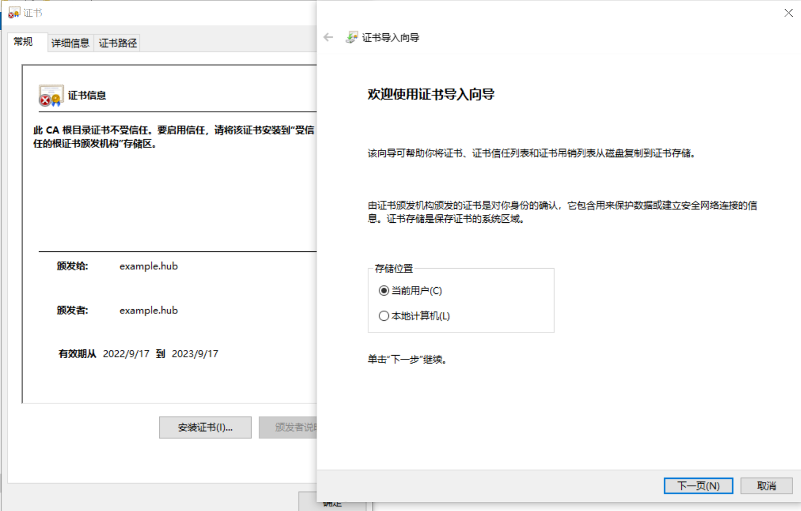
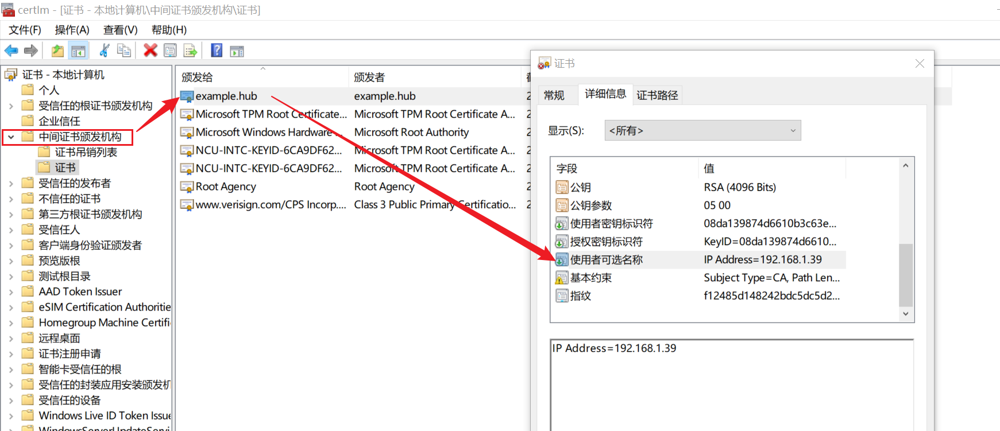

# WEEK023 - 搭建自己的镜像仓库

镜像仓库（Docker Registry）是用于存储和管理镜像的地方，方便将镜像分发到世界各地，镜像仓库一般分为公共仓库和私有仓库两种形式。

Docker 官方的 [Docker Hub](https://hub.docker.com/) 是最常用的公共仓库之一，包含很多高质量的官方镜像，这也是 Docker 默认使用的仓库，除此之外，还有 Red Hat 的 [Quay.io](https://quay.io/repository/)，Google 的 [Google Container Registry](https://cloud.google.com/container-registry/)（Kubernetes 就是使用 GCR 作为默认的镜像仓库），以及 GitHub 的 [ghcr.io](https://docs.github.com/cn/packages/working-with-a-github-packages-registry/working-with-the-container-registry) 等。国内一些云服务商也提供类似的服务，比如 [网易云镜像服务](https://c.163.com/hub#/m/library/)、[DaoCloud 镜像市场](https://hub.daocloud.io/)、[阿里云容器镜像服务（ACR）](https://www.aliyun.com/product/acr?source=5176.11533457) 等。另外还有些服务商提供了针对 Docker Hub 的镜像服务（Registry Mirror），这些镜像服务被称为 **加速器**，比如 [DaoCloud 加速器](https://www.daocloud.io/mirror)，使用加速器会直接从国内的地址下载 Docker Hub 的镜像，比直接从 Docker Hub 下载快得多。

除公开仓库外，用户也可以在本地搭建私有镜像仓库。通过官方提供的 [Docker Registry](https://hub.docker.com/_/registry/) 镜像，可以很容易搭建一个自己的镜像仓库服务，这个仓库服务提供了 [Docker Registry API](https://docs.docker.com/registry/spec/api/) 相关的接口，并没有图形界面，不过对 Docker 命令来说已经足够了。如果还需要一些高级特性，可以尝试 [Harbor](https://github.com/goharbor/harbor) 或 [Sonatype Nexus](https://www.sonatype.com/products/nexus-repository)，他们不仅提供了图形界面，还具有镜像维护、用户管理、访问控制等高级功能。

## 使用 Docker Registry 搭建私有镜像仓库

首先下载 [Docker Registry](https://hub.docker.com/_/registry/) 镜像：

```
$ docker pull registry:latest
```

目前最新的 registry 版本是 2.8，它是基于 [Distribution](https://github.com/distribution/distribution) 实现的，老版本的 registry 是基于 [docker-registry](https://github.com/docker-archive/docker-registry) 实现的，现在已经几乎不用了。*Distribution* 是 [OCI Distribution Specification](https://github.com/opencontainers/distribution-spec) 的开源实现，很多其他的镜像仓库项目如 Docker Hub、GitHub Container Registry、GitLab Container Registry、DigitalOcean Container Registry、Harbor Project、VMware Harbor Registry 都是以 *Distribution* 为基础开发的。

使用 docker 命令启动镜像仓库：

```
$ docker run -d -p 5000:5000 --name registry registry:latest
```

这样我们的私有镜像仓库就搭建好了。为了验证这个镜像仓库是否可用，我们可以从官方随便下载一个镜像（这里我使用的是 `hello-world` 镜像），然后通过 `docker tag` 在镜像名前面加上私有仓库的地址 `localhost:5000/`，再通过 `docker push` 就可以将这个镜像推送到我们的私有仓库里了：

```
$ docker pull hello-world
$ docker tag hello-world localhost:5000/hello-world
$ docker push localhost:5000/hello-world
```

### 使用 Docker Registry API 访问仓库

我们可以通过 [Docker Registry API](https://docs.docker.com/registry/spec/api/) 暴露的一些接口来访问仓库，比如使用 `/v2/_catalog` 接口查询仓库中有哪些镜像：

```
$ curl -s http://localhost:5000/v2/_catalog | jq
{
  "repositories": [
    "hello-world"
  ]
}
```

使用 `/v2/<name>/tags/list` 接口查询某个镜像的标签：

```
$ curl -s http://localhost:5000/v2/hello-world/tags/list | jq
{
  "name": "hello-world",
  "tags": [
    "latest"
  ]
}
```

使用 `/v2/<name>/manifests/<reference>` 接口查询某个镜像版本的详细信息：

```
$ curl -s http://localhost:5000/v2/hello-world/manifests/latest | jq
{
  "schemaVersion": 1,
  "name": "hello-world",
  "tag": "latest",
  "architecture": "amd64",
  "fsLayers": [
    {
      "blobSum": "sha256:a3ed95caeb02ffe68cdd9fd84406680ae93d633cb16422d00e8a7c22955b46d4"
    },
    {
      "blobSum": "sha256:2db29710123e3e53a794f2694094b9b4338aa9ee5c40b930cb8063a1be392c54"
    }
  ],
  "history": [
    {
      "v1Compatibility": "{\"architecture\":\"amd64\",\"config\":{\"Hostname\":\"\",\"Domainname\":\"\",\"User\":\"\",\"AttachStdin\":false,\"AttachStdout\":false,\"AttachStderr\":false,\"Tty\":false,\"OpenStdin\":false,\"StdinOnce\":false,\"Env\":[\"PATH=/usr/local/sbin:/usr/local/bin:/usr/sbin:/usr/bin:/sbin:/bin\"],\"Cmd\":[\"/hello\"],\"Image\":\"sha256:b9935d4e8431fb1a7f0989304ec86b3329a99a25f5efdc7f09f3f8c41434ca6d\",\"Volumes\":null,\"WorkingDir\":\"\",\"Entrypoint\":null,\"OnBuild\":null,\"Labels\":null},\"container\":\"8746661ca3c2f215da94e6d3f7dfdcafaff5ec0b21c9aff6af3dc379a82fbc72\",\"container_config\":{\"Hostname\":\"8746661ca3c2\",\"Domainname\":\"\",\"User\":\"\",\"AttachStdin\":false,\"AttachStdout\":false,\"AttachStderr\":false,\"Tty\":false,\"OpenStdin\":false,\"StdinOnce\":false,\"Env\":[\"PATH=/usr/local/sbin:/usr/local/bin:/usr/sbin:/usr/bin:/sbin:/bin\"],\"Cmd\":[\"/bin/sh\",\"-c\",\"#(nop) \",\"CMD [\\\"/hello\\\"]\"],\"Image\":\"sha256:b9935d4e8431fb1a7f0989304ec86b3329a99a25f5efdc7f09f3f8c41434ca6d\",\"Volumes\":null,\"WorkingDir\":\"\",\"Entrypoint\":null,\"OnBuild\":null,\"Labels\":{}},\"created\":\"2021-09-23T23:47:57.442225064Z\",\"docker_version\":\"20.10.7\",\"id\":\"a1f125167a7f2cffa48b7851ff3f75e983824c16e8da61f20765eb55f7b3a594\",\"os\":\"linux\",\"parent\":\"cd13bf215b21e9bc78460fa5070860a498671e2ac282d86d15042cf0c26e6e8b\",\"throwaway\":true}"
    },
    {
      "v1Compatibility": "{\"id\":\"cd13bf215b21e9bc78460fa5070860a498671e2ac282d86d15042cf0c26e6e8b\",\"created\":\"2021-09-23T23:47:57.098990892Z\",\"container_config\":{\"Cmd\":[\"/bin/sh -c #(nop) COPY file:50563a97010fd7ce1ceebd1fa4f4891ac3decdf428333fb2683696f4358af6c2 in / \"]}}"
    }
  ],
  "signatures": [
    {
      "header": {
        "jwk": {
          "crv": "P-256",
          "kid": "6GC6:JFLS:HP3P:WWBW:V4RI:BJKW:64GB:NSAO:Y4U6:UT6M:MSLJ:QG6K",
          "kty": "EC",
          "x": "Q1gHvt0A-Q-Pu8hfm2o-hLST0b-XZlEQcn9kYHZzAi0",
          "y": "oNddnJzLNOMcRcEebuEqZiapZHHmQSZHnnnaSkvYUaE"
        },
        "alg": "ES256"
      },
      "signature": "NthpjcYe39XSmnKRz9dlSWZBcpIgqIXuFGhQ4bxALK97NsWAZPE6CSiLwEn3ECjm1ovKzjJthOAuK_CW92ju-Q",
      "protected": "eyJmb3JtYXRMZW5ndGgiOjIwOTIsImZvcm1hdFRhaWwiOiJDbjAiLCJ0aW1lIjoiMjAyMi0wOS0xNFQyMzo1ODozM1oifQ"
    }
  ]
}
```

除了这三个比较常用的查询类接口，Docker Registry API 还有一些用于上传和下载的接口，具体的内容可以查看这里的 [接口列表](https://docs.docker.com/registry/spec/api/#detail)。

### 使用 `crane` 工具操作仓库

使用 Docker Registry API 操作镜像仓库不是那么方便，使用 docker 命令访问镜像仓库必须依赖 Docker Daemon 服务，有没有一款命令行工具可以直接用来操作镜像仓库呢？

[google/go-containerregistry](https://github.com/google/go-containerregistry) 是 Google 开源的一个专门操作镜像仓库的 Go 类库，并且 Google 还基于此类库实现了一个小工具 [crane](https://github.com/google/go-containerregistry/blob/main/cmd/crane/README.md)，大大地方便了我们查看或管理远程仓库中的镜像。

如果我们的镜像仓库开启了用户认证（参见下一节），需要在使用之前先通过 `crane auth login` 登录：

```
$ crane auth login localhost:5000 -u admin -p passw0rd
```

使用 `crane catalog` 列出所有镜像：

```
$ crane catalog localhost:5000 --insecure
```

使用 `crane ls` 列出某个镜像的所有标签：

```
$ crane ls localhost:5000/hello-world --insecure
```

使用 `crane pull` 下载镜像，并保存到一个 tar 文件中：

```
$ crane pull localhost:5000/hello-world hello-world.tar --insecure
```

使用 `crane push` 将一个 tar 文件上传到镜像仓库：

```
$ crane push hello-world.tar localhost:5000/hello-world --insecure
```

### 删除镜像

使用 `crane` 删除镜像要稍微复杂一点，首先使用 `crane digest` 获取某个镜像的摘要值（digest value）：

```
$ crane digest localhost:5000/hello-world:latest --insecure
sha256:3d1aa3d49e778503d60d3ba718eaf04bc8fa2262bff980edf3fb8c01779cd8a9
```

然后通过这个摘要值来删除镜像：

```
$ crane delete localhost:5000/hello-world@sha256:3d1aa3d49e778503d60d3ba718eaf04bc8fa2262bff980edf3fb8c01779cd8a9 --insecure
```

不过默认情况下会报错，因为我们没有开启删除镜像的功能：

```
Error: DELETE https://localhost:5000/v2/hello-world/manifests/sha256:3d1aa3d49e778503d60d3ba718eaf04bc8fa2262bff980edf3fb8c01779cd8a9: UNSUPPORTED: The operation is unsupported.
```

可以在启动镜像仓库时加上 `REGISTRY_STORAGE_DELETE_ENABLED=true` 环境变量，或在配置文件中加上该配置：

```
registry:
  storage:
    delete:
      enabled: true
```

删除之后，通过 `crane ls` 确认 `hello-world:latest` 已删除：

```
$ crane ls localhost:5000/hello-world --insecure
```

不过此时使用 `crane catalog` 还是能看到这个镜像的，说明只是标签被删了：

```
$ crane catalog localhost:5000 --insecure
hello-world
```

根据 distribution 项目上的一个 [Issuse](https://github.com/distribution/distribution/issues/2434) 大概了解到，Docker Registry API 只能删除 manifests 和 layers，不能删除 repository。如果真要删除，可以手工把 `/var/lib/registry/docker/registry/v2/repositories/hello-world` 这个目录删掉。

另外有一点需要注意的是，通过 API 删除镜像并不能删除磁盘上未引用的 Blobs 文件，所以如果你想要释放磁盘空间，还需要手工对 Docker Registry 执行 [垃圾回收（Garbage collection）](https://docs.docker.com/registry/garbage-collection/)。

进入 registry 容器：

```
$ docker exec -it registry /bin/sh
```

通过 `registry garbage-collect` 命令垃圾回收，真正执行前可以先加上一个 `--dry-run` 参数，可以看到执行后命令会删除哪些内容：

```
/ # registry garbage-collect --delete-untagged --dry-run /etc/docker/registry/config.yml
hello-world

0 blobs marked, 3 blobs and 0 manifests eligible for deletion
blob eligible for deletion: sha256:3d1aa3d49e778503d60d3ba718eaf04bc8fa2262bff980edf3fb8c01779cd8a9
blob eligible for deletion: sha256:7f760066df116957589ba45a8ca84fe03373d15fdf1752c9b60f24ecbff5a870
blob eligible for deletion: sha256:feb5d9fea6a5e9606aa995e879d862b825965ba48de054caab5ef356dc6b3412
```

确认无误后，开始执行垃圾回收：

```
/ # registry garbage-collect --delete-untagged /etc/docker/registry/config.yml
hello-world

0 blobs marked, 3 blobs and 0 manifests eligible for deletion
blob eligible for deletion: sha256:3d1aa3d49e778503d60d3ba718eaf04bc8fa2262bff980edf3fb8c01779cd8a9
INFO[0000] Deleting blob: /docker/registry/v2/blobs/sha256/3d/3d1aa3d49e778503d60d3ba718eaf04bc8fa2262bff980edf3fb8c01779cd8a9  go.version=go1.16.15 instance.id=74e3fb6e-ac44-4c96-923a-5cc6d5e5342a service=registry
blob eligible for deletion: sha256:7f760066df116957589ba45a8ca84fe03373d15fdf1752c9b60f24ecbff5a870
INFO[0000] Deleting blob: /docker/registry/v2/blobs/sha256/7f/7f760066df116957589ba45a8ca84fe03373d15fdf1752c9b60f24ecbff5a870  go.version=go1.16.15 instance.id=74e3fb6e-ac44-4c96-923a-5cc6d5e5342a service=registry
blob eligible for deletion: sha256:feb5d9fea6a5e9606aa995e879d862b825965ba48de054caab5ef356dc6b3412
INFO[0000] Deleting blob: /docker/registry/v2/blobs/sha256/fe/feb5d9fea6a5e9606aa995e879d862b825965ba48de054caab5ef356dc6b3412  go.version=go1.16.15 instance.id=74e3fb6e-ac44-4c96-923a-5cc6d5e5342a service=registry
```

执行结束后查看磁盘空间是否释放：

```
/ # df -h | grep /var/lib/registry
```

## 开启 TLS 和安全认证

上面我们用一行命令就搭建了一个私有仓库，不过这个私有仓库几乎没什么安全性，只能在本地测试用。Docker 默认是以 HTTPS 方式连接除 localhost 之外的仓库的，当从其他机器访问这个不安全的仓库地址时会报下面这样的错：

```
$ docker pull 192.168.1.39:5000/hello-world
Using default tag: latest
Error response from daemon: Get "https://192.168.1.39:5000/v2/": http: server gave HTTP response to HTTPS client
```

如果真要用也可以，需要修改 Docker 的配置文件 `/etc/docker/daemon.json`，将这个地址添加到 `insecure-registries` 配置项中：

```
{
  "insecure-registries" : ["192.168.1.39:5000"]
}
```

然后重启 Docker 后即可。

不过这种方式非常不安全，不仅容易遭受中间人攻击（MITM），而且有一些限制，比如不能开启用户认证，也就是说你这个镜像仓库是赤裸裸的暴露在任何人面前。如果要搭建一套生产环境使用的镜像仓库，我们必须做得更安全一点。

### 开启 TLS 安全

我们首先需要 [获得一份 TLS 证书](https://docs.docker.com/registry/deploying/#get-a-certificate)，官方文档中要求你拥有一个 HTTPS 域名，并从权威的 CA 机构获得一份证书，不过大多数人估计都没这个条件，所以我们 [使用自签名证书](https://docs.docker.com/registry/insecure/#use-self-signed-certificates)（self-signed certificate）。

创建一个 `certs` 目录：

```
$ mkdir -p certs
```

使用 `openssl req` 生成证书：

```
$ openssl req \
  -newkey rsa:4096 -nodes -sha256 -keyout certs/domain.key \
  -addext "subjectAltName = IP:192.168.1.39" \
  -x509 -days 365 -out certs/domain.crt
```

注意这里要使用 `-addext` 参数添加 `subjectAltName` 扩展项，也就是 **Subject Alternative Name**，一般缩写为 **SAN**，表示我们的证书使用者是 IP 192.168.1.39，如果你有自己的域名，可以在 SAN 中指定 DNS：`-addext "subjectAltName = DNS:example.hub"`。

如果没有在证书的 SAN 中指定 IP，会报如下错误：

```
$ docker push 192.168.1.39:5000/registry:latest
The push refers to repository [192.168.1.39:5000/registry]
Get "https://192.168.1.39:5000/v2/": x509: cannot validate certificate for 192.168.1.39 because it doesn't contain any IP SANs
```

或者证书中 IP 和实际 IP 不匹配，也会报错：

```
$ docker push 192.168.1.39:5000/registry:latest
The push refers to repository [192.168.1.39:5000/registry]
Get "https://192.168.1.39:5000/v2/": x509: certificate is valid for 192.168.1.40, not 192.168.1.39
```

生成证书的过程中，还会提示你填写一些信息，这些信息被称为 **Distinguished Name**（简称 **DN**），可以酌情填写重要的，不想填的输入 `.` 留空即可：

```
You are about to be asked to enter information that will be incorporated
into your certificate request.
What you are about to enter is what is called a Distinguished Name or a DN.
There are quite a few fields but you can leave some blank
For some fields there will be a default value,
If you enter '.', the field will be left blank.
-----
Country Name (2 letter code) [AU]:CN
State or Province Name (full name) [Some-State]:AH
Locality Name (eg, city) []:HF
Organization Name (eg, company) [Internet Widgits Pty Ltd]:.
Organizational Unit Name (eg, section) []:
Common Name (e.g. server FQDN or YOUR name) []:example.hub
Email Address []:
```

命令执行成功后会在 `certs` 目录生成 `domain.crt` 和 `domain.key` 两个文件，然后通过下面的命令重新启动镜像仓库（先删除之前启动的），开启 TLS 安全功能：

```
$ docker run -d \
  -v "$(pwd)"/certs:/certs \
  -e REGISTRY_HTTP_TLS_CERTIFICATE=/certs/domain.crt \
  -e REGISTRY_HTTP_TLS_KEY=/certs/domain.key \
  -p 5000:5000 \
  --name registry \
  registry:latest
```

不过由于这个证书是我们自己颁发的，并不是系统可信证书，在使用时会报错：

```
$ docker push 192.168.1.39:5000/registry:latest
The push refers to repository [192.168.1.39:5000/registry]
Get "https://192.168.1.39:5000/v2/": x509: certificate signed by unknown authority
```

有两种方法可以解决这个问题，第一种方法和上面的 HTTP 形式一样，在配置文件中添加 `insecure-registries` 配置：

```
{
  "insecure-registries" : ["192.168.1.39:5000"]
}
```

第二种方法是让 Docker 服务信任这个证书。如果是 Linux 机器，可以将 `domain.crt` 文件放到 Docker 的证书目录 `/etc/docker/certs.d/192.168.1.39:5000/ca.crt` 下，立即生效，不用重启 Docker 服务；如果是 Windows 机器，直接双击证书文件，将证书安装到当前用户或本地计算机：



然后选择 *根据证书类型，自动选择证书存储*，默认会将证书安装到 *中间证书颁发机构* 下，也可以手工选择安装到 *受信任的根证书颁发机构* 下。安装完成后可以打开证书管理器（如果安装时存储位置选择的是当前用户，运行 `certmgr.msc`；如果是本地计算机，运行 `certlm.msc`）查看我们的证书：



需要重启 Docker 服务后生效。

### 开启用户认证

开启 TLS 之后，为了保证镜像仓库的安全性，还可以通过客户端认证机制只允许特定的客户端连接，配置参数为 `http.tls.clientcas`，可以配置多个客户端证书：

```
http:
  tls:
    certificate: /path/to/x509/public
    key: /path/to/x509/private
    clientcas:
      - /path/to/ca.pem
      - /path/to/another/ca.pem
```

不过这种方式不是很常用，更多的是使用 [Basic 认证机制](https://docs.docker.com/registry/deploying/#native-basic-auth)。Docker Registry 支持通过 [Apache htpasswd 文件](https://httpd.apache.org/docs/2.4/programs/htpasswd.html) 来实现用户认证功能，首先使用 `htpasswd` 命令来生成密码文件：

```
$ mkdir -p auth
$ docker run --entrypoint htpasswd httpd:2 -Bbn admin passw0rd > auth/htpasswd
```

`htpasswd` 命令内置在 Apache HTTPD 服务器里，我们这里直接使用了 `httpd:2` 镜像，生成的密码文件保存在 `auth` 目录下，密码是通过 [Bcrypt 算法](https://en.wikipedia.org/wiki/Bcrypt) 加密的，文件内容是这种格式：

```
admin:$2y$05$mzoaYiDmF7Bm2p/JWf4kje7naTzkyYpqgg5v8mZPq0HdDuSXZ1d0i
```

然后运行下面的命令，同时开启 TLS 功能和用户认证功能：

```
$ docker run -d \
  -v "$(pwd)"/certs:/certs \
  -e REGISTRY_HTTP_TLS_CERTIFICATE=/certs/domain.crt \
  -e REGISTRY_HTTP_TLS_KEY=/certs/domain.key \
  -v "$(pwd)"/auth:/auth \
  -e "REGISTRY_AUTH=htpasswd" \
  -e "REGISTRY_AUTH_HTPASSWD_REALM=Registry Realm" \
  -e REGISTRY_AUTH_HTPASSWD_PATH=/auth/htpasswd \
  -p 5000:5000 \
  --name registry \
  registry:latest
```

这时访问镜像仓库报错：

```
$ docker push 192.168.1.39:5000/hello-world
no basic auth credentials
```

需要先 `docker login` 登录：

```
$ docker login 192.168.1.39:5000
```

登录成功后，就可以正常操作镜像仓库了。需要特别注意的是，登录后的用户名和密码会以 BASE64 的形式保存在 `~/.docker/config.json` 文件中：

```json
{
  "auths": {
    "192.168.1.39:5000": {
      "auth": "YWRtaW46cGFzc3cwcmQ="
    }
  }
}
```

这是很不安全的，你可以考虑使用其他的 [Credentials store](https://docs.docker.com/engine/reference/commandline/login/#credentials-store) 来保存你的用户名和密码。

另外，除了使用 Basic 用户认证，Docker Registry 还支持 [使用认证服务器实现更复杂的 OAuth 2.0 认证](https://docs.docker.com/registry/spec/auth/token/)。

## 参考

1. [仓库 - Docker — 从入门到实践](https://yeasy.gitbook.io/docker_practice/basic_concept/repository)
1. [私有仓库 - Docker — 从入门到实践](https://yeasy.gitbook.io/docker_practice/repository/registry)
1. [Docker Registry](https://docs.docker.com/registry/)
1. [How to delete images from a private docker registry?](https://stackoverflow.com/questions/25436742/how-to-delete-images-from-a-private-docker-registry)
1. [你必须知道的Docker镜像仓库的搭建](https://www.cnblogs.com/edisonchou/p/docker_registry_repository_setup_introduction.html)
1. [distribution/distribution](https://github.com/distribution/distribution) - The toolkit to pack, ship, store, and deliver container content
1. [google/go-containerregistry](https://github.com/google/go-containerregistry) - Go library and CLIs for working with container registries
1. [Housekeep your local image registry](https://zhimin-wen.medium.com/housekeep-your-local-image-registry-770db6c66306)

## 更多

### 1. 设置镜像仓库的存储驱动

镜像仓库本质上是一个文件存储和内容分发系统，可以通过 [Storage API](https://docs.docker.com/registry/storage-drivers/) 接口实现不同的存储驱动，官方支持下面这些存储驱动：

* [In-memory storage driver (testing only)](https://docs.docker.com/registry/storage-drivers/inmemory/)
* [Filesystem storage driver](https://docs.docker.com/registry/storage-drivers/filesystem/)
* [S3 storage driver](https://docs.docker.com/registry/storage-drivers/s3/)
* [Microsoft Azure storage driver](https://docs.docker.com/registry/storage-drivers/azure/)
* [OpenStack Swift storage driver](https://docs.docker.com/registry/storage-drivers/swift/)
* [Aliyun OSS storage driver](https://docs.docker.com/registry/storage-drivers/oss/)
* [Google Cloud Storage driver](https://docs.docker.com/registry/storage-drivers/gcs/)

### 2. 使用图形界面管理镜像仓库

这篇文章主要介绍了通过 Docker Registry API 和命令行两种方式对镜像仓库进行管理，这也是管理镜像仓库最基础的方式。篇幅有限，还有很多其他图形化的方式没有介绍，这些项目的底层依赖或实现原理大抵是一样的，下面是一个简单的列表：

* [Docker Registry UI](https://github.com/Joxit/docker-registry-ui) - The simplest and most complete UI for your private registry
* [SUSE/Portus](https://github.com/SUSE/Portus) - Authorization service and frontend for Docker registry (v2)
* [Harbor](https://github.com/goharbor/harbor) - An open source trusted cloud native registry project that stores, signs, and scans content.
* [Sonatype Nexus](https://www.sonatype.com/products/nexus-repository) - Manage binaries and build artifacts across your software supply chain.
