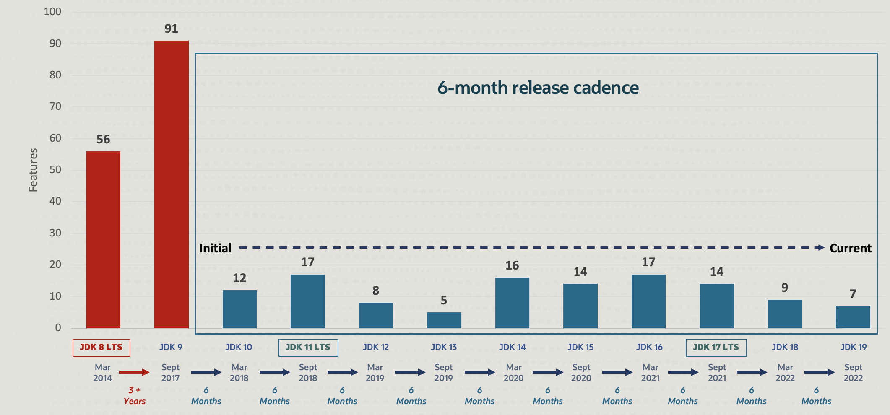
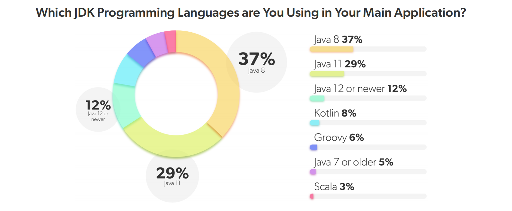

# WEEK024 - Java 8 之 Stream API 用法总结

Java 编程语言发展迅速，从 Java 9 开始，Java 采取了小步迭代的发布方式，以每 6 个月发布一个版本的速度在持续更新，[目前最新的版本已经升到 19 了](https://blogs.oracle.com/java/post/the-arrival-of-java-19)：



尽管如此，据 [JRebel](https://www.jrebel.com/) 2022 年发布的 [Java 开发者生产力报告](https://www.jrebel.com/resources/java-developer-productivity-report-2022) 显示，Java 8 作为第一个 LTS 版本（另两个是 Java 11 和 17），仍然是使用最多的一个版本。



Java 8 由 Oracle 公司于 2014 年 3 月 18 日发布，在这个版本中新增了大量的特性，首次引入了 Lambda 表达式和方法引用，开启了 Java 语言函数式编程的大门，其中新增的 Stream API（`java.util.stream`）特性更是将函数式编程发挥到了淋漓尽致的地步。

## Stream API 概述

在 Java 8 之前，处理集合数据的常规方法是 `for` 循环：

```java
List<String> words = List.of("A", "B", "C");
for (String word: words) {
    System.out.println(word.toLowerCase());
}
```

或者使用 `iterator` 迭代器：

```java
List<String> words = List.of("A", "B", "C");
Iterator<String> iterator = words.iterator();
while (iterator.hasNext()) {
    System.out.println(iterator.next().toLowerCase());
}
```

这种集合的遍历方式被称为 `外部迭代`，也就是说由用户来决定 “做什么”（大写转小写） 和 “怎么做”（通过 `for` 或 `iterator` 遍历）。

而在 Java 8 中，新增的 Stream API 通过 `内部迭代` 来处理集合数据，使用了 [访问者设计模式（Visitor Pattern）](https://en.wikipedia.org/wiki/Visitor_pattern)，用户只需要通过函数式的方法提供 “做什么” 即可，“怎么做” 交给 Stream API 内部实现：

```java
List<String> words = List.of("A", "B", "C");
words.stream().forEach(word -> System.out.println(word.toLowerCase()));
```

使用内部迭代可以让用户更聚焦待解决的问题，编写代码不易出错，而且通常编写的代码更少也更易读。这是 Stream API 的一大特征。

另外，正如 Stream API 的名字一样，Stream API 中有很多方法都会返回流对象本身，于是我们就可以将多个操作串联起来形成一个管道（*pipeline*），写出下面这样流式风格（*fluent style*）的代码：

```java
List<String> names = students.stream()
    .filter(s -> s.getScore() >= 60)
    .sorted((x, y) -> x.getScore() - y.getScore())
    .map(Student::getName)
    .collect(Collectors.toList());
```

## Stream API 使用

### 流的创建

JDK 中提供了很多途径来创建一个流，这一节总结一些常用的创建流的方法。流有一个很重要的特性：**不会对数据源进行修改**，所以我们可以对同一个数据源创建多个流。

#### 创建一个空流

我们可以通过 `Stream.empty()` 创建一个不包含任何数据的空流：

```java
Stream<String> streamEmpty = Stream.empty();
```

在代码中使用空指针是一种不好的编程风格，空流的作用就是为了避免在程序中返回空指针：

```java
public Stream<String> streamOf(List<String> list) {
    return list == null || list.isEmpty() ? Stream.empty() : list.stream();
}
```

#### 从集合类创建流

JDK 中自带了大量的集合类，比如 `List`、`Set` 和 `Queue` 以及它们的子类，这些类都继承自 `Collection` 接口：


注意 `Map` 不是集合类，但是 `Map` 中的 `keySet()`、`values()` 和 `entrySet()` 方法返回的是集合类。

我们可以通过任何一个集合类的 `stream()` 方法创建一个流：

```java
List<String> collection = Arrays.asList("a", "b", "c");
Stream<String> streamOfCollection = collection.stream();
```

#### 从数组创建流

数组和集合类都是用于存储多个对象，只不过数组的长度固定，而集合的长度可变。我们可以使用 `Arrays.stream()` 静态方法从一个数组创建流：

```java
String[] array = new String[]{"a", "b", "c"};
Stream<String> streamOfArray = Arrays.stream(array);
```

也可以使用 `Stream.of()` 方法来创建：

```java
Stream<String> streamOfArray2 = Stream.of(array);
```

由于 `Stream.of()` 函数的入参定义是一个可变参数，本质上是个数组，所以既可以像上面那样传入一个数组，也可以直接传入数组元素创建：

```java
Stream<String> streamOfArray3 = Stream.of("a", "b", "c");
```

#### 使用 `Stream.builder()` 手工创建流

有时候流中的数据不是来自某个数据源，而是需要手工添加，我们可以使用 `Stream.builder()` 方法手工创建流：

```java
Stream<String> streamOfBuilder = Stream.<String>builder()
    .add("a")
    .add("b")
    .add("c")
    .build();
```

也可以往 builder 中依次添加：

```java
Stream.Builder<String> builder = Stream.<String>builder();
builder.add("a");
builder.add("b");
builder.add("c");
Stream<String> streamOfBuilder2 = builder.build();
```

#### 使用 `Stream.generate()` 生成流

`Stream.generate()` 方法也可以用于手工创建流，这个方法需要提供一个 `Supplier<T>` 的实现，生成的是一个无限流，一般通过 `limit` 来限定数量：

```java
Stream<String> streamOfGenerate = Stream.generate(() -> "hello").limit(3);
```

上面的例子中通过 Lambda 表达式 `() -> "hello"` 一直生成 `hello` 字符串。如果要生成不一样的数据，可以将变量传到 Lambda 表达式中，比如下面的例子生成 1 2 3 这样的连续整数：

```java
AtomicInteger num = new AtomicInteger(0);
Stream<Integer> streamOfGenerate2 = Stream.generate(() -> num.incrementAndGet()).limit(3);
```

#### 使用 `Stream.iterate()` 生成流

在上面的例子中，我们通过将变量传到 Lambda 表达式来生成一个整数数列，像这种根据迭代来生成数据的场景，还有一种更简单的实现：

```java
Stream<Integer> streamOfIterate = Stream.iterate(1, n -> n + 1).limit(3);
```

`iterate()` 函数第一个参数为流的第一个元素，后续的元素通过第二个参数中的 `UnaryOperator<T>` 来迭代生成。

#### 生成基础类型的流

由于 `Stream<T>` 接口使用了泛型，它的类型参数只能是对象类型，所以我们无法生成基础类型的流，我们只能使用相应的封装类型来生成流，这样就会导致自动装箱和拆箱（**auto-boxing**），影响性能。

于是 JDK 提供了几个特殊的接口来方便我们创建基础类型的流。JDK 一共有 8 个基础类型，包括 4 个整数类型（`byte`、`short`、`int`、`long`），2 个浮点类型（`float`、`double`），1 个字符型（`char`）和 1 个布尔型（`boolean`），不过只提供了 3 个基础类型的流：`IntStream`、`LongStream` 和 `DoubleStream`。

基础类型流和普通流接口基本一致，我们可以通过上面介绍的各种方法来创建基础类型流。JDK 还针对不同的基础类型提供了相应的更便捷的生成流的方法，比如 `IntStream.range()` 函数用于方便的生成某个范围内的整数序列：

```java
IntStream intStream = IntStream.range(1, 4);
```

要注意的是这个数列是左闭右开的，不包含第二个参数，`IntStream.rangeClosed()` 函数生成的数列是左右都是闭区间：

```java
IntStream intStream2 = IntStream.rangeClosed(1, 3);
```

此外，`Random` 类也提供了一些生成基础类型流的方法，比如下面的代码生成 3 个随机的 `int` 型整数：

```java
IntStream intStream = new Random().ints(3);
```

生成随机的 `long` 和 `double` 类型：

```java
LongStream longStream = new Random().longs(3);
DoubleStream doubleStream = new Random().doubles(3);
```

### 中间操作

### 结束操作

## 参考

1. [Java8 Stream的总结](https://juejin.cn/post/6844903565350141966)
1. [Java 8 新特性](https://www.runoob.com/java/java8-new-features.html)
1. https://www.runoob.com/java/java8-streams.html
1. https://www.baeldung.com/java-streams
1. https://www.baeldung.com/tag/java-streams/
1. https://www.cnblogs.com/wangzhuxing/p/10204894.html
1. https://www.cnblogs.com/yulinfeng/p/12561664.html
