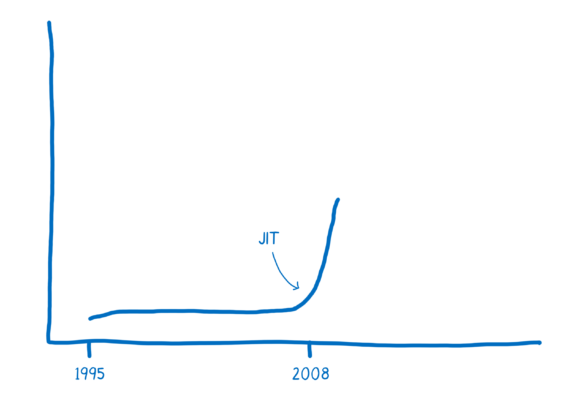
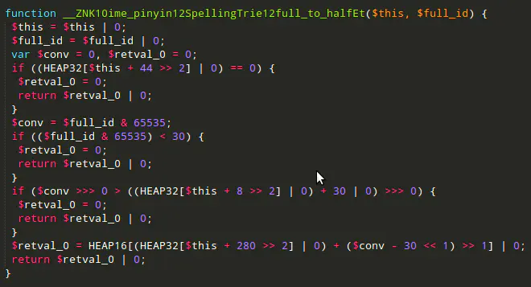
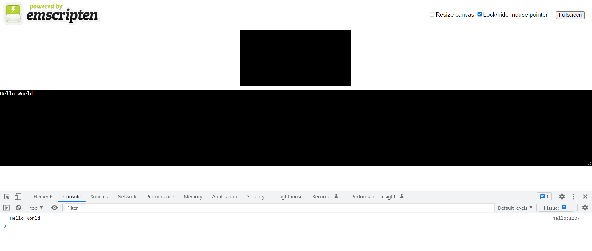
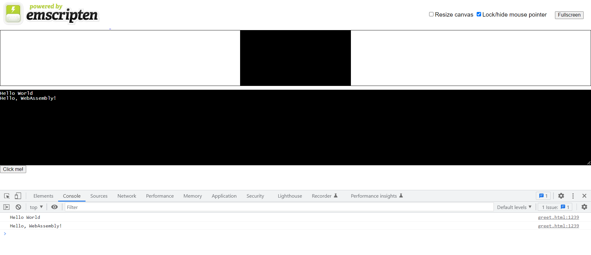
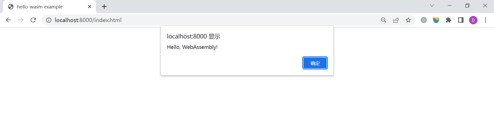
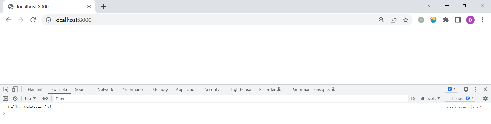
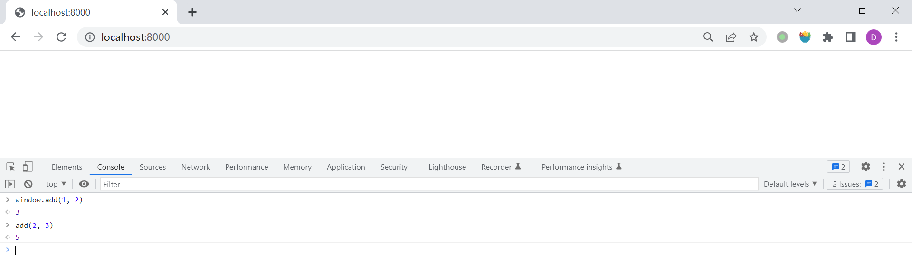

# WEEK025 - WebAssembly 学习笔记

[WebAssembly](https://webassembly.org/)（简称 WASM）是一种以安全有效的方式运行可移植程序的新兴 Web 技术，下面是引用 [MDN 上对它的定义](https://developer.mozilla.org/zh-CN/docs/WebAssembly)：

> WebAssembly 是一种新的编码方式，可以在现代的网络浏览器中运行 － 它是一种低级的类汇编语言，具有紧凑的二进制格式，可以接近原生的性能运行，并为诸如 C/C++ 等语言提供一个编译目标，以便它们可以在 Web 上运行。它也被设计为可以与 JavaScript 共存，允许两者一起工作。

也就是说，无论你使用的是哪一种语言，我们都可以将其转换为 WebAssembly 格式，并在浏览器中以原生的性能运行。WebAssembly 的开发团队来自 Mozilla、Google、Microsoft 和 Apple，分别代表着四大网络浏览器 Firefox、Chrome、Microsoft Edge 和 Safari，从 2017 年 11 月开始，这四大浏览器就开始实验性的支持 WebAssembly。当时 WebAssembly 还没有形成标准，这么多的浏览器开发商对某个尚未标准化的技术 [达成如此一致的意见](https://lists.w3.org/Archives/Public/public-webassembly/2017Feb/0002.html)，这在历史上是很罕见的，可以看出这绝对是一项值得关注的技术，被号称为 `the future of web development`。


WebAssembly 在 2019 年 12 月 5 日被万维网联盟（W3C）推荐为标准，与 HTML，CSS 和 JavaScript 一起，成为 Web 的第四种语言。

## WebAssembly 之前的历史

JavaScript 诞生于 1995 年 5 月，一个让人津津乐道的故事是，当时刚加入网景的 [Brendan Eich](https://zh.wikipedia.org/wiki/%E5%B8%83%E8%98%AD%E7%99%BB%C2%B7%E8%89%BE%E5%85%8B) 仅仅花了十天时间就开发出了 JavaScript 语言。开发 JavaScript 的初衷是为 HTML 提供一种脚本语言使得网页变得更动态，当时根本就没有考虑什么浏览器兼容性、安全性、移植性这些东西，对性能也没有特别的要求。但随着 Web 技术的发展，网页要解决的问题已经远不止简单的文本信息，而是包括了更多的高性能图像处理和 3D 渲染等方面，这时，JavaScript 的性能问题就凸显出来了。于是，如何让 JavaScript 执行的更快，变成了各大浏览器生产商争相竞逐的目标。

### 浏览器性能之战

这场关于浏览器的性能之战在 2008 年由 Google 带头打响，这一年的 9 月 2 日，Google 发布了一款跨时代的浏览器 Chrome，具备简洁的用户界面和极致的用户体验，内置的 [V8](https://v8.dev/) 引擎采用了全新的 JIT 编译（Just-in-time compilation，即时编译）技术，使得浏览器的响应速度得到了几倍的提升。次年，Apple 发布了他们的浏览器新版本 Safari 4，其中引入新的 Nitro 引擎（也被称为 SquirrelFish 或 [JavaScriptCore](https://trac.webkit.org/wiki/JavaScriptCore)），同样使用的是 JIT 技术。紧接着，Mozilla 在 Firefox 3.5 中引入 [TraceMonkey](https://en.wikipedia.org/wiki/SpiderMonkey) 技术，Microsoft 在 2011 年也推出 [Chakra](https://en.wikipedia.org/wiki/Chakra_(JScript_engine)) 引擎。

使用 JIT 技术，极大的提高了 JavaScript 的性能。那么 JIT 是如何工作的呢？我们知道，JavaScript 是解释型语言，因此传统的 JavaScript 引擎需要逐行读取 JavaScript 代码，并将其翻译成可执行的机器码。很显然这是极其低效的，如果有一段代码需要执行上千次，那么 JavaScript 引擎也会傻傻的翻译上千次。JIT 技术的基本思路就是缓存，它将执行频次比较高的代码实时编译成机器码，并缓存起来，当下次执行到同样代码时直接使用相应的机器码替换掉，从而获得极大的性能提升。另外，对于执行频次非常高的代码，JIT 引擎还会使用优化编译器（Optimising Compiler）编译出更高效的机器码。关于 JIT 技术的原理可以参考 [A crash course in just-in-time (JIT) compilers](https://hacks.mozilla.org/2017/02/a-crash-course-in-just-in-time-jit-compilers/) 这篇文章。

JIT 技术推出之后，JavaScript 的性能得到了飞速提升：



随着性能的提升，JavaScript 的应用范围也得到了极大的扩展，Web 内容变得更加丰富，图片、视频、游戏，等等等等，甚至有人将 JavaScript 用于后端开发（Node.js）。不过 JIT 也不完全是 “性能银弹”，因为通过 JIT 优化也是有一定代价的，比如存储优化后的机器码需要更多的内存，另外 JIT 优化对变量类型非常敏感，但是由于 JavaScript **动态类型** 的特性，用户代码中对某个变量的类型并不会严格固定，这时 JIT 优化的效果将被大打折扣。比如下面这段简单的代码：

```js
function arraySum(arr) {
  var sum = 0;
  for (var i = 0; i < arr.length; i++) {
    sum += arr[i];
  }
}
```

假设 JIT 检测到 `sum += arr[i];` 这行代码被执行了很多次，开始对其进行编译优化，它首先需要确认 `sum`、`arr`、`i` 和 `arr[i]` 这些变量的类型，如果 `arr[i]` 是 `int` 类型，这就是整数相加的操作，但如果 `arr[i]` 是 `string` 类型，这又变成了字符串拼接的操作，这两种情况编译成的机器码是完全不同的。所以 JIT 引擎会先根据代码执行情况假设变量为某种类型，然后再进行优化，当执行时会对类型进行检测，一旦检测到类型不同时，这个 JIT 优化将被作废，这个过程叫做 **去优化**（deoptimization，或者 bailing out）。假如用户写出这样的代码：

```js
arr = [1, "hello"];
```

JavaScript 这种动态类型的特点对 JIT 引擎是非常不友好的，反复的优化和去优化不仅无法提高性能，甚至会有副作用。所以在实际的生产环境中，JIT 的效果往往没有那么显著，通过 JIT 的优化很快就遇到了瓶颈。

但是日益丰富的 Web 内容对 JavaScript 的性能提出了更高的要求，尤其是 3D 游戏，这些游戏在 PC 上跑都很吃力，更别说在浏览器里运行了。如何让 JavaScript 执行地更快，是摆在各大浏览器生产商面前的一大难题，很快，Google 和 Mozilla 交出了各自的答卷。

### Google 的 NaCl 解决方案

Google 在 2008 年开源了 [NaCl 技术](https://developer.chrome.com/docs/native-client/nacl-and-pnacl/)，并在 2011 年的 Chrome 14 中正式启用。NaCl 的全称为 Native Client，这是一种可以在浏览器中执行原生代码（native code）的技术，听起来很像是 Microsoft 当时所使用的 [ActiveX](https://en.wikipedia.org/wiki/ActiveX) 技术，不过 ActiveX 由于其安全性一直被人所诟病。而 NaCl 定义了一套原生代码的安全子集，执行于独立的沙盒环境之中，并通过一套被称为 PPAPI（Pepper Plugin API）的接口来和 JavaScript 交互，避免了可能的安全问题。NaCl 采取了和 JIT 截然不同的 AOT 编译（Ahead-of-time compilation，即提前编译）技术，所以在性能上的表现非常突出，几乎达到了和原生应用一样的性能。不过由于 NaCl 应用是 C/C++ 语言编写的，与 CPU 架构强关联，不具有可移植性，因此需要针对不同的平台进行开发以及编译，用户使用起来非常痛苦。

为了解决这个问题，Google 在 2013 年又推出了 PNaCl 技术（Portable Native Client），PNaCl 的创新之处在于使用 [LLVM IR](https://llvm.org/docs/LangRef.html)（Intermediate Representation）来分发应用，而不是直接分发原生代码，LLVM IR 也被称为 Bitcode，它是一种平台无关的中间语言表示，实现了和 Java 一样的目标：一次编译，到处运行。

如果我们站在今天的视角来看，PNaCl 这项技术是非常超前的，它的核心理念和如今的 WebAssembly 如出一辙，只不过它出现的时机不对，当时很多人都对在浏览器中执行原生代码持怀疑态度，担心可能出现和 ActiveX 一样的安全问题，而且当时 HTML5 技术正发展的如火如荼，人们都在想着如何从浏览器中移除诸如 Flash 或 Java Applet 这些 JavaScript 之外的技术，所以 PNaCl 技术从诞生以来，一直不温不火，尽管后来 Firefox 和 Opera 等浏览器也开始支持 NaCl 和 PPAPI，但是一直无法得到普及（当时的 IE 还占领着浏览器市场的半壁江山）。

随着 WebAssembly 技术的发展，Google Chrome 最终在 2018 年移除了对 PNaCl 的支持，决定全面拥抱 WebAssembly 技术。

### Mozilla 的 asm.js 解决方案

2010 年，刚刚加入 Mozilla 的 [Alon Zakai](https://github.com/kripken) 在工作之余突发奇想，能不能将自己编写的 C/C++ 游戏引擎运行在浏览器上？当时 NaCl 技术还没怎么普及，Alon Zakai 一时之间并没有找到什么好的技术方案。好在 C/C++ 是强类型语言，JavaScript 是弱类型语言，所以将 C/C++ 代码转换为 JavaScript 在技术上是完全可行的。Alon Zakai 于是便开始着手编写这样的一个编译器，[Emscripten](https://emscripten.org/) 便由此诞生了！

Emscripten 和传统的编译器很类似，都是将某种语言转换为另一种语言形式，不过他们之间有着本质的区别。传统的编译器是将一种语言编译成某种 low-level 的语言，比如将 C/C++ 代码编译成二进制文件（机器码），这种编译器被称为 [Compiler](https://en.wikipedia.org/wiki/Compiler)；而 Emscripten 是将 C/C++ 代码编译成和它 same-level 的 JavaScript 代码，这种编译器被称为 Transpiler 或者 [Source to source compiler](https://en.wikipedia.org/wiki/Source-to-source_compiler)。

Emscripten 相比于 NaCl 来说兼容性更好，于是很快就得到了 Mozilla 的认可。之后 Alon Zakai 被邀请加入 Mozilla 的研究团队并全职负责 Emscripten 的开发，以及通过 Emscripten 编译生成的 JavaScript 代码的性能优化上。在 2013 年，Alon Zakai 联合 Luke Wagner，David Herman 一起发布了 [asm.js](http://asmjs.org/) 规范，同年，Mozilla 也发布了 Firefox 22，并内置了新一代的 OdinMonkey 引擎，它是第一个支持 asm.js 规范的 JavaScript 引擎。

asm.js 的思想很简单，就是尽可能的在 JavaScript 中使用类型明确的参数，并通过 `TypedArray` 取消了垃圾回收机制，这样可以让 JIT 充分利用和优化，进而提高 JavaScript 的执行性能。比如下面这样一段 C 代码：

```c
int f(int i) {
  return i + 1;
}
```

使用 Emscripten 编译生成的 JavaScript 代码如下：

```js
function f(i) {
  i = i|0;
  return (i + 1)|0;
}
```

通过在变量和返回值后面加上 `|0` 这样的操作，我们明确了参数和返回值的数据类型，当 JIT 引擎检测到这样的代码时，便可以跳过语法分析和类型推断这些步骤，将代码直接转成机器语言。据称，使用 asm.js 能达到原生代码 50% 左右的速度，虽然没有 NaCl 亮眼，但是这相比于普通的 JavaScript 代码而言已经是极大的性能提升了。而且我们可以看出 asm.js 采取了和 NaCl 截然不同的思路，asm.js 其实和 JavaScript 没有区别，它只是 JavaScript 的一个子集而已，这样做不仅可以充分发挥出 JIT 的最大功效，而且能兼容所有的浏览器。

但是 asm.js 也存在着不少的问题。首先由于它还是和 JavaScript一样是文本格式，因此加载和解析都会花费比较长的时间，这被称为慢启动问题；其次，asm.js 除了在变量后面加 `|0` 之外，还有很多类似这样的标注代码：



很显然，这让代码的可读性和可扩展性都变的很差；最后，仍然是性能问题，通过 asm.js 无论怎么优化最终生成的都还是 JavaScript 代码，性能自然远远比不上原生代码；因此这并不是一个非常理想的技术方案。

### 其他解决方案

除了 NaCl 和 asm.js，实际上还有一些其他的解决方案，但最终的结果要么夭折，要么被迫转型。其中值得一提的是 Google 发明的 [Dart](https://dart.dev/) 语言，Dart 语言的野心很大，它最初的目的是要取代 JavaScript 成为 Web 的首选语言，为此 Google 还开发了一款新的浏览器 Dartium，内置 Dart 引擎可以执行 Dart 程序，而且对于不支持 Dart 程序的浏览器，它还提供了相应的工具将 Dart 转换为 JavaScript。这一套组合拳可谓是行云流水，可是结果如何可想而知，不仅很难得到用户的承认，而且也没得到其他浏览器的认可，最终 Google 在 2015 年取消了该计划。目前 Dart 语言转战移动开发领域，比如跨平台开发框架 Flutter 就是采用 Dart 开发的。

### WebAssembly = NaCl + asm.js

随着技术的发展，Mozilla 和 Google 的工程师出现了很多次的交流和合作，通过汲取 NaCl 和 asm.js 两者的优点，双方推出了一种全新的技术方案：

* 和 NaCl/PNaCl 一样，基于二进制格式，从而能够被快速解析，达到原生代码的运行速度；
* 和 PNaCl 一样，依赖于通用的 LLVM IR，这样既具备可移植性，又便于其他语言快速接入；
* 和 asm.js 一样，使用 Emscripten 等工具链进行编译；另外，Emscripten 同时支持生成 asm.js 和二进制格式，当浏览器不兼容新的二进制格式时，asm.js 可以作为降级方案；
* 和 asm.js 一样，必须以非常自然的方式直接操作 Web API，而不用像 PNaCl 一样需要处理与 JavaScript 之间的通信；

这个技术方案在 2015 年正式命名为 WebAssembly，2017 年各大浏览器生产商纷纷宣布支持 WebAssembly，2019 年 WebAssembly 正式成为 W3C 标准，一场关于浏览器的性能革命已经悄然展开。


## WebAssembly 入门示例

从上面的学习中我们知道，WebAssembly 是一种通用的编码格式，并且已经有很多编程语言支持将源码编译成这种格式了，官方的 [Getting Started](https://webassembly.org/getting-started/developers-guide/) 有一个详细的列表。这一节我们就跟着官方的教程实践一下下面这三种语言：

* [C/C++](https://developer.mozilla.org/en-US/docs/WebAssembly/C_to_wasm)
* [Rust](https://developer.mozilla.org/en-US/docs/WebAssembly/Rust_to_wasm)
* [Go](https://github.com/golang/go/wiki/WebAssembly)

### 将 C/C++ 程序编译成 WebAssembly

首先我们参考 [Emscripten 的官方文档](https://emscripten.org/docs/getting_started/downloads.html) 上的步骤下载并安装 [Emscripten SDK](https://emscripten.org/)，安装完成后通过下面的命令检查环境是否正常：

```
$ emcc --check
emcc (Emscripten gcc/clang-like replacement + linker emulating GNU ld) 3.1.24 (68a9f990429e0bcfb63b1cde68bad792554350a5)
shared:INFO: (Emscripten: Running sanity checks)
```

环境准备就绪后，我们就可以将 C/C++ 的代码编译为 WebAssembly 了。写一个简单的 Hello World 程序 `hello.c`：

```c
#include <stdio.h>

int main() {
    printf("Hello World\n");
    return 0;
}
```

然后使用 emcc 进行编译：

```
$ emcc hello.c -o hello.html
```

上面这个命令会生成三个文件：

* hello.wasm - 这就是生成的 WebAssembly 二进制字节码文件
* hello.js - 包含一段胶水代码（glue code）通过 JavaScript 来调用 WebAssembly 文件
* hello.html - 方便开发调试，在页面上显示 WebAssembly 的调用结果

我们不能直接用浏览器打开 hello.html 文件，因为浏览器不支持 `file://` 形式的 XHR 请求，所以在 HTML 中无法加载 .wasm 等相关的文件，为了看到效果，我们需要一个 Web Server，比如 Nginx、Tomcat 等，不过这些安装和配置都比较麻烦，我们还有很多其他的方法快速启动一个 Web Server。

比如通过 `npm` 启动一个本地 Web Server：

```
$ npx serve .
```

或者使用 Python3 的 `http.server` 模块：

```
$ python3 -m http.server
```

访问 hello.html 页面如下：



可以看到我们在 C 语言中打印的 Hello World 成功输出到浏览器了。

另外，我们也可以将 C 语言中的函数暴露出来给 JavaScript 调用。默认情况下，Emscripten 生成的代码只会调用 `main()` 函数，其他函数忽略。我们可以使用 `emscripten.h` 中的 `EMSCRIPTEN_KEEPALIVE` 来暴露函数，新建一个 `greet.c` 文件如下：

```c
#include <stdio.h>
#include <emscripten/emscripten.h>

int main() {
    printf("Hello World\n");
    return 0;
}

#ifdef __cplusplus
#define EXTERN extern "C"
#else
#define EXTERN
#endif

EXTERN EMSCRIPTEN_KEEPALIVE void greet(char* name) {
    printf("Hello, %s!\n", name);
}
```

上面的代码定义了一个 `void greet(char* name)` 函数，为了让这个函数可以在 JavaScript 中调用，编译时还需要指定 `NO_EXIT_RUNTIME` 和 `EXPORTED_RUNTIME_METHODS` 参数，将 `ccall` 导出来：

```
$ emcc -o greet.html greet.c -s NO_EXIT_RUNTIME=1 -s EXPORTED_RUNTIME_METHODS=ccall
```

greet.html 文件和上面的 hello.html 几乎是一样的，我们在该文件中加几行代码来测试我们的 `greet()` 函数，首先加一个按钮：

```
<button id="mybutton">Click me!</button>
```

然后为它添加点击事件，可以看到 JavaScript 就是通过上面导出的 `ccall` 来调用 `greet()` 函数的：

```
document.getElementById("mybutton").addEventListener("click", () => {
  const result = Module.ccall(
    "greet",         // name of C function
    null,            // return type
    ["string"],      // argument types
    ["WebAssembly"]  // arguments
  );
});
```

> 除了 `ccall`，我们还可以使用 `-s EXPORTED_RUNTIME_METHODS=ccall,cwrap` 同时导出 `ccall` 和 `cwrap` 函数。`ccall` 的作用是直接调用某个 C 函数，而 `cwrap` 是将 C 函数编译为一个 JavaScript 函数，并可以反复调用，这在正式项目中更实用。

点击这个按钮，可以在页面和控制台上都看到 `greet()` 函数打印的内容：



### 将 Rust 程序编译成 WebAssembly

首先按照官方文档 [安装 Rust](https://www.rust-lang.org/zh-CN/tools/install)，安装包含了一系列常用的命令行工具，包括 `rustup`、`rustc`、`cargo` 等，其中 `cargo` 是 Rust 的包管理器，可以使用它安装 `wasm-pack`：

```
$ cargo install wasm-pack
```

`wasm-pack` 用于将 Rust 代码编译成 WebAssembly 格式，不过要注意它不支持 bin 项目，只支持 lib 项目，所以我们通过 `--lib` 来创建项目：

```
$ cargo new --lib rust-demo
     Created library `rust-demo` package
```

打开 `./src/lib.rs`，输入以下代码：

```rust
use wasm_bindgen::prelude::*;

#[wasm_bindgen]
extern {
    pub fn alert(s: &str);
}

#[wasm_bindgen]
pub fn greet(name: &str) {
    alert(&format!("Hello, {}!", name));
}
```

在上面的代码中我们使用了 [wasm-bindgen](https://github.com/rustwasm/wasm-bindgen) 这个工具，它实现了 JavaScript 和 Rust 之间的相互通信，关于它的详细说明可以参考 [《The `wasm-bindgen` Guide》](https://rustwasm.github.io/docs/wasm-bindgen/) 这本电子书。我们首先通过 `extern` 声明了一个 JavaScript 中的 `alert()` 函数，然后我们就可以像调用正常的 Rust 函数一样调用这个外部函数。下面再通过 `pub fn` 将 `greet()` 函数暴露出来，这样我们也可以从 JavaScript 中调用这个 Rust 函数。

接着修改 `./Cargo.toml` 文件，添加如下内容：

```
[lib]
crate-type = ["cdylib"]

[dependencies]
wasm-bindgen = "0.2"
```

其中 `crate-type = ["cdylib"]` 表示生成一个 [动态系统库](https://doc.rust-lang.org/reference/linkage.html)。使用 `wasm-pack` 进行构建：

```
$ wasm-pack build --target web
```

这个命令会生成一个 `pkg` 目录，里面包含了 wasm 文件和对应的 JavaScript 胶水代码，这和上面的 emcc 结果类似，不过并没有生成相应的测试 HTML 文件。我们手工创建一个 `index.html` 文件，内容如下：

```html
<!DOCTYPE html>
<html lang="en-US">
  <head>
    <meta charset="utf-8" />
    <title>hello-wasm example</title>
  </head>
  <body>
    <script type="module">
      import init, { greet } from "./pkg/rust_demo.js";
      init().then(() => {
        greet("WebAssembly");
      });
    </script>
  </body>
</html>
```

然后启动一个 Web Server，并在浏览器中打开测试页面：



我们成功在浏览器中调用了使用 Rust 编写的 `greet()` 函数！

### 将 Go 程序编译成 WebAssembly

首先确保你已经 [安装了 Go](https://go.dev/doc/install)：

```
$ go version
go version go1.19 linux/amd64
```

使用 `go mod init` 初始化模块：

```
$ mkdir go-demo && cd go-demo
$ go mod init com.example
```

新建一个 `main.go` 文件：

```go
package main

import "fmt"

func main() {
    fmt.Println("Hello, WebAssembly!")
}
```

使用 `go build` 可以将它编译成可执行文件，通过在命令之前指定 `GOOS=js GOARCH=wasm` 可以将它编译成 WebAssembly 文件：

```
$ GOOS=js GOARCH=wasm go build -o main.wasm
```

和上面的 C 语言或 Rust 语言的例子一样，为了测试这个 main.wasm 文件，我们还需要 JavaScript 胶水代码和一个测试 HTML 文件。Go 的安装目录下自带了一个 `wasm_exec.js` 文件，我们将其拷贝到当前目录：

```
$ cp "$(go env GOROOT)/misc/wasm/wasm_exec.js" .
```

然后创建一个 `index.html` 文件（也可以直接使用 Go 自带的 `wasm_exec.html` 文件）：

```html
<html>
  <head>
    <meta charset="utf-8"/>
      <script src="wasm_exec.js"></script>
      <script>
        const go = new Go();
        WebAssembly.instantiateStreaming(fetch("main.wasm"), go.importObject).then((result) => {
          go.run(result.instance);
        });
      </script>
  </head>
  <body></body>
</html>
```

启动 Web Server 后在浏览器中打开该页面：



在控制台中我们就可以看到程序运行的结果了。

除了在浏览器中测试 WebAssembly 文件，也可以使用 Go 安装目录自带的 `go_js_wasm_exec` 工具来运行它：

```
$ $(go env GOROOT)/misc/wasm/go_js_wasm_exec ./main.wasm
Hello, WebAssembly!
```

或者 `go run` 时带上 `-exec` 参数来运行：

```
$ GOOS=js GOARCH=wasm go run -exec="$(go env GOROOT)/misc/wasm/go_js_wasm_exec" .
Hello, WebAssembly!
```

运行这个命令需要安装 Node.js v12 以上的版本，打开 `go_js_wasm_exec` 文件可以看到它实际上就是执行 `node wasm_exec_node.js` 这个命令。

上面的例子是直接在 JavaScript 中执行 Go 程序，如果我们需要将 Go 中的函数导出给 JavaScript 调用，可以通过 [syscall/js](https://pkg.go.dev/syscall/js) 来实现：

```go
package main

import (
    "syscall/js"
)

func addFunction(this js.Value, p []js.Value) interface{} {
    sum := p[0].Int() + p[1].Int()
    return js.ValueOf(sum)
}

func main() {
    js.Global().Set("add", js.FuncOf(addFunction))
    select {} // block the main thread forever
}
```

注意在 `main()` 函数中我们使用 `select {}` 将程序阻塞住，防止程序退出，否则 JavaScript 在调用 Go 函数时会报下面这样的错误：

```
wasm_exec.js:536 Uncaught Error: Go program has already exited
    at globalThis.Go._resume (wasm_exec.js:536:11)
    at wasm_exec.js:549:8
    at <anonymous>:1:1
```

由于 `add` 函数是直接添加到 `js.Global()` 中的，我们可以直接通过 `window.add` 来访问它：



`js.Global()` 为我们提供了一个 Go 和 JavaScript 之间的桥梁，我们不仅可以将 Go 函数暴露给 JavaScript 调用，甚至可以通过 `js.Global()` 来操作 DOM：

```go
func hello(this js.Value, args []js.Value) interface{} {
    doc := js.Global().Get("document")
    h1 := doc.Call("createElement", "h1")
    h1.Set("innerText", "Hello World")
    doc.Get("body").Call("append", h1)
    return nil
}
```

除了官方的 `go build` 可以将 Go 程序编译成 WebAssembly 文件，你也可以尝试使用 [TinyGo](https://tinygo.org/docs/guides/webassembly/)，这是 Go 语言的一个子集实现，它对 Go 规范做了适当的裁剪，只保留了一些比较重要的库，这让它成为了一种更加强大和高效的语言，你可以在意想不到的地方运行它（比如很多物联网设备）。另外，使用 TinyGo 编译 WebAssembly 还有一个很大的优势，它编译出来的文件比 Go 官方编译出来的文件小的多（上面的例子中 C/C++ 或 Rust 编译出来的 wasm 文件只有 100~200K，而 Go 编译出来的 wasm 文件竟然有 2M 多）。

## WebAssembly 文本格式

## 使用 WASI 在非浏览器下使用 WebAssembly

## 参考

1. [WebAssembly 官网](https://webassembly.org/)
2. [WebAssembly | MDN](https://developer.mozilla.org/zh-CN/docs/WebAssembly)
3. [WebAssembly 中文网](http://webassembly.org.cn/)
4. [WebAssembly System Interface](https://github.com/WebAssembly/WASI)
5. [WebAssembly Design Documents](https://github.com/WebAssembly/design)
6. [WebAssembly Specification](https://webassembly.github.io/spec/core/index.html)
7. [WebAssembly - 维基百科](https://zh.wikipedia.org/wiki/WebAssembly)
8. [asm.js 和 Emscripten 入门教程](https://www.ruanyifeng.com/blog/2017/09/asmjs_emscripten.html)
9. [浏览器是如何工作的：Chrome V8 让你更懂JavaScript](https://king-hcj.github.io/2020/10/05/google-v8/)
10. [WebAssembly完全入门——了解wasm的前世今身](https://www.cnblogs.com/detectiveHLH/p/9928915.html)
11. [浅谈WebAssembly历史](https://github.com/ErosZy/md/blob/master/WebAssembly%E4%B8%93%E6%A0%8F/1.%E6%B5%85%E8%BF%B0WebAssembly%E5%8E%86%E5%8F%B2.md)
12. [A cartoon intro to WebAssembly Articles](https://hacks.mozilla.org/category/code-cartoons/a-cartoon-intro-to-webassembly/)
13. [一个白学家眼里的 WebAssembly](https://zhuanlan.zhihu.com/p/102692865)
14. [使用 Docker 和 Golang 快速上手 WebAssembly](https://soulteary.com/2021/11/21/use-docker-and-golang-to-quickly-get-started-with-webassembly.html)
15. [如何评论浏览器最新的 WebAssembly 字节码技术？](https://www.zhihu.com/question/31415286)
16. [如何看待 WebAssembly 这门技术？](https://www.zhihu.com/question/362649730)
17. [系统学习WebAssembly（1） —— 理论篇](https://zhuanlan.zhihu.com/p/338261741)
18. [快 11K Star 的 WebAssembly，你应该这样学](https://juejin.cn/post/7013286944553566215)
19. [WebAssembly 与 JIT](https://tate-young.github.io/2020/03/02/webassembly.html)
20. [WebAssembly 初步探索](https://codechina.gitcode.host/programmer/2017/programmer-2017-55.html)
21. [WebAssembly 實戰 – 讓 Go 與 JS 在瀏覽器上共舞](https://medium.com/starbugs/run-golang-on-browser-using-wasm-c0db53d89775)
