# WEEK026 - 基于 OpenTelemetry 的可观测性实战

[可观测性](https://en.wikipedia.org/wiki/Observability)（Observability）这个词来源于控制理论，它是由匈牙利裔美国工程师 [Rudolf E. Kálmán](https://en.wikipedia.org/wiki/Rudolf_E._K%C3%A1lm%C3%A1n) 针对线性动态控制系统所提出的一个概念，表示 **通过系统外部输出推到其内部状态的程度**。

> Observability is a measure of how well internal states of a system can be inferred from knowledge of its external outputs.

在可观测性这个概念被引入软件行业之前，我们对一个软件系统的观测一般都是从日志、指标和链路跟踪三个方面独立进行，并且在每个领域都积累了丰富的经验，也诞生了大量优秀的产品。比如说到日志收集和分析方面，大家基本上都会想到 [Elastic Stack](https://www.elastic.co/elastic-stack) 技术栈（ELK、EFK）；而对于指标监控，[Prometheus](https://prometheus.io/) 差不多已经成为了这方面的事实标准；另外，还有 [SkyWalking](https://skywalking.apache.org/)、[Zipkin](https://zipkin.io/)、[Jaeger](https://www.jaegertracing.io/) 这些链路跟踪的开源项目。

渐渐地，大家也意识到这三个方面并不是完全独立的，而是存在互相重合的现象，比如运维人员在查看系统 CPU 或内存等指标的图表时，如果发现异常，我们希望能快速定位到这个时间段的日志，看看有没有什么错误信息（从指标到日志）；或者在日志系统中看到一条错误日志时，我们希望追踪到链路的入口位置，看看最源头的请求参数是什么（从日志到链路）。


2017 年，德国工程师 [Peter Bourgon](https://peter.bourgon.org/about/) 写了一篇非常有名的博客文章[《Metrics, Tracing, and Logging》](https://peter.bourgon.org/blog/2017/02/21/metrics-tracing-and-logging.html)，他在这篇文章中系统阐述了指标、日志和链路跟踪三者的定义和它们之间的关系：

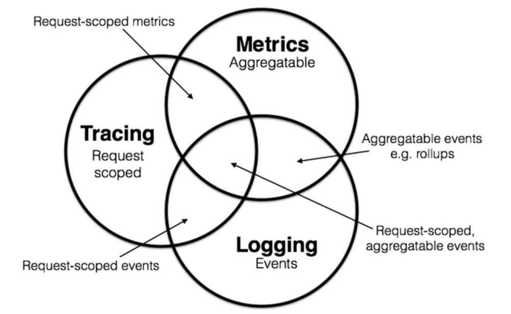

他总结到：

* 指标的特点是 **它是可聚合的（Aggregatable）**，比如接收的 HTTP 请求数这个指标我们可以建模为计数器（counter），每次 HTTP 请求就是对其做加法聚合;
* 日志的特点是 **它是对离散事件的处理（Events）**，比如我们经常在代码中打印的调试日志或错误日志，系统的审计日志等；
* 链路跟踪的特点是 **它是对请求范围内的信息的处理（Request-scoped）**，任何数据都可以绑定到这个事务对象的生命周期中，比如对于一个 HTTP 请求的链路，我们可以记录每个请求节点的状态，节点的耗时，谁接收了这个请求等等；

我们从图中可以看到这三者之间是有部分重合的，比如上面讲的 HTTP 请求数这个指标，很显然可以绑定到这个请求的链路中，这被称为 **请求范围内的指标（Request-scoped metrics）**，当然也有些指标不是请求范围内的，比如机器的 CPU 利用率、内存占用、磁盘空间等。而对于一些日志，比如请求报错，也可以绑定到请求链路中，称为 **请求范围内的事件（Request-scoped events）**。

通过这样的划分，我们可以对系统中的日志和指标等数据进行更合理地设计，也对后来所有的可观测性产品提供了边界。2018 年，Apple 的工程师 Cindy Sridharan 在他新出版的书籍 [《
Distributed Systems Observability》](https://www.oreilly.com/library/view/distributed-systems-observability/9781492033431/) 中正式提出了分布式系统可观测性的概念，介绍了可观测性和传统监控的区别，以及如何通过可观测性的三大支柱（指标、日志和链路跟踪）构建完整的观测模型，从而实现分布式系统的故障诊断、根因分析和快速恢复。同年，CNCF 社区也将可观测性引入 [Cloud Native Landscape](https://landscape.cncf.io/) 作为云原生领域不可或缺的一部分。

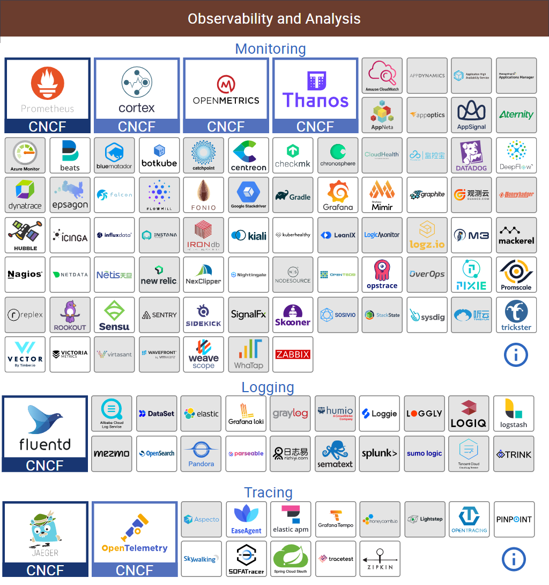

## OpenTelemetry 缘起

看着 Cloud Native Landscape 上琳琅满目的项目，可以看出可观测性这个领域已经是一片红海，那么为什么现在又要推出 [OpenTelemetry](https://opentelemetry.io) 这样一个新项目呢？而且通过上图中三大类产品的组合，我们也可以快速搭建一个可观测性系统出来。

不过也正是因为这方面的产品太多，各个产品的数据模型都不一样，因此每个产品都有自己的数据处理和数据分析组件，这也导致了用户需要部署的组件很多，维护的成本也很高，而且这三套系统是完全独立的，不能很好的处理指标、日志和链路跟踪之间的关联关系，用户需要在不同产品之间来回切换，定位和排查问题非常痛苦。

针对这个问题，CNCF 在 2019 年正式推出 OpenTelemetry 项目（也被简写为 OTel），该项目雄心勃勃，旨在统一指标、日志和链路跟踪三种数据，实现可观测性的大一统。从 [A brief history of OpenTelemetry (So Far)](https://www.cncf.io/blog/2019/05/21/a-brief-history-of-opentelemetry-so-far/) 这篇文章中我们了解到，在 OpenTelemetry 推出之前，其实已经有一些项目在做这方面的尝试了，比如早在 2016 年 11 月，CNCF 就推出了 [OpenTracing](https://opentracing.io/) 项目，这是一套与平台无关、与厂商无关、与语言无关的追踪协议规范，只要遵循 OpenTracing 规范，任何公司的追踪探针、存储、界面都可以随时切换，也可以相互搭配使用，很快，几乎所有业界有名的追踪系统，譬如 Zipkin、Jaeger、SkyWalking 等纷纷宣布支持 OpenTracing；不过谁也没想到，半路却杀出了个程咬金，这个时候 Google 突然跳出来反对，而且还提出了一个自己的 [OpenCensus](https://opencensus.io/) 规范，更令人想不到的是，随后又得到了 Microsoft 的大力支持。面对这两大巨头的搅局，可观测性的标准和规范不仅没有得到改善，反而变得更加混乱了。好在最终双方握手言和，在 2019 年，OpenTracing 和 OpenCensus 宣布合并，并提出了一个可观测性的终极解决方案，这就是 OpenTelemetry。

OpenTelemetry 具备以下特点：

* 它为指标、日志和链路跟踪提出了统一的数据模型，可以轻松地实现互相关联；
* 它采用了统一的 Agent 对所有可观察性数据进行采集和传输，使系统整体架构变得更加简单；
* 它是厂商无关的，用户可以自由选择和更换适合自己的服务提供商；
* 它具备很好的兼容性，可以和 CNCF 下各种可观察性方案进行集成；

OpenTelemetry 最核心的功能总结为一句话就是，**以统一的数据模型对可观测性数据进行采集、处理和导出**，至于数据的可视化或分析工作则交给后端的各种其他服务，整体架构如下图所示：

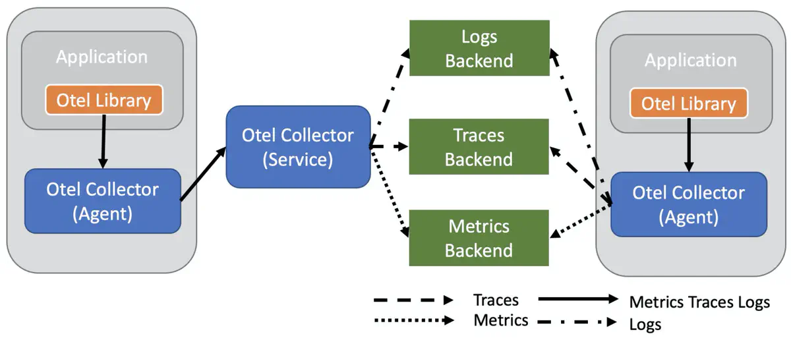

其中包括两个主要部分：

* [OTel Library](https://opentelemetry.io/docs/instrumentation/)：也就是 OpenTelemetry API 各种语言的 SDK 实现，用于生成统一格式的可观测性数据；
* [OTel Collector](https://opentelemetry.io/docs/collector/)：用来接收这些可观测性数据，并支持把数据传输到各种类型的后端系统。

## 快速开始

为了让用户能快速地体验和上手 OpenTelemetry，官方提供了一个名为 [Astronomy Shop](https://github.com/open-telemetry/opentelemetry-demo) 的演示服务，接下来我们就按照 [Quick Start](https://github.com/open-telemetry/opentelemetry-demo/blob/main/docs/docker_deployment.md) 的步骤，使用 Docker 来部署这个演示服务，一睹 OpenTelemetry 的真容。

> 除了使用 Docker 部署，官方也提供了 [Kubernetes 部署方式](https://github.com/open-telemetry/opentelemetry-demo/blob/main/docs/kubernetes_deployment.md)。

首先下载仓库代码：

```
$ git clone https://github.com/open-telemetry/opentelemetry-demo.git
```

进入代码目录后直接执行 `docker compose up` 命令：

```
$ cd opentelemetry-demo/
$ docker compose up --no-build
```

参数 `--no-build` 用于直接从镜像仓库拉取镜像，如果去掉这个参数则会使用本地的代码来构建镜像。这个命令会启动 20 个容器：

```
[+] Running 20/0
 ⠿ Container prometheus               Created                                                                          0.0s
 ⠿ Container postgres                 Created                                                                          0.0s
 ⠿ Container grafana                  Created                                                                          0.0s
 ⠿ Container feature-flag-service     Created                                                                          0.0s
 ⠿ Container jaeger                   Created                                                                          0.0s
 ⠿ Container redis-cart               Created                                                                          0.0s
 ⠿ Container otel-col                 Created                                                                          0.0s
 ⠿ Container payment-service          Created                                                                          0.0s
 ⠿ Container ad-service               Created                                                                          0.0s
 ⠿ Container shipping-service         Created                                                                          0.0s
 ⠿ Container email-service            Created                                                                          0.0s
 ⠿ Container product-catalog-service  Created                                                                          0.0s
 ⠿ Container recommendation-service   Created                                                                          0.0s
 ⠿ Container quoteservice             Created                                                                          0.0s
 ⠿ Container currency-service         Created                                                                          0.0s
 ⠿ Container cart-service             Created                                                                          0.0s
 ⠿ Container checkout-service         Created                                                                          0.0s
 ⠿ Container frontend                 Created                                                                          0.0s
 ⠿ Container load-generator           Created                                                                          0.0s
 ⠿ Container frontend-proxy           Created                                                                          0.0s
Attaching to ad-service, cart-service, checkout-service, currency-service, email-service, feature-flag-service, frontend, frontend-proxy, grafana, jaeger, load-generator, otel-col, payment-service, postgres, product-catalog-service, prometheus, quoteservice, recommendation-service, redis-cart, shipping-service
```

耐心等待所有的镜像下载完毕，且所有的服务启动成功后，即可通过浏览器访问下面这些页面：

* Webstore: http://localhost:8080/
* Grafana: http://localhost:8080/grafana/
* Feature Flags UI: http://localhost:8080/feature/
* Load Generator UI: http://localhost:8080/loadgen/
* Jaeger UI: http://localhost:8080/jaeger/ui/

### 演示服务架构

这个演示服务中包含了很多微服务，并且为了起到演示作用，使用了各种不同的编程语言进行开发，用户可以根据自己的兴趣了解不同服务的具体实现：

* [Ad Service](https://github.com/open-telemetry/opentelemetry-demo/blob/main/docs/services/adservice.md) （Java）
* [Cart Service](https://github.com/open-telemetry/opentelemetry-demo/blob/main/docs/services/cartservice.md) （.Net）
* [Checkout Service](https://github.com/open-telemetry/opentelemetry-demo/blob/main/docs/services/checkoutservice.md) （Go）
* [Currency Service](https://github.com/open-telemetry/opentelemetry-demo/blob/main/docs/services/currencyservice.md) （C++）
* [Email Service](https://github.com/open-telemetry/opentelemetry-demo/blob/main/docs/services/emailservice.md) （Ruby）
* [Feature Flag Service](https://github.com/open-telemetry/opentelemetry-demo/blob/main/docs/services/featureflagservice.md) （Erlang / [Elixir](https://elixir-lang.org/)）
* [Frontend](https://github.com/open-telemetry/opentelemetry-demo/blob/main/docs/services/frontend.md) （JavaScript）
* [Load Generator](https://github.com/open-telemetry/opentelemetry-demo/blob/main/docs/services/loadgenerator.md) （Python / [Locust](https://locust.io/)）
* [Payment Service](https://github.com/open-telemetry/opentelemetry-demo/blob/main/docs/services/paymentservice.md) （JavaScript）
* [Product Catalog Service](https://github.com/open-telemetry/opentelemetry-demo/blob/main/docs/services/productcatalogservice.md) （Go）
* [Quote Service](https://github.com/open-telemetry/opentelemetry-demo/blob/main/docs/services/quoteservice.md) （PHP）
* [Recommendation Service](https://github.com/open-telemetry/opentelemetry-demo/blob/main/docs/services/recommendationservice.md) （Python）
* [Shipping Service](https://github.com/open-telemetry/opentelemetry-demo/blob/main/docs/services/shippingservice.md) （Rust）

这些微服务组成的架构图如下所示：

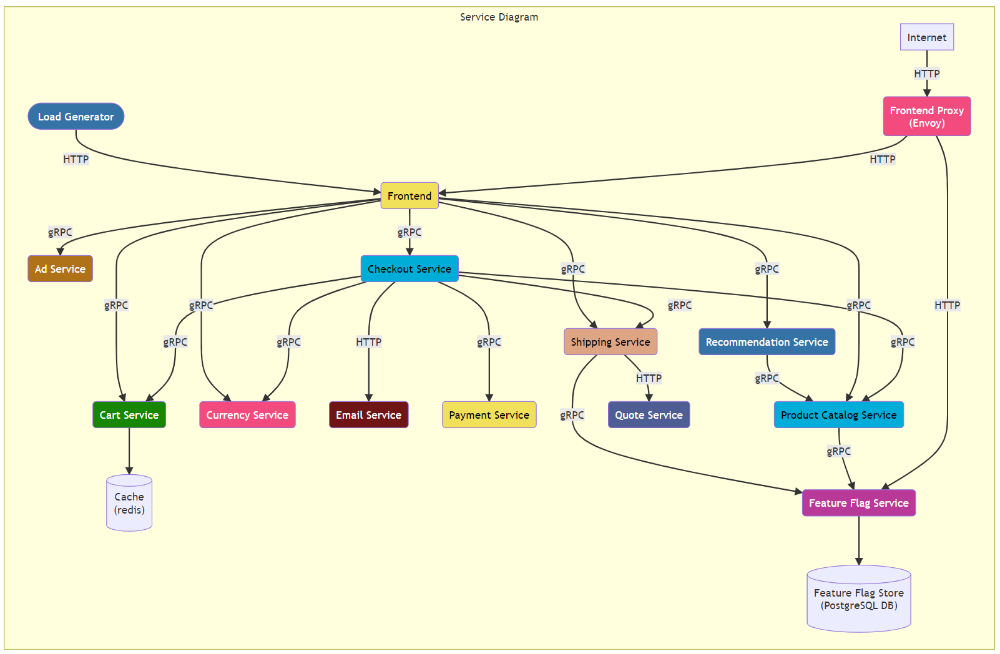

除了这些微服务组件，还部署了下面这些中间件：

* Prometheus
* Postgres
* Grafana
* Jaeger
* Redis
* OpenTelemetry Collector
* Envoy（Frontend Proxy）

### 体验演示服务

这个演示服务是一个天文爱好者的网上商城，访问 `http://localhost:8080/` 进入商城首页：


商城具有浏览商品、商品推荐、添加购物车、下单等功能：

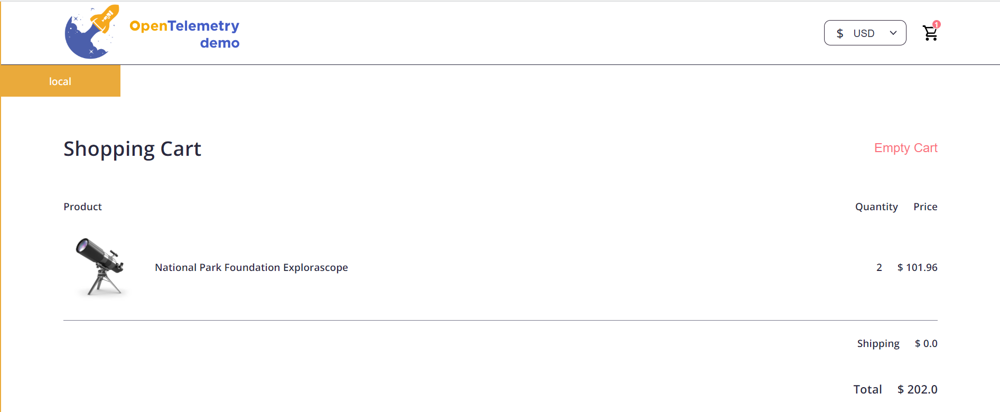

商城运行起来之后，[Load Generator](https://github.com/open-telemetry/opentelemetry-demo/blob/main/docs/services/loadgenerator.md) 服务就会自动对商城进行负载测试，它是一个使用开源工具 [Locust](https://locust.io/) 编写的负载测试服务，可以模拟用户访问网站。

访问 `http://localhost:8080/loadgen/` 进入 Load Generator 页面：

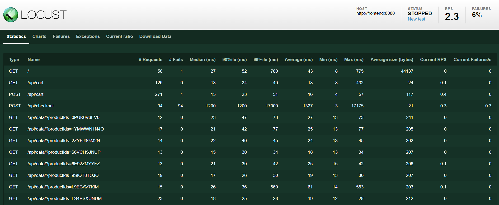

可以在这里查看测试用例，开启或停止测试，修改模拟的用户数和用户访问的频率等。还提供了图表页面展示测试的 RPS（Request per Second）、响应时间、活跃用户数等指标：

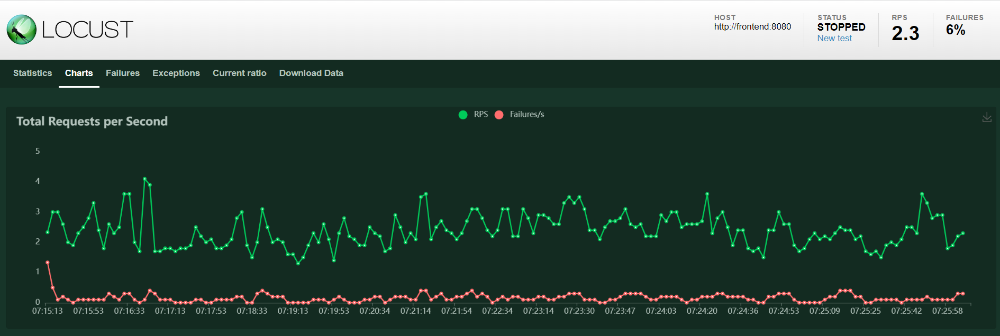

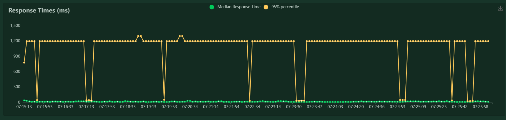

### 体验 OpenTelemetry

我们知道，OpenTelemetry 的作用是以统一的方式采集和导出可观测性数据，上面所列出来的这些微服务分别使用了不同语言的 [OpenTelemetry SDK](https://opentelemetry.io/docs/instrumentation/) 采集数据，对于采集的数据，我们有两种处理方式：一种是直接将其导出到某个后端服务，比如直接导出到 Prometheus、Jaeger 等，这种方式简单明了，适用于开发环境或小规模环境；另一种方式是导出到 [OpenTelemetry Collector](https://opentelemetry.io/docs/collector/) 服务，这也是官方推荐的做法，这样你的服务可以更聚焦于快速地导出数据，而对于请求重试、批量导出、数据加密、数据压缩或敏感数据过滤这些数据处理操作统统交给 OpenTelemetry Collector 来处理。

在这个演示服务中，我们就是通过 OpenTelemetry Collector 来收集数据的，打开 `docker-compose.yaml` 文件，我们来看看 OpenTelemetry Collector 的配置：

```yaml
otelcol:
  image: otel/opentelemetry-collector-contrib:0.61.0
  container_name: otel-col
  deploy:
    resources:
      limits:
        memory: 100M
  restart: always
  command: [ "--config=/etc/otelcol-config.yml", "--config=/etcotelcol-config-extras.yml" ]
  volumes:
    - ./src/otelcollector/otelcol-config.yml:/etc/otelcol-config.yml
    - ./src/otelcollector/otelcol-config-extras.yml:/etc/otelcol-config-extras.yml
  ports:
    - "4317"          # OTLP over gRPC receiver
    - "4318:4318"     # OTLP over HTTP receiver
    - "9464"          # Prometheus exporter
    - "8888"          # metrics endpoint
  depends_on:
    - jaeger
  logging: *logging
```

这里可以看到 OpenTelemetry Collector 暴露了四个端口：`4317` 和 `4318` 这两个端口是用于收集数据的，一个是 gRPC 协议，一个是 HTTP 协议，数据必须符合 [OTLP 规范](https://opentelemetry.io/docs/reference/specification/protocol/)（OpenTelemetry Protocol）；`9464` 和 `8888` 这两个端口是 OpenTelemetry Collector 的指标端口，`8888` 暴露的是 OpenTelemetry Collector 本身的指标：

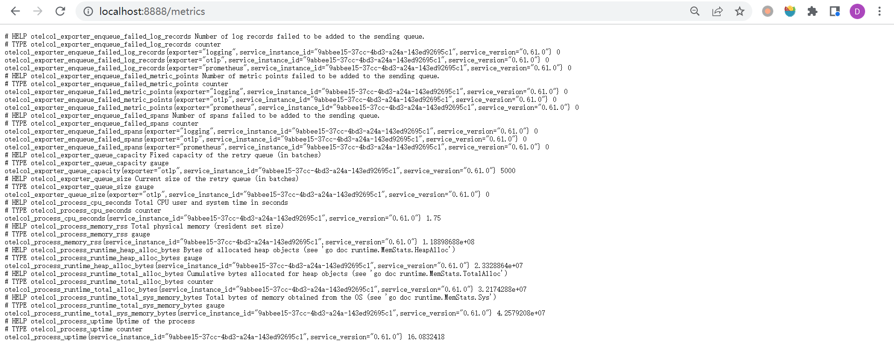

而 `9464` 暴露是的 OpenTelemetry Collector 收集到的指标：

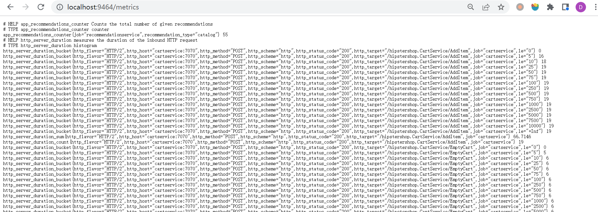

这两个端口都配置在 Prometheus 的配置文件 `prometheus-config.yaml` 中：

```yaml
global:
  evaluation_interval: 30s
  scrape_interval: 5s
scrape_configs:
- job_name: otel
  static_configs:
  - targets:
    - 'otelcol:9464'
- job_name: otel-collector
  static_configs:
  - targets:
    - 'otelcol:8888'
```

我们打开 Prometheus 的 Targets 页面：

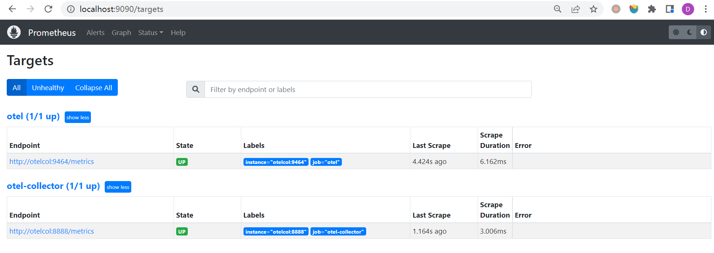

接下来我们看下 OpenTelemetry Collector 的配置文件 `otelcol-config.yml`，文件的内容如下：

```yaml
receivers:
  otlp:
    protocols:
      grpc:
      http:
        cors:
          allowed_origins:
            - "http://*"
            - "https://*"

exporters:
  otlp:
    endpoint: "jaeger:4317"
    tls:
      insecure: true
  logging:
  prometheus:
    endpoint: "otelcol:9464"

processors:
  batch:
  spanmetrics:
    metrics_exporter: prometheus
```

OpenTelemetry Collector 主要由以下三部分组成：

* **[接收器（receivers）](https://opentelemetry.io/docs/collector/configuration/#receivers)**：配置 OpenTelemetry Collector 接收数据的方式，在上面的配置中，我们使用了 [OTLP Receiver](https://github.com/open-telemetry/opentelemetry-collector/blob/main/receiver/otlpreceiver/README.md)，并开启了 gRPC 和 HTTP 两个端点用于接收数据（gRPC 端口默认为 4317，HTTP 端口默认为 4318）；
* **[处理器（processors）](https://opentelemetry.io/docs/collector/configuration/#processors)**：在接收数据之后导出数据之前对数据进行处理，比如 [Batch Processor](https://github.com/open-telemetry/opentelemetry-collector/blob/main/processor/batchprocessor/README.md) 用于批处理数据，[Span Metrics Processor](https://github.com/open-telemetry/opentelemetry-collector-contrib/blob/main/processor/spanmetricsprocessor/README.md) 用于从 Span 数据中计算出请求数、错误数和请求耗时（Request, Error and Duration，简称 **R.E.D**）；
* **[导出器（exporters）](https://opentelemetry.io/docs/collector/configuration/#exporters)**：将处理后的数据导出到后端服务，比如在上面的配置中，通过 [OTLP gRPC Exporter](https://github.com/open-telemetry/opentelemetry-collector/blob/main/exporter/otlpexporter/README.md) 将数据导出到 Jaeger，[Logging Exporter](https://github.com/open-telemetry/opentelemetry-collector/blob/main/exporter/loggingexporter/README.md) 用于在控制台打印日志，[Prometheus Exporter](https://github.com/open-telemetry/opentelemetry-collector-contrib/blob/main/exporter/prometheusexporter/README.md) 用于暴露 Prometheus 指标端口，提供给 Prometheus 抓取；

暴露给 Prometheus 的指标端口 9464 我们在上面的 Prometheus 配置中已经看到了，导出到 Jaeger 的端口 4317 也可以在 Jaeger 的配置文件中看到：

```yaml
jaeger:
  image: jaegertracing/all-in-one
  container_name: jaeger
  command: ["--memory.max-traces", "10000", "--query.base-path", "/jaeger/ui"]
  deploy:
    resources:
      limits:
        memory: 275M
  restart: always
  ports:
    - "16686"                    # Jaeger UI
    - "4317"                     # OTLP gRPC default port
  environment:
    - COLLECTOR_OTLP_ENABLED=true
  logging: *logging
```

Jaeger 从 v1.35 版本开始支持 OTLP 协议的链路跟踪数据，通过在环境变量中添加 `COLLECTOR_OTLP_ENABLED=true` 即可开启该功能。

除了上面配置的这些，我们还可以在 [opentelemetry-collector](https://github.com/open-telemetry/opentelemetry-collector) 和 [opentelemetry-collector-contrib](https://github.com/open-telemetry/opentelemetry-collector-contrib) 找到更多的官方或第三方的 receivers、processors 和 exporters。

OpenTelemetry Collector 的总体示意图如下所示：

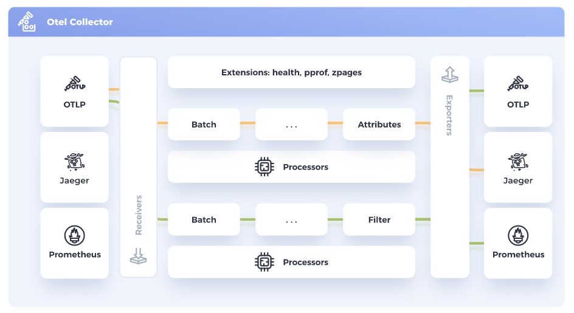

配置好 receivers、processors 和 exporters 之后，我们还需要通过在 [服务（service）](https://opentelemetry.io/docs/collector/configuration/#service) 中添加流水线（pipeline）将其串起来：

```yaml
service:
  pipelines:
    traces:
      receivers: [otlp]
      processors: [spanmetrics, batch]
      exporters: [logging, otlp]
    metrics:
      receivers: [otlp]
      processors: [batch]
      exporters: [prometheus, logging]
```

上面的配置中我们开启了两个流水线：

* `traces` 流水线用于处理链路跟踪数据：通过 otlp 接收数据，再通过 spanmetrics 和 batch 处理器进行处理，最后导出到 logging 和 otlp；
* `metrics` 流水线用于处理指标数据：通过 otlp 接收数据，再通过 batch 处理器进行处理，最后导出到 prometheus 和 logging；

除此之外，还可以添加 `logs` 流水线用于处理日志数据。

在这个演示服务中 Prometheus 的端口并没有对外暴露，而是通过 Grafana 来做可视化展示，我们打开 `http://localhost:8080/grafana/` 页面，可以在 Grafana 中找到两个面板，一个是 OpenTelemetry 本身的指标面板：

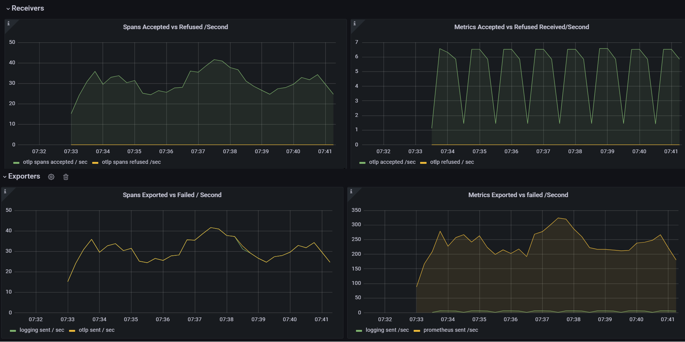

这个面板中展示了 receivers、processors 和 exporters 的指标信息。另一个是 OpenTelemetry 收集的服务的指标面板：

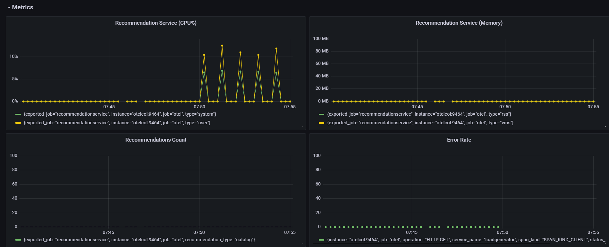

这个面板中展示了每个服务的 CPU 利用率，内存，调用次数，错误率等指标信息。

在 Grafana 中配置了两个数据源，一个 Prometheus，一个 Jaeger，不过 Jaeger 数据源貌似没有用。我们可以打开 `http://localhost:8080/jaeger/ui/` 页面，在 Search 页面搜索不同服务的 trace 数据：

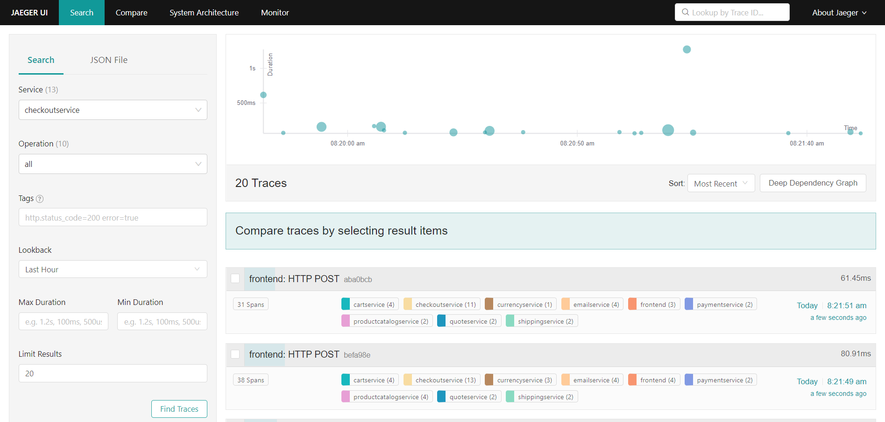

随便点击一条 trace 数据，可以进入该 trace 的详细页面，这个页面展示了该 trace 在不同服务之间的详细链路：

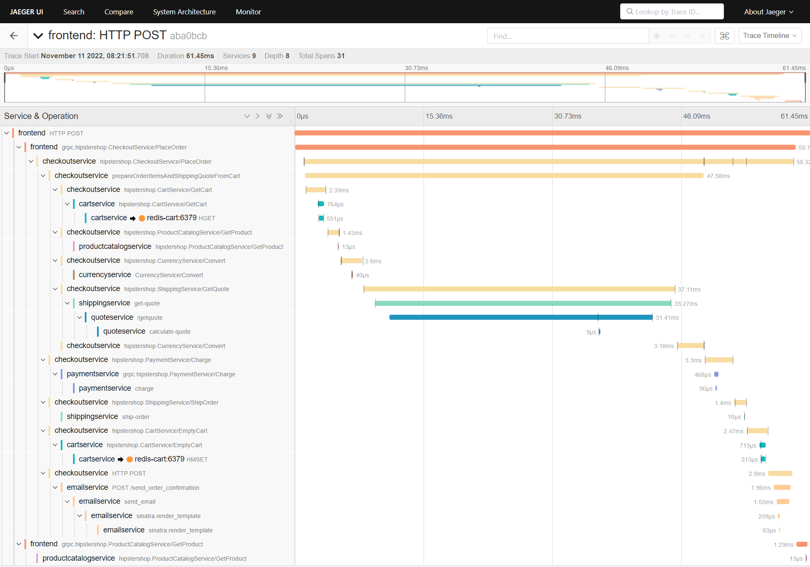

更厉害的是，Jaeger 还能根据 trace 数据生成整个系统的架构图：

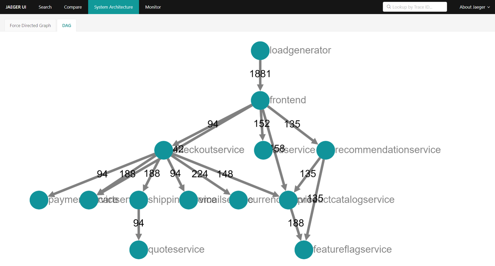

### 使用 OpenTelemetry 快速排错

https://github.com/open-telemetry/opentelemetry-demo/blob/main/docs/scenarios/recommendation_cache.md

## 开发指南

https://opentelemetry.io/docs/getting-started/dev/

## 参考

1. [OpenTelemetry Documentation](https://opentelemetry.io/docs/)
1. [OpenTelemetry 中文文档](https://github.com/open-telemetry/docs-cn)
1. [OpenTelemetry 可观测性的未来](https://lib.jimmysong.io/opentelemetry-obervability/) - 作者 Ted Young，译者 Jimmy Song
1. [OpenTelemetry 简析](https://mp.weixin.qq.com/s/n4eVf2KZRIp2yKACk88qJA) -  阿里云云原生
1. [End-to-end tracing with OpenTelemetry](https://blog.frankel.ch/end-to-end-tracing-opentelemetry/) - Nicolas Fränkel
1. [OpenTelemetry初體驗：實踐Chaos Engineering來Drive the Observability's best practice](https://engineering.linecorp.com/zh-hant/blog/opentelemetry-chaos-engineering-drive-the-observability-best-practice/) - Johnny Pan
1. [淺談DevOps與Observability 系列](https://ithelp.ithome.com.tw/users/20104930/ironman/4960)
1. [可观测性](http://icyfenix.cn/distribution/observability/) - 凤凰架构
1. [Kratos 学习笔记 - 基于 OpenTelemetry 的链路追踪](https://go-kratos.dev/blog/go-kratos-opentelemetry-practice/)
1. [使用 OpenTelemetry Collector 来收集追踪信息，发送至 AppInsights](https://docs.dapr.io/zh-hans/operations/monitoring/tracing/open-telemetry-collector-appinsights/) - Dapr 文档库

## 更多

### 1. 执行 `docker compose up` 报错 `'compose' is not a docker command.`

[Docker Compose V2](https://github.com/docker/compose) 是 `docker-compose` 的重大版本升级，使用 Go 完全重写了对之前 V1 的 Python 代码，并且和 V1 不同的是，V2 不再是独立的可执行程序，而是作为 Docker 的命令行插件来运行。所以需要先将其安装到 Docker 的插件目录：

```
$ mkdir -p ~/.docker/cli-plugins
$ curl -fsSL "https://github.com/docker/compose/releases/download/v2.12.2/docker-compose-linux-x86_64" -o ~/.docker/cli-plugins/docker-compose
$ chmod +x ~/.docker/cli-plugins/docker-compose
```

安装完成后检查是否生效：

```
$ docker compose version
Docker Compose version v2.12.2
```

如果你需要兼容 Docker Compose V1 时的 `docker-compose` 命令，官方提供了一个名为 [Compose Switch](https://github.com/docker/compose-switch) 的工具，它可以将 `docker-compose` 命令自动转换为 `docker compose` 命令。如果你的机器上没有安装过 Docker Compose V1，可以直接下载 `compose-switch` 并改名为 `docker-compose`：

```
$ sudo curl -fsSL https://github.com/docker
/compose-switch/releases/download/v1.0.5/docker-compose-linux-amd64 -o /usr/local/bin/docker-compose
$ sudo chmod +x /usr/local/bin/docker-compose
```

如果已经安装过 Docker Compose V1，你可以将其先卸载掉再安装 `compose-switch`，或者根据官方文档使用 `update-alternatives` 之类的工具进行版本切换。
