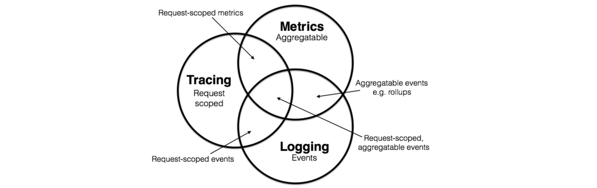

# WEEK026 - 基于 OpenTelemetry 的可观测性实战

[可观测性](https://en.wikipedia.org/wiki/Observability)（Observability）这个词来源于控制理论，它是由匈牙利裔美国工程师 [Rudolf E. Kálmán](https://en.wikipedia.org/wiki/Rudolf_E._K%C3%A1lm%C3%A1n) 针对线性动态控制系统所提出的一个概念，表示 **通过系统外部输出推到其内部状态的程度**。

> Observability is a measure of how well internal states of a system can be inferred from knowledge of its external outputs.

这个概念也被引入软件开发行业，2018 年，Apple 的工程师 Cindy Sridharan 在他新出版的书籍 [《
Distributed Systems Observability》](https://www.oreilly.com/library/view/distributed-systems-observability/9781492033431/) 中首次提出了分布式系统可观测性的概念，介绍了可观测性和传统监控的区别，以及如何通过可观测性的三大支柱（日志、指标监控和链路跟踪）构建完整的观测模型，从而实现分布式系统的故障诊断、根因分析和快速恢复。

在可观测性提出之前，大家对系统的观测一般都是从日志、指标监控和链路跟踪三个方面独立进行，并且在每个领域都积累了丰富的经验。渐渐地，大家也意识到这三个方面并不是完全独立的，而是存在互相重合的现象，比如运维人员在查看系统 CPU 或内存等指标的图表时，如果发现异常，我们希望能快速定位到这个时间段的日志，看看有没有什么错误日志（从指标到日志）；或者在日志系统中查看某条错误日志时，我们希望追踪到链路的入口位置，看看最源头的请求参数是什么（从日志到链路）。

2017 年，Peter Bourgon 撰写了一篇总结文章《Metrics, Tracing, and Logging》系统地阐述了这三者的定义、特征，以及它们之间的关系与差异，受到了业界的广泛认可。

## 快速开始

为了让用户能快速地体验和上手 OpenTelemetry，官方提供了一个名为 [Astronomy Shop](https://github.com/open-telemetry/opentelemetry-demo) 的 Demo 服务，接下来我们就按照 [Quick Start](https://github.com/open-telemetry/opentelemetry-demo/blob/main/docs/docker_deployment.md) 的步骤，部署这个 Demo 服务并体验 OpenTelemetry。

## 参考

1. [OpenTelemetry Documentation](https://opentelemetry.io/docs/)
1. [OpenTelemetry 中文文档](https://github.com/open-telemetry/docs-cn)
1. [OpenTelemetry 可观测性的未来](https://lib.jimmysong.io/opentelemetry-obervability/) - 作者 Ted Young，译者 Jimmy Song
1. [OpenTelemetry 简析](https://mp.weixin.qq.com/s/n4eVf2KZRIp2yKACk88qJA) -  阿里云云原生
1. [End-to-end tracing with OpenTelemetry](https://blog.frankel.ch/end-to-end-tracing-opentelemetry/) - Nicolas Fränkel
1. [OpenTelemetry初體驗：實踐Chaos Engineering來Drive the Observability's best practice](https://engineering.linecorp.com/zh-hant/blog/opentelemetry-chaos-engineering-drive-the-observability-best-practice/) - Johnny Pan
1. [淺談DevOps與Observability 系列](https://ithelp.ithome.com.tw/users/20104930/ironman/4960)
1. [可观测性](http://icyfenix.cn/distribution/observability/) - 凤凰架构

## 更多

1. [Kratos 学习笔记 - 基于 OpenTelemetry 的链路追踪](https://go-kratos.dev/blog/go-kratos-opentelemetry-practice/)
1. [使用 OpenTelemetry Collector 来收集追踪信息，发送至 AppInsights](https://docs.dapr.io/zh-hans/operations/monitoring/tracing/open-telemetry-collector-appinsights/) - Dapr 文档库
1. [一文读懂可观测性与Opentelemetry](https://mp.weixin.qq.com/s/TUH3rlbSqYoPaeyMCbfRTQ)
1. [可观测性 — Overview](https://is-cloud.blog.csdn.net/article/details/126337586)
