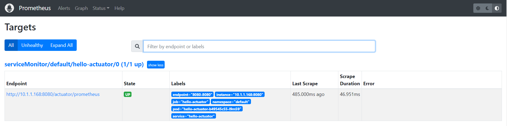
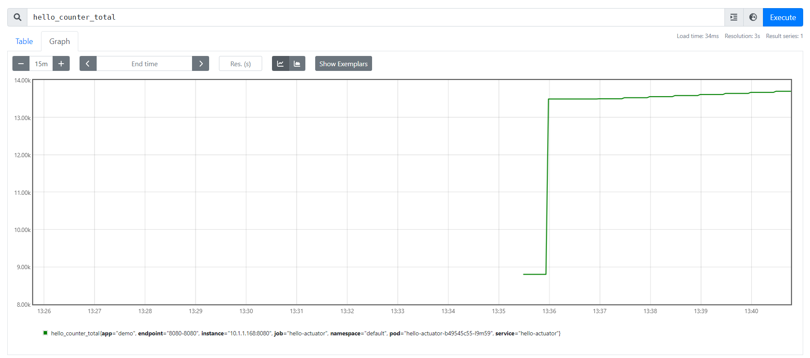

# WEEK027 - 实战 Kubernetes 的动态扩缩容

在 [week013-playing-with-kubernetes](../week013-playing-with-kubernetes/README.md) 中，我们学习了 Kubernetes 中的 Pod、Deployment 和 Service 的一些基础知识，还学习了如何通过 `kubectl scale` 命令对应用进行扩容或缩容，以及 Kubernetes 的滚动更新机制。

虽然通过 `kubectl scale` 命令可以实现扩缩容功能，但是这个操作需要运维人员手工进行干预，不仅可能处理不及时，而且还可能误操作导致生产事故。如果我们能够根据系统当前的运行状态自动进行扩缩容，比如当检测到某个应用负载过高时自动对其扩容，这样就可以给运维人员带来极大的方便。为此，Kubernetes 提供了一种新的资源对象：[Horizontal Pod Autoscaling](https://kubernetes.io/docs/tasks/run-application/horizontal-pod-autoscale/)（Pod 水平自动伸缩，简称 HPA），HPA 通过监控 Pod 的负载变化来确定是否需要调整 Pod 的副本数量，从而实现动态扩缩容。

## Metrics Server

为了实现动态扩缩容，首先我们需要对 Kubernetes 集群的负载情况进行监控，Kubernetes 从 v1.8 开始提出了 [Metrics API](https://kubernetes.io/docs/tasks/debug/debug-cluster/resource-metrics-pipeline/#metrics-api) 的概念来解决这个问题，官方认为核心指标的监控应该是稳定的，版本可控的，并且和其他的 Kubernetes API 一样，可以直接被用户访问（如：`kubectl top` 命令），或被集群中其他控制器使用（如：`HPA`），为此专门开发了 [Metrics Server](https://github.com/kubernetes-sigs/metrics-server) 组件。

我们知道 Kubernetes 会在每个节点上运行一个 Kubelet 进程，这个进程对容器进行生命周期的管理，实际上，它还有另外一个作用，那就是监控所在节点的资源使用情况，并且可以通过 [Summary API](https://kubernetes.io/docs/tasks/debug/debug-cluster/resource-metrics-pipeline/#summary-api-source) 来查询。Metrics Server 就是通过聚合各个节点的 Kubelet 的 Summary API，然后对外提供 Metrics API，并通过 API Server 的 [API 聚合层（API Aggregation Layer）](https://kubernetes.io/docs/concepts/extend-kubernetes/api-extension/apiserver-aggregation/) 将接口以 Kubernetes API 的形式暴露给用户或其他程序使用：


按照官方文档，我们使用下面的命令安装 Metrics Server：

```
$ kubectl apply -f https://github.com/kubernetes-sigs/metrics-server/releases/latest/download/components.yaml
```

安装之后，使用 `kubectl get pods` 可以看到 Metrics Server 虽然是 Running 状态，但是一直没有 Ready：

```
$ kubectl get pods -n kube-system
NAME                                     READY   STATUS    RESTARTS         AGE
metrics-server-847d45fd4f-rhsh4          0/1     Running   0                30s
```

使用 `kubectl logs` 查看日志报如下错误：

```
$ kubectl logs -f metrics-server-847d45fd4f-rhsh4 -n kube-system
E1119 04:47:02.299430       1 scraper.go:140] "Failed to scrape node" err="Get \"https://192.168.65.4:10250/metrics/resource\": x509: cannot validate certificate for 192.168.65.4 because it doesn't contain any IP SANs" node="docker-desktop"
```

这里的 `/metrics/resource` 接口就是 Kubelet 的 Summary API，这个报错的意思是证书校验没通过，因为证书中没有包含所请求的 IP 地址，我们不妨随便进一个 Pod 内部，用 openssl 看下这个证书的信息：

```
# openssl s_client -showcerts -connect 192.168.65.4:10250
CONNECTED(00000003)
depth=1 CN = docker-desktop-ca@1663714811
verify error:num=19:self signed certificate in certificate chain
verify return:0
---
Certificate chain
 0 s:/CN=docker-desktop@1663714811
   i:/CN=docker-desktop-ca@1663714811
-----BEGIN CERTIFICATE-----
...
-----END CERTIFICATE-----
 1 s:/CN=docker-desktop-ca@1663714811
   i:/CN=docker-desktop-ca@1663714811
-----BEGIN CERTIFICATE-----
...
-----END CERTIFICATE-----
---
Server certificate
subject=/CN=docker-desktop@1663714811
issuer=/CN=docker-desktop-ca@1663714811
```

可以看到这是一个自签名的证书，证书只签给了 `docker-desktop@1663714811`，没有签给 `192.168.65.4` 这个 IP，所以 Metrics Server 认为证书是无效的，为了解决这个问题，第一种方法是将这个证书加入 Metrics Server 的受信证书中，不过这种方法比较繁琐，另一种方法简单暴力，我们可以直接让 Metrics Server 跳过证书检查。我们将上面安装 Metrics Server 的那个 YAML 文件下载下来，在 Metrics Server 的启动参数中添加 `--kubelet-insecure-tls`：

```yaml
- args:
  - --cert-dir=/tmp
  - --secure-port=4443
  - --kubelet-insecure-tls
  - --kubelet-preferred-address-types=InternalIP,ExternalIP,Hostname
  - --kubelet-use-node-status-port
  - --metric-resolution=15s
```

然后使用 `kubectl apply` 重新安装：

```
$ kubectl apply -f metrics-server.yaml
```

再通过 `kubectl get pods` 确认 Metrics Server 已经成功运行起来了。这时，我们就可以通过 `kubectl top` 命令来获取 Kubernetes 集群状态了，比如查看所有节点的 CPU 和内存占用：

```
$ kubectl top nodes
NAME             CPU(cores)   CPU%   MEMORY(bytes)   MEMORY%
docker-desktop   489m         6%     1823Mi          29%
```

或者查看所有 Pod 的运行状态：

```
$ kubectl top pods -A
NAMESPACE     NAME                                     CPU(cores)   MEMORY(bytes)
default       kubernetes-bootcamp-857b45f5bb-hvkfx     0m           10Mi
kube-system   coredns-95db45d46-jx42f                  5m           23Mi
kube-system   coredns-95db45d46-nbvg9                  5m           62Mi
kube-system   etcd-docker-desktop                      48m          371Mi
kube-system   kube-apiserver-docker-desktop            61m          409Mi
kube-system   kube-controller-manager-docker-desktop   49m          130Mi
kube-system   kube-proxy-zwspl                         1m           62Mi
kube-system   kube-scheduler-docker-desktop            8m           68Mi
kube-system   metrics-server-5db9b4b966-zt6z4          6m           18Mi
kube-system   storage-provisioner                      4m           23Mi
kube-system   vpnkit-controller                        1m           8Mi
```

也可以查看某个节点的 CPU 和内存占用：

```
$ kubectl top node docker-desktop
NAME             CPU(cores)   CPU%   MEMORY(bytes)   MEMORY%
docker-desktop   425m         5%     1970Mi          31%
```

上面讲过，`kubectl top` 其实是通过 API Server 提供的接口来获取这些指标信息的，所以我们也可以直接通过接口来获取。上面的命令实际上就是调用了下面这个接口：

```
$ kubectl get --raw "/apis/metrics.k8s.io/v1beta1/nodes/docker-desktop" | jq '.'
{
  "kind": "NodeMetrics",
  "apiVersion": "metrics.k8s.io/v1beta1",
  "metadata": {
    "name": "docker-desktop",
    "creationTimestamp": "2022-11-19T14:57:48Z",
    "labels": {
      "beta.kubernetes.io/arch": "amd64",
      "beta.kubernetes.io/os": "linux",
      "kubernetes.io/arch": "amd64",
      "kubernetes.io/hostname": "docker-desktop",
      "kubernetes.io/os": "linux",
      "node-role.kubernetes.io/control-plane": "",
      "node.kubernetes.io/exclude-from-external-load-balancers": ""
    }
  },
  "timestamp": "2022-11-19T14:57:38Z",
  "window": "12.21s",
  "usage": {
    "cpu": "476038624n",
    "memory": "2008740Ki"
  }
}
```

我们也可以查看某个 Pod 的运行状态：

```
$ kubectl top pod kubernetes-bootcamp-857b45f5bb-hvkfx
NAME                                   CPU(cores)   MEMORY(bytes)
kubernetes-bootcamp-857b45f5bb-hvkfx   0m           20Mi
```

类似的，这个命令和下面这个接口是一样的：

```
$ kubectl get --raw "/apis/metrics.k8s.io/v1beta1/namespaces/default/pods/kubernetes-bootcamp-857b45f5bb-hvkfx" | jq '.'
{
  "kind": "PodMetrics",
  "apiVersion": "metrics.k8s.io/v1beta1",
  "metadata": {
    "name": "kubernetes-bootcamp-857b45f5bb-hvkfx",
    "namespace": "default",
    "creationTimestamp": "2022-11-19T14:59:11Z",
    "labels": {
      "app": "kubernetes-bootcamp",
      "pod-template-hash": "857b45f5bb"
    }
  },
  "timestamp": "2022-11-19T14:59:01Z",
  "window": "15.038s",
  "containers": [
    {
      "name": "kubernetes-bootcamp",
      "usage": {
        "cpu": "0",
        "memory": "21272Ki"
      }
    }
  ]
}
```

## 基于 CPU 自动扩缩容

Metrics Server 安装之后，我们就可以创建 HPA 来对 Pod 自动扩缩容了。首先我们使用 `jocatalin/kubernetes-bootcamp:v1` 镜像创建一个 Deployment：

```
$ kubectl create deployment kubernetes-bootcamp --image=jocatalin/kubernetes-bootcamp:v1
deployment.apps/kubernetes-bootcamp created
```

然后再执行 `kubectl autoscale` 命令创建一个 HPA：

```
$ kubectl autoscale deployment kubernetes-bootcamp --cpu-percent=10 --min=1 --max=10
horizontalpodautoscaler.autoscaling/kubernetes-bootcamp autoscaled
```

上面的命令为 `kubernetes-bootcamp` 这个 Deployment 创建了一个 HPA，其中 `--cpu-percent=10` 参数表示 HPA 会根据 CPU 使用率来动态调整 Pod 数量，当 CPU 占用超过 10% 时，HPA 就会自动对 Pod 进行扩容，当 CPU 占用低于 10% 时，HPA 又会自动对 Pod 进行缩容，而且扩缩容的大小由 `--min=1 --max=10` 参数限定，最小副本数为 1，最大副本数为 10。

除了 `kubectl autoscale` 命令，我们也可以使用下面的 YAML 来创建 HPA：

```yaml
apiVersion: autoscaling/v2
kind: HorizontalPodAutoscaler
metadata:
  name: kubernetes-bootcamp
  namespace: default
spec:
  minReplicas: 1
  maxReplicas: 10
  metrics:
  - resource:
      name: cpu
      target:
        averageUtilization: 10
        type: Utilization
    type: Resource
  scaleTargetRef:
    apiVersion: apps/v1
    kind: Deployment
    name: kubernetes-bootcamp
```

创建好 HPA 之后，可以使用 `kubectl get hpa` 进行查看：

```
$ kubectl get hpa
NAME                  REFERENCE                        TARGETS         MINPODS   MAXPODS   REPLICAS   AGE
kubernetes-bootcamp   Deployment/kubernetes-bootcamp   <unknown>/10%   1         10        0          29s
```

这里的 `TARGETS` 一列表示 `当前 CPU 占用 / 目标 CPU 占用`，可以看到这里貌似有点问题，当前 CPU 占用显示的是 `<unknown>`，我们执行 `kubectl describe hpa` 看下这个 HPA 的详情：

```
$ kubectl describe hpa kubernetes-bootcamp
Name:                                                  kubernetes-bootcamp
Namespace:                                             default
Labels:                                                <none>
Annotations:                                           <none>
CreationTimestamp:                                     Sun, 20 Nov 2022 10:51:00 +0800
Reference:                                             Deployment/kubernetes-bootcamp
Metrics:                                               ( current / target )
  resource cpu on pods  (as a percentage of request):  <unknown> / 10%
Min replicas:                                          1
Max replicas:                                          10
Deployment pods:                                       1 current / 0 desired
Conditions:
  Type           Status  Reason                   Message
  ----           ------  ------                   -------
  AbleToScale    True    SucceededGetScale        the HPA controller was able to get the target's current scale
  ScalingActive  False   FailedGetResourceMetric  the HPA was unable to compute the replica count: failed to get cpu utilization: missing request for cpu
```

从详情中可以看到报错信息 `failed to get cpu utilization: missing request for cpu`，这是因为我们上面创建 Deployment 时，没有为 Pod 对象配置资源请求，这样 HPA 就不知道 Pod 运行需要多少 CPU，也就无法计算 CPU 的利用率了，所以如果要想让 HPA 生效，对应的 Pod 必须添加资源请求声明。我们使用 YAML 文件重新创建 Deployment：

```yaml
apiVersion: apps/v1
kind: Deployment
metadata:
  labels:
    app: kubernetes-bootcamp
  name: kubernetes-bootcamp
  namespace: default
spec:
  replicas: 1
  selector:
    matchLabels:
      app: kubernetes-bootcamp
  strategy:
    rollingUpdate:
      maxSurge: 25%
      maxUnavailable: 25%
    type: RollingUpdate
  template:
    metadata:
      labels:
        app: kubernetes-bootcamp
    spec:
      containers:
      - image: jocatalin/kubernetes-bootcamp:v1
        imagePullPolicy: IfNotPresent
        name: kubernetes-bootcamp
        resources:
          requests: 
            memory: 50Mi
            cpu: 50m
      restartPolicy: Always
```

在上面的 YAML 文件中，我们使用 `resources.requests.cpu` 和 `resources.requests.memory` 声明了运行这个 Pod 至少需要 50m 的 CPU 和 50MiB 内存。稍等片刻，就能看到 HPA 状态已经正常了：

```
$ kubectl get hpa
NAME                  REFERENCE                        TARGETS   MINPODS   MAXPODS   REPLICAS   AGE
kubernetes-bootcamp   Deployment/kubernetes-bootcamp   0%/10%    1         10        1          65m
```

接下来，我们对 Pod 进行简单的压测，使用 `kubectl exec` 进入容器中：

```
$ kubectl exec -it pod/kubernetes-bootcamp-69d7dddfc-k9wj7 -- bash
```

并使用一个 `while` 循环对 Pod 不断发起请求：

```
root@kubernetes-bootcamp-69d7dddfc-k9wj7:/# while true; do wget -q -O- http://localhost:8080; done
```

很快，Pod 的 CPU 占用就开始飙升了，而且能看到副本数量也开始不断增加：

```
$ kubectl get hpa
NAME                  REFERENCE                        TARGETS    MINPODS   MAXPODS   REPLICAS   AGE
kubernetes-bootcamp   Deployment/kubernetes-bootcamp   219%/10%   1         10        10         93m
```

一段时间之后，副本数量增加到 10 个，并不再增加：

```
$ kubectl get pods
NAME                                  READY   STATUS    RESTARTS   AGE
kubernetes-bootcamp-69d7dddfc-9ws7c   1/1     Running   0          2m5s
kubernetes-bootcamp-69d7dddfc-bbpfv   1/1     Running   0          3m6s
kubernetes-bootcamp-69d7dddfc-bqlhj   1/1     Running   0          3m6s
kubernetes-bootcamp-69d7dddfc-fzlnq   1/1     Running   0          2m6s
kubernetes-bootcamp-69d7dddfc-jkx9g   1/1     Running   0          65s
kubernetes-bootcamp-69d7dddfc-k9wj7   1/1     Running   0          28m
kubernetes-bootcamp-69d7dddfc-l5bf7   1/1     Running   0          2m5s
kubernetes-bootcamp-69d7dddfc-q4b5f   1/1     Running   0          2m5s
kubernetes-bootcamp-69d7dddfc-ttptc   1/1     Running   0          65s
kubernetes-bootcamp-69d7dddfc-vtjqj   1/1     Running   0          3m6s
```

然后我们再停止发起请求，等待一段时间，Pod 数量又重新恢复如初：

```
$ kubectl get hpa
NAME                  REFERENCE                        TARGETS   MINPODS   MAXPODS   REPLICAS   AGE
kubernetes-bootcamp   Deployment/kubernetes-bootcamp   0%/10%    1         10        1          101m
```

## 基于内存自动扩缩容

目前，HPA 有两个正式版本：v1 和 v2，v2 又有两个 beta 版本，v2beta1 和 v2beta2，这两个 beta 版本在最新的 Kubernetes 版本中都已经废弃。[HPA v1 版本](https://kubernetes.io/docs/reference/generated/kubernetes-api/v1.25/#horizontalpodautoscaler-v1-autoscaling) 只支持基于 CPU 的自动扩缩容，如果要使用基于内存的自动扩缩容，必须使用 [HPA v2 版本](https://kubernetes.io/docs/reference/generated/kubernetes-api/v1.25/#horizontalpodautoscaler-v2-autoscaling)。

创建基于内存的 HPA 和基于 CPU 的 HPA 几乎完全一样，我们只需要将 `resource` 名称改为 `memory` 即可：

```yaml
apiVersion: autoscaling/v2
kind: HorizontalPodAutoscaler
metadata:
  name: kubernetes-bootcamp
  namespace: default
spec:
  minReplicas: 1
  maxReplicas: 10
  metrics:
  - resource:
      name: memory
      target:
        averageUtilization: 60
        type: Utilization
    type: Resource
  scaleTargetRef:
    apiVersion: apps/v1
    kind: Deployment
    name: kubernetes-bootcamp
```

创建好的 HPA 如下：

```
$ kubectl get hpa
NAME                      REFERENCE                        TARGETS   MINPODS   MAXPODS   REPLICAS   AGE
kubernetes-bootcamp-mem   Deployment/kubernetes-bootcamp   22%/60%   1         10        1          4m17s
```

接下来可以想办法提高 Pod 的内存占用，在 [Kubernetes HPA 使用详解](https://www.qikqiak.com/post/k8s-hpa-usage/) 这篇文章中作者使用了一种比较有趣的方法可供参考。首先需要开启 Pod 的特权模式 `securityContext.privileged: true`，然后进入 Pod 执行下面的命令：

```
# mkdir /tmp/memory
# mount -t tmpfs -o size=40M tmpfs /tmp/memory
# dd if=/dev/zero of=/tmp/memory/block
dd: writing to '/tmp/memory/block': No space left on device
81921+0 records in
81920+0 records out
41943040 bytes (42 MB) copied, 0.11175 s, 375 MB/s
```

原理很简单，通过向 tmpfs 中写入数据来模拟内存占用，执行之后，可以看到 Pod 内存占用变成了差不多 100%，并且触发了 HPA 的动态扩容：

```
$ kubectl get hpa
NAME                      REFERENCE                        TARGETS   MINPODS   MAXPODS   REPLICAS   AGE
kubernetes-bootcamp-mem   Deployment/kubernetes-bootcamp   99%/60%   1         10        2          4h8m
```

如果要释放内存占用，执行下面的命令即可：

```
# umount /tmp/memory
```

## 基于自定义指标自动扩缩容

上面提到过，Metrics Server 其实是通过 API Server 将自己的接口暴露出去的，这个接口的地址一般以 `/apis/metrics.k8s.io/v1beta1/` 作为前缀，这个接口又被称为 [Resource Metrics API](https://github.com/kubernetes/design-proposals-archive/blob/main/instrumentation/resource-metrics-api.md)，它的作用是暴露诸如 CPU 或内存等核心指标。但是仅仅有 CPU 或内存信息往往不能满足某些自动扩缩容的场景，比如要根据应用的 QPS 来自动扩容，就得使用 QPS 这个自定义指标。为了让 HPA 支持更多的其他指标，人们很快又提出了 [Custom Metrics API](https://github.com/kubernetes/design-proposals-archive/blob/main/instrumentation/custom-metrics-api.md) 和 [External Metrics API](https://github.com/kubernetes/design-proposals-archive/blob/main/instrumentation/external-metrics-api.md) 规范，而 [Prometheus Adapter](https://github.com/kubernetes-sigs/prometheus-adapter) 就是该规范最常见的一个实现。

这一节将学习如何使用 Prometheus Adapter 来实现自定义指标的自动扩缩容。

### 部署一个带指标的应用

我们直接使用 [week014-spring-boot-actuator](../week014-spring-boot-actuator/README.md) 中的例子。首先需要将其构建成 Docker 镜像并推送到 DockerHub，镜像命名为 `aneasystone/hello-actuator:v1`：

```
$ cd week014-spring-boot-actuator/demo
$ docker build -t aneasystone/hello-actuator:v1 .
$ docker push aneasystone/hello-actuator:v1
```

然后编写 [hello-actuator.yaml](./hello-actuator.yaml) 文件，将该镜像部署到我们的 Kubernetes 集群：

```
$ kubectl apply -f ./hello-actuator.yaml
```

查看部署的应用：

```
$ kubectl get pods -l app=hello-actuator
NAME                             READY   STATUS    RESTARTS   AGE
hello-actuator-b49545c55-l9m59   1/1     Running   0          2m43s
```

查看应用端口：

```
$ kubectl get svc -l app=hello-actuator
NAME             TYPE       CLUSTER-IP      EXTERNAL-IP   PORT(S)          AGE
hello-actuator   NodePort   10.102.39.146   <none>        8080:31086/TCP   3m39s
```

我们通过 `31086` 端口访问应用的 `/hello` 接口，确保应用能正常访问：

```
$ curl -s http://localhost:31086/hello
hello
```

查看 Prometheus 端点，可以看到有一个 `counter` 类型的指标 `hello_counter_total`，该指标表示接口的调用总数，每次请求 `/hello` 接口时指标的值就会自增：

```
$ curl -s http://localhost:31086/actuator/prometheus | grep hello_counter
# HELP hello_counter_total
# TYPE hello_counter_total counter
hello_counter_total{app="demo",} 1.0
```

### 部署 Prometheus Operator

接下来继续部署 [Prometheus Operator](https://prometheus-operator.dev)，参考官方的 [快速入门](https://prometheus-operator.dev/docs/prologue/quick-start/)，我们首先下载 `kube-prometheus` 源码： 

```
$ git clone https://github.com/prometheus-operator/kube-prometheus.git
```

然后第一步将 Prometheus Operator 相关的命名空间和 CRD 创建好：

```
$ kubectl create -f manifests/setup
```

接着部署 Prometheus Operator 其他组件：

```
$ kubectl create -f manifests/
```

等待一段时间，确定所有组件都启动完成：

```
$ kubectl get pods -n monitoring
NAME                                   READY   STATUS             RESTARTS      AGE
alertmanager-main-0                    2/2     Running            0             4m11s
alertmanager-main-1                    2/2     Running            1 (91s ago)   4m11s
alertmanager-main-2                    2/2     Running            1 (85s ago)   4m11s
blackbox-exporter-59cccb5797-fljpj     3/3     Running            0             7m16s
grafana-7b8db9f4d-tk6b9                1/1     Running            0             7m15s
kube-state-metrics-6d68f89c45-2klv4    3/3     Running            0             7m15s
node-exporter-2b6hn                    1/2     CrashLoopBackOff   4 (73s ago)   7m14s
prometheus-adapter-757f9b4cf9-j8qzd    1/1     Running            0             7m13s
prometheus-adapter-757f9b4cf9-tmdt2    1/1     Running            0             7m13s
prometheus-k8s-0                       1/2     Running            0             4m9s
prometheus-k8s-1                       2/2     Running            0             4m9s
prometheus-operator-67f59d65b8-tvdxr   2/2     Running            0             7m13s
```

我们看到除 `node-exporter` 之外，其他的组件都已经启动成功了。可以使用 `kubectl describe` 看下 `node-exporter` 启动详情：

```
$ kubectl describe pod node-exporter-2b6hn -n monitoring
...
Events:
  Type     Reason     Age                    From               Message
  ----     ------     ----                   ----               -------
  Normal   Scheduled  8m57s                  default-scheduler  Successfully assigned monitoring/node-exporter-2b6hn to docker-desktop
  Normal   Pulling    8m53s                  kubelet            Pulling image "quay.io/prometheus/node-exporter:v1.4.0"
  Normal   Pulled     6m12s                  kubelet            Successfully pulled image "quay.io/prometheus/node-exporter:v1.4.0" in 2m41.2451104s
  Normal   Pulling    6m11s                  kubelet            Pulling image "quay.io/brancz/kube-rbac-proxy:v0.13.1"
  Normal   Pulled     4m28s                  kubelet            Successfully pulled image "quay.io/brancz/kube-rbac-proxy:v0.13.1" in 1m43.3407752s
  Normal   Created    4m28s                  kubelet            Created container kube-rbac-proxy
  Normal   Started    4m27s                  kubelet            Started container kube-rbac-proxy
  Warning  Failed     4m14s                  kubelet            Error: failed to start container "node-exporter": Error response from daemon: path / is mounted on / but it is not a shared or slave mount
  Warning  BackOff    3m11s (x6 over 4m26s)  kubelet            Back-off restarting failed container
  Normal   Created    2m56s (x5 over 6m11s)  kubelet            Created container node-exporter
  Warning  Failed     2m56s (x4 over 6m11s)  kubelet            Error: failed to start container "node-exporter": Error response from daemon: path /sys is mounted on /sys but it is not a shared or slave mount
  Normal   Pulled     2m56s (x4 over 4m27s)  kubelet            Container image "quay.io/prometheus/node-exporter:v1.4.0" already present on machine
```

从 Events 中我们可以看到这样的错误日志：`path / is mounted on / but it is not a shared or slave mount`，于是搜索这个错误日志，在 [prometheus-community/helm-charts](https://github.com/prometheus-community/helm-charts) 项目的 Issues 中我们找到了一个非常类似的问题 [Issue-467](https://github.com/prometheus-community/helm-charts/issues/467)，查看下面的解决办法是将 `nodeExporter.hostRootfs` 设置为 `false`。不过我们这里不是使用 Helm 安装的，于是查看它的源码，了解到这个参数实际上就是将 `node-exporter` 的启动参数 `--path.rootfs=/host/root` 以及相关的一些挂载去掉而已，于是打开 `nodeExporter-daemonset.yaml` 文件，删掉下面这些内容：

```
...
        - --path.sysfs=/host/sys
        - --path.rootfs=/host/root
...
        volumeMounts:
        - mountPath: /host/sys
          mountPropagation: HostToContainer
          name: sys
          readOnly: true
        - mountPath: /host/root
          mountPropagation: HostToContainer
          name: root
          readOnly: true
...
      volumes:
      - hostPath:
          path: /sys
        name: sys
      - hostPath:
          path: /
        name: root
```

然后重新部署 `node-exporter` 即可：

```
$ kubectl apply -f manifests/nodeExporter-daemonset.yaml
```

至此，Prometheus Operator 我们就部署好了。如果要访问 Prometheus，可以使用 `kubectl port-forward` 将其端口暴露出来：

```
$ kubectl port-forward svc/prometheus-k8s 9090 -n monitoring
```

然后在浏览器中访问 `http://localhost:9090/` 即可。

不过这个时候 Prometheus 还不知道怎么去抓取我们的应用指标，我们需要创建 [PodMonitor](https://prometheus-operator.dev/docs/operator/api/#monitoring.coreos.com/v1.PodMonitor) 或 [ServiceMonitor](https://prometheus-operator.dev/docs/operator/api/#monitoring.coreos.com/v1.ServiceMonitor) 对象告诉 Prometheus 去哪里抓取我们的 Pod 或 Service 暴露的指标，我们不妨创建一个 `ServiceMonitor` 试试：

```yaml
apiVersion: monitoring.coreos.com/v1
kind: ServiceMonitor
metadata:
  labels:
    app: hello-actuator
  name: hello-actuator
  namespace: default
spec:
  endpoints:
  - interval: 30s
    port: 8080-8080
    path: /actuator/prometheus
  jobLabel: hello-actuator
  namespaceSelector:
    matchNames:
    - default
  selector:
    matchLabels:
      app: hello-actuator
```

创建之后，就能在 Prometheus 的 Targets 页面看到我们的应用了：



然后我们运行一段简单的脚本对应用进行测试，每隔 1s 发起一次请求：

```
$ while true; do wget -q -O- http://localhost:31086/hello; sleep 1; done
```

持续一段时间后，就能在 Prometheus 的 Graph 页面看到 `hello_counter_total` 指标在持续增加：



### 部署 Prometheus Adapter

其实在上面部署 Prometheus Operator 的时候，[Prometheus Adapter](https://github.com/kubernetes-sigs/prometheus-adapter) 也已经一起部署了。而且我们可以打开 `prometheusAdapter-apiService.yaml` 文件看看，`Prometheus Adapter` 也提供了 `metrics.k8s.io` 指标 API 的实现，所以我们完全可以使用 Prometheus Adapter 来代替 Metrics Server。

我们修改这个文件，加上一个新的 APIService，用于实现 `custom.metrics.k8s.io` 自定义指标 API：

```yaml
apiVersion: apiregistration.k8s.io/v1
kind: APIService
metadata:
  labels:
    app.kubernetes.io/component: metrics-adapter
    app.kubernetes.io/name: prometheus-adapter
    app.kubernetes.io/part-of: kube-prometheus
    app.kubernetes.io/version: 0.10.0
  name: v1beta1.metrics.k8s.io
spec:
  group: metrics.k8s.io
  groupPriorityMinimum: 100
  insecureSkipTLSVerify: true
  service:
    name: prometheus-adapter
    namespace: monitoring
  version: v1beta1
  versionPriority: 100
---
apiVersion: apiregistration.k8s.io/v1
kind: APIService
metadata:
  name: v1beta1.custom.metrics.k8s.io
spec:
  group: custom.metrics.k8s.io
  groupPriorityMinimum: 100
  insecureSkipTLSVerify: true
  service:
    name: prometheus-adapter
    namespace: monitoring
  version: v1beta1
  versionPriority: 100
```

使用下面的命令可以查看 `metrics.k8s.io` 接口：

```
$ kubectl get --raw /apis/metrics.k8s.io/v1beta1 | jq .
{
  "kind": "APIResourceList",
  "apiVersion": "v1",
  "groupVersion": "metrics.k8s.io/v1beta1",
  "resources": [
    {
      "name": "nodes",
      "singularName": "",
      "namespaced": false,
      "kind": "NodeMetrics",
      "verbs": [
        "get",
        "list"
      ]
    },
    {
      "name": "pods",
      "singularName": "",
      "namespaced": true,
      "kind": "PodMetrics",
      "verbs": [
        "get",
        "list"
      ]
    }
  ]
}
```

使用下面的命令可以查看 `custom.metrics.k8s.io` 接口：

```
$ kubectl get --raw /apis/custom.metrics.k8s.io/v1beta1 | jq .
{
    "kind": "APIResourceList",
    "apiVersion": "v1",
    "groupVersion": "custom.metrics.k8s.io/v1beta1",
    "resources": []
}
```

这两个接口实际上都是被 API Server 转发到 `prometheus-adapter` 服务的，可以发现目前还没有自定义指标，这是因为我们还没有对 `prometheus-adapter` 进行配置。打开 `prometheusAdapter-configMap.yaml` 文件，在 `config.yaml` 中添加以下内容：

```yaml
  config.yaml: |-
    "rules":
    - "seriesQuery": 'hello_counter_total{namespace!="",pod!=""}'
      "resources":
        "template": "<<.Resource>>"
      "name":
        "matches": "^(.*)_total"
        "as": "${1}_per_second"
      "metricsQuery": |
        sum by (<<.GroupBy>>) (
          irate (
            <<.Series>>{<<.LabelMatchers>>}[1m]
          )
        )
```

上面是一个简单的 Prometheus Adapter 规则，每个规则都包括了 4 个参数：

* `seriesQuery`：这个参数指定要查询哪个 Prometheus 指标；
* `resources`：这个参数指定要将指标和哪个 Kubernetes 资源进行关联；
* `name`：为自定义指标进行重命名，由于这里我们要使用 RPS 来对容器组进行扩容，所以将指标重名为 `hello_counter_per_second`；
* `metricsQuery`：这个参数表示真实的 Prometheus 查询语句；我们使用 `irate()` 函数将请求总数指标变成了 RPS 指标；

这 4 个参数也分别对应 Prometheus Adapter 处理的 4 个步骤：**发现（Discovery）**、**分配（Association）**、**命名（Naming）** 和 **查询（Querying）**。关于参数的详细说明可以参考 [官方文档](https://github.com/kubernetes-sigs/prometheus-adapter/blob/master/docs/config-walkthrough.md)。

然后我们更新配置文件，并重启 Prometheus Adapter：

```
$ kubectl apply -f manifests/prometheusAdapter-configMap.yaml
$ kubectl rollout restart deployment prometheus-adapter -n monitoring
```

再次查看 `custom.metrics.k8s.io` 接口，就能看到我们上面定义的自定义指标了：

```
$ kubectl get --raw /apis/custom.metrics.k8s.io/v1beta1 | jq .
{
  "kind": "APIResourceList",
  "apiVersion": "v1",
  "groupVersion": "custom.metrics.k8s.io/v1beta1",
  "resources": [
    {
      "name": "pods/hello_counter_per_second",
      "singularName": "",
      "namespaced": true,
      "kind": "MetricValueList",
      "verbs": [
        "get"
      ]
    },
    {
      "name": "services/hello_counter_per_second",
      "singularName": "",
      "namespaced": true,
      "kind": "MetricValueList",
      "verbs": [
        "get"
      ]
    },
    {
      "name": "jobs.batch/hello_counter_per_second",
      "singularName": "",
      "namespaced": true,
      "kind": "MetricValueList",
      "verbs": [
        "get"
      ]
    },
    {
      "name": "namespaces/hello_counter_per_second",
      "singularName": "",
      "namespaced": false,
      "kind": "MetricValueList",
      "verbs": [
        "get"
      ]
    }
  ]
}
```

我们还可以使用下面的命令查询 `hello_counter_per_second` 这个指标的值：

```
$ kubectl get --raw "/apis/custom.metrics.k8s.io/v1beta1/namespaces/default/pods/*/hello_counter_per_second" | jq .
{
  "kind": "MetricValueList",
  "apiVersion": "custom.metrics.k8s.io/v1beta1",
  "metadata": {},
  "items": [
    {
      "describedObject": {
        "kind": "Pod",
        "namespace": "default",
        "name": "hello-actuator-b49545c55-r6whf",
        "apiVersion": "/v1"
      },
      "metricName": "hello_counter_per_second",
      "timestamp": "2022-11-27T13:11:38Z",
      "value": "967m",
      "selector": null
    }
  ]
}
```

上面的 `"value": "967m"` 就是我们自定义指标的值，也就是接口的请求频率。这里要注意的是，指标使用的是 Kubernetes 风格的计量单位，被称为 [Quantity](https://kubernetes.io/docs/reference/kubernetes-api/common-definitions/quantity/)，`967m` 其实就是 `0.967`，这和我们每隔一秒请求一次是能对应上的。

为了验证这个值能准确地反应出我们接口的请求频率，我们不妨将上面那个测试脚本改成每隔 0.5s 发送一次请求：

```
$ while true; do wget -q -O- http://localhost:31086/hello; sleep 0.5; done
```

等待片刻之后，我们再次查询 `hello_counter_per_second` 指标：

```
$ kubectl get --raw "/apis/custom.metrics.k8s.io/v1beta1/namespaces/default/pods/*/hello_counter_per_second" | jq .
{
  "kind": "MetricValueList",
  "apiVersion": "custom.metrics.k8s.io/v1beta1",
  "metadata": {},
  "items": [
    {
      "describedObject": {
        "kind": "Pod",
        "namespace": "default",
        "name": "hello-actuator-b49545c55-r6whf",
        "apiVersion": "/v1"
      },
      "metricName": "hello_counter_per_second",
      "timestamp": "2022-11-27T13:42:57Z",
      "value": "1833m",
      "selector": null
    }
  ]
}
```

可以看到，指标的值差不多翻了一倍，和我们的请求频率完全一致。

> 在我的测试过程中发现了一个非常奇怪的现象，当部署完 Prometheus Operator 之后，整个集群的网络就好像出了问题，从 Pod 内部无法访问 Service 暴露的 IP 和端口。经过反复的调试和验证后发现，如果将 `alertmanager-service.yaml` 和 `prometheus-service.yaml` 文件中的 `sessionAffinity: ClientIP` 配置删除掉就没有这个问题。目前尚不清楚具体原因。

### 部署 HPA 实现自动扩缩容

## 参考

1. [Pod 水平自动扩缩](https://kubernetes.io/zh-cn/docs/tasks/run-application/horizontal-pod-autoscale/)
1. [Kubernetes HPA 使用详解](https://www.qikqiak.com/post/k8s-hpa-usage/)
1. [对 Kubernetes 应用进行自定义指标扩缩容](https://www.qikqiak.com/post/build-k8s-app-with-custom-metrics/)
1. [自动伸缩 | Kuboard](https://kuboard.cn/learning/k8s-advanced/hpa/hpa.html)
1. [自动伸缩-例子 | Kuboard](https://kuboard.cn/learning/k8s-advanced/hpa/walkthrough.html)
1. [你真的理解 K8s 中的 requests 和 limits 吗？](https://kubesphere.io/zh/blogs/deep-dive-into-the-k8s-request-and-limit/)
1. [Prometheus Adapter Walkthrough](https://github.com/kubernetes-sigs/prometheus-adapter/blob/master/docs/walkthrough.md)
1. [Prometheus Adapter Configuration Walkthroughs](https://github.com/kubernetes-sigs/prometheus-adapter/blob/master/docs/config-walkthrough.md)

## 更多

### Kubernetes Autoscaler

HPA 的全称为 `Horizontal Pod Autoscaling`，表示对 Pod 进行水平自动伸缩，这里水平伸缩的意思是增加或减少 Pod 的副本数。既然有水平伸缩，那么肯定也有垂直伸缩，那就是 VPA，全称为 [`Vertical Pod Autoscaler`](https://github.com/kubernetes/autoscaler/tree/master/vertical-pod-autoscaler)，它可以根据 Pod 的负载情况对 Pod 的资源请求和限制进行调整。

另外还有一种 Autoscaler 叫做 [Cluster Autoscaler](https://github.com/kubernetes/autoscaler/tree/master/cluster-autoscaler)，它可以动态的调整 Kubernetes 集群的大小，比如当集群中某个节点比较空闲，且运行在这个节点上的 Pod 也可以移到其他节点上运行时，那么就可以将这个节点去掉，减小集群规模，从而帮你节约成本。

### Custom Metrics API

https://github.com/kubernetes-sigs/custom-metrics-apiserver

### Kubernetes Apiserver Aggregation

https://github.com/kubernetes-sigs/apiserver-builder-alpha
