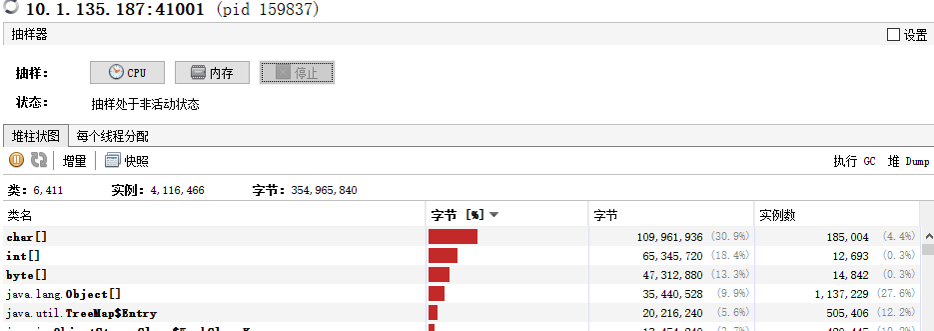
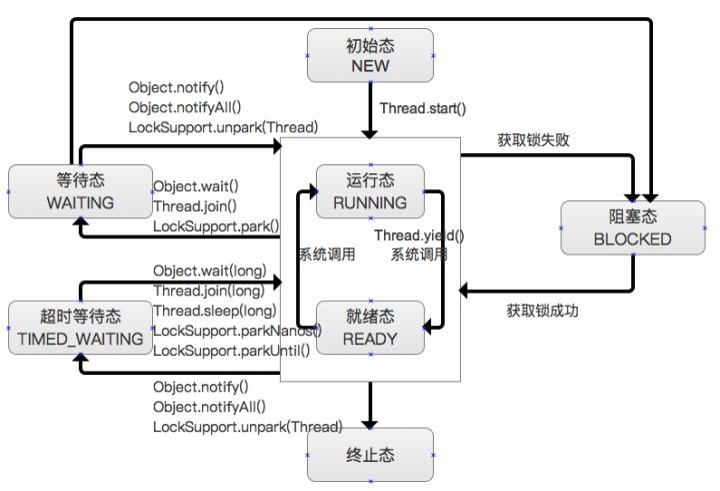

# WEEK028 - JVM 诊断工具大汇总

在日常开发和运维过程中，我们常常会遇到各种各样的疑难杂症，比如 CPU 占用过高、内存溢出、接口响应超时、程序异常、GC 频繁等等。对于一个合格的 Java 开发人员来说，熟练地运用各种工具对这些问题进行排查是基本技能。这篇文章对常用的 JVM 工具做一个汇总，方便我们对 Java 应用进行问题诊断、代码调试或性能分析。

## JDK 中自带的工具

### 命令行工具

在 JDK 中自带了很多实用的命令行工具可以帮助开发人员解决 Java 应用的疑难杂症，这些工具位于 JDK 的 bin 目录下：


尽管这些工具看上去都是 `.exe` 可执行文件，实际上它们只是 Java 程序的一层包装，真正的实现位于 `tools.jar` 中：


所以当我们执行 `jps.exe` 命令的时候，和执行 `java -classpath %JAVA_HOME%/lib/tools.jar sun.tools.jps.Jps` 是完全一样的。

不过要注意的是，在 JDK 9 之后，`tools.jar` 文件已经没有了，而是增加了一个 `jmods` 目录，之前的工具类可以通过引入模块来加载：

```
$ java --add-modules jdk.jcmd sun.tools.jps.Jps
```

下面是一些常用的诊断工具的用法总结：

* [jps - JVM Process Status Tool](./jps/README.md)
* [jinfo - Configuration Info for Java](./jinfo/README.md)
* [jstat - JVM Statistics Monitoring Tool](./jstat/README.md)
* jstatd - JVM jstat Daemon
* [jmap - Memory Map for Java](./jmap/README.md)
* [jhat - JVM Heap Analysis Tool](./jhat/README.md)
* [jstack - Stack Trace for Java](./jstack/README.md)
* jsadebugd - Serviceability Agent Debug Daemon for Java
* jcmd - JVM Diagnostic Commands tool

### 图形工具

除了命令行工具，JDK 还提供了一些图形化的监控工具方便观察 Java 应用的运行情况，可以非常直观地对程序的内存、线程、类加载等进行分析。

* jconsole - A JMX-compliant graphical tool for monitoring a Java virtual machine
* jmc - Java Mission Control
* [jvisualvm - Java VisualVM](./jvisualvm/README.md)

## 问题诊断工具

除了 JDK 自带的工具，还有一些开源的 JVM 诊断工具提供了更为丰富和强大的功能。

* [Arthas](https://arthas.aliyun.com/zh-cn/)
* [vjtools](https://github.com/vipshop/vjtools)
* [bistoury](https://github.com/qunarcorp/bistoury)
* [XPocket](https://xpocket.perfma.com/)

## 内存分析工具

* MAT - Eclipse Memory Analyzer

## 系统工具

* uptime
* top
    * 显示系统统计信息和进程信息
    * 显示线程信息：top -Hp [PID]
* vmstat
    * 统计 CPU、内存使用情况、swap 使用情况等
* iostat
    * 显示磁盘 I/O 使用情况
* gdb
* ldd
* lsof
* ps
* pstack
* strace
* ipcs
* free
* sar
* readelf
* objdump
* nm
* size
* gprof
* nmon
* valgrind
* asan

## 性能调优

### hprof

* -agentlib:hprof=cpu=times,interval=10
* -agentlib:hprof=heap=dump,format=b,file=core.bin
* -agentlib:hprof=heap=sites

```
# java -agentlib:hprof=help

     HPROF: Heap and CPU Profiling Agent (JVMTI Demonstration Code)

hprof usage: java -agentlib:hprof=[help]|[<option>=<value>, ...]

Option Name and Value  Description                    Default
---------------------  -----------                    -------
heap=dump|sites|all    heap profiling                 all
cpu=samples|times|old  CPU usage                      off
monitor=y|n            monitor contention             n
format=a|b             text(txt) or binary output     a
file=<file>            write data to file             java.hprof[{.txt}]
net=<host>:<port>      send data over a socket        off
depth=<size>           stack trace depth              4
interval=<ms>          sample interval in ms          10
cutoff=<value>         output cutoff point            0.0001
lineno=y|n             line number in traces?         y
thread=y|n             thread in traces?              n
doe=y|n                dump on exit?                  y
msa=y|n                Solaris micro state accounting n
force=y|n              force output to <file>         y
verbose=y|n            print messages about dumps     y

Obsolete Options
----------------
gc_okay=y|n

Examples
--------
  - Get sample cpu information every 20 millisec, with a stack depth of 3:
      java -agentlib:hprof=cpu=samples,interval=20,depth=3 classname
  - Get heap usage information based on the allocation sites:
      java -agentlib:hprof=heap=sites classname

Notes
-----
  - The option format=b cannot be used with monitor=y.
  - The option format=b cannot be used with cpu=old|times.
  - Use of the -Xrunhprof interface can still be used, e.g.
       java -Xrunhprof:[help]|[<option>=<value>, ...]
    will behave exactly the same as:
       java -agentlib:hprof=[help]|[<option>=<value>, ...]

Warnings
--------
  - This is demonstration code for the JVMTI interface and use of BCI,
    it is not an official product or formal part of the JDK.
  - The -Xrunhprof interface will be removed in a future release.
  - The option format=b is considered experimental, this format may change
    in a future release.
```

### BTrace



## 线上问题排查思路

* CPU load 飙高
    * 定位到 pid -> tid -> jstack 线程堆栈
* OOM
    * 配置自动 dump -> MAT 分析
    * 定位到哪个空间 OOM
* GC 频繁
    * 打开 gc 日志
    * jstat 查看并分析 gc 日志
* 服务无响应、响应超时、宕机
* 报 404、500、502、503、504 错误

### CPU 分析

* top -Hp [PID]
* VisualVM CPU 抽样器

### 线程分析

* 线程的几种状态
    * NEW
    * RUNNABLE
    * BLOCKED
    * WAITING
    * TIMED_WAITING
    * TERMINATED



* Monitor
    * 用以实现线程之间的互斥与协作
    * 每个对象有且仅有一个
* Entry Set：表示线程通过 synchronized 要求获取对象的锁，如果对象未被锁住，则变为 The Owner，否则则在 Entry Set 等待。一旦对象锁被其他线程释放，立即参与竞争。
* The Owner：表示线程成功竞争到对象锁。
* Wait Set：表示线程通过对象的 wait 方法释放对象的锁，并在等待区等待被唤醒。


### GC 分析

* 分析 GC 日志
    * Young GC 日志
        * [GC [PSYoungGen: 274931K->10738K(274944K)] 371093K->147186K(450048K), 0.0668480 secs] [Times: user=0.17 sys=0.08, real=0.07 secs]
    * Full GC 日志
        * [Full GC [PSYoungGen: 10738K->0K(274944K)] [ParOldGen: 136447K->140379K(302592K)] 147186K->140379K(577536K) [PSPermGen: 85411K->85376K(171008K)], 0.6763541 secs] [Times: user=1.75 sys=0.02, real=0.68 secs]
* GC 分析工具
    * http://gceasy.io
* 优化原则
    * Full GC 会对整个堆内存进行回收，耗时长，尽量减少 Full GC 次数
    * **GC tuning is the last task to be done**


https://northcoder.com/post/jvm-heap-dumps-and-oql/

https://my.oschina.net/feichexia/blog/196575

https://ithelp.ithome.com.tw/users/20140481/ironman/4472

https://cloud.tencent.com/developer/article/1790337

https://cloud.tencent.com/developer/article/1130026

https://juejin.cn/post/7104441940921286686

https://guns-y.github.io/2019/09/04/JVM/JVM%E9%97%AE%E9%A2%98%E8%AF%8A%E6%96%AD%E5%BF%AB%E9%80%9F%E5%85%A5%E9%97%A8/

https://blog.csdn.net/wj1314250/article/details/118370096

https://juejin.cn/post/6972450999034183710

https://www.cnblogs.com/dwtfukgv/p/15126148.html

https://tobebetterjavaer.com/jvm/problem-tools.html

https://github.com/patric-r/jvmtop

https://doctording.github.io/sword_at_offer/content/java_jvm/jvm_tools.html

https://coderbee.net/index.php/jvm/20190913/1929

https://blog.csdn.net/jicahoo/article/details/50933469

https://www.jianshu.com/p/27c06a43797b

* What
* When
* How
* Why
* Compare

## 参考

1. [JDK Tools and Utilities](https://docs.oracle.com/javase/7/docs/technotes/tools/)
