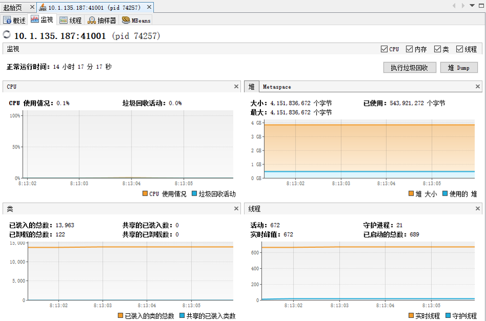
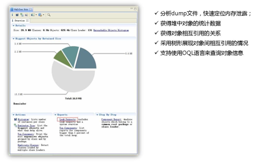
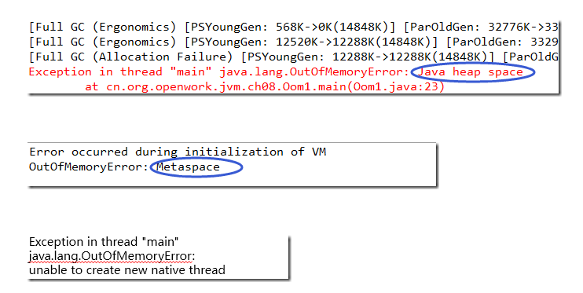
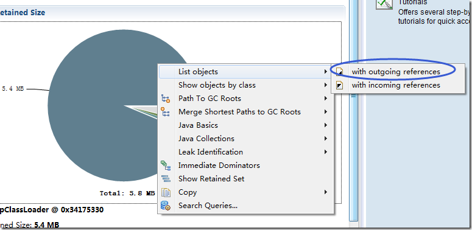

# WEEK028 - JVM 诊断工具汇总

* 性能调优
* 问题诊断
* 代码调试

## JDK 自带工具

### jps（ JVM Process Status Tool ）

显示所有的 HotSpot 虚拟机进程

* 命令格式
    * jps [options] [hostid]
* 主要参数
    * -l : 输出主类全名或 jar 路径
    * -q : 只输出 LVMID
    * -m : 输出 JVM 启动时传递给 main() 的参数
    * -v : 输出 JVM 启动时显示指定的 JVM 参数

```
# jps -l
30362 sun.tools.jps.Jps
20636 org.apache.zookeeper.server.quorum.QuorumPeerMain
20895 ./zkui-2.0-SNAPSHOT-jar-with-dependencies.jar
```

### jinfo（ JVM Configuration info ）

实时查看和调整虚拟机运行参数

* 命令格式
    * jinfo [option] [args] LVMID
    * jps –v 只能查看到显示指定的参数，jinfo 可以查看未被显示指定的参数
* 参数
    * -flag : 输出指定 args 参数的值（也可修改）
    * -flags : 不需要 args 参数，输出所有 JVM 参数的值
    * -sysprops : 输出系统属性，等同于 System.getProperties()

```
# jinfo -flags 20636
Attaching to process ID 20636, please wait...
Debugger attached successfully.
Server compiler detected.
JVM version is 25.342-b07
Non-default VM flags: -XX:CICompilerCount=15 -XX:+HeapDumpOnOutOfMemoryError -XX:InitialHeapSize=1048576000 -XX:+ManagementServer -XX:MaxHeapSize=1048576000 -XX:MaxNewSize=349175808 -XX:MinHeapDeltaBytes=524288 -XX:NewSize=349175808 -XX:OldSize=699400192 -XX:OnOutOfMemoryError=null -XX:+UseCompressedClassPointers -XX:+UseCompressedOops -XX:+UseParallelGC 
Command line:  -Dzookeeper.log.dir=/root/apache-zookeeper-3.5.5-bin/bin/../logs -Dzookeeper.log.file=zookeeper-local.log -Dzookeeper.root.logger=INFO,CONSOLE -Dzookeeper.4lw.commands.whitelist=* -XX:+HeapDumpOnOutOfMemoryError -XX:OnOutOfMemoryError=kill -9 %p -Xmx1000m -Dcom.sun.management.jmxremote -Dcom.sun.management.jmxremote.local.only=false
```

### jstat（ JVM Statistics Monitoring ）

用于监视虚拟机运行时状态信息，可以显示出虚拟机进程中的类装载、内存、垃圾收集、JIT 编译等运行数据

* 命令格式
    * jstat [option] LVMID [interval] [count]
* 常见 option
    * class : class loader 统计
    * compiler : JIT 编译器统计
    * gc : 垃圾回收堆的统计
    * gcutil : 垃圾回收统计概述

```
# jstat -gcutil 20636 1000 10
  S0     S1     E      O      M     CCS    YGC     YGCT    FGC    FGCT     GCT   
  0.00  34.38  48.32  20.40  96.47  90.26   6539  160.802     0    0.000  160.802
  0.00  34.38  49.53  20.40  96.47  90.26   6539  160.802     0    0.000  160.802
  0.00  34.38  49.54  20.40  96.47  90.26   6539  160.802     0    0.000  160.802
  0.00  34.38  49.71  20.40  96.47  90.26   6539  160.802     0    0.000  160.802
  0.00  34.38  49.71  20.40  96.47  90.26   6539  160.802     0    0.000  160.802
```

### jmap（ JVM Memory Map ）

生成 heap dump 文件，查询 finalize 执行队列、Java 堆和永久代的详细信息

* 命令格式
    * jmap [option] LVMID
* 常见 option
    * dump : 生成堆转储快照
    * -XX:+HeapDumpOnOutOfMemoryError
    * finalizerinfo : 显示在 F-Queue 队列等待 Finalizer 线程执行 finalizer 方法的对象
    * heap : 显示堆详细信息
    * histo : 显示堆中对象的统计信息
* 替代工具：jcmd

```
# jmap -dump:live,format=b,file=dump.hprof 20636
Dumping heap to /root/dump.hprof ...
Heap dump file created
```

```
# jmap -heap 20636
Attaching to process ID 20636, please wait...
Debugger attached successfully.
Server compiler detected.
JVM version is 25.342-b07

using thread-local object allocation.
Parallel GC with 23 thread(s)

Heap Configuration:
   MinHeapFreeRatio         = 0
   MaxHeapFreeRatio         = 100
   MaxHeapSize              = 1048576000 (1000.0MB)
   NewSize                  = 349175808 (333.0MB)
   MaxNewSize               = 349175808 (333.0MB)
   OldSize                  = 699400192 (667.0MB)
   NewRatio                 = 2
   SurvivorRatio            = 8
   MetaspaceSize            = 21807104 (20.796875MB)
   CompressedClassSpaceSize = 1073741824 (1024.0MB)
   MaxMetaspaceSize         = 17592186044415 MB
   G1HeapRegionSize         = 0 (0.0MB)

Heap Usage:
PS Young Generation
Eden Space:
   capacity = 57671680 (55.0MB)
   used     = 47560256 (45.35699462890625MB)
   free     = 10111424 (9.64300537109375MB)
   82.46726296164773% used
From Space:
   capacity = 1048576 (1.0MB)
   used     = 0 (0.0MB)
   free     = 1048576 (1.0MB)
   0.0% used
To Space:
   capacity = 1048576 (1.0MB)
   used     = 0 (0.0MB)
   free     = 1048576 (1.0MB)
   0.0% used
PS Old Generation
   capacity = 262668288 (250.5MB)
   used     = 10726192 (10.229293823242188MB)
   free     = 251942096 (240.2707061767578MB)
   4.083550428439995% used

4773 interned Strings occupying 390856 bytes.
```

### jhat（ JVM Heap Analysis Tool ）

与 jmap 搭配使用，用来分析 jmap 生成的 dump

* 命令格式
    * jhat [options] [dumpfile]
* 注意事项
    * 内置微型的 HTTP 服务器，生成分析结果后，可以在浏览器中查看，默认端口 7000
    * 一般不会直接在服务器上进行分析，因为 jhat 是一个耗时并且耗费硬件资源的过程，一般把服务器生成的 dump 文件复制到本地进行分析

```
# jhat /root/dump.hprof
Reading from /root/dump.hprof...
Dump file created Wed Nov 30 09:00:09 CST 2022
Snapshot read, resolving...
Resolving 142345 objects...
Chasing references, expect 28 dots............................
Eliminating duplicate references............................
Snapshot resolved.
Started HTTP server on port 7000
Server is ready.
```
### jstack

用于生成 Java 虚拟机当前时刻的线程快照

* 命令格式：
    * jstack option LVMID
* 用途
    * 定位线程出现长时间停顿的原因，如线程间死锁、死循环、请求外部资源导致的长时间等待等

```
# jstack -l 20636
2022-11-30 09:00:58
Full thread dump OpenJDK 64-Bit Server VM (25.342-b07 mixed mode):

"Attach Listener" #115 daemon prio=9 os_prio=0 tid=0x00007f142c001000 nid=0x1f4f waiting on condition [0x0000000000000000]
   java.lang.Thread.State: RUNNABLE

   Locked ownable synchronizers:
        - None

"NIOWorkerThread-64" #114 daemon prio=5 os_prio=0 tid=0x00007f1384022000 nid=0x518a waiting on condition [0x00007f148f3f2000]
   java.lang.Thread.State: WAITING (parking)
        at sun.misc.Unsafe.park(Native Method)
        - parking to wait for  <0x00000000c1810720> (a java.util.concurrent.locks.AbstractQueuedSynchronizer$ConditionObject)
        at java.util.concurrent.locks.LockSupport.park(LockSupport.java:175)
        at java.util.concurrent.locks.AbstractQueuedSynchronizer$ConditionObject.await(AbstractQueuedSynchronizer.java:2039)
        at java.util.concurrent.LinkedBlockingQueue.take(LinkedBlockingQueue.java:442)
        at java.util.concurrent.ThreadPoolExecutor.getTask(ThreadPoolExecutor.java:1074)
        at java.util.concurrent.ThreadPoolExecutor.runWorker(ThreadPoolExecutor.java:1134)
        at java.util.concurrent.ThreadPoolExecutor$Worker.run(ThreadPoolExecutor.java:624)
        at java.lang.Thread.run(Thread.java:750)

   Locked ownable synchronizers:
        - None

...
```

## Java VisualVM

* 配置
    * 本地
    * 远程：JMX
        * -Dcom.sun.management.jmxremote 
        * -Dcom.sun.management.jmxremote.port=41001 
        * -Dcom.sun.management.jmxremote.authenticate=false 
        * -Dcom.sun.management.jmxremote.ssl=false
    * 远程：jstatd
* 插件
    * Visual GC
    * Mbeans
* 类似工具
    * jconsole
    * JRocket Mission Control



## 系统工具

* uptime
* top
    * 显示系统统计信息和进程信息
    * 显示线程信息：top -Hp [PID]
* vmstat
    * 统计 CPU、内存使用情况、swap 使用情况等
* iostat
    * 显示磁盘 I/O 使用情况

## MAT（Eclipse Memory Analyzer）



## 性能调优

### hprof

* -agentlib:hprof=cpu=times,interval=10
* -agentlib:hprof=heap=dump,format=b,file=core.bin
* -agentlib:hprof=heap=sites

```
# java -agentlib:hprof=help

     HPROF: Heap and CPU Profiling Agent (JVMTI Demonstration Code)

hprof usage: java -agentlib:hprof=[help]|[<option>=<value>, ...]

Option Name and Value  Description                    Default
---------------------  -----------                    -------
heap=dump|sites|all    heap profiling                 all
cpu=samples|times|old  CPU usage                      off
monitor=y|n            monitor contention             n
format=a|b             text(txt) or binary output     a
file=<file>            write data to file             java.hprof[{.txt}]
net=<host>:<port>      send data over a socket        off
depth=<size>           stack trace depth              4
interval=<ms>          sample interval in ms          10
cutoff=<value>         output cutoff point            0.0001
lineno=y|n             line number in traces?         y
thread=y|n             thread in traces?              n
doe=y|n                dump on exit?                  y
msa=y|n                Solaris micro state accounting n
force=y|n              force output to <file>         y
verbose=y|n            print messages about dumps     y

Obsolete Options
----------------
gc_okay=y|n

Examples
--------
  - Get sample cpu information every 20 millisec, with a stack depth of 3:
      java -agentlib:hprof=cpu=samples,interval=20,depth=3 classname
  - Get heap usage information based on the allocation sites:
      java -agentlib:hprof=heap=sites classname

Notes
-----
  - The option format=b cannot be used with monitor=y.
  - The option format=b cannot be used with cpu=old|times.
  - Use of the -Xrunhprof interface can still be used, e.g.
       java -Xrunhprof:[help]|[<option>=<value>, ...]
    will behave exactly the same as:
       java -agentlib:hprof=[help]|[<option>=<value>, ...]

Warnings
--------
  - This is demonstration code for the JVMTI interface and use of BCI,
    it is not an official product or formal part of the JDK.
  - The -Xrunhprof interface will be removed in a future release.
  - The option format=b is considered experimental, this format may change
    in a future release.
```

### BTrace


## 线上问题排查思路

* CPU load 飙高
    * 定位到 pid -> tid -> jstack 线程堆栈
* OOM
    * 配置自动 dump -> MAT 分析
    * 定位到哪个空间 OOM
* GC 频繁
    * 打开 gc 日志
    * jstat 查看并分析 gc 日志
* 服务无响应、响应超时、宕机
* 报 404、500、502、503、504 错误

### CPU 分析

* top -Hp [PID]
* VisualVM CPU 抽样器

### 线程分析

* 线程的几种状态
    * NEW
    * RUNNABLE
    * BLOCKED
    * WAITING
    * TIMED_WAITING
    * TERMINATED


* Monitor
    * 用以实现线程之间的互斥与协作
    * 每个对象有且仅有一个
* Entry Set：表示线程通过 synchronized 要求获取对象的锁，如果对象未被锁住，则变为 The Owner，否则则在 Entry Set 等待。一旦对象锁被其他线程释放，立即参与竞争。
* The Owner：表示线程成功竞争到对象锁。
* Wait Set：表示线程通过对象的 wait 方法释放对象的锁，并在等待区等待被唤醒。


### 内存分析

* OOM 原因
    * 堆 OOM
    * 元空间 OOM
    * 线程栈 OOM
    * 直接内存 OOM



* MAT 的使用
    * 找出占用内存最大的对象
    * List objects（outgoing、ingoing）
    * Shallow Heap vs. Retained Heap
* Histogram：显示每个类使用情况以及占用空间大小
* Thread_overview：显示线程相关的信息
* OQL：通过类似SQL语句的表达式查询对象信息



### GC 分析

* 分析 GC 日志
    * Young GC 日志
        * [GC [PSYoungGen: 274931K->10738K(274944K)] 371093K->147186K(450048K), 0.0668480 secs] [Times: user=0.17 sys=0.08, real=0.07 secs]
    * Full GC 日志
        * [Full GC [PSYoungGen: 10738K->0K(274944K)] [ParOldGen: 136447K->140379K(302592K)] 147186K->140379K(577536K) [PSPermGen: 85411K->85376K(171008K)], 0.6763541 secs] [Times: user=1.75 sys=0.02, real=0.68 secs]
* GC 分析工具
    * http://gceasy.io
* 优化原则
    * Full GC 会对整个堆内存进行回收，耗时长，尽量减少 Full GC 次数
    * **GC tuning is the last task to be done**

## 其他开源工具

* [Arthas](https://arthas.aliyun.com/zh-cn/)
* [vjtools](https://github.com/vipshop/vjtools)
* [bistoury](https://github.com/qunarcorp/bistoury)
* [XPocket](https://xpocket.perfma.com/)
