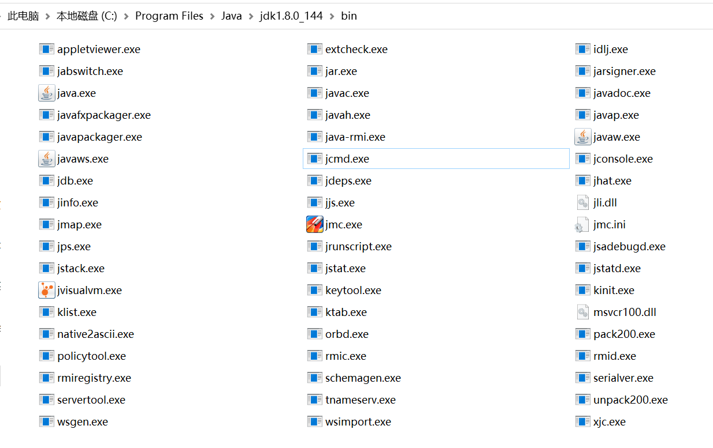
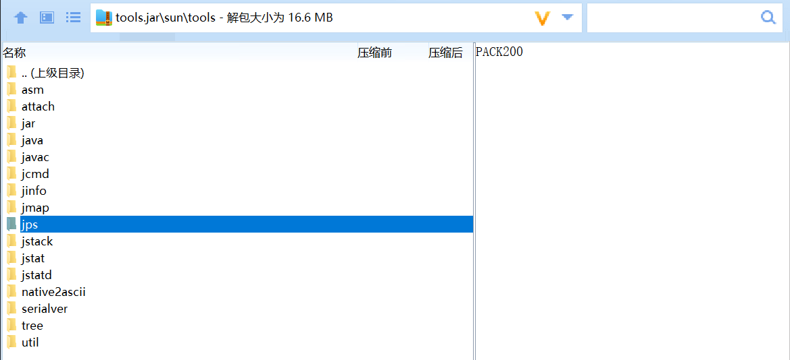

# WEEK028 - 细数 JDK 自带的那些调试和诊断工具

在日常开发和运维过程中，我们常常会遇到各种各样的疑难杂症，比如 CPU 占用过高、内存溢出、接口响应超时、程序异常、GC 频繁等等。对于一个合格的 Java 开发人员来说，熟练地运用各种工具对这些问题进行排查是基本技能。这篇文章主要对 JDK 内置的一些常用的 JVM 工具做一个汇总，方便我们对 Java 应用进行问题诊断、代码调试或性能分析。

## 命令行工具

在 JDK 中自带了很多实用的命令行工具可以帮助开发人员解决 Java 应用的疑难杂症，这些工具位于 JDK 的 bin 目录下：



尽管这些工具看上去都是 `.exe` 可执行文件，实际上它们只是 Java 程序的一层包装，真正的实现位于 `tools.jar` 中：



所以当我们执行 `jps.exe` 命令的时候，和执行 `java -classpath %JAVA_HOME%/lib/tools.jar sun.tools.jps.Jps` 是完全一样的。正因为此，我们在查看 `jstat`、`jmap` 和 `jhat` 等命令的使用帮助时，可以看到一个 `-J<flag>` 参数，这个参数用于指定 JVM 参数，比如 `-J-Xmx512m` 可以限定程序使用的最大堆内存。

不过要注意的是，在 JDK 9 之后，`tools.jar` 文件已经没有了，而是增加了一个 `jmods` 目录，之前的工具类可以通过引入模块来加载：

```
$ java --add-modules jdk.jcmd sun.tools.jps.Jps
```

下面对这些命令行工具的用法做一个简单的总结：

* [jps - JVM Process Status Tool](./jps/README.md)
* [jinfo - Configuration Info for Java](./jinfo/README.md)
* [jstat - JVM Statistics Monitoring Tool](./jstat/README.md)
* [jmap - Memory Map for Java](./jmap/README.md)
* [jhat - JVM Heap Analysis Tool](./jhat/README.md)
* [jstack - Stack Trace for Java](./jstack/README.md)
* [jcmd - JVM Diagnostic Commands Tool](./jcmd/README.md)
* [jstatd - JVM jstat Daemon](./jstatd/README.md)
* [jsadebugd - Serviceability Agent Debug Daemon for Java](./jsadebugd/README.md)
* [jdb - The Java Debugger](./jdb/README.md)
* [jhsdb - Java HotSpot Debugger](./jhsdb/READEME.md)

## Java Agent

有一些诊断工具比较特殊，它们并不是可执行文件，而是 JVM 内置的，或者以 Java Agent 的形式存在。

* [jmx - Java Management Extensions Agent](./jmx/README.md)
* [jdwp - Java Debug Wire Protocol](./jdwp/README.md)
* [hprof - A Heap/CPU Profiling Tool](./hprof/README.md)

## 图形化工具

除了命令行工具，JDK 还提供了一些图形化的监控工具方便观察 Java 应用的运行情况，可以非常直观地对程序的内存、线程、类加载等进行分析。

* [jconsole - A JMX-compliant graphical tool for monitoring a Java virtual machine](./jconsole/README.md)
* [jmc - JRocket Mission Control](./jmc/README.md)
* [jvisualvm - Java VisualVM](./jvisualvm/README.md)

## 参考

1. [JDK Tools and Utilities](https://docs.oracle.com/javase/8/docs/technotes/tools/)
1. [Java问题诊断和排查工具](https://tobebetterjavaer.com/jvm/problem-tools.html)
1. [JVM监控和诊断工具](https://www.cnblogs.com/dwtfukgv/p/15126148.html)
1. [Java自带的各类型命令工具](https://doctording.github.io/sword_at_offer/content/java_jvm/jvm_tools.html)
1. [JVM监控及诊断工具-GUI上篇](https://juejin.cn/post/6972450999034183710)
1. [史上最全图详解Jvm—诊断工具和JVM监控](https://blog.csdn.net/wj1314250/article/details/118370096)
1. [JVM问题诊断快速入门](https://guns-y.github.io/2019/09/04/JVM/JVM%E9%97%AE%E9%A2%98%E8%AF%8A%E6%96%AD%E5%BF%AB%E9%80%9F%E5%85%A5%E9%97%A8/)
1. [JVM性能调优-命令行工具jps/jstat/jinfo/jmap/jhat/jstack/jcmd](https://cloud.tencent.com/developer/article/1790337)
1. [展開JDK工具的30天應用之旅 系列](https://ithelp.ithome.com.tw/users/20140481/ironman/4472)
1. [JVM 性能调优监控工具 jps、jstack、jmap、jhat、jstat、hprof 使用详解](https://my.oschina.net/feichexia/blog/196575)
1. [jvm 性能调优工具之 jcmd](https://cloud.tencent.com/developer/article/1130026)

## 更多

### 问题诊断工具

除了 JDK 自带的工具，还有一些开源的 JVM 诊断工具提供了更为丰富和强大的功能：

* [Arthas](https://arthas.aliyun.com/zh-cn/)
* [vjtools](https://github.com/vipshop/vjtools)
* [bistoury](https://github.com/qunarcorp/bistoury)
* [XPocket](https://xpocket.perfma.com/)
* [patric-r/jvmtop](https://github.com/patric-r/jvmtop) - Java monitoring for the command-line, profiler included

### 内存分析工具

* [MAT - Eclipse Memory Analyzer](https://www.eclipse.org/mat/)

### Native Memory Tracking

1. [Native Memory Tracking 详解（1）:基础介绍](https://heapdump.cn/article/4644018)
1. [Native Memory Tracking 详解（2）:追踪区域分析(一)](https://heapdump.cn/article/4690198)
1. [Native Memory Tracking 详解（3）:追踪区域分析(二)](https://heapdump.cn/article/4813403)
1. [Native Memory Tracking 详解（4）:使用 NMT 协助排查内存问题案例](https://heapdump.cn/article/4926566)
1. [聊聊HotSpot VM的Native Memory Tracking](https://cloud.tencent.com/developer/article/1406522)
1. [JVM 堆外内存泄漏分析（一）](https://coderbee.net/index.php/jvm/20190913/1929)
1. [JVM 堆外内存泄漏分析（二）](https://coderbee.net/index.php/jvm/20190916/1936)
1. [Java内存之本地内存分析神器： NMT 和 pmap](https://blog.csdn.net/jicahoo/article/details/50933469)
1. [一次完整的JVM NativeMemoryTracking 堆外内存泄露分析](https://www.jianshu.com/p/27c06a43797b)

### 系统工具

* `uptime`
* `top` - 显示系统统计信息和进程信息
    * `top -Hp [PID]` - 显示线程信息
* `vmstat` - 统计 CPU、内存使用情况、swap 使用情况等
* `iostat` - 显示磁盘 I/O 使用情况
* `gdb`
* `ldd`
* `lsof`
* `ps`
* `pstack`
* `strace`
* `ipcs`
* `free`
* `sar`
* `readelf`
* `objdump`
* `nm`
* `size`
* `gprof`
* `nmon`
* `valgrind`
* `asan`

### 线上问题排查思路

* CPU load 飙高
    * 定位到 pid -> tid -> jstack 线程堆栈
* OOM
    * 配置自动 dump -> MAT 分析
    * 定位到哪个空间 OOM
* GC 频繁
    * 打开 gc 日志
    * jstat 查看并分析 gc 日志
* 服务无响应、响应超时、宕机
* 报 404、500、502、503、504 错误

### GC 分析

* 分析 GC 日志
    * Young GC 日志
        * [GC [PSYoungGen: 274931K->10738K(274944K)] 371093K->147186K(450048K), 0.0668480 secs] [Times: user=0.17 sys=0.08, real=0.07 secs]
    * Full GC 日志
        * [Full GC [PSYoungGen: 10738K->0K(274944K)] [ParOldGen: 136447K->140379K(302592K)] 147186K->140379K(577536K) [PSPermGen: 85411K->85376K(171008K)], 0.6763541 secs] [Times: user=1.75 sys=0.02, real=0.68 secs]
* GC 分析工具
    * http://gceasy.io
* 优化原则
    * Full GC 会对整个堆内存进行回收，耗时长，尽量减少 Full GC 次数
    * **GC tuning is the last task to be done**
