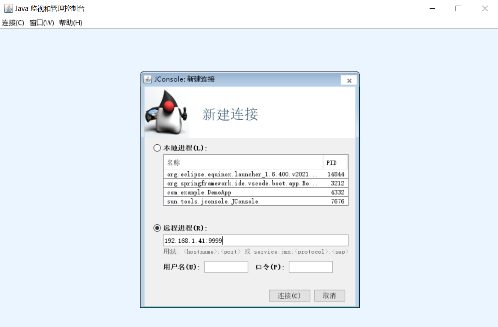

## jcmd - JVM Diagnostic Commands Tool

`jcmd` 是一个多功能的命令行工具，它几乎涵盖了之前学习的所有命令行工具的功能，可以使用它来查看 JVM 参数信息、查看线程堆栈、导出堆存储文件、执行 GC 操作等。

它的命令格式如下：

```
$ jcmd -help
Usage: jcmd <pid | main class> <command ...|PerfCounter.print|-f file>
   or: jcmd -l
   or: jcmd -h

  command must be a valid jcmd command for the selected jvm.
  Use the command "help" to see which commands are available.
  If the pid is 0, commands will be sent to all Java processes.
  The main class argument will be used to match (either partially
  or fully) the class used to start Java.
  If no options are given, lists Java processes (same as -p).

  PerfCounter.print display the counters exposed by this process
  -f  read and execute commands from the file
  -l  list JVM processes on the local machine
  -h  this help
```

### `jcmd -l`

`-l` 选项用于列出当前系统中的所有 Java 进程：

```
$ jcmd
5204 c:\Users\aneasystone\.vscode\extensions\redhat.java-1.13.0-win32-x64\server\plugins\org.eclipse.equinox.launcher_1.6.400.v20210924-0641.jar -configuration c:\Users\aneasystone\AppData\Roaming\Code\User\globalStorage\redhat.java\1.13.0\config_win -data c:\Users\aneasystone\AppData\Roaming\Code\User\workspaceStorage\22bf78ff5c09605d403aa67cd80654de\redhat.java\jdt_ws
8936 org.springframework.ide.vscode.boot.app.BootLanguageServerBootApp
14204 sun.tools.jcmd.JCmd
8204 com.example.DemoApp
```

它的输出类似于 `jps -lm`，不仅输出了主函数的完整类名，而且还输出了 Java 进程的启动参数。

### `jcmd <pid> help`

由于 `jcmd` 支持的命令非常多，要全部记住有点难，我们通常会先使用 `jcmd <pid> help` 查看某个进程支持哪些命令：

```
$ jcmd 8204 help
8204:
The following commands are available:
JFR.stop
JFR.start
JFR.dump
JFR.check
VM.native_memory
VM.check_commercial_features
VM.unlock_commercial_features
ManagementAgent.stop
ManagementAgent.start_local
ManagementAgent.start
VM.classloader_stats
GC.rotate_log
Thread.print
GC.class_stats
GC.class_histogram
GC.heap_dump
GC.finalizer_info
GC.heap_info
GC.run_finalization
GC.run
VM.uptime
VM.dynlibs
VM.flags
VM.system_properties
VM.command_line
VM.version
help

For more information about a specific command use 'help <command>'.
```

> 其中的 `<pid>` 部分也可以直接使用 `<main class>` 来代替：
> 
> ```
> $ jcmd com.example.DemoApp help
> ```

可以看到这里列出了一长串支持的命令清单，下面我们就来学习几个常用的命令。

### `jcmd <pid> VM.uptime`

`VM.uptime` 命令用于查看 Java 进程的启动时间：

```
$ jcmd 8204 VM.uptime
8204:
4031.908 s
```

### `jcmd <pid> VM.version`

`VM.version` 命令用于查看 Java 进程的虚拟机版本：

```
$ jcmd 8204 VM.version
8204:
Java HotSpot(TM) 64-Bit Server VM version 25.351-b10
JDK 8.0_351
```

### `jcmd <pid> VM.flags`

`VM.flags` 命令用于查看 Java 进程启动时的 JVM 参数：

```
$ jcmd 8204 VM.flags
8204:
-XX:CICompilerCount=4 -XX:InitialHeapSize=104857600 -XX:MaxHeapSize=209715200 -XX:MaxNewSize=69730304 -XX:MinHeapDeltaBytes=524288 -XX:NewSize=34603008 -XX:OldSize=70254592 -XX:+UseCompressedClassPointers -XX:+UseCompressedOops -XX:+UseFastUnorderedTimeStamps -XX:-UseLargePagesIndividualAllocation -XX:+UseParallelGC
```

这个命令的输出和 `jinfo -flags` 命令的输出有点类似，只是少了命令行参数相关的部分，这部分内容可以通过 `VM.command_line` 命令查看。

### `jcmd <pid> VM.command_line`

`VM.command_line` 命令用于查看 Java 进程启动时的命令行参数：

```
$ jcmd 8204 VM.command_line
8204:
VM Arguments:
jvm_args: -agentlib:jdwp=transport=dt_socket,server=n,suspend=y,address=localhost:62180 -Xms100M -Xmx200M
java_command: com.example.DemoApp
java_class_path (initial): D:\code\weekly-practice\notes\week028-jvm-diagnostic-tools\demo-3\target\classes
Launcher Type: SUN_STANDARD
```

这个命令的输出和 `jinfo -flags` 命令的输出有点类似，并且它的输出更丰富一些，多了 Java 进程的 `class path` 和启动类型等信息。

### `jcmd <pid> VM.system_properties`

`VM.system_properties` 命令用于显示 Java 进程所有的系统属性，等同于 `System.getProperties()`：

```
$ jcmd 8204 VM.system_properties
```

这个命令和 `jinfo -sysprops` 命令是一样的。

### `jcmd <pid> VM.classloader_stats`

`VM.classloader_stats` 命令用于显示 Java 进程中 ClassLoader 的统计信息：

```
$ jcmd 8204 VM.classloader_stats
8204:
ClassLoader         Parent              CLD*               Classes   ChunkSz   BlockSz  Type
0x000000010000f730  0x000000010000fad8  0x000001dd5e18cc20       1      6144      4008  sun.misc.Launcher$AppClassLoader
                                                                 2      4096      2720   + unsafe anonymous classes
0x000000010000fad8  0x0000000000000000  0x0000000000000000       0         0         0  sun.misc.Launcher$ExtClassLoader
0x0000000000000000  0x0000000000000000  0x000001dd4b87c750     714   4661248   4221040  <boot class loader>
                                                                67    141312     78808   + unsafe anonymous classes
Total = 3                                                      784   4812800   4306576
ChunkSz: Total size of all allocated metaspace chunks
BlockSz: Total size of all allocated metaspace blocks (each chunk has several blocks)
```

这个命令和 `jmap -clstats` 命令有点类似，但不完全一样。

### `jcmd <pid> VM.dynlibs`

`VM.dynlibs` 命令用于显示动态链接库的信息，和不带参数的 `jmap` 命令有点类似。

### `jcmd <pid> VM.native_memory`

`Native Memory Tracking` 简称 `NMT`，是从 JDK 8 开始引入的一个新特性，用于追踪了解 JVM 的内存使用详情，帮助我们排查内存增长与内存泄漏相关的问题。默认情况下，Java 进程并没有开启 NMT，这时是无法使用 `VM.native_memory` 命令的：

```
jcmd 8204 VM.native_memory
8204:
Native memory tracking is not enabled
```

我们需要在启动 Java 进程时指定 `-XX:NativeMemoryTracking` 参数，参数值可以设置为 `summary` 或 `detail`：

```
$ java -XX:NativeMemoryTracking=summary -jar demo.jar
```

`summary` 表示仅跟踪 JVM 子系统的内存使用情况（如：Java Heap、class、code、thread 等），`detail` 还可以通过单独的 CallSite、单独的虚拟内存区域及其提交区域来跟踪内存使用情况。

> 注意：启用 NMT 会导致 5% - 10% 的性能开销。

开启 NMT 之后，就可以使用 `VM.native_memory` 命令了：

```
$ jcmd 10552 VM.native_memory
10552:

Native Memory Tracking:

Total: reserved=1576129KB, committed=174341KB
-                 Java Heap (reserved=204800KB, committed=102400KB)
                            (mmap: reserved=204800KB, committed=102400KB)

-                     Class (reserved=1066145KB, committed=14241KB)
                            (classes #597)
                            (malloc=9377KB #635)
                            (mmap: reserved=1056768KB, committed=4864KB)

-                    Thread (reserved=25706KB, committed=25706KB)
                            (thread #26)
                            (stack: reserved=25600KB, committed=25600KB)
                            (malloc=75KB #135)
                            (arena=30KB #47)

-                      Code (reserved=249709KB, committed=2645KB)
                            (malloc=109KB #474)
                            (mmap: reserved=249600KB, committed=2536KB)

-                        GC (reserved=18065KB, committed=17645KB)
                            (malloc=10385KB #129)
                            (mmap: reserved=7680KB, committed=7260KB)

-                  Compiler (reserved=133KB, committed=133KB)
                            (malloc=2KB #30)
                            (arena=131KB #7)

-                  Internal (reserved=9648KB, committed=9648KB)
                            (malloc=9584KB #3302)
                            (mmap: reserved=64KB, committed=64KB)

-                    Symbol (reserved=1665KB, committed=1665KB)
                            (malloc=1017KB #213)
                            (arena=648KB #1)

-    Native Memory Tracking (reserved=83KB, committed=83KB)
                            (malloc=4KB #50)
                            (tracking overhead=79KB)

-               Arena Chunk (reserved=176KB, committed=176KB)
                            (malloc=176KB)
```

关于输出内容的解释和 NMT 更多的内容，可以参考 [这里](https://heapdump.cn/article/4644018) 和 [这里](https://cloud.tencent.com/developer/article/1406522)。

### `jcmd <pid> VM.check_commercial_features` 和 `jcmd <pid> VM.unlock_commercial_features`

`VM.check_commercial_features` 命令用于检查商业特性是否开启：

```
$ jcmd 10552 VM.check_commercial_features
10552:
Commercial Features are locked.
```

如果未开启，我们可以使用 `VM.unlock_commercial_features` 命令来开启：

```
$ jcmd 10552 VM.unlock_commercial_features
10552:
Commercial Features now unlocked.
```

开启之后我们重新检查：

```
$ jcmd 10552 VM.check_commercial_features
10552:
Commercial Features are unlocked.
Status of individual features:
  Java Flight Recorder has not been used.
  Resource Management is disabled.
  Current Memory Restriction: None (0)
```

我们也可以在启动 Java 进程时通过 `-XX:+UnlockCommercialFeatures` JVM 参数来开启商业特性。

### `jcmd <pid> Thread.print`

`Thread.print` 命令用于输出 Java 进程的线程堆栈信息：

```
$ jcmd 8204 Thread.print
8204:
2022-12-17 09:11:59
Full thread dump Java HotSpot(TM) 64-Bit Server VM (25.351-b10 mixed mode):

"DestroyJavaVM" #16 prio=5 os_prio=0 tid=0x000001dd4b855000 nid=0x1cec waiting on condition [0x0000000000000000]
   java.lang.Thread.State: RUNNABLE

"Thread-B" #15 prio=5 os_prio=0 tid=0x000001dd5fc12000 nid=0x1720 waiting on condition [0x000000a6299ff000]
   java.lang.Thread.State: WAITING (parking)
        at sun.misc.Unsafe.park(Native Method)
        - parking to wait for  <0x00000000fbe5eda0> (a java.util.concurrent.locks.ReentrantLock$NonfairSync)
        at java.util.concurrent.locks.LockSupport.park(LockSupport.java:175)
        at java.util.concurrent.locks.AbstractQueuedSynchronizer.parkAndCheckInterrupt(AbstractQueuedSynchronizer.java:836)
        at java.util.concurrent.locks.AbstractQueuedSynchronizer.acquireQueued(AbstractQueuedSynchronizer.java:870)
        at java.util.concurrent.locks.AbstractQueuedSynchronizer.acquire(AbstractQueuedSynchronizer.java:1199)
        at java.util.concurrent.locks.ReentrantLock$NonfairSync.lock(ReentrantLock.java:209)
        at java.util.concurrent.locks.ReentrantLock.lock(ReentrantLock.java:285)
        at com.example.DemoApp.lambda$1(DemoApp.java:36)
        at com.example.DemoApp$$Lambda$2/1123225098.run(Unknown Source)
        at java.lang.Thread.run(Thread.java:750)

"Thread-A" #14 prio=5 os_prio=0 tid=0x000001dd5fc11800 nid=0x1e70 waiting on condition [0x000000a6298ff000]
   java.lang.Thread.State: WAITING (parking)
        at sun.misc.Unsafe.park(Native Method)
        - parking to wait for  <0x00000000fbe5edd0> (a java.util.concurrent.locks.ReentrantLock$NonfairSync)
        at java.util.concurrent.locks.LockSupport.park(LockSupport.java:175)
        at java.util.concurrent.locks.AbstractQueuedSynchronizer.parkAndCheckInterrupt(AbstractQueuedSynchronizer.java:836)
        at java.util.concurrent.locks.AbstractQueuedSynchronizer.acquireQueued(AbstractQueuedSynchronizer.java:870)
        at java.util.concurrent.locks.AbstractQueuedSynchronizer.acquire(AbstractQueuedSynchronizer.java:1199)
        at java.util.concurrent.locks.ReentrantLock$NonfairSync.lock(ReentrantLock.java:209)
        at java.util.concurrent.locks.ReentrantLock.lock(ReentrantLock.java:285)
        at com.example.DemoApp.lambda$0(DemoApp.java:19)
        at com.example.DemoApp$$Lambda$1/1151020327.run(Unknown Source)
        at java.lang.Thread.run(Thread.java:750)

...
```

这个命令和不带参数的 `jstack` 命令类似，输出中不带有附加的锁信息，如果希望带上锁信息，可以加上 `-l` 参数：

```
$ jcmd 8204 Thread.print -l
```

### `jcmd <pid> GC.class_histogram`

`GC.class_histogram` 命令用于输出堆中对象的统计信息：

```
> jcmd 8204 GC.class_histogram
8204:

 num     #instances         #bytes  class name
----------------------------------------------
   1:          2598         422968  [C
   2:           683          78432  java.lang.Class
   3:          2326          55824  java.lang.String
   4:           792          40328  [Ljava.lang.Object;
   5:           792          31680  java.util.TreeMap$Entry
   6:            12          25280  [B
   7:           189          10584  java.lang.invoke.MemberName
   8:           198           9040  [Ljava.lang.String;
   9:           271           8672  java.util.concurrent.ConcurrentHashMap$Node
 ...
 230:             1             16  sun.misc.Launcher$Factory
 231:             1             16  sun.misc.Perf
 232:             1             16  sun.misc.Unsafe
 233:             1             16  sun.net.www.protocol.file.Handler
 234:             1             16  sun.reflect.ReflectionFactory
Total         11527         813048
```

这个命令和 `jmap -histo` 是一样的。

### `jcmd <pid> GC.class_stats`

`GC.class_stats` 命令用于输出类统计信息，该命令需要开启 `-XX:+UnlockDiagnosticVMOptions` JVM 参数。这个命令的输出比 `GC.class_histogram` 丰富的多，如下所示：

```
$ jcmd 2752 GC.class_stats
2752:
Index Super InstBytes KlassBytes annotations   CpAll MethodCount Bytecodes MethodAll   ROAll   RWAll   Total ClassName
    1    -1    437296        480           0       0           0         0         0      24     584     608 [C
    2    37     78952        648           0   19384         130      4973     27104   17080   32360   49440 java.lang.Class
    3    37     61704        624           0    8760          94      4626     28440   12520   26768   39288 java.lang.String
    4    -1     41240        480           0       0           0         0         0      24     584     608 [Ljava.lang.Object;
    5    37     31680        560           0    1288           7       171      1536     960    2792    3752 java.util.TreeMap$Entry
    6    -1     25976        480           0       0           0         0         0      24     584     608 [B
    7   474     12936       1112           0    5512          40       847      6792    4392    9872   14264 java.lang.reflect.Method
    8   471     12168        720           0    5816          44      1696      8808    6104   10136   16240 java.lang.reflect.Field
    9    37     11760        552           0   10312          87      4000     27320   11544   28328   39872 java.lang.invoke.MemberName
   10    -1      9040        480           0       0           0         0         0      48     584     632 [Ljava.lang.String;
...
  672    37         0        496           0    8112          45      1911      8880    6720   12176   18896 sun.usagetracker.UsageTrackerClient
  673    37         0        528           0     648           3        32       472     416    1488    1904 sun.usagetracker.UsageTrackerClient$1
  674    37         0        528           0     584           3        23       456     384    1432    1816 sun.usagetracker.UsageTrackerClient$2
  675    37         0        528           0     648           3        40       472     408    1488    1896 sun.usagetracker.UsageTrackerClient$3
  676    37         0        544           0    1704           3       156       608     656    2480    3136 sun.usagetracker.UsageTrackerClient$4
  677   518         0        936           0    1424          11       263      1872    1296    3328    4624 sun.util.PreHashedMap
  678    37         0        544           0    1376           7       247      1280     912    2552    3464 sun.util.locale.LocaleObjectCache
  679    37         0        496           0    1464          20       737      3736    2336    3720    6056 sun.util.locale.LocaleUtils
               872408     406720        2832 1300568        8353    365929   1758504 1174344 2546832 3721176 Total
                23.4%      10.9%        0.1%   35.0%           -      9.8%     47.3%   31.6%   68.4%  100.0%
Index Super InstBytes KlassBytes annotations   CpAll MethodCount Bytecodes MethodAll   ROAll   RWAll   Total ClassName
```

### `jcmd <pid> GC.heap_info`

`GC.heap_info` 命令用于输出 Java 进程的堆统计信息：

```
$ jcmd 2752 GC.heap_info
2752:
 PSYoungGen      total 29696K, used 0K [0x00000000fbd80000, 0x00000000fde80000, 0x0000000100000000)
  eden space 25600K, 0% used [0x00000000fbd80000,0x00000000fbd80000,0x00000000fd680000)
  from space 4096K, 0% used [0x00000000fd680000,0x00000000fd680000,0x00000000fda80000)
  to   space 4096K, 0% used [0x00000000fda80000,0x00000000fda80000,0x00000000fde80000)
 ParOldGen       total 68608K, used 851K [0x00000000f3800000, 0x00000000f7b00000, 0x00000000fbd80000)
  object space 68608K, 1% used [0x00000000f3800000,0x00000000f38d4fd8,0x00000000f7b00000)
 Metaspace       used 3664K, capacity 4638K, committed 4864K, reserved 1056768K
  class space    used 400K, capacity 460K, committed 512K, reserved 1048576K
```

该命令的输出和 `jmap -heap` 的输出比较类似。

### `jcmd <pid> GC.heap_dump <heap_file>`

`GC.heap_dump` 命令用于导出堆内存文件：

```
$ jcmd 8204 GC.heap_dump D:\heap.hprof
8204:
Heap dump file created
```

这个命令和 `jmap -dump` 是一样的，得到的堆文件也可以通过 `jhat`、`Visual VM` 或 `MAT` 等工具进行分析。

### `jcmd <pid> GC.finalizer_info`

`GC.finalizer_info` 命令用于统计堆积在 finalizer 队列中的对象：

```
$ jcmd 2752 GC.finalizer_info
2752:
No instances waiting for finalization found
```

该命令和 `jmap -finalizerinfo` 类似。

### `jcmd <pid> GC.rotate_log`

有时候 GC 日志文件比较大，可以通过 `GC.rotate_log` 命令强制进行一次日志文件滚动。

### `jcmd <pid> GC.run_finalization`

手工执行一次 finalization 操作，相当于执行 `System.runFinalization()` 方法。

### `jcmd <pid> GC.run`

手工执行一次垃圾回收操作，相当于执行 `System.gc()` 方法。注意这个操作只是告诉垃圾收集器打算进行垃圾收集，而垃圾收集器什么时候开始执行是不确定的。

### `jcmd <pid> PerfCounter.print`

`PerfCounter.print` 命令用于输出 Java 进程的性能统计信息：

```
$ jcmd 2752 PerfCounter.print
2752:
java.ci.totalTime=693728
java.cls.loadedClasses=621
java.cls.sharedLoadedClasses=0
java.cls.sharedUnloadedClasses=0
java.cls.unloadedClasses=0
...
```

### 开启 JFR 功能

飞行记录器（Flight Recorder）是一款非常强大的性能分析和诊断工具，它可以记录 Java 程序在一段时间内的运行情况，用于分析程序的内存、CPU、磁盘、网络等使用情况。首先使用 `JFR.start` 命令启动记录器：

```
$ jcmd 688 JFR.start
688:
Started recording 1. No limit (duration/maxsize/maxage) in use.

Use JFR.dump recording=1 filename=FILEPATH to copy recording data to file.
```

使用 `JFR.check` 命令检查记录器状态：

```
$ jcmd 688 JFR.check
688:
Recording: recording=1 name="Recording 1" (running)
```

使用 `JFR.dump` 命令将记录器记录的信息导出到 jfr 文件中：

```
$ jcmd 688 JFR.dump recording=1 filename=D:/688.jfr
688:
Dumped recording 1, 309.1 kB written to:

D:\688.jfr
```

导出的 jfr 文件可以通过工具 [JMC](https://www.oracle.com/javase/jmc/) 进行分析。最后，使用 `JFR.stop` 命令停止记录器：

```
$ jcmd 688 JFR.stop recording=1
688:
Stopped recording 1.
```

### 开启 Management Agent 功能

Management Agent 就是我们常说的 `JMX（Java Management Extensions）`，它是一套标准的管理和监控接口，通过 JMX 接口我们可以对远程的 Java 服务进行监控。一般我们可以通过在程序启动时指定下面的 JMX 参数来开启 Management Agent 功能：

```
-Djava.rmi.server.hostname=127.0.0.1 \
-Dcom.sun.management.jmxremote=true \
-Dcom.sun.management.jmxremote.local.only=false \
-Dcom.sun.management.jmxremote.port=9091 \
-Dcom.sun.management.jmxremote.host=127.0.0.1 \
-Dcom.sun.management.jmxremote.rmi.port=9092 \
-Dcom.sun.management.jmxremote.ssl=false \
-Dcom.sun.management.jmxremote.authenticate=false
```

如果我们在启动时没有指定 JMX 参数的话，就可以使用 `ManagementAgent.start` 命令来开启：

```
$ jcmd 4332 ManagementAgent.start jmxremote.port=9999 jmxremote.ssl=false jmxremote.authenticate=false
4332:
Command executed successfully
```

JMX 开启之后，我们就可以在本地通过 jconsole 之类的工具连接到远程进程上了：



> 此外还有一个 `ManagementAgent.start_local` 命令，和 `ManagementAgent.start` 有何区别？

使用 `ManagementAgent.stop` 关闭 JMX 功能：

```
$ jcmd 4332 ManagementAgent.stop
4332:
Command executed successfully
```

### 参考

1. [jvm 性能调优工具之 jcmd](https://cloud.tencent.com/developer/article/1130026)

#### Native Memory Tracking

1. [Native Memory Tracking 详解（1）:基础介绍](https://heapdump.cn/article/4644018)
1. [Native Memory Tracking 详解（2）:追踪区域分析(一)](https://heapdump.cn/article/4690198)
1. [Native Memory Tracking 详解（3）:追踪区域分析(二)](https://heapdump.cn/article/4813403)
1. [Native Memory Tracking 详解（4）:使用 NMT 协助排查内存问题案例](https://heapdump.cn/article/4926566)
1. [聊聊HotSpot VM的Native Memory Tracking](https://cloud.tencent.com/developer/article/1406522)
1. [JVM 堆外内存泄漏分析（一）](https://coderbee.net/index.php/jvm/20190913/1929)
1. [JVM 堆外内存泄漏分析（二）](https://coderbee.net/index.php/jvm/20190916/1936)
1. [Java内存之本地内存分析神器： NMT 和 pmap](https://blog.csdn.net/jicahoo/article/details/50933469)
1. [一次完整的JVM NativeMemoryTracking 堆外内存泄露分析](https://www.jianshu.com/p/27c06a43797b)
