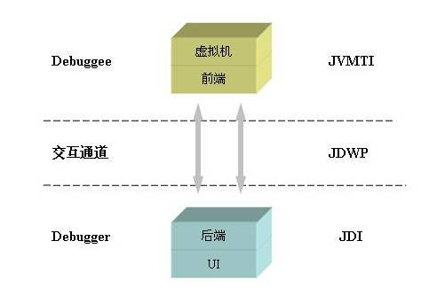

## jdwp - Java Debug Wire Protocol

当我们在 IDEA 或 VS Code 中调试 Java 代码时，如果细心观察就会发现，启动参数中有一串仿佛魔咒般的参数：

```
"C:\Program Files\Java\jdk1.8.0_111\bin\java" -agentlib:jdwp=transport=dt_socket,address=127.0.0.1:20060,suspend=y,server=n Test
Connected to the target VM, address: '127.0.0.1:20060', transport: 'socket'
```

其实，这串参数就隐藏着 Java 调试器真正的面目。这里面有两个关键点：

1. Java 程序在运行的时候带着 `-agentlib` 参数，这个参数用于指示 JVM 在启动时额外加载的动态库文件，`-agentlib` 参数和 `-javaagent` 不一样，这个库文件应该是由 C/C++ 编写的原生程序（JNI），类似于这里的 `jdwp`，在 Windows 上对应一个 `jdwp.dll` 库文件，在 Linux 上对应 `jdwp.so` 文件。那么这个 jdwp 库文件到底是做什么的呢？它后面的一串参数又是什么意思呢？
1. `jdwp` 的参数里貌似提到了 socket，并有 address=127.0.0.1:20060 这样的 IP 地址和端口号，而且下面的 **Connected to the target VM** 也似乎表示调试器连接到了这么一个网络地址，那么这个地址到底是什么呢？由于这里是本地调试，所以 IP 地址是 127.0.0.1 ，那么如果是远程调试的话，是不是这里也是支持的呢？

下面我们就来学习下 Java 调试器的基本原理。

### JPDA

我们知道，Java 程序都是运行在 JVM 上的，我们要调试 Java 程序，事实上就需要向 JVM 请求当前运行态的状态，并对 JVM 发出一定的指令，或者接受 JVM 的回调。为了实现 Java 程序的调试，JVM 提供了一整套用于调试的工具和接口，这套接口合在一起我们就把它叫做 [`JPDA（Java Platform Debugger Architecture，Java 平台调试体系）`](https://docs.oracle.com/javase/7/docs/technotes/guides/jpda/jpda_spis.html)。这个体系为开发人员提供了一整套用于调试 Java 程序的 API，是一套用于开发 Java 调试工具的接口和协议。本质上说，它是我们通向虚拟机，考察虚拟机运行态的一个通道，一套工具。

JPDA 由三个相对独立的层次共同组成，而且规定了它们三者之间的交互方式。这三个层次由低到高分别是 `JVMTI（Java 虚拟机工具接口）`，`JDWP（Java 调试线协议）` 以及 `JDI（Java 调试接口）`，如下图所示：



这三个模块把调试过程分解成几个很自然的概念：调试者（debugger）和被调试者（debuggee），以及他们中间的通信器。被调试者运行于我们想调试的 Java 虚拟机之上，它可以通过 JVMTI 这个标准接口，监控当前虚拟机的信息；调试者定义了用户可使用的调试接口，通过这些接口，用户可以对被调试虚拟机发送调试命令，同时调试者接受并显示调试结果。在调试者和被调试者之间，调试命令和调试结果，都是通过 JDWP 的通讯协议传输的。所有的命令被封装成 JDWP 命令包，通过传输层发送给被调试者，被调试者接收到 JDWP 命令包后，解析这个命令并转化为 JVMTI 的调用，在被调试者上运行。类似的，JVMTI 的运行结果，被格式化成 JDWP 数据包，发送给调试者并返回给 JDI 调用。而调试器开发人员就是通过 JDI 得到数据，发出指令。

### Connectors & Transport

到这里，我们已经知道了 JDWP 是调试器和被调试程序之间的一种通信协议。不过命令行参数 `-agentlib:jdwp=transport=dt_socket,address=127.0.0.1:20060,suspend=y,server=n` 中的 `jdwp` 貌似还不止于此。事实上，这个地方上 `jdwp.dll` 库文件把 JDI，JDWP，JVMTI 三部分串联成了一个整体，它不仅能调用本地 JVMTI 提供的调试能力，还实现了 JDWP 通信协议来满足 JVMTI 与 JDI 之间的通信。想要完全理解这串参数的意思，我们还需要学习两个概念：`Connectors（连接器）` 和 `Transport（传输）`。

常见的连接器有下面 5 种，它指的是 JDWP 建立连接的方式：

- Socket-attaching connector
- Shared-memory attaching connector
- Socket-listening connector
- Shared-memory listening connector
- Command-line launching connector

其中 **attaching connector** 和 **listening connector** 的区别在于到底是调试器作为服务端，还是被调试程序作为服务端。传输指的是 JDWP 的通信方式，一旦调试器和被调试程序之间建立起了连接，他们之间就需要开始通信，目前有两种通信方式：**Socket（套接字）** 和 **Shared-memory（共享内存，只用在 Windows 平台）**。

### 调试实战

通过上面的学习我们了解到，Java 调试器和被调试程序是以 C/S 架构的形式运行的，首先必须有一端以服务器的形式启动起来，然后另一段以客户端连接上去。如果被调试程序以服务端运行，必须加上下面的命令行参数（关于 jdwp 参数，可以参考 [JavaSE 的文档](http://docs.oracle.com/javase/7/docs/technotes/guides/jpda/conninv.html)）：

```
$ java -agentlib:jdwp=transport=dt_socket,server=y,address=5005 Test
$ java -agentlib:jdwp=transport=dt_shmem,server=y,address=javadebug Test
```

第一句是以 **socket 通信方式** 来启动程序，第二句是以 **共享内存** 的方式来启动程序，socket 方式需要指定一个端口号，调试器通过该端口号来连接它，共享内存方式需要指定一个连接名，而不是端口号。在程序运行起来之后，可以使用 jdb 的 `-attach` 参数将调试器和被调试程序连接起来：

```
$ jdb -attach 5005
$ jdb -attach javadebug
```

在 Windows 平台上，第一条命令会报这样的错：**java.io.IOException: shmemBase_attach failed: The system cannot find the file specified**，这是由于 `jdb -attach` 使用系统默认的传输来建立连接，而在 Windows 上默认的传输是 **共享内存** 。要想在 Windows 上使用 socket 方式来连接，要使用 `jdb -connect` 命令，只是命令的参数在写法上不太好记忆：

```
$ jdb -connect com.sun.jdi.SocketAttach:hostname=localhost,port=5005
$ jdb -connect com.sun.jdi.SharedMemoryAttach:name=javadebug
```

如果反过来，想让调试器以服务端运行，执行下面的命令：

```
$ jdb -listen javadebug
```

然后 Java 程序通过下面的参数来连接调试器：

```
$ java -agentlib:jdwp=transport=dt_socket,address=127.0.0.1:5005,suspend=y,server=n Test
$ java -agentlib:jdwp=transport=dt_shmem,address=javadebug, suspend=y Test
```

最后我们再回过头来看一看一开始我们提到的那一串魔咒参数，可以大胆的猜测，IDE 在调试的时候，首先以服务器形式启动调试器，并在 20060 端口监听，然后 Java 程序以 socket 通信方式连接该端口，并将 JVM 暂停等待调试。

```
"C:\Program Files\Java\jdk1.8.0_111\bin\java" -agentlib:jdwp=transport=dt_socket,address=127.0.0.1:20060,suspend=y,server=n Test
Connected to the target VM, address: '127.0.0.1:20060', transport: 'socket'
```

很显然，使用 socket 通信方式不仅可以在本地调试，也可以实现远程调试。
