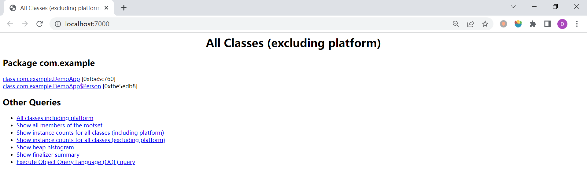
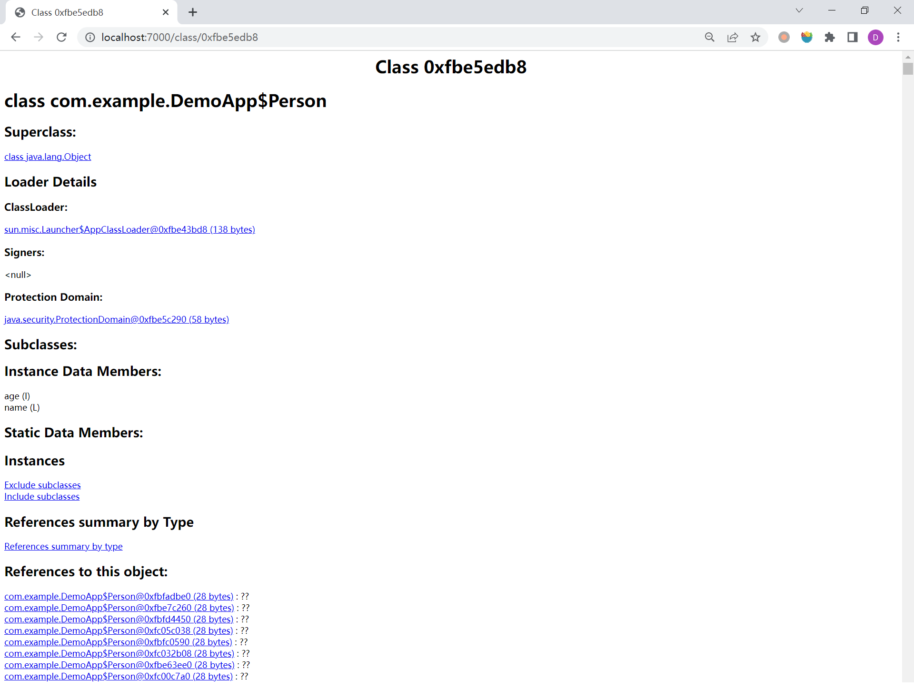

## jhat - JVM Heap Analysis Tool

`jhat` 是一款非常简单的堆分析工具，用来分析 `jmap -dump` 导出的堆存储文件。

它的命令格式如下：

```
$ jhat -h
Usage:  jhat [-stack <bool>] [-refs <bool>] [-port <port>] [-baseline <file>] [-debug <int>] [-version] [-h|-help] <file>

        -J<flag>          Pass <flag> directly to the runtime system. For
                          example, -J-mx512m to use a maximum heap size of 512MB
        -stack false:     Turn off tracking object allocation call stack.
        -refs false:      Turn off tracking of references to objects
        -port <port>:     Set the port for the HTTP server.  Defaults to 7000
        -exclude <file>:  Specify a file that lists data members that should
                          be excluded from the reachableFrom query.
        -baseline <file>: Specify a baseline object dump.  Objects in
                          both heap dumps with the same ID and same class will
                          be marked as not being "new".
        -debug <int>:     Set debug level.
                            0:  No debug output
                            1:  Debug hprof file parsing
                            2:  Debug hprof file parsing, no server
        -version          Report version number
        -h|-help          Print this help and exit
        <file>            The file to read

For a dump file that contains multiple heap dumps,
you may specify which dump in the file
by appending "#<number>" to the file name, i.e. "foo.hprof#3".

All boolean options default to "true"
```

### `jhat heap.hprof`

可以不带参数直接执行 `jhat` 命令：

```
$ jhat .\heap.hprof
Reading from .\heap.hprof...
Dump file created Sun Dec 11 12:56:11 CST 2022
Snapshot read, resolving...
Resolving 38498 objects...
Chasing references, expect 7 dots.......
Eliminating duplicate references.......
Snapshot resolved.
Started HTTP server on port 7000
Server is ready.
```

`jhat` 内置了一个微型的 HTTP 服务器，生成分析结果后，可以在浏览器中查看，默认端口 7000，我们访问 http://localhost:7000，如下：



页面中显示了所有的 **非平台类**，我们点击其中某个类，进入该类的详情页面：



这里展示了该类的超类、ClassLoader、子类、成员变量以及该类的实例对象和引用等信息。

TODO

> 值得注意的是，一般不会直接在服务器上进行分析，因为 `jhat` 是一个耗时并且耗费硬件资源的过程，我们一般把服务器生成的堆文件复制到本地进行分析。
