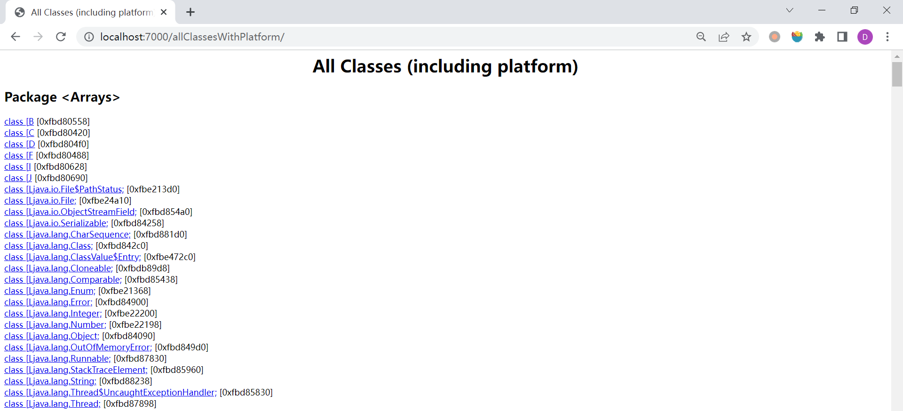
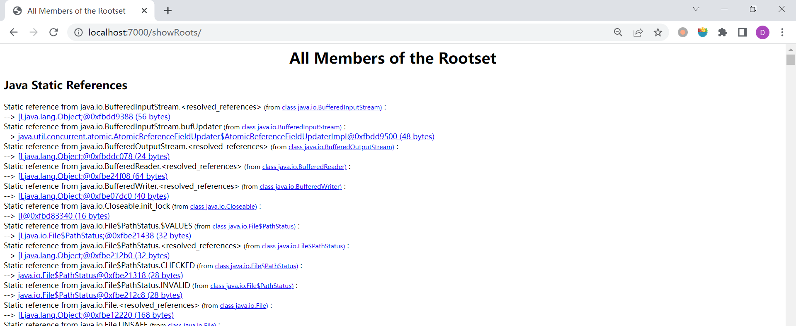
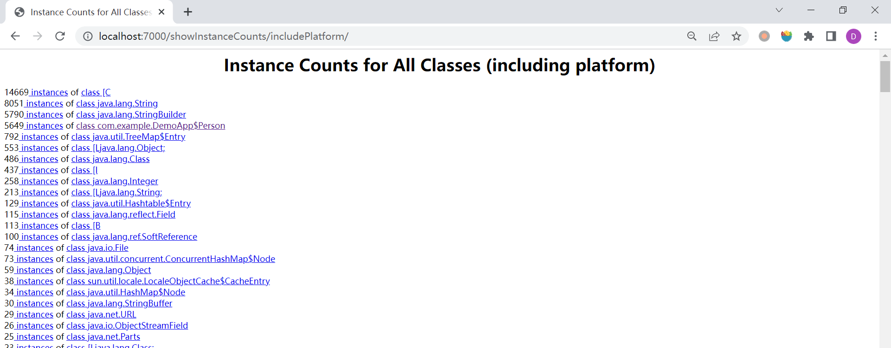
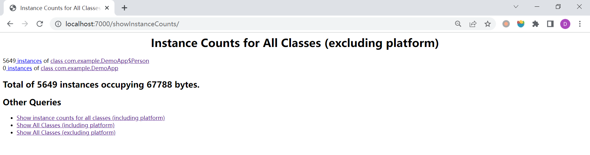
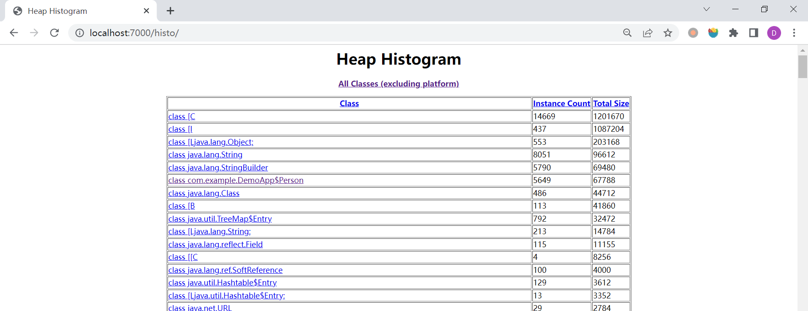
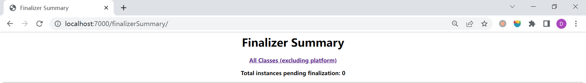
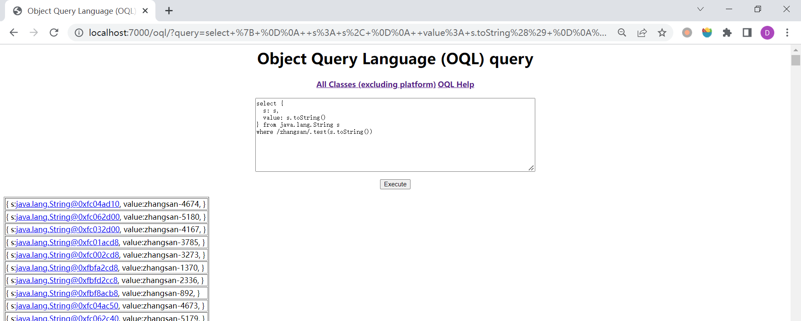

## jhat - JVM Heap Analysis Tool

`jhat` 是一款非常简单的堆分析工具，用来分析 `jmap -dump` 导出的堆存储文件。

它的命令格式如下：

```
$ jhat -h
Usage:  jhat [-stack <bool>] [-refs <bool>] [-port <port>] [-baseline <file>] [-debug <int>] [-version] [-h|-help] <file>

        -J<flag>          Pass <flag> directly to the runtime system. For
                          example, -J-mx512m to use a maximum heap size of 512MB
        -stack false:     Turn off tracking object allocation call stack.
        -refs false:      Turn off tracking of references to objects
        -port <port>:     Set the port for the HTTP server.  Defaults to 7000
        -exclude <file>:  Specify a file that lists data members that should
                          be excluded from the reachableFrom query.
        -baseline <file>: Specify a baseline object dump.  Objects in
                          both heap dumps with the same ID and same class will
                          be marked as not being "new".
        -debug <int>:     Set debug level.
                            0:  No debug output
                            1:  Debug hprof file parsing
                            2:  Debug hprof file parsing, no server
        -version          Report version number
        -h|-help          Print this help and exit
        <file>            The file to read

For a dump file that contains multiple heap dumps,
you may specify which dump in the file
by appending "#<number>" to the file name, i.e. "foo.hprof#3".

All boolean options default to "true"
```

### `jhat heap.hprof`

可以不带参数地直接执行 `jhat` 命令，对堆文件进行分析：

```
$ jhat .\heap.hprof
Reading from .\heap.hprof...
Dump file created Sun Dec 11 12:56:11 CST 2022
Snapshot read, resolving...
Resolving 38498 objects...
Chasing references, expect 7 dots.......
Eliminating duplicate references.......
Snapshot resolved.
Started HTTP server on port 7000
Server is ready.
```

> 一般不会直接在服务器上进行分析，因为 `jhat` 是一个耗时并且耗费硬件资源的过程，我们一般把服务器生成的堆文件复制到本地进行分析。

`jhat` 内置了一个微型的 HTTP 服务器，生成分析结果后，可以在浏览器中查看，默认端口 7000，我们访问 http://localhost:7000，如下：


页面中显示了所有的 **非平台类**，由于我们的代码比较简单，就只有两个类。我们点击其中某个类，进入该类的详情页面：


这里展示了该类的超类、ClassLoader、子类、成员变量以及该类的实例对象和引用等信息。

除此之外，页面底部还有另外几个比较常用的查询入口：

* All classes including platform



这个页面显示了包括平台类在内的所有类。

* Show all members of the rootset



这个页面显示了从根集（rootset）能引用到的所有对象。

* Show instance counts for all classes (including platform)



这个页面显示了包括平台类在内的所有类的实例数，可以看到实例数最多的是 `class [C`，这实际上就是 `char[]`，一般来说，大多数 `class [C` 都是我们代码中的字符串对象，因为 `String` 的内部实现就是 `char[]`。

* Show instance counts for all classes (excluding platform)



这个页面显示了除平台类之外的所有类的实例数。

* Show heap histogram



这个页面比较直观的显示了堆内类的统计信息，和命令 `jmap -histo <pid>` 的效果一样。

* Show finalizer summary



这个页面统计堆积在 finalizer 队列中的对象，和命令 `jmap -finalizerinfo <pid>` 的效果一样。

* Execute Object Query Language (OQL) query



`Object Query Language (OQL)` 是一种非常强大的对象查询语言。通常导出的堆文件都比较大，很难通过页面的链接找到想要的信息，这时就可以使用 OQL 来帮我们查询了。

```
select { 
  s: s, 
  value: s.toString() 
} from java.lang.String s 
where /zhangsan/.test(s.toString())
```

上面是一个简单的例子，查询所有包含 `zhangsan` 的字符串，关于它具体的语法，可以参考 [Object Query Language (OQL)](http://cr.openjdk.java.net/~sundar/8022483/webrev.01/raw_files/new/src/share/classes/com/sun/tools/hat/resources/oqlhelp.html)。