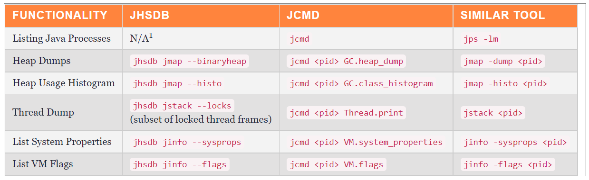
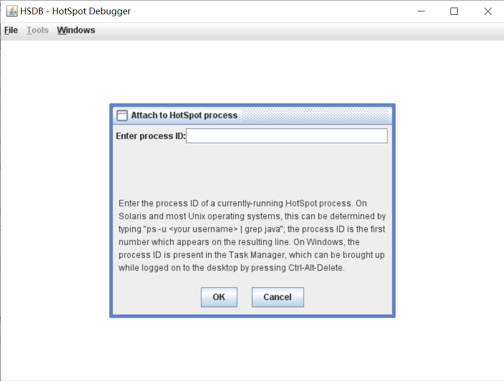
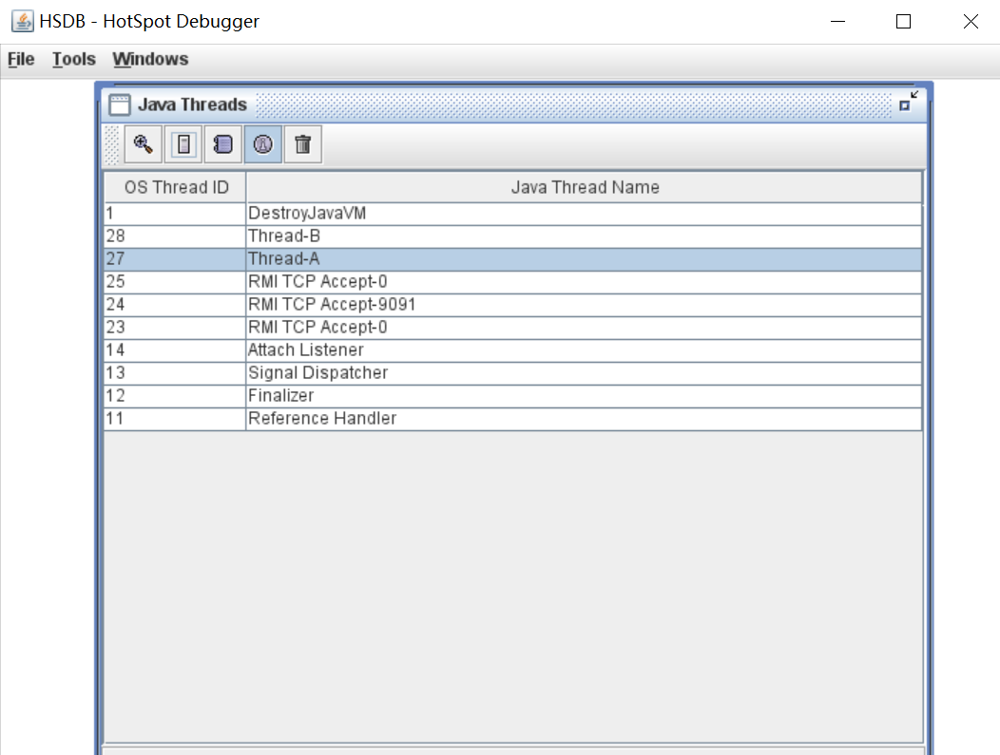

## jhsdb - Java HotSpot Debugger

`jhsdb` 是一个基于服务性代理（ `Serviceability Agent`，简称 `SA` ）的 HotSpot 进程调试器，从 JDK 9 开始正式提供，它其实是一个集大成的多合一工具，内置了大量的其他命令行工具的功能，不仅如此，它还内置了图形界面。

它的命令格式如下：

```
$ jhsdb -help
    clhsdb              command line debugger
    debugd              debug server
    hsdb                ui debugger
    jstack --help       to get more information
    jmap   --help       to get more information
    jinfo  --help       to get more information
    jsnap  --help       to get more information
```

我们知道 `jcmd` 也是一款多合一的命令行工具，从上面可以看出 `jhsdb` 和 `jcmd` 有很多类似的地方，在 [jhsdb: A New Tool for JDK 9](https://dzone.com/articles/jhsdb-a-new-tool-for-jdk-9) 这篇文章中对这两个工具做了一个简单的对比：



> 实际上，`HSDB` 在 JDK 9 之前就已经存在了，我们在 JDK 的 lib 目录下会找到一个 `sa-jdi.jar` 文件，这个 jar 包中就包含了 HSDB 和 CLHSDB 等工具。

### `jhsdb clhsdb`

这个命令以命令行形式运行调试器，运行后需要先 `attach` 到一个进程才能执行后续操作：

```
$ jhsdb clhsdb
hsdb> attach 4608
Attaching to process 4608, please wait...
```

比如使用 `jhisto` 显示类统计信息：

```
hsdb> jhisto
Iterating over heap. This may take a while...
Object Histogram:

num       #instances    #bytes  Class description
--------------------------------------------------------------------------
1:              23469   2289008 char[]
2:              2704    702296  int[]
3:              3379    691632  byte[]
4:              15324   367776  java.lang.String
5:              1671    189488  java.lang.Class
6:              2715    152040  jdk.internal.org.objectweb.asm.Item
7:              3155    151528  java.lang.Object[]
8:              2386    95440   java.util.TreeMap$Entry
9:              158     91360   jdk.internal.org.objectweb.asm.Item[]
10:             832     73216   java.lang.reflect.Method
11:             2284    73088   java.util.HashMap$Node
12:             2869    72008   java.lang.Class[]
13:             2727    65448   java.lang.StringBuilder
14:             947     60608   sun.nio.fs.WindowsFileAttributes
15:             453     47672   java.util.HashMap$Node[]
...
919:            1       16      java.lang.invoke.MethodHandleStatics$1
920:            1       16      sun.util.resources.LocaleData
921:            1       16      java.util.logging.LogManager$1
922:            1       16      sun.usagetracker.UsageTrackerClient
923:            1       16      sun.management.Flag$1
924:            1       16      sun.rmi.transport.proxy.RMIDirectSocketFactory
925:            1       16      jdk.net.ExtendedSocketOptions$PlatformSocketOptions
926:            1       16      sun.reflect.ReflectionFactory
Total :         93346   6150656
Heap traversal took 2.423 seconds.
```

更多命令使用 `help` 查看：

```
hsdb> help
Available commands:
  assert true | false
  attach pid | exec core
  buildreplayjars [ all | app | boot ]  | [ prefix ]
  class name
  classes
  detach
  dis address [length]
  disassemble address
  dumpcfg { -a | id }
  dumpclass { address | name } [ directory ]
  dumpcodecache
  dumpheap [ file ]
  dumpideal { -a | id }
  dumpilt { -a | id }
  dumpreplaydata { <address > | -a | <thread_id> }
  echo [ true | false ]
  examine [ address/count ] | [ address,address]
  field [ type [ name fieldtype isStatic offset address ] ]
  findpc address
  flags [ flag | -nd ]
  help [ command ]
  history
  inspect expression
  intConstant [ name [ value ] ]
  jdis address
  jhisto
  jseval script
  jsload file
  jstack [-v]
  livenmethods
  longConstant [ name [ value ] ]
  mem address [ length ]
  pmap
  print expression
  printall
  printas type expression
  printmdo [ -a | expression ]
  printstatics [ type ]
  pstack [-v]
  quit
  reattach
  revptrs address
  scanoops start end [ type ]
  search [ heap | perm | rawheap | codecache | threads ] value
  source filename
  symbol address
  symboldump
  symboltable name
  sysprops
  thread { -a | id }
  threads
  tokenize ...
  type [ type [ name super isOop isInteger isUnsigned size ] ]
  universe
  verbose true | false
  versioncheck [ true | false ]
  vmstructsdump
  whatis address
  where { -a | id }
```

> 在 JDK 9 之前，这个命令等价于：
> 
> ```
> $ java -cp $JAVA_HOME/lib/sa-jdi.jar sun.jvm.hotspot.CLHSDB`
> ```

### `jhsdb hsdb`

这个命令以图形界面运行调试器，运行后在 `File` 中点击 `Attach to HotSpot process`：



或者以 `--pid` 参数直接运行：

```
$ jhsdb hsdb --pid <pid>
```

刚进入会显示出 Java 进程的所有线程：



更多操作可以在 Tools 菜单中找到。

> 在 JDK 9 之前，这个命令等价于：
> 
> ```
> $ java -cp $JAVA_HOME/lib/sa-jdi.jar sun.jvm.hotspot.HSDB
> ```

### `jhsdb debugd`

这个命令和 `jsadebugd` 是一样的，或者通过下面的方式来调用：

```
$ java -cp $JAVA_HOME/lib/sa-jdi.jar sun.jvm.hotspot.jdi.SADebugServer
```
