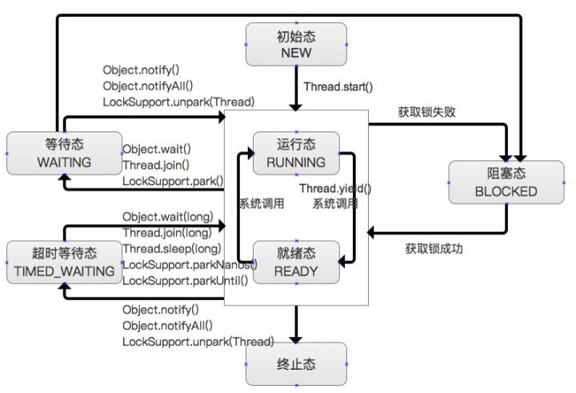
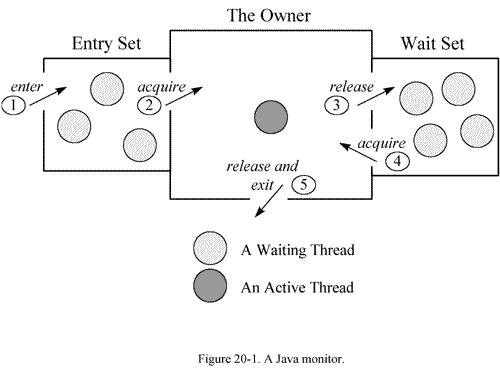

## jstack - Stack Trace for Java

`jstack` 用于生成 Java 程序当前时刻的线程快照，这个命令可以帮我们定位线程出现长时间停顿的原因，比如线程间的死锁、死循环、请求外部资源导致的长时间等待等。

它的命令格式如下：

```
$ jstack -h
Usage:
    jstack [-l] <pid>
        (to connect to running process)
    jstack -F [-m] [-l] <pid>
        (to connect to a hung process)
    jstack [-m] [-l] <executable> <core>
        (to connect to a core file)
    jstack [-m] [-l] [server_id@]<remote server IP or hostname>
        (to connect to a remote debug server)

Options:
    -F  to force a thread dump. Use when jstack <pid> does not respond (process is hung)
    -m  to print both java and native frames (mixed mode)
    -l  long listing. Prints additional information about locks
    -h or -help to print this help message
```

### `jstack <pid>`

`jstack` 直接后跟 Java 进程的 PID，用于输出 Java 进程当前的线程堆栈：

```
$ jstack 8324
2022-12-14 07:35:00
Full thread dump Java HotSpot(TM) 64-Bit Server VM (25.351-b10 mixed mode):

"Service Thread" #13 daemon prio=9 os_prio=0 tid=0x00000152d8d6e000 nid=0x4764 runnable [0x0000000000000000]
   java.lang.Thread.State: RUNNABLE

"C1 CompilerThread3" #12 daemon prio=9 os_prio=2 tid=0x00000152d8d1c000 nid=0x363c waiting on condition [0x0000000000000000]
   java.lang.Thread.State: RUNNABLE

"C2 CompilerThread2" #11 daemon prio=9 os_prio=2 tid=0x00000152d8d09800 nid=0x3fcc waiting on condition [0x0000000000000000]
   java.lang.Thread.State: RUNNABLE

"C2 CompilerThread1" #10 daemon prio=9 os_prio=2 tid=0x00000152d8cf4800 nid=0x3700 waiting on condition [0x0000000000000000]
   java.lang.Thread.State: RUNNABLE

"C2 CompilerThread0" #9 daemon prio=9 os_prio=2 tid=0x00000152d8cf1000 nid=0x384 waiting on condition [0x0000000000000000]
   java.lang.Thread.State: RUNNABLE

"JDWP Command Reader" #8 daemon prio=10 os_prio=0 tid=0x00000152d8ce1000 nid=0x2b50 runnable [0x0000000000000000]
   java.lang.Thread.State: RUNNABLE

"JDWP Event Helper Thread" #7 daemon prio=10 os_prio=0 tid=0x00000152d8ce0800 nid=0x1ae0 runnable [0x0000000000000000]
   java.lang.Thread.State: RUNNABLE

"JDWP Transport Listener: dt_socket" #6 daemon prio=10 os_prio=0 tid=0x00000152d7609800 nid=0x1340 runnable [0x0000000000000000]
   java.lang.Thread.State: RUNNABLE

"Attach Listener" #5 daemon prio=5 os_prio=2 tid=0x00000152d758b800 nid=0x16a4 waiting on condition [0x0000000000000000]
   java.lang.Thread.State: RUNNABLE

"Signal Dispatcher" #4 daemon prio=9 os_prio=2 tid=0x00000152d7573800 nid=0x2884 runnable [0x0000000000000000]
   java.lang.Thread.State: RUNNABLE

"Finalizer" #3 daemon prio=8 os_prio=1 tid=0x00000152d694a800 nid=0x1d68 in Object.wait() [0x0000000ab48ff000]
   java.lang.Thread.State: WAITING (on object monitor)
        at java.lang.Object.wait(Native Method)
        - waiting on <0x00000000fbd88f08> (a java.lang.ref.ReferenceQueue$Lock)
        at java.lang.ref.ReferenceQueue.remove(ReferenceQueue.java:150)
        - locked <0x00000000fbd88f08> (a java.lang.ref.ReferenceQueue$Lock)
        at java.lang.ref.ReferenceQueue.remove(ReferenceQueue.java:171)
        at java.lang.ref.Finalizer$FinalizerThread.run(Finalizer.java:188)

"Reference Handler" #2 daemon prio=10 os_prio=2 tid=0x00000152d755a000 nid=0x4368 in Object.wait() [0x0000000ab47ff000]
   java.lang.Thread.State: WAITING (on object monitor)
        at java.lang.Object.wait(Native Method)
        - waiting on <0x00000000fbd86ba0> (a java.lang.ref.Reference$Lock)
        at java.lang.Object.wait(Object.java:502)
        at java.lang.ref.Reference.tryHandlePending(Reference.java:191)
        - locked <0x00000000fbd86ba0> (a java.lang.ref.Reference$Lock)
        at java.lang.ref.Reference$ReferenceHandler.run(Reference.java:153)

"main" #1 prio=5 os_prio=0 tid=0x00000152c4b53000 nid=0x9fc waiting on condition [0x0000000ab3dff000]
   java.lang.Thread.State: TIMED_WAITING (sleeping)
        at java.lang.Thread.sleep(Native Method)
        at com.example.DemoApp.main(DemoApp.java:14)

"VM Thread" os_prio=2 tid=0x00000152d7533800 nid=0x3ef8 runnable

"GC task thread#0 (ParallelGC)" os_prio=0 tid=0x00000152c4b69800 nid=0x4650 runnable

"GC task thread#1 (ParallelGC)" os_prio=0 tid=0x00000152c4b6a800 nid=0x41ec runnable

"GC task thread#2 (ParallelGC)" os_prio=0 tid=0x00000152c4b6c000 nid=0xa44 runnable

"GC task thread#3 (ParallelGC)" os_prio=0 tid=0x00000152c4b6d800 nid=0xeb0 runnable

"GC task thread#4 (ParallelGC)" os_prio=0 tid=0x00000152c4b6f800 nid=0x32c4 runnable

"GC task thread#5 (ParallelGC)" os_prio=0 tid=0x00000152c4b70800 nid=0x40d4 runnable

"GC task thread#6 (ParallelGC)" os_prio=0 tid=0x00000152c4b73800 nid=0x4270 runnable

"GC task thread#7 (ParallelGC)" os_prio=0 tid=0x00000152c4b74800 nid=0x2560 runnable

"VM Periodic Task Thread" os_prio=2 tid=0x00000152d8daa800 nid=0x26dc waiting on condition

JNI global references: 464
```

上面是示例程序的线程堆栈，可以看出就算程序非常简单，JVM 也会帮我们创建很多辅助的线程，一共有 23 个：

* Service Thread

JVM 内部线程，用于监听和处理一些 JVM 的内部事件（[参考](https://stackoverflow.com/questions/65227612/what-is-the-service-thread-in-the-jvm)）。

* C1 CompilerThread3
* C2 CompilerThread2
* C2 CompilerThread1
* C2 CompilerThread0

这几个线程是 JIT 编译器相关的线程，用于 C1 编译（Client Compiler）和 C2 编译（Server Compiler）。

* JDWP Command Reader
* JDWP Event Helper Thread
* JDWP Transport Listener: dt_socket

JDWP 全称为 **Java Debug Wire Protocol**，用于 Java 调试器，由于我们这里使用了调试模式启动程序，所以能看到这几个线程。

* Attach Listener
* Signal Dispatcher

http://lovestblog.cn/blog/2014/06/18/jvm-attach/

* Finalizer
* Reference Handler
* main
* VM Thread
* GC task thread#0 (ParallelGC)
* GC task thread#1 (ParallelGC)
* GC task thread#2 (ParallelGC)
* GC task thread#3 (ParallelGC)
* GC task thread#4 (ParallelGC)
* GC task thread#5 (ParallelGC)
* GC task thread#6 (ParallelGC)
* GC task thread#7 (ParallelGC)
* VM Periodic Task Thread

### 线程分析

* 线程的几种状态
    * NEW
    * RUNNABLE
    * BLOCKED
    * WAITING
    * TIMED_WAITING
    * TERMINATED



* Monitor
    * 用以实现线程之间的互斥与协作
    * 每个对象有且仅有一个
* Entry Set：表示线程通过 synchronized 要求获取对象的锁，如果对象未被锁住，则变为 The Owner，否则则在 Entry Set 等待。一旦对象锁被其他线程释放，立即参与竞争。
* The Owner：表示线程成功竞争到对象锁。
* Wait Set：表示线程通过对象的 wait 方法释放对象的锁，并在等待区等待被唤醒。


