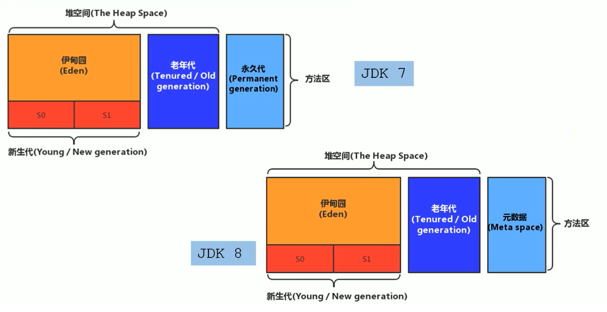

## jstat - JVM Statistics Monitoring

`jstat` 命令用于监视虚拟机运行时状态信息，可以显示出虚拟机进程中的类装载、内存、垃圾收集、JIT 编译等运行数据。

它的命令格式如下：

```
$ jstat -help
Usage: jstat -help|-options
       jstat -<option> [-t] [-h<lines>] <vmid> [<interval> [<count>]]

Definitions:
  <option>      An option reported by the -options option
  <vmid>        Virtual Machine Identifier. A vmid takes the following form:
                     <lvmid>[@<hostname>[:<port>]]
                Where <lvmid> is the local vm identifier for the target
                Java virtual machine, typically a process id; <hostname> is
                the name of the host running the target Java virtual machine;
                and <port> is the port number for the rmiregistry on the
                target host. See the jvmstat documentation for a more complete
                description of the Virtual Machine Identifier.
  <lines>       Number of samples between header lines.
  <interval>    Sampling interval. The following forms are allowed:
                    <n>["ms"|"s"]
                Where <n> is an integer and the suffix specifies the units as
                milliseconds("ms") or seconds("s"). The default units are "ms".
  <count>       Number of samples to take before terminating.
  -J<flag>      Pass <flag> directly to the runtime system.
```

其中支持的 `option` 选项如下：

```
$ jstat -options
-class
-compiler
-gc
-gccapacity
-gccause
-gcmetacapacity
-gcnew
-gcnewcapacity
-gcold
-gcoldcapacity
-gcutil
-printcompilation
```

### `jstat -class <pid>`

`-class` 选项用于输出 ClassLoader 相关的统计信息。

```
$ jstat -class 13348
Loaded  Bytes  Unloaded  Bytes     Time
  6460 11747.3       45   61.0     12.25
```

其中，每一列的含义如下：

* `Loaded` - 已加载类的数量
* `Bytes` - 已加载类的大小
* `Unloaded` - 已卸载类的数量
* `Bytes` - 已卸载类的大小
* `Time` - 加载和卸载类所花费的时间

### `jstat -compiler <pid>`

`-compiler` 选项用于输出 JIT 编译器的统计信息。

```
$ jstat -compiler 13348
Compiled Failed Invalid   Time   FailedType FailedMethod
    3633      1       0  14.01            1 sun/misc/URLClassPath$JarLoader getResource
```

其中，每一列的含义如下：

* `Compiled` - JIT 编译的总次数
* `Failed` - JIT 编译失败的次数
* `Invalid` - JIT 编译不可用的次数
* `Time` - JIT 编译所花费的时间
* `FailedType` - 最后一次编译失败的类型
* `FailedMethod` - 最后一次编译失败的方法名称

关于 `FailedType` 字段的解释，可以 [参考这里](https://zhuanlan.zhihu.com/p/25478502)，它实际上是一个枚举值：

```
enum {
  no_compile, // 0：没有编译
  normal_compile, // 1：普通编译（从方法正常入口开始编译）
  osr_compile, // 2：On-Stack Replacement 编译（从方法中某个循环的回边开始编译）
  native_compile // 3：Native Wrapper 编译
};
```

### `jstat -gc <pid>`

`-gc` 选项用于输出垃圾回收堆的统计。

```
$ jstat -gc 11324
   S0C    S1C  S0U      S1U      EC       EU        OC         OU        MC      MU   CCSC   CCSU    YGC     YGCT   FGC     FGCT      GCT
9728.0 4096.0  0.0   4069.0 51200.0  26670.1   68608.0    10714.9   29824.0 27948.7 3968.0 3502.4      5    0.045     1    0.030    0.075
```

这里的列比较多，前面一部分显示了和 GC 相关的堆的各个区域的大小（单位均为 KB）：

* `S0C` - S0 总大小（第一个幸存区）
* `S1C` - S1 总大小（第二个幸存区）
* `S0U` - S0 已使用大小
* `S1U` - S1 已使用大小
* `EC` - Eden 区总大小（伊甸园区）
* `EU` - Eden 区已使用大小

S0、S1 和 Eden 三个区域合称为新生代（`New Generation`）。

* `OC` - 老年代总大小（`Old Generation`）
* `OU` - 老年代已使用大小
* `MC` - 元数据空间总大小（`Metaspace`）
* `MU` - 元数据空间已使用大小
* `CCSC` - 压缩类空间总大小（`Compressed Class Space`）
* `CCSU` - 压缩类空间已使用大小

在 Java 8 之前的版本中没有元数据空间，所以显示的是永久代大小：

* `PC` - 永久代总大小（`Permanent Generation`）
* `PU` - 永久代已使用大小

后面几列显示了 GC 的次数和耗时：

* `YGC` - 新生代 GC 次数
* `YGCT` - 新生代 GC 耗时
* `FGC` - Full GC 次数
* `FGCT` - Full GC 耗时
* `GCT` - GC 总耗时

下面这张图比较直观地显示了 GC 堆的各个区域以及它们之间的关系（[图片来源](https://www.cnblogs.com/ruoli-0/p/14275977.html)）：



### `jstat -gccapacity <pid>`

`-gccapacity` 选项和 `-gc` 选项类似，也是用于输出垃圾回收堆的统计，和 `-gc` 相比，它不仅输出了各个代的当前大小，还输出了各个代的最大值和最小值，这可以方便地计算出各个代的内存占用情况，排查 OOM 问题。

```
$ jstat -gccapacity 11324
 NGCMN    NGCMX     NGC     S0C   S1C       EC      OGCMN      OGCMX       OGC         OC       MCMN     MCMX      MC     CCSMN    CCSMX     CCSC    YGC    FGC
 33792.0 170496.0  99840.0 9728.0 4096.0  51200.0    68608.0   341504.0    68608.0    68608.0      0.0 1075200.0  29824.0      0.0 1048576.0   3968.0      5     1
```

* `NGCMN` - 新生代最小值
* `NGCMX` - 新生代最大值
* `NGC` - 当前新生代的大小
* `S0C` - 当前 S0 区的大小
* `S1C` - 当前 S1 区的大小
* `EC` - 当前 Eden 区的大小

> S0C + S1C + EC 为啥不等于 NGC？

* `OGCMN`
* `OGCMX`
* `OGC`
* `OC`
* `MCMN`
* `MCMX`
* `MC`
* `CCSMN`
* `CCSMX`
* `CCSC`
* `YGC`
* `FGC`

### `jstat -gccause <pid>`

### `jstat -gcmetacapacity <pid>`

### `jstat -gcnew <pid>`

### `jstat -gcnewcapacity <pid>`

### `jstat -gcold <pid>`

### `jstat -gcoldcapacity <pid>`

### `jstat -gcutil <pid>`

垃圾回收统计概述

### `jstat -printcompilation <pid>`

### `jstat -option -t -h<lines> <pid> <interval> <count>`

```
# jstat -gcutil 20636 1000 10
  S0     S1     E      O      M     CCS    YGC     YGCT    FGC    FGCT     GCT   
  0.00  34.38  48.32  20.40  96.47  90.26   6539  160.802     0    0.000  160.802
  0.00  34.38  49.53  20.40  96.47  90.26   6539  160.802     0    0.000  160.802
  0.00  34.38  49.54  20.40  96.47  90.26   6539  160.802     0    0.000  160.802
  0.00  34.38  49.71  20.40  96.47  90.26   6539  160.802     0    0.000  160.802
  0.00  34.38  49.71  20.40  96.47  90.26   6539  160.802     0    0.000  160.802
```