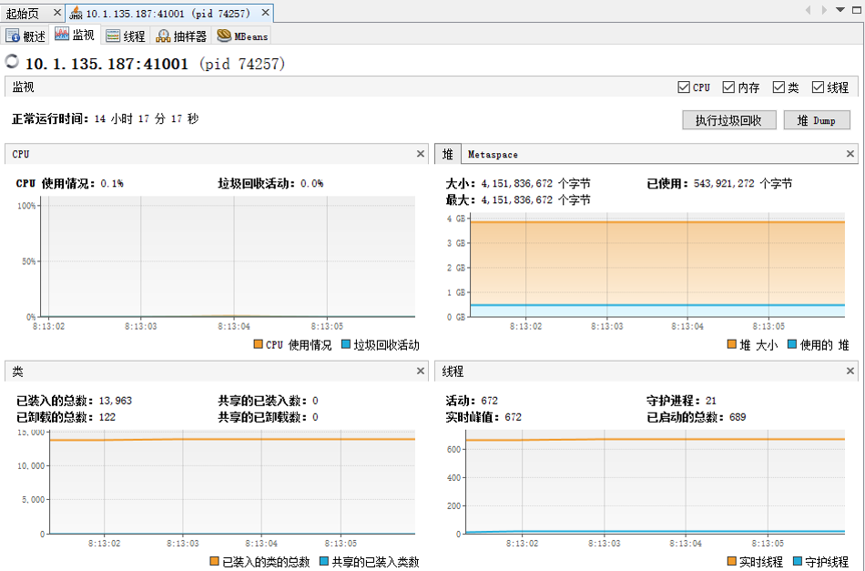

## Java VisualVM

* 配置
    * 本地
    * 远程：JMX
        * -Dcom.sun.management.jmxremote 
        * -Dcom.sun.management.jmxremote.port=41001 
        * -Dcom.sun.management.jmxremote.authenticate=false 
        * -Dcom.sun.management.jmxremote.ssl=false
    * 远程：jstatd
* 插件
    * Visual GC
    * Mbeans
* 类似工具
    * jconsole
    * JRocket Mission Control

