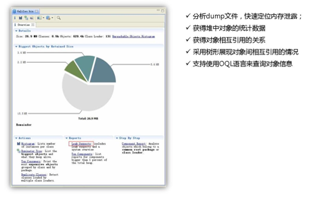
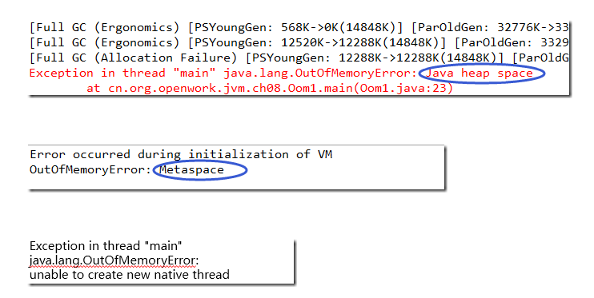
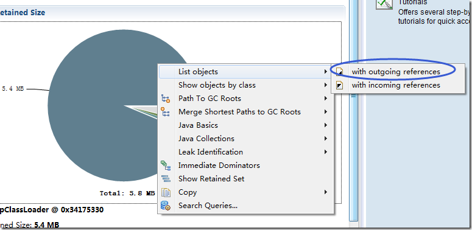

## MAT - Eclipse Memory Analyzer

### 内存分析

* OOM 原因
    * 堆 OOM
    * 元空间 OOM
    * 线程栈 OOM
    * 直接内存 OOM

* MAT 的使用
    * 找出占用内存最大的对象
    * List objects（outgoing、ingoing）
    * Shallow Heap vs. Retained Heap
* Histogram：显示每个类使用情况以及占用空间大小
* Thread_overview：显示线程相关的信息
* OQL：通过类似SQL语句的表达式查询对象信息

