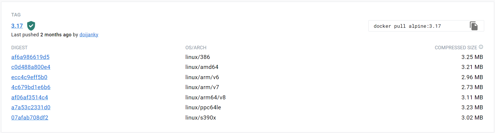

# WEEK029 - 构建多架构容器镜像实战

最近在一个国产化项目中遇到了这样一个场景，在同一个 Kubernetes 集群中的节点是混合架构的，也就是说，其中某些节点的 CPU 架构是 x86 的，而另一些节点是 ARM 的。为了让我们的镜像在这样的环境下运行，一种最简单的做法是根据节点类型为其打上相应的标签，然后针对不同的架构构建不同的镜像，比如 `demo:v1-amd64` 和 `demo:v1-arm64`，然后还需要写两套 YAML：一套使用 `demo:v1-amd64` 镜像，并通过 `nodeSelector` 选择 x86 的节点，另一套使用 `demo:v1-arm64` 镜像，并通过 `nodeSelector` 选择 ARM 的节点。很显然，这种做法不仅非常繁琐，而且管理起来也相当麻烦，如果集群中还有其他架构的节点，那么维护成本将成倍增加。

你可能知道，每个 Docker 镜像都是通过一个 manifest 来描述的，manifest 中包含了这个镜像的基本信息，包括它的 mediaType、大小、摘要以及每一层的分层信息等。可以使用 `docker manifest inspect` 查看某个镜像的 manifest 信息：

```
$ docker manifest inspect aneasystone/hello-actuator:v1
{
        "schemaVersion": 2,
        "mediaType": "application/vnd.docker.distribution.manifest.v2+json",
        "config": {
                "mediaType": "application/vnd.docker.container.image.v1+json",
                "size": 3061,
                "digest": "sha256:d6d5f18d524ce43346098c5d5775de4572773146ce9c0c65485d60b8755c0014"
        },
        "layers": [
                {
                        "mediaType": "application/vnd.docker.image.rootfs.diff.tar.gzip",
                        "size": 2811478,
                        "digest": "sha256:5843afab387455b37944e709ee8c78d7520df80f8d01cf7f861aae63beeddb6b"
                },
                {
                        "mediaType": "application/vnd.docker.image.rootfs.diff.tar.gzip",
                        "size": 928436,
                        "digest": "sha256:53c9466125e464fed5626bde7b7a0f91aab09905f0a07e9ad4e930ae72e0fc63"
                },
                {
                        "mediaType": "application/vnd.docker.image.rootfs.diff.tar.gzip",
                        "size": 186798299,
                        "digest": "sha256:d8d715783b80cab158f5bf9726bcada5265c1624b64ca2bb46f42f94998d4662"
                },
                {
                        "mediaType": "application/vnd.docker.image.rootfs.diff.tar.gzip",
                        "size": 19609795,
                        "digest": "sha256:112ce4ba7a4e8c2b5bcf3f898ae40a61b416101eba468397bb426186ee435281"
                }
        ]
}
```

> 可以加上 `--verbose` 查看更详细的信息，包括该 manifest 引用的镜像标签和架构信息：
> 
> ```
> $ docker manifest inspect --verbose aneasystone/hello-actuator:v1
> {
>         "Ref": "docker.io/aneasystone/hello-actuator:v1",
>         "Descriptor": {
>                 "mediaType": "application/vnd.docker.distribution.manifest.v2+json",
>                 "digest": "sha256:f16a1fcd331a6d196574a0c0721688360bf53906ce0569bda529ba09335316a2",
>                 "size": 1163,
>                 "platform": {
>                         "architecture": "amd64",
>                         "os": "linux"
>                 }
>         },
>         "SchemaV2Manifest": {
>                 ...
>         }
> }
> ```

我们一般不会直接使用 manifest，而是通过标签来关联它，方便人们使用。从上面的输出结果可以看出，该 manifest 通过 `docker.io/aneasystone/hello-actuator:v1` 这个镜像标签来关联，支持的平台是 `linux/amd64`，该镜像有四个分层，另外注意这里的 `mediaType` 字段，它的值是 `application/vnd.docker.distribution.manifest.v2+json`，表示这是 Docker 镜像格式（如果是 `application/vnd.oci.image.manifest.v1+json` 表示 OCI 镜像）。

可以看出这个镜像标签只关联了一个 manifest ，而一个 manifest 只对应一种架构；如果同一个镜像标签能关联多个 manifest ，不同的 manifest 对应不同的架构，那么当我们通过这个镜像标签启动容器时，容器引擎就可以自动根据当前系统的架构找到对应的 manifest 并下载对应的镜像。实际上这就是 **多架构镜像（ multi-arch images ）** 的基本原理，我们把这里的多个 manifest 合称为 [manifest list](https://docs.docker.com/registry/spec/manifest-v2-2/#manifest-list)（ 在 OCI 规范中被称为 [image index](https://github.com/opencontainers/image-spec/blob/v1.0.0/image-index.md) ），镜像标签不仅可以关联 manifest，也可以关联 manifest list。

可以使用 `docker manifest inspect` 查看某个多架构镜像的 manifest list 信息：

```
$ docker manifest inspect alpine:3.17
{
   "schemaVersion": 2,
   "mediaType": "application/vnd.docker.distribution.manifest.list.v2+json",
   "manifests": [
      {
         "mediaType": "application/vnd.docker.distribution.manifest.v2+json",
         "size": 528,
         "digest": "sha256:c0d488a800e4127c334ad20d61d7bc21b4097540327217dfab52262adc02380c",
         "platform": {
            "architecture": "amd64",
            "os": "linux"
         }
      },
      {
         "mediaType": "application/vnd.docker.distribution.manifest.v2+json",
         "size": 528,
         "digest": "sha256:ecc4c9eff5b0c4de6be6b4b90b5ab2c2c1558374852c2f5854d66f76514231bf",
         "platform": {
            "architecture": "arm",
            "os": "linux",
            "variant": "v6"
         }
      },
      {
         "mediaType": "application/vnd.docker.distribution.manifest.v2+json",
         "size": 528,
         "digest": "sha256:4c679bd1e6b6516faf8466986fc2a9f52496e61cada7c29ec746621a954a80ac",
         "platform": {
            "architecture": "arm",
            "os": "linux",
            "variant": "v7"
         }
      },
      {
         "mediaType": "application/vnd.docker.distribution.manifest.v2+json",
         "size": 528,
         "digest": "sha256:af06af3514c44a964d3b905b498cf6493db8f1cde7c10e078213a89c87308ba0",
         "platform": {
            "architecture": "arm64", 
            "os": "linux",
         }
      },
      {
         "mediaType": "application/vnd.docker.distribution.manifest.v2+json",
         "size": 528,
         "digest": "sha256:af6a986619d570c975f9a85b463f4aa866da44c70427e1ead1fd1efdf6150d38",
         "platform": {
            "architecture": "386", 
            "os": "linux"
         }
      },
      {
         "mediaType": "application/vnd.docker.distribution.manifest.v2+json",
         "size": 528,
         "digest": "sha256:a7a53c2331d0c5fedeaaba8d716eb2b06f7a9c8d780407d487fd0fbc1244f7e6",
         "platform": {
            "architecture": "ppc64le",
            "os": "linux"
         }
      },
      {
         "mediaType": "application/vnd.docker.distribution.manifest.v2+json",
         "size": 528,
         "digest": "sha256:07afab708df2326e8503aff2f860584f2bfe7a95aee839c8806897e808508e12",
         "platform": {
            "architecture": "s390x",
            "os": "linux"
         }
      }
   ]
}
```

这里的 `alpine:3.17` 就是一个多架构镜像，从输出结果可以看到 `mediaType` 是 `application/vnd.docker.distribution.manifest.list.v2+json`，说明这个镜像标签关联的是一个 manifest list，它包含了多个 manifest，支持 amd64、arm/v6、arm/v7、arm64、i386、ppc64le、s390x 多个架构。我们也可以直接在 [Docker Hub](https://hub.docker.com/_/alpine/tags) 上看到这些信息：



很显然，在我们这个混合架构的 Kubernetes 集群中，这个镜像是可以直接运行的。我们也可以将我们的应用构建成这样的多架构镜像，那么在这个 Kubernetes 集群中就可以自由地运行我们自己的应用了，这种方法比上面那种为每个架构构建一个镜像的方法要优雅得多。

那么，我们要如何构建这样的多架构镜像呢？一般来说，如果你使用 Docker 作为你的构建工具，通常有两种方法：`docker manifest` 和 `docker buildx`。

### 使用 `docker manifest` 创建多架构镜像

`docker build` 是最常用的镜像构建命令，首先，我们创建一个 `Dockerfile` 文件，内容如下：

```
FROM alpine:3.17
CMD ["echo", "Hello"]
```

然后使用 `docker build` 构建镜像：

```
$ docker build -f Dockerfile -t aneasystone/demo:v1 .
```

这样一个简单的镜像就构建好了，使用 `docker run` 对其进行测试：

```
$ docker run --rm -it aneasystone/demo:v1
Hello
```

非常顺利，镜像能正常运行。不过这样构建的镜像有一个问题，Docker Engine 是根据当前我们的系统自动拉取基础镜像的，我的系统是 x86 的，所以拉取的 alpine:3.17 镜像架构是 `linux/amd64` 的：

```
$ docker image inspect alpine:3.17 | grep Architecture

        "Architecture": "amd64",
```

如果要构建其他架构的镜像，可以有三种办法。第一种是最原始的方法，Docker 官方为每种 [不同的架构创建了不同的独立账号](https://github.com/docker-library/official-images#architectures-other-than-amd64)，比如下面是一些常用的账号：

* ARMv6 32-bit (arm32v6): https://hub.docker.com/u/arm32v6/
* ARMv7 32-bit (arm32v7): https://hub.docker.com/u/arm32v7/
* ARMv8 64-bit (arm64v8): https://hub.docker.com/u/arm64v8/
* Linux x86-64 (amd64): https://hub.docker.com/u/amd64/
* Windows x86-64 (windows-amd64): https://hub.docker.com/u/winamd64/

所以我们就可以通过 `amd64/alpine` 和 `arm64v8/alpine` 来拉取相应架构的镜像，我们对 `Dockerfile` 文件稍微修改一下：

```
ARG ARCH=amd64
FROM ${ARCH}/alpine:3.17
CMD ["echo", "Hello"]
```

然后使用 `--build-arg` 参数来构建不同架构的镜像：

```
$ docker build --build-arg ARCH=amd64 -f Dockerfile-arg -t aneasystone/demo:v1-amd64 .
$ docker build --build-arg ARCH=arm64v8 -f Dockerfile-arg -t aneasystone/demo:v1-arm64 .
```

不过从 2017 年 9 月开始，一个镜像可以支持多个架构了，这种方法就渐渐不用了。第二种办法就是直接使用 `alpine:3.17` 这个基础镜像，通过 `FROM` 指令的 `--platform` 参数，让 Docker Engine 自动拉取特定架构的镜像。我们新建两个文件 `Dockerfile-amd64` 和 `Dockerfile-arm64`，`Dockerfile-amd64` 文件内容如下：

```
FROM --platform=linux/amd64 alpine:3.17
CMD ["echo", "Hello"]
```

`Dockerfile-arm64` 文件内容如下：

```
FROM --platform=linux/arm64 alpine:3.17
CMD ["echo", "Hello"]
```

然后使用 `docker build` 再次构建镜像即可：

```
$ docker build --pull -f Dockerfile-amd64 -t aneasystone/demo:v1-amd64 .
$ docker build --pull -f Dockerfile-arm64 -t aneasystone/demo:v1-arm64 .
```

> 注意这里的 `--pull` 参数，强制要求 Docker Engine 拉取基础镜像，要不然第二次构建时会使用第一次的缓存，这样基础镜像就不对了。

第三种方法不用修改 `Dockerfile` 文件，因为 `docker build` 也支持 `--platform` 参数，我们只需要像下面这样构建镜像即可：

```
$ docker build --pull --platform=linux/amd64 -f Dockerfile -t aneasystone/demo:v1-amd64 .
$ docker build --pull --platform=linux/arm64 -f Dockerfile -t aneasystone/demo:v1-arm64 .
```

构建完不同架构的镜像后，我们就可以使用 [docker manifest](https://docs.docker.com/engine/reference/commandline/manifest/) 命令创建 manifest list，生成自己的多架构镜像了。

https://github.com/estesp/manifest-tool

### 使用 `docker buildx` 创建多架构镜像

https://github.com/docker/buildx

https://github.com/docker/buildx#building-multi-platform-images

https://github.com/moby/buildkit/blob/master/docs/multi-platform.md

## 参考

1. [Faster Multi-platform builds: Dockerfile cross-compilation guide (Part 1)](https://medium.com/@tonistiigi/faster-multi-platform-builds-dockerfile-cross-compilation-guide-part-1-ec087c719eaf)
1. [Multi-arch build and images, the simple way](https://www.docker.com/blog/multi-arch-build-and-images-the-simple-way/)
1. [Docker: Exporting Image for Multiple Architectures](https://stackoverflow.com/questions/73515781/docker-exporting-image-for-multiple-architectures)
1. [如何使用 docker buildx 构建跨平台 Go 镜像](https://waynerv.com/posts/building-multi-architecture-images-with-docker-buildx/)
1. [构建多种系统架构支持的 Docker 镜像](https://yeasy.gitbook.io/docker_practice/image/manifest)
1. [使用buildx来构建支持多平台的Docker镜像(Mac系统)](https://blog.cnscud.com/docker/2021/11/17/docker-buildx.html)
1. [使用 Docker Buildx 构建多种系统架构镜像](https://www.51cto.com/article/678858.html)
1. [使用 buildx 构建多平台 Docker 镜像](https://icloudnative.io/posts/multiarch-docker-with-buildx/)
1. [基于QEMU和binfmt-misc透明运行不同架构程序](https://blog.lyle.ac.cn/2020/04/14/transparently-running-binaries-from-any-architecture-in-linux-with-qemu-and-binfmt-misc/)
1. [多架构镜像三部曲（一）组合](https://blog.csdn.net/mycosmos/article/details/123587243)
1. [多架构镜像三部曲（二）构建](https://blog.csdn.net/mycosmos/article/details/125020271)

## 更多

### 使用 QEMU 运行不同架构的程序

在构建好多个架构的镜像之后，我们可以使用 `docker run` 测试一下：

```
$ docker run --rm -it aneasystone/demo:v1-amd64
Hello

$ docker run --rm -it aneasystone/demo:v1-arm64
WARNING: The requested image's platform (linux/arm64/v8) does not match the detected host platform (linux/amd64) and no specific platform was requested
Hello
```

这里可以发现一个非常奇怪的现象，我们的系统明明不是 arm64 的，为什么 arm64 的镜像也能正常运行呢？除了一行 WARNING 信息之外，看上去并没有异样，而且我们也可以使用 `sh` 进到容器内部正常操作：

```
> docker run --rm -it aneasystone/demo:v1-arm64 sh
WARNING: The requested image's platform (linux/arm64/v8) does not match the detected host platform (linux/amd64) and no specific platform was requested
/ # ls
bin    dev    etc    home   lib    media  mnt    opt    proc   root   run    sbin   srv    sys    tmp    usr    var
/ #
```

不过当我们执行 `ps` 命令时，发现了一些端倪：

```
/ # ps aux
PID   USER     TIME  COMMAND
    1 root      0:00 {sh} /usr/bin/qemu-aarch64 /bin/sh sh
    8 root      0:00 ps aux
```

可以看出我们所执行的 `sh` 命令实际上被 `/usr/bin/qemu-aarch64` 转换了，而 [QEMU](https://www.qemu.org/) 是一款强大的模拟器，可以在 x86 机器上模拟 arm 的指令。关于 QEMU 执行跨架构程序可以参考 [这篇文章](https://blog.lyle.ac.cn/2020/04/14/transparently-running-binaries-from-any-architecture-in-linux-with-qemu-and-binfmt-misc/)。
