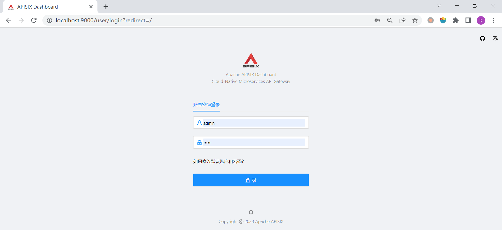
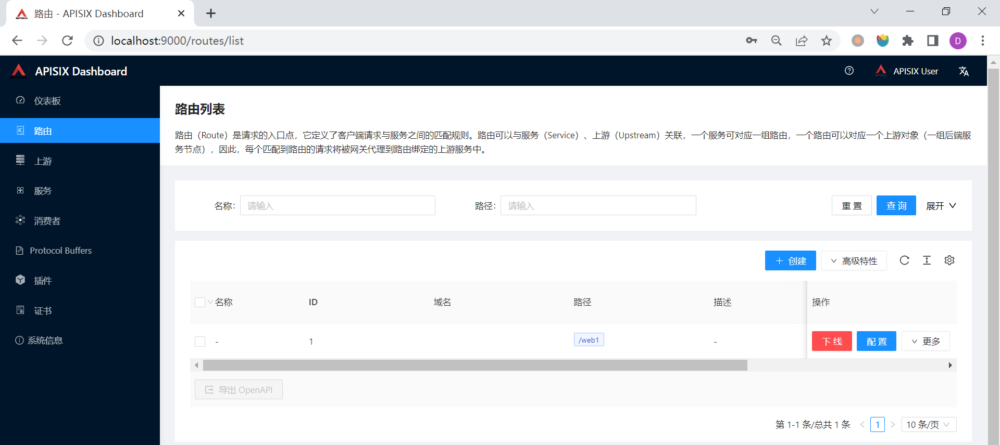
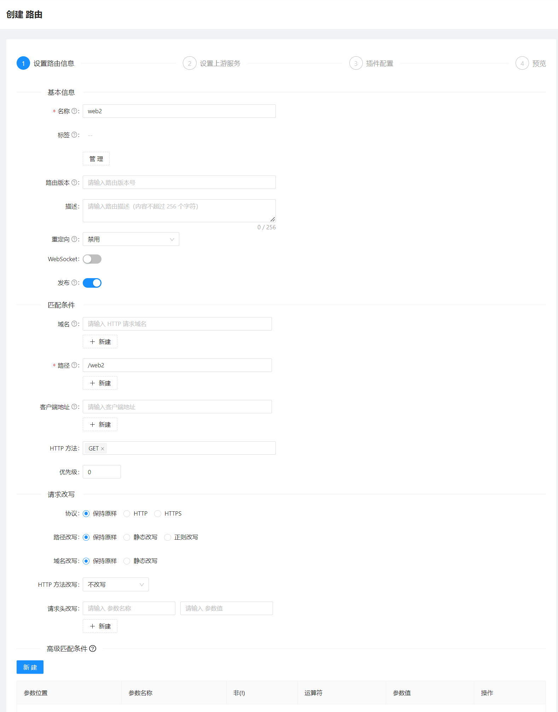
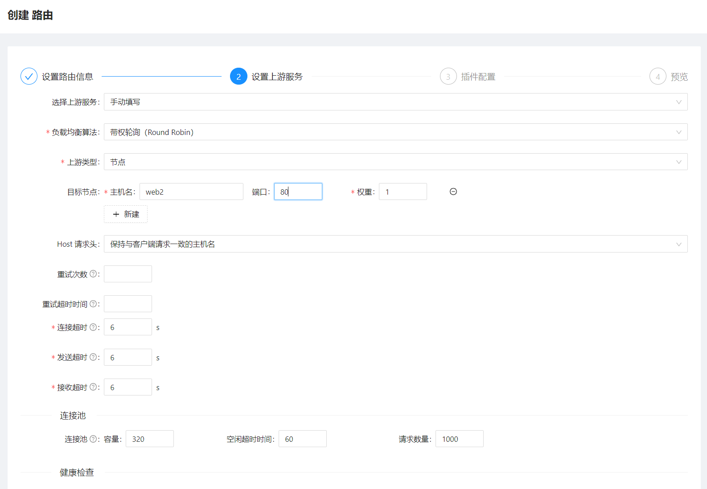
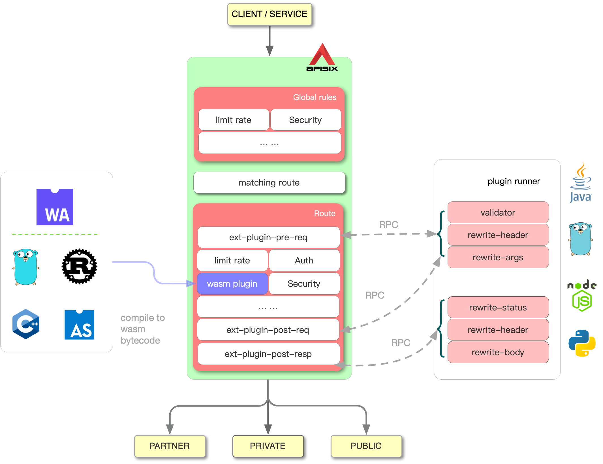
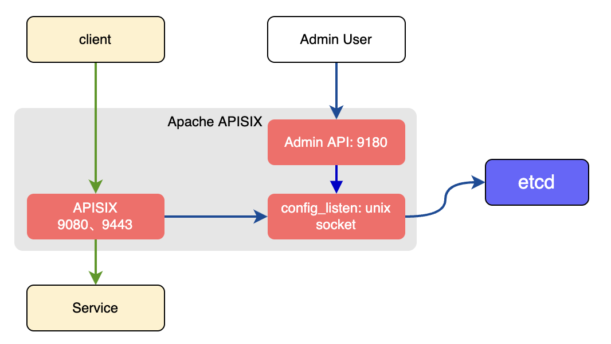
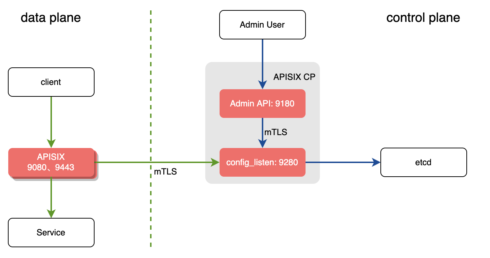

# WEEK030 - APISIX 使用小记

[Apache APISIX](https://apisix.apache.org/zh/) 是基于 Nginx/OpenResty + Lua 方案打造的一款 **动态**、**实时**、**高性能** 的 **云原生** API 网关，提供了负载均衡、动态上游、灰度发布、服务熔断、身份认证、可观测性等丰富的流量管理功能。APISIX 由国内初创公司 [支流科技](https://www.apiseven.com/) 于 2019 年 6 月开源，并于 7 月纳入 CNCF 全景图，10 月进入 Apache 孵化器，次年 7 月 毕业，成为国内唯一一个由初创公司贡献的项目，也是中国最快毕业的 Apache 顶级项目。

## 入门示例初体验

学习一门技术最好的方法就是使用它。这一节，我们将通过官方的入门示例，对 APISIX 的概念和用法有个基本了解。

首先，我们下载 [apisix-docker](https://github.com/apache/apisix-docker) 仓库：

```
git clone https://github.com/apache/apisix-docker.git
```

这个仓库主要是用来指导用户如何使用 Docker 部署 APISIX 的，其中有一个 example 目录，是官方提供的入门示例，我们可以直接使用 `docker-compose` 运行它：

```
$ cd apisix-docker/example
$ docker-compose up -d
[+] Running 8/8
 - Network example_apisix                Created                         0.9s
 - Container example-web2-1              Started                         5.1s
 - Container example-web1-1              Started                         4.0s
 - Container example-prometheus-1        Started                         4.4s
 - Container example-grafana-1           Started                         5.8s
 - Container example-apisix-dashboard-1  Started                         6.0s
 - Container example-etcd-1              Started                         5.1s
 - Container example-apisix-1            Started                         7.5s
```

可以看到创建了一个名为 `example_apisix` 的网络，并在这个网络里启动了 7 个容器：

* `etcd` - APISIX 使用 etcd 作为配置中心，它通过监听 etcd 的变化来实时更新路由
* `apisix` - APISIX 网关
* `apisix-dashboard` - APISIX 管理控制台，可以在这里对 APISIX 的 Route、Upstream、Service、Consumer、Plugin、SSL 等进行管理
* `prometheus` - 这个例子使用了 APISIX 的 `prometheus` 插件，用于暴露 APISIX 的指标，Prometheus 服务用于采集这些指标
* `grafana` - Grafana 面板以图形化的方式展示 Prometheus 指标
* `web1` - 测试服务
* `web2` - 测试服务

部署之后可以使用 APISIX 的 [Admin API](https://apisix.apache.org/zh/docs/apisix/admin-api/) 检查其是否启动成功：

```
$ curl http://127.0.0.1:9180/apisix/admin/routes \
	-H 'X-API-KEY: edd1c9f034335f136f87ad84b625c8f1'
{"list":[],"total":0}
```

目前我们还没有创建任何路由，所以 `/apisix/admin/routes` 接口返回的结果为空。我们可以使用 Admin API 和 Dashboard 两种方式来创建路由。

### 使用 Admin API 创建路由

**路由（ Route ）** 是 APISIX 中最基础和最核心的资源对象，APISIX 通过路由定义规则来匹配客户端请求，根据匹配结果加载并执行相应的插件，最后将请求转发到指定的上游服务。一条路由主要包含三部分信息：

* 匹配规则：比如 `methods`、`uri`、`host` 等，也可以根据需要自定义匹配规则，当请求满足匹配规则时，才会执行后续的插件，并转发到指定的上游服务；
* 插件配置：这是可选的，但也是 APISIX 最强大的功能之一，APISIX 提供了非常丰富的插件来实现各种不同的访问策略，比如认证授权、安全、限流限速、可观测性等；
* 上游信息：路由会根据配置的负载均衡信息，将请求按照规则转发到相应的上游。

所有的 Admin API 都采用了 Restful 风格，路由资源的请求地址为 `/apisix/admin/routes/{id}`，我们可以通过不同的 HTTP 方法来查询、新增、编辑或删除路由资源（[官方示例](https://apisix.apache.org/zh/docs/apisix/admin-api/#route-example)）：

* `GET /apisix/admin/routes` -	获取资源列表；
* `GET /apisix/admin/routes/{id}` - 获取资源；
* `PUT /apisix/admin/routes/{id}` - 根据 id 创建资源；
* `POST /apisix/admin/routes` - 创建资源，id 将会自动生成；
* `DELETE /apisix/admin/routes/{id}` - 删除指定资源；
* `PATCH /apisix/admin/routes/{id}` - 标准 PATCH，修改指定 Route 的部分属性，其他不涉及的属性会原样保留；
* `PATCH /apisix/admin/routes/{id}/{path}` - SubPath PATCH，通过 {path} 指定 Route 要更新的属性，全量更新该属性的数据，其他不涉及的属性会原样保留。

下面的例子将入门示例中的 web1 服务添加到路由中：

```
$ curl -X PUT http://127.0.0.1:9180/apisix/admin/routes/1 \
    -H 'X-API-KEY: edd1c9f034335f136f87ad84b625c8f1' -i -d '
{
    "methods": ["GET"],
    "uri": "/web1",
    "upstream": {
        "type": "roundrobin",
        "nodes": {
            "web1:80": 1
        }
    }
}'
```

其中 `X-API-KEY: edd1c9f034335f136f87ad84b625c8f1` 是 Admin API 的访问 Token，可以在 APISIX 的配置文件 `apisix_conf/config.yaml` 中找到：

```
deployment:
  admin:
    allow_admin:
      - 0.0.0.0/0
    admin_key:
      - name: "admin"
        key: edd1c9f034335f136f87ad84b625c8f1
        role: admin
      - name: "viewer"
        key: 4054f7cf07e344346cd3f287985e76a2
        role: viewer
```

如果路由创建成功，将返回下面的 `201 Created` 信息：

```
HTTP/1.1 201 Created
Connection: close
Transfer-Encoding: chunked
Access-Control-Allow-Credentials: true
Access-Control-Allow-Origin: *
Access-Control-Expose-Headers: *
Access-Control-Max-Age: 3600
Content-Type: application/json
Date: Tue, 31 Jan 2023 00:19:03 GMT
Server: APISIX/3.1.0
X-Api-Version: v3

{"key":"\/apisix\/routes\/1","value":{"create_time":1675124057,"uri":"\/web1","status":1,"upstream":{"pass_host":"pass","scheme":"http","nodes":{"web1:80":1},"hash_on":"vars","type":"roundrobin"},"priority":0,"update_time":1675124057,"id":"1"}}
```

这个路由的含义是当请求的方法是 `GET` 且请求的路径是 `/web1` 时，APISIX 就将请求转发到上游服务 `web1:80`。我们可以通过这个路径来访问 web1 服务：

```
$ curl http://127.0.0.1:9080/web1
hello web1
```

如果上游信息需要在不同的路由中复用，我们可以先创建一个 [上游（Upstream）](https://apisix.apache.org/zh/docs/apisix/terminology/upstream/)：

```
$ curl -X PUT http://127.0.0.1:9180/apisix/admin/upstreams/1 \
    -H 'X-API-KEY: edd1c9f034335f136f87ad84b625c8f1' -i -d '
{
    "type": "roundrobin",
    "nodes": {
        "web1:80": 1
    }
}'
```

然后在创建路由时直接使用 `upstream_id` 即可：

```
$ curl -X PUT http://127.0.0.1:9180/apisix/admin/routes/1 \
    -H 'X-API-KEY: edd1c9f034335f136f87ad84b625c8f1' -i -d '
{
    "methods": ["GET"],
    "uri": "/web1",
    "upstream_id": "1"
}'
```

另外，你可以使用下面的命令删除一条路由：

```
$ curl -X DELETE http://127.0.0.1:9180/apisix/admin/routes/1 \
    -H 'X-API-KEY: edd1c9f034335f136f87ad84b625c8f1'
```

### 使用 Dashboard 创建路由

APISIX 提供了一套图形化 Dashboard 用来对网关的路由、插件、上游等进行管理，在入门示例中已经自带部署了 Dashboard，通过浏览器 `http://localhost:9000` 即可访问：



默认的用户名和密码可以在 `dashboard_conf/conf.yaml` 文件中进行配置：

```
authentication:
  secret:
    secret     
  expire_time: 3600
  users:
    - username: admin
      password: admin
    - username: user
      password: user
```

登录成功后进入路由页面：



然后点击 “创建” 按钮创建一个路由：



看上去这里的路由信息非常复杂，但是实际上我们只需要填写 `名称`、`路径`、`HTTP 方法` 即可，其他的维持默认值，当我们对 APISIX 的路由理解更深刻的时候可以再回过头来看看这些参数。

点击 “下一步” 设置上游信息：



同样的，我们只关心目标节点的 `主机名` 和 `端口` 两个参数即可。

然后再点击 “下一步” 进入插件配置，这里暂时先跳过，直接 “下一步” 完成路由的创建。路由创建完成后，访问 `/web2` 来验证路由是否生效：

```
$ curl http://127.0.0.1:9080/web2
hello web2
```

## 使用 APISIX 插件

通过上面的示例，我们了解了 APISIX 的基本用法，学习了如何通过 Admin API 或 Dashboard 来创建路由，实现了网关最基础的路由转发功能。APISIX 不仅具有高性能且低延迟的特性，而且它强大的插件机制为其高扩展性提供了无限可能。我们可以在 [APISIX 插件中心](https://apisix.apache.org/zh/plugins/) 查看所有官方已经支持的插件，也可以 [使用 lua 语言开发自己的插件](https://apisix.apache.org/zh/docs/apisix/plugin-develop/)，如果你对 lua 不熟悉，还可以使用其他语言 [开发 External Plugin](https://apisix.apache.org/zh/docs/apisix/external-plugin/)，APISIX 支持通过 [Plugin Runner](https://apisix.apache.org/docs/apisix/internal/plugin-runner/) 以 sidecar 的形式来运行你的插件，APISIX 和 sidecar 之间通过 RPC 通信，不过这种方式对性能有一定的影响，如果你比较关注性能问题，那么可以使用你熟悉的语言开发 [WebAssembly](https://webassembly.org/) 程序，APISIX 也支持 [运行 wasm 插件](https://apisix.apache.org/zh/docs/apisix/wasm/)。



这一节我们将通过几个官方插件来实现一些常见的网关需求。

在上面的学习中我们知道，一个路由是由匹配规则、插件配置和上游信息三个部分组成的，但是为了学习的递进性，我们有意地避免了插件配置部分。现在我们可以重新创建一个路由，并为其加上插件信息：

```
$ curl -X PUT http://127.0.0.1:9180/apisix/admin/routes/3 \
    -H 'X-API-KEY: edd1c9f034335f136f87ad84b625c8f1' -i -d '
{
    "methods": ["GET"],
    "uri": "/web3",
    "plugins": {
        "limit-count": {
            "count": 2,
            "time_window": 60,
            "rejected_code": 503,
            "key": "remote_addr"
        },
        "prometheus": {}
    },
    "upstream": {
        "type": "roundrobin",
        "nodes": {
            "web1:80": 1
        }
    }
}'
```

上面的命令创建了一个 `/web3` 路由，并配置了两个插件：

* `limit-count` - 该插件使用 `固定窗口算法（Fixed Window algorithm）` 对该路由进行限流，每分钟仅允许 2 次请求，超出时返回 503 错误码；
* `prometheus` - 该插件将路由请求相关的指标暴露到 Prometheus 端点；

我们连续访问 3 次 `/web3` 路由：

```
$ curl http://127.0.0.1:9080/web3
hello web1
$ curl http://127.0.0.1:9080/web3
hello web1
$ curl http://127.0.0.1:9080/web3
<html>
<head><title>503 Service Temporarily Unavailable</title></head>
<body>
<center><h1>503 Service Temporarily Unavailable</h1></center>
<hr><center>openresty</center>
<p><em>Powered by <a href="https://apisix.apache.org/">APISIX</a>.</em></p></body>
</html>
```

可以看到 `limit-count` 插件的限流功能生效了，第 3 次请求被拒绝，返回了 503 错误码。另外，可以使用下面的命令查看 Prometheus 指标：

```
$ curl -i http://127.0.0.1:9091/apisix/prometheus/metrics
```

这个 Prometheus 指标地址可以在 `apisix_conf/config.yaml` 文件的 `plugin_attr` 中配置：

```
plugin_attr:
  prometheus:
    export_uri: /apisix/prometheus/metrics
    export_addr:
      ip: "0.0.0.0"
      port: 9091
```

APISIX 的插件可以动态的启用和禁用、自定义错误响应、自定义优先级、根据条件动态执行，具体内容可以参考 [官方的 Plugin 文档](https://apisix.apache.org/zh/docs/apisix/terminology/plugin/)。此外，如果一个插件需要在多个地方复用，我们也可以创建一个 [Plugin Config](https://apisix.apache.org/zh/docs/apisix/terminology/plugin-config/)：

```
$ curl http://127.0.0.1:9180/apisix/admin/plugin_configs/1 \
  -H 'X-API-KEY: edd1c9f034335f136f87ad84b625c8f1' -X PUT -i -d '
{
    "desc": "enable limit-count plugin",
    "plugins": {
        "limit-count": {
            "count": 2,
            "time_window": 60,
            "rejected_code": 503
        }
    }
}'
```

然后在创建路由时，通过 `plugin_config_id` 关联：

```
$ curl -X PUT http://127.0.0.1:9180/apisix/admin/routes/1 \
    -H 'X-API-KEY: edd1c9f034335f136f87ad84b625c8f1' -i -d '
{
    "methods": ["GET"],
    "uri": "/web1",
    "upstream_id": "1",
    "plugin_config_id": "1"
}'
```

在 APISIX 的插件中心，我们可以看到 APISIX 将插件分成了下面几个大类：

* `General` - 通用功能，比如 gzip 压缩配置、重定向配置等；
* `Transformation` - 这类插件会对请求做一些转换操作，比如重写请求响应、gRPC 协议转换等；
* `Authentication` - 提供一些常见的认证授权相关的功能，比如 API Key 认证、JWT 认证、Basic 认证、CAS 认证、LDAP 认证等；
* `Security` - 安全相关的插件，比如开启 IP 黑白名单、开启 CORS、开启 CSRF 等；
* `Traffic` - 这些插件对流量进行管理，比如限流、限速、流量镜像等；
* `Observability` - 可观测性插件，支持常见的日志（比如 File-Logger、Http-Logger、Kafka-Logger、Rocketmq-Logger 等）、指标（比如 Prometheus、Datadog 等）和链路跟踪（比如 Skywalking、Zipkin、Opentelemetry 等）系统；
* `Serverless` - 对接常见的 Serverless 平台，实现函数计算功能，比如 AWS Lambda、Apache OpenWhisk、CNCF Function 等；
* `Other Protocols` - 这些插件用于支持 Dubbo、MQTT 等其他类型的协议；

## 参考

1. [快速入门指南 | Apache APISIX® -- Cloud-Native API Gateway](https://apisix.apache.org/zh/docs/apisix/getting-started/)
1. [API 网关策略的二三事](https://mp.weixin.qq.com/s/Hp3cbFCIJdG3VgI6w45yzQ)
1. [从 Apache APISIX 来看 API 网关的演进](https://opentalk-blog.b0.upaiyun.com/prod/2019-12-14/a4ae6b3784b87a46a3f43ed062e47391.pdf)
1. [云原生时代的中外 API 网关之争](https://2d2d.io/s1/kong-vs-apisix/)

## 更多

### APISIX 的部署模式

APISIX 支持多种不同的 [部署模式](https://apisix.apache.org/zh/docs/apisix/deployment-modes/)，上面的示例中使用的是最常用的一种部署模式：`traditional` 模式，在这个模式下 APISIX 的控制平台和数据平面在一起：



我们也可以将 APISIX 部署两个实例，一个作为数据平面，一个作为控制平面，这被称为 `decoupled` 模式，这样可以提高 APISIX 的稳定性：



上面两种模式都依赖于从 `etcd` 中监听和获取配置信息，如果我们不想使用 `etcd`，我们还可以将 APISIX 部署成 [`standalone` 模式](https://apisix.apache.org/zh/docs/apisix/stand-alone/)，这个模式使用 `conf/apisix.yaml` 作为配置文件，并且每间隔一段时间自动检测文件内容是否有更新，如果有更新则重新加载配置。不过这个模式只能作为数据平面，无法使用 Admin API 等管理功能（这是因为 Admin API 是基于 etcd 实现的）：

```
deployment:
  role: data_plane
  role_data_plane:
    config_provider: yaml
```

### 将 APISIX 扩展为服务网格的边车

1. [Apache APISIX 借助服务网格实现统一技术栈的全流量管理](https://cloudnative.to/blog/2022-service-mesh-summit-apache-apisix-mesh/)
1. [如何将 Apache APISIX 扩展为一个服务网格的边车](https://apisix.apache.org/articles/How-To-Extend-Apache-APISIX-into-a-Service-Mesh-Sidecar/)
1. [将 Apache APISIX 扩展为服务网格边车的探索与实践](https://www.infoq.cn/article/fuhshcgz7jp8gyowypbr)
1. [深度剖析 Apache APISIX Mesh Agent](https://www.apiseven.com/blog/how-to-use-mesh-agent)
1. [api7/apisix-mesh-agent](https://github.com/api7/apisix-mesh-agent)

### 集成服务发现注册中心

* [基于 DNS 的服务发现](https://apisix.apache.org/zh/docs/apisix/discovery/dns/)
* [基于 Consul 的服务发现](https://apisix.apache.org/zh/docs/apisix/discovery/consul/)
* [基于 Consul KV 的服务发现](https://apisix.apache.org/zh/docs/apisix/discovery/consul_kv/)
* [基于 Nacos 的服务发现](https://apisix.apache.org/zh/docs/apisix/discovery/nacos/)
* [基于 Eureka 的服务发现](https://apisix.apache.org/zh/docs/apisix/discovery/)
* [基于 APISIX-Seed 架构的控制面服务发现](https://apisix.apache.org/zh/docs/apisix/discovery/control-plane-service-discovery/)
* [基于 Kubernetes 的服务发现](https://apisix.apache.org/zh/docs/apisix/discovery/kubernetes/)
