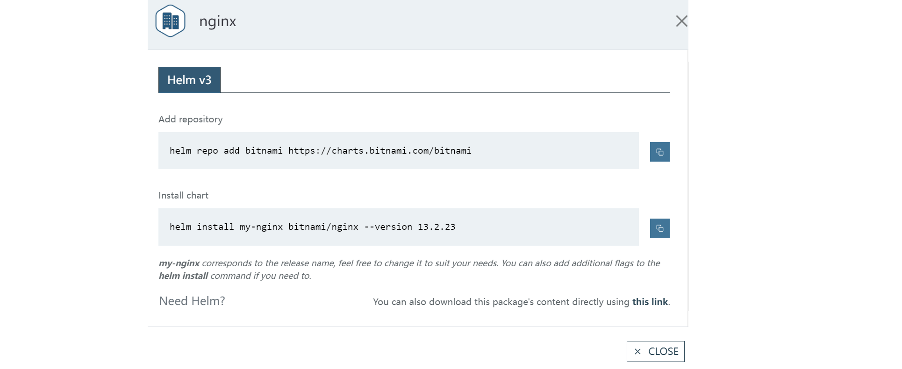

# WEEK031 - 使用 Helm 部署 Kubernetes 应用

在 [week013-playing-with-kubernetes](../week013-playing-with-kubernetes/README.md) 中我们学习了如何通过 `Deployment` 部署一个简单的应用服务并通过 `Service` 来暴露它，在真实的场景中，一套完整的应用服务可能还会包含很多其他的 Kubernetes 资源，比如 `DaemonSet`、`Ingress`、`ConfigMap`、`Secret` 等，当用户部署这样一套完整的服务时，他就不得不关注这些底层的 Kubernetes 概念，这对用户非常不友好。

我们知道，几乎每个操作系统都内置了一套软件包管理器，用来方便用户安装、配置、卸载或升级各种系统软件和应用软件，比如 Debian 和 Ubuntu 使用的是 DEB 包管理器 `dpkg` 和 `apt`，CentOS 使用的是 RPM 包管理器 `yum`，Mac OS 有 `Homebrew`，Windows 有 `WinGet` 和 `Chocolatey` 等，另外很多系统还内置了图形界面的应用市场方便用户安装应用，比如 Windows 应用商店、Apple Store、安卓应用市场等，这些都可以算作是包管理器。

使用包管理器安装应用大大降低了用户的使用门槛，他只需要执行一句命令或点击一个安装按钮即可，而不用去关心这个应用需要哪些依赖和哪些配置。那么在 Kubernetes 下能不能也通过这种方式来部署应用服务呢？[Helm](https://helm.sh/zh/) 作为 Kubernetes 的包管理器，解决了这个问题。

## Helm 简介

Helm 是 [Deis 团队](https://deislabs.io/) 于 2015 年发布的一个 Kubernetes 包管理工具，当时 Deis 团队还没有被微软收购，他们在一家名为 Engine Yard 的公司里从事 PaaS 产品 Deis Workflow 的开发，在开发过程中，他们需要将众多的微服务部署到 Kubernetes 集群中，由于在 Kubernetes 里部署服务需要开发者手动编写和维护数量繁多的 Yaml 文件，并且服务的分发和安装也比较繁琐，Matt Butcher 和另外几个同事于是在一次 Hackthon 团建中发起了 Helm 项目。

> Helm 的取名非常有意思，Kubernetes 是希腊语 “舵手” 的意思，而 Helm 是舵手操作的 “船舵”，用来控制船的航行方向。

Helm 引入了 [Chart](https://helm.sh/zh/docs/topics/charts/) 的概念，它也是 Helm 所使用的包格式，可以把它理解成一个描述 Kubernetes 相关资源的文件集合。开发者将自己的应用配置文件打包成 Helm chart 格式，然后发布到 [ArtifactHub](https://artifacthub.io/)，这和你使用 `docker push` 将镜像推送到 DockerHub 镜像仓库一样，之后用户安装你的 Kubernetes 应用只需要一条简单的 Helm 命令就能搞定，极大程度上解决了 Kubernetes 应用维护、分发、安装等问题。

Helm 在 2018 年 6 月加入 CNCF，并在 2020 年 4 月正式毕业，目前已经是 Kubernetes 生态里面不可或缺的明星级项目。

## 快速开始

这一节我们将通过官方的入门示例快速掌握 Helm 的基本用法。

### 安装 Helm

我们首先从 Helm 的 [Github Release](https://github.com/helm/helm/releases) 页面找到最新版本，然后通过 `curl` 将安装包下载下来：

```
$ curl -LO https://get.helm.sh/helm-v3.11.1-linux-amd64.tar.gz
```

然后解压安装包，并将 `helm` 安装到 `/usr/local/bin` 目录：

```
$ tar -zxvf helm-v3.11.1-linux-amd64.tar.gz
$ sudo mv linux-amd64/helm /usr/local/bin/helm
```

这样 Helm 就安装好了，通过 `helm version` 检查是否安装成功：

```
$ helm version
version.BuildInfo{Version:"v3.11.1", GitCommit:"293b50c65d4d56187cd4e2f390f0ada46b4c4737", GitTreeState:"clean", GoVersion:"go1.18.10"}
```

使用 `helm help` 查看 Helm 支持的其他命令和参数。

> 一般来说，直接下载 Helm 二进制文件就可以完成安装，不过官方也提供了一些其他方法来安装 Helm，比如通过 [get_helm.sh](https://raw.githubusercontent.com/helm/helm/main/scripts/get-helm-3) 脚本来自动安装，或者通过 `yum` 或 `apt` 这些操作系统的包管理器来安装，具体内容可参考官方的 [安装文档](https://helm.sh/zh/docs/intro/install/)。

### 使用 Helm

Helm 安装完成之后，我们就可以使用 Helm 在 Kubernetes 中安装应用了。对于新手来说，最简单的方法是在 [ArtifactHub](https://artifacthub.io/) 上搜索要安装的应用，然后按照文档中的安装步骤来操作即可。比如我们想要部署 Nginx，首先在 ArtifactHub 上进行搜索：


注意左侧的 KIND 勾选上 `Helm charts`，搜索出来的结果会有很多条，这些都是由不同的组织或个人发布的，可以在列表中看出发布的组织或个人名称，以及该 Charts 所在的仓库。[Bitnami](https://bitnami.com/) 是 Helm 中最常用的仓库之一，它内置了很多常用的 Kubernetes 应用，于是我们选择进入 [第一条搜索结果](https://artifacthub.io/packages/helm/bitnami/nginx)：


这里可以查看关于 Nginx 应用的安装步骤、使用说明、以及支持的配置参数等信息，我们可以点击 `INSTALL` 按钮，会弹出一个对话框，并显示该应用的安装步骤：



我们按照它的提示，首先使用 `helm repo add` 将 Bitnami 仓库添加到我们的电脑：

```
$ helm repo add bitnami https://charts.bitnami.com/bitnami
"bitnami" has been added to your repositories
```

然后使用 `helm install` 安装 Nginx 应用：

```
$ helm install my-nginx bitnami/nginx --version 13.2.23
NAME: my-nginx
LAST DEPLOYED: Sat Feb 11 08:58:10 2023
NAMESPACE: default
STATUS: deployed
REVISION: 1
TEST SUITE: None
NOTES:
CHART NAME: nginx
CHART VERSION: 13.2.23
APP VERSION: 1.23.3

** Please be patient while the chart is being deployed **
NGINX can be accessed through the following DNS name from within your cluster:

    my-nginx.default.svc.cluster.local (port 80)

To access NGINX from outside the cluster, follow the steps below:

1. Get the NGINX URL by running these commands:

  NOTE: It may take a few minutes for the LoadBalancer IP to be available.
        Watch the status with: 'kubectl get svc --namespace default -w my-nginx'

    export SERVICE_PORT=$(kubectl get --namespace default -o jsonpath="{.spec.ports[0].port}" services my-nginx)
    export SERVICE_IP=$(kubectl get svc --namespace default my-nginx -o jsonpath='{.status.loadBalancer.ingress[0].ip}')
    echo "http://${SERVICE_IP}:${SERVICE_PORT}"
```

稍等片刻，Nginx 就安装好了，我们可以使用 `kubectl` 来验证：

```
$ kubectl get deployments
NAME       READY   UP-TO-DATE   AVAILABLE   AGE
my-nginx   1/1     1            1           12m
$ kubectl get svc
NAME             TYPE           CLUSTER-IP       EXTERNAL-IP   PORT(S)          AGE
kubernetes       ClusterIP      10.96.0.1        <none>        443/TCP          75d
my-nginx         LoadBalancer   10.111.151.137   localhost     80:31705/TCP     12m
```

访问 `localhost:80` 可以看到 Nginx 已成功启动：


卸载和安装一样也很简单，使用 `helm delete` 命令即可：

```
$ helm delete my-nginx
release "my-nginx" uninstalled
```

我们还可以通过 `--set` 选项来改写 Nginx 的一些参数，比如默认情况下创建的 Service 端口是 80，使用下面的命令将端口改为 8080：

```
$ helm install my-nginx bitnami/nginx --version 13.2.23 \
	--set service.ports.http=8080
```

更多的参数列表可以参考安装文档中的 [`Parameters`](https://artifacthub.io/packages/helm/bitnami/nginx#parameters) 部分。

另外，[`helm`](https://helm.sh/zh/docs/helm/helm/) 命令和它的子命令还支持一些其他选项，比如上面的 `--version` 和 `--set` 都是 [`helm install`](https://helm.sh/zh/docs/helm/helm_install/) 子命令的选项，我们可以使用 `helm` 命令的 `--namespace` 选项将应用部署到指定的命名空间中：

```
$ helm install my-nginx bitnami/nginx --version 13.2.23 \
	--set service.ports.http=8080 \
	--namespace nginx --create-namespace
```

## 常用的 Helm 命令

通过上一节的学习，我们大致了解了 Helm 中三个非常重要的概念：

* `Repository`
* `Chart`
* `Release`

`Repository` 比较好理解，就是存放安装包的仓库，可以使用 `helm env` 查看 `HELM_REPOSITORY_CACHE` 环境变量的值，这就是仓库的本地地址，用于缓存仓库信息以及已下载的安装包：

```
$ helm env | grep HELM_REPOSITORY_CACHE
HELM_REPOSITORY_CACHE="/home/aneasystone/.cache/helm/repository"
```

当我们执行 `helm repo add` 命令时，会将仓库信息缓存到该目录；当我们执行 `helm install` 命令时，也会将安装包下载并缓存到该目录。查看该目录，可以看到我们已经添加的 `bitnami` 仓库信息，还有已下载的 `nginx` 安装包：

```
$ ls /home/aneasystone/.cache/helm/repository
bitnami-charts.txt  bitnami-index.yaml  nginx-13.2.23.tgz
```

这个安装包就被称为 `Chart`，是 Helm 特有的安装包格式，这个安装包中包含了一个 Kubernetes 应用的所有资源文件。而 `Release` 就是安装到 Kubernetes 中的 Chart 实例，每个 Chart 可以在集群中安装多次，每安装一次，就会产生一个 Release。

明白了这三个基本概念，我们就可以这样理解 Helm 的用途：**它先从 `Repository` 中下载 `Chart`，然后将 `Chart` 实例化后以 `Release` 的形式部署到 Kubernetes 集群中**，如下图所示（[图片来源](https://docs.couchbase.com/cloud-native-database/helm-overview.html)）：


而绝大多数的 Helm 命令，都是围绕着这三大概念进行的。

### Repository 相关命令

#### `helm repo`

该命令用于添加、删除或更新仓库等操作。

将远程仓库添加到本地：

```
$ helm repo add bitnami https://charts.bitnami.com/bitnami
```

查看本地已安装仓库列表：

```
$ helm repo list
NAME    URL
bitnami https://charts.bitnami.com/bitnami
```

更新本地仓库：

```
$ helm repo update bitnami
Hang tight while we grab the latest from your chart repositories...
...Successfully got an update from the "bitnami" chart repository
Update Complete. ⎈Happy Helming!⎈
```

读取某个仓库目录，根据找到的 Chart 生成索引文件：

```
$ helm repo index SOME_REPO_DIR
# cat SOME_REPO_DIR/index.yaml
```

删除本地仓库：

```
$ helm repo remove bitnami
"bitnami" has been removed from your repositories
```

#### `helm search`

该命令用于在 ArtifactHub 或本地仓库中搜索 Chart。

在 ArtifactHub 中搜索 Chart：

```
$ helm search hub nginx
URL                                                     CHART VERSION   APP VERSION          DESCRIPTION
https://artifacthub.io/packages/helm/cloudnativ...      3.2.0           1.16.0               Chart for the nginx server
https://artifacthub.io/packages/helm/bitnami/nginx      13.2.23         1.23.3               NGINX Open Source is a web server that can be a...
```

要注意搜索出来的 Chart 链接可能不完整，不能直接使用，根据 [stackoverflow](https://stackoverflow.com/questions/62371422/how-to-list-full-url-about-helm-search-url-in-v3-2-1) 这里的解答，我们可以使用 `-o json` 选项将结果以 JSON 格式输出：

```
$ helm search hub nginx -o json | jq .
[
  {
    "url": "https://artifacthub.io/packages/helm/cloudnativeapp/nginx",
    "version": "3.2.0",
    "app_version": "1.16.0",
    "description": "Chart for the nginx server",
    "repository": {
      "url": "https://cloudnativeapp.github.io/charts/curated/",
      "name": "cloudnativeapp"
    }
  },
  {
    "url": "https://artifacthub.io/packages/helm/bitnami/nginx",
    "version": "13.2.23",
    "app_version": "1.23.3",
    "description": "NGINX Open Source is a web server that can be also used as a reverse proxy, load balancer, and HTTP cache. Recommended for high-demanding sites due to its ability to provide faster content.",
    "repository": {
      "url": "https://charts.bitnami.com/bitnami",
      "name": "bitnami"
    }
  }
}
```

在本地配置的所有仓库中搜索 Chart：

```
$ helm search repo nginx
NAME                                    CHART VERSION   APP VERSION     DESCRIPTION
bitnami/nginx                           13.2.23         1.23.3          NGINX Open Source is a web server that can be a...
bitnami/nginx-ingress-controller        9.3.28          1.6.2           NGINX Ingress Controller is an Ingress controll...
bitnami/nginx-intel                     2.1.15          0.4.9           DEPRECATED NGINX Open Source for Intel is a lig...
```

### Chart 相关命令

#### `helm create`

该命令用于创建一个新的 Chart 目录：

```
$ helm create demo
Creating demo
```

创建的 Chart 目录是下面这样的结构：

```
$ tree demo
demo
├── Chart.yaml
├── charts
├── templates
│   ├── NOTES.txt
│   ├── _helpers.tpl
│   ├── deployment.yaml
│   ├── hpa.yaml
│   ├── ingress.yaml
│   ├── service.yaml
│   ├── serviceaccount.yaml
│   └── tests
│       └── test-connection.yaml
└── values.yaml

3 directories, 10 files
```

#### `helm package`

将 Chart 目录（必须包含 `Chart.yaml` 文件）打包成 Chart 归档文件：

```
$ helm package nginx
Successfully packaged chart and saved it to: /home/aneasystone/helm/nginx-13.2.23.tgz
```

#### `helm lint`

验证 Chart 是否存在问题：

```
$ helm lint ./nginx
==> Linting ./nginx

1 chart(s) linted, 0 chart(s) failed
```

#### `helm show`

该命令用于显示 Chart 的基本信息，包括：

* `helm show chart` - 显示 Chart 定义，实际上就是 `Chart.yaml` 文件的内容
* `helm show crds` - 显示 Chart 的 CRD
* `helm show readme` - 显示 Chart 的 `README.md` 文件中的内容
* `helm show values` - 显示 Chart 的 `values.yaml` 文件中的内容
* `helm show all` - 显示 Chart 的所有信息

#### `helm pull`

从仓库中将 Chart 安装包下载到本地：

```
$ helm pull bitnami/nginx
$ ls
nginx-13.2.23.tgz
```

#### `helm push`

将 Chart 安装包推送到远程仓库：

```
$ helm push [chart] [remote]
```

### Release 相关命令

#### `helm install`

将 Chart 安装到 Kubernetes 集群：

```
$ helm install my-nginx bitnami/nginx --version 13.2.23
```

安装时可以通过 `--set` 选项修改配置参数：

```
$ helm install my-nginx bitnami/nginx --version 13.2.23 \
	--set service.ports.http=8080
```

其中 `bitnami/nginx` 是要安装的 Chart，这种写法是最常用的格式，被称为 `Chart 引用`，一共有六种不同的 Chart 写法： 

* 通过 Chart 引用：`helm install my-nginx bitnami/nginx`
* 通过 Chart 包：`helm install my-nginx ./nginx-13.2.23.tgz`
* 通过未打包的 Chart 目录：`helm install my-nginx ./nginx`
* 通过 Chart URL：`helm install my-nginx https://example.com/charts/nginx-13.2.23.tgz`
* 通过仓库 URL 和 Chart 引用：`helm install --repo https://example.com/charts/ my-nginx nginx`
* 通过 OCI 注册中心：`helm install my-nginx --version 13.2.23 oci://example.com/charts/nginx`

#### `helm list`

显示某个命名空间下的所有 Release：

```
$ helm list --namespace default
NAME            NAMESPACE       REVISION        UPDATED                                 STATUS          CHART           APP VERSION
my-nginx        default         1               2023-02-11 09:35:09.4058393 +0800 CST   deployed        nginx-13.2.23   1.23.3
```

#### `helm status`

查询某个 Release 的状态信息：

```
$ helm status my-nginx
```

#### `helm get`

获取某个 Release 的扩展信息，包括：

* `helm get hooks` - 获取 Release 关联的钩子信息
* `helm get manifest` - 获取 Release 的清单信息
* `helm get notes` - 获取 Release 的注释
* `helm get values` - 获取 Release 的 values 文件
* `helm get all` - 获取 Release 的所有信息

#### `helm upgrade`

将 Release 升级到新版本的 Chart：

```
$ helm upgrade my-nginx ./nginx
Release "my-nginx" has been upgraded. Happy Helming!
```

升级时可以通过 `--set` 选项修改配置参数：

```
$ helm upgrade my-nginx ./nginx \
    --set service.ports.http=8080
```

#### `helm history`

查看某个 Release 的版本记录：

```
$ helm history my-nginx
REVISION        UPDATED                         STATUS          CHART           APP VERSION     DESCRIPTION
1               Sun Feb 12 11:14:18 2023        superseded      nginx-13.2.23   1.23.3          Install complete
2               Sun Feb 12 11:15:53 2023        deployed        nginx-13.2.23   1.23.3          Upgrade complete
```

#### `helm rollback`

将 Release 回滚到某个版本：

```
$ helm rollback my-nginx 1
Rollback was a success! Happy Helming!
```

再查看版本记录可以看到多了一条记录：

```
$ helm history my-nginx
REVISION        UPDATED                         STATUS          CHART           APP VERSION     DESCRIPTION
1               Sun Feb 12 11:14:18 2023        superseded      nginx-13.2.23   1.23.3          Install complete
2               Sun Feb 12 11:15:53 2023        superseded      nginx-13.2.23   1.23.3          Upgrade complete
3               Sun Feb 12 11:20:27 2023        deployed        nginx-13.2.23   1.23.3          Rollback to 1
```

#### `helm uninstall`

卸载 Release：

```
$ helm uninstall my-nginx
release "my-nginx" uninstalled
```

## 参考

1. [Helm | 快速入门指南](https://helm.sh/zh/docs/intro/quickstart/)
1. [Helm | 使用Helm](https://helm.sh/zh/docs/intro/using_helm/)
1. [Helm | 项目历史](https://helm.sh/zh/docs/community/history/)
1. [微软 Deis Labs 的传奇故事](https://zhuanlan.zhihu.com/p/496603933)
1. [使用Helm管理kubernetes应用](https://jimmysong.io/kubernetes-handbook/practice/helm.html)

## 更多

### 其他 Helm 命令

除了本文介绍的 Helm 三大概念以及围绕这三大概念的常用命令，也还有一些其他的命令：

* [插件](https://helm.sh/zh/docs/helm/helm_plugin/)
* [依赖](https://helm.sh/zh/docs/helm/helm_dependency/)
* [注册表](https://helm.sh/zh/docs/helm/helm_registry/)
* [自动补全](https://helm.sh/zh/docs/helm/helm_completion/)

### 制作自己的 Helm Chart

* [创建你自己的 charts](https://helm.sh/zh/docs/intro/using_helm/#%E5%88%9B%E5%BB%BA%E4%BD%A0%E8%87%AA%E5%B7%B1%E7%9A%84-charts)
* [Chart仓库指南](https://helm.sh/zh/docs/topics/chart_repository/)
* [Kubernetes Tutorials ｜ k8s 教程](https://github.com/guangzhengli/k8s-tutorials#helm)

### 可视化管理工具

* [Helm Dashboard](https://github.com/komodorio/helm-dashboard)
