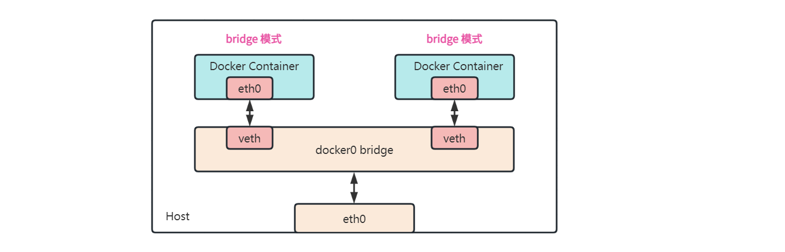
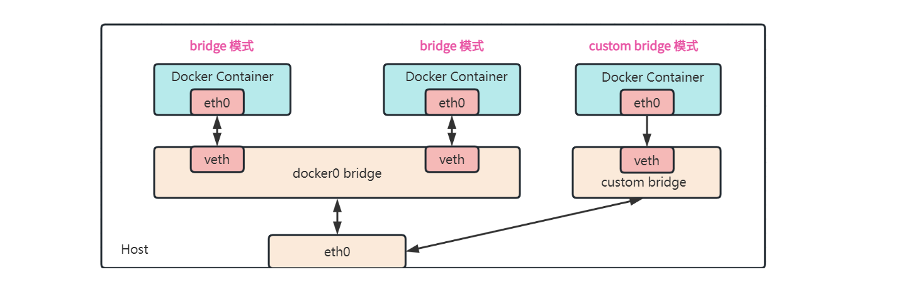
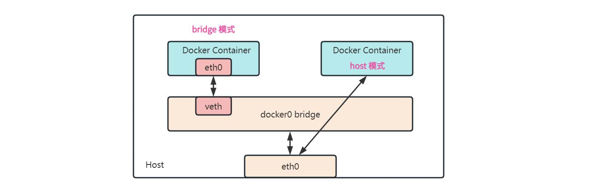
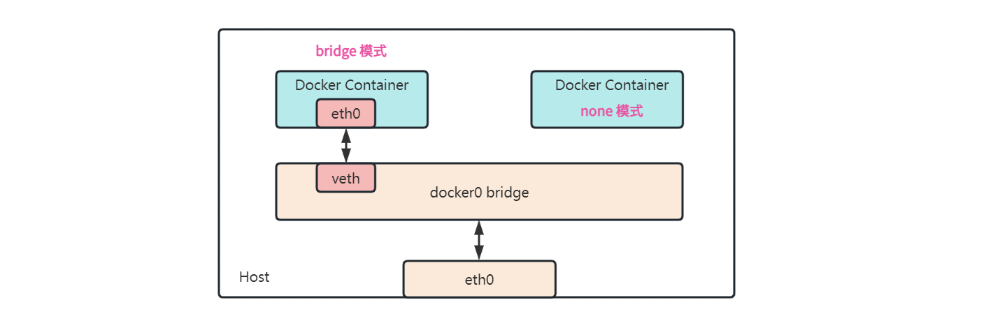

# WEEK032 - 实战 Docker 容器网络

我们知道，容器技术出现的初衷是对容器之间以及容器和宿主机之间的进程、用户、网络、存储等进行隔离，提供一种类似沙盒的虚拟环境，容器网络是这个虚拟环境的一部分，它能让应用从宿主机操作系统的网络环境中独立出来，形成容器自有的网络设备、IP 协议栈、端口套接字、IP 路由表、防火墙等模块。但是网络作为一种特殊的通信机制，我们有时候又希望容器之间、容器和宿主机之间甚至容器和远程主机之间能够互相通信，既要保证容器网络的隔离性，又要实现容器网络的连通性，这使得在容器环境下，网络的问题变得异常复杂。

Docker 是目前最流行的容器技术之一，它提供了一套完整的网络解决方案，不仅可以解决单机网络问题，也可以实现跨主机容器之间的通信。

## 容器网络模型

在学习各种不同的容器网络解决方案之前，我们首先来了解下 CNM 的概念。[CNM（Container Network Model）](https://github.com/moby/libnetwork/blob/master/docs/design.md) 是 Docker 提出并主推的一种容器网络架构，这是一套抽象的设计规范，主要包含三个主要概念：

* `Sandbox` - 提供了容器的虚拟网络栈，即端口套接字、IP 路由表、防火墙、DNS 配置等内容，主要用于隔离容器网络与宿主机网络，形成了完全独立的容器网络环境，一般通过 Linux 中的 [Network Namespace](https://man7.org/linux/man-pages/man7/network_namespaces.7.html) 或类似的技术实现。一个 Sandbox 中可以包含多个 Endpoint。
* `Endpoint` - 就是虚拟网络的接口，就像普通网络接口一样，它的主要职责是创建 Sandbox 到 Network 之间的连接，一般使用 [veth pair](https://man7.org/linux/man-pages/man4/veth.4.html) 之类的技术实现。一个已连接的 Endpoint 只能归属于一个 Sandbox 和 一个 Network。
* `Network` - 提供了一个 Docker 内部的虚拟子网，一个 Network 可以包含多个 Endpoint，同一个 Network 内的 Endpoint 之间可以互相通讯，一般使用 Linux bridge 或 VLAN 来实现。

这三个概念之间的关系如下图所示：


[libnetwork](https://github.com/moby/libnetwork) 是一个 Go 语言编写的开源库，它是 CNM 规范的标准实现，Docker 就是通过 libnetwork 库来实现 CNM 规范中的三大概念，此外它还实现了本地服务发现、基于 Ingress 的容器负载均衡、以及网络控制层和管理层功能。

除了控制层和管理层，我们还需要实现网络的数据层，这部分 Docker 是通过 [驱动（Driver）](https://docs.docker.com/network/#network-drivers) 来实现的。驱动负责处理网络的连通性和隔离性，通过不同的驱动，我们可以扩展 Docker 的网络栈，实现不同的网络类型。

Docker 内置如下这些驱动，通常被称作 **原生驱动** 或者 **本地驱动**：

* [bridge](https://docs.docker.com/network/bridge/)
* [host](https://docs.docker.com/network/host/)
* [none](https://docs.docker.com/network/none/)
* [overlay](https://docs.docker.com/network/overlay/)
* [ipvlan](https://docs.docker.com/network/ipvlan/)
* [macvlan](https://docs.docker.com/network/macvlan/)

第三方也可以通过 [Network plugins](https://docs.docker.com/engine/extend/plugins_services/) 实现自己的网络驱动，这些驱动也被称作 **远程驱动**，比如 [calico](https://github.com/projectcalico/calico)、[flannel](https://github.com/flannel-io/flannel)、[weave](https://github.com/weaveworks/weave) 等。


基于 Docker 网络的这种可插拔的设计，我们通过切换不同的网络驱动，就可以实现不同的容器网络解决方案。

## 单机容器网络方案

让我们从最简单的单机网络方案开始。Docker 在安装时，默认会在系统上创建三个网络，可以通过 `docker network ls` 命令查看：

```
$ docker network ls
NETWORK ID     NAME      DRIVER    SCOPE
04eb1fccf2a8   bridge    bridge    local
189dfa3e3e64   host      host      local
1e63120a4e7a   none      null      local
```

这三个网络分别是 `bridge`、`host` 和 `none`，可以看到这三个网络都是 `local` 类型的。

### Bridge 网络

Bridge 网络是目前使用最广泛的 Docker 网络方案，当我们使用 `docker run` 启动容器时，默认使用的就是 Bridge 网络，我们也可以通过命令行参数 `--network=bridge` 显式地指定使用 Bridge 网络：

```
$ docker run --rm -it --network=bridge busybox
/ # ifconfig
eth0      Link encap:Ethernet  HWaddr 02:42:AC:11:00:02
          inet addr:172.17.0.2  Bcast:172.17.255.255  Mask:255.255.0.0
          UP BROADCAST RUNNING MULTICAST  MTU:1500  Metric:1
          RX packets:9 errors:0 dropped:0 overruns:0 frame:0
          TX packets:0 errors:0 dropped:0 overruns:0 carrier:0
          collisions:0 txqueuelen:0
          RX bytes:782 (782.0 B)  TX bytes:0 (0.0 B)

lo        Link encap:Local Loopback
          inet addr:127.0.0.1  Mask:255.0.0.0
          UP LOOPBACK RUNNING  MTU:65536  Metric:1
          RX packets:0 errors:0 dropped:0 overruns:0 frame:0
          TX packets:0 errors:0 dropped:0 overruns:0 carrier:0
          collisions:0 txqueuelen:1000
          RX bytes:0 (0.0 B)  TX bytes:0 (0.0 B)
```

可以看到，使用 Bridge 网络的容器里除了 `lo` 这个本地回环网卡外，还有一个 `eth0` 以太网卡，那么这个 `eth0` 网卡是连接到哪里呢？我们可以从 `/sys/class/net/eth0` 目录下的 `ifindex` 和 `iflink` 文件中一探究竟：

```
/ # cat /sys/class/net/eth0/ifindex
74
/ # cat /sys/class/net/eth0/iflink
75
```

其中 `ifindex` 表示网络设备的全局唯一 ID，而 `iflink` 主要被隧道设备使用，用于标识隧道另一头的设备 ID。也可以直接使用 `ip link` 命令查看：

```
/ # ip link
1: lo: <LOOPBACK,UP,LOWER_UP> mtu 65536 qdisc noqueue qlen 1000
    link/loopback 00:00:00:00:00:00 brd 00:00:00:00:00:00
74: eth0@if75: <BROADCAST,MULTICAST,UP,LOWER_UP,M-DOWN> mtu 1500 qdisc noqueue 
    link/ether 02:42:ac:11:00:02 brd ff:ff:ff:ff:ff:ff
```

如果 `ifindex` 和 `iflink` 相同，表示这是一个真实的设备，`ip link` 中直接显示设备名，比如上面的 `lo` 网卡；如果 `ifindex` 和 `iflink` 不相同，表示这是一个隧道设备，`ip link` 中显示格式为 `ifindex: eth0@iflink`，比如上面的 `eth0` 网卡。

所以容器中的 `eth0` 是一个隧道设备，它的 ID 为 74，连接它的另一头设备 ID 为 75，那么这个 ID 为 75 的设备又在哪里呢？答案在宿主机上。

我们在宿主机上运行 `ip link` 命令，很快就可以找到这个 ID 为 75 的设备：

```
# ip link
1: lo: <LOOPBACK,UP,LOWER_UP> mtu 65536 qdisc noqueue state UNKNOWN mode DEFAULT group default qlen 1000
    link/loopback 00:00:00:00:00:00 brd 00:00:00:00:00:00
2: enp0s3: <BROADCAST,MULTICAST,UP,LOWER_UP> mtu 1500 qdisc pfifo_fast state UP mode DEFAULT group default qlen 1000
    link/ether 08:00:27:c1:96:99 brd ff:ff:ff:ff:ff:ff
3: docker0: <BROADCAST,MULTICAST,UP,LOWER_UP> mtu 1500 qdisc noqueue state UP mode DEFAULT group default 
    link/ether 02:42:43:d2:12:6f brd ff:ff:ff:ff:ff:ff
75: vethe118873@if74: <BROADCAST,MULTICAST,UP,LOWER_UP> mtu 1500 qdisc noqueue master docker0 state UP mode DEFAULT group default 
    link/ether 96:36:59:73:43:cc brd ff:ff:ff:ff:ff:ff link-netnsid 0
```

设备的名称为 `vethe118873@if74`，也暗示着另一头连接着容器里的 ID 为 74 的设备。像上面这样成对出现的设备，被称为 `veth pair`， `veth` 表示虚拟以太网（`Virtual Ethernet`），而 `veth pair` 就是一个虚拟的以太网隧道（`Ethernet tunnel`），它可以实现隧道一头接收网络数据后，隧道另一头也能立即接收到，可以把它想象成一根网线，一头插在容器里，另一头插在宿主机上。那么它又插在宿主机的什么位置呢？答案是 `docker0` 网桥。

使用 `brctl show` 查看宿主机的网桥：

```
# brctl show
bridge name	bridge id		STP enabled	interfaces
docker0		8000.024243d2126f	no		vethe118873
```

可以看到一个名为 `docker0` 的网桥设备，并且能看到 `vethe118873` 接口就插在这个网桥上。这个 `docker0` 网桥是 Docker 在安装时默认创建的，当我们不指定 `--network` 参数时，创建的容器默认都挂在这个网桥上，它也是实现 Bridge 网络的核心部分。

使用下面的命令可以更直观的看出该网桥的详细信息：

```
# docker network inspect bridge
[
    {
        "Name": "bridge",
        "Id": "ea473e613c26e31fb6d51edb0fb541be0d11a73f24f81d069e3104eef97b5cfc",
        "Created": "2022-06-03T11:56:33.258310522+08:00",
        "Scope": "local",
        "Driver": "bridge",
        "EnableIPv6": false,
        "IPAM": {
            "Driver": "default",
            "Options": null,
            "Config": [
                {
                    "Subnet": "172.17.0.0/16",
                    "Gateway": "172.17.0.1"
                }
            ]
        },
        "Internal": false,
        "Attachable": false,
        "Ingress": false,
        "ConfigFrom": {
            "Network": ""
        },
        "ConfigOnly": false,
        "Containers": {
            "33c8609c8cbe8e99f63fd430c926bd05167c2c92b64f97e4a06cfd0892f7e74c": {
                "Name": "suspicious_ganguly",
                "EndpointID": "3bf4b3d642826ab500f50eec4d5c381d20c75393ab1ed62a8425f8094964c122",
                "MacAddress": "02:42:ac:11:00:02",
                "IPv4Address": "172.17.0.2/16",
                "IPv6Address": ""
            }
        },
        "Options": {
            "com.docker.network.bridge.default_bridge": "true",
            "com.docker.network.bridge.enable_icc": "true",
            "com.docker.network.bridge.enable_ip_masquerade": "true",
            "com.docker.network.bridge.host_binding_ipv4": "0.0.0.0",
            "com.docker.network.bridge.name": "docker0",
            "com.docker.network.driver.mtu": "1500"
        },
        "Labels": {}
    }
]
```

其中 `IPAM` 部分表明这个网桥的网段为 `172.17.0.0/16`，所以上面看容器的 IP 地址为 `172.17.0.2`；另外网关的地址为 `172.17.0.1`，这个就是 `docker0` 的地址：

```
# ip addr show type bridge
3: docker0: <BROADCAST,MULTICAST,UP,LOWER_UP> mtu 1500 qdisc noqueue state UP group default 
    link/ether 02:42:43:d2:12:6f brd ff:ff:ff:ff:ff:ff
    inet 172.17.0.1/16 brd 172.17.255.255 scope global docker0
       valid_lft forever preferred_lft forever
    inet6 fe80::42:43ff:fed2:126f/64 scope link 
       valid_lft forever preferred_lft forever
```

> `docker0` 网段地址可以在 Docker Daemon 的配置文件 `/etc/docker/daemon.json` 中进行修改：
> 
> ```
> $ vi /etc/docker/daemon.json
> {
>   "bip": "172.100.0.1/24"
> }
> ```
>
> 修改之后重启 Docker Daemon：
> 
> ```
> $ systemctl restart docker
> ```
> 
> 验证配置是否生效：
> 
> ```
> $ ip addr show docker0
> 3: docker0: <NO-CARRIER,BROADCAST,MULTICAST,UP> mtu 1500 qdisc noqueue state DOWN group default 
>     link/ether 02:42:43:d2:12:6f brd ff:ff:ff:ff:ff:ff
>     inet 172.100.0.1/24 brd 172.100.0.255 scope global docker0
>        valid_lft forever preferred_lft forever
>     inet6 fe80::42:43ff:fed2:126f/64 scope link 
>        valid_lft forever preferred_lft forever
> ```

下图是 Bridge 网络大致的网络拓扑结构：



#### 自定义 Bridge 网络

从 Bridge 的网络拓扑结构中我们可以看到，所有的容器都连接到同一个 `docker0` 网桥，它们之间的网络是互通的，这存在着一定的安全风险。为了保证我们的容器和其他的容器之间是隔离的，我们可以创建自定义的网络：

```
$ docker network create --driver=bridge test
5266130b7e5da2e655a68d00b280bc274ff4acd9b76f46c9992bcf0cd6df7f6a
```

创建之后，再次查看系统中的网桥列表：

```
$ brctl show
bridge name	bridge id		STP enabled	interfaces
br-5266130b7e5d		8000.0242474f9085	no		
docker0		8000.024243d2126f	no	
```

从 `brctl show` 的运行结果中可以看出多了一个新的网桥，网桥的名字正是我们创建的网络 ID，Docker 会自动为网桥分配子网和网关，我们也可以在创建网络时通过 `--subnet` 和 `--gateway` 参数手工设置：

```
$ docker network create --driver=bridge --subnet=172.200.0.0/24 --gateway=172.200.0.1 test2
18f549f753e382c5054ef36af28b6b6a2208e4a89ee710396eb2b729ee8b1281
```

创建好自定义网络之后，就可以在启动容器时通过 `--network` 指定：

```
$ docker run --rm -it --network=test2 busybox
/ # ip addr
1: lo: <LOOPBACK,UP,LOWER_UP> mtu 65536 qdisc noqueue qlen 1000
    link/loopback 00:00:00:00:00:00 brd 00:00:00:00:00:00
    inet 127.0.0.1/8 scope host lo
       valid_lft forever preferred_lft forever
80: eth0@if81: <BROADCAST,MULTICAST,UP,LOWER_UP,M-DOWN> mtu 1500 qdisc noqueue 
    link/ether 02:42:ac:c8:00:02 brd ff:ff:ff:ff:ff:ff
    inet 172.200.0.2/24 brd 172.200.0.255 scope global eth0
       valid_lft forever preferred_lft forever
```

由于 test2 的网段为 `172.200.0.0/24`，所以 Docker 为我们的容器分配的 IP 地址是 `172.200.0.2`，这个网段和 `docker0` 是隔离的，我们 ping 之前的容器 IP 是 ping 不同的：

```
/ # ping 172.17.0.2
```

自定义 Bridge 网络的拓扑结构如下图所示：



#### Container 网络


### Host 网络

通过 `--network=host` 参数可以指定容器使用 Host 网络，使用 Host 网络的容器和宿主机共用同一个网络栈，也就是说，在容器里面，端口套接字、IP 路由表、防火墙、DNS 配置都和宿主机完全一样：

```
> docker run --rm -it --network=host busybox
/ # ifconfig
docker0   Link encap:Ethernet  HWaddr 02:42:07:3E:52:7E
          inet addr:172.17.0.1  Bcast:172.17.255.255  Mask:255.255.0.0
          UP BROADCAST MULTICAST  MTU:1500  Metric:1
          RX packets:0 errors:0 dropped:0 overruns:0 frame:0
          TX packets:0 errors:0 dropped:0 overruns:0 carrier:0
          collisions:0 txqueuelen:0
          RX bytes:0 (0.0 B)  TX bytes:0 (0.0 B)

eth0      Link encap:Ethernet  HWaddr 0A:3E:D1:F7:58:33
          inet addr:192.168.65.4  Bcast:0.0.0.0  Mask:255.255.255.255
          inet6 addr: fe80::83e:d1ff:fef7:5833/64 Scope:Link
          UP BROADCAST RUNNING MULTICAST  MTU:1500  Metric:1
          RX packets:1280 errors:0 dropped:0 overruns:0 frame:0
          TX packets:1271 errors:0 dropped:0 overruns:0 carrier:0
          collisions:0 txqueuelen:0
          RX bytes:2752699 (2.6 MiB)  TX bytes:107715 (105.1 KiB)

lo        Link encap:Local Loopback
          inet addr:127.0.0.1  Mask:255.0.0.0
          inet6 addr: ::1/128 Scope:Host
          UP LOOPBACK RUNNING  MTU:65536  Metric:1
          RX packets:709688 errors:0 dropped:0 overruns:0 frame:0
          TX packets:709688 errors:0 dropped:0 overruns:0 carrier:0
          collisions:0 txqueuelen:1000
          RX bytes:149025485 (142.1 MiB)  TX bytes:149025485 (142.1 MiB)

veth2fbdd331 Link encap:Ethernet  HWaddr 46:B7:0B:D6:16:C2
          inet6 addr: fe80::44b7:bff:fed6:16c2/64 Scope:Link
          UP BROADCAST RUNNING MULTICAST  MTU:1500  Metric:1
          RX packets:3876 errors:0 dropped:0 overruns:0 frame:0
          TX packets:3830 errors:0 dropped:0 overruns:0 carrier:0
          collisions:0 txqueuelen:0
          RX bytes:370360 (361.6 KiB)  TX bytes:413700 (404.0 KiB)

veth4d3538f6 Link encap:Ethernet  HWaddr 56:C0:72:ED:10:21
          inet6 addr: fe80::54c0:72ff:feed:1021/64 Scope:Link
          UP BROADCAST RUNNING MULTICAST  MTU:1500  Metric:1
          RX packets:10934 errors:0 dropped:0 overruns:0 frame:0
          TX packets:12400 errors:0 dropped:0 overruns:0 carrier:0
          collisions:0 txqueuelen:0
          RX bytes:2197702 (2.0 MiB)  TX bytes:3897932 (3.7 MiB)
```

在容器里使用 `ifconfig` 命令，输出的结果其实是我们宿主机的网卡，容器里的 `hostname` 也和宿主机一样，所以我们可以在容器里使用 `localhost` 访问宿主机。

由于直接使用宿主机的网络，少了一层网络转发，所以 Host 网络具有非常好的性能，如果你的应用对网络传输效率有较高的要求，则可以选择使用 Host 网络。另外，使用 Host 网络还可以在容器里直接对宿主机网络进行配置，比如管理 iptables 或 DNS 配置等。

需要注意的是，Host 网络的主要优点是提高了网络性能，但代价是容器与主机共享网络命名空间，这可能会带来安全隐患。因此，需要仔细考虑使用 Host 网络的场景，并采取适当的安全措施，以确保容器和主机的安全性。

下图是 Host 网络大致的网络拓扑结构：



### None 网络

None 网络是一种特殊类型的网络，顾名思义，它表示容器不连接任何网络。None 网络的容器是一个完全隔绝的环境，它无法访问任何其他容器或宿主机。我们在创建容器时通过 `--network=none` 参数使用 None 网络：

```
$ docker run --rm -it --network=none busybox
/ # ifconfig
lo        Link encap:Local Loopback
          inet addr:127.0.0.1  Mask:255.0.0.0
          UP LOOPBACK RUNNING  MTU:65536  Metric:1
          RX packets:0 errors:0 dropped:0 overruns:0 frame:0
          TX packets:0 errors:0 dropped:0 overruns:0 carrier:0
          collisions:0 txqueuelen:1000
          RX bytes:0 (0.0 B)  TX bytes:0 (0.0 B)
```

在使用 None 网络的容器里，除了 lo 设备之外，没有任何其他的网卡设备。这种与世隔离的环境非常适合一些安全性工作或测试工作，比如，对恶意软件进行逆向分析时，我们不希望恶意软件访问外部网络，使用 None 网络可以避免它对宿主机或其他服务造成影响；或者在单元测试时，通过 None 网络可以模拟网络隔离的效果，这样我们可以测试和验证没有网络情况下的程序表现。

下图是 None 网络大致的网络拓扑结构：



## 跨主机容器网络方案

### Overlay 网络

### Macvlan 网络

### IPvlan 网络

## 参考

1. [Networking overview | Docker Documentation](https://docs.docker.com/network/)
1. [每天5分钟玩转Docker容器技术](https://book.douban.com/subject/27593748/)
1. [Docker 网络模式详解及容器间网络通信](https://www.cnblogs.com/mrhelloworld/p/docker11.html)
1. [网络 - Docker — 从入门到实践](https://yeasy.gitbook.io/docker_practice/underly/network)
1. [花了三天时间终于搞懂 Docker 网络了](https://cloud.tencent.com/developer/article/1747307)
1. [Docker容器网络互联](https://chende.ren/2021/07/14113656-docker-net.html)

## 更多

### 其他开源的容器网络方案

* [flannel](https://github.com/flannel-io/flannel)
* [weave](https://github.com/weaveworks/weave)
* [calico](https://github.com/projectcalico/calico)

### Kubernetes 网络

1. [数据包在 Kubernetes 中的一生（1）](https://blog.fleeto.us/post/life-of-a-packet-in-k8s-1/)
1. [从零开始入门 K8s：理解 CNI 和 CNI 插件](https://developer.aliyun.com/article/751611)
1. [IPVS从入门到精通kube-proxy实现原理](https://zhuanlan.zhihu.com/p/94418251)
1. [Kubernetes（k8s）kube-proxy、Service详解](https://www.cnblogs.com/liugp/p/16372503.html)
