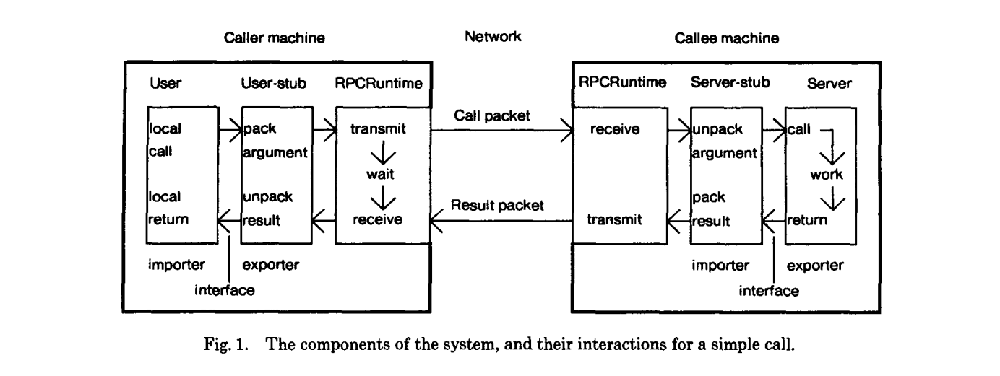

# WEEK033 - gRPC 快速入门

[RPC](https://en.wikipedia.org/wiki/Remote_procedure_call) 又被称为 **远程过程调用**，英文全称为 **Remote Procedure Call**，是一种服务间的通信规范，它可以让你像调用本地方法一样调用远程服务提供的方法，而不需要关心底层的通信细节。RPC 的概念早在上个世纪七八十年代就已经被提出，1984 年，Birrell 和 Nelson 在 ACM Transactions on Computer Systems 期刊上发表了一篇关于 RPC 的经典论文 [Implementing remote procedure calls](https://www.cs.cmu.edu/~dga/15-712/F07/papers/birrell842.pdf)，论文中首次给出了实现 RPC 的基本框架：



从这个框架中可以看到很多现代 RPC 框架的影子，比如客户端和服务端的 Stub、序列化和反序列化等，事实上，所有后来的 RPC 框架几乎都是源自于这个原型。

不过在那个年代，RPC 的争议是非常大的，由于网络环境的不可靠性，RPC 永远都不可能做到像调用本地方法一样。大家提出了一堆问题，比如：故障恢复、请求重试、异步请求、服务寻址等，在那个互联网都还没有出现的年代，一堆大神们就已经在讨论分布式系统间的调用问题了，而他们讨论的问题焦点，基本上都演变成了 RPC 历史中永恒的话题。

为了解决这些问题，软件架构经历了一代又一代的发展和演进。1988 年，Sun 公司推出了第一个商业化的 RPC 库 [Sun RPC](https://web.cs.wpi.edu/~rek/DCS/D04/SunRPC.html) ，并被定义为标准的 RPC 规范；1991 年，非营利性组织 OMG 发布 [CORBA](https://www.omg.org/spec/CORBA/)，它通过接口定义语言 IDL 中的抽象类型映射让异构环境之间的互操作成为了可能；不过由于其复杂性，很快就被微软推出的基于 XML 的 [SOAP](https://www.w3schools.com/xml/xml_soap.asp) 技术所打败，随后 SOAP 作为 W3C 标准大大推动了 Web Service 概念的发展；像 SOAP 这种基于 XML 的 RPC 技术被称为 [XML-RPC](https://en.wikipedia.org/wiki/XML-RPC)，它最大的问题是 XML 报文内容过于冗余，对 XML 的解析效率也很低，于是 JSON 应运而生，进而导致 RESTful 的盛行；不过无论是 XML 还是 JSON，都是基于文本传输，性能都无法让人满意，直到 2008 年，Google 开源 [Protocol Buffers](https://protobuf.dev/)，这是一种高效的结构化数据存储格式，可以用于结构化数据的序列化，非常适合做数据存储或 RPC 数据交换格式；可能是由于微服务的流行，之后的 RPC 框架如雨后春笋般蓬勃发展，同年，Facebook 向 Apache 贡献了开源项目 [Thrift](https://thrift.apache.org/)，2009 年，Hadoop 之父 Doug Cutting 开发出 [Avro](https://avro.apache.org/)，成为 Hadoop 的一个子项目，随后又脱离 Hadoop 成为 Apache 顶级项目；2011 年，阿里也开源了它自研的 RPC 框架 [Dubbo](https://cn.dubbo.apache.org/zh-cn/)，和前两个一样，最后也贡献给了 Apache；2015 年，Google 开源 [gRPC](https://grpc.io) 框架，开创性地使用 HTTP/2 作为传输协议，基于 HTTP/2 的多路复用和服务端推送技术，gRPC 支持双向流式通信，这使得 RPC 框架终于不再拘泥于万年不变的 C/S 模型了。

2017 年，gRPC 作为孵化项目成为 CNCF 的一员，不论是 Envoy 还是 Istio 等 Service Mesh 方案，都将 gRPC 作为一等公民，可以预见的是，谷歌正在将 gRPC 打造成云原生时代通信层事实上的标准。

## 从 `Hello World` 开始

这一节我们使用 Go 语言实现一个简单的 `Hello World` 服务，学习 gRPC 的基本概念。首先，我们通过 `go mod init` 初始化示例项目：

```
$ mkdir demo && cd demo
$ go mod init example.com/demo
go: creating new go.mod: module example.com/demo
go: to add module requirements and sums:
        go mod tidy
```

然后获取 `grpc` 依赖：

```
$ go get google.golang.org/grpc@latest
go: downloading golang.org/x/net v0.5.0
go: downloading golang.org/x/sys v0.4.0
go: downloading google.golang.org/genproto v0.0.0-20230110181048-76db0878b65f
go: downloading golang.org/x/text v0.6.0
go: added github.com/golang/protobuf v1.5.2
go: added golang.org/x/net v0.5.0
go: added golang.org/x/sys v0.4.0
go: added golang.org/x/text v0.6.0
go: added google.golang.org/genproto v0.0.0-20230110181048-76db0878b65f
go: added google.golang.org/grpc v1.53.0
go: added google.golang.org/protobuf v1.28.1
```

### 编写 `.proto` 文件

正如前文所述，Google 在 2009 年开源了一种高效的结构化数据存储格式 [Protocol Buffers](https://protobuf.dev/)，这种格式非常适合用于 RPC 的数据交换，所以顺理成章的，Google 在开发 gRPC 时就采用了 Protocol Buffers 作为默认的数据格式。不过要注意的是 Protocol Buffers 不仅仅是一种数据格式，而且也是一种 **IDL**（Interface Description Language，接口描述语言），它通过一种中立的方式来描述接口和数据类型，从而实现跨语言和跨平台开发。

一般使用 `.proto` 后缀的文件来定义接口和数据类型，所以接下来，我们要创建一个 `hello.proto` 文件，我们将其放在 `proto` 目录下：

```
$ mkdir proto && cd proto
$ vim hello.proto
```

文件内容如下：

```
syntax = "proto3";

option go_package = "example.com/demo/proto";

service HelloService {
  rpc SayHello (HelloRequest) returns (HelloResponse) {}
}

message HelloRequest {
  string name = 1;
}

message HelloResponse {
  string message = 1;
}
```

我们在第一行指定使用 `proto3` 语法，这是目前推荐的版本，如果不指定，默认将使用 `proto2`，可能会导致一些版本兼容性的问题。随后我们用关键字 `service` 定义了一个 `HelloService` 服务，该服务包含一个 `SayHello` 方法，方法的入参为 `HelloRequest`，出参为 `HelloResponse`，这两个消息类型都在后面通过关键字 `message` 所定义。Protocol Buffers 的语法非常直观，也比较容易理解，这里只是使用了一些简单的语法，其他更复杂的语法可以参考 [Protocol Buffers 的官方文档](https://protobuf.dev/programming-guides/proto3/)，另外这里有一份 [中文语法指南](https://www.liwenzhou.com/posts/Go/Protobuf3-language-guide-zh/) 也可供参考。

编写好 `hello.proto` 文件之后，我们还需要一些工具将其转换为 Go 语言。这些工具包括：

* `protoc`
* `protoc-gen-go`
* `protoc-gen-go-grpc`

`protoc` 是 Protocol Buffers 编译器，用于将 `.proto` 文件转换为其他编程语言，而不同语言的转换工作由不同语言的插件来实现。Go 语言的插件有两个：`protoc-gen-go` 和 `protoc-gen-go-grpc`，插件 `protoc-gen-go` 会生成一个后缀为 `.pb.go` 的文件，其中包含 `.proto` 文件中定义数据类型和其序列化方法；插件 `protoc-gen-go-grpc` 会生成一个后缀为 `_grpc.pb.go` 的文件，其中包含供客户端调用的服务方法和服务端要实现的接口类型。

`protoc` 可以从 Protocol Buffers 的 [Release 页面](https://github.com/protocolbuffers/protobuf/releases) 下载，下载后将 bin 目录添加到 PATH 环境变量即可：

```
$ curl -LO https://github.com/protocolbuffers/protobuf/releases/download/v22.0/protoc-22.0-linux-x86_64.zip
```

`protoc-gen-go` 和 `protoc-gen-go-grpc` 两个插件可以通过 `go install` 命令直接安装：

```
$ go install google.golang.org/protobuf/cmd/protoc-gen-go@v1.28.1
$ go install google.golang.org/grpc/cmd/protoc-gen-go-grpc@v1.2.0
```

安装完成后使用 `--version` 参数检测各个命令是否正常：

```
$ protoc --version
libprotoc 22.0

$ protoc-gen-go --version
protoc-gen-go v1.28.1

$ protoc-gen-go-grpc --version
protoc-gen-go-grpc 1.2.0
```

一切就绪后，就可以使用下面这行命令生成相应的 Go 代码了：

```
$ cd proto
$ protoc --go_out=. --go_opt=paths=source_relative \
    --go-grpc_out=. --go-grpc_opt=paths=source_relative \
    hello.proto
```

这个命令在当前目录下生成了 `hello.pb.go` 和 `hello_grpc.pb.go` 两个文件。

### 实现服务端

在生成的 `hello_grpc.pb.go` 文件中，定义了一个 `HelloServiceServer` 接口：

```
// HelloServiceServer is the server API for HelloService service.
// All implementations must embed UnimplementedHelloServiceServer
// for forward compatibility
type HelloServiceServer interface {
    SayHello(context.Context, *HelloRequest) (*HelloResponse, error)
    mustEmbedUnimplementedHelloServiceServer()
}
```

并且在接口的下面提供了一个默认实现：

```
type UnimplementedHelloServiceServer struct {
}

func (UnimplementedHelloServiceServer) SayHello(context.Context, *HelloRequest) (*HelloResponse, error) {
    return nil, status.Errorf(codes.Unimplemented, "method SayHello not implemented")
}
func (UnimplementedHelloServiceServer) mustEmbedUnimplementedHelloServiceServer() {}
```

注意看 `HelloServiceServer` 的上面有一行注释：**All implementations must embed UnimplementedHelloServiceServer for forward compatibility**，为了保证向前兼容性，我们自己在实现这个接口时必须要嵌入 `UnimplementedHelloServiceServer` 这个默认实现，[这篇文章](https://blog.csdn.net/Canon_in_D_Major/article/details/108135724) 对此有一个简单的说明。

接下来我们创建一个 `server` 目录，并创建一个 `main.go` 文件：

```
$ mkdir server && cd server
$ vim main.go
```

定义 `server` 结构体，继承 `UnimplementedHelloServiceServer` 并重写 `SayHello` 方法：

```
type server struct {
    proto.UnimplementedHelloServiceServer
}

func (s *server) SayHello(ctx context.Context, request *proto.HelloRequest) (*proto.HelloResponse, error) {
    log.Printf("Request recieved: %v\n", request.GetName())
    return &proto.HelloResponse{
        Message: "Hello " + request.GetName(),
    }, nil
}
```

然后在入口方法中，通过 `proto.RegisterHelloServiceServer(s, &server{})` 将我们的实现注册到 grpc Server 中：

```
func main() {

    lis, err := net.Listen("tcp", ":8080")
    if err != nil {
        log.Fatalf("Server listen failed!")
    }
    log.Printf("Server listening at: %s", lis.Addr())

    s := grpc.NewServer()
    proto.RegisterHelloServiceServer(s, &server{})
    if err := s.Serve(lis); err != nil {
        log.Fatalf("Server serve failed!")
    }
}
```

使用 `go run` 运行该代码：

```
$ go run ./server/main.go
2023/03/02 07:40:50 Server listening at: [::]:8080
```

一个 gRPC 的服务端就启动成功了！

### 实现客户端

接下来，我们来实现客户端。其实，在 `hello_grpc.pb.go` 文件中，`protoc` 也为我们定义了一个 `HelloServiceClient` 接口：

```
type HelloServiceClient interface {
    SayHello(ctx context.Context, in *HelloRequest, opts ...grpc.CallOption) (*HelloResponse, error)
}
```

并提供了该接口的默认实现：

```
type helloServiceClient struct {
    cc grpc.ClientConnInterface
}

func NewHelloServiceClient(cc grpc.ClientConnInterface) HelloServiceClient {
    return &helloServiceClient{cc}
}

func (c *helloServiceClient) SayHello(ctx context.Context, in *HelloRequest, opts ...grpc.CallOption) (*HelloResponse, error) {
    out := new(HelloResponse)
    err := c.cc.Invoke(ctx, "/HelloService/SayHello", in, out, opts...)
    if err != nil {
        return nil, err
    }
    return out, nil
}
```

和 `HelloServiceServer` 不同的是，这个客户端实现我们无需修改，可以直接使用。首先我们创建一个 `client` 目录，并创建一个 `main.go` 文件：

```
$ mkdir client && cd client
$ vim main.go
```

然后在入口方法中，通过 `grpc.Dial` 创建一个和服务端的连接：

```
conn, err := grpc.Dial("localhost:8080", grpc.WithTransportCredentials(insecure.NewCredentials()))
if err != nil {
    log.Fatalf("Connect grpc server failed: %v", err)
}
defer conn.Close()
```

注意我们的服务端没有开启 TLS，连接是不安全的，所以我们需要加一个不安全证书的连接选项，否则连接的时候会报错：

```
Connect grpc server failed: grpc: no transport security set (use grpc.WithTransportCredentials(insecure.NewCredentials()) explicitly or set credentials)
```

然后使用 `hello_grpc.pb.go` 文件中提供的 `NewHelloServiceClient` 方法创建一个客户端实例：

```
c := proto.NewHelloServiceClient(conn)
```

同时使用 `context` 创建一个带超时的上下文：

```
ctx, cancel := context.WithTimeout(context.Background(), time.Second)
defer cancel()
```

使用创建的客户端调用 `SayHello` 方法：

```
r, err := c.SayHello(ctx, &proto.HelloRequest{Name: "zhangsan"})
if err != nil {
    log.Fatalf("Call SayHello failed: %v", err)
}
log.Printf("SayHello response: %s", r.GetMessage())
```

从调用的代码上看起来，确实和调用本地方法一样，传入 `HelloRequest` 请求，得到 `HelloResponse` 响应。至此，一个简单的客户端就编写完成了，使用 `go run` 运行该代码：

```
$ go run ./client/main.go
2023/03/03 07:03:34 SayHello response: Hello zhangsan
```

### 测试服务端

除了编写客户端，我们也可以使用其他的工具来测试服务端，对于 HTTP 服务，我们一般使用 [curl](https://curl.se/) 或 [Postman](https://www.postman.com/) 之类的工具；而对于 gRPC 服务，也有类似的工具，比如 [grpcurl](https://github.com/fullstorydev/grpcurl) 或 [grpcui](https://github.com/fullstorydev/grpcui) 等，这里整理了一份 [关于 gRPC 工具的清单](https://github.com/grpc-ecosystem/awesome-grpc#tools)。

这里使用 `grpcurl` 来对我们的服务端进行简单的测试。首先从它的 [Release 页面](https://github.com/fullstorydev/grpcurl/releases) 下载并安装 `grpcurl`：

```
$ curl -LO https://github.com/fullstorydev/grpcurl/releases/download/v1.8.7/grpcurl_1.8.7_linux_x86_64.tar.gz
```

`grpcurl` 中最常使用的是 `list` 子命令，它可以列出服务端支持的所有服务：

```
$ grpcurl -plaintext localhost:8080 list
Failed to list services: server does not support the reflection API
```

不过这要求我们的服务端必须开启 [反射 API](https://github.com/grpc/grpc/blob/master/src/proto/grpc/reflection/v1alpha/reflection.proto)，打开 `server/main.go` 文件，在其中加上下面这行代码：

```
reflection.Register(s)
```

这样我们就通过 Go 语言中提供的 `reflection` 包开启了反射 API，然后使用 `grpcurl` 的 `list` 命令重新列出服务端的所有服务：

```
$ grpcurl -plaintext localhost:8080 list
HelloService
grpc.reflection.v1alpha.ServerReflection
```

> 如果服务端没有开启反射 API，`grpc` 也支持直接使用 [Proto 文件](https://github.com/fullstorydev/grpcurl#proto-source-files) 或 [Protoset 文件](https://github.com/fullstorydev/grpcurl#protoset-files)。

我们还可以使用 `list` 命令继续列出 `HelloService` 服务的所有方法：

```
$ grpcurl -plaintext localhost:8080 list HelloService
HelloService.SayHello
```

如果要查看某个方法的详细信息，可以使用 `describe` 命令：

```
$ grpcurl -plaintext localhost:8080 describe HelloService.SayHello
HelloService.SayHello is a method:
rpc SayHello ( .HelloRequest ) returns ( .HelloResponse );
```

可以看出，这和我们在 `proto` 文件中的定义是一致的。最后，使用 `grpcurl` 来调用这个方法：

```
$ grpcurl -plaintext -d '{"name": "zhangsan"}' localhost:8080 HelloService.SayHello
{
  "message": "Hello zhangsan"
}
```

如果入参比较大，可以将其保存在一个文件中，使用下面的方法来调用：

```
$ cat input.json | grpcurl -plaintext -d @ localhost:8080 HelloService.SayHello
{
  "message": "Hello zhangsan"
}
```

## gRPC 的四种形式

gRPC 支持四种不同的通信方式：

* 简单 RPC（`Simple RPC`）
* 服务端流 RPC（`Server-side streaming RPC`）
* 客户端流 RPC（`Client-side streaming RPC`）
* 双向流 RPC（`Bidirectional streaming RPC`）

上一节中的 `SayHello` 就是一个简单 RPC 的例子：

```
rpc SayHello (HelloRequest) returns (HelloResponse) {}
```

这种 RPC 有时候也被称为 **Unary RPC**，除此之外，gRPC 还支持三种流式通信方法，也即 **Streaming RPC**。

### 服务端流 RPC（`Server-side streaming RPC`）

第一种叫服务端流 RPC，它接受一个正常的请求，并以流的形式向客户端发送多个响应。在下面的例子中，客户端向服务端发送一个字符串，服务端对字符串进行分词，并将分词结果以流式返回给客户端。首先，我们在 `.proto` 文件中定义 `Split` 方法和相应的消息体：

```
rpc Split (SplitRequest) returns (stream SplitResponse) {}
```

然后，使用 `protoc` 生成服务端和客户端的代码，接着在 `server/main.go` 文件中添加服务端实现：

```
func (s *server) Split(request *proto.SplitRequest, stream proto.HelloService_SplitServer) error {
    log.Printf("Request recieved: %v\n", request.GetSentence())
    words := strings.Split(request.GetSentence(), " ")
    for _, word := range words {
        if err := stream.Send(&proto.SplitResponse{Word: word}); err != nil {
            return err
        }
    }
    return nil
}
```

和简单 RPC 的 `SayHello` 方法相比，服务端流 RPC 的 `Split` 方法在参数上有一些细微的差别，少了一个 `ctx context.Context` 参数，而多了一个 `stream proto.HelloService_SplitServer` 参数，这是 `protoc` 自动生成的一个接口：

```
type HelloService_SplitServer interface {
    Send(*SplitResponse) error
    grpc.ServerStream
}
```

这个接口继承自 `grpc.ServerStream` 接口，并具有一个 `Send` 方法，用来向客户端发送响应。

在 `client/main.go` 文件中添加客户端实现：

```
stream, err := c.Split(ctx, &proto.SplitRequest{Sentence: "Hello World"})
if err != nil {
    log.Fatalf("Call Split failed: %v", err)
}
for {
    r, err := stream.Recv()
    if err == io.EOF {
        break
    }
    if err != nil {
        log.Fatalf("%v.Split(_) = _, %v", c, err)
    }
    log.Printf("Split response: %s", r.GetWord())
}
```

和简单 RPC 的客户端代码相比，`Split` 方法不是直接返回 `SplitResponse`，而是返回一个 `stream` 流，它的类型为 `HelloService_SplitClient` 接口：

```
type HelloService_SplitClient interface {
    Recv() (*SplitResponse, error)
    grpc.ClientStream
}
```

这个接口继承自 `grpc.ClientStream` 接口，并具有一个 `Recv` 方法，用来接受服务端发送的响应，当服务端发送结束后，`Recv` 方法将返回 `io.EOF` 错误。

### 客户端流 RPC（`Client-side streaming RPC`）

第二种叫客户端流 RPC，它以流的形式接受客户端发送来的多个请求，服务端处理之后返回一个正常的响应。在下面的例子中，客户端向服务端发送多个数字，服务端收集之后进行求和，并将求和结果返回给客户端。首先，我们在 `.proto` 文件中定义 `Sum` 方法和相应的消息体：

```
rpc Sum (stream SumRequest) returns (SumResponse) {}
```

然后，使用 `protoc` 生成服务端和客户端的代码，接着在 `server/main.go` 文件中添加服务端实现：

```
func (s *server) Sum(stream proto.HelloService_SumServer) error {
    var sum int32 = 0
    for {
        r, err := stream.Recv()
        if err == io.EOF {
            return stream.SendAndClose(&proto.SumResponse{Sum: sum})
        }
        if err != nil {
            return err
        }
        sum = sum + r.GetNum()
    }
}
```

从上面的代码可以看到，`Sum` 方法没有了 `request` 参数，只有一个 `stream` 参数，请求参数通过 `stream.Recv` 以流的形式读取，当读取结束后，`stream.Recv` 方法将返回 `io.EOF` 错误，这时我们通过 `stream.SendAndClose` 将处理之后的结果返回给客户端，并关闭连接。

在 `client/main.go` 文件中添加客户端实现：

```
stream2, err := c.Sum(ctx)
if err != nil {
    log.Fatalf("%v.Sum(_) = _, %v", c, err)
}
nums := []int32{1, 2, 3, 4, 5, 6, 7}
for _, num := range nums {
    if err := stream2.Send(&proto.SumRequest{Num: num}); err != nil {
        log.Fatalf("%v.Send(%v) = %v", stream, num, err)
    }
}
response, err := stream2.CloseAndRecv()
if err != nil {
    log.Fatalf("%v.CloseAndRecv() failed: %v", stream2, err)
}
log.Printf("Sum response: %v", response.GetSum())
```

在上面的代码中，`Sum` 方法返回一个 `stream` 变量，然后通过 `stream.Send` 不断向服务端发送请求，当数据发送结束后，再通过 `stream.CloseAndRecv` 关闭连接，并接受服务端响应。

### 双向流 RPC（`Bidirectional streaming RPC`）

第三种叫双向流 RPC，这有点像网络聊天，服务端和客户端双方以任意的顺序互相通信，服务端可以在每次接受客户端请求时就返回一次响应，也可以接受多个请求后再返回一次响应。首先，我们在 `.proto` 文件中定义 `Chat` 方法和相应的消息体：

```
rpc Chat (stream ChatRequest) returns (stream ChatResponse) {}
```

然后，使用 `protoc` 生成服务端和客户端的代码，接着在 `server/main.go` 文件中添加服务端实现：

```
func (s *server) Chat(stream proto.HelloService_ChatServer) error {
    for {
        r, err := stream.Recv()
        if err == io.EOF {
            return nil
        }
        if err != nil {
            return err
        }
        if err = stream.Send(&proto.ChatResponse{Message: "Reply to " + r.GetMessage()}); err != nil {
            return err
        }
    }
}
```

上面的代码和客户端流 RPC 比较类似，只不过服务端的响应变得更及时，每次接受到客户端请求时都会响应，而不是等客户端请求结束后再响应。

在 `client/main.go` 文件中添加客户端实现：

```
stream3, err := c.Chat(ctx)
if err != nil {
    log.Fatalf("%v.Chat(_) = _, %v", c, err)
}
waitc := make(chan struct{})
go func() {
    for {
        in, err := stream3.Recv()
        if err == io.EOF {
            close(waitc)
            return
        }
        if err != nil {
            log.Fatalf("Failed to receive: %v", err)
        }
        log.Printf("Chat response: %s", in.GetMessage())
    }
}()

messages := []string{"Hello", "How're you?", "Bye"}
for _, message := range messages {
    if err := stream3.Send(&proto.ChatRequest{Message: message}); err != nil {
        log.Fatalf("Failed to send: %v", err)
    }
}
stream3.CloseSend()
<-waitc
```

双向流 RPC 的客户端实现要稍微复杂一点。首先，我们通过 `stream.Send` 来发送请求，由于发送和接受都是流式的，所以我们没法像客户端流 RPC 那样通过 `stream.CloseAndRecv()` 来获取响应，我们只能调用 `stream.CloseSend()` 告诉服务端发送结束，然后我们需要创建一个新的 goroutine 来接受响应，另外，我们创建了一个 channel，用于在响应接受结束后通知主线程，以便程序能正常退出。

## 参考

* [gRPC 官方文档](https://grpc.io/docs/guides/)
* [gRPC 官方文档中文版](https://doc.oschina.net/grpc)
* [Awesome gRPC](https://github.com/grpc-ecosystem/awesome-grpc)
* [gRPC教程](https://www.liwenzhou.com/posts/Go/gRPC/)
* [Protocol Buffers V3中文语法指南[翻译]](https://www.liwenzhou.com/posts/Go/Protobuf3-language-guide-zh/)
* [那些年，我们追过的RPC](https://zhuanlan.zhihu.com/p/29028054)
* [RPC 发展史](https://cloud.tencent.com/developer/article/1864288)
* [GRPC简介](https://zhuanlan.zhihu.com/p/411315625)
* [怎么看待谷歌的开源 RPC 框架 gRPC？](https://www.zhihu.com/question/30027669)
* [grpcurl工具 - Go语言高级编程](https://chai2010.cn/advanced-go-programming-book/ch4-rpc/ch4-08-grpcurl.html)

## 更多

### gRPC 安全认证

根据官方的 [gRPC 认证指南](https://grpc.io/docs/guides/auth/)，gRPC 支持多种不同的认证方法，包括：[SSL/TLS 认证](https://github.com/grpc/grpc-go/blob/master/Documentation/grpc-auth-support.md)、[ALTS 认证](https://grpc.io/docs/languages/go/alts/) 以及一些基于 token 的认证方法，如 OAuth2、GCE 等。

除了这些原生的认证方法，我们也可以通过 [Metadata](https://github.com/grpc/grpc-go/blob/master/Documentation/grpc-metadata.md) 来传送认证信息，从而实现 gRPC 的认证功能；另外，gRPC 还支持拦截器特性，通过拦截器也可以实现安全认证，[Go gRPC Middleware](https://github.com/grpc-ecosystem/go-grpc-middleware) 提供了很多拦截器的例子。
