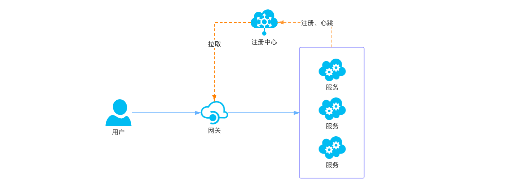
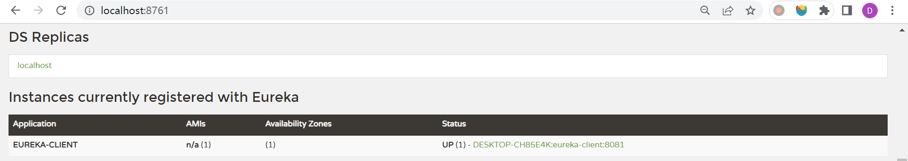
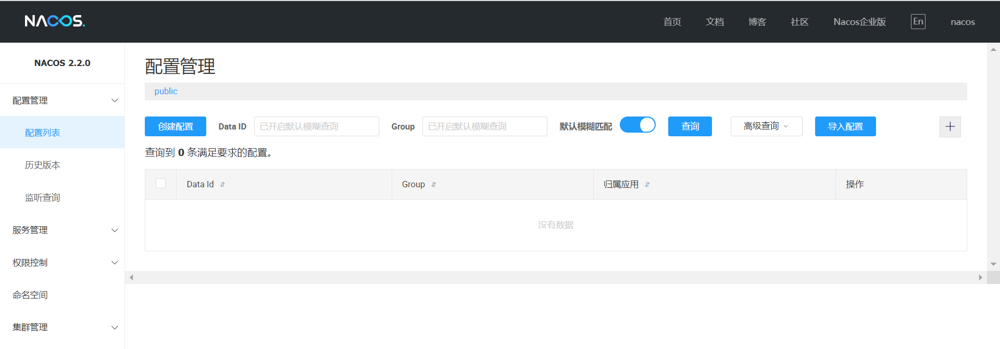
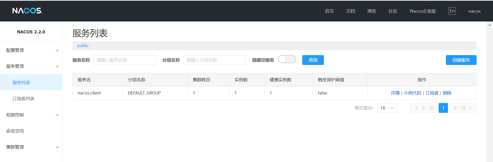

# WEEK034 - 实战 APISIX 服务注册和发现

在 [week030-apisix-notes](../week030-apisix-notes/README.md) 中，我们通过 APISIX 官方提供的入门示例学习了 APISIX 的基本概念，并使用 Admin API 和 Dashboard 两种方法创建路由。在创建路由时，我们必须明确地知道服务的 IP 和端口，这给运维人员带来了一定的负担，因为服务的重启或扩缩容都可能会导致服务的 IP 和端口发生变化，当服务数量非常多的时候，维护成本将急剧升高。

APISIX 集成了多种服务发现机制来解决这个问题，通过服务注册中心，APISIX 可以动态地获取服务的实例信息，这样我们就不用在路由中写死固定的 IP 和端口了。

## 服务发现

如下图所示，一个标准的服务发现流程大致包含了三大部分：



1. 服务启动时将自身的一些信息，比如服务名、IP、端口等信息上报到注册中心；各个服务与注册中心使用一定机制（例如心跳）通信，如果注册中心与服务长时间无法通信，就会注销该实例；当服务下线时，会删除注册中心的实例信息；
2. 网关会准实时地从注册中心获取服务实例信息；
3. 当用户通过网关请求服务时，网关从注册中心获取的实例列表中选择一个进行代理；

目前市面上流行着很多注册中心，比如 Eureka、Nacos、Consul 等，APISIX 内置了下面这些服务发现机制：

* [基于 Eureka 的服务发现](https://apisix.apache.org/zh/docs/apisix/discovery/)
* [基于 Nacos 的服务发现](https://apisix.apache.org/zh/docs/apisix/discovery/nacos/)
* [基于 Consul 的服务发现](https://apisix.apache.org/zh/docs/apisix/discovery/consul/)
* [基于 Consul KV 的服务发现](https://apisix.apache.org/zh/docs/apisix/discovery/consul_kv/)
* [基于 DNS 的服务发现](https://apisix.apache.org/zh/docs/apisix/discovery/dns/)
* [基于 APISIX-Seed 架构的控制面服务发现](https://apisix.apache.org/zh/docs/apisix/discovery/control-plane-service-discovery/)
* [基于 Kubernetes 的服务发现](https://apisix.apache.org/zh/docs/apisix/discovery/kubernetes/)

### 基于 Eureka 的服务发现

[Eureka](https://spring.io/projects/spring-cloud-netflix) 是 Netflix 开源的一款注册中心服务，它也被称为 Spring Cloud Netflix，是 Spring Cloud 全家桶中的核心成员。本节将演示如何让 APISIX 通过 Eureka 来实现服务发现，动态地获取下游服务信息。

我们可以直接运行官方的示例代码 [spring-cloud-samples/eureka](https://github.com/spring-cloud-samples/eureka) 来启动一个 Eureka Server：

```
$ git clone https://github.com/spring-cloud-samples/eureka.git
$ cd eureka && ./gradlew bootRun
```

或者也可以直接使用官方制作好的镜像：

```
$ docker run -d -p 8761:8761 springcloud/eureka
```

启动之后访问 http://localhost:8761/ 看看 Eureka Server 是否已正常运行，如果一切顺利，我们再准备一个简单的 Spring Boot 客户端程序，引入 `spring-cloud-starter-netflix-eureka-client` 依赖，再通过 `@EnableEurekaClient` 注解将服务信息注册到 Eureka Server：

```
@EnableEurekaClient
@SpringBootApplication
@RestController
public class EurekaApplication {

	public static void main(String[] args) {
		SpringApplication.run(EurekaApplication.class, args);
	}

	@RequestMapping("/")
	public String home() {
		return String.format("Hello, I'm eureka client.");
	}
}
```

在配置文件中设置服务名称和服务端口：

```
spring.application.name=eureka-client
server.port=8081
```

默认注册的 Eureka Server 地址是 `http://localhost:8761/eureka/`，可以通过下面的参数修改：

```
eureka.client.serviceUrl.defaultZone=http://localhost:8761/eureka/
```

默认情况下，Eureka Client 是将该服务所在的主机名注册到 Eureka Server，这在某些情况下可能会导致其他服务调不通该服务，我们可以通过下面的参数，让 Eureka Client 注册 IP 地址：

```
eureka.instance.prefer-ip-address=true
eureka.instance.ip-address=192.168.1.40
```

启动后，在 Eureka 页面的实例中可以看到我们注册的服务：



接下来，我们要让 APISIX 通过 Eureka Server 找到我们的服务。首先，在 APISIX 的配置文件 `config.yaml` 中添加如下内容：

```
discovery:
  eureka:
    host:
      - "http://192.168.1.40:8761"
    prefix: /eureka/
```

然后重启 APISIX，接着向 APISIX 中添加如下路由：

```
$ curl -X PUT http://127.0.0.1:9180/apisix/admin/routes/11 \
    -H 'X-API-KEY: edd1c9f034335f136f87ad84b625c8f1' -i -d '
{
    "methods": ["GET"],
    "uri": "/eureka",
    "plugins": {
        "proxy-rewrite" : {
            "regex_uri": ["/eureka", "/"]
        }
    },
    "upstream": {
        "type": "roundrobin",
        "discovery_type": "eureka",
		"service_name": "EUREKA-CLIENT"
    }
}'
```

之前创建路由时，我们在 `upstream` 中通过 `nodes` 参数表示上游服务器节点，这里我们不再需要写死服务器节点信息，而是通过 `"discovery_type": "eureka"` 和 `"service_name": "EUREKA-CLIENT"` 来让 APISIX 使用 `eureka` 服务发现机制，上游的服务名称为 `EUREKA-CLIENT`。

值得注意的是，虽然上面的 Eureka Client 的 `spring.application.name` 是小写，但是注册到 Eureka Server 的服务名称是大写，所以这里的 `service_name` 参数必须是大写。此外，这里我们还使用了 `proxy-rewrite` 插件，它相当于 Nginx 中的路径重写功能，当多个上游服务的接口地址相同时，通过路径重写可以将它们区分开来。

访问 APISIX 的 `/eureka` 地址验证一下：

```
$ curl http://127.0.0.1:9080/eureka
Hello, I'm eureka client.
```

我们成功通过 APISIX 访问到了我们的服务。

关于 APISIX 集成 Eureka 的更多信息，可以参考官方文档 [集成服务发现注册中心](https://apisix.apache.org/zh/docs/apisix/discovery/) 和官方博客 [API 网关 Apache APISIX 集成 Eureka 作为服务发现](https://www.apiseven.com/blog/apigateway-integration-eureka-service-discovery)。

### 基于 Nacos 的服务发现

[Nacos](https://nacos.io/zh-cn/index.html) 是阿里开源的一款集服务发现、配置管理和服务管理于一体的管理平台，APISIX 同样支持 Nacos 的服务发现机制。

首先，我们需要准备一个 Nacos Server，Nacos 官网提供了多种部署方式，可以 [通过源码或安装包安装](https://nacos.io/zh-cn/docs/v2/quickstart/quick-start.html)、[通过 Docker 安装](https://nacos.io/zh-cn/docs/v2/quickstart/quick-start-docker.html) 或 [通过 Kubernetes 安装](https://nacos.io/zh-cn/docs/v2/quickstart/quick-start-kubernetes.html)，我们这里直接使用 docker 命令启动一个本地模式的 Nacos Server：

```
$ docker run -e MODE=standalone -p 8848:8848 -p 9848:9848 -d nacos/nacos-server:v2.2.0
```

> 不知道为什么，有时候启动会报这样的错误：`com.alibaba.nacos.api.exception.runtime.NacosRuntimeException: errCode: 500, errMsg: load derby-schema.sql error`，多启动几次又可以了。

启动成功后，访问 http://localhost:8848/nacos/ 进入 Nacos 管理页面，默认用户名和密码为 `nacos/nacos`：




接下来，我们再准备一个简单的 Spring Boot 客户端程序，引入 `nacos-discovery-spring-boot-starter` 依赖，并通过它提供的 NameService 将服务信息注册到 Nacos Server：

```
@SpringBootApplication
@RestController
public class NacosApplication implements CommandLineRunner {

	@Value("${spring.application.name}")
    private String applicationName;

    @Value("${server.port}")
    private Integer serverPort;
	
	@NacosInjected
    private NamingService namingService;
	
	public static void main(String[] args) {
		SpringApplication.run(NacosApplication.class, args);
	}

	@Override
    public void run(String... args) throws Exception {
        namingService.registerInstance(applicationName, "192.168.1.40", serverPort);
    }

	@RequestMapping("/")
	public String home() {
		return String.format("Hello, I'm nacos client.");
	}
}
```

在配置文件中设置服务名称和服务端口：

```
spring.application.name=nacos-client
server.port=8082
```

以及 Nacos Server 的地址：

```
nacos.discovery.server-addr=127.0.0.1:8848
```

启动后，在 Nacos 的服务管理页面中就可以看到我们注册的服务了：



接下来，我们要让 APISIX 通过 Nacos Server 找到我们的服务。首先，在 APISIX 的配置文件 `config.yaml` 中添加如下内容：

```
discovery:
  nacos:
    host:
      - "http://192.168.1.40:8848"
    prefix: "/nacos/v1/"
```

然后重启 APISIX，接着向 APISIX 中添加如下路由：

```
$ curl -X PUT http://127.0.0.1:9180/apisix/admin/routes/22 \
    -H 'X-API-KEY: edd1c9f034335f136f87ad84b625c8f1' -i -d '
{
    "methods": ["GET"],
    "uri": "/nacos",
    "plugins": {
        "proxy-rewrite" : {
            "regex_uri": ["/nacos", "/"]
        }
    },
    "upstream": {
        "type": "roundrobin",
        "discovery_type": "nacos",
		"service_name": "nacos-client"
    }
}'
```

和上面 Eureka 服务发现的例子一样，我们也使用 `proxy-rewrite` 插件实现了路径重写功能，访问 APISIX 的 `/nacos` 地址验证一下：

```
$ curl http://127.0.0.1:9080/nacos
Hello, I'm nacos client.
```

我们成功通过 APISIX 访问到了我们的服务。

关于 APISIX 集成 Nacos 的更多信息，可以参考官方文档 [基于 Nacos 的服务发现](https://apisix.apache.org/zh/docs/apisix/discovery/nacos/) 和官方博客 [Nacos 在 API 网关中的服务发现实践](https://www.apiseven.com/blog/nacos-api-gateway)。

### 基于 Consul 的服务发现

https://apisix.apache.org/zh/docs/apisix/discovery/consul/

### 基于 DNS 的服务发现

https://apisix.apache.org/zh/docs/apisix/discovery/dns/

### 基于 APISIX-Seed 架构的控制面服务发现

https://apisix.apache.org/zh/docs/apisix/discovery/control-plane-service-discovery/

### 基于 Kubernetes 的服务发现

https://apisix.apache.org/zh/docs/apisix/discovery/kubernetes/

## 实现自定义服务发现

https://apisix.apache.org/zh/docs/apisix/discovery/

## 服务注册

## 参考

* [集成服务发现注册中心](https://apisix.apache.org/zh/docs/apisix/discovery/)
* [API 网关 Apache APISIX 集成 Eureka 作为服务发现](https://www.apiseven.com/blog/apigateway-integration-eureka-service-discovery)
* [API 网关 Apache APISIX 携手 CoreDNS 打开服务发现新大门](https://www.apiseven.com/blog/apisix-uses-coredns-enable-service-discovery)
* [Nacos 在 API 网关中的服务发现实践](https://www.apiseven.com/blog/nacos-api-gateway)
* [借助 APISIX Ingress，实现与注册中心的无缝集成](https://www.apiseven.com/blog/apisix-ingress-integrates-with-service-discovery)
* [APISIX Blog](https://apisix.apache.org/zh/blog/)
* [API7.ai Blog](https://www.apiseven.com/blog)
* [SpringBoot使用Nacos进行服务注册发现与配置管理](https://cloud.tencent.com/developer/article/1650073)
