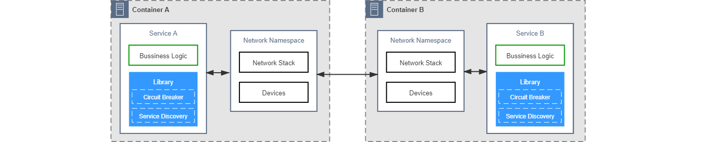
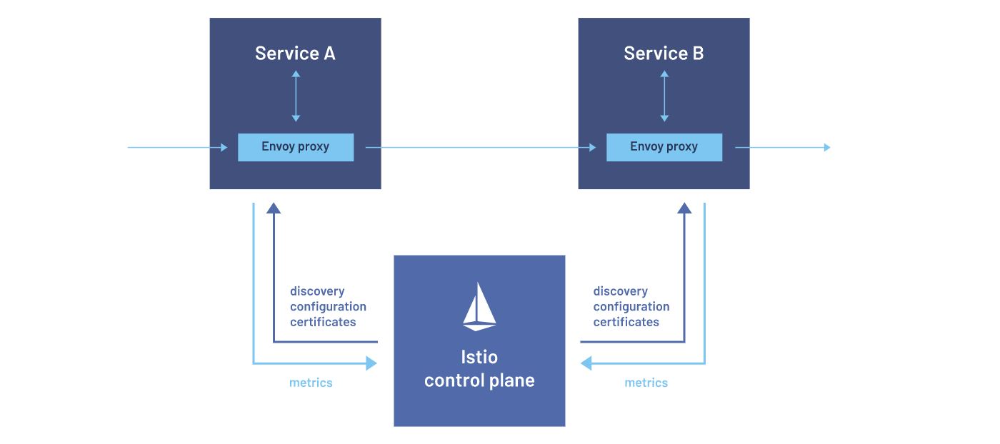
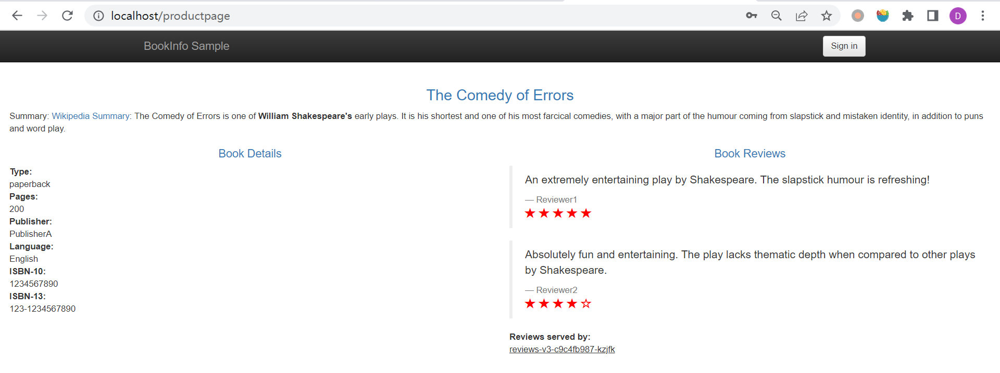

# WEEK035 - 使用 Istio 和 Envoy 打造 Service Mesh 微服务架构

[周志明](https://github.com/fenixsoft) 老师在他的 [《凤凰架构》](http://icyfenix.cn/immutable-infrastructure/mesh/communication.html) 中将分布式服务通信的演化历史分成五个阶段：

* 第一阶段：将通信的非功能性需求视作业务需求的一部分，通信的可靠性由程序员来保障


这个阶段是分布式系统发展最早期时的技术策略，这些系统一开始仅仅是通过 RPC 技术去访问远程服务，当遇到通信问题时，就在业务代码中引入相应的处理逻辑，比如服务发现、网络重试或降级等。这些通信的非功能性逻辑和业务逻辑耦合在一起，让系统变得越来越复杂。

* 第二阶段：将代码中的通信功能抽离重构成公共组件库，通信的可靠性由专业的平台程序员来保障



这个阶段人们逐渐意识到通信功能应该从业务逻辑中抽离出来，于是形成了一些公共组件库，比如 [Finagle](https://github.com/twitter/finagle)、[Spring Cloud](https://spring.io/projects/spring-cloud) 等。不过这些组件库大多是和语言绑定的，比如 Spring Cloud 技术栈只能用在 Java 项目中，遇到其他语言的项目就无能为力了。

* 第三阶段：将负责通信的公共组件库分离到进程之外，程序间通过网络代理来交互，通信的可靠性由专门的网络代理提供商来保障


为了将通信功能做成语言无关的，这个阶段发展出了专门负责可靠通信的网络代理，比如 [Netflix Prana](https://github.com/Netflix/Prana)。业务系统和这类代理之间通过回环设备或 Unix 套接字进行通信，网络代理对业务系统的网络流量进行拦截，从而在代理上完成流控、重试或降级等几乎所有的分布式通信功能。

这种网络代理后来演化出了两种形态：一种是微服务网关，它位于整个分布式系统的入口，同时代理整个系统中所有服务的网络流量；另一种是边车代理，它和某个进程共享一个网络命名空间，专门针对性地代理该服务的网络流量。

* 第四阶段：将网络代理以边车的形式注入到应用容器，自动劫持应用的网络流量，通信的可靠性由专门的通信基础设施来保障


在使用上一阶段的网络代理时，我们必须在应用程序中手工指定网络代理的地址才能生效，而边车代理有一个很大的优势，它通过 `iptables` 等技术自动劫持代理进程的网络流量，所以它对应用是完全透明的，无需对应用程序做任何改动就可以增强应用的通信功能。目前边车代理的代表性产品有 [Linkerd](https://linkerd.io/)、[Envoy](https://www.envoyproxy.io/)、[MOSN](https://mosn.io/) 等。不过，边车代理也有一个很大的缺点，随着系统中代理服务的增多，对边车代理的维护和管理工作就成了运维最头疼的问题，于是服务网格应运而生。

* 第五阶段：将边车代理统一管控起来实现安全、可控、可观测的通信，将数据平面与控制平面分离开来，实现通用、透明的通信，这项工作就由专门的服务网格框架来保障

服务网格（*Service Mesh*）一词是 Buoyant 公司的 CEO William Morgan 于 2017 年在他的一篇博客 [《What's a service mesh? And why do I need one?》](https://linkerd.io/2017/04/25/whats-a-service-mesh-and-why-do-i-need-one/) 中首次提出的，他是世界上第一款服务网格产品 Linkerd 的创始人之一，在博客中，William Morgan 对服务网格做了如下定义：

> 服务网格是一种用于管控服务间通信的的基础设施，它负责为现代云原生应用程序在复杂服务拓扑中可靠地传递请求。在实践中，服务网格通常以轻量级网络代理阵列的形式实现，这些代理与应用程序部署在一起，对应用程序来说无需感知代理的存在。

服务网格将上一阶段的边车代理联合起来形成如下所示的网格状结构：


在服务网格中，主要由数据平面与控制平面组成。数据平面是所有边车代理的集合，负责拦截所有服务流入和流出的流量，并配置控制平面对流量进行管理；控制平面对数据平面进行管理，完成配置分发、服务发现、授权鉴权等功能。如上图所示，整个系统中的通信包括两个部分：实线表示数据平面之间的通信，虚线表示控制平面和数据平面之间的通信。

服务网格的概念一经提出，其价值迅速被业界所认可，业界几乎所有的云原生玩家都积极参与了进来：

* 2016 年，[Buoyant 公司](https://buoyant.io/) 推出 [Linkerd](https://linkerd.io/)，同年，[Lyft 公司](https://www.lyft.com/) 推出 [Envoy](https://www.envoyproxy.io/)
* 2017 年，Linkerd 加入 CNCF，同年，Google、IBM 和 Lyft 共同发布 [Istio](https://istio.io/)，为了和 Istio 展开竞争，Buoyant 公司将自家的 Conduit 产品合并到 Linkerd 中发布了 Linkerd 2
* 2018 年后，Google、亚马逊、微软分别推出各自的公有云版本 Service Mesh 产品，国内的阿里巴巴也推出了基于 Istio 的修改版 [SOFAMesh](https://www.sofastack.tech/projects/sofa-mesh/overview/)（目前已经废弃），并开源了自己研发的 [MOSN](https://mosn.io/) 代理

随着各巨头的参与，Istio 逐渐超过了 Linkerd 的地位，几乎成了原云生环境下服务网格中控制平面的事实标准，而 Envoy 凭借其卓越的性能和强大的动态配置功能，成为了服务网格中数据平面的不二选择，下图是使用 Istio 作为服务网格方案后的典型架构：



Istio 服务网格的数据平面由 Envoy 代理实现，在 [week007-envoy-quickstart](../week007-envoy-quickstart/README.md) 中我们学习过 Envoy 的基本用法，这是一个用 C++ 开发的高性能代理，用于协调和控制微服务之间的网络流量，并为这些服务透明地提供了许多 Envoy 内置的功能特性：

* 动态服务发现
* 负载均衡
* TLS 终端
* HTTP/2 与 gRPC 代理
* 熔断器
* 健康检查
* 基于百分比流量分割的分阶段发布
* 故障注入
* 丰富的指标

不仅如此，这些服务同时还具备了 Istio 所提供的功能特性：

* 流量控制特性：通过丰富的 HTTP、gRPC、WebSocket 和 TCP 流量路由规则来执行细粒度的流量控制；
* 网络弹性特性：重试设置、故障转移、熔断器和故障注入；
* 安全性和身份认证特性：执行安全性策略，并强制实行通过配置 API 定义的访问控制和速率限制；
* 基于 WebAssembly 的可插拔扩展模型，允许通过自定义策略执行和生成网格流量的遥测。

Istio 服务网格的控制平面由 [Istiod](https://istio.io/latest/zh/blog/2020/istiod/) 实现，它提供了诸如服务发现（Pilot），配置（Galley），证书生成（Citadel）和可扩展性（Mixer）等功能；它通过 [Envoy API](https://www.envoyproxy.io/docs/envoy/latest/api/api) 实现了对数据平面的管理，所以 Istio 的数据平面并不仅限于 Envoy，其他符合 Envoy API 规范的代理都可以作为 Istio 的数据平面。

## 快速开始

这篇笔记将以 Istio 的官方示例来学习如何使用 Istio 和 Envoy 打造一个基于服务网格的微服务架构。

### 安装 Istio

首先从 Istio 的 [Release 页面](https://github.com/istio/istio/releases) 找到最新版本的安装包并下载和解压：

```
$ curl -LO https://github.com/istio/istio/releases/download/1.17.1/istio-1.17.1-linux-amd64.tar.gz
$ tar zxvf istio-1.17.1-linux-amd64.tar.gz
```

解压后的目录中包含几个文件和目录：

```
$ tree -L 1 istio-1.17.1
istio-1.17.1
├── LICENSE
├── README.md
├── bin
├── manifest.yaml
├── manifests
├── samples
└── tools

4 directories, 3 files
```

其中，`bin` 目录下包含了 `istioctl` 可执行文件，我们可以将这个目录添加到 `PATH` 环境变量，配置之后，就可以使用 `istioctl install` 命令安装 Istio 了：

```
$ istioctl install --set profile=demo
This will install the Istio 1.17.1 demo profile with ["Istio core" "Istiod" "Ingress gateways" "Egress gateways"] components into the cluster. Proceed? (y/N) y
✔ Istio core installed
✔ Istiod installed
✔ Ingress gateways installed
✔ Egress gateways installed
✔ Installation complete
```

Istio 内置了几种 [不同的安装配置](https://istio.io/latest/zh/docs/setup/additional-setup/config-profiles/)：

```
$ istioctl profile list
Istio configuration profiles:
    ambient
    default
    demo
    empty
    external
    minimal
    openshift
    preview
    remote
```

所有的配置都位于 `manifests/profiles` 目录下，你也可以 [定制自己的配置](https://istio.io/latest/zh/docs/setup/additional-setup/customize-installation/)。这里为了演示和体验，我们使用了 `demo` 配置，它相对于默认的 `default` 配置来说，开启了一些用于演示的特性，日志级别也比较高，性能会有一定影响，所以不推荐在生产环境使用。这些配置通过统一的 [IstioOperator API](https://istio.io/latest/zh/docs/reference/config/istio.operator.v1alpha1/) 来定义，我们可以通过 `istioctl profile dump` 查看配置详情：

```
$ istioctl profile dump demo
```

或者通过 `istioctl profile diff` 对比两个配置之间的差异：

```
$ istioctl profile diff default demo
```

执行 `istioctl` 命令时会创建了一个名为 `installed-state` 的自定义资源，内容就是上面所看到的 `demo` 配置：

```
$ kubectl get IstioOperator installed-state -n istio-system -o yaml
```

从安装的输出结果可以看到，`demo` 配置安装内容包括下面四个部分：

* Istio core
* Istiod
* Ingress gateways
* Egress gateways

可以使用 `kubectl get deployments` 来看看 Istio 具体安装了哪些服务：

```
$ kubectl get deployments -n istio-system
NAME                   READY   UP-TO-DATE   AVAILABLE   AGE
istio-egressgateway    1/1     1            1           20m
istio-ingressgateway   1/1     1            1           20m
istiod                 1/1     1            1           21m
```

除此之外，`istioctl` 命令还生成了很多其他的 Kubernetes 资源，我们可以使用 `istioctl manifest generate` 生成最原始的 Kubernetes YAML 定义：

```
$ istioctl manifest generate --set profile=demo > demo.yaml
```

生成上面的 YAML 后，我们甚至可以通过执行 `kubectl apply -f` 来安装 Istio，不过这种安装方式有很多 [需要注意的地方](https://istio.io/latest/zh/docs/setup/install/istioctl/#generate-a-manifest-before-installation)，官方并不推荐这种做法，但这也不失为一种深入了解 Istio 原理的好方法。

除了 [使用 Istioctl 安装](https://istio.io/latest/zh/docs/setup/install/istioctl/)，官方还提供了很多 [其他的安装方式](https://istio.io/latest/zh/docs/setup/install/)，比如 [使用 Helm 安装](https://istio.io/latest/zh/docs/setup/install/helm/)，[虚拟机安装](https://istio.io/latest/zh/docs/setup/install/virtual-machine/) 和 [使用 Istio Operator 安装](https://istio.io/latest/zh/docs/setup/install/operator/) 等，[各个云平台](https://istio.io/latest/zh/docs/setup/platform-setup/) 也对 Istio 提供了支持。

### 一个简单的例子

为了充分发挥 Istio 的所有特性，网格中的每个应用服务都必须有一个边车代理，这个边车代理可以拦截应用服务的所有出入流量，这样我们就可以利用 Istio 控制平面为应用提供服务发现、限流、可观测性等功能了。

[边车代理的注入](https://istio.io/latest/zh/docs/setup/additional-setup/sidecar-injection/) 一般有两种方法：自动注入和手动注入。上面在解压 Istio 安装包时，可以看到有一个 `samples` 目录，这个目录里包含了一些官方的示例程序，用于体验 Istio 的不同功能特性，其中 `samples/sleep` 目录下是一个简单的 sleep 应用，这一节就使用这个简单的例子来演示如何在我们的应用服务中注入一个边车代理。

首先，执行下面的命令部署 sleep 应用：

```
$ kubectl apply -f samples/sleep/sleep.yaml
serviceaccount/sleep created
service/sleep created
deployment.apps/sleep created
```

默认情况下，一个 Pod 里只有一个容器（从下面的 `READY` 字段是 `1/1` 可以看出来）：

```
$ kubectl get pods
NAME                     READY   STATUS    RESTARTS   AGE
sleep-78ff5975c6-hw2lv   1/1     Running   0          23s
```

接下来，我们给 `default` 命名空间打上 `istio-injection=enabled` 标签：

```
$ kubectl label namespace default istio-injection=enabled
namespace/default labeled
```

这个标签可以让 Istio 部署应用时自动注入 Envoy 边车代理，这个过程是在 Pod 创建时自动完成的，Istio 使用了 Kubernetes 的 [准入控制器（Admission Controllers）](https://kubernetes.io/zh-cn/docs/reference/access-authn-authz/admission-controllers/)，通过 [MutatingAdmissionWebhook](https://kubernetes.io/zh-cn/docs/reference/access-authn-authz/admission-controllers/#mutatingadmissionwebhook) 可以对创建的 Pod 进行修改，从而将边车代理容器注入到原始的 Pod 定义中。

我们将刚刚的 Pod 删除，这样 Deployment 会尝试创建一个新的 Pod，从而触发自动注入的过程：

```
$ kubectl delete pod sleep-78ff5975c6-hw2lv
pod "sleep-78ff5975c6-hw2lv" deleted
```

再次查看 Pod 列表，`READY` 字段已经变成了 `2/2`，说明每个 Pod 里变成了两个容器：

```
$ kubectl get pods
NAME                     READY   STATUS    RESTARTS   AGE
sleep-78ff5975c6-v6qg4   2/2     Running   0          12s
```

也可以使用 `kubectl describe` 查看 Pod 详情：

```
$ kubectl describe pod sleep-78ff5975c6-v6qg4
Name:             sleep-78ff5975c6-v6qg4
Namespace:        default
Priority:         0
Service Account:  sleep
Init Containers:
  istio-init:
    Container ID:  docker://c724b0c29ffd828e497cfdff45706061855b1b8c93073f9f037acc112367bceb
    Image:         docker.io/istio/proxyv2:1.17.1
Containers:
  sleep:
    Container ID:  docker://44f35a4934841c5618eb68fb5615d75ea5dd9c5dd826cb6a99a6ded6efaa6707
    Image:         curlimages/curl
  istio-proxy:
    Container ID:  docker://10a9ff35f45c7f07c1fcf88d4f8daa76282d09ad96912e026e59a4d0a99f02cf
    Image:         docker.io/istio/proxyv2:1.17.1

Events:
  Type     Reason     Age    From               Message
  ----     ------     ----   ----               -------
  Normal   Created    4m22s  kubelet            Created container istio-init
  Normal   Started    4m21s  kubelet            Started container istio-init
  Normal   Created    4m20s  kubelet            Created container sleep
  Normal   Started    4m20s  kubelet            Started container sleep
  Normal   Created    4m20s  kubelet            Created container istio-proxy
  Normal   Started    4m20s  kubelet            Started container istio-proxy
```

可以看到除了原始的 `sleep` 容器，多了一个 `istio-proxy` 容器，这就是边车代理，另外还多了一个 `istio-init` 初始化容器，它使用 `iptables` 将网络流量自动转发到边车代理，对应用程序完全透明。

另一种方法是手工注入边车代理，先将 `default` 命名空间的 `istio-injection` 标签移除：

```
$ kubectl label namespace default istio-injection-
namespace/default unlabeled
```

同时删除 `sleep` 应用：

```
$ kubectl delete -f samples/sleep/sleep.yaml
serviceaccount "sleep" deleted
service "sleep" deleted
deployment.apps "sleep" deleted
```

然后再重新部署 `sleep` 应用，并使用 `istioctl kube-inject` 命令手工注入边车代理：

```
$ istioctl kube-inject -f samples/sleep/sleep.yaml | kubectl apply -f -
serviceaccount/sleep created
service/sleep created
deployment.apps/sleep created
```

默认情况下，Istio 使用集群中的默认配置模版来生成边车配置，这个默认配置模版保存在名为 `istio-sidecar-injector` 的 ConfigMap 中：

```
# 配置模版
$ kubectl -n istio-system get configmap istio-sidecar-injector -o=jsonpath='{.data.config}'

# 配置值
$ kubectl -n istio-system get configmap istio-sidecar-injector -o=jsonpath='{.data.values}'
```

除了官方提供的默认模版，还可以通过在 Pod 中添加一个 `istio-proxy` 容器来自定义注入内容，或者通过 `inject.istio.io/templates` 注解来设置自定义模版，更多内容可以 [参考官方文档](https://istio.io/latest/zh/docs/setup/additional-setup/sidecar-injection/#customizing-injection)。

### 部署 Bookinfo 示例应用

这一节我们来部署一个更复杂的例子，在 `samples/bookinfo` 目录下是名为 Bookinfo 的示例应用，我们就使用这个应用来体验 Istio 的功能。为了方便起见，我们还是给 `default` 命名空间打上 `istio-injection=enabled` 标签开启自动注入功能，然后，执行下面的命令部署 Bookinfo 示例应用：

```
$ kubectl apply -f samples/bookinfo/platform/kube/bookinfo.yaml
service/details created
serviceaccount/bookinfo-details created
deployment.apps/details-v1 created
service/ratings created
serviceaccount/bookinfo-ratings created
deployment.apps/ratings-v1 created
service/reviews created
serviceaccount/bookinfo-reviews created
deployment.apps/reviews-v1 created
deployment.apps/reviews-v2 created
deployment.apps/reviews-v3 created
service/productpage created
serviceaccount/bookinfo-productpage created
deployment.apps/productpage-v1 created
```

这是一个简单的在线书店应用，包含了四个微服务，这些微服务由不同的语言编写：

* `productpage` - 产品页面，它会调用 `details` 和 `reviews` 两个服务；
* `details` - 书籍详情服务；
* `reviews` - 书籍评论服务，它有三个不同的版本，v1 版本不包含评价信息，v2 和 v3 版本会调用 `ratings` 服务获取书籍评价，不过 v2 显示的是黑色星星，v3 显示的是红色星星；
* `ratings` - 书籍评价服务；

部署时 Istio 会对每个微服务自动注入 Envoy 边车代理，我们可以通过 `kubectl get pods` 命令进行确认，确保每个 Pod 里都有两个容器在运行，其中一个是真实服务，另一个是代理服务：

```
$ kubectl get pods
NAME                             READY   STATUS    RESTARTS   AGE
details-v1-5ffd6b64f7-r6pr5      2/2     Running   0          14m
productpage-v1-979d4d9fc-gdmzh   2/2     Running   0          14m
ratings-v1-5f9699cfdf-trqj6      2/2     Running   0          14m
reviews-v1-569db879f5-gd9st      2/2     Running   0          14m
reviews-v2-65c4dc6fdc-5lph4      2/2     Running   0          14m
reviews-v3-c9c4fb987-kzjfk       2/2     Running   0          14m
```

部署之后整个系统的架构图如下所示：


这个时候从外部还不能访问该服务，只能在集群内访问，进入 `ratings` 服务所在的 Pod，验证 `productpage` 服务能否正常访问：

```
$ kubectl exec -it ratings-v1-5f9699cfdf-trqj6 -- sh
$ curl -s productpage:9080/productpage | grep "<title>"
    <title>Simple Bookstore App</title>
```

为了能从外部访问该服务，我们需要创建一个入站网关：

```
$ kubectl apply -f samples/bookinfo/networking/bookinfo-gateway.yaml
gateway.networking.istio.io/bookinfo-gateway created
virtualservice.networking.istio.io/bookinfo created
```

这个 YAML 中包含两个部分，第一部分定义了名为 `bookinfo-gateway` 的 [网关（Gateway）](https://istio.io/latest/zh/docs/concepts/traffic-management/#gateways)：

```
apiVersion: networking.istio.io/v1alpha3
kind: Gateway
metadata:
  name: bookinfo-gateway
spec:
  selector:
    istio: ingressgateway # use istio default controller
  servers:
  - port:
      number: 80
      name: http
      protocol: HTTP
    hosts:
    - "*"
```

第二部分定义了名为 `bookinfo` 的 [虚拟服务（VirtualService）](https://istio.io/latest/zh/docs/concepts/traffic-management/#virtual-services)，并和网关关联起来：

```
apiVersion: networking.istio.io/v1alpha3
kind: VirtualService
metadata:
  name: bookinfo
spec:
  hosts:
  - "*"
  gateways:
  - bookinfo-gateway
  http:
  - match:
    - uri:
        exact: /productpage
    - uri:
        prefix: /static
    - uri:
        exact: /login
    - uri:
        exact: /logout
    - uri:
        prefix: /api/v1/products
    route:
    - destination:
        host: productpage
        port:
          number: 9080
```

有了这个网关后，我们就可以在浏览器中输入 http://localhost/productpage 访问我们的在线书店了：



因为这里我们部署了三个版本的 `reviews` 服务，所以多刷新几次页面，可以看到页面上会随机展示 `reviews` 服务的不同版本的效果（可能不显示星星，也可能显示红色或黑色的星星）。

### 配置请求路径

https://istio.io/latest/zh/docs/tasks/traffic-management/request-routing/

https://istio.io/latest/zh/docs/setup/getting-started/

https://istio.io/latest/zh/docs/examples/bookinfo/

### 卸载

如果要卸载 Istio，可以执行 `istioctl uninstall` 命令：

```
$ istioctl uninstall -y --purge
```

## 参考

* [服务网格 | 凤凰架构](http://icyfenix.cn/immutable-infrastructure/mesh/)
* [透明通信的涅槃 | 凤凰架构](http://icyfenix.cn/immutable-infrastructure/mesh/communication.html)
* [服务网格与生态 | 凤凰架构](http://icyfenix.cn/immutable-infrastructure/mesh/ecosystems.html)
* [Pattern: Service Mesh](https://philcalcado.com/2017/08/03/pattern_service_mesh.html)
* [什么是Service Mesh（服务网格）？](https://jimmysong.io/blog/what-is-a-service-mesh/)
* [服务网格新生代-Istio](https://skyao.io/talk/201709-istio-introduction/)
* [Istio 服务网格](https://istio.io/latest/zh/about/service-mesh/)
* [服务网格终极指南第二版——下一代微服务开发](https://cloudnative.to/blog/service-mesh-ultimate-guide-e2/)
* [Istio Handbook——Istio 服务网格进阶实战](http://www.zhaowenyu.com/istio-doc/)
* [谈谈微服务架构中的基础设施：Service Mesh与Istio](https://www.zhaohuabing.com/2018/03/29/what-is-service-mesh-and-istio/)
* [Jimmy Song 的原创博客](https://jimmysong.io/blog/)
* [云原生社区博客](https://cloudnative.to/blog/)

## 更多

### 其他官方学习文档

* [使用 Kubernetes 和 Istio 学习微服务](https://istio.io/latest/zh/docs/examples/microservices-istio/)
* Istio 任务 - 使用 Istio 实现单个特定的目标行为
    * [流量管理](https://istio.io/latest/zh/docs/tasks/traffic-management/)
    * [安全](https://istio.io/latest/zh/docs/tasks/security/)
    * [策略执行](https://istio.io/latest/zh/docs/tasks/policy-enforcement/)
    * [可观察性](https://istio.io/latest/zh/docs/tasks/observability/)
    * [可扩展性](https://istio.io/latest/zh/docs/tasks/extensibility/)

### Kubernetes Gateway API

在最早的版本中，Istio 使用 Kubernetes 提供的 [Ingress API](https://kubernetes.io/docs/concepts/services-networking/ingress/) 来进行流量管理，但是这个 API 在管理大型应用系统或非 HTTP 协议服务时存在一定的缺点和限制，Istio 在 2018 年 [推出了新的流量管理 API v1alpha3](https://istio.io/latest/zh/blog/2018/v1alpha3-routing/)，在新的 API 中定义了下面这些资源：

* Gateway
* VirtualService
* DestinationRule
* ServiceEntry

关于这几个概念的意义，可以通过 Istio 的 [官方文档](https://istio.io/latest/zh/docs/concepts/traffic-management/) 来学习。

2022 年 7 月，[Kubernetes 发布了 Gateway API 的 Beta 版本](https://kubernetes.io/blog/2022/07/13/gateway-api-graduates-to-beta/)，Istio 立即宣布了对 [Kubernetes Gateway API](https://gateway-api.sigs.k8s.io/guides/) 的支持，Istio API 也跟着升级到了 Beta 版本，并表示 Gateway API 将作为未来所有 Istio 流量管理的默认 API。

目前，用户可以选择 Kubernetes Ingress、Istio classic 和 Gateway API 三种方式来管理网格中的流量，相关内容可以参考 [Kubernetes Ingress](https://istio.io/latest/zh/docs/tasks/traffic-management/ingress/ingress-control/)、[Istio Gateway](https://istio.io/latest/zh/docs/tasks/traffic-management/ingress/ingress-control/) 和 [Kubernetes Gateway API](https://istio.io/latest/zh/docs/tasks/traffic-management/ingress/gateway-api/)。
