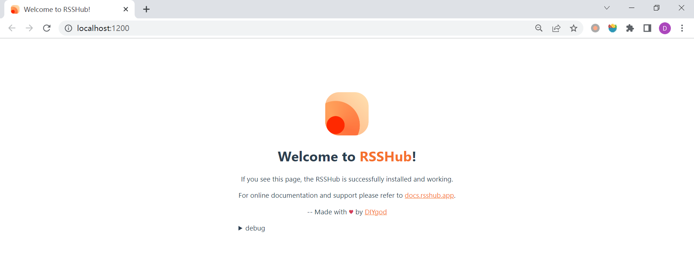

# WEEK036 - 使用 RSSHub 为任意网址生成订阅源

最近在学习 [APISIX](https://apisix.apache.org/zh/) 时，发现它的 [官方博客](https://apisix.apache.org/zh/blog/) 有不少的干货内容，于是想着能在我的阅读器里订阅这个博客的更新，不过找了半天都没有找到这个博客的订阅入口，后来在博客的页面代码里找到了 rss.xml 和 atom.xml 两个订阅链接，不过打开一看全都是 `404 Page Not Found`。

其实遇到这种情况，也有不少的解决方法，有很多网站提供了 RSS 生成的功能，比如 [RSS.app](https://rss.app/)、[FetchRSS](https://fetchrss.com/) 或 [feed43](http://feed43.com/) 等都提供了免费的 RSS 源转换功能，不过这些工具要么使用起来不太好用，要么访问速度巨慢，要么就是有各种各样的限制。于是便想实现一个自己的 RSS 生成服务，正好前几天看到了一个叫做 [RSSHub](https://docs.rsshub.app/) 的项目，这是一个开源、简单易用、易于扩展的 RSS 生成器，口号是 **万物皆可 RSS**，可以给任何奇奇怪怪的内容生成 RSS 订阅源，而且看社区也挺活跃，于是就利用周末时间折腾一下，使用 RSSHub 搭建了一个自己的 RSS 生成服务。

## 快速开始

RSSHub 和那些在线的 RSS 生成服务不一样，它是通过编写扩展的方式来添加新的 RSS 订阅源。不过在编写自己的扩展之前，可以先到官网上搜索一下，看看有没有其他人已经写过了，官网上目前已经适配了数百家网站的上千项内容。由于我要订阅的 APSIX 博客比较小众，目前还没有人写过，所以就只能自己动手了。

RSSHub 是基于 Node.js 实现的，所以先确保机器上已经安装了 Node.js 运行环境：

```
$ node -v
v16.14.2
```

以及包管理器 Npm 或 Yarn，我这里使用的是 Npm：

```
$ npm -v
8.5.0
```

然后，下载 RSSHub 的源码：

```
$ git clone https://github.com/DIYgod/RSSHub.git
```

进入 RSSHub 的根目录，运行以下命令安装依赖：

```
$ cd RSSHub
$ npm install
```

依赖安装成功后，运行以下命令在本地启动 RSSHub：

```
$ npm run dev
```

启动成功后，在浏览器中打开 http://localhost:1200 就可以看到 RSSHub 的首页了：



## 新建路由

此时 RSSHub 内置的上千个订阅源，都可以在本地访问，比如通过 `/bilibili/ranking/0/3/1` 这个地址可以订阅 B 站三天内的排行榜。这个订阅源的格式一般分为三个部分：

```
/命名空间/路由/参数
```

### 新建命名空间

命名空间应该和 RSS 源网站的二级域名相同，所以 B 站的命名空间为 `bilibili`，而我们要新建的 APISIX 博客地址为 `apisix.apache.org/zh/blog`，所以命名空间应该为 `apache`。

每个命名空间对应 `lib/v2` 目录下的一个子文件夹，所以我们在这个目录下创建一个 `apache` 子文件夹：

```
$ mkdir lib/v2/apache
```

### 注册路由

第二步，我们需要在命名空间子文件夹下按照 RSSHub 的 [路由规范](https://docs.rsshub.app/joinus/script-standard.html#v2-lu-you-gui-fan) 来组织文件，一个典型的文件夹结构如下：

```
├───lib/v2
│   ├───furstar
│       ├─── templates
│           ├─── description.art
│       ├─── router.js
│       ├─── maintainer.js
│       ├─── radar.js
│       └─── someOtherJs.js
```

其中，每个文件的作用如下：

* `router.js` - 注册路由
* `maintainer.js` - 提供路由维护者信息
* `radar.js` - 为每个路由提供对应 [RSSHub Radar](https://github.com/DIYgod/RSSHub-Radar) 规则
* `someOtherJs.js` - 一些其他的代码文件，一般用于实现路由规则
* `templates` - 该目录下是以 `.art` 结尾的模版文件，它使用 [art-template](https://aui.github.io/art-template/) 进行排版，用于渲染自定义 HTML 内容

#### 编写 `router.js` 文件

其中最重要的一个文件是 `router.js`，它用于注册路由信息，我们创建该文件，内容如下：

```
module.exports = (router) => {
    router.get('/apisix/blog', require('./apisix/blog'));
};
```

RSSHub 使用 [@koa/router](https://github.com/koajs/router) 来定义路由，在上面的代码中，我们通过 `router.get()` 定义了一个 HTTP GET 的路由，第一个参数是路由路径，它需要符合 [path-to-regexp](https://github.com/pillarjs/path-to-regexp) 语法，第二个参数指定由哪个文件来实现路由规则。

在路由路径中，我们还可以使用参数，比如上面 bilibili 的路由如下：

```
router.get('/ranking/:rid?/:day?/:arc_type?/:disableEmbed?', require('./ranking'));
```

其中 `:rid`、`:days`、`:arc_type` 和 `:disableEmbed` 都是路由的参数，每个参数后面的 `?` 表示这是一个可选参数。路由参数可以从 `ctx.params` 对象中获取。

### 编写路由规则

## 部署

## 参考

* [开始之前 | RSSHub](https://docs.rsshub.app/joinus/new-rss/before-start.html)
* [制作自己的 RSSHub 路由 | RSSHub](https://docs.rsshub.app/joinus/new-rss/start-code.html)
* [我有特别的 RSS 使用技巧 - DIYgod](https://diygod.me/ohmyrss)
