# WEEK037 - 使用 Google Colab 体验 AI 绘画

[AIGC](https://wiki.mbalib.com/wiki/AIGC) 的全称为 AI Generated Content，是指利用人工智能技术来生成内容，被认为是继 PGC（Professionally Generated Content，专业生成内容）和 UGC（User Generated Content，用户生成内容）之后的一种新型内容创作方式。目前，这种创作方式一般可分为两大派别：一个是以 [OpenAI](https://openai.com/) 的 [ChatGPT](https://chat.openai.com/) 和 [GPT-4](https://openai.com/product/gpt-4)、Facebook 的 [LLaMA](https://github.com/facebookresearch/llama)、斯坦福的 [Alpaca](https://github.com/tatsu-lab/stanford_alpaca) 等 **大语言模型** 技术为代表的文本生成派，另一个是以 [Stability AI](https://stability.ai/) 的 [Stable Diffusion](https://github.com/CompVis/stable-diffusion)、[Midjourney](https://www.midjourney.com/home/)、OpenAI 的 [DALL·E 2](https://openai.com/product/dall-e-2) 等 **扩散模型** 技术为代表的图片生成派。

在文本生成方面，目前 AI 已经可以和用户聊天，回答各种问题，而且可以基于用户的要求进行文本创作，比如写文案、写邮件、写小说等；在图片生成方面，AI 的绘画水平也突飞猛进，目前 AI 已经可以根据用户的提示词创作出各种不同风格的绘画作品，而且可以对图片进行风格迁移、自动上色、缺损修复等，AI 生成的作品几乎可以媲美专业画师，生成作品的效率越来越高，而生成作品的成本却越来越低，这让 AI 绘画技术得以迅速普及，让普通用户也可以体验专业画师的感觉，我从小就很特别羡慕那些会画画的人，现在就可以借助 AI 技术让我实现一个画家的梦。

## AI 绘画的发展历史

2014 年 10 月，Ian J. Goodfellow 等人发表了一篇论文 [《Generative Adversarial Networks》](https://arxiv.org/abs/1406.2661)，在论文中提出了一种新的深度学习算法 GAN（生成式对抗网络），这个算法包含两个模型：**生成模型**（Generative Model，简称 G 模型）和 **判别模型**（Discriminative Model，简称 D 模型），在训练过程中，G 模型的目标是尽量生成以假乱真的图片去欺骗 D 模型，而 D 模型的目标是判断 G 模型生成的图片是不是真实的，这样，G 模型和 D 模型就构成了一个动态的博弈过程，仿佛老顽童周伯通的左右手互搏一样，当 D 模型无法判断输入的图片是 G 模型生成的还是真实的时候，G 模型和 D 模型的训练就达到了平衡，这时我们得到的 G 模型就可以生成以假乱真的图片了。

不过由于 GAN 算法包含了两个模型，稳定性较差，可能出现有趣的 **海奥维提卡现象（the helvetica scenario）**，如果 G 模型发现了一个能够骗过 D 模型的 bug，它就会开始偷懒，一直用这张图片来欺骗 D 模型，导致整个平衡的无效。在 2020 年，Jonathan Ho 等人发表论文 [《Denoising Diffusion Probabilistic Models》](https://arxiv.org/abs/2006.11239)，提出了一种新的 **扩散模型**（Diffusion Model），相比 GAN 来说，扩散模型的训练更稳定，而且能够生成更多样的样本，一时间扩散模型在 AI 圈里迅速起飞，2021 年 11 月 OpenAI 推出 DALL·E，2022 年 3 月，David Holz 推出 Midjourney，5 月 Google Brain 推出 Imagen，都是基于扩散模型实现的。

到了 2022 年 8 月，Stability AI 开发出 Stable Diffusion 模型，相比于之前的商业产品，Stable Diffusion 是一个完全开源的模型，无论是代码还是权重参数库都对所有人开放使用，而且 Stable Diffusion 对资源的消耗大幅降低，消费级显卡就可以驱动，大大降低了 AI 绘画的门槛，普通人也可以在他们的电脑上体验 AI 绘画的乐趣。到了 10 月，游戏设计师 Jason Allen 使用 AI 绘画工具 Midjourney 生成的一幅名为《太空歌剧院》的作品在美国科罗拉多州举办的艺术博览会上获得数字艺术类冠军，引起了一波不小的争论，也让 AI 绘画再一次成为热门话题，之后各大公司和团队纷纷入局，各种 AI 绘画工具如雨后春笋般冒了出来。

正因为如此，有人将 2022 年称为 AI 绘画元年。

## 选择 GPU

虽说 Stable Diffusion 的门槛已经被大大降低了，但还是有一定门槛的，因为运行 Stable Diffusion 要配备一张 GPU 显卡，可以使用 [NVIDIA](https://github.com/AUTOMATIC1111/stable-diffusion-webui/wiki/Install-and-Run-on-NVidia-GPUs) 卡（俗称 N 卡）或 [AMD](https://github.com/AUTOMATIC1111/stable-diffusion-webui/wiki/Install-and-Run-on-AMD-GPUs) 卡（俗称 A 卡），不过主流的推理框架都使用了 NVIDIA 的 [CUDA](https://developer.nvidia.com/cuda-toolkit) 工具包，所以一般都推荐使用 N 卡。GPU 显卡价格不菲，可以参考驱动之家的 [桌面显卡性能天梯图](https://www.mydrivers.com/zhuanti/tianti/gpu/) 进行选购，除非你是资深的游戏玩家或者深度学习的爱好者，大多数家用电脑上都不具备这个条件。

也可以使用各大公有云厂商推出的 GPU 云服务器，比如 [阿里云](https://www.aliyun.com/product/ecs/gpu)，[腾讯云](https://cloud.tencent.com/product/gpu)，[华为云](https://www.huaweicloud.com/product/gpu.html)，[百度智能云](https://cloud.baidu.com/doc/GPU/index.html) 等，但是价格也都不便宜，比较适合中小企业，对于那些刚对深度学习感兴趣，希望尝试一些深度学习项目的小白个人用户来说，就不划算了。

好在网上有很多 [白嫖 GPU 的攻略](https://cuijiahua.com/blog/2021/01/dl-basics-4.html)，国外的有 Google Colab 和 Kaggle，它们都提供了 V100、P100、T4 等主流显卡，可以免费使用 12 个小时，超时之后会自动清理；国内的有阿里的天池，相比来说磁盘和使用时间稍短一点，不过对于新人入门来说也足够了；另外还有百度的 AI Studio 和 趋动云 等产品，它们可以通过打卡做任务等形式赚取 GPU 算力，在 GPU 不够用时不妨一试。下面是网上找的一些使用教程，供参考：

* [Google Colab](https://colab.research.google.com/)
	* [Google Colab 免费 GPU 超详细使用教程](https://blog.csdn.net/weixin_39653948/article/details/105010730)
	* [Google Colab 免费 GPU 使用教程（一）](https://www.cnblogs.com/lfri/p/10471852.html)
* [Kaggle](https://www.kaggle.com/)
	* [Running Kaggle Kernels with a GPU](https://www.kaggle.com/code/dansbecker/running-kaggle-kernels-with-a-gpu)
	* [Kaggle GPU 使用及各种有用的功能](https://www.cnblogs.com/Coder-Photographer/p/15511833.html)
	* [kaggle 免费 GPU 资源计算](https://zhuanlan.zhihu.com/p/166151381)
* [阿里天池](https://tianchi.aliyun.com/)
	* [小白如何用免费 GPU 跑天池算法大赛！](https://mp.weixin.qq.com/s/RsfWTJEqgheV6-YyCdDRSw)
* [百度 AI Studio](https://aistudio.baidu.com)
* [趋动云](https://platform.virtaicloud.com/)

## Google Colab 入门

综合对比下来，[Google Colab](https://colab.research.google.com/) 的使用体验最好，Google Colab 又叫作 Colaboratory，简称 Colab，中文意思是 **合作实验室**，正如其名，它可以帮助用户在浏览器中编写和执行 Python 代码，无需任何配置就可以进行一些数据科学或机器学习的实验，借助 [Jupyter](https://jupyter.org/) 交互式笔记本，实验过程和结果也可以轻松分享给其他用户。很多开源项目都提供了 Colab 脚本，可以直接运行体验，这一节将以 Colab 为例，介绍它的基本使用方法。

首先在浏览器输入 `colab.research.google.com` 访问 Colab 首页：

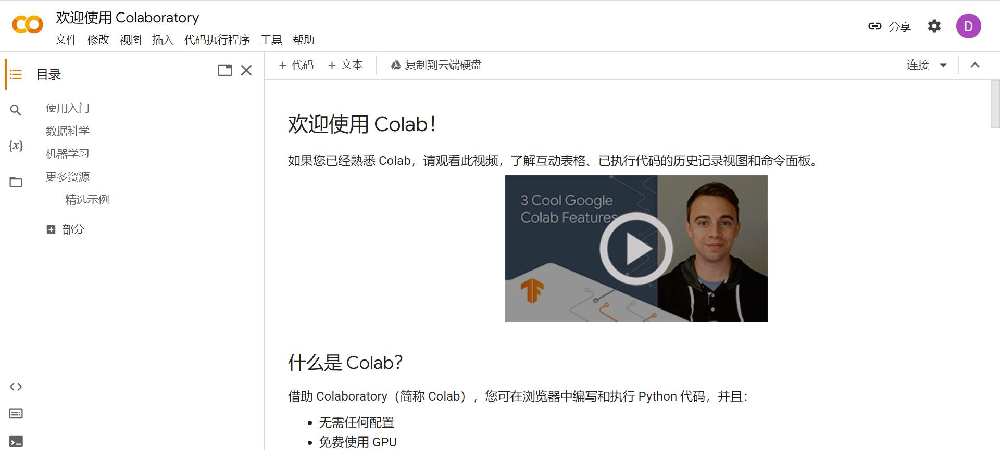

首页上对 Colab 有个简单的介绍，还提供了一些数据科学和机器学习的入门例子和学习资源。我们通过左上角的 `文件 -> 新建笔记本` 菜单项创建一个新的笔记本：

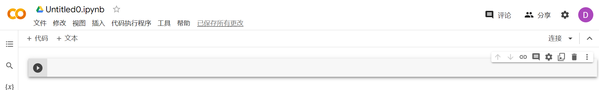

然后点击 `修改 -> 笔记本设置` 将硬件加速器调整为 GPU：

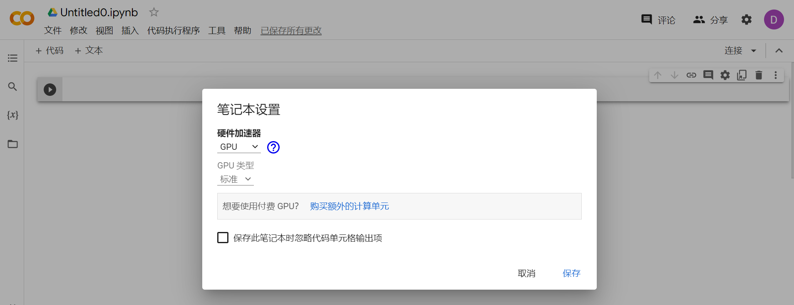

然后点击右上角的 `连接` 按钮，Google 会动态地为我们分配计算资源，稍等片刻，我们就相当于拥有了一台 12.7 G 内存，78.2 G 磁盘，且带 GPU 显卡的主机了：

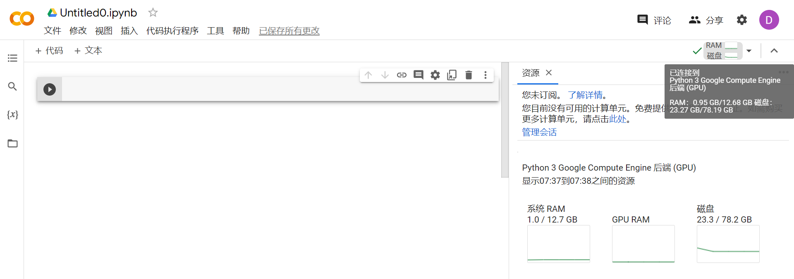

### Colab 的基本使用

在这个笔记本中，我们可以编写 Markdown 文档，也可以编写和执行 Python 代码：

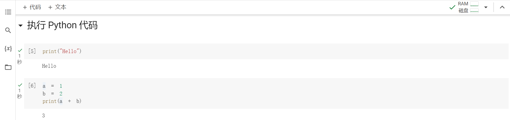

甚至可以在命令前加个 `!` 来执行 Shell 命令：

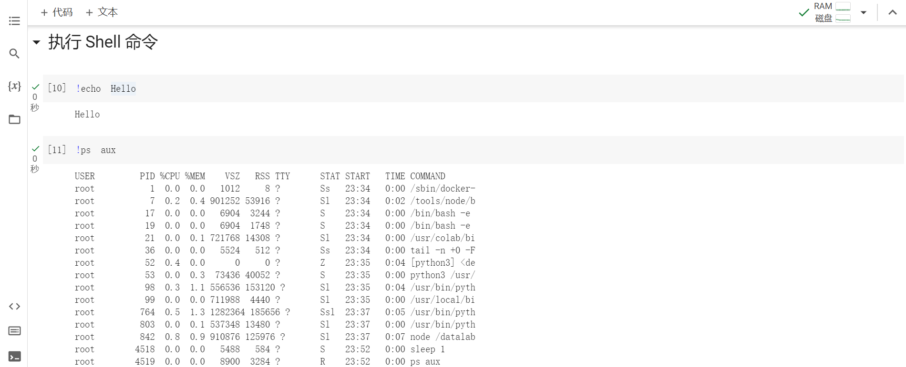

这个环境里内置了很多常用的数据科学或机器学习的 Python 库，比如 numpy、pandas、matplotlib、scikit-learn、tensorflow 等：

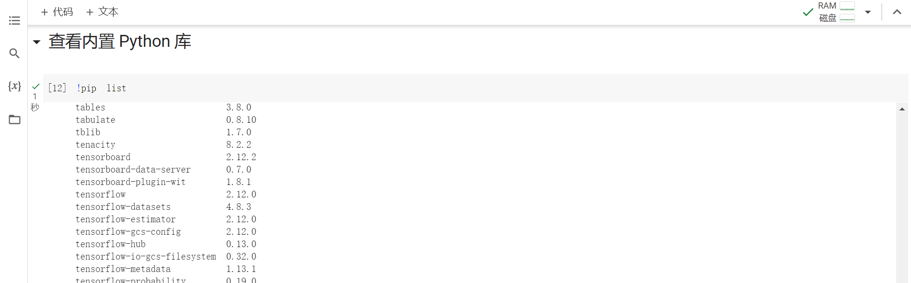

另外，由于这是一台 GPU 主机，我们还可以使用 `nvidia-smi` 来查看显卡信息：

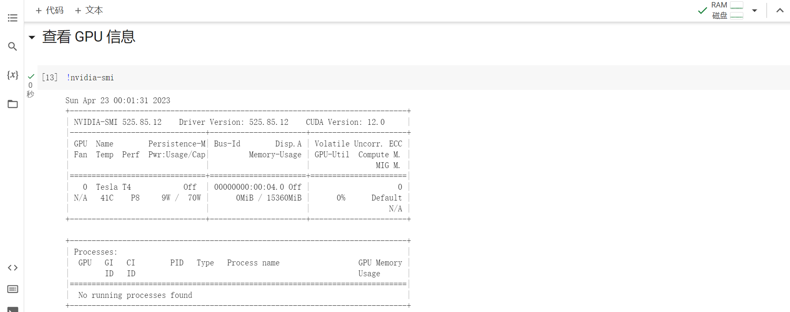

可以看到，我们免费得到了一张 Tesla T4 的显卡，显存大约 15G 左右。

### 测试 GPU 速度

接下来，我们测试下这个 GPU 的速度。首先通过 TensorFlow 的 `tf.test.gpu_device_name()` 获取 GPU 设备的名称：

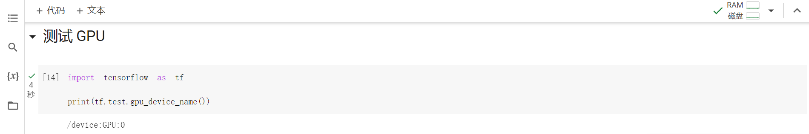

然后编写两个方法：

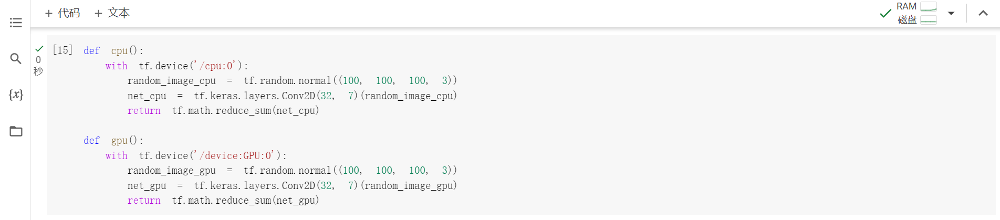

这两个方法所做的事情是一样的，只不过一个使用 CPU 来运行，另一个使用 GPU 来运行。在这个方法中，先使用 `tf.random.normal((100, 100, 100, 3))` 随机生成一个 `100*100*100*3` 的四维张量，然后使用 `tf.keras.layers.Conv2D(32, 7)(random_image_cpu)` 对这个张量计算卷积，卷积过滤器数量 `filters` 为 32，卷积窗口 `kernel_size` 为 `7*7`，最后使用 `tf.math.reduce_sum(net_cpu)` 对卷积结果求和。

接下来第一次执行，并使用 `timeit` 来计时：

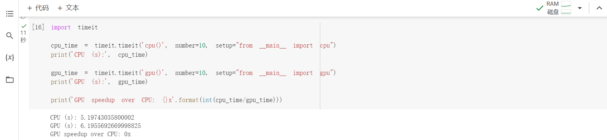

可以看到，在 GPU 上的执行速度比 CPU 上的要慢一点，这是因为 TensorFlow 第一次运行时默认会使用 cuDNN 的 autotune 机制对计算进行预热。

我们再执行第二次：

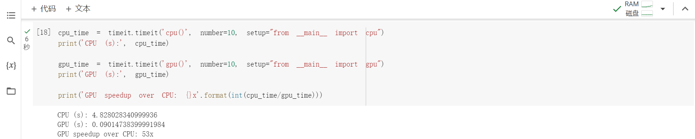

这时，在 GPU 上的执行速度明显快多了，相比于 CPU 来说，速度有着 50 多倍的提升。

这里是 [这一节的完整代码](https://colab.research.google.com/drive/1Q6-mAdQt1qTMcsEr7-rTA-PBR2zddVHI)。

## 在 Google Colab 里运行 Stable Diffusion

> 2023 年 4 月 21 日，Google Colab [官方发了一份声明](https://twitter.com/thechrisperry/status/1649189902079381505)，由于 Stable Diffusion 太火了，消耗了 Google Colab 大量的 GPU 资源，导致预算不够，现在已经被封了，只有付费用户才能运行，免费用户运行会有警告：
>
> 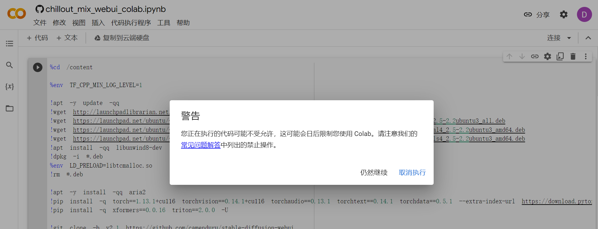

对 Google Colab 有一定了解后，我们就可以免费使用它的 GPU 来做很多有趣的事情了，比如我想要运行 Stable Diffusion 来体验 AI 绘画。

[camenduru/stable-diffusion-webui-colab](https://github.com/camenduru/stable-diffusion-webui-colab) 这个项目整理了大量 Stable Diffusion 的 Colab 脚本，基于 [AUTOMATIC1111/stable-diffusion-webui](https://github.com/AUTOMATIC1111/stable-diffusion-webui) 实现了可视化 Web 页面，集成了 [Hugging Face](https://huggingface.co/) 和 [Civitai](https://civitai.com/) 上热门的模型和插件，我们随便选择一个，点击左侧的 `stable` 打开 Colab 页面执行即可：

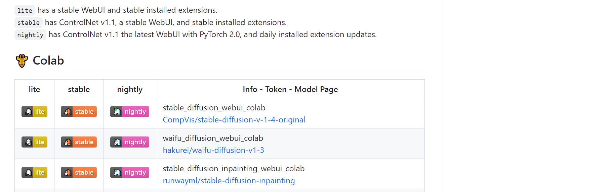

运行成功后，在控制台中可以看到打印了几个随机生成的外网链接：

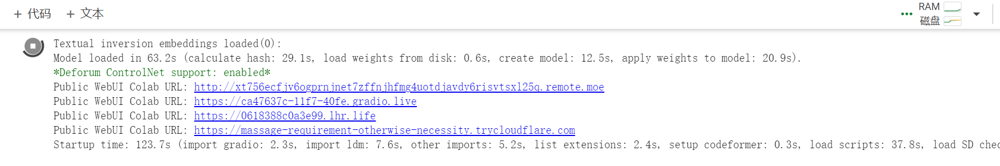

随便选择一个链接打开，进入 Stable Diffusion WebUI 页面：

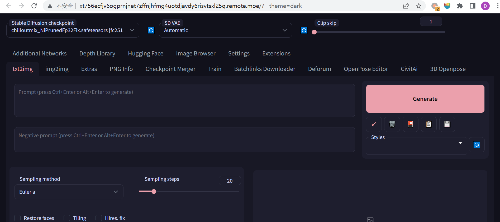

接下来，开始你的 AI 绘画之旅吧！

## 参考

* [保姆级GPU白嫖攻略](https://cuijiahua.com/blog/2021/01/dl-basics-4.html)
* [ChatGPT 与 Midjourney 强强联手，让先秦阿房宫重现辉煌！](https://mp.weixin.qq.com/s/oE-qQJV7K_nVx6Zq88efhw)
* [零基础入门 Stable Diffusion - 无需显卡把 AI 绘画引擎搬进家用电脑](https://newzone.top/_posts/2022-09-05-stable_diffusion_ai_painting.html)

## 更多

### 文本生成派

* [ChatGPT](https://chat.openai.com/)
* [GPT-4](https://openai.com/product/gpt-4)
* [Claude AI](https://www.anthropic.com/claude-in-slack)
* [Google Bard](https://bard.google.com/)
* [Notion AI](https://www.notion.so/product/ai)

### 图片生成派

* [Midjourney](https://www.midjourney.com/home/)
* [Stability.AI](https://stability.ai/)
* [DALL.E.2](https://openai.com/product/dall-e-2)
* [Imagen](https://imagen.research.google/)
* [NovelAI](https://novelai.net/)
