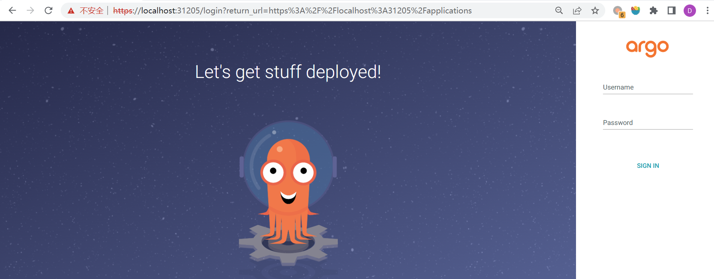
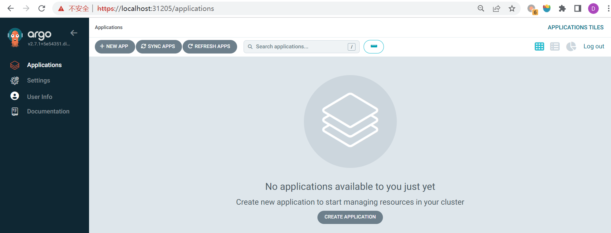
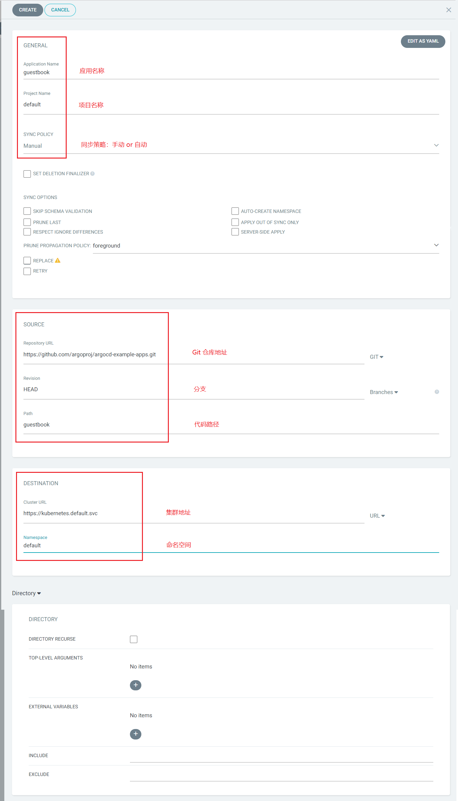
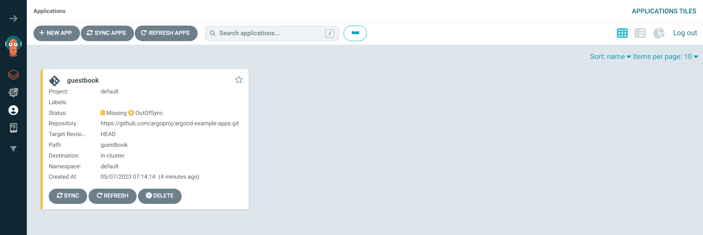
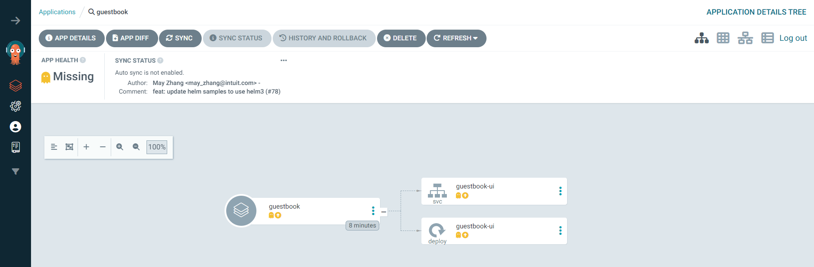
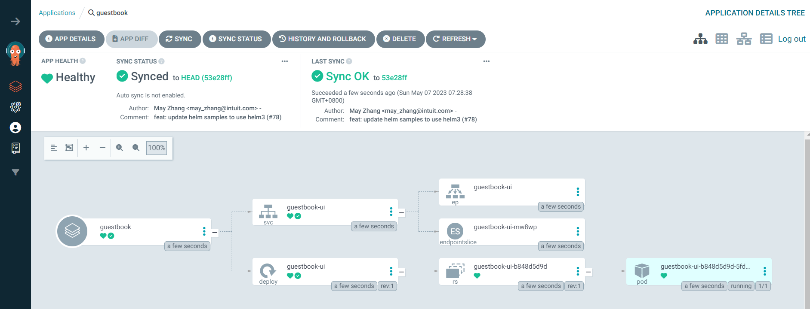

# WEEK038 - 基于 Argo CD 的 GitOps 实践笔记

[GitOps](https://www.weave.works/technologies/gitops/) 这个概念最早是由 [Weaveworks](https://www.weave.works) 的 CEO Alexis Richardson 在 2017 年提出的，它是一种全新的基于 Git 仓库来管理 Kubernetes 集群和交付应用程序的方式。它包含以下四个基本原则：

1. **声明式（Declarative）**：整个系统必须通过声明式的方式进行描述，比如 Kubernetes 就是声明式的，它通过 YAML 来描述系统的期望状态；
2. **版本控制和不可变（Versioned and immutable）**：所有的声明式描述都存储在 Git 仓库中，通过 Git 我们可以对系统的状态进行版本控制，记录了整个系统的修改历史，可以方便地回滚；
3. **自动拉取（Pulled automatically）**：我们通过提交代码的形式将系统的期望状态提交到 Git 仓库，系统从 Git 仓库自动拉取并做出变更，这种被称为 Pull 模式，整个过程不需要安装额外的工具，也不需要配置 Kubernetes 的认证授权；而传统的 CI/CD 工具如 Jenkins 或 CircleCI 等使用的是 Push 模式，这种模式一般都会在 CI 流水线运行完成后通过执行命令将应用部署到系统中，这不仅需要安装额外工具（比如 kubectl），还需要配置 Kubernetes 的授权，而且这种方式无法感知部署状态，所以也就无法保证集群状态的一致性了；
4. **持续调谐（Continuously reconciled）**：通过在目标系统中安装一个 Agent，一般使用 Kubernetes Operator 来实现，它会定期检测实际状态与期望状态是否一致，一旦检测到不一致，Agent 就会自动进行修复，确保系统达到期望状态，这个过程就是调谐（Reconciliation）；这样做的好处是将 Git 仓库作为单一事实来源，即使集群由于误操作被修改，Agent 也会通过持续调谐自动恢复。

其实，在提出 GitOps 概念之前，已经有另一个概念 IaC （Infrastructure as Code，基础设施即代码）被提出了，IaC 表示使用代码来定义基础设施，方便编辑和分发系统配置，它作为 DevOps 的最佳实践之一得到了社区的广泛关注。关于 IaC 和 GitOps 的区别，可以参考 [The GitOps FAQ](https://www.weave.works/technologies/gitops-frequently-asked-questions/)。

## Argo CD 快速入门

基于 GitOps 理念，很快诞生出了一批 **声明式的持续交付（Declarative Continuous Deployment）** 工具，比如 Weaveworks 的 [Flux CD](https://fluxcd.io/) 和 Intuit 的 [Argo CD](https://argoproj.github.io/cd/)，虽然 Weaveworks 是 GitOps 概念的提出者，但是从社区的反应来看，似乎 Argo CD 要更胜一筹。

Argo 项目最初是由 [Applatix](https://www.applatix.com/) 公司于 2017 年创建，2018 年这家公司被 [Intuit](https://www.intuit.com/) 收购，Argo 项目就由 Intuit 继续维护和演进。Argo 目前包含了四个子项目：[Argo Workflows](https://argoproj.github.io/workflows)、[Argo Events](https://argoproj.github.io/events)、[Argo CD](https://argoproj.github.io/cd) 和 [Argo Rollouts](https://argoproj.github.io/rollouts/)，主要用于运行和管理 Kubernetes 上的应用程序和任务，所有的 Argo 项目都是基于 Kubernetes 控制器和自定义资源实现的，它们组合在一起，提供了创建应用程序和任务的三种模式：服务模式、工作流模式和基于事件的模式。2020 年 4 月 7 日，Argo 项目加入 CNCF 开始孵化，并于 2022 年 12 月正式毕业，成为继 Kubernetes、Prometheus 和 Envoy 之后的又一个 CNCF 毕业项目。

这一节我们将学习 Argo CD，学习如何通过 Git 以及声明式描述来部署 Kubernetes 资源。

### 安装 Argo CD

Argo CD 提供了两种 [安装形式](https://argo-cd.readthedocs.io/en/stable/operator-manual/installation/)：**多租户模式（Multi-Tenant）** 和 **核心模式（Core）**。多租户模式提供了 Argo CD 的完整特性，包括 UI、SSO、多集群管理等，适用于多个团队用户共同使用；而核心模式只包含核心组件，不包含 UI 及多租户功能，适用于集群管理员独自使用。

使用比较多的是多租户模式，官方还为其提供了两份部署配置：非高可用配置 [install.yaml](https://github.com/argoproj/argo-cd/blob/master/manifests/install.yaml) 和高可用配置 [ha/install.yaml](https://github.com/argoproj/argo-cd/blob/master/manifests/ha/install.yaml)，生产环境建议使用高可用配置，开发和测试环境可以使用非高可用配置，下面就使用非高可用配置来安装 Argo CD。

首先，创建一个 `argocd` 命名空间：

```
$ kubectl create namespace argocd
namespace/argocd created
```

接着将 Argo CD 部署到该命名空间中：

```
$ kubectl apply -n argocd -f https://raw.githubusercontent.com/argoproj/argo-cd/stable/manifests/install.yaml
customresourcedefinition.apiextensions.k8s.io/applications.argoproj.io created
customresourcedefinition.apiextensions.k8s.io/applicationsets.argoproj.io created
customresourcedefinition.apiextensions.k8s.io/appprojects.argoproj.io created
serviceaccount/argocd-application-controller created
serviceaccount/argocd-applicationset-controller created
serviceaccount/argocd-dex-server created
serviceaccount/argocd-notifications-controller created
serviceaccount/argocd-redis created
serviceaccount/argocd-repo-server created
serviceaccount/argocd-server created
role.rbac.authorization.k8s.io/argocd-application-controller created
role.rbac.authorization.k8s.io/argocd-applicationset-controller created
role.rbac.authorization.k8s.io/argocd-dex-server created
role.rbac.authorization.k8s.io/argocd-notifications-controller created
role.rbac.authorization.k8s.io/argocd-server created
clusterrole.rbac.authorization.k8s.io/argocd-application-controller created
clusterrole.rbac.authorization.k8s.io/argocd-server created
rolebinding.rbac.authorization.k8s.io/argocd-application-controller created
rolebinding.rbac.authorization.k8s.io/argocd-applicationset-controller created
rolebinding.rbac.authorization.k8s.io/argocd-dex-server created
rolebinding.rbac.authorization.k8s.io/argocd-notifications-controller created
rolebinding.rbac.authorization.k8s.io/argocd-redis created
rolebinding.rbac.authorization.k8s.io/argocd-server created
clusterrolebinding.rbac.authorization.k8s.io/argocd-application-controller created
clusterrolebinding.rbac.authorization.k8s.io/argocd-server created
configmap/argocd-cm created
configmap/argocd-cmd-params-cm created
configmap/argocd-gpg-keys-cm created
configmap/argocd-notifications-cm created
configmap/argocd-rbac-cm created
configmap/argocd-ssh-known-hosts-cm created
configmap/argocd-tls-certs-cm created
secret/argocd-notifications-secret created
secret/argocd-secret created
service/argocd-applicationset-controller created
service/argocd-dex-server created
service/argocd-metrics created
service/argocd-notifications-controller-metrics created
service/argocd-redis created
service/argocd-repo-server created
service/argocd-server created
service/argocd-server-metrics created
deployment.apps/argocd-applicationset-controller created
deployment.apps/argocd-dex-server created
deployment.apps/argocd-notifications-controller created
deployment.apps/argocd-redis created
deployment.apps/argocd-repo-server created
deployment.apps/argocd-server created
statefulset.apps/argocd-application-controller created
networkpolicy.networking.k8s.io/argocd-application-controller-network-policy created
networkpolicy.networking.k8s.io/argocd-applicationset-controller-network-policy created
networkpolicy.networking.k8s.io/argocd-dex-server-network-policy created
networkpolicy.networking.k8s.io/argocd-notifications-controller-network-policy created
networkpolicy.networking.k8s.io/argocd-redis-network-policy created
networkpolicy.networking.k8s.io/argocd-repo-server-network-policy created
networkpolicy.networking.k8s.io/argocd-server-network-policy created
```

另外，还可以通过 Helm 来部署 Argo CD，这里是社区维护的 [Helm Charts](https://github.com/argoproj/argo-helm)。

### 通过 Web UI 访问 Argo CD

Argo CD 部署好之后，默认情况下，API Server 从集群外是无法访问的，这是因为 API Server 的服务类型是 `ClusterIP`：

```
$ kubectl get svc argocd-server -n argocd
NAME            TYPE        CLUSTER-IP     EXTERNAL-IP   PORT(S)                      AGE
argocd-server   ClusterIP   10.111.209.6   <none>        80/TCP,443/TCP               23h
```

我们可以使用 `kubectl patch` 将其改为 `NodePort` 或 `LoadBalancer`：

```
$ kubectl patch svc argocd-server -n argocd -p '{"spec": {"type": "NodePort"}}'
```

修改之后，Kubernetes 会为 API Server 随机分配端口：

```
$ kubectl get svc argocd-server -n argocd
NAME            TYPE       CLUSTER-IP     EXTERNAL-IP   PORT(S)                      AGE
argocd-server   NodePort   10.111.209.6   <none>        80:32130/TCP,443:31205/TCP   23h
```

这时我们就可以通过 `localhost:32130` 或 `localhost:31205` 来访问 API Server 了：



可以看到 API Server 需要登录才能访问，初始用户名为 `admin`，初始密码在部署时随机生成，并保存在 `argocd-initial-admin-secret` 这个 Secret 里：

```
$ kubectl get secrets argocd-initial-admin-secret -n argocd -o yaml
apiVersion: v1
data:
  password: SlRyZDYtdEpOT1JGcXI3QQ==
kind: Secret
metadata:
  creationTimestamp: "2023-05-04T00:14:19Z"
  name: argocd-initial-admin-secret
  namespace: argocd
  resourceVersion: "17363"
  uid: 0cce4b4a-ff9d-44b3-930d-48bc5530bef0
type: Opaque
```

密码以 BASE64 形式存储，可以使用下面的命令快速得到明文密码：

```
$ kubectl get secrets argocd-initial-admin-secret -n argocd --template={{.data.password}} | base64 -d
JTrd6-tJNORFqr7A
```

输入用户名和密码登录成功后，进入 Argo CD 的应用管理页面：



> 除了修改服务类型，官方还提供了两种方法暴露 API Server：一种是 [使用 Ingress 网关](https://argo-cd.readthedocs.io/en/stable/operator-manual/ingress/)，另一种是使用 `kubectl port-forward` 命令进行端口转发：
> 
> ```
> $ kubectl port-forward svc argocd-server -n argocd 8080:443
> ```

### 通过 CLI 访问 Argo CD

我们也可以使用命令行客户端来访问 Argo CD，首先使用 `curl` 命令下载：

```
$ curl -LO https://github.com/argoproj/argo-cd/releases/download/v2.7.1/argocd-linux-amd64
```

然后使用 `install` 命令安装：

```
$ sudo install -m 555 argocd-linux-amd64 /usr/local/bin/argocd
```

使用 `argocd version` 查看 Argo CD 的版本信息，验证安装是否成功：

```
$ argocd version
argocd: v2.7.1+5e54351
  BuildDate: 2023-05-02T16:54:25Z
  GitCommit: 5e543518dbdb5384fa61c938ce3e045b4c5be325
  GitTreeState: clean
  GoVersion: go1.19.8
  Compiler: gc
  Platform: linux/amd64
FATA[0000] Argo CD server address unspecified
```

由于此时还没有配置服务端，所以 `argocd version` 只显示了 Argo CD 客户端的版本信息，没有服务端的版本信息。通过上一节的方法将 API Server 暴露之后，就可以使用 `argocd login` 连接服务端：

```
$ argocd login localhost:32130
WARNING: server certificate had error: x509: certificate signed by unknown authority. Proceed insecurely (y/n)? y
Username: admin
Password:
'admin:login' logged in successfully
Context 'localhost:32130' updated
```

登录成功后，再次查看版本：

```
$ argocd version
argocd: v2.7.1+5e54351
  BuildDate: 2023-05-02T16:54:25Z
  GitCommit: 5e543518dbdb5384fa61c938ce3e045b4c5be325
  GitTreeState: clean
  GoVersion: go1.19.8
  Compiler: gc
  Platform: linux/amd64
argocd-server: v2.7.1+5e54351.dirty
  BuildDate: 2023-05-02T16:35:40Z
  GitCommit: 5e543518dbdb5384fa61c938ce3e045b4c5be325
  GitTreeState: dirty
  GoVersion: go1.19.6
  Compiler: gc
  Platform: linux/amd64
  Kustomize Version: v5.0.1 2023-03-14T01:32:48Z
  Helm Version: v3.11.2+g912ebc1
  Kubectl Version: v0.24.2
  Jsonnet Version: v0.19.1
```

## 部署应用

这一节我们将学习如何通过 Argo CD 来部署一个 Kubernetes 应用，官方在 [argoproj/argocd-example-apps](https://github.com/argoproj/argocd-example-apps) 仓库中提供了很多示例应用可供我们直接使用，这里我们将使用其中的 [guestbook](https://github.com/argoproj/argocd-example-apps/tree/master/guestbook) 应用。

### 通过 Web UI 部署应用

最简单的方法是通过 Argo CD 提供的可视化页面 Web UI 来部署应用，打开 Argo CD 的应用管理页面，点击 `+ NEW APP` 按钮，弹出新建应用的对话框：



对话框中的选项比较多，但是我们只需要填写红框部分的内容即可，包括：

* 通用配置
  * 应用名称：`guestbook`
  * 项目名称：`default`
  * 同步策略：`Manual`
* 源配置
  * Git 仓库地址：`https://github.com/argoproj/argocd-example-apps.git`
  * 分支：`HEAD`
  * 代码路径：`guestbook`
* 目标配置
  * 集群地址：`https://kubernetes.default.svc`
  * 命名空间：`default`

其他的选项暂时可以不用管，如果想了解具体内容可以参考官方文档 [Sync Options](https://argo-cd.readthedocs.io/en/stable/user-guide/sync-options/)，填写完成后，点击 `CREATE` 按钮即可创建应用：



因为刚刚填写的同步策略是手工同步，所以我们能看到应用的状态还是 `OutOfSync`，点击应用详情：



可以看到 Argo CD 已经从 Git 仓库的代码中解析出应用所包含的 Kubernetes 资源了，`guestbook` 应用包含了一个 Deployment 和 一个 Service，点击 `SYNC` 按钮触发同步，Deployment 和 Service（以及它们关联的资源）被成功部署到 Kubernetes 集群中：



测试完成后，点击 `DELETE` 删除应用，该应用关联的资源将会被级联删除。

### 通过 CLI 部署应用

我们还可以通过 Argo CD 提供的命令行工具来部署应用，经过上一节的步骤，我们已经登录了 API Server，我们只需要执行下面的 `argocd app create` 命令即可创建 `guestbook` 应用：

```
$ argocd app create guestbook \
  --repo https://github.com/argoproj/argocd-example-apps.git \
  --path guestbook \
  --dest-server https://kubernetes.default.svc \
  --dest-namespace default
application 'guestbook' created
```

也可以使用 `YAML` 文件声明式地创建 Argo CD 应用：

```
apiVersion: argoproj.io/v1alpha1
kind: Application
metadata:
  name: guestbook
  namespace: argocd
spec:
  project: default
  source:
    repoURL: https://github.com/argoproj/argocd-example-apps.git
    targetRevision: HEAD
    path: guestbook
  destination:
    server: https://kubernetes.default.svc
    namespace: guestbook
```

我们创建一个 YAML 文件，包含以上内容，然后执行 `kubectl apply -f` 即可，和 Web UI 操作类似，刚创建的应用处于 `OutOfSync` 状态，我们可以使用 `argocd app get` 命令查询应用详情进行确认：

```
$ argocd app get guestbook
Name:               argocd/guestbook
Project:            default
Server:             https://kubernetes.default.svc
Namespace:          default
URL:                https://localhost:32130/applications/guestbook
Repo:               https://github.com/argoproj/argocd-example-apps.git
Target:
Path:               guestbook
SyncWindow:         Sync Allowed
Sync Policy:        <none>
Sync Status:        OutOfSync from  (53e28ff)
Health Status:      Missing

GROUP  KIND        NAMESPACE  NAME          STATUS     HEALTH   HOOK  MESSAGE
       Service     default    guestbook-ui  OutOfSync  Missing
apps   Deployment  default    guestbook-ui  OutOfSync  Missing
```

接着我们执行 `argocd app sync` 命令，手工触发同步：

```
$ argocd app sync guestbook
TIMESTAMP                  GROUP        KIND   NAMESPACE                  NAME    STATUS    HEALTH        HOOK  MESSAGE
2023-05-06T08:22:53+08:00            Service     default          guestbook-ui  OutOfSync  Missing
2023-05-06T08:22:53+08:00   apps  Deployment     default          guestbook-ui  OutOfSync  Missing
2023-05-06T08:22:53+08:00            Service     default          guestbook-ui    Synced  Healthy
2023-05-06T08:22:54+08:00            Service     default          guestbook-ui    Synced   Healthy              service/guestbook-ui created
2023-05-06T08:22:54+08:00   apps  Deployment     default          guestbook-ui  OutOfSync  Missing              deployment.apps/guestbook-ui created
2023-05-06T08:22:54+08:00   apps  Deployment     default          guestbook-ui    Synced  Progressing              deployment.apps/guestbook-ui created

Name:               argocd/guestbook
Project:            default
Server:             https://kubernetes.default.svc
Namespace:          default
URL:                https://localhost:32130/applications/guestbook
Repo:               https://github.com/argoproj/argocd-example-apps.git
Target:
Path:               guestbook
SyncWindow:         Sync Allowed
Sync Policy:        <none>
Sync Status:        Synced to  (53e28ff)
Health Status:      Progressing

Operation:          Sync
Sync Revision:      53e28ff20cc530b9ada2173fbbd64d48338583ba
Phase:              Succeeded
Start:              2023-05-06 08:22:53 +0800 CST
Finished:           2023-05-06 08:22:54 +0800 CST
Duration:           1s
Message:            successfully synced (all tasks run)

GROUP  KIND        NAMESPACE  NAME          STATUS  HEALTH       HOOK  MESSAGE
       Service     default    guestbook-ui  Synced  Healthy            service/guestbook-ui created
apps   Deployment  default    guestbook-ui  Synced  Progressing        deployment.apps/guestbook-ui created
```

等待一段时间后，应用关联资源就部署完成了：

```
$ kubectl get all
NAME                               READY   STATUS    RESTARTS   AGE
pod/guestbook-ui-b848d5d9d-rtzwf   1/1     Running   0          67s

NAME                   TYPE        CLUSTER-IP      EXTERNAL-IP   PORT(S)   AGE
service/guestbook-ui   ClusterIP   10.107.51.212   <none>        80/TCP    67s
service/kubernetes     ClusterIP   10.96.0.1       <none>        443/TCP   30d

NAME                           READY   UP-TO-DATE   AVAILABLE   AGE
deployment.apps/guestbook-ui   1/1     1            1           67s

NAME                                     DESIRED   CURRENT   READY   AGE
replicaset.apps/guestbook-ui-b848d5d9d   1         1         1       67s
```

测试完成后，执行 `argocd app delete` 命令删除应用，该应用关联的资源将会被级联删除：

```
$ argocd app delete guestbook
Are you sure you want to delete 'guestbook' and all its resources? [y/n] y
application 'guestbook' deleted
```

## 参考

* [Argo CD Getting Started](https://argo-cd.readthedocs.io/en/stable/getting_started/)
* [GitOps 介绍](https://icloudnative.io/posts/what-is-gitops/)
* [Argo CD 入门教程](https://icloudnative.io/posts/getting-started-with-argocd/)
* [GitOps 应用实践系列 - 综述](https://moelove.info/2021/10/19/GitOps-%E5%BA%94%E7%94%A8%E5%AE%9E%E8%B7%B5%E7%B3%BB%E5%88%97-%E7%BB%BC%E8%BF%B0/)
* [GitOps 应用实践系列 - Argo CD 的基本介绍](https://moelove.info/2021/10/21/GitOps-%E5%BA%94%E7%94%A8%E5%AE%9E%E8%B7%B5%E7%B3%BB%E5%88%97-Argo-CD-%E7%9A%84%E5%9F%BA%E6%9C%AC%E4%BB%8B%E7%BB%8D/)
* [Guide To GitOps](https://www.weave.works/technologies/gitops/)
* [The GitOps FAQ](https://www.weave.works/technologies/gitops-frequently-asked-questions/)
* [What Is GitOps](https://www.weave.works/blog/what-is-gitops-really)
* [The History of GitOps](https://www.weave.works/blog/the-history-of-gitops)
* [CNCF 宣布 Argo 正式毕业](https://www.infoq.cn/article/y8a0ek2uevjxbm3qgcox)

## 更多

### 部署其他的应用类型

Argo CD 不仅支持原生的 Kubernetes 配置清单，也支持 [Helm Chart](https://argo-cd.readthedocs.io/en/stable/user-guide/helm/)、[Kustomize](https://argo-cd.readthedocs.io/en/stable/user-guide/kustomize/) 或者 [Jsonnet](https://argo-cd.readthedocs.io/en/stable/user-guide/jsonnet/) 部署清单，甚至可以通过 [Config Management Plugins](https://argo-cd.readthedocs.io/en/stable/operator-manual/config-management-plugins/) 实现自定义配置。

### Flux CD

* [GitOps 应用实践系列 - Flux CD 及其核心组件](https://moelove.info/2021/12/18/GitOps-%E5%BA%94%E7%94%A8%E5%AE%9E%E8%B7%B5%E7%B3%BB%E5%88%97-Flux-CD-%E5%8F%8A%E5%85%B6%E6%A0%B8%E5%BF%83%E7%BB%84%E4%BB%B6/)
* [Argo CD vs Flux CD — Right GitOps tool for your Kubernetes cluster](https://rajputvaibhav.medium.com/argo-cd-vs-flux-cd-right-gitops-tool-for-your-kubernetes-cluster-c71cff489d26)
