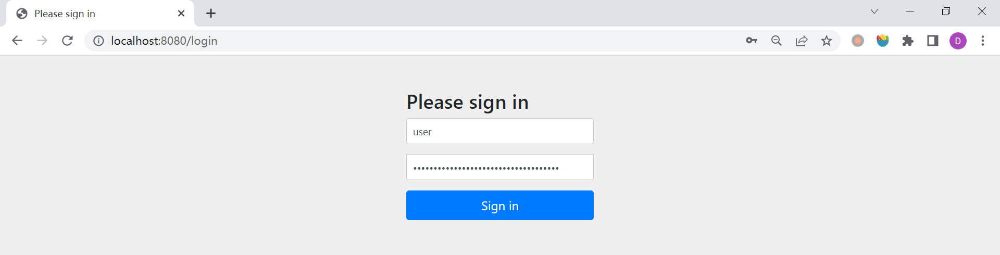
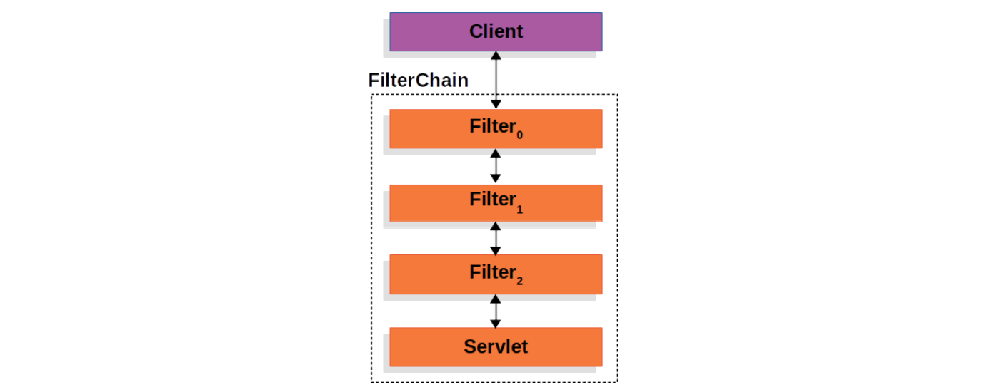
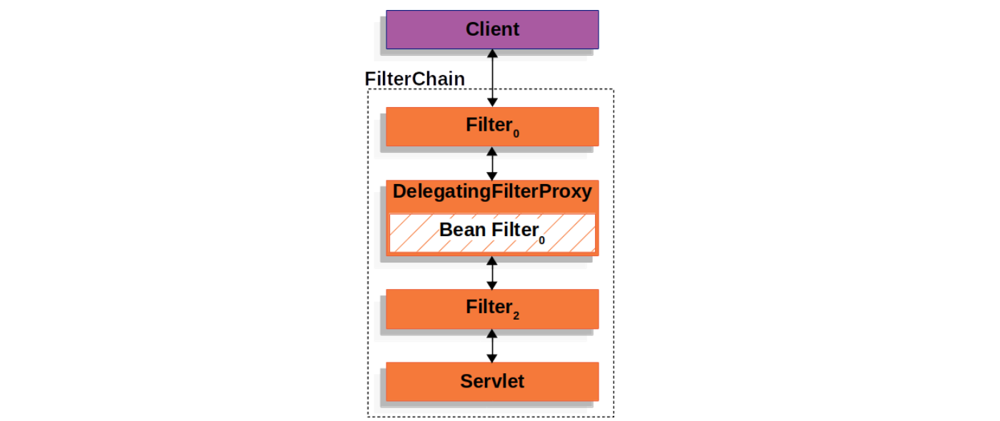
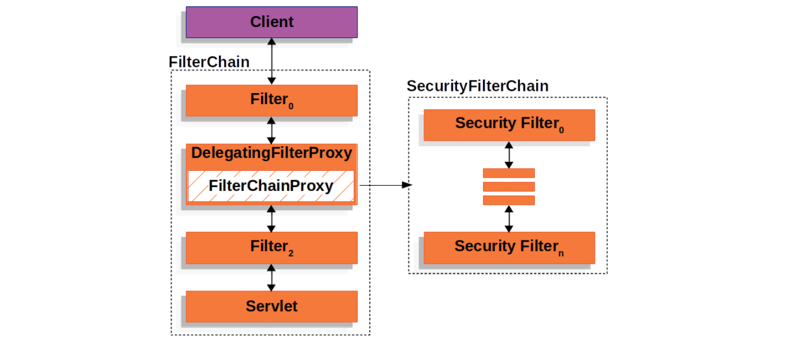
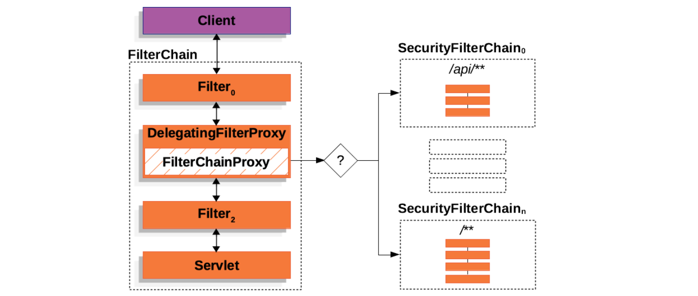

# WEEK039 - 读源码剖析 Spring Security 的实现原理

[Spring Security](https://spring.io/projects/spring-security) 是一个轻量级的安全框架，可以和 Spring 项目很好地集成，提供了丰富的身份认证和授权相关的功能，而且还能防止一些常见的网络攻击。我在工作中有很多项目都使用了 Spring Security 框架，但基本上都是浅尝辄止，按照说明文档配置好就完事了，一直没有时间深入地研究过。最近在 [Reflectoring](https://reflectoring.io/) 上看到了一篇文章 [Getting started with Spring Security and Spring Boot](https://reflectoring.io/spring-security/)，写得非常全面仔细，感觉是一篇不错的 Spring Security 入门文章，于是花了一点时间拜读了一番，结合着 [官方文档](https://docs.spring.io/spring-security/reference/index.html) 和 [源码](https://github.com/spring-projects/spring-security) 系统地学习一下 Spring Security 的实现原理。

## 入门示例

我们先从一个简单的例子开始，这里我直接使用了 [week004-creating-spring-project](../week004-creating-spring-project/README.md) 中的 Hello World 示例。为了让这个示例程序开启 Spring Security 功能，我们在 `pom.xml` 文件中引入 `spring-boot-starter-security` 依赖即可：

```
<dependency>
	<groupId>org.springframework.boot</groupId>
	<artifactId>spring-boot-starter-security</artifactId>
</dependency>
```

启动程序，会在控制台日志中看到类似下面这样的信息：

```
2023-05-15 06:52:52.418  INFO 8596 --- [           main] .s.s.UserDetailsServiceAutoConfiguration : 

Using generated security password: eeb386a9-e16a-4b9b-bbc6-c054c8d263b0
```

这个是由 Spring Security 随机生成的密码。访问 `/hello` 页面，可以看到出现了一个登录页面：



输入用户名（默认为 `user`）和密码（控制台日志）登录成功后我们才能正常访问页面。默认的用户名和密码可以使用下面的配置进行修改：

```
spring.security.user.name=admin
spring.security.user.password=123456
```

## Spring Security 核心组件

为了后续更好地对 Spring Security 进行配置，理解 Spring Security 的实现原理，我们需要进一步学习 Spring Security 的三大核心组件：

* 过滤器（Servlet Filters）
* 认证（Authentication）
* 授权（Authorization）

### Servlet Filters

我们知道，在 Spring MVC 框架中，`DispatcherServlet` 负责对用户的 Web 请求进行分发和处理，在请求到达 `DispatcherServlet` 之前，会经过一系列的 `Servlet Filters`，这被称之为过滤器，主要作用是拦截请求并对请求做一些前置或后置处理。这些过滤器串在一起，形成一个过滤器链（`FilterChain`）：



我们可以在配置文件中加上下面的日志配置：

```
logging.level.org.springframework.boot.web.servlet.ServletContextInitializerBeans=TRACE
```

然后重新启动服务，会在控制台输出类似下面这样的日志（为了方便查看，我做了一点格式化）：

```
2023-05-18 07:08:14.805 TRACE 10020 --- [           main] o.s.b.w.s.ServletContextInitializerBeans : 
	Added existing Filter initializer bean 'webMvcMetricsFilter'; order=-2147483647, 
	resource=class path resource [org/springframework/boot/actuate/autoconfigure/metrics/web/servlet/WebMvcMetricsAutoConfiguration.class]
2023-05-18 07:08:14.806 TRACE 10020 --- [           main] o.s.b.w.s.ServletContextInitializerBeans : 
	Added existing Filter initializer bean 'securityFilterChainRegistration'; order=-100, 
	resource=class path resource [org/springframework/boot/autoconfigure/security/servlet/SecurityFilterAutoConfiguration.class]
2023-05-18 07:08:14.808 TRACE 10020 --- [           main] o.s.b.w.s.ServletContextInitializerBeans : 
	Added existing Servlet initializer bean 'dispatcherServletRegistration'; order=2147483647, 
	resource=class path resource [org/springframework/boot/autoconfigure/web/servlet/DispatcherServletAutoConfiguration$DispatcherServletRegistrationConfiguration.class]
2023-05-18 07:08:14.810 TRACE 10020 --- [           main] o.s.b.w.s.ServletContextInitializerBeans : 
	Added existing Filter initializer bean 'errorPageSecurityFilter'; order=2147483647, 
	resource=class path resource [org/springframework/boot/autoconfigure/security/servlet/SpringBootWebSecurityConfiguration$ErrorPageSecurityFilterConfiguration.class]
2023-05-18 07:08:14.813 TRACE 10020 --- [           main] o.s.b.w.s.ServletContextInitializerBeans : 
	Added existing ServletContextInitializer initializer bean 'servletEndpointRegistrar'; order=2147483647, 
	resource=class path resource [org/springframework/boot/actuate/autoconfigure/endpoint/web/ServletEndpointManagementContextConfiguration$WebMvcServletEndpointManagementContextConfiguration.class]
2023-05-18 07:08:14.828 TRACE 10020 --- [           main] o.s.b.w.s.ServletContextInitializerBeans : 
	Created Filter initializer for bean 'characterEncodingFilter'; order=-2147483648, 
	resource=class path resource [org/springframework/boot/autoconfigure/web/servlet/HttpEncodingAutoConfiguration.class]    
2023-05-18 07:08:14.831 TRACE 10020 --- [           main] o.s.b.w.s.ServletContextInitializerBeans : 
	Created Filter initializer for bean 'formContentFilter'; order=-9900, 
	resource=class path resource [org/springframework/boot/autoconfigure/web/servlet/WebMvcAutoConfiguration.class]
2023-05-18 07:08:14.834 TRACE 10020 --- [           main] o.s.b.w.s.ServletContextInitializerBeans : 
	Created Filter initializer for bean 'requestContextFilter'; order=-105, 
	resource=class path resource [org/springframework/boot/autoconfigure/web/servlet/WebMvcAutoConfiguration$WebMvcAutoConfigurationAdapter.class]
2023-05-18 07:08:14.842 DEBUG 10020 --- [           main] o.s.b.w.s.ServletContextInitializerBeans : 
	Mapping filters: 
		filterRegistrationBean urls=[/*] order=-2147483647, 
		springSecurityFilterChain urls=[/*] order=-100, 
		filterRegistrationBean urls=[/*] order=2147483647, 
		characterEncodingFilter urls=[/*] order=-2147483648, 
		formContentFilter urls=[/*] order=-9900, 
		requestContextFilter urls=[/*] order=-105
2023-05-18 07:08:14.844 DEBUG 10020 --- [           main] o.s.b.w.s.ServletContextInitializerBeans : 
	Mapping servlets: dispatcherServlet urls=[/] 
```

这里显示了应用开启的所有 `Filter` 以及对应的自动配置类，可以看到 Spring Security 自动注入了两个 `FilterRegistrationBean`：

* 来自配置类 `SecurityFilterAutoConfiguration` 的 `securityFilterChainRegistration`
* 来自配置类 `ErrorPageSecurityFilterConfiguration` 的 `errorPageSecurityFilter`

注意这里显示的并非 `Filter` 的名字，而是 `FilterRegistrationBean` 的名字，这是一种 `RegistrationBean`，它实现了 `ServletContextInitializer` 接口，用于在程序启动时，将 `Filter` 或 `Servlet` 注入到 `ServletContext` 中：

```
public abstract class RegistrationBean implements ServletContextInitializer, Ordered {

	@Override
	public final void onStartup(ServletContext servletContext) throws ServletException {
		...
		register(description, servletContext);
	}

}
```

其中 `securityFilterChainRegistration` 的定义如下：

```
@Bean
@ConditionalOnBean(name = DEFAULT_FILTER_NAME)
public DelegatingFilterProxyRegistrationBean securityFilterChainRegistration(
		SecurityProperties securityProperties) {
	DelegatingFilterProxyRegistrationBean registration = new DelegatingFilterProxyRegistrationBean(
			DEFAULT_FILTER_NAME);
	registration.setOrder(securityProperties.getFilter().getOrder());
	registration.setDispatcherTypes(getDispatcherTypes(securityProperties));
	return registration;
}
```

这个 `RegistrationBean` 的类型为 `DelegatingFilterProxyRegistrationBean`，由它注入的 `Filter` 叫 `DelegatingFilterProxy`：

```
public class DelegatingFilterProxyRegistrationBean extends AbstractFilterRegistrationBean<DelegatingFilterProxy> {
	...
}
```

这是一个非常重要的 `Filter`，它充当着 Servlet 容器和 Spring 上下文之间的桥梁，由于 Servlet 容器有着它自己的标准，在注入 `Filter` 时并不知道 Spring Bean 的存在，所以我们可以通过 `DelegatingFilterProxy` 来实现 `Bean Filter` 的延迟加载：



看一下 `DelegatingFilterProxy` 的实现：

```
public class DelegatingFilterProxy extends GenericFilterBean {

	@Override
	public void doFilter(ServletRequest request, ServletResponse response, FilterChain filterChain)
			throws ServletException, IOException {

		// Lazily initialize the delegate if necessary.
		Filter delegateToUse = this.delegate;
		if (delegateToUse == null) {
			synchronized (this.delegateMonitor) {
				delegateToUse = this.delegate;
				if (delegateToUse == null) {
					WebApplicationContext wac = findWebApplicationContext();
					if (wac == null) {
						throw new IllegalStateException("No WebApplicationContext found: " +
								"no ContextLoaderListener or DispatcherServlet registered?");
					}
					delegateToUse = initDelegate(wac);
				}
				this.delegate = delegateToUse;
			}
		}

		// Let the delegate perform the actual doFilter operation.
		invokeDelegate(delegateToUse, request, response, filterChain);
	}
}
```

这段代码很容易理解，首先判断代理的 `Bean Filter` 是否存在，如果不存在则根据 `findWebApplicationContext()` 找到 Web 应用上下文，然后从上下文中获取 `Bean Filter` 并初始化，最后再调用该 `Bean Filter`。

那么接下来的问题是，这个 `DelegatingFilterProxy` 代理的 `Bean Filter` 是什么呢？我们从上面定义 `DelegatingFilterProxyRegistrationBean` 的地方可以看出，代理的 `Bean Filter` 叫做 `DEFAULT_FILTER_NAME`，查看它的定义就知道，实际上就是 `springSecurityFilterChain`：

```
public static final String DEFAULT_FILTER_NAME = "springSecurityFilterChain";
```

那么这个 `springSecurityFilterChain` 是在哪定义的呢？我们可以在 `WebSecurityConfiguration` 配置类中找到答案：

```
public class WebSecurityConfiguration {

	@Bean(name = AbstractSecurityWebApplicationInitializer.DEFAULT_FILTER_NAME)
	public Filter springSecurityFilterChain() throws Exception {
		boolean hasConfigurers = this.webSecurityConfigurers != null && !this.webSecurityConfigurers.isEmpty();
		boolean hasFilterChain = !this.securityFilterChains.isEmpty();
		Assert.state(!(hasConfigurers && hasFilterChain),
				"Found WebSecurityConfigurerAdapter as well as SecurityFilterChain. Please select just one.");
		if (!hasConfigurers && !hasFilterChain) {
			WebSecurityConfigurerAdapter adapter = this.objectObjectPostProcessor
					.postProcess(new WebSecurityConfigurerAdapter() {
					});
			this.webSecurity.apply(adapter);
		}
		for (SecurityFilterChain securityFilterChain : this.securityFilterChains) {
			this.webSecurity.addSecurityFilterChainBuilder(() -> securityFilterChain);
			for (Filter filter : securityFilterChain.getFilters()) {
				if (filter instanceof FilterSecurityInterceptor) {
					this.webSecurity.securityInterceptor((FilterSecurityInterceptor) filter);
					break;
				}
			}
		}
		for (WebSecurityCustomizer customizer : this.webSecurityCustomizers) {
			customizer.customize(this.webSecurity);
		}
		return this.webSecurity.build();
	}
}
```

很显然，`springSecurityFilterChain` 是通过 `this.webSecurity.build()` 构建的，进一步深入到 `webSecurity` 的源码我们就可以发现它的类型是 `FilterChainProxy`：

```
@Override
protected Filter performBuild() throws Exception {

	int chainSize = this.ignoredRequests.size() + this.securityFilterChainBuilders.size();
	List<SecurityFilterChain> securityFilterChains = new ArrayList<>(chainSize);
	List<RequestMatcherEntry<List<WebInvocationPrivilegeEvaluator>>> requestMatcherPrivilegeEvaluatorsEntries = new ArrayList<>();
	for (RequestMatcher ignoredRequest : this.ignoredRequests) {
		WebSecurity.this.logger.warn("You are asking Spring Security to ignore " + ignoredRequest
				+ ". This is not recommended -- please use permitAll via HttpSecurity#authorizeHttpRequests instead.");
		SecurityFilterChain securityFilterChain = new DefaultSecurityFilterChain(ignoredRequest);
		securityFilterChains.add(securityFilterChain);
		requestMatcherPrivilegeEvaluatorsEntries
				.add(getRequestMatcherPrivilegeEvaluatorsEntry(securityFilterChain));
	}
	for (SecurityBuilder<? extends SecurityFilterChain> securityFilterChainBuilder : this.securityFilterChainBuilders) {
		SecurityFilterChain securityFilterChain = securityFilterChainBuilder.build();
		securityFilterChains.add(securityFilterChain);
		requestMatcherPrivilegeEvaluatorsEntries
				.add(getRequestMatcherPrivilegeEvaluatorsEntry(securityFilterChain));
	}
	if (this.privilegeEvaluator == null) {
		this.privilegeEvaluator = new RequestMatcherDelegatingWebInvocationPrivilegeEvaluator(
				requestMatcherPrivilegeEvaluatorsEntries);
	}
	FilterChainProxy filterChainProxy = new FilterChainProxy(securityFilterChains);
	if (this.httpFirewall != null) {
		filterChainProxy.setFirewall(this.httpFirewall);
	}
	if (this.requestRejectedHandler != null) {
		filterChainProxy.setRequestRejectedHandler(this.requestRejectedHandler);
	}
	filterChainProxy.afterPropertiesSet();

	Filter result = filterChainProxy;
	if (this.debugEnabled) {
		this.logger.warn("\n\n" + "********************************************************************\n"
				+ "**********        Security debugging is enabled.       *************\n"
				+ "**********    This may include sensitive information.  *************\n"
				+ "**********      Do not use in a production system!     *************\n"
				+ "********************************************************************\n\n");
		result = new DebugFilter(filterChainProxy);
	}
	this.postBuildAction.run();
	return result;
}
```

从 `FilterChainProxy` 的名字可以看出来，它也是一个代理类，它代理的类叫做 `SecurityFilterChain`，它包含了多个 `Security Filters` 形成一个过滤器链，这和 `Servlet Filters` 有点类似，只不过这些 `Security Filters` 都是普通的 Spring Bean：



使用 `FilterChainProxy` 来代理 `Security Filters` 相比于直接使用 `Servlet Filters` 或使用 `DelegatingFilterProxy` 来代理有几个明显的好处：

1. `FilterChainProxy` 作为 Spring Security 对 Servlet 的支持入口，方便理解和调试；
2. `FilterChainProxy` 可以对 Spring Security 做一些集中处理，比如统一清除 `SecurityContext` 防止内存泄漏，以及统一使用 `HttpFirewall` 对应用进行保护等；
3. 支持多个 `SecurityFilterChain`，传统的 `Servlet Filters` 只能通过 URL 来匹配，使用 `FilterChainProxy` 可以配合 `RequestMatcher` 更灵活地控制调用哪个 `SecurityFilterChain`；



通过上面的梳理，我们大概清楚了 Spring Security 是如何注入它自己的 `Security Filters` 过滤器链的，这是 Spring Security 的基础，后面的认证和授权功能都是基于这个来实现的。仔细观察我们的程序输出的日志，可以看到 Spring Security 自带了一个默认的过滤器链 `DefaultSecurityFilterChain`，它注入了很多 `Security Filters`：

```
2023-05-17 08:16:18.173  INFO 3936 --- [           main] o.s.s.web.DefaultSecurityFilterChain     : Will secure any request with [
		org.springframework.security.web.session.DisableEncodeUrlFilter@1d6751e3, 
		org.springframework.security.web.context.request.async.WebAsyncManagerIntegrationFilter@2d258eff, 
		org.springframework.security.web.context.SecurityContextPersistenceFilter@202898d7, 
		org.springframework.security.web.header.HeaderWriterFilter@2c26ba07, 
		org.springframework.web.filter.CorsFilter@64502326, 
		org.springframework.security.web.csrf.CsrfFilter@52d3fafd, 
		org.springframework.security.web.authentication.logout.LogoutFilter@235c997d, 
		org.springframework.security.web.authentication.UsernamePasswordAuthenticationFilter@5d5c41e5, 
		org.springframework.security.web.authentication.ui.DefaultLoginPageGeneratingFilter@50b93353, 
		org.springframework.security.web.authentication.ui.DefaultLogoutPageGeneratingFilter@6dca31eb, 
		org.springframework.security.web.authentication.www.BasicAuthenticationFilter@22825e1e, 
		org.springframework.security.web.savedrequest.RequestCacheAwareFilter@2c719bd4, 
		org.springframework.security.web.servletapi.SecurityContextHolderAwareRequestFilter@53aa38be, 
		org.springframework.security.web.authentication.AnonymousAuthenticationFilter@4a058df8, 
		org.springframework.security.web.session.SessionManagementFilter@42ea7565, 
		org.springframework.security.web.access.ExceptionTranslationFilter@77cb452c, 
		org.springframework.security.web.access.intercept.FilterSecurityInterceptor@8054fe2]
```

> 在某些低版本中，可能会显示 `DefaultSecurityFilterChain: Will not secure any request` 这样的日志，这可能是 [Spring Security 的 BUG](https://github.com/spring-projects/spring-security/issues/10909)，升级到最新版本即可。

应用程序的安全性归根结底包括了两个问题：**认证（Authentication）** 和 **授权（Authorization）**，认证解决的是 *你是谁？* 的问题，而授权负责解决 *你被允许做什么？*，授权也被称为 **访问控制（Access Control）**。

### 认证和 `AuthenticationManager` 接口

在 Spring Security 中，处理认证的核心是 `AuthenticationManager` 接口：

```
public interface AuthenticationManager {

	Authentication authenticate(Authentication authentication) throws AuthenticationException;
}
```

这个接口只有一个 `authenticate()` 方法，它的返回有三种情况：

* 如果认证成功，则返回认证成功后的 `Authentication`（通常带有 `authenticated=true`）；
* 如果认证失败，则抛出 `AuthenticationException` 异常；
* 如果无法判断，则返回 `null`；

`AuthenticationManager` 接口最常用的一个实现是 `ProviderManager` 类，它包含了一系列的 `AuthenticationProvider` 实例：

```
public class ProviderManager implements AuthenticationManager {

	private List<AuthenticationProvider> providers;
}
```

`AuthenticationProvider` 有点像 `AuthenticationManager`，但它有一个额外的方法 `boolean supports(Class<?> authentication)` ，允许调用者查询它是否支持给定的 `Authentication` 类型：

```
public interface AuthenticationProvider {

	Authentication authenticate(Authentication authentication) throws AuthenticationException;

	boolean supports(Class<?> authentication);
}
```

Spring Security 就是由这一系列的 `AuthenticationProvider` 来实现认证的。

## 安全防护

## Spring Security 测试

## 参考

* [Spring Security Documentation](https://docs.spring.io/spring-security/reference/index.html)
* [Getting started with Spring Security and Spring Boot](https://reflectoring.io/spring-security/)
* [【Topical Guides】Spring Security Architecture](https://spring.io/guides/topicals/spring-security-architecture/)
* [【Tutorials】Spring Security and Angular](https://spring.io/guides/tutorials/spring-security-and-angular-js/)
* [Spring Security Tutorial 《Spring Security 教程》](https://waylau.gitbooks.io/spring-security-tutorial/content/)
