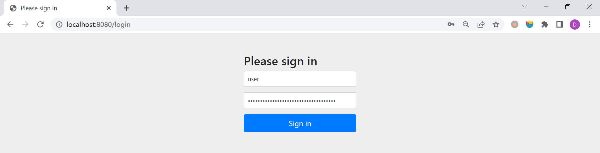

# WEEK039 - Spring Security 快速入门

[Spring Security](https://spring.io/projects/spring-security) 是一个轻量级的安全框架，可以和 Spring 项目很好地集成，提供了丰富的身份认证和授权相关的功能，而且还能防止一些常见的网络攻击。我在工作中有很多项目都使用了 Spring Security 框架，但基本上都是浅尝辄止，按照说明文档配置好就完事了，一直没有时间深入地研究过。最近在 [Reflectoring](https://reflectoring.io/) 上看到了一篇文章 [Getting started with Spring Security and Spring Boot](https://reflectoring.io/spring-security/)，写得非常全面仔细，感觉是一篇不错的 Spring Security 入门文章，于是花了一点时间拜读了一番，结合着 [官方文档](https://docs.spring.io/spring-security/reference/index.html) 对 Spring Security 学习和实践一把。

## 入门示例

我们先从一个简单的例子开始，这里我直接使用了 [week004-creating-spring-project](../week004-creating-spring-project/README.md) 中的 Hello World 示例。为了让这个示例程序开启 Spring Security 功能，我们在 `pom.xml` 文件中引入 `spring-boot-starter-security` 依赖即可：

```
<dependency>
	<groupId>org.springframework.boot</groupId>
	<artifactId>spring-boot-starter-security</artifactId>
</dependency>
```

启动程序，会在控制台日志中看到类似下面这样的信息：

```
2023-05-15 06:52:52.418  INFO 8596 --- [           main] .s.s.UserDetailsServiceAutoConfiguration : 

Using generated security password: eeb386a9-e16a-4b9b-bbc6-c054c8d263b0
```

这个是由 Spring Security 随机生成的密码。访问 `/hello` 页面，可以看到出现了一个登录页面：



输入用户名（默认为 `user`）和密码（控制台日志）登录成功后我们才能正常访问页面。默认的用户名和密码可以使用下面的配置进行修改：

```
spring.security.user.name=admin
spring.security.user.password=123456
```

## 认证和授权

应用程序的安全性归根结底包括了两个问题：**认证（Authentication）** 和 **授权（Authorization）**，认证解决的是 *你是谁？* 的问题，而授权负责解决 *你被允许做什么？*，授权也被称为 **访问控制（Access Control）**。

### 认证和 `AuthenticationManager` 接口

在 Spring Security 中，处理认证的核心是 `AuthenticationManager` 接口：

```
public interface AuthenticationManager {

	Authentication authenticate(Authentication authentication) throws AuthenticationException;
}
```

这个接口只有一个 `authenticate()` 方法，它的返回有三种情况：

* 如果认证成功，则返回认证成功后的 `Authentication`（通常带有 `authenticated=true`）；
* 如果认证失败，则抛出 `AuthenticationException` 异常；
* 如果无法判断，则返回 `null`；

`AuthenticationManager` 接口最常用的一个实现是 `ProviderManager` 类，它包含了一系列的 `AuthenticationProvider` 实例：

```
public class ProviderManager implements AuthenticationManager {

	private List<AuthenticationProvider> providers;
}
```

`AuthenticationProvider` 有点像 `AuthenticationManager`，但它有一个额外的方法 `boolean supports(Class<?> authentication)` ，允许调用者查询它是否支持给定的 `Authentication` 类型：

```
public interface AuthenticationProvider {

	Authentication authenticate(Authentication authentication) throws AuthenticationException;

	boolean supports(Class<?> authentication);
}
```

Spring Security 就是由这一系列的 `AuthenticationProvider` 来实现认证的。

## 安全防护

## Spring Security 测试

## 参考

* [Spring Security Documentation](https://docs.spring.io/spring-security/reference/index.html)
* [Getting started with Spring Security and Spring Boot](https://reflectoring.io/spring-security/)
* [【Topical Guides】Spring Security Architecture](https://spring.io/guides/topicals/spring-security-architecture/)
* [【Tutorials】Spring Security and Angular](https://spring.io/guides/tutorials/spring-security-and-angular-js/)
* [Spring Security Tutorial 《Spring Security 教程》](https://waylau.gitbooks.io/spring-security-tutorial/content/)
