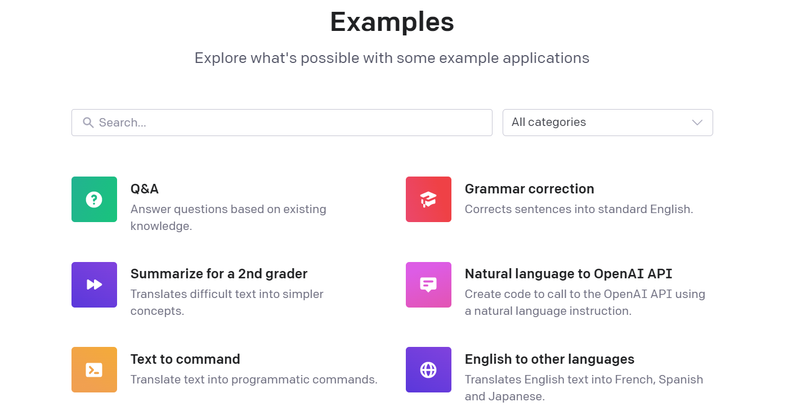
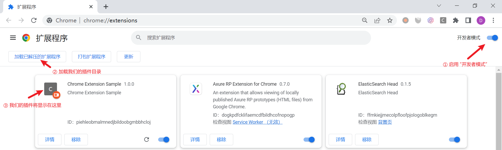
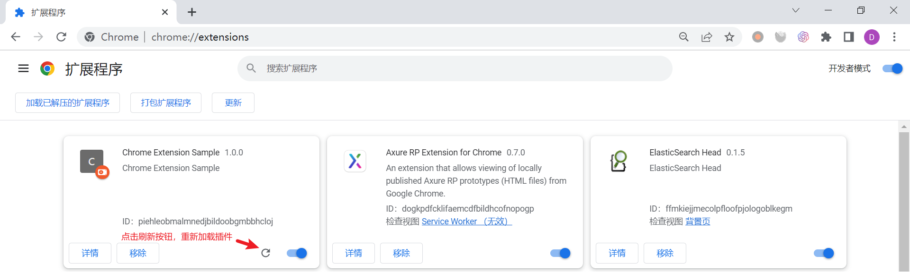
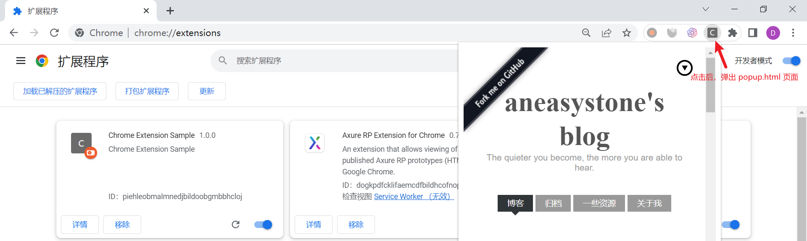
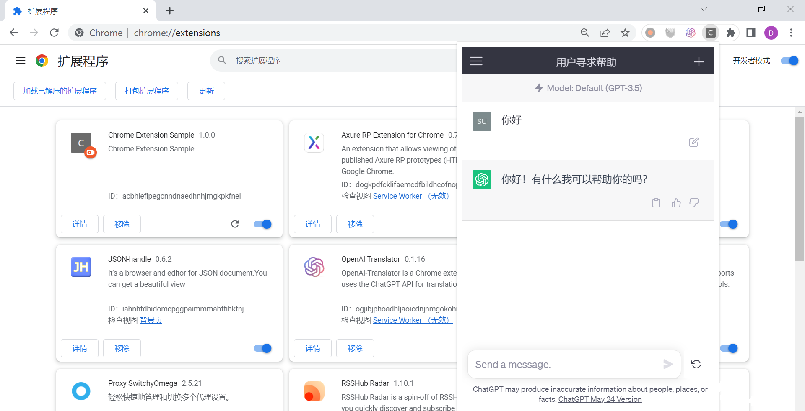

# WEEK040 - 基于 ChatGPT 实现一个划词翻译 Chrome 插件

去年 11 月，美国的 [OpenAI](https://openai.com/) 公司推出了 [ChatGPT](https://chat.openai.com/) 产品，它在发布后的 5 天内用户数就突破了 100 万，两个月后月活用户突破了 1 个亿，成为至今为止人类历史上用户数增长最快的消费级应用。ChatGPT 之所以能在全球范围内火出天际，不仅是因为它能以逼近自然语言的能力和人类对话，而且可以根据不同的提示语解决各种不同场景下的问题，它的推理能力、归纳能力、以及多轮对话能力都让世人惊叹不已，让实现通用人工智能（AGI，Artificial General Intelligence）变成为了现实，也意味着一种新型的人机交互接口由此诞生，这为更智能的 AI 产品提供了无限可能。

很快，OpenAI 推出了相应的 API 接口，所有人都可以基于这套 API 快速实现一个类似 ChatGPT 这样的产品，当然，聊天对话只是这套 API 的基本能力，OpenAI 官方网站有一个 [Examples 页面](https://platform.openai.com/examples)，展示了结合不同的提示语 OpenAI API 在更多场景下的应用：



## OpenAI API 快速入门

OpenAI 提供了很多和 AI 相关的接口，如下：

* [Models](https://platform.openai.com/docs/api-reference/models) - 用于列出所有可用的模型；
* [Completions](https://platform.openai.com/docs/api-reference/completions) - 给定一个提示语，让 AI 生成后续内容；
* [Chat](https://platform.openai.com/docs/api-reference/chat) - 给定一系列对话内容，让 AI 生成对应的回复，使用这个接口就可以实现类似 ChatGPT 的功能；
* [Edits](https://platform.openai.com/docs/api-reference/edits) - 给定一个提示语和一条指令，AI 将对提示语进行相应的修改，比如常见的语法纠错场景； 
* [Images](https://platform.openai.com/docs/api-reference/images) - 用于根据提示语生成图片，或对图片进行编辑，可以实现类似于 [Stable Diffusion](https://github.com/CompVis/stable-diffusion) 或 [Midjourney](https://www.midjourney.com/home/) 这样的 AI 绘画应用，这个接口使用的是 OpenAI 的图片生成模型 [DALL·E](https://platform.openai.com/docs/models/dall-e)；
* [Embeddings](https://platform.openai.com/docs/api-reference/embeddings) - 用于获取一个给定文本的向量表示，我们可以将结果保存到一个向量数据库中，一般用于搜索、推荐、分类、聚类等任务；
* [Audio](https://platform.openai.com/docs/api-reference/audio) - 提供了语音转文本的功能，使用了 OpenAI 的 [Whisper](https://openai.com/research/whisper) 模型；
* [Files](https://platform.openai.com/docs/api-reference/files) - 文件管理类接口，便于用户上传自己的文件进行 Fine-tuning；
* [Fine-tunes](https://platform.openai.com/docs/api-reference/fine-tunes) - 用于管理你的 Fine-tuning 任务，详细内容可参考 [Fine-tuning 教程](https://platform.openai.com/docs/guides/fine-tuning)；
* [Moderations](https://platform.openai.com/docs/api-reference/moderations) - 用于判断给定的提示语是否违反 OpenAI 的内容政策；

关于 API 的详细内容可以参考官方的 [API reference](https://platform.openai.com/docs/api-reference) 和 [Documentation](https://platform.openai.com/docs/introduction)。

其中，`Completions`、`Chat` 和 `Edits` 这三个接口都可以用于对话任务，`Completions` 主要解决的是补全问题，也就是说用户给出一段话，模型可以按照提示语续写后面的内容；`Chat` 用于处理聊天任务，它显式的定义了 `system`、`user` 和 `assistant` 三个角色，方便维护对话的语境信息和多轮对话的历史记录；`Edit` 主要用于对用户的输入进行修改和纠正。

要调用 OpenAI 的 API 接口，必须先创建你的 [API Keys](https://platform.openai.com/account/api-keys)，然后请求时像下面这样带上 `Authorization` 头即可：

```
Authorization: Bearer OPENAI_API_KEY
```

下面是直接使用 curl 调用 `Chat` 接口的示例：

```
$ curl https://api.openai.com/v1/chat/completions \
  -H "Content-Type: application/json" \
  -H "Authorization: Bearer $OPENAI_API_KEY" \
  -d '{
     "model": "gpt-3.5-turbo",
     "messages": [{"role": "user", "content": "你好！"}],
     "temperature": 0.7
   }'
```

我们可以得到类似下面的回复：

```
{
  "id": "chatcmpl-7LgiOhYPcGGwoBcEPQmQ2LaO2pObn",
  "object": "chat.completion",
  "created": 1685403440,
  "model": "gpt-3.5-turbo-0301",
  "usage": {
    "prompt_tokens": 11,
    "completion_tokens": 18,
    "total_tokens": 29
  },
  "choices": [
    {
      "message": {
        "role": "assistant",
        "content": "你好！有什么我可以为您效劳的吗？"
      },
      "finish_reason": "stop",
      "index": 0
    }
  ]
}
```

> 如果你无法访问 OpenAI 的接口，或者没有 OpenAI 的 API Keys，网上也有很多免费的方法，比如 [chatanywhere/GPT_API_free](https://github.com/chatanywhere/GPT_API_free)。

OpenAI 官方提供了 Python 和 Node.js 的 SDK 方便我们在代码中调用 OpenAI 接口，下面是使用 Node.js 调用 `Completions` 的示例：

```
import { Configuration, OpenAIApi } from "openai";

const configuration = new Configuration({
    apiKey: process.env.OPENAI_API_KEY,
});
const openai = new OpenAIApi(configuration);

const response = await openai.createCompletion({
    "model": "text-davinci-003",
    "prompt": "你好！",
    "max_tokens": 100,
    "temperature": 0
});
console.log(response.data);
```

由于 SDK 底层使用了 axios 库发请求，所以我们还可以对 axios 进行配置，比如像下面这样设置代理：

```
const response = await openai.createCompletion({
    "model": "text-davinci-003",
    "prompt": "你好！",
    "max_tokens": 100,
    "temperature": 0
}, {
    proxy: false,
    httpAgent: new HttpsProxyAgent(process.env.HTTP_PROXY),
    httpsAgent: new HttpsProxyAgent(process.env.HTTP_PROXY)
});
```

### 使用 OpenAI API 实现翻译功能

从上面的例子可以看出，OpenAI 提供的 `Completions` 或 `Chat` 只是一套用于对话任务的接口，并没有提供翻译接口，但由于它的对话已经初步具备 AGI 的能力，所以我们可以通过特定的提示语让它实现我们想要的功能。官方的 Examples 页面有一个 [English to other languages](https://platform.openai.com/examples/default-translate) 的例子，展示了如何通过提示语技术将英语翻译成法语、西班牙语和日语，我们只需要稍微修改下提示语，就可以实现英译中的功能：

```
async function translate(text) {

    const prompt = `Translate this into Simplified Chinese:\n\n${text}\n\n`
    
    const openai = createOpenAiClient();
    const response = await openai.createCompletion({
        "model": "text-davinci-003",
        "prompt": prompt,
        "max_tokens": 100,
        "temperature": 0
    }, createAxiosOptions());
    return response.data.choices[0].text
}
```

上面我们使用了 `Translate this into Simplified Chinese:` 这样的提示语，这个提示语既简单又直白，但是翻译效果却非常的不错，我们随便将一段官方文档丢给它：

```
console.log(await translate("The OpenAI API can be applied to virtually any task that involves understanding or generating natural language, code, or images."));

OpenAI API 可以应用于几乎任何涉及理解或生成自然语言、代码或图像的任务。
```

看上去，翻译的效果不亚于 Google 翻译，而且更神奇的是，由于这里的提示语并没有明确输入的文本是什么，也就意味着，我们可以将其他任何语言丢给它：

```
console.log(await translate("どの部屋が利用可能ですか？"));

这些房间可以用吗？
```

这样我们就得到了一个通用中文翻译接口。

## Chrome 插件快速入门

我在很久以前写过一篇关于 Chrome 插件的博客，[我的第一个 Chrome 扩展：Search-faster](https://www.aneasystone.com/archives/2015/06/my-first-chrome-extension-search-faster.html)，不过当时 Chrome 扩展还是 V2 版本，现在 Chrome 扩展已经发展到 V3 版本了，并且 V2 版本不再支持，于是我决定将 [Chrome 扩展的开发文档](https://developer.chrome.com/docs/extensions/) 重温一遍。

### 一个简单的例子

每个 Chrome 插件都需要有一个 `manifest.json` 清单文件，我们创建一个空目录，并在该目录下创建一个最简单的 `manifest.json` 文件：

```
{
  "name": "Chrome Extension Sample",
  "version": "1.0.0",
  "manifest_version": 3,
  "description": "Chrome Extension Sample"
}
```

这时，一个最简单的 Chrome 插件其实就已经准备好了。我们打开 Chrome 的 **管理扩展程序** 页面 `chrome://extensions/`，启用开发者模式，然后点击 “加载已解压的扩展程序”，选择刚刚创建的那个目录就可以加载我们编写的插件了：



只不过这个插件还没什么用，如果要添加实用的功能，还得添加这些比较重要的字段：

* `background`：背景页通常是 Javascript 脚本，在扩展进程中一直保持运行，它有时也被称为 **后台脚本**，它是一个集中式的事件处理器，用于处理各种扩展事件，它不能访问页面上的 DOM，但是可以和 `content_scripts` 和 `action` 之间进行通信；在 V2 版本中，`background` 可以定义为 `scripts` 或 `page`，但是在 V3 版本中已经废弃，V3 版本中统一定义为 `service_worker`；
* `content_scripts`：内容脚本可以让我们在 Web 页面上运行我们自定义的 Javascript 脚本，通过它我们可以访问或操作 Web 页面上的 DOM 元素，从而实现和 Web 页面的交互；内容脚本运行在一个独立的上下文环境中，类似于沙盒技术，这样不仅可以确保安全性，而且不会导致页面上的脚本冲突；
* `action`：在 V2 版本中，Chrome 扩展有 `browser_action` 和 `page_action` 两种表现形式，但是在 V3 版本中，它们被统一合并到 `action` 字段中了；用于当用户点击浏览器右上角的扩展图标时弹出一个 popup 页面或触发某些动作；
* `options_page`：当你的扩展参数比较多时，可以制作一个单独的选项页面对你的扩展进行配置；

接下来，我们在 `manifest.json` 文件中加上 `action` 字段：

```
  "action": {
    "default_popup": "popup.html"
  }
```

然后，编写一个简单的 `popup.html` 页面，比如直接使用 `iframe` 嵌入我的博客：

```
<!DOCTYPE html>
<html>
    <head>
        <meta charset="utf-8">
    </head>
    <body>
        <iframe src="https://www.aneasystone.com" frameborder="0" style="width: 400px;height:580px;"></iframe>
    </body>
</html>
```

修改完成后，点击扩展上的刷新按钮，将会重新加载扩展：



这样当我们点击扩展图标时，就能弹出我的博客页面了：



如果我们把页面换成 ChatGPT 的页面，那么一个 ChatGPT 的 Chrome 插件就做好了：



> `"use strict";`

### 实现划词翻译功能

## 参考

* [OpenAI API reference](https://platform.openai.com/docs/api-reference)
* [OpenAI Documentation](https://platform.openai.com/docs/introduction)
* [Documentation for Chrome extensions developers](https://developer.chrome.com/docs/extensions/)
* [有手就行，从零开始的V3版本Chrome创意插件开发攻略](https://juejin.cn/post/7121653349669142565)
* [GoogleChrome/chrome-extensions-samples](https://github.com/GoogleChrome/chrome-extensions-samples) - Chrome Extensions Samples
* [openai-translator/openai-translator](https://github.com/openai-translator/openai-translator) - 基于 ChatGPT API 的划词翻译浏览器插件和跨平台桌面端应用
* [CaTmmao/chrome-extension-translate](https://github.com/CaTmmao/chrome-extension-translate) - 谷歌插件划词翻译
