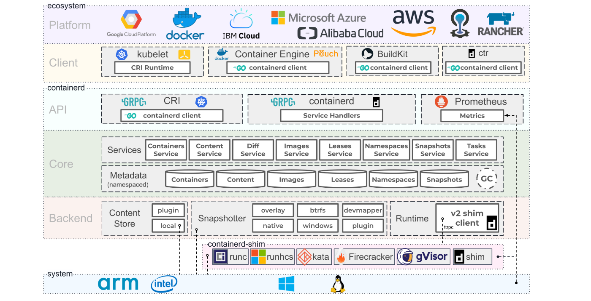
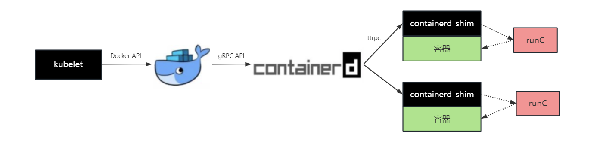
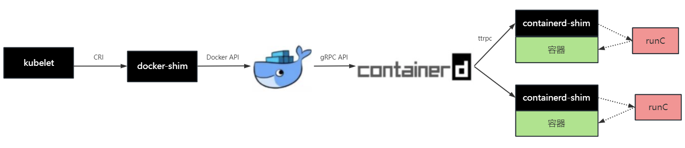
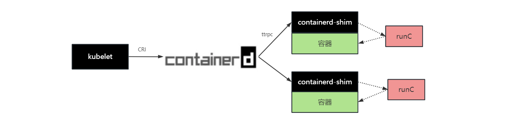

# WEEK041 - 容器运行时 containerd 学习笔记

2016 年 12 月，Docker 公司宣布将 [containerd](https://containerd.io/) 项目从 Docker Engine 中分离出来，形成一个独立的开源项目，并捐赠给 CNCF 基金会，旨在打造一个符合工业标准的容器运行时。Docker 公司之所以做出这样的决定，是因为当时在容器编排的市场上 Docker 面临着 Kubernetes 的极大挑战，将 containerd 分离，是为了方便开展 Docker Swarm 项目，不过结果大家都知道，Docker Swarm 在 Kubernetes 面前以惨败收场。

containerd 并不是直接面向最终用户的，而是主要用于集成到更上层的系统里，比如 Docker Swarm、Kubernetes 或 Mesos 等容器编排系统。containerd 通过 unix domain docket 暴露很低层的 gRPC API，上层系统可以通过这些 API 对机器上的容器整个生命周期进行管理，包括镜像的拉取、容器的启动和停止、以及底层存储和网络的管理等。下面是 containerd 官方提供的架构图：

从上图可以看出，containerd 的核心主要由一堆的 [Services](https://github.com/containerd/containerd/tree/main/api/services) 组成，通过 Content Store、Snapshotter 和 Runtime 三大技术底座，实现了 Containers、Content、Images、Leases、Namespaces 和 Snapshots 等的管理。

其中 Runtime 部分和容器的关系最为紧密，可以看到 containerd 通过 containerd-shim 来支持多种不同的 OCI Runtime，其中最为常用的 OCI Runtime 就是 [runC](https://github.com/opencontainers/runc)，所以只要是符合 OCI 标准的容器，都可以由 containerd 进行管理，值得一提的是 runC 也是由 Docker 开源的。

> [OCI](https://opencontainers.org/) 的全称为 Open Container Initiative，也就是开放容器标准，主要致力于创建一套开放的容器格式和运行时行业标准，目前包括了 Runtime、Image 和 Distribution 三大标准。

## containerd 与 Docker 和 Kubernetes 的关系

仔细观察 containerd 架构图的上面部分，可以看出 containerd 通过提供 gRPC API 来供上层应用调用，上层应用可以直接集成 containerd client 来访问它的接口，诸如 Docker Engine、BuildKit 以及 containerd 自带的命令行工具 ctr 都是这样实现的；所以从 Docker 1.11 开始，当我们执行 `docker run` 命令时，整个流程大致如下：

Docker Client 和 Docker Engine 是典型的 CS 架构，当用户执行 `docker run` 命令时，Docker Client 调用 Docker Engine 的接口，但是 Docker Engine 并不负责容器相关的事情，而是调用 containerd 的 gRPC 接口交给 containerd 来处理；不过 containerd 收到请求后，也并不会直接去创建容器，因为我们在上面提到，创建容器实际上已经有一个 OCI 标准了，这个标准有很多实现，其中 runC 是最常用的一个，所以 containerd 也不用再去实现这套标准了，而是直接调用这些现成的 OCI Runtime 即可。

不过创建容器有一点特别需要注意的地方，我们创建的容器进程需要一个父进程来做状态收集、维持 stdin 等工作的，这个父进程如果是 containerd 的话，那么如果 containerd 挂掉的话，整个机器上的所有容器都得退出了，为了解决这个问题，containerd 引入了 containerd-shim 组件；shim 的意思是垫片，正如它的名字所示，它其实是一个代理，充当着容器进程和 containerd 之间的桥梁；每当用户启动容器时，都会先启动一个 containerd-shim 进程，containerd-shim 然后调用 runC 来启动容器，之后 runC 会退出，而 containerd-shim 则会成为容器进程的父进程，负责收集容器进程的状态，上报给 containerd，并在容器中 PID 为 1 的进程退出后接管容器中的子进程进行清理，确保不会出现僵尸进程。

介绍完 containerd 与 Docker 之间的关系，我们再来看看它与 Kuberntes 的关系，从历史上看，Kuberntes 和 Docker 相爱相杀多年，一直是开源社区里热门的讨论话题。

在 Kubernetes 早期的时候，由于 Docker 风头正盛，所以 Kubernetes 选择通过直接调用 Docker API 来管理容器：

后来随着容器技术的发展，出现了很多其他的容器运行时，为了让 Kubernetes 平台支持更多的容器运行时，而不仅仅是和 Docker 绑定，Google 于是联合 Red Hat 一起推出了 [CRI](https://kubernetes.io/docs/concepts/architecture/cri/) 标准。CRI 的全称为 Container Runtime Interface，也就是容器运行时接口，它是 Kubernetes 定义的一组与容器运行时进行交互的接口，只要你实现了这套接口，就可以对接到 Kubernetes 平台上来。不过在那个时候，并没有多少容器运行时会直接去实现 CRI 接口，而是通过 shim 来适配不同的容器运行时，其中 dockershim 就是 Kubernetes 将 Docker 适配到 CRI 接口的一个实现：

很显然，这个链路太长了，好在 Docker 将 containerd 项目独立出来了，那么 Kubernetes 是否可以绕过 Docker 直接与 containerd 通信呢？答案当然是肯定的，从 containerd 1.0 开始，containerd 开发了 CRI-Containerd，可以直接与 containerd 通信，从而取代了 dockershim（[从 Kubernetes 1.24 开始](https://kubernetes.io/zh-cn/blog/2022/05/03/dockershim-historical-context/)，dockershim 已经从 Kubernetes 的代码中删除了，[cri-dockerd](https://github.com/Mirantis/cri-dockerd) 目前交由社区维护）：

到了 containerd 1.1 版本，containerd 又进一步将 CRI-Containerd 直接以插件的形式集成到了 containerd 主进程中，也就是说 containerd 已经原生支持 CRI 接口了，这使得调用链路更加简洁：

这也是目前 Kubernetes 默认的容器运行方案。不过，这条调用链路还可以继续优化下去，在 CNCF 中，还有另一个和 containerd 齐名的容器运行时项目 [cri-o](https://cri-o.io/)，它不仅支持 CRI 接口，而且创建容器的逻辑也更简单，通过 cri-o，kubelet 可以和 OCI 运行时直接对接，减少任何不必要的中间开销：

## 快速开始

### 安装 containerd

https://github.com/containerd/containerd/blob/main/docs/getting-started.md

### 使用 containerd

## 参考

* [一文搞懂容器运行时 Containerd](https://www.qikqiak.com/post/containerd-usage/)
* [Containerd 使用教程](https://icloudnative.io/posts/getting-started-with-containerd/)
* [Kubernetes 中的容器运行时](https://icloudnative.io/posts/container-runtime/)
* [开放容器标准(OCI) 内部分享](https://xuanwo.io/2019/08/06/oci-intro/)
* [docker、oci、runc以及kubernetes梳理](https://xuxinkun.github.io/2017/12/12/docker-oci-runc-and-kubernetes/)
* [走马观花云原生技术（1）：容器引擎containerd](https://taoofcoding.tech/blogs/2022-07-31/the-overview-of-cloud-native-projects-1)
* [Getting started with containerd](https://github.com/containerd/containerd/blob/main/docs/getting-started.md)
* [Mapping from dockercli to crictl](https://kubernetes.io/docs/reference/tools/map-crictl-dockercli/)
* [Container 命令ctr、crictl 命令使用说明](https://www.akiraka.net/kubernetes/1139.html)
* [Containerd shim 原理深入解读](https://icloudnative.io/posts/shim-shiminey-shim-shiminey/)
