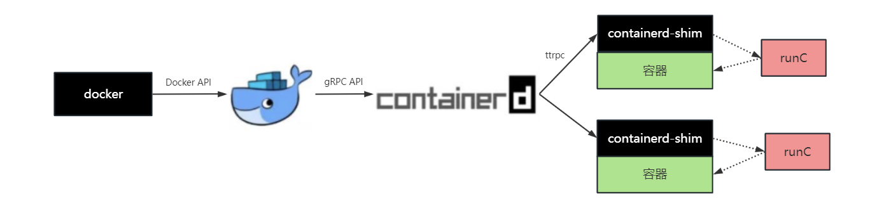

# WEEK041 - 容器运行时 containerd 学习笔记

2016 年 12 月，Docker 公司宣布将 [containerd](https://containerd.io/) 项目从 Docker Engine 中分离出来，形成一个独立的开源项目，并捐赠给 CNCF 基金会，旨在打造一个符合工业标准的容器运行时。Docker 公司之所以做出这样的决定，是因为当时在容器编排的市场上 Docker 面临着 Kubernetes 的极大挑战，将 containerd 分离，是为了方便开展 Docker Swarm 项目，不过结果大家都知道，Docker Swarm 在 Kubernetes 面前以惨败收场。

从 Docker 1.11 开始，当我们执行 `docker run` 命令时，整个流程大致如下：

http://www.dockerinfo.net/4038.html

## 参考

* [一文搞懂容器运行时 Containerd](https://www.qikqiak.com/post/containerd-usage/)
* [Containerd 使用教程](https://icloudnative.io/posts/getting-started-with-containerd/)
* [Kubernetes 中的容器运行时](https://icloudnative.io/posts/container-runtime/)
* [走马观花云原生技术（1）：容器引擎containerd](https://taoofcoding.tech/blogs/2022-07-31/the-overview-of-cloud-native-projects-1)
* [Getting started with containerd](https://github.com/containerd/containerd/blob/main/docs/getting-started.md)
* [Mapping from dockercli to crictl](https://kubernetes.io/docs/reference/tools/map-crictl-dockercli/)
* [Container 命令ctr、crictl 命令使用说明](https://www.akiraka.net/kubernetes/1139.html)
