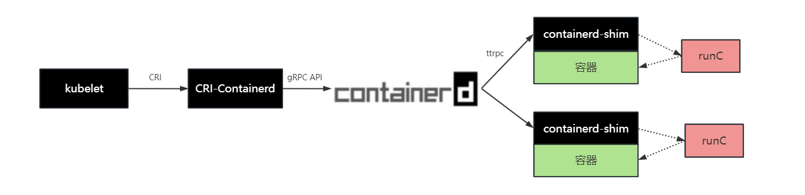

# WEEK041 - 容器运行时 containerd 学习笔记

2016 年 12 月，Docker 公司宣布将 [containerd](https://containerd.io/) 项目从 Docker Engine 中分离出来，形成一个独立的开源项目，并捐赠给 CNCF 基金会，旨在打造一个符合工业标准的容器运行时。Docker 公司之所以做出这样的决定，是因为当时在容器编排的市场上 Docker 面临着 Kubernetes 的极大挑战，将 containerd 分离，是为了方便开展 Docker Swarm 项目，不过结果大家都知道，Docker Swarm 在 Kubernetes 面前以惨败收场。

containerd 并不是直接面向最终用户的，而是主要用于集成到更上层的系统里，比如 Docker Swarm、Kubernetes 或 Mesos 等容器编排系统。containerd 通过 unix domain docket 暴露很低层的 gRPC API，上层系统可以通过这些 API 对机器上的容器整个生命周期进行管理，包括镜像的拉取、容器的启动和停止、以及底层存储和网络的管理等。下面是 containerd 官方提供的架构图：


从上图可以看出，containerd 的核心主要由一堆的 [Services](https://github.com/containerd/containerd/tree/main/api/services) 组成，通过 Content Store、Snapshotter 和 Runtime 三大技术底座，实现了 Containers、Content、Images、Leases、Namespaces 和 Snapshots 等的管理。

其中 Runtime 部分和容器的关系最为紧密，可以看到 containerd 通过 containerd-shim 来支持多种不同的 OCI runtime，其中最为常用的 OCI runtime 就是 [runc](https://github.com/opencontainers/runc)，所以只要是符合 OCI 标准的容器，都可以由 containerd 进行管理，值得一提的是 runc 也是由 Docker 开源的。

> [OCI](https://opencontainers.org/) 的全称为 Open Container Initiative，也就是开放容器标准，主要致力于创建一套开放的容器格式和运行时行业标准，目前包括了 Runtime、Image 和 Distribution 三大标准。

## containerd 与 Docker 和 Kubernetes 的关系

仔细观察 containerd 架构图的上面部分，可以看出 containerd 通过提供 gRPC API 来供上层应用调用，上层应用可以直接集成 containerd client 来访问它的接口，诸如 Docker Engine、BuildKit 以及 containerd 自带的命令行工具 ctr 都是这样实现的；所以从 Docker 1.11 开始，当我们执行 `docker run` 命令时，整个流程大致如下：


Docker Client 和 Docker Engine 是典型的 CS 架构，当用户执行 `docker run` 命令时，Docker Client 调用 Docker Engine 的接口，但是 Docker Engine 并不负责容器相关的事情，而是调用 containerd 的 gRPC 接口交给 containerd 来处理；不过 containerd 收到请求后，也并不会直接去创建容器，因为我们在上面提到，创建容器实际上已经有一个 OCI 标准了，这个标准有很多实现，其中 runc 是最常用的一个，所以 containerd 也不用再去实现这套标准了，而是直接调用这些现成的 OCI Runtime 即可。

不过创建容器有一点特别需要注意的地方，我们创建的容器进程需要一个父进程来做状态收集、维持 stdin 等工作的，这个父进程如果是 containerd 的话，那么如果 containerd 挂掉的话，整个机器上的所有容器都得退出了，为了解决这个问题，containerd 引入了 containerd-shim 组件；shim 的意思是垫片，正如它的名字所示，它其实是一个代理，充当着容器进程和 containerd 之间的桥梁；每当用户启动容器时，都会先启动一个 containerd-shim 进程，containerd-shim 然后调用 runc 来启动容器，之后 runc 会退出，而 containerd-shim 则会成为容器进程的父进程，负责收集容器进程的状态，上报给 containerd，并在容器中 PID 为 1 的进程退出后接管容器中的子进程进行清理，确保不会出现僵尸进程。

介绍完 containerd 与 Docker 之间的关系，我们再来看看它与 Kuberntes 的关系，从历史上看，Kuberntes 和 Docker 相爱相杀多年，一直是开源社区里热门的讨论话题。

在 Kubernetes 早期的时候，由于 Docker 风头正盛，所以 Kubernetes 选择通过直接调用 Docker API 来管理容器：


后来随着容器技术的发展，出现了很多其他的容器运行时，为了让 Kubernetes 平台支持更多的容器运行时，而不仅仅是和 Docker 绑定，Google 于是联合 Red Hat 一起推出了 [CRI](https://kubernetes.io/docs/concepts/architecture/cri/) 标准。CRI 的全称为 Container Runtime Interface，也就是容器运行时接口，它是 Kubernetes 定义的一组与容器运行时进行交互的接口，只要你实现了这套接口，就可以对接到 Kubernetes 平台上来。不过在那个时候，并没有多少容器运行时会直接去实现 CRI 接口，而是通过 shim 来适配不同的容器运行时，其中 dockershim 就是 Kubernetes 将 Docker 适配到 CRI 接口的一个实现：


很显然，这个链路太长了，好在 Docker 将 containerd 项目独立出来了，那么 Kubernetes 是否可以绕过 Docker 直接与 containerd 通信呢？答案当然是肯定的，从 containerd 1.0 开始，containerd 开发了 CRI-Containerd，可以直接与 containerd 通信，从而取代了 dockershim（[从 Kubernetes 1.24 开始](https://kubernetes.io/zh-cn/blog/2022/05/03/dockershim-historical-context/)，dockershim 已经从 Kubernetes 的代码中删除了，[cri-dockerd](https://github.com/Mirantis/cri-dockerd) 目前交由社区维护）：



到了 containerd 1.1 版本，containerd 又进一步将 CRI-Containerd 直接以插件的形式集成到了 containerd 主进程中，也就是说 containerd 已经原生支持 CRI 接口了，这使得调用链路更加简洁：


这也是目前 Kubernetes 默认的容器运行方案。不过，这条调用链路还可以继续优化下去，在 CNCF 中，还有另一个和 containerd 齐名的容器运行时项目 [cri-o](https://cri-o.io/)，它不仅支持 CRI 接口，而且创建容器的逻辑也更简单，通过 cri-o，kubelet 可以和 OCI 运行时直接对接，减少任何不必要的中间开销：


## 快速开始

这一节主要学习 containerd 的安装和使用。

### 安装 containerd

首先从 containerd 的 [Release 页面](https://github.com/containerd/containerd/releases) 下载最新版本：

```
$ curl -LO https://github.com/containerd/containerd/releases/download/v1.7.2/containerd-1.7.2-linux-amd64.tar.gz
```

然后将其解压到 `/usr/local/bin` 目录：

```
$ tar Cxzvf /usr/local containerd-1.7.2-linux-amd64.tar.gz 
bin/
bin/containerd-shim-runc-v1
bin/containerd-shim-runc-v2
bin/containerd-stress
bin/containerd
bin/containerd-shim
bin/ctr
```

其中，`containerd` 是服务端，我们可以直接运行：

```
$ containerd
INFO[2023-06-18T14:28:14.867212652+08:00] starting containerd revision=0cae528dd6cb557f7201036e9f43420650207b58 version=v1.7.2
...
INFO[2023-06-18T14:28:14.922388455+08:00] serving... address=/run/containerd/containerd.sock.ttrpc
INFO[2023-06-18T14:28:14.922477258+08:00] serving... address=/run/containerd/containerd.sock
INFO[2023-06-18T14:28:14.922529910+08:00] Start subscribing containerd event
INFO[2023-06-18T14:28:14.922570820+08:00] Start recovering state
INFO[2023-06-18T14:28:14.922636858+08:00] Start event monitor
INFO[2023-06-18T14:28:14.922653276+08:00] Start snapshots syncer
INFO[2023-06-18T14:28:14.922662467+08:00] Start cni network conf syncer for default
INFO[2023-06-18T14:28:14.922671149+08:00] Start streaming server
INFO[2023-06-18T14:28:14.922689846+08:00] containerd successfully booted in 0.060348s
```

`ctr` 是客户端，运行 `ctr version` 确认 containerd 是否安装成功：

```
$ ctr version
Client:
  Version:  v1.7.2
  Revision: 0cae528dd6cb557f7201036e9f43420650207b58
  Go version: go1.20.4

Server:
  Version:  v1.7.2
  Revision: 0cae528dd6cb557f7201036e9f43420650207b58
  UUID: 9eb2cbd4-8c1d-4321-839b-a8a4fc498de8
```

#### 安装 runc

安装好 containerd 之后，我们就可以使用 ctr 执行一些基本操作了，比如使用 `ctr image pull` 下载镜像：

```
$ ctr image pull docker.io/library/nginx:alpine
docker.io/library/nginx:alpine:                                                   resolved
index-sha256:2d194184b067db3598771b4cf326cfe6ad5051937ba1132b8b7d4b0184e0d0a6:    exists  
manifest-sha256:2d4efe74ef541248b0a70838c557de04509d1115dec6bfc21ad0d66e41574a8a: exists  
layer-sha256:768e67c521a97f2acf0382a9750c4d024fc1e541e22bab2dec1aad36703278f1:    exists  
config-sha256:4937520ae206c8969734d9a659fc1e6594d9b22b9340bf0796defbea0c92dd02:   exists  
layer-sha256:4db1b89c0bd13344176ddce2d093b9da2ae58336823ffed2009a7ea4b62d2a95:    exists  
layer-sha256:bd338968799fef766509223449d72392692f1f56802da9059ae3f0965c2885e2:    exists  
layer-sha256:6a107772494d184e0fddf5d99c877e2fa8d07d1d47b714c17b7d20eba1da01c6:    exists  
layer-sha256:9f05b0cc5f6e8010689a6331bad9ca02c62caa226b7501a64d50dcca0847dcdb:    exists  
layer-sha256:4c5efdb87c4a2350cc1c2781a80a4d3e895447007d9d8eac1e743bf80dd75c84:    exists  
layer-sha256:c8794a7158bff7f518985e76c590029ccc6b4c0f6e66e82952c3476c095225c9:    exists  
layer-sha256:8de2a93581dcb1cc62dd7b6e1620bc8095befe0acb9161d5f053a9719e145678:    exists  
elapsed: 2.8 s                                                                    total:   0.0 B (0.0 B/s)                                         
unpacking linux/amd64 sha256:2d194184b067db3598771b4cf326cfe6ad5051937ba1132b8b7d4b0184e0d0a6...
done: 23.567287ms	

```

> 注意这里和 docker pull 的不同，镜像名称需要写全称。

不过这个时候，我们还不能运行镜像，我们不妨用 `ctr run` 命令运行一下试试：

```
$ ctr run docker.io/library/nginx:alpine nginx
ctr: failed to create shim task: 
	OCI runtime create failed: 
		unable to retrieve OCI runtime error (open /run/containerd/io.containerd.runtime.v2.task/default/nginx/log.json: no such file or directory):
			exec: "runc": executable file not found in $PATH: unknown
```

正如前文所述，这是因为 containerd 依赖 OCI runtime 来进行容器管理，containerd 默认的 OCI runtime 是 runc，我们还没有安装它。runc 的安装也非常简单，直接从其项目的 [Releases 页面](https://github.com/opencontainers/runc/releases) 下载最新版本：

```
$ curl -LO https://github.com/opencontainers/runc/releases/download/v1.1.7/runc.amd64
```

并将其安装到 `/usr/local/sbin` 目录即可：

```
$ install -m 755 runc.amd64 /usr/local/sbin/runc
```

使用 `ctr container rm` 删除刚刚运行失败的容器：

```
$ ctr container rm nginx
```

然后再使用 `ctr run` 重新运行：

```
$ ctr run docker.io/library/nginx:alpine nginx
/docker-entrypoint.sh: /docker-entrypoint.d/ is not empty, will attempt to perform configuration
/docker-entrypoint.sh: Looking for shell scripts in /docker-entrypoint.d/
/docker-entrypoint.sh: Launching /docker-entrypoint.d/10-listen-on-ipv6-by-default.sh
10-listen-on-ipv6-by-default.sh: info: Getting the checksum of /etc/nginx/conf.d/default.conf
10-listen-on-ipv6-by-default.sh: info: Enabled listen on IPv6 in /etc/nginx/conf.d/default.conf
/docker-entrypoint.sh: Sourcing /docker-entrypoint.d/15-local-resolvers.envsh
/docker-entrypoint.sh: Launching /docker-entrypoint.d/20-envsubst-on-templates.sh
/docker-entrypoint.sh: Launching /docker-entrypoint.d/30-tune-worker-processes.sh
/docker-entrypoint.sh: Configuration complete; ready for start up
2023/06/18 07:04:52 [notice] 1#1: using the "epoll" event method
2023/06/18 07:04:52 [notice] 1#1: nginx/1.25.1
2023/06/18 07:04:52 [notice] 1#1: built by gcc 12.2.1 20220924 (Alpine 12.2.1_git20220924-r4) 
2023/06/18 07:04:52 [notice] 1#1: OS: Linux 3.10.0-1160.el7.x86_64
2023/06/18 07:04:52 [notice] 1#1: getrlimit(RLIMIT_NOFILE): 1024:1024
2023/06/18 07:04:52 [notice] 1#1: start worker processes
2023/06/18 07:04:52 [notice] 1#1: start worker process 30
```

可以看到此时容器正常启动了，不过目前这个容器还不具备网络能力，所以我们无法从外部访问它，可以使用 `ctr task exec` 进入容器：

```
$ ctr task exec -t --exec-id nginx nginx sh
```

在容器内部验证 nginx 服务是否正常：

```
/ # curl localhost:80
<!DOCTYPE html>
<html>
<head>
<title>Welcome to nginx!</title>
<style>
html { color-scheme: light dark; }
body { width: 35em; margin: 0 auto;
font-family: Tahoma, Verdana, Arial, sans-serif; }
</style>
</head>
<body>
<h1>Welcome to nginx!</h1>
<p>If you see this page, the nginx web server is successfully installed and
working. Further configuration is required.</p>

<p>For online documentation and support please refer to
<a href="http://nginx.org/">nginx.org</a>.<br/>
Commercial support is available at
<a href="http://nginx.com/">nginx.com</a>.</p>

<p><em>Thank you for using nginx.</em></p>
</body>
</html>
```

#### 安装 CNI 插件

https://blog.frognew.com/2021/04/relearning-container-03.html

https://blog.51cto.com/flyfish225/5367096

https://bigpigeon.org/post/containerd-tutorial-two/

https://mdnice.com/writing/fefebebf42314d458df4cf6fc8dbdec0

https://github.com/containernetworking/plugins/releases

```
$ curl -LO https://github.com/containernetworking/plugins/releases/download/v1.3.0/cni-plugins-linux-amd64-v1.3.0.tgz
```

```
$ mkdir -p /opt/cni/bin
$ tar Cxzvf /opt/cni/bin cni-plugins-linux-amd64-v1.3.0.tgz 
./
./loopback
./bandwidth
./ptp
./vlan
./host-device
./tuning
./vrf
./sbr
./tap
./dhcp
./static
./firewall
./macvlan
./dummy
./bridge
./ipvlan
./portmap
./host-local
```

### 操作 containerd

https://github.com/containerd/containerd/blob/main/docs/getting-started.md

#### 使用 ctr 操作 containerd

#### 使用 nerdctl 操作 containerd

#### 使用 crictl 操作 containerd

## 参考

* [一文搞懂容器运行时 Containerd](https://www.qikqiak.com/post/containerd-usage/)
* [Containerd 使用教程](https://icloudnative.io/posts/getting-started-with-containerd/)
* [Kubernetes 中的容器运行时](https://icloudnative.io/posts/container-runtime/)
* [开放容器标准(OCI) 内部分享](https://xuanwo.io/2019/08/06/oci-intro/)
* [docker、oci、runc以及kubernetes梳理](https://xuxinkun.github.io/2017/12/12/docker-oci-runc-and-kubernetes/)
* [走马观花云原生技术（1）：容器引擎containerd](https://taoofcoding.tech/blogs/2022-07-31/the-overview-of-cloud-native-projects-1)
* [Getting started with containerd](https://github.com/containerd/containerd/blob/main/docs/getting-started.md)
* [Mapping from dockercli to crictl](https://kubernetes.io/docs/reference/tools/map-crictl-dockercli/)
* [Container 命令ctr、crictl 命令使用说明](https://www.akiraka.net/kubernetes/1139.html)
* [Containerd shim 原理深入解读](https://icloudnative.io/posts/shim-shiminey-shim-shiminey/)
