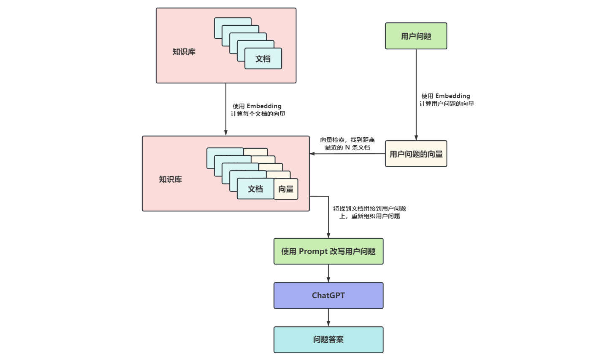

# WEEK042 - 基于 LangChain 打造的本地知识库助手

基于不同的提示语，可以让 ChatGPT 实现各种不同的功能，比如在 [week040-chrome-extension-with-chatgpt](../week040-chrome-extension-with-chatgpt/README.md) 这篇文章中，我基于 ChatGPT 实现了一个翻译助手，OpenAI 官方的 [Examples 页面](https://platform.openai.com/examples) 也列出了提示语的更多示例，展示了 ChatGPT 在问答、翻译、文本总结、代码生成、推理等各方面的能力。

尽管 ChatGPT 的表现非常亮眼，但是它也有其局限性，由于它是基于互联网上公开的资料训练的，所以它只能回答公开领域的知识的问题，比如你问它是谁发明了空调，第一个登月的人是谁，它都能回答得头头是道，但是对于一些私有领域的知识，比如你问它张三家的宠物狗叫什么名字，它就鞭长莫及了。

## Fine tuning vs. Embedding

打造私有领域的知识库助手对于企业和个人来说是一个非常重要的应用场景，可以实现个性化定制化的问答效果，要实现这个功能，一般有两种不同的方式：[Fine tuning](https://platform.openai.com/docs/guides/fine-tuning) 和 [Embedding](https://platform.openai.com/docs/guides/embeddings)。Fine tuning 又被称为微调，它可以在不改动预训练模型的基础上，对特定任务进一步训练，以适应特定数据和要求。[OpenAI Cookbook](https://github.com/openai/openai-cookbook) 中有一个 [基于 Fine tuning 实现 QA 的例子](https://github.com/openai/openai-cookbook/blob/main/examples/fine-tuned_qa)，不过官方已经不推荐使用这种方式来做知识问答任务，因为 Fine tuning 更适合于学习新任务或新模式，而不是接受新信息，比如我们可以使用 Fine tuning 让模型按特定的语气或风格来回答问题，或者让模型按固定的格式来回答问题。

相对应的，Embedding 更适合知识问答任务，而且 Embedding 技术还顺便解决了大模型的一个问题，那就是上下文限制，比如 OpenAI 的 GPT-3.5 模型，它的限制在 4k - 16k 个 token，就算是 GPT-4 模型，最多也只支持 32k 个 token，所以，如果你的知识库内容长度超出了限制，我们就不能直接让 ChatGPT 对其进行总结并回答问题。通过 Embedding 技术，我们可以使用语义搜索来快速找到相关的文档，然后只将相关的文档内容注入到大模型的上下文窗口中，让模型来生成特定问题的答案，从而解决大模型的限制问题。这种做法比 Fine tuning 速度更快，而且不需要训练，使用上也更灵活。

Embedding 也被称为嵌入，它是一种数据表征的方式，最早可以追溯到 1986 年 Hinton 的论文 [《Learning distributed representations of concepts》](http://www.cs.toronto.edu/~hinton/absps/families.pdf)，他在论文中提出了分布式表示（Distributed Representation）的概念，这个概念后来被人们称为词向量或词嵌入（Word Embedding），使用它可以将单词表示成一个数字向量，同时可以保证相关或相似的词在距离上很接近。Embedding 技术发展到今天，已经可以将任意对象向量化，包括文本、图像甚至音视频，在搜索和推荐等业务中有着广泛的应用。

知道了 Embedding 技术，我们就可以理解如何使用 Embedding 实现本地知识问答了，整个处理流程如下图所示：



### 构建本地知识库

假设我们有一个本地知识库，这可能是某个产品的使用手册，或者某个公司的内部文档，又或者是你自己的一些私人资料，我们希望 ChatGPT 能够回答关于这些本地知识的问题。根据上面的流程图，我们首先需要对我们的知识库进行 Embedding 处理，将知识库中的所有文档向量化，这里其实涉及两个问题：

1. 如何计算每个文档的向量？
2. 如何存储每个文档的向量？

#### 如何计算文档的向量？

对此，前辈大佬们提出了很多种不同的解决方案，比如 Word2vec、GloVe、FastText、ELMo、BERT、GPT 等等，不过这些都是干巴巴的论文和算法，对我们这种普通用户来说，可以直接使用一些训练好的模型，这里有一个常用的 [Embedding 模型列表](https://towhee.io/tasks/detail/pipeline/sentence-similarity)，其中 `text-embedding-ada-002` 是 OpenAI 目前提供的效果最好的第二代 Embedding 模型，相比于第一代的 `davinci`、`curie` 和 `babbage` 等模型，效果更好，价格更便宜，OpenAI 提供的 [/v1/embeddings](https://platform.openai.com/docs/api-reference/embeddings/create) 接口就可以使用该模型，生成任意文本的向量。使用 OpenAI 的 Python SDK 调用该接口：

```
import os
import openai

openai.api_key = os.getenv("OPENAI_API_KEY")

text_string = "sample text"
model_id = "text-embedding-ada-002"

embedding = openai.Embedding.create(input=text_string, model=model_id)['data'][0]['embedding']
print(embedding)
```

输出的是一个长度为 1536 的数组，也可以说是一个 1536 维的向量：

```
[
    -0.0022714741062372923, 
    0.009765749797224998, 
    -0.018565727397799492,
    ...
     0.0037550802808254957, 
     -0.004177606198936701
]
```

#### 如何存储文档的向量？

第二个问题是计算出来的向量该如何存储？实际上，自从大模型兴起之后，Embedding 和向量数据库就变成了当前 AI 领域炙手可热的话题，一时间，涌出了很多专注于向量数据库的公司或项目，比如 [Pinecone](https://www.pinecone.io/)、[Weaviate](https://weaviate.io/)、[Qdrant](https://qdrant.tech/)、[Chroma](https://docs.trychroma.com/)、[Milvus](https://milvus.io/) 等，很多老牌数据库厂商也纷纷加入向量数据库的阵营，比如 [ElasticSearch](https://www.elastic.co/cn/elasticsearch/)、[Cassandra](https://cassandra.apache.org/_/index.html)、[Postgres](https://www.postgresql.org/)、[Redis](https://redis.io/)、[Mongo](https://www.mongodb.com/) 等。

我们这里使用 Qdrant 作为示例，首先通过 Docker 在本地启动 Qdrant 服务：

```
$ docker run -p 6333:6333 -v $(pwd)/data:/qdrant/storage qdrant/qdrant
```

然后通过下面的代码创建一个名为 `kb` 的向量库：

```
from qdrant_client import QdrantClient
from qdrant_client.http.models import Distance, VectorParams

client = QdrantClient("127.0.0.1", port=6333)
client.recreate_collection(
    collection_name='kb',
    vectors_config=VectorParams(size=1536, distance=Distance.COSINE),
)
```

注意我们指定向量维度为 1536，这是 OpenAI Embedding 输出的维度，另外指定距离为 `COSINE`，它决定如何度量向量之间的相似度，这个我们后面再讲。

作为示例，我们将一个文件 `kb.txt` 作为本地知识库，文件中的每一行代表一条知识，比如：

```
小红的好朋友叫小明，他们是同班同学。
小明家有一条宠物狗，叫毛毛，这是他爸从北京带回来的。
小红家也有一条宠物狗，叫大白，非常听话。
小华是小明的幼儿园同学，从小就欺负他。
```

然后我们读取该知识库文件，依次计算每一行的向量，并将其保存在 `kb` 库中：

```
with open('kb.txt', 'r', encoding='utf-8') as f:
    for index, line in enumerate(tqdm.tqdm(f.readlines())):
        embedding = to_embedding(line)
        client.upsert(
            collection_name='kb',
            wait=True,
            points=[
                PointStruct(id=index+1, vector=embedding, payload={"text": line}),
            ],
        )
```

在保存向量时，可以通过 payload 带上一些元数据，比如这里将原始的文本内容和向量一起保存，这样可以方便后面检索时知道向量和原始文本的对应关系。

至此我们的本地知识库就初始化好了。

### 实现本地知识问答助手

构建好知识库之后，我们就可以基于知识库实现本地知识库助手了。接下来要解决的问题也有两个：

1. 如何从知识库中检索出和问题最相关的文档？
2. 如何让 ChatGPT 回答关于知识库的问题？

#### 如何检索知识？

传统的检索方式是关键词检索，比如 Elasticsearch 通过分词和倒排索引，让我们可以快速搜出含有关键词的文档，再通过一定的排序规则，比如文档中包含的关键词越多得分越高，就可以检索出和问题最相关的文档。不过这种方式面临非常多的问题，比如一个关键词可能有很多同义词，用户搜 “番茄” 时可能就搜不到包含 “西红柿” 的文档。另外，我们还可能需要对用户的输入进行纠错，对用户进行意图识别，不同语言的处理等等，或者用户希望搜索图片、音频或视频，这时传统的检索方式就捉襟见肘了。

我们上面已经介绍过 Embedding 技术，通过 Embedding 技术可以将任何事物表示成一个向量，而且最牛的地方是，它可以保证相关或相似的事物在距离上很接近，或者说有着相似的语义，这就给我们提供了一种新的检索方式：语义搜索（Semantic Search）。

所以想要搜索出和用户问题最相关的文档，我们可以先将用户问题通过 Embedding 转换为向量，然后在上面构建好的知识库中搜索和问题向量最接近的向量及对应的文档即可。那么怎么计算两个向量之间的距离呢？其实我们在上面创建库时已经使用过 `COSINE`，除了 `COSINE`，Qdrant 还支持使用 `EUCLID` 或 `DOT` 等方法：

* `COSINE` - 余弦相似度，计算两个向量之间的夹角，夹角越小，向量之间越相似；
* `EUCLID` - 欧几里得距离，计算两个向量之间的直线距离，距离越近，向量之间越相似；这种度量方法简单直接，在 2 维或 3 维等低维空间表现得很好，但是在高维空间，每个向量之间的欧几里得距离都很靠近，无法起到度量相似性的作用；
* `DOT` - 点积相似度，点积是两个向量的长度与它们夹角余弦的积，点积越大，向量之间就越相似。

在机器学习和数据挖掘中还有很多度量距离的方法：

* 闵可夫斯基距离
* 曼哈顿距离
* 切比雪夫距离
* 马氏距离
* 皮尔逊相关系数
* 汉明距离
* 杰卡德相似系数
* 编辑距离
* DTW 距离
* KL 散度

不过这些度量方法在语义搜索中用的不多，感兴趣的同学可以进一步了解之。

在语义搜索中，用的最多的是余弦相似度。当计算出用户问题的向量之后，我们就可以遍历知识库中的所有向量，依次计算每个向量和问题向量之间的距离，然后按距离排序，取距离最近的几条数据，就能得到和用户问题最相似的文档了。

不过很显然这里存在一个问题，如果知识库中的向量比较多，这种暴力检索的方法就会非常耗时。为了加快检索向量库的速度，人们提出了很多种 ANN（Approximate Nearest Neighbor，相似最近邻）算法，算法的基本思路是通过对全局向量空间进行分割，将其分割成很多小的子空间，在搜索的时候，通过某种方式，快速锁定在某一个或某几个子空间，然后在这些子空间里做遍历。可以粗略地将这些子空间认为是向量数据库的索引。常见的 ANN 算法可以分为三大类：基于树的方法、基于哈希的方法、基于矢量量化的方法，比如 Annoy、KD 树、LSH（局部敏感哈希）、PQ（乘积量化）、HNSW 等。

#### 如何向 ChatGPT 提问？

```
已知我们有上下文：文本块 1，文本块 2，文本块 3。
现在有用户的问题：他们对 xyz 说了什么？
请根据给定的上下文，如实回答用户的问题。
如果你不能回答，那么如实告诉用户“我无法回答这个问题”。
```

## 基于 LangChain 实现本地知识库助手

https://langchain-langchain.vercel.app/docs/get_started/introduction.html

## 参考

* [快速了解 OpenAI 的 fine-tune 和 Embedding 能力](https://zhuanlan.zhihu.com/p/609359047)
* [基于开源embedding模型的中文向量效果测试](https://github.com/JovenChu/embedding_model_test)
* [向量数据库是如何工作的？](https://mp.weixin.qq.com/s/rwFkl4My9GQYOkJEWwk3bg)
* [浅谈 Semantic Search](https://mp.weixin.qq.com/s/ymlGAhS40ImoaAZviq5lZw)
* [图像检索：再叙ANN Search](https://yongyuan.name/blog/ann-search.html)
* [Question-answering-using-embeddings-based-search](https://github.com/openai/openai-cookbook/blob/main/examples/Question_answering_using_embeddings.ipynb)
* [推荐LangChain学习过程中的一些资料](https://mp.weixin.qq.com/s/4DjoDeneBWW0DrkUmRMD4w)
* [LangChain 的中文入门教程](https://github.com/liaokongVFX/LangChain-Chinese-Getting-Started-Guide)
* [LangChain and LlamaIndex Projects Lab Book: Hooking Large Language Models Up to the Real World](https://leanpub.com/langchain)
* [基于LangChain构建大语言模型“套壳”应用](https://developer.aliyun.com/article/1218421)
* [chat-langchain，一个优秀的本地文档QA问答](https://mp.weixin.qq.com/s/O67cECXmOXsXccLDcP4akg)
* [让 OpenAI 更 Open，在 ChatGPT 里自由接入数据源](https://soulteary.com/2023/05/19/make-openai-more-open-and-freely-access-data-sources-in-chatgpt.html)
* [10分钟打造基于ChatGPT的Markdown智能文档](https://mp.weixin.qq.com/s/JGwOg5BT2rgfhrBO9JBNOA)

## 更多

### 类似项目

* [Fast GPT](https://fastgpt.run/) - 三分钟搭建 AI 知识库
* [Quivr](https://github.com/StanGirard/quivr) - Your Second Brain, Empowered by Generative AI
* [Local Mind](https://github.com/nigulasikk/local-mind) - 一个本地文件问答应用
* [document.ai](https://github.com/GanymedeNil/document.ai) - 基于向量数据库与GPT3.5的通用本地知识库方案
* [LlamaIndex：面向QA系统的全新文档摘要索引](https://mp.weixin.qq.com/s/blDKylt4FyZfeSIV6M1d2g)
* [pdf.ai](https://pdf.ai/) - Chat with any document
* [langchain-ChatGLM](https://github.com/imClumsyPanda/langchain-ChatGLM) - 基于本地知识库的 ChatGLM 等大语言模型应用实现
* [BabyAGI](https://github.com/yoheinakajima/babyagi)
* [WritingGPT: 基于ChatGPT和AutoGPT打造个人写作团队](https://mp.weixin.qq.com/s/RJC4pEIsmcebqGJw8AOQig)
* [DB-GPT](https://github.com/csunny/DB-GPT) - Revolutionizing Database Interactions with Private LLM Technology

### 可视化

* [FlowiseAI/Flowise](https://github.com/FlowiseAI/Flowise) - Drag & drop UI to build your customized LLM flow using LangchainJS
* [logspace-ai/langflow](https://github.com/logspace-ai/langflow) - LangFlow is a UI for LangChain, designed with react-flow to provide an effortless way to experiment and prototype flows.
