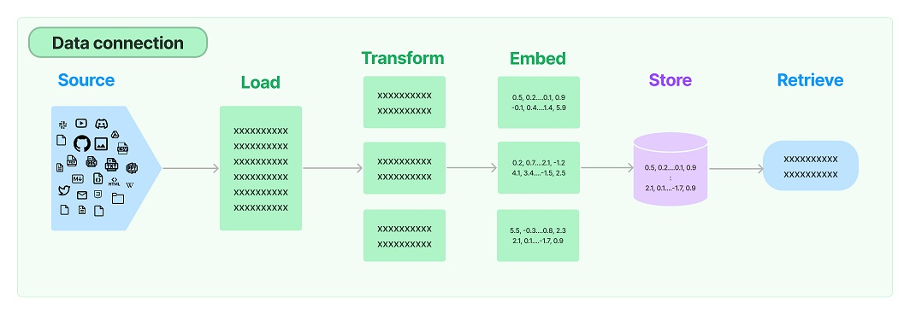

# WEEK043 - 大模型应用开发框架 LangChain 学习笔记

一场关于大模型的战役正在全世界激烈地上演着，国内外的各大科技巨头和研究机构纷纷投入到这场战役中，光是写名字就能罗列出一大串，比如国外的有 OpenAI 的 [GPT-4](https://openai.com/gpt-4)，Meta 的 [LLaMa](https://github.com/facebookresearch/llama)，Stanford University 的 [Alpaca](https://github.com/tatsu-lab/stanford_alpaca)，Google 的 [LaMDA](https://blog.google/technology/ai/lamda/) 和 [PaLM 2](https://ai.google/discover/palm2/)，Anthropic 的 [Claude](https://www.anthropic.com/index/introducing-claude)，Databricks 的 [Dolly](https://github.com/databrickslabs/dolly)，国内的有百度的 [文心](https://wenxin.baidu.com/)，阿里的 [通义](https://tongyi.aliyun.com/)，科大讯飞的 [星火](https://xinghuo.xfyun.cn/)，华为的 [盘古](https://www.huaweicloud.com/product/pangu.html)，复旦大学的 [MOSS](https://github.com/OpenLMLab/MOSS)，智谱 AI 的 [ChatGLM](https://chatglm.cn/) 等等等等。

一时间大模型如百花齐放，百鸟争鸣，并在向各个行业领域渗透，让人感觉通用人工智能仿佛就在眼前。基于大模型开发的应用和产品也如雨后春笋，让人目不暇接，每天都有很多新奇的应用和产品问世，有的可以充当你的朋友配你聊天解闷，有的可以充当你的老师帮你学习答疑，有的可以帮你写文章编故事，有的可以帮你写代码改 BUG，大模型的崛起正影响着我们生活中的方方面面。

正是在这样的背景下，为了方便和统一基于大模型的应用开发，一批大模型应用开发框架横空出世，LangChain 就是其中最流行的一个。

## 快速开始

正如前文所述，[LangChain](https://github.com/hwchase17/langchain) 是一个基于大语言模型（LLM）的应用程序开发框架，它提供了一整套工具、组件和接口，简化了创建大模型应用程序的过程，方便开发者使用语言模型实现各种复杂的任务，比如聊天机器人、文档问答、各种基于 Prompt 的助手等。根据 [官网的介绍](https://docs.langchain.com/docs/)，它可以让你的应用变得 **Data-aware** 和 **Agentic**：

* **Data-aware**：也就是数据感知，可以将语言模型和其他来源的数据进行连接，比如让语言模型针对指定文档回答问题；
* **Agentic**：可以让语言模型和它所处的环境进行交互，实现类似代理机器人的功能，帮助用户完成指定任务；

LangChain 在 GitHub 上有着异乎寻常的热度，截止目前为止，星星数高达 55k，而且它的更新非常频繁，隔几天就会发一个新版本，有时甚至一天发好几个版本，所以学习的时候最好以官方文档为准，网络上有很多资料都过时了（包括我的这篇笔记）。

LangChain 提供了 [Python](https://python.langchain.com/docs) 和 [JavaScript](https://js.langchain.com/docs) 两个版本的 SDK，这里我主要使用 Python 版本的，在我写这篇笔记的时候，最新的版本为 [0.0.238](https://pypi.org/project/langchain/0.0.238/)，使用下面的命令安装：

```
$ pip install langchain==0.0.238
```

> 注意：Python 版本需要在 3.8.1 及以上，如果低于这个版本，只能安装 [langchain==0.0.27](https://pypi.org/project/langchain/0.0.27/)。

另外要注意的是，这个命令只会安装 LangChain 的基础包，这或许并没有什么用，因为 LangChain 最有价值的地方在于它能和各种各样的语言模型、数据存储、外部工具等进行交互，比如如果我们需要使用 OpenAI，则需要手动安装：

```
$ pip install openai
```

也可以在安装 LangChain 时指定安装可选依赖包：

```
$ pip install langchain[openai]==0.0.238
```

或者使用下面的命令一次性安装所有的可选依赖包（不过很多依赖可能会用不上）：

```
$ pip install langchain[all]==0.0.238
```

LangChain 支持的可选依赖包有：

```
llms = ["anthropic", "clarifai", "cohere", "openai", "openllm", "openlm", "nlpcloud", "huggingface_hub", ... ]
qdrant = ["qdrant-client"]
openai = ["openai", "tiktoken"]
text_helpers = ["chardet"]
clarifai = ["clarifai"]
cohere = ["cohere"]
docarray = ["docarray"]
embeddings = ["sentence-transformers"]
javascript = ["esprima"]
azure = [ ... ]
all = [ ... ]
```

可以在项目的 [pyproject.toml](https://github.com/hwchase17/langchain/blob/master/libs/langchain/pyproject.toml) 文件中查看依赖包详情。

### 入门示例：`LLMs` vs. `ChatModels`

我们首先从一个简单的例子开始：

```
from langchain.llms import OpenAI

llm = OpenAI(temperature=0.9)
response = llm.predict("给水果店取一个名字")
print(response)

# 果舞时光
```

LangChain 集成了许多流行的语言模型，并提供了一套统一的接口方便开发者直接使用，比如在上面的例子中，我们引入了 OpenAI 这个 LLM，然后调用 `llm.predict()` 方法让语言模型完成后续内容的生成。如果用户想使用其他语言模型，只需要将上面的 OpenAI 换成其他的即可，比如流行的 Anthropic 的 [Claude 2](https://www.anthropic.com/index/claude-2)，或者 Google 的 [PaLM 2](https://ai.google/discover/palm2/) 等，[这里](https://github.com/langchain-ai/langchain/tree/master/libs/langchain/langchain/llms) 可以找到 LangChain 目前支持的所有语言模型接口。

回到上面的例子，`llm.predict()` 方法实际上调用的是 OpenAI 的 [Completions](https://platform.openai.com/docs/api-reference/completions) 接口，这个接口的作用是给定一个提示语，让 AI 生成后续内容；我们知道，除了 Completions，OpenAI 还提供了一个 [Chat](https://platform.openai.com/docs/api-reference/chat) 接口，也可以用于生成后续内容，而且比 Completions 更强大，可以给定一系列对话内容，让 AI 生成后续的回复，从而实现类似 ChatGPT 的聊天功能。

> 官方推荐使用 Chat 替换 Completions 接口，在后续的 OpenAI 版本中，Completions 接口可能会被弃用。

因此，LangChain 也提供 Chat 接口：

```
from langchain.chat_models import ChatOpenAI
from langchain.schema import HumanMessage

chat = ChatOpenAI(temperature=0.9)
response = chat.predict_messages([
    HumanMessage(content="窗前明月光，下一句是什么？"),
])
print(response.content)

# 疑是地上霜。
```

和上面的 `llm.predict()` 方法比起来，`chat.predict_messages()` 方法可以接受一个数组，这也意味着 Chat 接口可以带上下文信息，实现聊天的效果：

```
from langchain.chat_models import ChatOpenAI
from langchain.schema import AIMessage, HumanMessage, SystemMessage

chat = ChatOpenAI(temperature=0.9)
response = chat.predict_messages([
    SystemMessage(content="你是一个诗词助手，帮助用户回答诗词方面的问题"),	
    HumanMessage(content="窗前明月光，下一句是什么？"),
    AIMessage(content="疑是地上霜。"),
    HumanMessage(content="这是谁的诗？"),
])
print(response.content)

# 这是李白的《静夜思》。
```

另外，Chat 接口也提供了一个 `chat.predict()` 方法，可以实现和 `llm.predict()` 一样的效果：

```
from langchain.chat_models import ChatOpenAI

chat = ChatOpenAI(temperature=0.9)
response = chat.predict("给水果店取一个名字")
print(response)

# 果香居
```

### 实现翻译助手：`PromptTemplate`

在 [week040-chrome-extension-with-chatgpt](../week040-chrome-extension-with-chatgpt/README.md) 这篇笔记中，我们通过提示语技术实现了一个非常简单的划词翻译 Chrome 插件，其中的翻译功能我们也可以使用 LangChain 来完成，当然，使用 `LLMs` 和 `ChatModels` 都可以。

使用 `LLMs` 实现翻译助手：

```
from langchain.llms import OpenAI

llm = OpenAI(temperature=0.9)
response = llm.predict("将下面的句子翻译成英文：今天的天气真不错")
print(response)

# The weather is really nice today.
```

使用 `ChatModels` 实现翻译助手：

```
from langchain.chat_models import ChatOpenAI
from langchain.schema import HumanMessage, SystemMessage

chat = ChatOpenAI(temperature=0.9)
response = chat.predict_messages([
    SystemMessage(content="你是一个翻译助手，可以将中文翻译成英文。"),
    HumanMessage(content="今天的天气真不错"),
])
print(response.content)

# The weather is really nice today.
```

观察上面的代码可以发现，输入参数都具备一个固定的模式，为此，LangChain 提供了一个 `PromptTemplate` 类来方便我们构造提示语模板：

```
from langchain.llms import OpenAI
from langchain.prompts import PromptTemplate

prompt = PromptTemplate.from_template("将下面的句子翻译成英文：{sentence}")
text = prompt.format(sentence="今天的天气真不错")

llm = OpenAI(temperature=0.9)
response = llm.predict(text)
print(response)

# Today's weather is really great.
```

> 其实 `PromptTemplate` 默认实现就是 Python 的 [f-strings](https://peps.python.org/pep-0498/)，只不过它提供了一种抽象，还可以支持其他的模板实现，比如 [jinja2 模板引擎](https://palletsprojects.com/p/jinja/)。

对于 `ChatModels`，LangChain 也提供了相应的 `ChatPromptTemplate`，只不过使用起来要稍微繁琐一点：

```
from langchain.chat_models import ChatOpenAI
from langchain.prompts.chat import ChatPromptTemplate, SystemMessagePromptTemplate, HumanMessagePromptTemplate

system_message_prompt = SystemMessagePromptTemplate.from_template(
    "你是一个翻译助手，可以将{input_language}翻译成{output_language}。")
human_message_prompt = HumanMessagePromptTemplate.from_template("{text}")
chat_prompt = ChatPromptTemplate.from_messages([system_message_prompt, human_message_prompt])
messages = chat_prompt.format_messages(input_language="中文", output_language="英文", text="今天的天气真不错")

chat = ChatOpenAI(temperature=0.9)
response = chat.predict_messages(messages)
print(response.content)

# The weather today is really good.
```

### 实现知识库助手：`Data connection`

在 [week042-doc-qa-using-embedding](../week042-doc-qa-using-embedding/README.md) 这篇笔记中，我们通过 OpenAI 的 Embedding 接口和开源向量数据库 Qdrant 实现了一个非常简单的知识库助手。在上面的介绍中我们提到，LangChain 的一大特点就是数据感知，可以将语言模型和其他来源的数据进行连接，所以知识库助手正是 LangChain 最常见的用例之一，这一节我们就使用 LangChain 来重新实现它。

LangChain 将实现知识库助手的过程拆分成了几个模块，可以自由组合使用，这几个模块是：

* [Document loaders](https://python.langchain.com/docs/modules/data_connection/document_loaders/) - 用于从不同的来源加载文档；
* [Document transformers](https://python.langchain.com/docs/modules/data_connection/document_transformers/) - 对文档进行处理，比如转换为不同的格式，对大文档分片，去除冗余文档，等等；
* [Text embedding models](https://python.langchain.com/docs/modules/data_connection/text_embedding/) - 通过 Embedding 模型将文本转换为向量；
* [Vector stores](https://python.langchain.com/docs/modules/data_connection/vectorstores/) - 将文档保存到向量数据库，或从向量数据库中检索文档；
* [Retrievers](https://python.langchain.com/docs/modules/data_connection/retrievers/) - 用于检索文档，这是比向量数据库更高一级的抽象，不仅仅限于从向量数据库中检索，可以扩充更多的检索来源；



#### 读取文档

`TextLoader` 是最简单的读取文档的方法，它可以处理大多数的纯文本，比如 `txt` 或 `md` 文件： 

```
from langchain.document_loaders import TextLoader

loader = TextLoader("./kb.txt")
raw_documents = loader.load()
print(raw_documents)
```

LangChain 还提供了一些其他格式的文档读取方法，比如 [JSON](https://python.langchain.com/docs/modules/data_connection/document_loaders/json)、[HTML](https://python.langchain.com/docs/modules/data_connection/document_loaders/html)、[CSV](https://python.langchain.com/docs/modules/data_connection/document_loaders/csv)、[Word](https://python.langchain.com/docs/integrations/document_loaders/microsoft_word)、[PPT](https://python.langchain.com/docs/integrations/document_loaders/microsoft_powerpoint)、[PDF](https://python.langchain.com/docs/modules/data_connection/document_loaders/pdf) 等，也可以加载其他来源的文档，比如通过 [URLLoader](https://python.langchain.com/docs/integrations/document_loaders/url) 抓取网页内容，通过 [WikipediaLoader](https://python.langchain.com/docs/integrations/document_loaders/wikipedia) 获取维基百科的内容等，还可以使用 [DirectoryLoader](https://python.langchain.com/docs/modules/data_connection/document_loaders/file_directory) 同时读取整个目录的文档。

#### 文档分割

使用 `TextLoader` 加载得到的是原始文档，有时候我们还需要对原始文档进行处理，最常见的一种处理方式是文档分割。由于大模型的输入存在上下文窗口的限制，所以我们不能直接将一个几百兆的文档丢给大模型，而是将大文档分割成一个个小分片，然后通过 Embedding 技术查询与用户问题最相关的几个分片丢给大模型。

最简单的文档分割器是 [CharacterTextSplitter](https://python.langchain.com/docs/modules/data_connection/document_transformers/text_splitters/character_text_splitter)，它默认使用分隔符 `\n\n` 来分割文档，我们也可以修改为使用 `\n` 来分割：

```
from langchain.text_splitter import CharacterTextSplitter
text_splitter = CharacterTextSplitter(        
    separator = "\n",
    chunk_size = 0,
    chunk_overlap  = 0,
    length_function = len,
)
documents = text_splitter.split_documents(raw_documents)
print(documents)
```

`CharacterTextSplitter` 可以通过 `chunk_size` 参数控制每个分片的大小，默认情况下分片大小为 4000，这也意味着如果有长度不足 4000 的分片会递归地和其他分片合并成一个分片；由于我这里的测试文档比较小，总共都没有 4000，所以按 `\n` 分割完，每个分片又会被合并成一个大分片了，所以我这里将 `chunk_size` 设置为 0，这样就不会自动合并。

另一个需要注意的是，这里的分片大小是根据 `length_function` 来计算的，默认使用的是 `len()` 函数，也就是根据字符的长度来分割；但是大模型的上下文窗口限制一般是通过 token 来计算的，这和长度有一些细微的区别，所以如果要确保分割后的分片能准确的适配大模型，我们就需要 [通过 token 来分割文档](https://python.langchain.com/docs/modules/data_connection/document_transformers/text_splitters/split_by_token)，比如 OpenAI 的 [tiktoken](https://github.com/openai/tiktoken)，Hugging Face 的 [GPT2TokenizerFast](https://huggingface.co/Ransaka/gpt2-tokenizer-fast) 等。[OpenAI 的这篇文档](https://help.openai.com/en/articles/4936856-what-are-tokens-and-how-to-count-them) 介绍了什么是 token 以及如何计算它，感兴趣的同学可以参考之。

不过在一般情况下，如果对上下文窗口的控制不需要那么严格，按长度分割也就足够了。

#### Embedding 与向量库

有了分割后的文档分片，接下来，我们就可以对每个分片计算 Embedding 了：

```
from langchain.embeddings.openai import OpenAIEmbeddings

embeddings = OpenAIEmbeddings()
doc_result = embeddings.embed_documents(['你好', '再见'])
print(doc_result)
```

这里我们使用的是 OpenAI 的 Embedding 接口，除此之外，LangChain 还集成了很多 [其他的 Embedding 接口](https://python.langchain.com/docs/integrations/text_embedding/)，比如 Cohere、SentenceTransformer 等。不过一般情况下我们不会像上面这样单独计算 Embedding，而是和向量数据库结合使用：

```
from langchain.embeddings.openai import OpenAIEmbeddings
from langchain.vectorstores import Qdrant

qdrant = Qdrant.from_documents(
    documents,
    OpenAIEmbeddings(),
    url="127.0.0.1:6333",
    prefer_grpc=False,
    collection_name="my_documents",
)
```

这里我们仍然使用 [Qdrant](https://qdrant.tech/) 来做向量数据库，`Qdrant.from_documents()` 方法会自动根据文档列表计算 Embedding 并存储到 Qdrant 中。除了 Qdrant，LangChain 也集成了很多 [其他的向量数据库](https://python.langchain.com/docs/integrations/vectorstores/)，比如 Chroma、FAISS、Milvus、PGVector 等。

再接下来，我们通过 `qdrant.similarity_search()` 方法从向量数据库中搜索出和用户问题最接近的文本片段：

```
query = "小明家的宠物狗叫什么名字？"
found_docs = qdrant.similarity_search(query)
print(found_docs)
```

后面的步骤就和 [week042-doc-qa-using-embedding](../week042-doc-qa-using-embedding/README.md) 这篇笔记中一样，准备一段提示词模板，向 ChatGPT 提问就可以了。

## LangChain 的精髓：Chain

通过上面的快速开始，我们学习了 LangChain 的基本用法，从几个例子下来，或许有人觉得 LangChain 也没什么特别的，只是一个集成了大量的 LLM、Embedding、向量库的 SDK 而已，我一开始也是这样的感觉，直到学习 Chain 这个概念的时候，才明白这时才算是真正地进入 LangChain 的大门。

### 从 `LLMChain` 开始

`LLMChain` 是 LangChain 中最基础的 Chain，它接受两个参数：一个是 LLM，另一个是提供给 LLM 的 Prompt 模板：

```
from langchain import PromptTemplate, OpenAI, LLMChain

llm = OpenAI(temperature=0.9)
prompt = PromptTemplate.from_template("将下面的句子翻译成英文：{sentence}")

llm_chain = LLMChain(
    llm = llm, 
    prompt = prompt
)
result = llm_chain("今天的天气真不错")
print(result['text'])
```

其中，LLM 参数同时支持 `LLMs` 和 `ChatModels`，运行效果和上面的入门示例是一样的。

在 LangChain 中，Chain 的特别之处在于，它的每一个参数都被称为 **Component**，Chain 由一系列的 Component 组合在一起以完成特定任务，Component 也可以是另一个 Chain，通过封装和组合，形成一个更复杂的调用链，从而创建出更强大的应用程序。

上面的例子中，有一点值得注意的是，我们在 Prompt 中定义了一个占位符 `{sentence}`，但是在调用 Chain 的时候并没有明确指定该占位符的值，LangChain 是怎么知道要将我们的输入替换掉这个占位符的呢？实际上，每个 Chain 里都包含了两个很重要的属性：`input_keys` 和 `output_keys`，用于表示这个 Chain 的输入和输出，我们查看 `LLMChain` 的源码，它的 `input_keys` 实现如下：

```
    @property
    def input_keys(self) -> List[str]:
        return self.prompt.input_variables
```

所以 `LLMChain` 的入参就是 Prompt 的 `input_variables`，而 `PromptTemplate.from_template()` 其实是 `PromptTemplate` 的简写，下面这行代码：

```
prompt = PromptTemplate.from_template("将下面的句子翻译成英文：{sentence}")
```

等价于下面这行代码：

```
prompt = PromptTemplate(
    input_variables=['sentence'],
    template = "将下面的句子翻译成英文：{sentence}"
)
```

所以 `LLMChain` 的入参也就是 `sentence` 参数。

而下面这行代码：

```
result = llm_chain("今天的天气真不错")
```

是下面这行代码的简写：

```
result = llm_chain({'sentence': "今天的天气真不错"})
```

当参数比较简单时，LangChain 会自动将传入的参数转换成它需要的 Dict 形式，一旦我们在 Prompt 中定义了多个参数，那么这种简写就不行了，就得在调用的时候明确指定参数：

```
from langchain import PromptTemplate, OpenAI, LLMChain

llm = OpenAI(temperature=0.9)
prompt = PromptTemplate(
    input_variables=['lang', 'sentence'],
    template = "将下面的句子翻译成{lang}：{sentence}"
)

llm_chain = LLMChain(
    llm = llm, 
    prompt = prompt
)
result = llm_chain({"lang": "日语", "sentence": "今天的天气真不错"})
print(result['text'])

# 今日の天気は本当に良いです。
```

我们从 LangChain 的源码中可以更深入的看下 `Chain` 的类定义，如下：

```
class Chain(BaseModel, ABC):

    def __call__(
        self,
        inputs: Union[Dict[str, Any], Any],
        return_only_outputs: bool = False,
        callbacks: Callbacks = None,
        ...
    ) -> Dict[str, Any]:
        ...
```

这说明 Chain 的本质其实就是根据一个 Dict 输入，得到一个 Dict 输出而已。只不过 Chain 为我们还提供了三个特性：

* **Stateful**: 内置 Memory 记忆功能，使得每个 Chain 都是有状态的；
* **Observable**: 支持向 Chain 传入 Callbacks 回调执行额外功能，从而实现可观测性，如日志、监控等；
* **Composable**: 具备高度的可组合性，我们可以将 Chain 和其他的组件，或者其他的 Chain 进行组合；

### 使用 Memory 实现记忆功能

Chain 的第一个特征就是有状态，也就是说，它能够记住会话的历史，这是通过 [Memory](https://python.langchain.com/docs/modules/memory/) 模块来实现的，最简单的 Memory 是 `ConversationBufferMemory`，它通过一个内存变量保存会话记忆。

在使用 Memory 时，我们的 Prompt 需要做一些调整，我们要在 Prompt 中加上历史会话的内容，比如下面这样：

```
template = """
下面是一段人类和人工智能之间的友好对话。

当前对话内容：
{history}
Human: {input}
AI:"""
prompt = PromptTemplate(input_variables=["history", "input"], template=template)
```

其中 `{history}` 这个占位符的内容就由 Memory 来负责填充，我们只需要将 Memory 设置到 `LLMChain` 中，这个填充操作将由框架自动完成：

```
llm = OpenAI(temperature=0.9)
memory = ConversationBufferMemory()

llm_chain = LLMChain(
    llm = llm, 
    prompt = prompt,
    memory = memory
)

result = llm_chain("窗前明月光，下一句是什么？")
print(result['text'])

result = llm_chain("这是谁的诗？")
print(result['text'])
```

对于 `ChatModels`，我们可以使用 `ChatPromptTemplate` 来构造 Prompt：

```
prompt = ChatPromptTemplate(
    messages=[
        SystemMessagePromptTemplate.from_template("你是一个聊天助手，和人类进行聊天。"),
        MessagesPlaceholder(variable_name="history"),
        HumanMessagePromptTemplate.from_template("{input}")
    ]
)
```

占位符填充的基本逻辑是一样的，不过在初始化 Memory 的时候记得指定 `return_messages=True`，让 Memory 使用 Message 列表来填充占位符，而不是默认的字符串：

```
chat = ChatOpenAI(temperature=0.9)
memory = ConversationBufferMemory(return_messages=True)

llm_chain = LLMChain(
    llm = chat, 
    prompt = prompt,
    memory = memory
)

result = llm_chain("窗前明月光，下一句是什么？")
print(result['text'])

result = llm_chain("这是谁的诗？")
print(result['text'])
```

为了简化 Prompt 的写法，LangChain 基于 `LLMChain` 实现了 `ConversationChain`，使用起来更简单：

```
from langchain.chat_models import ChatOpenAI
from langchain.chains import ConversationChain
from langchain.memory import ConversationBufferMemory

chat = ChatOpenAI(temperature=0.9)
memory = ConversationBufferMemory()

conversation = ConversationChain(
    llm = chat,
    memory = memory
)

result = conversation.run("窗前明月光，下一句是什么？")
print(result)

result = conversation.run("这是谁的诗？")
print(result)
```

除了 `ConversationBufferMemory`，LangChain 还提供了很多其他的 Memory 实现：

* ConversationBufferWindowMemory - 基于内存的记忆，只保留最近 K 次会话；
* ConversationTokenBufferMemory - 基于内存的记忆，根据 token 数来限制保留最近的会话；
* ConversationEntityMemory - 从会话中提取实体，并在记忆中构建关于实体的知识；
* ConversationKGMemory - 基于知识图来重建记忆；
* ConversationSummaryMemory - 对历史会话进行总结，减小记忆大小；
* ConversationSummaryBufferMemory - 既保留最近 K 次会话，也对历史会话进行总结；
* VectorStoreRetrieverMemory - 通过向量数据库保存记忆；

这些 Memory 在长对话场景，或需要对记忆进行持久化时非常有用。内置的 Memory 大多数都是基于内存实现的，LangChain 还[集成了很多第三方的库](https://python.langchain.com/docs/integrations/memory/)，可以实现记忆的持久化，比如 Sqlite、Mongo、Postgre 等。

### 再聊文档问答：`RetrievalQA`

```
from langchain.chains import RetrievalQA
from langchain.llms import OpenAI

qa = RetrievalQA.from_chain_type(llm=OpenAI(), chain_type="stuff", retriever=qdrant.as_retriever())
query = "小明家的宠物狗比小红家的大几岁？"
result = qa.run(query)
print(result)

# 毛毛比大白大两岁，毛毛今年3岁，大白今年1岁。
```

https://python.langchain.com/docs/modules/chains/document/

https://python.langchain.com/docs/modules/callbacks/

## 基于 Agent 的应用开发

## LangChain 的可视化

## 参考

* [LangChain 完整指南：使用大语言模型构建强大的应用程序](https://zhuanlan.zhihu.com/p/620529542)
* [LangChain 中文入门教程](https://github.com/liaokongVFX/LangChain-Chinese-Getting-Started-Guide)
* [LangChain初学者入门指南](https://mp.weixin.qq.com/s/F4QokLPrimFS1LRjXDbwQQ)
* [LangChain：Model as a Service粘合剂，被ChatGPT插件干掉了吗？](https://36kr.com/p/2203231346847113)

### LangChain 官方资料

* [LangChain GitHub](https://github.com/hwchase17/langchain)
* [LangChain 官方博客](https://blog.langchain.dev/)
* [LangChain 官方文档](https://docs.langchain.com/docs/)
* [LangChain Python 文档](https://python.langchain.com/docs)
* [LangChain JS/TS 文档](https://js.langchain.com/docs)

### LangChain 项目

* [hwchase17/chat-langchain](https://github.com/hwchase17/chat-langchain) - 基于文档的 QA 问答
* [hwchase17/notion-qa](https://github.com/hwchase17/notion-qa) - 基于 Notion 的 QA 问答
* [hwchase17/chat-your-data](https://github.com/hwchase17/chat-your-data)
* [imClumsyPanda/langchain-ChatGLM](https://github.com/imClumsyPanda/langchain-ChatGLM) - 基于本地知识库的 ChatGLM 等大语言模型应用实现

### LangChain 教程

* [gkamradt/langchain-tutorials](https://github.com/gkamradt/langchain-tutorials)
* [A Comprehensive Guide to LangChain](https://nathankjer.com/introduction-to-langchain/)
* [Build a GitHub Support Bot with GPT3, LangChain, and Python](https://dagster.io/blog/chatgpt-langchain)
* [LangChain and LlamaIndex Projects Lab Book: Hooking Large Language Models Up to the Real World](https://leanpub.com/langchain)
* [Re-implementing LangChain in 100 lines of code](https://blog.scottlogic.com/2023/05/04/langchain-mini.html)
* [LangChain + Vectara: better together](https://blog.langchain.dev/langchain-vectara-better-together/)

### LangChain 可视化

* [FlowiseAI/Flowise](https://github.com/FlowiseAI/Flowise) - Drag & drop UI to build your customized LLM flow using LangchainJS
* [logspace-ai/langflow](https://github.com/logspace-ai/langflow) - LangFlow is a UI for LangChain, designed with react-flow to provide an effortless way to experiment and prototype flows.
* [向量脉络 VectorVein](https://github.com/AndersonBY/vector-vein)
* [ChatFlow](https://github.com/prompt-engineering/chat-flow)

### LlamaIndex 参考资料

* [LlamaIndex](https://github.com/jerryjliu/llama_index)
* [面向QA系统的全新文档摘要索引](https://mp.weixin.qq.com/s/blDKylt4FyZfeSIV6M1d2g)
* [LlamaIndex：轻松构建索引查询本地文档的神器](https://blog.csdn.net/FrenzyTechAI/article/details/131336363)
* [后chatgpt时代的对话式文档问答解决方案](https://github.com/xinsblog/try-llama-index)

### 其他

* [Prem](https://github.com/premAI-io/prem-app/) - Self Sovereign AI Infrastructure
* [生成式AI的应用路线图](https://github.com/SeedV/generative-ai-roadmap)

### AI Agents

* [Auto-GPT](https://github.com/Significant-Gravitas/Auto-GPT)
* [AgentGPT](https://github.com/reworkd/AgentGPT)
* [BabyAGI](https://github.com/yoheinakajima/babyagi)
* [SuperAGI](https://github.com/TransformerOptimus/SuperAGI)
* [Haystack](https://github.com/deepset-ai/haystack)
* [Open-Assistant](https://github.com/LAION-AI/Open-Assistant)
* [BentoML](https://github.com/bentoml/BentoML)
