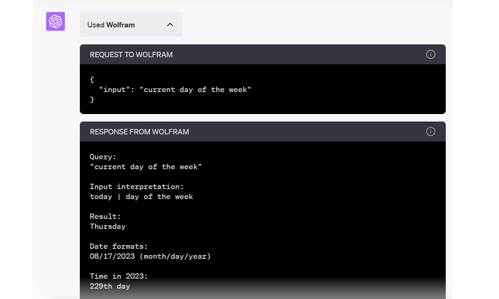

# WEEK044 - 大模型应用开发框架 LangChain 学习笔记（二）

在 [上一篇笔记](../week043-llm-application-frameworks-langchain/README.md) 中，我们学习了 LangChain 中的一些基础概念：使用 `LLMs` 和 `ChatModels` 实现基本的聊天功能，使用 `PromptTemplate` 组装提示语，使用 `Document loaders`、`Document transformers`、`Text embedding models`、`Vector stores` 和 `Retrievers` 实现文档问答；然后，我们又学习了 LangChain 的精髓 Chain，以及 Chain 的三大特性：使用 `Memory` 实现 Chain 的记忆功能，使用 `RetrievalQA` 组合多个 Chain 再次实现文档问答，使用 `Callbacks` 对 Chain 进行调试；最后，我们学习了四个基础 Chain：`LLMChain`、`TransformChain`、`SequentialChain` 和 `RouterChain`，使用这四个 Chain 可以组装出更复杂的流程，其中 `RouterChain` 和 `MultiPromptChain` 为我们提出了一种新的思路，使用大模型来决策 Chain 的调用链路，可以动态地解决用户问题；更进一步我们想到，大模型不仅可以动态地选择调用 Chain，也可以动态地选择调用外部的函数，而且使用一些提示语技巧，可以让大模型变成一个推理引擎，这便是 [Agent](https://python.langchain.com/docs/modules/agents/)。

## OpenAI 的插件功能

在学习 LangChain 的 Agent 之前，我们先来学习一下 OpenAI 的插件功能，这可以让我们对 Agent 的基本概念和工作原理有一个更深入的了解。

### ChatGPT Plugins

2023 年 3 月 23 日，OpenAI 重磅推出 [ChatGPT Plugins](https://openai.com/blog/chatgpt-plugins) 功能，引起了全球用户的热议。众所周知，GPT-3.5 是使用 2021 年之前的历史数据训练出来的大模型，所以它无法回答关于最新新闻和事件的问题，比如你问它今天是星期几，它只能让你自己去查日历：


不仅如此，ChatGPT 在处理数学问题时也表现不佳，而且在回答问题时可能会捏造事实，胡说八道；另一方面，虽然 ChatGPT 非常强大，但它终究只是一个聊天机器，如果要让它成为真正的私人助理，它还得帮助用户去做一些事情，解放用户的双手。引入插件功能后，就使得 ChatGPT 具备了这两个重要的能力：

* 访问互联网：可以实时检索最新的信息以回答用户问题，比如调用搜索引擎接口，获取和用户问题相关的新闻和事件；也可以访问用户的私有数据，比如公司内部的文档，个人笔记等，这样通过插件也可以实现文档问答；
* 执行任务：可以了解用户的意图，代替用户去执行任务，比如调用一些三方服务的接口订机票订酒店等；

暂时只有 GPT-4 才支持插件功能，所以要体验插件功能得有个 ChatGPT Plus 账号。截止目前为止，OpenAI 的插件市场中已经开放了近千个插件，如果我们想让 ChatGPT 回答今天是星期几，可以开启其中的 Wolfram 插件：


[Wolfram|Alpha](https://www.wolframalpha.com/) 是一个神奇的网站，建立于 2009 年，它是一个智能搜索引擎，它上知天文下知地理，可以回答关于数学、物理、化学、生命科学、计算机科学、历史、地理、音乐、文化、天气、时间等等方面的问题，它的愿景是 `Making the world's knowledge computable`，让世界的知识皆可计算。Wolfram 插件就是通过调用 Wolfram|Alpha 的接口来实现的，开启 Wolfram 插件后，ChatGPT 就能准确回答我们的问题了：


从对话的结果中可以看到 ChatGPT 使用了 Wolfram 插件，展开插件的调用详情还可以看到调用的请求和响应：



结合插件功能，ChatGPT 不再是一个简单的聊天对话框了，它有了一个真正的生态环境，网上有这样一个比喻，**如果说 ChatGPT 是 AI 时代的 iPhone，那么插件就是 ChatGPT 的 App Store**，我觉得这个比喻非常贴切。通过插件机制，ChatGPT 可以连接成千上万的第三方应用，向各个行业渗透，带给我们无限的想象力。

#### 开发自己的插件

目前 ChatGPT 的插件功能仍然处于 beta 版本，OpenAI 还没有完全开放插件的开发功能，如果想要体验开发 ChatGPT 插件的流程，需要先 [加入等待列表](https://openai.com/waitlist/plugins)。

开发插件的步骤大致如下：

1. ChatGPT 插件其实就是标准的 Web 服务，可以使用任意的编程语言开发，开发好插件服务之后，将其部署到你的域名下；
2. 准备一个清单文件 `.well-known/ai-plugin.json` 放在你的域名下，清单文件中包含了插件的名称、描述、认证信息、以及所有插件接口的信息等；
3. 在 ChatGPT 的插件中心选择 `Develop your own plugin`，并填上你的插件地址；
4. 开启新会话时，先选择并激活你的插件，然后就可以聊天了；如果 ChatGPT 认为用户问题需要调用你的插件（取决于插件和接口的描述），就会调用你在插件中定义的接口；

其中前两步应该是开发者最为关心的部分，官网提供了一个入门示例供我们参考，这个示例是一个简单的 [TODO List 插件](https://github.com/openai/plugins-quickstart)，可以让 ChatGPT 访问并操作我们的 TODO List 服务，我们就以这个例子来学习如何开发一个 ChatGPT 插件。

首先我们使用 Python 语言开发好 TODO List 服务，支持 TODO List 的增删改查。

然后准备一个插件的清单文件，对我们的插件进行一番描述，这个清单文件的名字必须是 `ai-plugin.json`，并放在你的域名的 `.well-known` 路径下，比如 `https://your-domain.com/.well-known/ai-plugin.json`。文件的内容如下：

```
{
    "schema_version": "v1",
    "name_for_human": "TODO List",
    "name_for_model": "todo",
    "description_for_human": "Manage your TODO list. You can add, remove and view your TODOs.",
    "description_for_model": "Help the user with managing a TODO list. You can add, remove and view your TODOs.",
    "auth": {
        "type": "none"
    },
    "api": {
        "type": "openapi",
        "url": "http://localhost:3333/openapi.yaml"
    },
    "logo_url": "http://localhost:3333/logo.png",
    "contact_email": "support@example.com",
    "legal_info_url": "http://www.example.com/legal"
}
```

清单中有些信息是用于展示在 OpenAI 的插件市场的，比如 `name_for_human`、`description_for_human`、`logo_url`、`contact_email`、`legal_info_url` 等，有些信息是要送给 ChatGPT 的，比如 `name_for_model`、`description_for_model`、`api` 等；送给 ChatGPT 的信息需要仔细填写，确保 ChatGPT 能理解你这个插件的用途，这样 ChatGPT 才会在对话过程中根据需要调用你的插件。

然后我们还需要准备插件的接口定义文件，要让 ChatGPT 知道你的插件都有哪些接口，每个接口的作用是什么，以及每个接口的入参和出参是什么。一般使用 [OpenAPI 规范](https://swagger.io/specification/) 来定义插件的接口，下面是一个简单的示例，定义了一个 `getTodos` 接口用于获取所有的 TODO List：

```
openapi: 3.0.1
info:
  title: TODO Plugin
  description: A plugin that allows the user to create and manage a TODO list using ChatGPT.
  version: 'v1'
servers:
  - url: http://localhost:3333
paths:
  /todos:
    get:
      operationId: getTodos
      summary: Get the list of todos
      responses:
        "200":
          description: OK
          content:
            application/json:
              schema:
                $ref: '#/components/schemas/getTodosResponse'
components:
  schemas:
    getTodosResponse:
      type: object
      properties:
        todos:
          type: array
          items:
            type: string
          description: The list of todos.
```

一切准备就绪后，就可以在 ChatGPT 的插件中心填上你的插件地址并调试了。

除了入门示例，官网还提供了一些其他的 [插件示例](https://platform.openai.com/docs/plugins/examples)，其中 [Chatgpt Retrieval Plugin](https://github.com/openai/chatgpt-retrieval-plugin/) 是一个完整而复杂的例子，对我们开发真实的插件非常有参考价值。

当然，还有很多插件的内容没有介绍，比如 [插件的最佳实践](https://platform.openai.com/docs/plugins/getting-started/best-practices)，[用户认证](https://platform.openai.com/docs/plugins/authentication) 等，更多信息可以参考 [OpenAI 的插件手册](https://platform.openai.com/docs/plugins/introduction)。

### Function Calling

尽管 ChatGPT 的插件功能非常强大，但是它只能在 ChatGPT 页面中使用，这可能是出于 OpenAI 的私心，OpenAI 的野心很大，它对 ChatGPT 的定位，就是希望将其做成整个互联网的入口，其他的应用都对接到 ChatGPT 的生态中来。不过很显然，这种脑洞大开的想法有点太过超前了，其他的互联网厂商也不傻，谁都知道流量入口的重要性，怎么会轻易将自己的应用入口交给其他人呢？对于其他的互联网厂商来说，他们更希望将 ChatGPT 的能力（包括插件能力）集成到自己的应用中来。

2023 年 6 月 13 日，这种想法变成了可能，这一天，OpenAI 对 GPT 模型进行了一项重大更新，推出了 [Function Calling](https://openai.com/blog/function-calling-and-other-api-updates) 功能，在 Chat Completions API 中添加了新的函数调用能力，帮助开发者通过 API 的方式实现类似于 ChatGPT 插件的数据交互能力。

> 在 [week040-chrome-extension-with-chatgpt](../week040-chrome-extension-with-chatgpt/README.md) 这篇笔记中，我们已经学习过 OpenAI 的 Chat Completions API，感兴趣的同学可以复习下。

#### 使用 Function Calling 回答日期问题

更新后的 Chat Completions API 中添加了一个 `functions` 参数，用于定义可用的函数，就像在 ChatGPT 中开启插件一样，这里的函数就相当于插件，对于每一个函数，我们需要定义它的名称、描述以及参数信息，如下：

```
completion = openai.ChatCompletion.create(
    temperature=0.7,
    model="gpt-3.5-turbo",
    messages=[
        {'role': 'user', 'content': "今天是星期几？"},
    ],
    functions=[
        {
          "name": "get_current_date",
          "description": "获取今天的日期信息，包括几月几号和星期几",
          "parameters": {
              "type": "object",
              "properties": {}
          }
        }
    ],
    function_call="auto",
)
print(completion)
```

在上面的例子中，我们定义了一个名为 `get_current_date()` 的函数，用于获取今天的日期和星期信息，这个函数我们要提前实现好：

```
def get_current_date(args):
    import datetime
    today = datetime.date.today()
    weekday = today.weekday()
    weeekdays = ['一','二','三','四','五','六','日']
    return '今天是' + str(today) + ', ' + '星期' + weeekdays[weekday]
```

当 GPT 无法回答关于日期的问题时，就会自动地选择调用这个函数来进一步获取信息，Chat Completions API 的响应结果如下：

```
{
  "id": "chatcmpl-7pQO7iJ3WeggIYZ5CnLc88ZxMgMMV",
  "object": "chat.completion",
  "created": 1692490519,
  "model": "gpt-3.5-turbo-0613",
  "choices": [
    {
      "index": 0,
      "message": {
        "role": "assistant",
        "content": null,
        "function_call": {
          "name": "get_current_date",
          "arguments": "{}"
        }
      },
      "finish_reason": "function_call"
    }
  ],
  "usage": {
    "prompt_tokens": 63,
    "completion_tokens": 8,
    "total_tokens": 71
  }
}
```

可以看到接口返回的 `message.content` 是空，反而多了一个 `function_call` 字段，这就说明 GPT 无法回答我们的问题，希望调用某个外部函数。为了方便我们调用外部函数，GPT 非常贴心地将函数名和参数都准备好了，我们只需要使用 `globals().get()` 拿到函数，再使用 `json.loads()` 拿到参数，然后直接调用即可：

```
function_call = completion.choices[0].message.function_call
function = globals().get(function_call.name)
args = json.loads(function_call.arguments)
result = function(args)
print(result)
```

拿到函数调用的结果之后，我们再一次调用 Chat Completions API，这一次我们将函数调用的结果和用户的问题一起放在 `messages` 中，注意将它的 `role` 设置为 `function`：

```
completion = openai.ChatCompletion.create(
    temperature=0.7,
    model="gpt-3.5-turbo",
    messages=[
        {'role': 'user', 'content': "今天是星期几？"},
        {'role': 'function', 'name': 'get_current_date', 'content': "今天是2023-08-20, 星期日"},
    ],
)
print(completion)
```

这样 GPT 就能成功回答我们的问题了：

```
{
  "id": "chatcmpl-7pQklbWnMyVFvK73YbWXMybVsOTJe",
  "object": "chat.completion",
  "created": 1692491923,
  "model": "gpt-3.5-turbo-0613",
  "choices": [
    {
      "index": 0,
      "message": {
        "role": "assistant",
        "content": "今天是星期日。"
      },
      "finish_reason": "stop"
    }
  ],
  "usage": {
    "prompt_tokens": 83,
    "completion_tokens": 8,
    "total_tokens": 91
  }
}
```

#### 多轮 Function Calling

有时候，只靠一个函数解决不了用户的问题，比如用户问 `明天合肥的天气怎么样？`，那么 GPT 首先需要知道明天的日期，然后再根据日期查询合肥的天气，所以我们要定义两个函数：

```
functions = [
    {
        "name": "get_current_date",
        "description": "获取今天的日期信息，包括几月几号和星期几",
        "parameters": {
            "type": "object",
            "properties": {}
        }
    },
    {
        "name": "get_weather_info",
        "description": "获取某个城市某一天的天气信息",
        "parameters": {
            "type": "object",
            "properties": {
                "city": {
                    "type": "string",
                    "description": "城市名",
                },
                "date": {
                    "type": "string",
                    "description": "日期，格式为 yyyy-MM-dd",
                },
            },
            "required": ["city", "date"],
        }
    }
]
```

第一次调用 Chat Completions API 时，传入用户的问题：

```
messages=[
    {'role': 'user', 'content': "明天合肥的天气怎么样？"},
],
```

接口返回了一个 `function_call`，希望我们去调用 `get_current_date()` 函数：

```
"function_call": {
    "name": "get_current_date",
    "arguments": "{}"
}
```

然后我们调用 `get_current_date()` 函数得到今天的日期，再次调用 Chat Completions API 时，传入函数的调用结果：

```
messages=[
    {'role': 'user', 'content': "明天合肥的天气怎么样？"},
    {'role': 'function', 'name': 'get_current_date', 'content': "今天是2023-08-20, 星期日"},
],
```

接口再次返回了一个 `function_call`，希望我们去调用 `get_weather_info()` 函数：

```
"function_call": {
    "name": "get_weather_info",
    "arguments": "{\n  \"city\": \"合肥\",\n  \"date\": \"2023-08-21\"\n}"
}
```

注意这里的 `date` 参数，上面我们通过 `get_current_date()` 得到今天的日期是 `2023-08-20`，而用户问的是明天合肥的天气，GPT 非常聪明地推导出明天的日期是 `2023-08-21`，可以说是非常优秀了，我们直接使用 GPT 准备好的参数调用 `get_weather_info()` 即可获得明天合肥的天气，再次调用 Chat Completions API：

```
messages=[
    {'role': 'user', 'content': "明天合肥的天气怎么样？"},
    {'role': 'function', 'name': 'get_current_date', 'content': "今天是2023-08-20, 星期日"},
    {'role': 'function', 'name': 'get_weather_info', 'content': "雷阵雨，33/24℃，北风转西北风"},
],
```

通过不断的调用 Function Calling，最后准确地对用户的问题作出了回答：

```
明天合肥的天气预报为雷阵雨，最高温度为33℃，最低温度为24℃，风向将从北风转为西北风。请注意防雷阵雨的天气情况。
```

除了能不断地返回 `function_call` 并调用函数外，GPT 还会主动尝试补充函数的参数。有时候，用户的问题不完整，缺少了函数的某个参数，比如用户问 `明天的天气怎么样？`，这时 GPT 并不知道用户所在的城市，它就会问 `请问您所在的城市是哪里？`，等待用户回答之后，才返回 `get_weather_info()` 函数以及对应的参数。

## 学习 LangChain Agent

学习完 OpenAI 的插件机制之后，我们再来学习 LangChain 的 Agent 就会发现有很多概念是相通的。我们从官方文档中的一个入门示例开始。

### 快速入门

我们知道，大模型虽然擅长推理，但是却不擅长算术和计数，比如问它单词 `hello` 是由几个字母组成的，它就有可能胡编乱造，我们可以定义一个函数 `get_word_length()` 帮助大模型来回答关于单词长度的问题。

入门示例的代码如下：

```
from langchain.chat_models import ChatOpenAI
from langchain.agents import tool
from langchain.schema import SystemMessage
from langchain.agents import OpenAIFunctionsAgent
from langchain.agents import AgentExecutor

# llm
llm = ChatOpenAI(temperature=0)

# tools
@tool
def get_word_length(word: str) -> int:
    """Returns the length of a word."""
    return len(word)

tools = [get_word_length]

# prompt
system_message = SystemMessage(
    content="You are very powerful assistant, but bad at calculating lengths of words."
)
prompt = OpenAIFunctionsAgent.create_prompt(system_message=system_message)

# create an agent
agent = OpenAIFunctionsAgent(llm=llm, tools=tools, prompt=prompt)

# create an agent executor
agent_executor = AgentExecutor(agent=agent, tools=tools)

# run the agent executor
result = agent_executor.run("how many letters in the word 'hello'?")
print(result)
```

从上面的代码中我们可以注意到 Agent 有这么几个重要的概念：

* [Tools](https://python.langchain.com/docs/modules/agents/tools/) - 希望被 Agent 执行的函数，被称为 **工具**，类似于 OpenAI 的插件，我们需要尽可能地描述清楚每个工具的功能，以便 Agent 能选择合适的工具；

* [Agent](https://python.langchain.com/docs/modules/agents/) - 经常被翻译成 **代理**，类似于 OpenAI 的 Function Calling 机制，可以帮我们将用户的问题拆解成多个子任务，然后动态地选择和调用 Chain 或工具依次解决这些子任务，直到用户的问题完全被解决；Agent 的执行流程如下图所示：


* Agent Executor - Agent 执行器，它本质上是一个 Chain，所以可以和其他的 Chain 或 Agent Executor 进行组合；它会递归地调用 Agent 获取下一步的动作，并执行 Agent 中定义的工具，直到 Agent 认为问题已经解决，则递归结束，下面是整个过程的伪代码：

```
next_action = agent.get_action(...)
while next_action != AgentFinish:
    observation = run(next_action)
    next_action = agent.get_action(..., next_action, observation)
return next_action
```

### LangChain Agent 进阶

下面深入学习 LangChain Agent 的这几个概念。

### 使用工具

在入门示例中，我们使用 `@tool` 装饰器定义了一个工具：

```
@tool
def get_word_length(word: str) -> int:
    """Returns the length of a word."""
    return len(word)
```

工具的名称默认为方法名，工具的描述为方法的 `doc_string`，工具方法支持多个参数：

```
@tool
def get_word_length(word: str, excluding_hyphen: bool) -> int:
    """Returns the length of a word."""
    if excluding_hyphen:
        return len(word.replace('-', ''))
    else:
        return len(word)
```

当工具方法有多个参数时，参数的描述就很重要，我们可以通过 `args_schema` 来传入一个 `BaseModel`，这是 [Pydantic](https://github.com/pydantic/pydantic) 中用于定义数据模型的基类：

```
class WordLengthSchema(BaseModel):
    word: str = Field(description = "the word to be calculating")
    excluding_hyphen: bool = Field(description = "excluding the hyphen or not, default to false")

@tool(args_schema = WordLengthSchema)
def get_word_length(word: str, excluding_hyphen: bool) -> int:
    """Returns the length of a word."""
    if excluding_hyphen:
        return len(word.replace('-', ''))
    else:
        return len(word)
```

> LangChain 的代码中大量使用了 Pydantic 库，它提供了一种简单而强大的方式来验证和解析输入数据，并将其转换为类型安全的 Python 对象。

除了使用 `@tool` 装饰器，官方还提供了另外两种方式来定义工具。第一种是使用 `Tool.from_function()`：

```
Tool.from_function(
    func=get_word_length,
    name="get_word_length",
    description="Returns the length of a word."
)
```

不过这个方法只支持接受一个字符串输入和一个字符串输出，如果工具方法有多个参数，必须得使用 `StructuredTool.from_function()`：

```
StructuredTool.from_function(
    func=get_word_length,
    name="get_word_length",
    description="Returns the length of a word."
)
```

同样，我们可以通过 `args_schema` 来传入一个 `BaseModel` 对方法的参数进行描述：

```
StructuredTool.from_function(
    func=get_word_length,
    name="get_word_length",
    description="Returns the length of a word.",
    args_schema=WordLengthSchema
)
```

实际上查看 LangChain 的源码你就会发现，`@tool` 装饰器就是通过 `Tool.from_function()` 和 `StructuredTool.from_function()` 来实现的。

第二种定义工具的方法是直接继承 `BaseTool` 类：

```
class WordLengthTool(BaseTool):
    name = "get_word_length"
    description = "Returns the length of a word."

    def _run(
        self, word: str, run_manager: Optional[CallbackManagerForToolRun] = None
    ) -> str:
        """Use the tool."""
        return len(word)

    async def _arun(
        self, word: str, run_manager: Optional[AsyncCallbackManagerForToolRun] = None
    ) -> str:
        """Use the tool asynchronously."""
        raise NotImplementedError("get_word_length does not support async")
```

当工具方法有多个参数时，我们就在 `_run` 方法上定义多个参数，同时使用 `args_schema` 对多个参数进行描述：

```
class WordLengthTool(BaseTool):
    name = "get_word_length"
    description = "Returns the length of a word."
    args_schema: Type[WordLengthSchema] = WordLengthSchema

    def _run(
        self, word: str, excluding_hyphen: bool = False, run_manager: Optional[CallbackManagerForToolRun] = None
    ) -> str:
        """Use the tool."""
        if excluding_hyphen:
            return len(word.replace('-', ''))
        else:
            return len(word)
```

除了自己定义工具，LangChain 还内置了一些常用的工具，我们可以直接使用 `load_tools()` 来加载：

```
from langchain.agents import load_tools

tools = load_tools(["serpapi"])
```

可以从 [load_tools.py](https://github.com/langchain-ai/langchain/blob/master/libs/langchain/langchain/agents/load_tools.py) 源码中找到支持的工具列表。

### Agent 类型

有些同学可能已经注意到，在示例代码中我们使用了 `OpenAIFunctionsAgent`，我们也可以使用 `initialize_agent()` 方法简化 `OpenAIFunctionsAgent` 的创建过程：

```
from langchain.chat_models import ChatOpenAI
from langchain.agents import tool
from langchain.agents import initialize_agent
from langchain.agents import AgentType

# llm
llm = ChatOpenAI(temperature=0)

# tools
@tool
def get_word_length(word: str) -> int:
    """Returns the length of a word."""
    return len(word)

tools = [get_word_length]

# create an agent executor
agent_executor = initialize_agent(tools, llm, agent=AgentType.OPENAI_FUNCTIONS, verbose=True)

# run the agent executor
result = agent_executor.run("how many letters in the word 'weekly-practice'?")
print(result)
```

很显然，这个 Agent 是基于 OpenAI 的 Function Calling 实现的，它通过 `format_tool_to_openai_function()` 将 LangChain 的工具转换为 OpenAI 的 `functions` 参数。但是 Function Calling 机制只有 OpenAI 的接口才支持，而 LangChain 面对的是各种大模型，并不是所有的大模型都支持 Function Calling 机制，这是要专门训练的，所以 LangChain 的 Agent 还需要支持一种更通用的实现机制。根据所使用的策略，LangChain 支持 [多种 Agent 类型](https://python.langchain.com/docs/modules/agents/agent_types/)。

#### Zero-shot ReAct Agent

ReAct 这个词出自一篇论文 [ReAct: Synergizing Reasoning and Acting in Language Models](https://react-lm.github.io/)，它是由 `Reason` 和 `Act` 两个词组合而成，表示一种将 **推理** 和 **行动** 与大模型相结合的通用范式：


传统的 `Reason Only` 型应用（如 [Chain-of-Thought Prompting](https://www.promptingguide.ai/techniques/cot)）具备很强的语言能力，擅长通用文本的逻辑推断，但由于不会和外部环境交互，因此它的认知非常受限；而传统的 `Act Only` 型应用（如 [WebGPT](https://openai.com/research/webgpt)、[SayCan](https://say-can.github.io/)、[ACT-1](https://www.adept.ai/blog/act-1)）能和外界进行交互，解决某类特定问题，但它的行为逻辑较简单，不具备通用的推理能力。

`ReAct` 的思想，旨在将这两种应用的优势结合起来。针对一个复杂问题，首先使用大模型的推理能力制定出解决该问题的行动计划，这好比人的大脑，可以对问题进行分析思考；然后使用行动能力与外部源（例如知识库或环境）进行交互，以获取额外信息，这好比人的五官和手脚，可以感知世界，并执行动作；大模型对行动的结果进行跟踪，并不断地更新行动计划，直到问题被解决。通过这种模式，我们能基于大模型构建更为强大的 AI 应用，大名鼎鼎的 [Auto-GPT](https://github.com/Significant-Gravitas/Auto-GPT) 项目就是基于 ReAct 模式实现的。

LangChain 基于 ReAct 思想实现了一些 Agent，其中最简单的就是 [Zero-shot ReAct Agent](https://python.langchain.com/docs/modules/agents/agent_types/react.html)，我们将上面的 `AgentType.OPENAI_FUNCTIONS` 替换成 `AgentType.ZERO_SHOT_REACT_DESCRIPTION` 即可：

```
agent_executor = initialize_agent(tools, llm, agent=AgentType.ZERO_SHOT_REACT_DESCRIPTION, verbose=True)
```

执行结果如下：

```
> Entering new AgentExecutor chain...
I should use the get_word_length tool to find the length of the word.
Action: get_word_length
Action Input: 'weekly-practice'
Observation: 17
Thought:The word 'weekly-practice' has 17 letters.
Final Answer: 17

> Finished chain.
17
```

从输出结果可以一窥 Agent 的思考过程，包括三个部分：`Thought` 是由大模型生成的想法，是执行行动的依据；`Action` 是指大模型判断本次需要执行的具体动作；`Observation` 是执行动作后从外部获取的信息。

> 可以看到这个 Agent 没有 OpenAI 那么智能，它在计算单词长度时没有去掉左右的引号。

为了展示 Agent 思维链的强大之处，我们可以输入一个更复杂的问题：

```
Calculate the length of the word 'weekly-practice' times the word 'aneasystone'?
```

要回答这个问题，Agent 必须先计算两个单词的长度，然后将两个长度相乘得到乘积，所以我们要在工具箱中加一个用于计算的工具，可以直接使用 LangChain 内置的 `llm-math` 工具：

```
@tool
def get_word_length(word: str) -> int:
    """Returns the length of a word."""
    return len(word)

tools = load_tools(["llm-math"], llm=llm)
tools.append(get_word_length)
```

运行结果如下：

```
> Entering new AgentExecutor chain...
We need to calculate the length of the word 'weekly-practice' and the length of the word 'aneasystone', and then multiply them together.
Action: get_word_length
Action Input: 'weekly-practice'
Observation: 17
Thought:We have the length of the word 'weekly-practice'. Now we need to find the length of the word 'aneasystone'.
Action: get_word_length
Action Input: 'aneasystone'
Observation: 13
Thought:We have the lengths of both words. Now we can multiply them together to get the final answer.
Action: Calculator
Action Input: 17 * 13
Observation: Answer: 221
Thought:I now know the final answer.
Final Answer: The length of the word 'weekly-practice' times the word 'aneasystone' is 221.

> Finished chain.
The length of the word 'weekly-practice' times the word 'aneasystone' is 221.
```

针对最简单的 Zero-shot ReAct Agent，LangChain 提供了三个实现：

* `ZERO_SHOT_REACT_DESCRIPTION` - 使用 LLMs 实现；
* `CHAT_ZERO_SHOT_REACT_DESCRIPTION` - 使用 ChatModels 实现；
* `STRUCTURED_CHAT_ZERO_SHOT_REACT_DESCRIPTION` - 上面两种 Agent 使用的工具都只支持输入简单的字符串，而这种 Agent 通过 `args_schema` 来生成工具的输入，支持在工具中使用多个参数；

#### Conversational ReAct Agent

和 Chain 一样，也可以给 Agent 增加记忆功能，默认情况下，Zero-shot ReAct Agent 是不具有记忆功能的，不过我们可以通过 `agent_kwargs` 参数修改 Agent 让其具备记忆功能。我们可以使用下面的技巧将 Agent 所使用的 Prompt 打印出来看看：

```
print(agent_executor.agent.llm_chain.prompt.template)
```

输出结果如下：

```
Answer the following questions as best you can. You have access to the following tools:

Calculator: Useful for when you need to answer questions about math.
get_word_length: get_word_length(word: str) -> int - Returns the length of a word.

Use the following format:

Question: the input question you must answer
Thought: you should always think about what to do
Action: the action to take, should be one of [Calculator, get_word_length]
Action Input: the input to the action
Observation: the result of the action
... (this Thought/Action/Action Input/Observation can repeat N times)
Thought: I now know the final answer
Final Answer: the final answer to the original input question

Begin!

Question: {input}
Thought:{agent_scratchpad}
```

这个 Prompt 就是实现 ReAct 的核心，它实际上包括了三个部分。第一部分称为前缀（`prefix`），可以在这里加一些通用的提示语，并列出大模型可以使用的工具名称和描述：

```
Answer the following questions as best you can. You have access to the following tools:

Calculator: Useful for when you need to answer questions about math.
get_word_length: get_word_length(word: str) -> int - Returns the length of a word.
```

第二部分称为格式化指令（`format_instructions`），内容如下：

```
Use the following format:

Question: the input question you must answer
Thought: you should always think about what to do
Action: the action to take, should be one of [Calculator, get_word_length]
Action Input: the input to the action
Observation: the result of the action
... (this Thought/Action/Action Input/Observation can repeat N times)
Thought: I now know the final answer
Final Answer: the final answer to the original input question
```

这段指令让大模型必须按照 `Thought/Action/Action Input/Observation` 这种特定的格式来回答我们的问题，然后我们将 `Observation` 设置为停止词（`Stop Word`）。如果大模型返回的结果中有 `Action` 和 `Action Input`，就说明大模型需要调用外部工具获取进一步的信息，于是我们就去执行该工具，并将执行结果放在 `Observation` 中，接着再次调用大模型，这样我们每执行一次，就能得到大模型的一次思考过程，直到大模型返回 `Final Answer` 为止，此时我们就得到了最终结果。

第三部分称为后缀（`suffix`），包括两个占位符，`{input}` 表示用户输入的问题，`{agent_scratchpad}` 表示 Agent 每一步思考的过程，可以让 Agent 继续思考下去：

```
Begin!

Question: {input}
Thought:{agent_scratchpad}
```

可以看到上面的 Prompt 中并没有考虑历史会话，如果要让 Agent 具备记忆功能，我们必须在 Prompt 中加上历史会话内容，我们将 `prefix` 修改成下面这样：

```
Have a conversation with a human, answering the following questions as best you can. You have access to the following tools:
```

明确地指出这是一次和人类的会话。然后将 `suffix` 修改为：

```

Begin!"

{chat_history}
Question: {input}
{agent_scratchpad}
```

我们在里面加上了 `{chat_history}` 占位符表示历史会话记录。由于引入了新的占位符，所以在 `input_variables` 中也需要加上 `chat_history` 变量，这个变量的内容会被 `ConversationBufferMemory` 自动替换，修改后的代码如下：

```
from langchain.memory import ConversationBufferMemory

memory = ConversationBufferMemory(memory_key="chat_history")

# create an agent executor
agent_executor = initialize_agent(
    tools, 
    llm, 
    agent=AgentType.ZERO_SHOT_REACT_DESCRIPTION, 
    verbose=True,
    memory=memory,
    agent_kwargs={
        "prefix": prefix,
        "suffix": suffix,
        "input_variables": ["input", "chat_history", "agent_scratchpad"],
    }
)
```

至此我们这个 Agent 就具备记忆功能了，可以将上面那个复杂问题拆分成三个小问题分别问它：

```
result = agent_executor.run("how many letters in the word 'weekly-practice'?")
print(result)
result = agent_executor.run("how many letters in the word 'hello-world'?")
print(result)
result = agent_executor.run("what is the product of results above?")
print(result)
```

执行结果如下，可以看出在回答第三个问题时它记住了上面两轮对话的内容：

```
> Entering new AgentExecutor chain...
Thought: I can use the get_word_length tool to find the length of the word 'weekly-practice'.
Action: get_word_length
Action Input: 'weekly-practice'
Observation: 17
Thought:I now know the final answer
Final Answer: The word 'weekly-practice' has 17 letters.

> Finished chain.
The word 'weekly-practice' has 17 letters.


> Entering new AgentExecutor chain...
Thought: I need to find the length of the word 'hello-world'.
Action: get_word_length
Action Input: 'hello-world'
Observation: 13
Thought:The word 'hello-world' has 13 letters.
Final Answer: The word 'hello-world' has 13 letters.

> Finished chain.
The word 'hello-world' has 13 letters.


> Entering new AgentExecutor chain...
Thought: I need to calculate the product of the results above.
Action: Calculator
Action Input: 17 * 13
Observation: Answer: 221
Thought:I now know the final answer.
Final Answer: The product of the results above is 221.

> Finished chain.
The product of the results above is 221.
```

像上面这样给 Agent 增加记忆实在是太繁琐了，LangChain 于是内置了两种 [Conversational ReAct Agent](https://python.langchain.com/docs/modules/agents/agent_types/chat_conversation_agent) 来简化这个过程：

* `CONVERSATIONAL_REACT_DESCRIPTION` - 使用 LLMs 实现；
* `CHAT_CONVERSATIONAL_REACT_DESCRIPTION` - 使用 ChatModels 实现；

使用 Conversational ReAct Agent 要简单得多，我们只需要准备一个 memory 参数即可：

```
# memory
memory = ConversationBufferMemory(memory_key="chat_history", return_messages=True)

# create an agent executor
agent_executor = initialize_agent(
    tools, 
    llm, 
    agent=AgentType.CHAT_CONVERSATIONAL_REACT_DESCRIPTION, 
    verbose=True,
    memory=memory,
)
```

#### ReAct DocStore Agent

和 Zero-shot ReAct Agent 一样，[ReAct DocStore Agent](https://python.langchain.com/docs/modules/agents/agent_types/react_docstore.html) 也是一个基于 ReAct 框架实现的 Agent。事实上，ReAct DocStore Agent 才是 [ReAct 这篇论文](https://react-lm.github.io/) 的标准实现，这个 Agent 必须包含两个指定工具：`Search` 用于调用 DocStore 搜索相关文档，`Lookup` 用于从搜索的文档中查询关键词信息。

> Zero-shot ReAct Agent 更像是一个通用的 [MRKL 系统](https://arxiv.org/abs/2205.00445)，MRKL 的全称是模块化推理、知识和语言系统，它是一种模块化的神经符号架构，结合了大型语言模型、外部知识源和离散推理，它最初 [由 AI21 Labs 提出](https://www.ai21.com/blog/jurassic-x-crossing-the-neuro-symbolic-chasm-with-the-mrkl-system)，并实现了 Jurassic-X，对 MRKL 感兴趣的同学可以参考 [这篇博客](https://zhuanlan.zhihu.com/p/526713337)。

LangChain 目前貌似只实现了 Wikipedia 和 InMemory 两个 DocStore，下面的例子中我们使用 Wikipedia 来进行搜索：

```
from langchain import Wikipedia
from langchain.agents import Tool
from langchain.agents.react.base import DocstoreExplorer

docstore = DocstoreExplorer(Wikipedia())
tools = [
    Tool(
        name="Search",
        func=docstore.search,
        description="useful for when you need to ask with search",
    ),
    Tool(
        name="Lookup",
        func=docstore.lookup,
        description="useful for when you need to ask with lookup",
    ),
]
```

然后创建一个类型为 `AgentType.REACT_DOCSTORE` 的 Agent，并提出一个问题：谁是当今美国总统？

```
agent_executor = initialize_agent(tools, llm, agent=AgentType.REACT_DOCSTORE, verbose=True)

result = agent_executor.run("Who is the current president of the United States?")
print(result)
```

运行结果如下：

```
> Entering new AgentExecutor chain...
Thought: I need to find out who the current president of the United States is.
Action: Search[current president of the United States]
Observation: The president of the United States (POTUS) is the head of state and head of government of the United States... Joe Biden is the 46th and current president of the United States, having assumed office on January 20, 2021.
Thought:Joe Biden is the current president of the United States.
Action: Finish[Joe Biden]

> Finished chain.
Joe Biden
```

#### Self-Ask Agent

* SELF_ASK_WITH_SEARCH

#### OpenAI Functions Agent

* OPENAI_FUNCTIONS
* OPENAI_MULTI_FUNCTIONS

### 在 LangChain 中使用 OpenAI Functions

https://python.langchain.com/docs/modules/chains/how_to/openai_functions

https://python.langchain.com/docs/modules/agents/agent_types/openai_functions_agent.html

## 参考

* [70款ChatGPT插件评测：惊艳的开发过程与宏大的商业化愿景](https://zhuanlan.zhihu.com/p/629337429)
* [LangChain 完整指南：使用大语言模型构建强大的应用程序](https://zhuanlan.zhihu.com/p/620529542)
* [LangChain 中文入门教程](https://github.com/liaokongVFX/LangChain-Chinese-Getting-Started-Guide)
* [LangChain初学者入门指南](https://mp.weixin.qq.com/s/F4QokLPrimFS1LRjXDbwQQ)
* [LangChain：Model as a Service粘合剂，被ChatGPT插件干掉了吗？](https://36kr.com/p/2203231346847113)
* [解密Prompt系列12. LLM Agent零微调范式 ReAct & Self Ask](https://juejin.cn/post/7260129616908222525)
* [Superpower LLMs with Conversational Agents](https://www.pinecone.io/learn/series/langchain/langchain-agents/)

### AI Agents

* [Auto-GPT](https://github.com/Significant-Gravitas/Auto-GPT)
* [AgentGPT](https://github.com/reworkd/AgentGPT)
* [BabyAGI](https://github.com/yoheinakajima/babyagi)
* [SuperAGI](https://github.com/TransformerOptimus/SuperAGI)
* [Haystack](https://github.com/deepset-ai/haystack)
* [Open-Assistant](https://github.com/LAION-AI/Open-Assistant)
* [BentoML](https://github.com/bentoml/BentoML)
