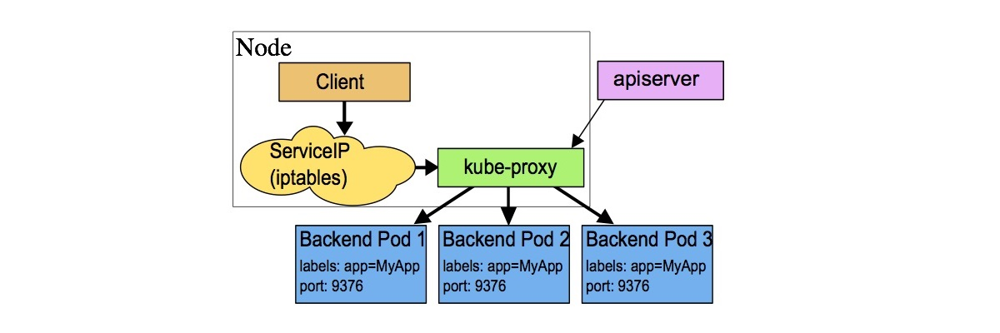
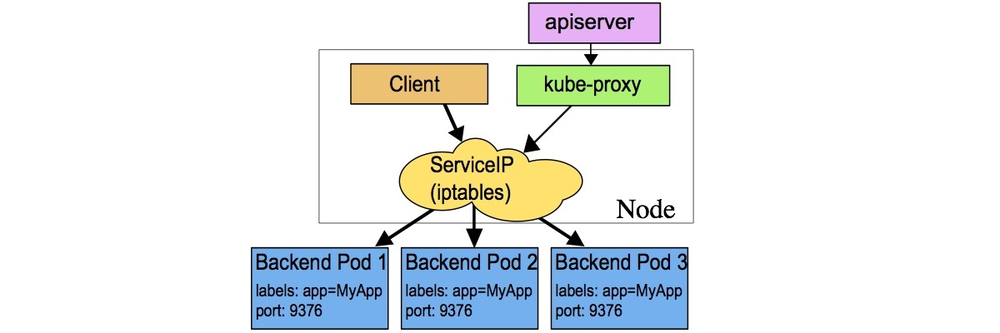
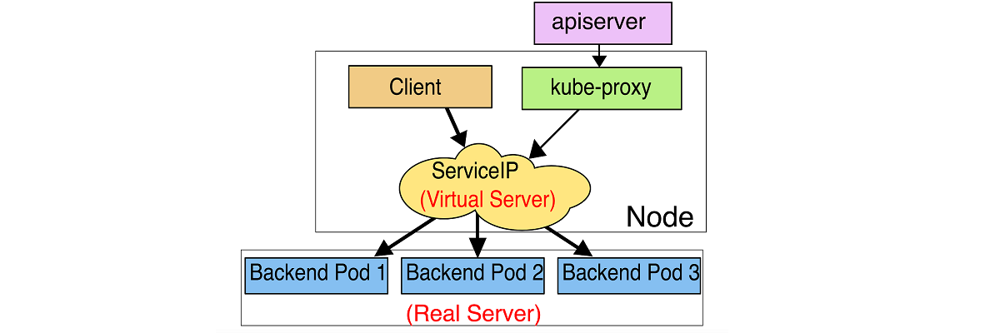

# WEEK046 - 学习 Kubernetes 流量管理之 Service

在 [week013-playing-with-kubernetes](../week013-playing-with-kubernetes/README.md) 这篇笔记中我们学习了 Kubernetes 的基本用法和概念，通过 Deployment 部署应用程序，然后通过 Service 将应用程序暴露给其他人访问。其中 Service 是 Kubernetes 最基础的流量管理机制之一，它的主要目的有：

* 以一个固定的地址来访问应用程序；
* 实现多个副本之间的负载均衡；
* 让应用程序可以在集群外部进行访问；

这篇笔记将继续使用之前的示例，通过一系列的实验更进一步地学习 Service 的工作原理。

## 准备实验环境

首先，创建一个 Deployment 部署应用程序，这里直接使用之前示例中的 `jocatalin/kubernetes-bootcamp:v1` 镜像，副本数设置为 3：

```
apiVersion: apps/v1
kind: Deployment
metadata:
  labels:
    app: myapp
    version: v1
  name: myapp
spec:
  replicas: 3
  selector:
    matchLabels:
      app: myapp
      version: v1
  template:
    metadata:
      labels:
        app: myapp
        version: v1
    spec:
      containers:
      - image: jocatalin/kubernetes-bootcamp:v1
        name: myapp
```

等待三个副本都启动成功：

```
# kubectl get deploy myapp -o wide
NAME    READY   UP-TO-DATE   AVAILABLE   AGE   CONTAINERS   IMAGES                             SELECTOR
myapp   3/3     3            3           13m   myapp        jocatalin/kubernetes-bootcamp:v1   app=myapp
```

然后创建一个 Service：

```
apiVersion: v1
kind: Service
metadata:
  labels:
    app: myapp
  name: myapp
spec:
  ports:
  - port: 38080
    targetPort: 8080
  selector:
    app: myapp
  type: ClusterIP
```

通过 `kubectl get svc` 查询 Service 的地址和端口：

```
# kubectl get svc myapp -o wide
NAME    TYPE        CLUSTER-IP    EXTERNAL-IP   PORT(S)     AGE     SELECTOR
myapp   ClusterIP   10.96.3.215   <none>        38080/TCP   7m22s   app=myapp
```

通过 Service 的地址验证服务能正常访问，多请求几次，可以看到会自动在副本之间轮询访问：

```
# curl 10.96.3.215:38080
Hello Kubernetes bootcamp! | Running on: myapp-fdb95659d-fl5c4 | v=1
# curl 10.96.3.215:38080
Hello Kubernetes bootcamp! | Running on: myapp-fdb95659d-dd5vv | v=1
# curl 10.96.3.215:38080
Hello Kubernetes bootcamp! | Running on: myapp-fdb95659d-4xf4g | v=1
# curl 10.96.3.215:38080
Hello Kubernetes bootcamp! | Running on: myapp-fdb95659d-fl5c4 | v=1
```

## Service 配置细节

上面是一个简单的 Service 示例，这一节对其配置参数进行详细说明。

### 端口配置

在上面的 Service 定义中，第一个重要参数是 `spec.ports` 端口配置：

```
spec:
  ports:
  - port: 38080
    targetPort: 8080
```

其中 `port` 表示 Service 的端口，`targetPort` 表示 Pod 的端口。Service 创建成功之后，Kubernetes 会为该 Service 分配一个 IP 地址，Service 从自己的 IP 地址和 `port` 端口接收请求，并将请求映射到符合条件的 Pod 的 `targetPort`。

#### 多端口配置

可以在一个 Service 对象中定义多个端口，此时，我们必须为每个端口定义一个名字：

```
spec:
  ports:
  - name: http
    port: 38080
    targetPort: 8080
  - name: https
    port: 38083
    targetPort: 8083
```

#### 协议配置

此外，可以给 Service 的端口指定协议：

```
spec:
  ports:
  - name: http
    protocol: TCP
    port: 38080
    targetPort: 8080
```

Service 支持的协议有以下几种：

* `TCP` - 所有的 Service 都支持 TCP 协议，这也是默认值；
* `UDP` - 几乎所有的 Service 都支持 UDP 协议，对于 `LoadBalancer` 类型的 Service，是否支持取决于云供应商；
* `SCTP` - 这是一种比较少见的协议，叫做 **流控制传输协议（Stream Control Transmission Protocol）**，和 TCP/UDP 属于同一层，常用于信令传输网络中，比如 4G 核心网的信令交互就是使用的 SCTP，WebRTC 中的 Data Channel 也是基于 SCTP 实现的；如果你的 Kubernetes 安装了支持 SCTP 协议的网络插件，那么大多数 Service 也就支持 SCTP 协议，同样地，对于 `LoadBalancer` 类型的 Service，是否支持取决于云供应商（大多数都不支持）；

具体的内容可以参考 Kubernetes 的官网文档 [Protocols for Services](https://kubernetes.io/docs/reference/networking/service-protocols/)，文档中对于 TCP 协议，还列出了一些特殊场景，这些大多是对于 `LoadBalancer` 类型的 Service，需要使用云供应商所提供特定的注解：

* HTTP 或 HTTPS 协议
* [PROXY 协议](https://www.haproxy.org/download/2.5/doc/proxy-protocol.txt)
* TLS Server

#### 具名端口

在应用程序升级时，服务的端口可能会发生变动，如果希望 Service 同时选择新老两个版本的 Pod，那么 `targetPort` 就不能写死。Kubernetes 支持为每个端口赋一个名称，然后我们将新老版本的端口名称保持一致，再将 `targetPort` 配置成该名称即可。

首先修改 Deployment 的定义，为端口赋上名称：

```
apiVersion: apps/v1
kind: Deployment
metadata:
  labels:
    app: myapp
    version: v1
  name: myapp
spec:
  replicas: 3
  selector:
    matchLabels:
      app: myapp
      version: v1
  template:
    metadata:
      labels:
        app: myapp
        version: v1
    spec:
      containers:
      - image: jocatalin/kubernetes-bootcamp:v1
        name: myapp
        ports:
        - name: myapp-port
          containerPort: 8080
          protocol: TCP
```

然后修改 Service 定义中的 `targetPort` 为端口名称即可：

```
apiVersion: v1
kind: Service
metadata:
  labels:
    app: myapp
  name: myapp
spec:
  ports:
  - port: 38080
    targetPort: myapp-port
  selector:
    app: myapp
  type: ClusterIP
```

### 标签选择器

Service 中的另一个重要字段是 `spec.selector` 选择器：

```
spec:
  selector:
    app: myapp
```

Service 通过 [标签选择器](https://kubernetes.io/docs/concepts/overview/working-with-objects/labels/) 选择符合条件的 Pod，并将选中的 Pod 作为网络服务的提供者。并且 Service 能持续监听 Pod 集合，一旦 Pod 集合发生变动，Service 就会同步被更新。

> 注意，标签选择器有两种类型：
> * 基于等值的需求（*Equality-based*）：比如 `environment = production` 或 `tier != frontend`
> * 基于集合的需求（*Set-based*）：比如 `environment in (production, qa)` 或 `tier notin (frontend, backend)`
> 
> Service 只支持基于等值的选择器。

在上面的例子中，Service 的选择器为 `app: myapp`，而 Pod 有两个标签：`app: myapp` 和 `version: v1`，很显然是能够选中的。选中的 Pod 会自动加入到 Service 的 Endpoints 中，可以通过 `kubectl describe svc` 确认 Service 绑定了哪些 Endpoints：

```
# kubectl describe svc myapp
Name:              myapp
Namespace:         default
Labels:            app=myapp
Annotations:       <none>
Selector:          app=myapp
Type:              ClusterIP
IP Family Policy:  SingleStack
IP Families:       IPv4
IP:                10.96.3.215
IPs:               10.96.3.215
Port:              http  38080/TCP
TargetPort:        8080/TCP
Endpoints:         100.121.213.101:8080,100.121.213.103:8080,100.84.80.80:8080
Session Affinity:  None
Events:            <none>
```

也可以直接使用 `kubectl get endpoints` 查看：

```
# kubectl get endpoints myapp
NAME    ENDPOINTS                                                     AGE
myapp   100.121.213.101:8080,100.121.213.103:8080,100.84.80.80:8080   22m
```

使用选择器可以很灵活的控制要暴露哪些 Pod。假设我们的服务现在要升级，同时老版本的服务还不能下线，那么可以给新版本的 Pod 打上 `app: myapp` 和 `version: v2` 标签：

```
apiVersion: apps/v1
kind: Deployment
metadata:
  labels:
    app: myapp
    version: v2
  name: myapp2
spec:
  replicas: 1
  selector:
    matchLabels:
      app: myapp
      version: v2
  template:
    metadata:
      labels:
        app: myapp
        version: v2
    spec:
      containers:
      - image: jocatalin/kubernetes-bootcamp:v2
        name: myapp2
```

这样 Service 就可以同时选择 v1 和 v2 的服务。

#### 不带选择器的 Service

正如上面所说，Service 通过标签选择器选择符合条件的 Pod，并将选中的 Pod 加入到 Service 的 Endpoints 中。但是 Kubernetes 还支持一种特殊的不带选择器的 Service，如下所示：

```
apiVersion: v1
kind: Service
metadata:
  name: svc-no-selector
spec:
  ports:
  - port: 38081
    targetPort: 80
  type: ClusterIP
```

由于这个 Service 没有选择器，所以也就不会扫描 Pod，也就不会自动创建 Endpoint，不过我们可以手动创建一个 Endpoint 对象：

```
apiVersion: v1
kind: Endpoints
metadata:
  name: svc-no-selector
subsets:
  - addresses:
      - ip: 47.93.22.98
    ports:
      - port: 80
```

Endpoint 和 Service 的名称保持一致，这样这个 Service 就会映射到我们手动指定的 IP 地址和端口了。这种 Service 在很多场景下都非常有用：

* 可以在 Kubernetes 集群内部以 Service 的方式访问集群外部的地址；
* 可以将 Service 指向另一个名称空间中的 Service，或者另一个 Kubernetes 集群中的 Service；
* 可以系统中一部分应用程序迁移到 Kubernetes 中，另一部分仍然保留在 Kubernetes 之外；

> `ExternalName` 类型的 Service 也是一种不带选择器的 Service，它通过返回外部服务的 DNS 名称来实现的，参考下面的章节。

#### EndpointSlice

https://kubernetes.io/zh-cn/docs/concepts/services-networking/endpoint-slices/

https://kubernetes.io/blog/2020/09/02/scaling-kubernetes-networking-with-endpointslices/

https://github.com/kubernetes/enhancements/tree/master/keps/sig-network/0752-endpointslices

### Service 类型

Service 中第三个重要字段是 `spec.type` 服务类型：

```
spec:
  type: ClusterIP
```

在 [week013-playing-with-kubernetes](../week013-playing-with-kubernetes/README.md) 这篇笔记中我们了解到，`Service` 有如下几种类型：

* `ClusterIP` - 这是 Service 的默认类型，在集群内部 IP 上公开 Service，这种类型的 Service 只能从集群内部访问；
* `NodePort` - 使用 NAT 在集群中每个选定 Node 的相同端口上公开 Service，可以通过 NodeIP:NodePort 从集群外部访问 Service，是 ClusterIP 的超集；
* `LoadBalancer` - 在集群中创建一个外部负载均衡器（如果支持的话），并为 Service 分配一个固定的外部 IP，是 NodePort 的超集；
* `ExternalName` - 通过返回带有该名称的 CNAME 记录，使用任意名称公开 Service，需要 kube-dns v1.7 或更高版本；

这一节将更深入地学习这几种类型的使用。

#### `ClusterIP`

`ClusterIP` 是 Service 的默认类型，这种类型的 Service 只能从集群内部访问，它的调用示意图如下：


可以看到，从 Pod 中访问 Service 时写死了 IP 地址，虽然说 Service 没有 Pod 那么易变，但是也可能出现误删的情况，重新创建 Service 之后，它的 IP 地址还是会发生变化，这时那些使用固定 IP 访问 Service 的 Pod 都需要调整了，Kubernetes 支持通过 `spec.clusterIP` 字段自定义集群 IP 地址：

```
spec:
  type: ClusterIP
  clusterIP: 10.96.3.215
```

这样可以让 Service 的 IP 地址固定下来，不过要注意的是，该 IP 地址必须在 kube-apiserver 的 `--service-cluster-ip-range` 配置参数范围内，这个参数可以从 kube-apiserver 的 Pod 定义中找到：

```
# kubectl get pods -n kube-system kube-apiserver-xxx -o yaml
...
spec:
  containers:
  - command:
    - kube-apiserver
    - --service-cluster-ip-range=10.96.0.0/22
...
```

> 我们还可以将 `spec.clusterIP` 字段设置为 `None`，这是一种特殊的 Service，被称为 **Headless Service**，这种 Service 没有自己的 IP 地址，所以一般通过 DNS 形式访问。如果配置了选择器，则通过选择器查找符合条件的 Pod 创建 Endpoint，并将 Pod 的 IP 地址添加到 DNS 记录中；如果没有配置选择器，则不创建 Endpoint，对 `ExternalName` 类型的 Service，返回 CNAME 记录，对于其他类型的 Service，返回与 Service 同名的 Endpoint 的 A 记录。

#### 服务发现

像上面那样写死 IP 地址终究不是最佳实践，Kubernetes 提供了两种服务发现机制来解决这个问题：

* 环境变量
* DNS

第一种方式是环境变量，kubelet 在启动容器时会扫描所有的 Service，并将 Service 信息通过环境变量的形式注入到容器中。我们随便进入一个容器：

```
# kubectl exec -it myapp-b9744c975-dv4qr -- bash
```

通过 `env` 命令查看环境变量：

```
root@myapp-b9744c975-dv4qr:/# env | grep MYAPP
MYAPP_SERVICE_HOST=10.96.3.215
MYAPP_SERVICE_PORT=38080
MYAPP_PORT=tcp://10.96.3.215:38080
MYAPP_PORT_38080_TCP_PROTO=tcp
MYAPP_PORT_38080_TCP_ADDR=10.96.3.215
MYAPP_PORT_38080_TCP_PORT=38080
MYAPP_PORT_38080_TCP=tcp://10.96.3.215:38080
```

最常用的两个环境变量是 `{SVCNAME}_SERVICE_HOST` 和 `{SVCNAME}_SERVICE_PORT`，其中 `{SVCNAME}` 表示 Service 的名称，被转换为大写形式。

> 在使用基于环境变量的服务发现方式时要特别注意一点，必须先创建 Service，再创建 Pod，否则，Pod 中不会有该 Service 对应的环境变量。

第二种方式是 DNS，它没有创建顺序的问题，但是它依赖 DNS 服务，在 Kubernetes v1.10 之前的版本中，使用的是 [kube-dns](https://github.com/kubernetes/dns) 服务，后来的版本使用的是 [CoreDNS](https://coredns.io/) 服务。kubelet 在启动容器时会生成一个 `/etc/resolv.conf` 文件：

```
root@myapp-b9744c975-dv4qr:/# cat /etc/resolv.conf 
search default.svc.cluster.local svc.cluster.local cluster.local
nameserver 10.96.0.10
options ndots:5
```

这里的 `nameserver 10.96.0.10` 就是 CoreDNS 对应的 Service 地址：

```
# kubectl get svc kube-dns -n kube-system
NAME       TYPE        CLUSTER-IP   EXTERNAL-IP   PORT(S)                  AGE
kube-dns   ClusterIP   10.96.0.10   <none>        53/UDP,53/TCP,9153/TCP   342d
```

CoreDNS 监听 Kubernetes API 上创建和删除 Service 的事件，并为每一个 Service 创建一条 DNS 记录，这条 DNS 记录的格式如下：`service-name.namespace-name`。

比如我们这里的 myapp 在 default 命名空间中，所以生成的 DNS 记录为 `myapp.default`，集群中所有的 Pod 都可以通过这个 DNS 名称解析到它的 IP 地址：

```
root@myapp-b9744c975-dv4qr:/# curl http://myapp.default:38080
Hello Kubernetes bootcamp! | Running on: myapp-b9744c975-kvgcl | v=1
```

当位于同一个命名空间时，命名空间可以省略：

```
root@myapp-b9744c975-dv4qr:/# curl http://myapp:38080
Hello Kubernetes bootcamp! | Running on: myapp-b9744c975-kvgcl | v=1
```

这是通过上面 `/etc/resolv.conf` 文件中的 `search` 参数实现的，DNS 会按照 `default.svc.cluster.local` -> `svc.cluster.local` -> `cluster.local` 这个顺序进行解析。很显然，如果使用 `myapp.default` 第一条会解析失败，第二条才解析成功，而使用 `myapp` 第一条就解析成功了，所以如果在同一个命名空间下时，应该优先使用省略的域名格式，这样可以减少解析次数。

我们也可以使用 `nslookup` 查看解析的过程：

```
# nslookup -debug -type=a myapp
Server:		10.96.0.10
Address:	10.96.0.10:53

Query #2 completed in 1ms:
** server can't find myapp.cluster.local: NXDOMAIN

Query #0 completed in 1ms:
Name:	myapp.default.svc.cluster.local
Address: 10.96.3.215

Query #1 completed in 1ms:
** server can't find myapp.svc.cluster.local: NXDOMAIN
```

> 注：从输出可以看到三次解析其实是并发进行的，而不是串行的。

当然，我们也可以使用域名的全路径：

```
root@myapp-b9744c975-dv4qr:/# curl http://myapp.default.svc.cluster.local:38080
Hello Kubernetes bootcamp! | Running on: myapp-b9744c975-dv4qr | v=1
```

这时会直接解析，不会有多余的步骤：

```
# nslookup -debug -type=a myapp.default.svc.cluster.local
Server:		10.96.0.10
Address:	10.96.0.10:53

Query #0 completed in 1ms:
Name:	myapp.default.svc.cluster.local
Address: 10.96.3.215
```

此外，当 Service 的端口有名称时，DNS 还支持解析 SRV 记录，其格式为 `port-name.protocol-name.service-name.namespace-name.svc.cluster.local`：

```
# nslookup -debug -type=srv http.tcp.myapp.default.svc.cluster.local
Server:		10.96.0.10
Address:	10.96.0.10:53

Query #0 completed in 3ms:
http.tcp.myapp.default.svc.cluster.local	service = 0 100 38080 myapp.default.svc.cluster.local
```

具体内容可参考 Kubernetes 的文档 [DNS for Services and Pods](https://kubernetes.io/docs/concepts/services-networking/dns-pod-service/)。

> 注意，我们无法直接通过 curl 来访问这个地址，因为 curl 还不支持 SRV，事实上，支持 SRV 这个需求在 [curl 的 TODO 列表](https://curl.se/docs/todo.html#SRV_and_URI_DNS_records) 上已经挂了好多年了。

#### `NodePort`

`NodePort` 是 `ClusterIP` 的超集，这种类型的 Service 可以从集群外部访问，我们可以通过集群中的任意一台主机来访问它，调用示意图如下：


要创建 `NodePort` 类型的 Service，我们需要将 `spec.type` 修改为 `NodePort`，并且在 `spec.ports` 中添加一个 `nodePort` 字段：

```
spec:
  type: NodePort
  ports:
  - name: http
    port: 38080
    nodePort: 30000
    targetPort: myapp-port
```

注意这个端口必须在 kube-apiserver 的 `--service-node-port-range` 配置参数范围内，这个参数可以从 kube-apiserver 的 Pod 定义中找到：

```
# kubectl get pods -n kube-system kube-apiserver-xxx -o yaml
...
spec:
  containers:
  - command:
    - kube-apiserver
    - --service-node-port-range=30000-32767
...
```

> 如果不设置 `nodePort` 字段，会在这个范围内随机生成一个端口。 

通过 `kubectl get svc` 查看 Service 信息：

```
# kubectl get svc myapp
NAME    TYPE       CLUSTER-IP   EXTERNAL-IP   PORT(S)           AGE
myapp   NodePort   10.96.0.95   <none>        38080:30000/TCP   3s
```

可以看到，`NodePort` 类型的 Service 和 `ClusterIP` 类型一样，也分配有一个 CLUSTER-IP，我们仍然可以通过这个地址在集群内部访问（所以说 `NodePort` 是 `ClusterIP` 的超集）：

```
# curl 10.96.0.95:38080
Hello Kubernetes bootcamp! | Running on: myapp-b9744c975-28r5w | v=1
```

和 `ClusterIP` 类型不一样的是，`PORT(S)` 这一列现在有两个端口 `38080:30000/TCP`，其中 38080 是 ClusterIP 对应的端口，30000 是 NodePort 对应的端口，这个端口暴露在集群中的每一台主机上，我们可以从集群外通过 `nodeIp:nodePort` 来访问：

```
# curl 172.31.164.40:30000
Hello Kubernetes bootcamp! | Running on: myapp-b9744c975-mb8l2 | v=1
# curl 172.31.164.67:30000
Hello Kubernetes bootcamp! | Running on: myapp-b9744c975-9xm5j | v=1
# curl 172.31.164.75:30000
Hello Kubernetes bootcamp! | Running on: myapp-b9744c975-28r5w | v=1
```

#### `LoadBalancer`

`NodePort` 类型的 Service 虽然解决了集群外部访问的问题，但是让集群外部知道集群内每个节点的 IP 仍然不是好的做法，当集群扩缩容时，节点 IP 依然可能会变动。于是 `LoadBalancer` 类型被提出来了，通过在集群边缘部署一个负载均衡器，解决了集群节点暴露的问题。

`LoadBalancer` 是 `NodePort` 的超集，所以这种类型的 Service 也可以从集群外部访问，而且它是以一个统一的负载均衡器地址来访问的，所以调用方不用关心集群中的主机地址，调用示意图如下：


如果要创建 `LoadBalancer` 类型的 Service，大部分情况下依赖于云供应商提供的 LoadBalancer 服务，比如 AWS 的 [ELB（Elastic Load Balancer）](https://aws.amazon.com/elasticloadbalancing)，阿里云的 [SLB（Server Load Balancer）](https://www.aliyun.com/product/slb)等，不过我们也可以使用一些开源软件搭建自己的 Load Balancer，比如 [OpenELB](https://github.com/openelb/openelb)、[MatelLB](https://metallb.universe.tf/) 等。

#### `ExternalName`

`ExternalName` 是一种特殊类型的 Service，这也是一种不带选择器的 Service，不会生成后端的 Endpoint，而且它不用定义端口，而是指定外部服务的 DNS 名称：

```
apiVersion: v1
kind: Service
metadata:
  name: svc-external-name
spec:
  type: ExternalName
  externalName: www.aneasystone.com
```

查询该 Service 信息可以看到，这个 Service 没有 `CLUSTER-IP`，只有 `EXTERNAL-IP`：

```
# kubectl get svc svc-external-name
NAME                TYPE           CLUSTER-IP   EXTERNAL-IP           PORT(S)   AGE
svc-external-name   ExternalName   <none>       www.aneasystone.com   <none>    40m
```

要访问这个 Service，我们需要进到 Pod 容器里，随便找一个容器：

```
# kubectl exec -it myapp-b9744c975-ftgdx -- bash
```

然后通过这个 Service 的域名 `svc-external-name.default.svc.cluster.local` 来访问：

```
root@myapp-b9744c975-ftgdx:/# curl https://svc-external-name.default.svc.cluster.local -k
```

当以域名的方式访问 Service 时，集群的 DNS 服务将返回一个值为 `www.aneasystone.com` 的 CNAME 记录，整个过程都发生在 DNS 层，不会进行代理或转发。

> [CNAME](https://zh.wikipedia.org/zh-hans/CNAME%E8%AE%B0%E5%BD%95) 全称为 **Canonical Name**，它通过一个域名来表示另一个域名的别名，当一个站点拥有多个子域时，CNAME 非常有用，譬如可以将 `www.example.com` 和 `ftp.example.com` 都通过 CNAME 记录指向 `example.com`，而 `example.com` 则通过 A 记录指向服务的真实 IP 地址，这样就可以方便地在同一个地址上运行多个服务。

## Service 实现原理

安装完 Kubernetes 之后，我们可以在 `kube-system` 命名空间下看到有一个名为 `kube-proxy` 的 DaemonSet，这个代理服务运行在集群中的每一个节点上，它是实现 Service 的关键所在：

```
# kubectl get daemonset kube-proxy -n kube-system
NAME         DESIRED   CURRENT   READY   UP-TO-DATE   AVAILABLE   NODE SELECTOR            AGE
kube-proxy   3         3         3       3            3           kubernetes.io/os=linux   343d
```

`kube-proxy` 负责为 Service 提供虚拟 IP 访问，作为 Kubernetes 集群中的网络代理和负载均衡器，它的作用是将发送到 Service 的请求转发到具体的后端。

`kube-proxy` 有三种不同的代理模式：

* userspace 代理模式，从 v1.0 开始支持；
* iptables 代理模式，从 v1.1 开始支持，从 v1.2 到 v1.11 作为默认方式；
* ipvs 代理模式，从 v1.8 开始支持，从 v1.12 开始作为默认方式；

### userspace 代理模式

userspace 代理模式在 Kubernetes 第一个版本中就支持了，是 `kube-proxy` 最早期的实现方式。这种模式下，`kube-proxy` 进程在用户空间监听一个本地端口，然后通过 iptables 规则将发送到 Service 的流量转发到这个本地端口，然后 `kube-proxy` 将请求转发到具体的后端；由于这是在用户空间的转发，虽然比较稳定，但效率不高，目前已经不推荐使用。

它的工作流程如下：



1. 首先 `kube-proxy` 监听 apiserver 获得创建和删除 Service 的事件；
2. 当监听到 Service 创建时，`kube-proxy` 在其所在的节点上为 Service 打开一个随机端口；
3. 然后 `kube-proxy` 创建 iptables 规则，将发送到该 Service 的请求重定向到这个随机端口；
4. 同时，`kube-proxy` 也会监听 apiserver 获得创建和删除 Endpoint 的事件，因为 Endpoint 对应着后端可用的 Pod，所以任何发送到该随机端口的请求将被代理转发到该 Service 的后端 Pod 上；

### iptables 代理模式

Kubernetes 从 v1.1 开始引入了 iptables 代理模式，并且从 v1.2 到 v1.11 一直作为默认方式。和 userspace 代理模式的区别是，它创建的 iptables 规则，不是将请求转发到 `kube-proxy` 进程，而是直接转发到 Service 对应的后端 Pod。由于 iptables 是基于 [netfilter](https://www.netfilter.org/) 框架实现的，整个转发过程都在内核空间，所以性能更高。

这种模式的缺点是，iptables 规则的数量和 Service 的数量是呈线性增长的，当集群中 Service 的数量达到一定量级时，iptables 规则的数量将变得很大，导致新增和更新 iptables 规则变得很慢，此时将会出现性能问题。

iptables 代理模式的工作流程如下：



1. 首先 `kube-proxy` 监听 apiserver 获得创建和删除 Service 的事件；
2. 当监听到 Service 创建时，`kube-proxy` 在其所在的节点上为 Service 创建对应 iptables 规则；
3. 同时，`kube-proxy` 也会监听 apiserver 获得创建和删除 Endpoint 的事件，对于 Service 中的每一个 Endpoint，`kube-proxy` 都创建一个 iptables 规则，所以任何发送到 Service 的请求将被转发到该 Service 的后端 Pod 上；

使用 iptables 代理模式时，会随机选择一个后端 Pod 创建连接，如果该 Pod 没有响应，则创建连接失败，这和 userspace 代理模式是不一样的；使用 userspace 代理模式时，如果 Pod 没有响应，`kube-proxy` 会自动尝试连接另外的 Pod；所以一般推荐配置 Pod 的就绪检查（`readinessProbe`），这样 `kube-proxy` 只会将正常的 Pod 加入到 iptables 规则中，从而避免了请求被转发到有问题的 Pod 上。

### ipvs 代理模式

为了解决 iptables 代理模式上面所说的性能问题，Kubernetes 从 v1.8 开始引入了一种新的 ipvs 模式，并从 v1.12 开始成为 `kube-proxy` 的默认代理模式。

[ipvs](https://en.wikipedia.org/wiki/IP_Virtual_Server) 全称 IP Virtual Server，它运行在 Linux 主机内核中，提供传输层负载均衡的功能，也被称为四层交换机，它作为 [LVS](http://www.linuxvirtualserver.org/) 项目的一部分，从 2.4.x 开始进入 Linux 内核的主分支。IPVS 也是基于 [netfilter](https://www.netfilter.org/) 框架实现的，它通过虚拟 IP 将 TCP/UDP 请求转发到真实的服务器上。

ipvs 相对于 iptables 来说，在大规模 Kubernetes 集群中有着更好的扩展性和性能，而且它支持更加复杂的负载均衡算法，还支持健康检查和连接重试等功能。

ipvs 代理模式的工作流程如下：



1. 首先 `kube-proxy` 监听 apiserver 获得创建和删除 Service/Endpoint 的事件；
2. 根据监听到的事件，调用 netlink 接口，创建 ipvs 规则；并且将 Service/Endpoint 的变化同步到 ipvs 规则中；
3. 当访问一个 Service 时，ipvs 将请求重定向到后端 Pod 上；

可以使用 `ipvsadm` 命令查看所有的 ipvs 规则：

```
# ipvsadm -ln
IP Virtual Server version 1.2.1 (size=4096)
Prot LocalAddress:Port Scheduler Flags
  -> RemoteAddress:Port           Forward Weight ActiveConn InActConn
...
TCP  10.96.3.215:38080 rr
  -> 100.84.80.88:8080            Masq    1      0          3         
  -> 100.121.213.72:8080          Masq    1      0          2         
  -> 100.121.213.109:8080         Masq    1      0          3         
...
```

这里的 `10.96.3.215:38080` 就是 myapp 这个 Service 的 ClusterIP 和端口，`rr` 表示负载均衡的方式为 `round-robin`，所有发送到这个 Service 的请求都会转发到下面三个 Pod 的 IP 上。

## 参考

1. [Kubernetes Service](https://kubernetes.io/docs/concepts/services-networking/service/)
1. [Kubernetes 教程 | Kuboard](https://kuboard.cn/learning/k8s-intermediate/service/service-details.html)
1. [Kubernetes 练习手册](https://k8s-tutorials.pages.dev/service.html)
1. [Service - Kubernetes 指南](https://kubernetes.feisky.xyz/concepts/objects/service)
1. [Service · Kubernetes 中文指南](https://jimmysong.io/kubernetes-handbook/concepts/service.html)
1. [数据包在 Kubernetes 中的一生（1）](https://blog.fleeto.us/post/life-of-a-packet-in-k8s-1/)
1. [Kubernetes（k8s）kube-proxy、Service详解](https://www.cnblogs.com/liugp/p/16372503.html)
1. [华为云在 K8S 大规模场景下的 Service 性能优化实践](https://zhuanlan.zhihu.com/p/37230013)
1. [Kubernetes 从1.10到1.11升级记录(续)：Kubernetes kube-proxy开启IPVS模式](https://blog.frognew.com/2018/10/kubernetes-kube-proxy-enable-ipvs.html)
1. [浅谈 Kubernetes Service 负载均衡实现机制](https://xigang.github.io/2019/07/21/kubernetes-service/)
1. [八 Service 配置清单](https://zeusro-awesome-kubernetes-notes.readthedocs.io/zh_CN/latest/chapter_8.html)

## 更多

### ipvs 代理模式实践

* [IPVS 从入门到精通 kube-proxy 实现原理](https://zhuanlan.zhihu.com/p/94418251)
* [KubeProxy：IPVS 模式](https://lqingcloud.cn/post/kube-proxy-02/)

### iptables 代理模式实践

* [KubeProxy：IPtables 模式](https://lqingcloud.cn/post/kube-proxy-01/)

### CoreDNS

* [Kubernetes 实践入门指南/11 服务发现 DNS 的落地实践](https://learn.lianglianglee.com/%E4%B8%93%E6%A0%8F/Kubernetes%20%E5%AE%9E%E8%B7%B5%E5%85%A5%E9%97%A8%E6%8C%87%E5%8D%97/11%20%E6%9C%8D%E5%8A%A1%E5%8F%91%E7%8E%B0%20DNS%20%E7%9A%84%E8%90%BD%E5%9C%B0%E5%AE%9E%E8%B7%B5.md)

### Network Policy

https://kubernetes.feisky.xyz/concepts/objects/network-policy

### 搭建自己的 Load Balancer

* [k8s系列06-负载均衡器之MatelLB](https://tinychen.com/20220519-k8s-06-loadbalancer-metallb/)
* [玩转K8S的LoadBalancer](https://zhuanlan.zhihu.com/p/266422557)
* [本地集群使用 OpenELB 实现 Load Balancer 负载均衡](https://www.qikqiak.com/post/openelb/)
* [本地环境Kubernetes LoadBalancer实现](http://just4coding.com/2021/11/21/custom-loadbalancer/)
* [本地 k8s 集群也可以有 LoadBalancer](https://todoit.tech/k8s/mentallb/)
