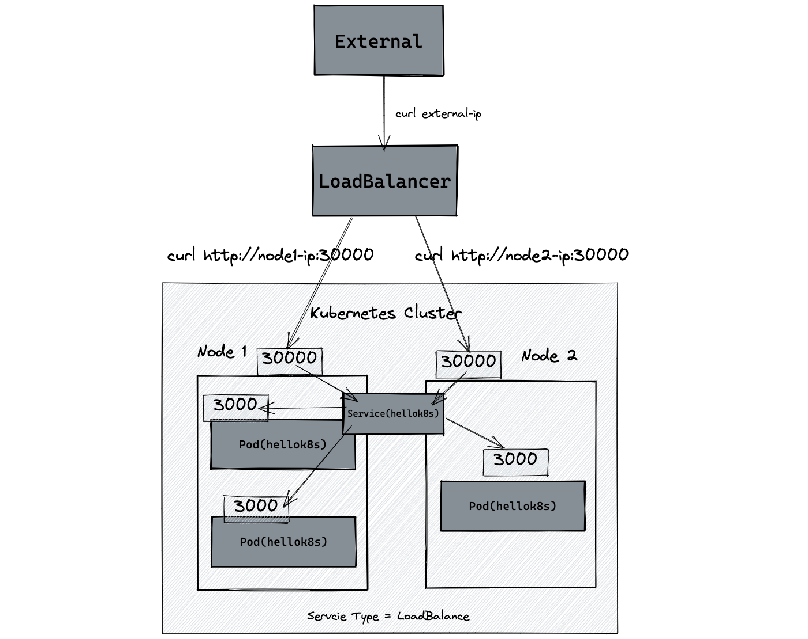

# WEEK046 - 学习 Kubernetes 流量管理之 Service

在 [week013-playing-with-kubernetes](../week013-playing-with-kubernetes/README.md) 这篇笔记中我们学习了 Kubernetes 的基本用法和概念，通过 Deployment 部署应用程序，然后通过 Service 将应用程序暴露给其他人访问。其中 Service 是 Kubernetes 最基础的流量管理机制之一，它的主要目的有：

* 以一个固定的地址来访问应用程序；
* 实现多个副本之间的负载均衡；
* 让应用程序可以在集群外部进行访问；

这篇笔记将继续使用之前的示例，通过一系列的实验更进一步地学习 Service 的工作原理。

## 准备实验环境

首先，创建一个 Deployment 部署应用程序，这里直接使用之前示例中的 `jocatalin/kubernetes-bootcamp:v1` 镜像，副本数设置为 3：

```
apiVersion: apps/v1
kind: Deployment
metadata:
  labels:
    app: myapp
    version: v1
  name: myapp
spec:
  replicas: 3
  selector:
    matchLabels:
      app: myapp
      version: v1
  template:
    metadata:
      labels:
        app: myapp
        version: v1
    spec:
      containers:
      - image: jocatalin/kubernetes-bootcamp:v1
        name: myapp
```

等待三个副本都启动成功：

```
# kubectl get deploy myapp -o wide
NAME    READY   UP-TO-DATE   AVAILABLE   AGE   CONTAINERS   IMAGES                             SELECTOR
myapp   3/3     3            3           13m   myapp        jocatalin/kubernetes-bootcamp:v1   app=myapp
```

然后创建一个 Service：

```
apiVersion: v1
kind: Service
metadata:
  labels:
    app: myapp
  name: myapp
spec:
  ports:
  - port: 38080
    targetPort: 8080
  selector:
    app: myapp
  type: ClusterIP
```

通过 `kubectl get svc` 查询 Service 的地址和端口：

```
# kubectl get svc myapp -o wide
NAME    TYPE        CLUSTER-IP    EXTERNAL-IP   PORT(S)     AGE     SELECTOR
myapp   ClusterIP   10.96.3.215   <none>        38080/TCP   7m22s   app=myapp
```

通过 Service 的地址验证服务能正常访问，多请求几次，可以看到会自动在副本之间轮询访问：

```
# curl 10.96.3.215:38080
Hello Kubernetes bootcamp! | Running on: myapp-fdb95659d-fl5c4 | v=1
# curl 10.96.3.215:38080
Hello Kubernetes bootcamp! | Running on: myapp-fdb95659d-dd5vv | v=1
# curl 10.96.3.215:38080
Hello Kubernetes bootcamp! | Running on: myapp-fdb95659d-4xf4g | v=1
# curl 10.96.3.215:38080
Hello Kubernetes bootcamp! | Running on: myapp-fdb95659d-fl5c4 | v=1
```

## Service 配置细节

上面是一个简单的 Service 示例，这一节对其配置参数进行详细说明。

### 端口配置

在上面的 Service 定义中，第一个重要参数是 `spec.ports` 端口配置：

```
spec:
  ports:
  - port: 38080
    targetPort: 8080
```

其中 `port` 表示 Service 的端口，`targetPort` 表示 Pod 的端口。Service 创建成功之后，Kubernetes 会为该 Service 分配一个 IP 地址，Service 从自己的 IP 地址和 `port` 端口接收请求，并将请求映射到符合条件的 Pod 的 `targetPort`。

#### 多端口配置

可以在一个 Service 对象中定义多个端口，此时，我们必须为每个端口定义一个名字：

```
spec:
  ports:
  - name: http
    port: 38080
    targetPort: 8080
  - name: https
    port: 38083
    targetPort: 8083
```

#### 协议配置

此外，可以给 Service 的端口指定协议：

```
spec:
  ports:
  - name: http
    protocol: TCP
    port: 38080
    targetPort: 8080
```

Service 支持的协议有以下几种：

* `TCP` - 所有的 Service 都支持 TCP 协议，这也是默认值；
* `UDP` - 几乎所有的 Service 都支持 UDP 协议，对于 `LoadBalancer` 类型的 Service，是否支持取决于云供应商；
* `SCTP` - 这是一种比较少见的协议，叫做 **流控制传输协议（Stream Control Transmission Protocol）**，和 TCP/UDP 属于同一层，常用于信令传输网络中，比如 4G 核心网的信令交互就是使用的 SCTP，WebRTC 中的 Data Channel 也是基于 SCTP 实现的；如果你的 Kubernetes 安装了支持 SCTP 协议的网络插件，那么大多数 Service 也就支持 SCTP 协议，同样地，对于 `LoadBalancer` 类型的 Service，是否支持取决于云供应商（大多数都不支持）；

具体的内容可以参考 Kubernetes 的官网文档 [Protocols for Services](https://kubernetes.io/docs/reference/networking/service-protocols/)，文档中对于 TCP 协议，还列出了一些特殊场景，这些大多是对于 `LoadBalancer` 类型的 Service，需要使用云供应商所提供特定的注解：

* HTTP 或 HTTPS 协议
* [PROXY 协议](https://www.haproxy.org/download/2.5/doc/proxy-protocol.txt)
* TLS Server

#### 具名端口

在应用程序升级时，服务的端口可能会发生变动，如果希望 Service 同时选择新老两个版本的 Pod，那么 `targetPort` 就不能写死。Kubernetes 支持为每个端口赋一个名称，然后我们将新老版本的端口名称保持一致，再将 `targetPort` 配置成该名称即可。

首先修改 Deployment 的定义，为端口赋上名称：

```
apiVersion: apps/v1
kind: Deployment
metadata:
  labels:
    app: myapp
    version: v1
  name: myapp
spec:
  replicas: 3
  selector:
    matchLabels:
      app: myapp
      version: v1
  template:
    metadata:
      labels:
        app: myapp
        version: v1
    spec:
      containers:
      - image: jocatalin/kubernetes-bootcamp:v1
        name: myapp
        ports:
        - name: myapp-port
          containerPort: 8080
          protocol: TCP
```

然后修改 Service 定义中的 `targetPort` 为端口名称即可：

```
apiVersion: v1
kind: Service
metadata:
  labels:
    app: myapp
  name: myapp
spec:
  ports:
  - port: 38080
    targetPort: myapp-port
  selector:
    app: myapp
  type: ClusterIP
```

### 标签选择器

Service 中的另一个重要字段是 `spec.selector` 选择器：

```
spec:
  selector:
    app: myapp
```

Service 通过 [标签选择器](https://kubernetes.io/docs/concepts/overview/working-with-objects/labels/) 选择符合条件的 Pod，并将选中的 Pod 作为网络服务的提供者。并且 Service 能持续监听 Pod 集合，一旦 Pod 集合发生变动，Service 就会同步被更新。

> 注意，标签选择器有两种类型：
> * 基于等值的需求（*Equality-based*）：比如 `environment = production` 或 `tier != frontend`
> * 基于集合的需求（*Set-based*）：比如 `environment in (production, qa)` 或 `tier notin (frontend, backend)`
> Service 只支持基于等值的选择器。

在上面的例子中，Service 的选择器为 `app: myapp`，而 Pod 有两个标签：`app: myapp` 和 `version: v1`，很显然是能够选中的。选中的 Pod 会自动加入到 Service 的 Endpoints 中，可以通过 `kubectl describe svc` 确认 Service 绑定了哪些 Endpoints：

```
# kubectl describe svc myapp
Name:              myapp
Namespace:         default
Labels:            app=myapp
Annotations:       <none>
Selector:          app=myapp
Type:              ClusterIP
IP Family Policy:  SingleStack
IP Families:       IPv4
IP:                10.96.3.215
IPs:               10.96.3.215
Port:              http  38080/TCP
TargetPort:        8080/TCP
Endpoints:         100.121.213.101:8080,100.121.213.103:8080,100.84.80.80:8080
Session Affinity:  None
Events:            <none>
```

也可以直接使用 `kubectl get endpoints` 查看：

```
# kubectl get endpoints myapp
NAME    ENDPOINTS                                                     AGE
myapp   100.121.213.101:8080,100.121.213.103:8080,100.84.80.80:8080   22m
```

使用选择器可以很灵活的控制要暴露哪些 Pod。假设我们的服务现在要升级，同时老版本的服务还不能下线，那么可以给新版本的 Pod 打上 `app: myapp` 和 `version: v2` 标签：

```
apiVersion: apps/v1
kind: Deployment
metadata:
  labels:
    app: myapp
    version: v2
  name: myapp2
spec:
  replicas: 1
  selector:
    matchLabels:
      app: myapp
      version: v2
  template:
    metadata:
      labels:
        app: myapp
        version: v2
    spec:
      containers:
      - image: jocatalin/kubernetes-bootcamp:v2
        name: myapp2
```

这样 Service 就可以同时选择 v1 和 v2 的服务。

#### 不带选择器的 Service

正如上面所说，Service 通过标签选择器选择符合条件的 Pod，并将选中的 Pod 加入到 Service 的 Endpoints 中。但是 Kubernetes 还支持一种特殊的不带选择器的 Service，如下所示：

```
apiVersion: v1
kind: Service
metadata:
  name: svc-no-selector
spec:
  ports:
  - port: 38081
    targetPort: 80
  type: ClusterIP
```

由于这个 Service 没有选择器，所以也就不会扫描 Pod，也就不会自动创建 Endpoint，不过我们可以手动创建一个 Endpoint 对象：

```
apiVersion: v1
kind: Endpoints
metadata:
  name: svc-no-selector
subsets:
  - addresses:
      - ip: 47.93.22.98
    ports:
      - port: 80
```

Endpoint 和 Service 的名称保持一致，这样这个 Service 就会映射到我们手动指定的 IP 地址和端口了。这种 Service 在很多场景下都非常有用：

* 可以在 Kubernetes 集群内部以 Service 的方式访问集群外部的地址；
* 可以将 Service 指向另一个名称空间中的 Service，或者另一个 Kubernetes 集群中的 Service；
* 可以系统中一部分应用程序迁移到 Kubernetes 中，另一部分仍然保留在 Kubernetes 之外；

### Service 类型

Service 中第三个重要字段是 `spec.type` 服务类型：

```
spec:
  type: ClusterIP
```

在 [week013-playing-with-kubernetes](../week013-playing-with-kubernetes/README.md) 这篇笔记中我们了解到，`Service` 有如下几种类型：

* `ClusterIP` - 这是 Service 的默认类型，在集群内部 IP 上公开 Service，这种类型的 Service 只能从集群内部访问；
* `NodePort` - 使用 NAT 在集群中每个选定 Node 的相同端口上公开 Service，可以通过 NodeIP:NodePort 从集群外部访问 Service，是 ClusterIP 的超集；
* `LoadBalancer` - 在集群中创建一个外部负载均衡器（如果支持的话），并为 Service 分配一个固定的外部 IP，是 NodePort 的超集；
* `ExternalName` - 通过返回带有该名称的 CNAME 记录，使用任意名称公开 Service，需要 kube-dns v1.7 或更高版本；

这一节将更深入地学习这几种类型的使用。

#### `ClusterIP`

`ClusterIP` 是 Service 的默认类型，这种类型的 Service 只能从集群内部访问，它的调用示意图如下：


可以看到，从 Pod 中访问 Service 时写死了 IP 地址，虽然说 Service 没有 Pod 那么易变，但是也可能出现误删的情况，重新创建 Service 之后，它的 IP 地址还是会发生变化，这时那些使用固定 IP 访问 Service 的 Pod 都需要调整了，Kubernetes 支持通过 `spec.clusterIP` 字段自定义集群 IP 地址：

```
spec:
  type: ClusterIP
  clusterIP: 10.96.3.215
```

这样可以让 Service 的 IP 地址固定下来，不过要注意的是，该 IP 地址必须在 kube-apiserver 的 `--service-cluster-ip-range` 配置参数范围内，这个参数可以从 kube-apiserver 的 Pod 定义中找到：

```
# kubectl get pods -n kube-system kube-apiserver-xxx -o yaml
...
spec:
  containers:
  - command:
    - kube-apiserver
    - --service-cluster-ip-range=10.96.0.0/22
...
```

不过写死 IP 地址终究不是最佳实践，Kubernetes 提供了两种服务发现机制来解决这个问题：

* 环境变量
* DNS

TODO 服务发现机制

#### `NodePort`

`NodePort` 是 `ClusterIP` 的超集，这种类型的 Service 可以从集群外部访问，我们可以通过集群中的任意一台主机来访问它，调用示意图如下：


#### `LoadBalancer`

`LoadBalancer` 是 `NodePort` 的超集，这种类型的 Service 也可以从集群外部访问，而且它是以一个统一的负载均衡器地址来访问的，所以调用方不用关心集群中的主机地址，调用示意图如下：



#### `ExternalName`

`ExternalName` 是一种特殊类型的 Service，这也是一种不带选择器的 Service，不会生成后端的 Endpoint，而且它不用定义端口，而是指定外部服务的 DNS 域名：

```
apiVersion: v1
kind: Service
metadata:
  name: svc-external-name
spec:
  type: ExternalName
  externalName: www.aneasystone.com
```

查询该 Service 信息可以看到，这个 Service 没有 `CLUSTER-IP`，只有 `EXTERNAL-IP`：

```
# kubectl get svc svc-external-name
NAME                TYPE           CLUSTER-IP   EXTERNAL-IP           PORT(S)   AGE
svc-external-name   ExternalName   <none>       www.aneasystone.com   <none>    40m
```

要访问这个 Service，我们需要进到 Pod 容器里，随便找一个容器：

```
# kubectl exec -it myapp-b9744c975-ftgdx -- bash
```

然后通过这个 Service 的域名 `svc-external-name.default.svc.cluster.local` 来访问：

```
root@myapp-b9744c975-ftgdx:/# curl https://svc-external-name.default.svc.cluster.local -k
```

当以域名的方式访问 Service 时，集群的 DNS 服务将返回一个值为 `www.aneasystone.com` 的 CNAME 记录，整个过程都发生在 DNS 层，不会进行代理或转发。

https://kuboard.cn/learning/k8s-intermediate/service/service-details.html

https://kubernetes.io/docs/concepts/services-networking/service/

https://kubernetes.feisky.xyz/concepts/objects/service

https://zeusro-awesome-kubernetes-notes.readthedocs.io/zh_CN/latest/chapter_8.html

https://jimmysong.io/kubernetes-handbook/concepts/service.html

https://learn.lianglianglee.com/%e4%b8%93%e6%a0%8f/Kubernetes%20%e5%ae%9e%e8%b7%b5%e5%85%a5%e9%97%a8%e6%8c%87%e5%8d%97/15%20Service%20%e5%b1%82%e5%bc%95%e6%b5%81%e6%8a%80%e6%9c%af%e5%ae%9e%e8%b7%b5.md

https://learn.lianglianglee.com/%e4%b8%93%e6%a0%8f/Kubernetes%20%e5%ae%9e%e8%b7%b5%e5%85%a5%e9%97%a8%e6%8c%87%e5%8d%97/13%20%e7%90%86%e8%a7%a3%e5%af%b9%e6%96%b9%e6%9a%b4%e9%9c%b2%e6%9c%8d%e5%8a%a1%e7%9a%84%e5%af%b9%e8%b1%a1%20Ingress%20%e5%92%8c%20Service.md

## Service 实现原理

https://blog.frognew.com/2018/10/kubernetes-kube-proxy-enable-ipvs.html

## Network Policy

https://kubernetes.feisky.xyz/concepts/objects/network-policy

## CoreDNS

https://learn.lianglianglee.com/%E4%B8%93%E6%A0%8F/Kubernetes%20%E5%AE%9E%E8%B7%B5%E5%85%A5%E9%97%A8%E6%8C%87%E5%8D%97/11%20%E6%9C%8D%E5%8A%A1%E5%8F%91%E7%8E%B0%20DNS%20%E7%9A%84%E8%90%BD%E5%9C%B0%E5%AE%9E%E8%B7%B5.md

## 参考

1. [Kubernetes 练习手册](https://k8s-tutorials.pages.dev/service.html)
1. [数据包在 Kubernetes 中的一生（1）](https://blog.fleeto.us/post/life-of-a-packet-in-k8s-1/)
1. [IPVS从入门到精通kube-proxy实现原理](https://zhuanlan.zhihu.com/p/94418251)
1. [Kubernetes（k8s）kube-proxy、Service详解](https://www.cnblogs.com/liugp/p/16372503.html)
