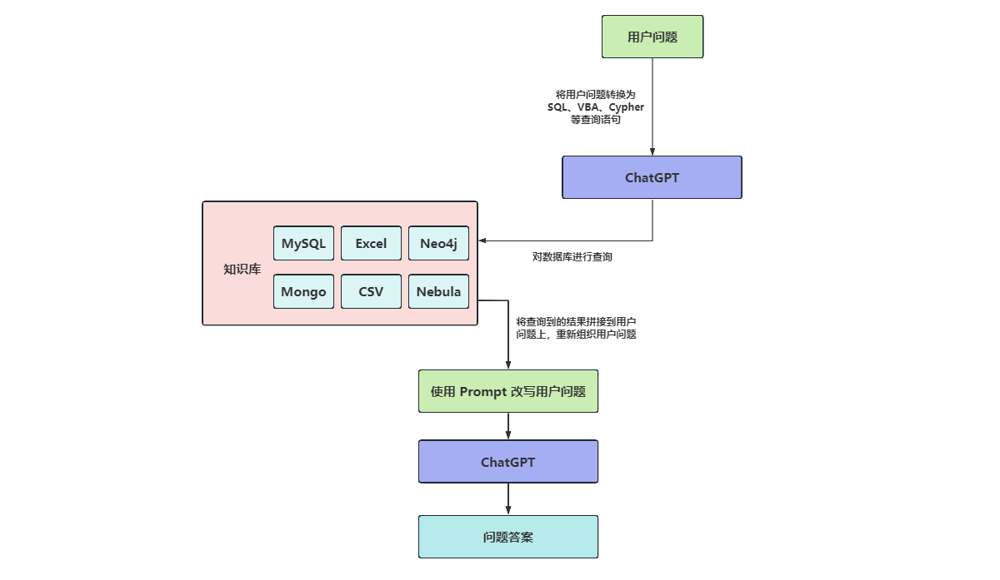

# WEEK047 - 基于结构化数据的文档问答

利用大模型打造文档问答系统对于个人和企业来说都是一个非常重要的应用场景，也是各大公司争相推出的基于大模型的落地产品之一，同时，在开源领域，文档问答也是非常火热，涌现出了一大批与之相关的开源项目，比如：[Quivr](https://github.com/StanGirard/quivr)、[PrivateGPT](https://github.com/imartinez/privateGPT)、[document.ai](https://github.com/GanymedeNil/document.ai)、[FastGPT](https://fastgpt.run/)、[DocsGPT](https://github.com/arc53/DocsGPT) 等等。我在 [week042-doc-qa-using-embedding](../week042-doc-qa-using-embedding/README.md) 这篇笔记中介绍了文档问答的基本原理，通过 OpenAI 的 Embedding 接口实现了一个最简单的本地知识库助手，并在 [week043-llm-application-frameworks-langchain](../week043-llm-application-frameworks-langchain/README.md) 这篇笔记中通过 LangChain 的 `RetrievalQA` 再次实现了基于文档的问答，还介绍了四种处理大文档的方法（`Stuff` `Refine` `MapReduce` 和 `MapRerank`）。

大抵来说，这类文档问答系统基本上都是基于 Embedding 和向量数据库来实现的，首先将文档分割成片段保存在向量库中，然后拿着用户的问题在向量库中检索，检索出来的结果是和用户问题最接近的文档片段，最后再将这些片段和用户问题一起交给大模型进行总结和提炼，从而给出用户问题的答案。在这个过程中，向量数据库是最关键的一环，这也是前一段时间向量数据库火得飞起的原因。

不过，并不是所有的知识库都是以文档的形式存在的，还有很多结构化的知识散落在企业的各种数据源中，数据源可能是 MySQL、Mongo 等数据库，也可能是 CSV、Excel 等表格，还可能是 Neo4j、Nebula 等图谱数据库。如果要针对这些知识进行问答，Embedding 基本上就派不上用场了，所以我们还得想另外的解决方案，这篇文章将针对这种场景做一番粗略的研究。

## 基本思路

我们知道，几乎每种数据库都提供了对应的查询方法，比如可以使用 SQL 查询 MySQL，使用 VBA 查询 Excel，使用 Cipher 查询 Neo4j 等等。那么很自然的一种想法是，如果能将用户的问题转换为查询语句，就可以先对数据库进行查询得到结果，这和从向量数据库中查询文档是类似的，再将查询出来的结果丢给大模型，就可以回答用户的问题了：



那么问题来了，如何将用户的问题转换为查询语句呢？

### 初步尝试

```
$ docker run -d -p 3306:3306 --name mysql \
	-v $PWD/init:/docker-entrypoint-initdb.d \
	-e MYSQL_ROOT_PASSWORD=123456 \
	mysql:5.7
```

## LangChain

### QA over structured data

https://python.langchain.com/docs/expression_language/cookbook/sql_db

https://python.langchain.com/docs/use_cases/qa_structured/sql

### SQL Database Toolkit and Agent

https://python.langchain.com/docs/integrations/toolkits/sql_database

## DB-GPT

https://db-gpt.readthedocs.io/en/latest/

## 常见 SQL 用例

## 参考

* [Querying a SQL DB](https://python.langchain.com/docs/expression_language/cookbook/sql_db)
* [QA over structured data](https://python.langchain.com/docs/use_cases/qa_structured/sql)
* [SQL Database Toolkit and Agent](https://python.langchain.com/docs/integrations/toolkits/sql_database)
* [LLMs and SQL](https://blog.langchain.dev/llms-and-sql/)
* [‘Talk’ to Your SQL Database Using LangChain and Azure OpenAI](https://towardsdatascience.com/talk-to-your-sql-database-using-langchain-and-azure-openai-bb79ad22c5e2)
* [Semi-structured RAG](https://github.com/langchain-ai/langchain/blob/master/cookbook/Semi_Structured_RAG.ipynb)
* [Private Semi-structured and Multi-modal RAG w/ LLaMA2 and LLaVA](https://github.com/langchain-ai/langchain/blob/master/cookbook/Semi_structured_multi_modal_RAG_LLaMA2.ipynb)
* [大模型与数据科学：从Text-to-SQL 开始（一）](https://zhuanlan.zhihu.com/p/640580808)
* [大模型与商业智能BI：LLM-as-数据小助理（二）](https://zhuanlan.zhihu.com/p/640696719)
* [大模型+知识库/数据库问答的若干问题（三）](https://zhuanlan.zhihu.com/p/642125832)
