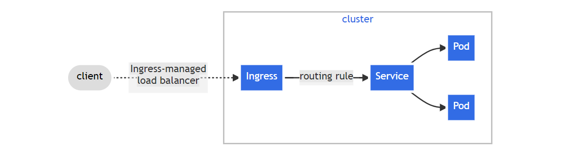

# WEEK048 - 学习 Kubernetes 流量管理之 Ingress

在 [week046-kubernetes-traffic-management-service](../week046-kubernetes-traffic-management-service/README.md) 这篇笔记中我们学习了 Kubernetes 是如何使用 Service 进行流量管理的，我们可以通过 `NodePort` 和 `LoadBalancer` 这两种类型的 Service 让应用程序暴露到集群外部，不过这两种方式都有各自的问题：

* `NodePort` 会在所有节点上暴露端口，外部应用需要知道集群内部节点的 IP 才能访问，一旦集群节点发生变化，外部应用也会受影响，可用性无法保证；而且端口的范围是受限的，默认只能使用 30000 到 32767 之间的端口，外部应用使用起来会感觉怪怪的；另外，每个端口只能对应一个 Service，如果 Service 数量过多，暴露的端口也会过多，不仅安全性难以保障，而且管理起来也会很麻烦；
* `LoadBalancer` 依赖于外部负载均衡器作为流量的入口，它在云平台中使用非常广泛，一般使用云供应商提供的 LB 服务，它会有一个自己的 IP 地址来转发所有流量，不过要注意的是，你暴露的每个 Service 都对应一个 LB 服务，而每个 LB 都需要独立付费，如果你暴露的 Service 很多，这将是非常昂贵的。

## 什么是 Ingress

为了解决上面的问题，Kubernetes 提出了一种新的 API 对象，叫做 [Ingress](https://kubernetes.io/docs/concepts/services-networking/ingress/)，它通过定义不同的 HTTP 路由规则，将集群内部的 Service 通过 HTTP 的方式暴露到集群外部：



通过 `Ingress` 我们就能以一个集群外部可访问的 URL 来访问集群内部的 Service，不仅如此，它还具有如下特性：

* Load Balancing
* SSL Termination
* Name-based Virtual Hosting

## Ingress 实践

这一节将继续延用之前的 `kubernetes-bootcamp` 示例，通过 `Ingress` 将应用程序暴露到集群外部访问。

### 部署 Ingress Controller

`Ingress` 本身其实并不具备集群内外通信的能力，它只是一系列的路由转发规则而已，要让这些路由规则生效，必须先部署 `Ingress Controller` 才行。

由 Kubernetes 支持和维护的 `Ingress Controller` 有三个：

* [Ingress NGINX Controller](https://github.com/kubernetes/ingress-nginx)
* [AWS Load Balancer Controller](https://github.com/kubernetes-sigs/aws-load-balancer-controller)
* [GLBC](https://github.com/kubernetes/ingress-gce)

除此之外，[这里](https://kubernetes.io/docs/concepts/services-networking/ingress-controllers/#additional-controllers) 还列出了很多由第三方社区维护的其他 `Ingress Controller` 可供选择。

下面我们就以 Ingress NGINX Controller 为例，学习如何部署 Ingress Controller。根据 [官方的部署文档](https://kubernetes.github.io/ingress-nginx/deploy/)，我们大致有两种方式来部署 Ingress NGINX Controller，第一种是通过 Helm 部署：

```
# helm upgrade --install ingress-nginx ingress-nginx \
  --repo https://kubernetes.github.io/ingress-nginx \
  --namespace ingress-nginx --create-namespace
```

第二种是通过 `kubectl apply` 部署，我比较喜欢这种方式，可以从 YAML 中看到整个部署的细节：

```
# kubectl apply -f https://raw.githubusercontent.com/kubernetes/ingress-nginx/controller-v1.8.2/deploy/static/provider/cloud/deploy.yaml
namespace/ingress-nginx created
serviceaccount/ingress-nginx created
serviceaccount/ingress-nginx-admission created
role.rbac.authorization.k8s.io/ingress-nginx created
role.rbac.authorization.k8s.io/ingress-nginx-admission created
clusterrole.rbac.authorization.k8s.io/ingress-nginx created
clusterrole.rbac.authorization.k8s.io/ingress-nginx-admission created
rolebinding.rbac.authorization.k8s.io/ingress-nginx created
rolebinding.rbac.authorization.k8s.io/ingress-nginx-admission created
clusterrolebinding.rbac.authorization.k8s.io/ingress-nginx created
clusterrolebinding.rbac.authorization.k8s.io/ingress-nginx-admission created
configmap/ingress-nginx-controller created
service/ingress-nginx-controller created
service/ingress-nginx-controller-admission created
deployment.apps/ingress-nginx-controller created
job.batch/ingress-nginx-admission-create created
job.batch/ingress-nginx-admission-patch created
ingressclass.networking.k8s.io/nginx created
validatingwebhookconfiguration.admissionregistration.k8s.io/ingress-nginx-admission created
```

从上面的输出可以看到，Ingress NGINX Controller 首先创建一个名为 `ingress-nginx` 的命名空间，然后在这个命名空间下创建了一堆相关的资源，包括 ServiceAccount、Role、ConfigMap、Deployment、Service、Job 等等，这中间，最重要的是 `deployment.apps/ingress-nginx-controller` 和 `service/ingress-nginx-controller` 这两项；其实，Ingress Controller 本质上就是一个 Deployment 加上一个 Service，这个 Deployment 通过监听 Ingress 对象的变动来更新路由规则，而用户访问集群的入口仍然是通过 Service 实现的，所以想让用户通过 Ingress 来访问集群，还是得靠 Service 的两种外部通信方式：`NodePort` 和 `LoadBalancer`。

查看上面这个 YAML，可以发现它使用的就是 `LoadBalancer` 类型的 Service，一般适用于云环境，如果你没有云环境，官方也提供了几种在物理机环境部署的方式：

* [A pure software solution: MetalLB](https://kubernetes.github.io/ingress-nginx/deploy/baremetal/#a-pure-software-solution-metallb)
* [Over a NodePort Service](https://kubernetes.github.io/ingress-nginx/deploy/baremetal/#over-a-nodeport-service)
* [Via the host network](https://kubernetes.github.io/ingress-nginx/deploy/baremetal/#via-the-host-network)
* [Using a self-provisioned edge](https://kubernetes.github.io/ingress-nginx/deploy/baremetal/#using-a-self-provisioned-edge)
* [External IPs](https://kubernetes.github.io/ingress-nginx/deploy/baremetal/#external-ips)

其中最简单的方式是使用 `NodePort` 类型的 Service，直接使用下面这个 YAML 部署即可：

```
# kubectl apply -f https://raw.githubusercontent.com/kubernetes/ingress-nginx/controller-v1.8.2/deploy/static/provider/baremetal/deploy.yaml
```

部署完成后，通过下面的命令检查 Ingress NGINX Controller 是否运行成功：

```
# kubectl get deployment -n ingress-nginx
NAME                       READY   UP-TO-DATE   AVAILABLE   AGE
ingress-nginx-controller   1/1     1            1           29h
```

通过下面的命令确定 Ingress NGINX Controller 的 NodePort 是多少：

```
# kubectl get svc -n ingress-nginx
NAME                                 TYPE        CLUSTER-IP    EXTERNAL-IP   PORT(S)                      AGE
ingress-nginx-controller             NodePort    10.96.0.183   <none>        80:26360/TCP,443:23476/TCP   29h
ingress-nginx-controller-admission   ClusterIP   10.96.1.25    <none>        443/TCP                      29h
```

此时，我们就可以通过 NodePort 来访问集群了，只不过因为我们还没有配置任何路由，所以访问会报 `404 Not Found`：

```
# curl http://172.31.164.40:26360
<html>
<head><title>404 Not Found</title></head>
<body>
<center><h1>404 Not Found</h1></center>
<hr><center>nginx</center>
</body>
</html>
```

### 创建 Ingress

接下来，我们创建一个简单的路由规则来验证 `Ingress` 是否有效：

```
apiVersion: networking.k8s.io/v1
kind: Ingress
metadata:
  name: my-ingress
spec:
  ingressClassName: nginx
  rules:
  - http:
      paths:
      - path: /hello
        pathType: Prefix
        backend:
          service:
            name: myapp
            port:
              number: 38080
```

这个路由规则很容易理解，就是将 `/hello` 路径映射到后端名为 `myapp` 的 Service 的 38080 端口。其中值得注意的是 `ingressClassName: nginx` 这个配置，细心的同学可能已经发现，在上面部署 Ingress NGINX Controller 的时候，默认还创建了一个 `IngressClass` 资源：

```
apiVersion: networking.k8s.io/v1
kind: IngressClass
metadata:
  labels:
    app.kubernetes.io/component: controller
    app.kubernetes.io/instance: ingress-nginx
    app.kubernetes.io/name: ingress-nginx
    app.kubernetes.io/part-of: ingress-nginx
    app.kubernetes.io/version: 1.8.2
  name: nginx
spec:
  controller: k8s.io/ingress-nginx
```

我们可以将 `IngressClass` 理解成面向对象中的类这个概念，而 `Ingress` 则是类的具体示例。在 Ingress NGINX Controller 的启动参数里，我们能看到 `--ingress-class=nginx` 这样的参数：

```
apiVersion: apps/v1
kind: Deployment
metadata:
  name: ingress-nginx-controller
  namespace: ingress-nginx
spec:
  minReadySeconds: 0
  revisionHistoryLimit: 10
  template:
    spec:
      containers:
      - args:
        - /nginx-ingress-controller
        - --election-id=ingress-nginx-leader
        - --controller-class=k8s.io/ingress-nginx
        - --ingress-class=nginx
```

表示它会监听名为 `nginx` 的 `IngressClass`，一个集群中可能会部署多个 Ingress Controller，这样就会有多个 `IngressClass`，所以上面创建 `Ingress` 时指定 `ingressClassName: nginx` 表示将这个路由规则应用到刚部署的 Ingress NGINX Controller。

通过 curl 验证 `Ingress` 是否生效：

```
# curl http://172.31.164.40:26360/hello
Hello Kubernetes bootcamp! | Running on: myapp-b9744c975-9xm5j | v=1
```

## Ingress 类型

https://github.com/guangzhengli/k8s-tutorials#ingress

https://kubernetes.feisky.xyz/concepts/objects/ingress

https://zeusro-awesome-kubernetes-notes.readthedocs.io/zh_CN/latest/chapter_9.html

https://learn.lianglianglee.com/%e4%b8%93%e6%a0%8f/Kubernetes%20%e5%ae%9e%e8%b7%b5%e5%85%a5%e9%97%a8%e6%8c%87%e5%8d%97/15%20Service%20%e5%b1%82%e5%bc%95%e6%b5%81%e6%8a%80%e6%9c%af%e5%ae%9e%e8%b7%b5.md

https://learn.lianglianglee.com/%e4%b8%93%e6%a0%8f/Kubernetes%20%e5%ae%9e%e8%b7%b5%e5%85%a5%e9%97%a8%e6%8c%87%e5%8d%97/13%20%e7%90%86%e8%a7%a3%e5%af%b9%e6%96%b9%e6%9a%b4%e9%9c%b2%e6%9c%8d%e5%8a%a1%e7%9a%84%e5%af%b9%e8%b1%a1%20Ingress%20%e5%92%8c%20Service.md

## 参考

* [Ingress | Kubernetes](https://kubernetes.io/docs/concepts/services-networking/ingress/)
* [Ingress Controllers | Kubernetes](https://kubernetes.io/docs/concepts/services-networking/ingress-controllers/)
* [Kubernetes 教程 | Kuboard](https://kuboard.cn/learning/k8s-intermediate/service/ingress.html)
* [Ingress - Kubernetes 指南](https://kubernetes.feisky.xyz/concepts/objects/ingress)
* [Ingress Controller - Kubernetes 指南](https://kubernetes.feisky.xyz/extension/ingress)
* [Ingress · Kubernetes 中文指南](https://jimmysong.io/kubernetes-handbook/concepts/ingress.html)
* [Set up Ingress on Minikube with the NGINX Ingress Controller](https://kubernetes.io/docs/tasks/access-application-cluster/ingress-minikube/)
* [Ingress：k8s集群进出流量的总管](https://mp.weixin.qq.com/s/YbiqttXFQf2DZcIvHmAuLw)
* [k8s入门到实战-使用Ingress](https://crossoverjie.top/2023/09/15/ob/k8s-Ingress/)
* [5分钟搞懂Ingress / IngressController / IngressClass的区别](http://www.mangod.top/articles/2023/09/15/1694742027308.html)

## 更多

### APISIX Ingress Controller

* [为什么 APISIX Ingress 是比 Ingress NGINX 更好的选择？](https://www.apiseven.com/blog/apisix-ingress-vs-ingress-nginx-2)
* [为什么 APISIX Ingress 是比 Traefik 更好的选择？](https://www.apiseven.com/blog/why-you-should-choose-apisix-ingress-instead-on-traefik)
* [为什么 APISIX Ingress 是比 Emissary-ingress 更好的选择？](https://mp.weixin.qq.com/s/eFwOtF31tcTbmeU4Rd8ktQ)

### Kong Ingress Controller

* [Kong Ingress Controller with Spring Boot](https://www.baeldung.com/spring-boot-kong-ingress)
