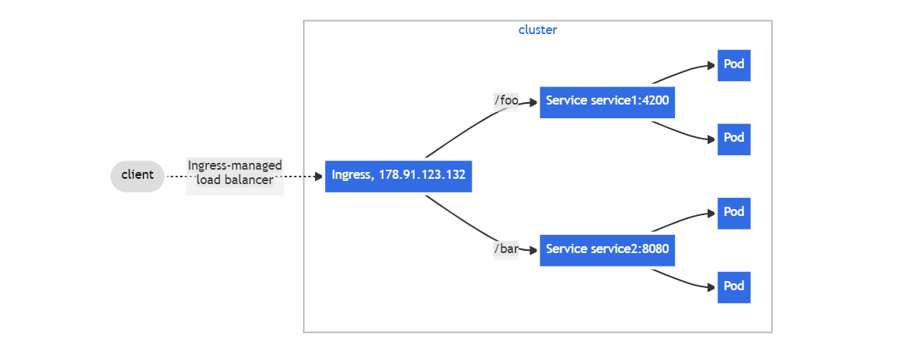

# WEEK048 - 学习 Kubernetes 流量管理之 Ingress

在 [week046-kubernetes-traffic-management-service](../week046-kubernetes-traffic-management-service/README.md) 这篇笔记中我们学习了 Kubernetes 是如何使用 Service 进行流量管理的，我们可以通过 `NodePort` 和 `LoadBalancer` 这两种类型的 Service 让应用程序暴露到集群外部，不过这两种方式都有各自的问题：

* `NodePort` 会在所有节点上暴露端口，外部应用需要知道集群内部节点的 IP 才能访问，一旦集群节点发生变化，外部应用也会受影响，可用性无法保证；而且端口的范围是受限的，默认只能使用 30000 到 32767 之间的端口，外部应用使用起来会感觉怪怪的；另外，每个端口只能对应一个 Service，如果 Service 数量过多，暴露的端口也会过多，不仅安全性难以保障，而且管理起来也会很麻烦；
* `LoadBalancer` 依赖于外部负载均衡器作为流量的入口，它在云平台中使用非常广泛，一般使用云供应商提供的 LB 服务，它会有一个自己的 IP 地址来转发所有流量，不过要注意的是，你暴露的每个 Service 都对应一个 LB 服务，而每个 LB 都需要独立付费，如果你暴露的 Service 很多，这将是非常昂贵的。

## 什么是 Ingress

为了解决上面的问题，Kubernetes 提出了一种新的 API 对象，叫做 [Ingress](https://kubernetes.io/docs/concepts/services-networking/ingress/)，它通过定义不同的 HTTP 路由规则，将集群内部的 Service 通过 HTTP 的方式暴露到集群外部：


可以将 `Ingress` 理解为 Service 的网关，它是所有流量的入口，通过 `Ingress` 我们就能以一个集群外部可访问的 URL 来访问集群内部的 Service，不仅如此，它还具有如下特性：

* Load Balancing
* SSL Termination
* Name-based Virtual Hosting

## Ingress 实践

这一节将继续延用之前的 `kubernetes-bootcamp` 示例，通过 `Ingress` 将应用程序暴露到集群外部访问。

### 部署 Ingress Controller

`Ingress` 本身其实并不具备集群内外通信的能力，它只是一系列的路由转发规则而已，要让这些路由规则生效，必须先部署 `Ingress Controller` 才行。

由 Kubernetes 支持和维护的 `Ingress Controller` 有三个：

* [Ingress NGINX Controller](https://github.com/kubernetes/ingress-nginx)
* [AWS Load Balancer Controller](https://github.com/kubernetes-sigs/aws-load-balancer-controller)
* [GLBC](https://github.com/kubernetes/ingress-gce)

除此之外，[这里](https://kubernetes.io/docs/concepts/services-networking/ingress-controllers/#additional-controllers) 还列出了很多由第三方社区维护的其他 `Ingress Controller` 可供选择。

下面我们就以 Ingress NGINX Controller 为例，学习如何部署 Ingress Controller。

> 目前有两个基于 Nginx 实现的 Ingress Controller 比较有名，一个是由 Kubernetes 官方维护的 [kubernetes/ingress-nginx](https://github.com/kubernetes/ingress-nginx)，被称为 Ingress NGINX Controller，另一个是由 Nginx 官方维护的 [nginxinc/kubernetes-ingress](https://github.com/nginxinc/kubernetes-ingress)，被称为 NGINX Ingress Controller，[两者在技术实现和功能特性上有很多区别](https://ladybug.top/posts/CloudNative/nginx-ingress-controller-and-ingress-nginx-controller-timeout-error.html)，大家在使用时要特别留意。

根据 Ingress NGINX Controller [官方的部署文档](https://kubernetes.github.io/ingress-nginx/deploy/)，我们大致有两种方式来部署它，第一种是通过 Helm 部署：

```
# helm upgrade --install ingress-nginx ingress-nginx \
  --repo https://kubernetes.github.io/ingress-nginx \
  --namespace ingress-nginx --create-namespace
```

第二种是通过 `kubectl apply` 部署，我比较喜欢这种方式，可以从 YAML 中看到整个部署的细节：

```
# kubectl apply -f https://raw.githubusercontent.com/kubernetes/ingress-nginx/controller-v1.8.2/deploy/static/provider/cloud/deploy.yaml
namespace/ingress-nginx created
serviceaccount/ingress-nginx created
serviceaccount/ingress-nginx-admission created
role.rbac.authorization.k8s.io/ingress-nginx created
role.rbac.authorization.k8s.io/ingress-nginx-admission created
clusterrole.rbac.authorization.k8s.io/ingress-nginx created
clusterrole.rbac.authorization.k8s.io/ingress-nginx-admission created
rolebinding.rbac.authorization.k8s.io/ingress-nginx created
rolebinding.rbac.authorization.k8s.io/ingress-nginx-admission created
clusterrolebinding.rbac.authorization.k8s.io/ingress-nginx created
clusterrolebinding.rbac.authorization.k8s.io/ingress-nginx-admission created
configmap/ingress-nginx-controller created
service/ingress-nginx-controller created
service/ingress-nginx-controller-admission created
deployment.apps/ingress-nginx-controller created
job.batch/ingress-nginx-admission-create created
job.batch/ingress-nginx-admission-patch created
ingressclass.networking.k8s.io/nginx created
validatingwebhookconfiguration.admissionregistration.k8s.io/ingress-nginx-admission created
```

从上面的输出可以看到，Ingress NGINX Controller 首先创建一个名为 `ingress-nginx` 的命名空间，然后在这个命名空间下创建了一堆相关的资源，包括 ServiceAccount、Role、ConfigMap、Deployment、Service、Job 等等，这中间，最重要的是 `deployment.apps/ingress-nginx-controller` 和 `service/ingress-nginx-controller` 这两项；其实，Ingress Controller 本质上就是一个 Deployment 加上一个 Service，这个 Deployment 通过监听 Ingress 对象的变动来更新路由规则，而用户访问集群的入口仍然是通过 Service 实现的，所以想让用户通过 Ingress 来访问集群，还是得靠 Service 的两种外部通信方式：`NodePort` 和 `LoadBalancer`。

查看上面这个 YAML，可以发现它使用的就是 `LoadBalancer` 类型的 Service，一般适用于云环境，如果你没有云环境，官方也提供了几种在物理机环境部署的方式：

* [A pure software solution: MetalLB](https://kubernetes.github.io/ingress-nginx/deploy/baremetal/#a-pure-software-solution-metallb)
* [Over a NodePort Service](https://kubernetes.github.io/ingress-nginx/deploy/baremetal/#over-a-nodeport-service)
* [Via the host network](https://kubernetes.github.io/ingress-nginx/deploy/baremetal/#via-the-host-network)
* [Using a self-provisioned edge](https://kubernetes.github.io/ingress-nginx/deploy/baremetal/#using-a-self-provisioned-edge)
* [External IPs](https://kubernetes.github.io/ingress-nginx/deploy/baremetal/#external-ips)

其中最简单的方式是使用 `NodePort` 类型的 Service，直接使用下面这个 YAML 部署即可：

```
# kubectl apply -f https://raw.githubusercontent.com/kubernetes/ingress-nginx/controller-v1.8.2/deploy/static/provider/baremetal/deploy.yaml
```

部署完成后，通过下面的命令检查 Ingress NGINX Controller 是否运行成功：

```
# kubectl get deployment -n ingress-nginx
NAME                       READY   UP-TO-DATE   AVAILABLE   AGE
ingress-nginx-controller   1/1     1            1           29h
```

通过下面的命令确定 Ingress NGINX Controller 的 NodePort 是多少：

```
# kubectl get svc -n ingress-nginx
NAME                                 TYPE        CLUSTER-IP    EXTERNAL-IP   PORT(S)                      AGE
ingress-nginx-controller             NodePort    10.96.0.183   <none>        80:26360/TCP,443:23476/TCP   29h
ingress-nginx-controller-admission   ClusterIP   10.96.1.25    <none>        443/TCP                      29h
```

此时，我们就可以通过 NodePort 来访问集群了，只不过因为我们还没有配置任何路由，所以访问会报 `404 Not Found`：

```
# curl http://172.31.164.40:26360
<html>
<head><title>404 Not Found</title></head>
<body>
<center><h1>404 Not Found</h1></center>
<hr><center>nginx</center>
</body>
</html>
```

注意这里实际上暴露了两个 NodePort，一个是 HTTP 端口，另一个是 HTTPS 端口，这个 HTTPS 端口我们也可以访问（`-k` 表示忽略证书校验）：

```
# curl -k https://172.31.164.40:23476
<html>
<head><title>404 Not Found</title></head>
<body>
<center><h1>404 Not Found</h1></center>
<hr><center>nginx</center>
</body>
</html>
```

### 创建 Ingress

接下来，我们创建一个简单的路由规则来验证 `Ingress` 是否有效：

```
apiVersion: networking.k8s.io/v1
kind: Ingress
metadata:
  name: my-ingress
spec:
  ingressClassName: nginx
  rules:
  - http:
      paths:
      - path: /hello
        pathType: Prefix
        backend:
          service:
            name: myapp
            port:
              number: 38080
```

这个路由规则很容易理解，就是将 `/hello` 路径映射到后端名为 `myapp` 的 Service 的 38080 端口。在使用 Ingress 时要注意你的 Kubernetes 版本，不同的 Kubernetes 版本中 Ingress 的 `apiVersion` 字段略有不同：

| Kubernetes 版本 | Ingress 的 `apiVersion` |
| -------------- | ------------ |
| v1.5 - v1.17 | `extensions/v1beta1` |
| v1.8 - v1.18 | `networking.k8s.io/v1beta1` |
| v1.19+       | `networking.k8s.io/v1` |

另一点值得注意的是 `ingressClassName: nginx` 这个配置，细心的同学可能已经发现，在上面部署 Ingress NGINX Controller 的时候，默认还创建了一个 `IngressClass` 资源：

```
apiVersion: networking.k8s.io/v1
kind: IngressClass
metadata:
  labels:
    app.kubernetes.io/component: controller
    app.kubernetes.io/instance: ingress-nginx
    app.kubernetes.io/name: ingress-nginx
    app.kubernetes.io/part-of: ingress-nginx
    app.kubernetes.io/version: 1.8.2
  name: nginx
spec:
  controller: k8s.io/ingress-nginx
```

我们可以将 `IngressClass` 理解成面向对象中的类这个概念，而 `Ingress` 则是类的具体示例。在 Ingress NGINX Controller 的启动参数里，我们能看到 `--ingress-class=nginx` 这样的参数：

```
apiVersion: apps/v1
kind: Deployment
metadata:
  name: ingress-nginx-controller
  namespace: ingress-nginx
spec:
  minReadySeconds: 0
  revisionHistoryLimit: 10
  template:
    spec:
      containers:
      - args:
        - /nginx-ingress-controller
        - --election-id=ingress-nginx-leader
        - --controller-class=k8s.io/ingress-nginx
        - --ingress-class=nginx
```

表示它会监听名为 `nginx` 的 `IngressClass`，一个集群中可能会部署多个 Ingress Controller，这样就会有多个 `IngressClass`，所以上面创建 `Ingress` 时指定 `ingressClassName: nginx` 表示将这个路由规则应用到刚部署的 Ingress NGINX Controller。

通过 curl 验证 `Ingress` 是否生效：

```
# curl http://172.31.164.40:26360/hello
Hello Kubernetes bootcamp! | Running on: myapp-b9744c975-9xm5j | v=1
```

可以看出，虽然 `myapp` 这个 Service 类型为 `ClusterIP`，但是通过 Ingress 我们也可以从集群外部对其进行访问了。

### 默认 IngressClass

我们可以给某个 `IngressClass` 加上 `ingressclass.kubernetes.io/is-default-class` 注解，并将值设置为字符串 `"true"`，表示这是集群中默认的 `IngressClass`：

```
apiVersion: networking.k8s.io/v1
kind: IngressClass
metadata:
  annotations:
    ingressclass.kubernetes.io/is-default-class: "true"
  labels:
    app.kubernetes.io/component: controller
    app.kubernetes.io/instance: ingress-nginx
    app.kubernetes.io/name: ingress-nginx
    app.kubernetes.io/part-of: ingress-nginx
    app.kubernetes.io/version: 1.8.2
  name: nginx
spec:
  controller: k8s.io/ingress-nginx
```

当集群中存在默认的 `IngressClass` 时，创建 `Ingress` 时就可以不用指定 `ingressClassName` 参数了：

```
apiVersion: networking.k8s.io/v1
kind: Ingress
metadata:
  name: my-ingress
spec:
  rules:
  - http:
      paths:
      - path: /hello
        pathType: Prefix
        backend:
          service:
            name: myapp
            port:
              number: 38080
```

注意，一个集群中最多只应该存在一个默认的 `IngressClass`，如果有多个 `IngressClass` 被设置成默认，那么创建 `Ingress` 时还是得指定 `ingressClassName` 参数。

### 深入 Ingress Controller

为了更进一步地了解 Ingress Controller 的工作原理，我们不妨进入 `ingress-nginx-controller` 容器内部：

```
# kubectl exec -it ingress-nginx-controller-6c68b88b5d-wdk96 -n ingress-nginx -- bash
```

在这里我们可以看到 `nginx.conf` 这个熟悉的身影：

```
ingress-nginx-controller-6c68b88b5d-wdk96:/etc/nginx$ ls
fastcgi.conf            geoip                   mime.types              nginx.conf              owasp-modsecurity-crs   uwsgi_params
fastcgi.conf.default    koi-utf                 mime.types.default      nginx.conf.default      scgi_params             uwsgi_params.default
fastcgi_params          koi-win                 modsecurity             opentelemetry.toml      scgi_params.default     win-utf
fastcgi_params.default  lua                     modules                 opentracing.json        template
```

这个文件和普通的 Nginx 配置文件并无二致，查看文件内容可以发现，上面所配置的 Ingress 规则其实都被转换成了 Nginx 规则，此外，我们还发现，Ingress NGINX Controller 是基于 Nginx + Lua 实现的：

```
ingress-nginx-controller-6c68b88b5d-wdk96:/etc/nginx$ cat nginx.conf

	## start server _
	server {
		server_name _ ;
		
		listen 80 default_server reuseport backlog=511 ;
		listen [::]:80 default_server reuseport backlog=511 ;
		listen 443 default_server reuseport backlog=511 ssl http2 ;
		listen [::]:443 default_server reuseport backlog=511 ssl http2 ;
		
		location /hello/ {
			
			set $namespace      "default";
			set $ingress_name   "my-ingress";
			set $service_name   "myapp";
			set $service_port   "38080";
			set $location_path  "/hello";
			set $global_rate_limit_exceeding n;
			
			rewrite_by_lua_block {
				lua_ingress.rewrite({
					force_ssl_redirect = false,
					ssl_redirect = true,
					force_no_ssl_redirect = false,
					preserve_trailing_slash = false,
					use_port_in_redirects = false,
					global_throttle = { namespace = "", limit = 0, window_size = 0, key = { }, ignored_cidrs = { } },
				})
				balancer.rewrite()
				plugins.run()
			}
			
			header_filter_by_lua_block {
				lua_ingress.header()
				plugins.run()
			}
			
			body_filter_by_lua_block {
				plugins.run()
			}

      set $proxy_upstream_name "default-myapp-38080";
			
			proxy_pass http://upstream_balancer;
			
		}
	}
	## end server _
	
```

其中 `upstream_balancer` 的定义如下：

```
	upstream upstream_balancer {
		### Attention!!!
		#
		# We no longer create "upstream" section for every backend.
		# Backends are handled dynamically using Lua. If you would like to debug
		# and see what backends ingress-nginx has in its memory you can
		# install our kubectl plugin https://kubernetes.github.io/ingress-nginx/kubectl-plugin.
		# Once you have the plugin you can use "kubectl ingress-nginx backends" command to
		# inspect current backends.
		#
		###
		
		server 0.0.0.1; # placeholder
		
		balancer_by_lua_block {
			balancer.balance()
		}
		
		keepalive 320;
		keepalive_time 1h;
		keepalive_timeout  60s;
		keepalive_requests 10000;
		
	}
```

通过这里的注释我们了解到，Ingress NGINX Controller 转发的后端地址是动态的，由 Lua 脚本实现，如果想看具体的后端地址，可以安装 [ingress-nginx](https://kubernetes.github.io/ingress-nginx/kubectl-plugin/) 插件，安装 `ingress-nginx` 插件最简单的方式是使用 [krew](https://github.com/kubernetes-sigs/krew) 来安装，所以我们先安装 `krew`，首先下载并解压 [krew 的最新版本](https://github.com/kubernetes-sigs/krew/releases)：

```
# curl -LO https://github.com/kubernetes-sigs/krew/releases/download/v0.4.4/krew-linux_amd64.tar.gz
# tar zxvf krew-linux_amd64.tar.gz
```

然后运行下面的命令进行安装：

```
# ./krew-linux_amd64 install krew
Adding "default" plugin index from https://github.com/kubernetes-sigs/krew-index.git.
Updated the local copy of plugin index.
Installing plugin: krew
Installed plugin: krew
\
 | Use this plugin:
 |      kubectl krew
 | Documentation:
 |      https://krew.sigs.k8s.io/
 | Caveats:
 | \
 |  | krew is now installed! To start using kubectl plugins, you need to add
 |  | krew's installation directory to your PATH:
 |  |
 |  |   * macOS/Linux:
 |  |     - Add the following to your ~/.bashrc or ~/.zshrc:
 |  |         export PATH="${KREW_ROOT:-$HOME/.krew}/bin:$PATH"
 |  |     - Restart your shell.
 |  |
 |  |   * Windows: Add %USERPROFILE%\.krew\bin to your PATH environment variable
 |  |
 |  | To list krew commands and to get help, run:
 |  |   $ kubectl krew
 |  | For a full list of available plugins, run:
 |  |   $ kubectl krew search
 |  |
 |  | You can find documentation at
 |  |   https://krew.sigs.k8s.io/docs/user-guide/quickstart/.
 | /
/
```

根据提示，将 `export PATH="${KREW_ROOT:-$HOME/.krew}/bin:$PATH"` 添加到 `~/.bashrc` 文件中，然后重新打开 Shell，这样 krew 就安装完成了。接下来，使用 `kubectl krew install` 命令安装 `ingress-nginx` 插件：

```
# kubectl krew install ingress-nginx
Updated the local copy of plugin index.
Installing plugin: ingress-nginx
Installed plugin: ingress-nginx
\
 | Use this plugin:
 |      kubectl ingress-nginx
 | Documentation:
 |      https://kubernetes.github.io/ingress-nginx/kubectl-plugin/
/
```

插件安装之后，使用 `kubectl ingress-nginx backends` 命令查看 Ingress NGINX Controller 的后端地址信息：

```
# kubectl ingress-nginx backends -n ingress-nginx
[
  {
    "name": "default-myapp-38080",
    "service": {
      "metadata": {
        "creationTimestamp": null
      },
      "spec": {
        "ports": [
          {
            "name": "http",
            "protocol": "TCP",
            "port": 38080,
            "targetPort": "myapp-port"
          }
        ],
        "selector": {
          "app": "myapp"
        },
        "clusterIP": "10.96.3.215",
        "clusterIPs": [
          "10.96.3.215"
        ],
        "type": "ClusterIP",
        "sessionAffinity": "None",
        "ipFamilies": [
          "IPv4"
        ],
        "ipFamilyPolicy": "SingleStack",
        "internalTrafficPolicy": "Cluster"
      },
      "status": {
        "loadBalancer": {}
      }
    },
    "port": 38080,
    "sslPassthrough": false,
    "endpoints": [
      {
        "address": "100.84.80.88",
        "port": "8080"
      },
      {
        "address": "100.121.213.72",
        "port": "8080"
      },
      {
        "address": "100.121.213.109",
        "port": "8080"
      }
    ],
    "sessionAffinityConfig": {
      "name": "",
      "mode": "",
      "cookieSessionAffinity": {
        "name": ""
      }
    },
    "upstreamHashByConfig": {
      "upstream-hash-by-subset-size": 3
    },
    "noServer": false,
    "trafficShapingPolicy": {
      "weight": 0,
      "weightTotal": 0,
      "header": "",
      "headerValue": "",
      "headerPattern": "",
      "cookie": ""
    }
  },
  {
    "name": "upstream-default-backend",
    "port": 0,
    "sslPassthrough": false,
    "endpoints": [
      {
        "address": "127.0.0.1",
        "port": "8181"
      }
    ],
    "sessionAffinityConfig": {
      "name": "",
      "mode": "",
      "cookieSessionAffinity": {
        "name": ""
      }
    },
    "upstreamHashByConfig": {},
    "noServer": false,
    "trafficShapingPolicy": {
      "weight": 0,
      "weightTotal": 0,
      "header": "",
      "headerValue": "",
      "headerPattern": "",
      "cookie": ""
    }
  }
]
```

## Ingress 类型

根据 Ingress 的使用场景可以将其分成几个不同的类型：

### 单服务 Ingress

这是最简单的 Ingress 类型，当你只有一个后端 Service 时可以使用它，它不用配置任何路由规则，直接配置一个 `defaultBackend` 指定后端 Service 即可：

```
apiVersion: networking.k8s.io/v1
kind: Ingress
metadata:
  name: ingress-default-backend
spec:
  defaultBackend:
    service:
      name: myapp
      port:
        number: 38080
```

使用 `kubectl describe ingress` 查看该 Ingress 详情：

```
# kubectl describe ingress ingress-default-backend
Name:             ingress-default-backend
Labels:           <none>
Namespace:        default
Address:          172.31.164.67
Ingress Class:    nginx
Default backend:  myapp:38080 (100.121.213.109:8080,100.121.213.72:8080,100.84.80.88:8080)
Rules:
  Host        Path  Backends
  ----        ----  --------
  *           *     myapp:38080 (100.121.213.109:8080,100.121.213.72:8080,100.84.80.88:8080)
Annotations:  <none>
Events:       <none>
```

可以看到，无论什么 Host，无论什么 Path，全部路由到 `myapp:38080` 这个后端服务。

这种 Ingress 和直接使用 `NodePort` 或 `LoadBalancer` 类型的 Service 没有区别，不过 `defaultBackend` 不只是单独使用，也可以和 `rules` 结合使用，表示兜底路由，当所有的路由规则都不匹配时请求该后端。

### 多服务 Ingress

这是最常见的一种 Ingress，通过不同的路由规则映射到后端不同的 Service 端口，这种 Ingress 又被称为 **Fan Out Ingress**，形如其名，它的结构像下面这样成扇形散开：



下面是多服务 Ingress 的一个示例：

```
apiVersion: networking.k8s.io/v1
kind: Ingress
metadata:
  name: ingress-simple-fanout
  annotations:
    nginx.ingress.kubernetes.io/use-regex: "true"
    nginx.ingress.kubernetes.io/rewrite-target: /$2
spec:
  rules:
  - http:
      paths:
      - path: /test(/|$)(.*)
        pathType: ImplementationSpecific
        backend:
          service:
            name: myapp
            port:
              number: 38080
      - path: /test2(/|$)(.*)
        pathType: ImplementationSpecific
        backend:
          service:
            name: hello-actuator
            port:
              number: 8080
```

使用 `kubectl describe ingress` 可以查看该 Ingress 的详情：

```
# kubectl describe ingress ingress-simple-fanout
Name:             ingress-simple-fanout
Labels:           <none>
Namespace:        default
Address:          
Ingress Class:    nginx
Default backend:  <default>
Rules:
  Host        Path  Backends
  ----        ----  --------
  *           
              /test(/|$)(.*)    myapp:38080 (100.121.213.109:8080,100.121.213.72:8080,100.84.80.88:8080)
              /test2(/|$)(.*)   hello-actuator:8080 (100.121.213.108:8080,100.84.80.87:8080)
Annotations:  nginx.ingress.kubernetes.io/rewrite-target: /$2
              nginx.ingress.kubernetes.io/use-regex: true
Events:       <none>
```

可以看到，当请求路径满足 `/test(/|$)(.*)` 时，就路由到后端的 `myapp:38080` 服务，当请求满足 `/test2(/|$)(.*)` 时，就路由到后端的 `hello-actuator:8080` 服务。这里有三个参数需要注意：`path` 表示请求的路径，`pathType` 表示请求的路径匹配类型，`annotations` 则是 Ingress Controller 特定的一些注解。

每一个 `path` 都必须设置 `pathType`，`pathType` 有三种取值：

* **Exact**：完全匹配，表示当请求的路径和 `path` 值完全一样时才匹配，比如 `path` 值为 `/foo`，请求路径必须为 `/foo` 才能匹配，如果是 `/foo/xxx` 或者 `/foo/` 都不匹配；
* **Prefix**：前缀匹配，表示请求的路径以 `path` 为前缀时才匹配，比如 `path` 值为 `/foo`，请求路径为 `/foo/xxx` 或者 `/foo/` 都可以匹配，但是这里的前缀并完全是字符串前缀匹配，比如请求路径 `/foobar` 就不能匹配；另外，如果有多个路径都满足匹配规则，那么匹配最严格的那条规则，比如有三个 `path`，分别是 `/`，`/aaa` 和 `/aaa/bbb`，当请求路径为 `	/aaa/bbb` 时，匹配的应该是最长的 `/aaa/bbb` 这个规则；
* **ImplementationSpecific**：匹配规则不确定，由 Ingress Controller 来定义；在上面这个例子中，我们就使用了这种匹配类型，我们在 `path` 中使用了正则表达式，通过正则表达式的分组捕获功能，我们可以在 Ingress NGINX Controller 的 [Rewrite annotations](https://kubernetes.github.io/ingress-nginx/examples/rewrite/) 中用来做路由重写。

当我们请求 `/test2/actuator/info` 这个路径时，默认情况下，Ingress 会将我们的请求转发到后端服务的 `/test2/actuator/info` 地址，如果希望忽略 `/test2` 前缀，而转发到后端的 `/actuator/info` 地址，那就要开启路径重写，Ingress NGINX Controller 提供了一个注解 `nginx.ingress.kubernetes.io/rewrite-target` 来实现路径重写功能，路径重写一般和 [Ingress Path Matching](https://kubernetes.github.io/ingress-nginx/user-guide/ingress-path-matching/) 一起使用，在定义 `path` 时，先使用正则表达式来匹配路径，比如 `/test2(/|$)(.*)`，然后将 `rewrite-target` 设置为正则的第二个分组 `/$2`。

### 虚拟主机 Ingress

Ingress 还支持配置多虚拟主机，将来自不同主机的请求映射到不同的后端服务，如下图所示：


下面是虚拟主机 Ingress 的一个示例：

```
apiVersion: networking.k8s.io/v1
kind: Ingress
metadata:
  name: ingress-virtual-host
spec:
  rules:
  - host: foo.bar.com
    http:
      paths:
      - path: /
        pathType: Prefix
        backend:
          service:
            name: myapp
            port:
              number: 38080
  - host: bar.foo.com
    http:
      paths:
      - path: /
        pathType: Prefix
        backend:
          service:
            name: hello-actuator
            port:
              number: 8080
```

这里我们将来自 `foo.bar.com` 的请求映射到 `myapp:38080` 服务，将来自 `bar.foo.com` 的请求映射到 `hello-actuator:8080` 服务。将这两个域名添加到 `/etc/hosts` 文件中，使用 `curl` 验证之：

```
# curl http://foo.bar.com:26360
Hello Kubernetes bootcamp! | Running on: myapp-b9744c975-9xm5j | v=1
```

如果不修改 `/etc/hosts` 文件，也可以通过 `curl` 的 `--resolve` 参数手动解析域名：

```
# curl http://foo.bar.com:26360 --resolve foo.bar.com:26360:172.31.164.40
Hello Kubernetes bootcamp! | Running on: myapp-b9744c975-mb8l2 | v=1
```

### TLS Ingress

我们还可以配置 TLS 证书来加强 Ingress 的安全性，这个证书需要放在一个 Secret 对象中。为了验证这个功能，我们先使用 `openssl req` 命令生成证书和私钥：

```
$ openssl req \
  -x509 -sha256 -nodes -days 365 -newkey rsa:2048 \
  -keyout tls.key -out tls.crt \
  -subj "/CN=foo.bar.com/O=foo.bar.com"
```

这个命令会在当前目录生成两个文件：`tls.key` 为私钥，`tls.crt` 为证书，生成的证书中需要指定 CN（Common Name），也被称为 FQDN（Fully Qualified Domain Name），这个一般就是你的域名，对应下面 Ingress 配置中的 `host` 字段。

然后我们再使用 `kubectl create secret tls` 命令创建一个 TLS 类型的 Secret，并将这两个文件保存进去：

```
$ kubectl create secret tls tls-secret --key tls.key --cert tls.crt
```

创建好的 Secret 如下所示：

```
# kubectl get secret tls-secret -o yaml
apiVersion: v1
kind: Secret
metadata:
  name: tls-secret
  namespace: default
data:
  tls.crt: LS0t...
  tls.key: LS0t...
type: kubernetes.io/tls
```

> 注意，Secret 中必须包含 `tls.crt` 和 `tls.key` 这两个键。

然后创建 Ingress 时，通过 `tls.secretName` 参数关联上这个 Secret 名称，就可以开启 TLS 功能了：

```
apiVersion: networking.k8s.io/v1
kind: Ingress
metadata:
  name: ingress-tls
spec:
  tls:
  - hosts:
      - foo.bar.com
    secretName: tls-secret
  rules:
  - host: foo.bar.com
    http:
      paths:
      - path: /
        pathType: Prefix
        backend:
          service:
            name: myapp
            port:
              number: 38080
```

访问 Ingress 的 HTTPS 端口进行验证：

```
# curl -k https://foo.bar.com:23476 --resolve foo.bar.com:23476:172.31.164.40
Hello Kubernetes bootcamp! | Running on: myapp-b9744c975-mb8l2 | v=1
```

使用 TLS Ingress 时有几点要注意：

* 首先，Ingress 的 TLS 特性被称为 **TLS 终止（TLS termination）**，这意味着从用户到 Ingress 之间的连接是加密的，但是从 Ingress 到 Service 或 Pod 之间的连接仍然是明文的；
* 其次，Ingress 只支持一个 TLS 端口，当 Ingress 中配置多个主机名时，需要 Ingress Controller 支持 TLS 的 SNI 扩展，Ingress 通过 SNI 来确定使用哪个主机名；
* 另外，不同 Ingress Controller 支持的 TLS 功能不尽相同，比如 [这里](https://kubernetes.github.io/ingress-nginx/user-guide/tls/) 是 Ingress NGINX Controller 关于 TLS/HTTPS 的文档。

## 其他特性

Ingress NGINX Controller 通过注解和 ConfigMap 还能实现一些其他有用的特性，比如：

* [Sticky sessions](https://kubernetes.github.io/ingress-nginx/examples/affinity/cookie/)
* [Basic Authentication](https://kubernetes.github.io/ingress-nginx/examples/auth/basic/)
* [Canary Deployments](https://kubernetes.github.io/ingress-nginx/examples/canary/)
* [Exposing TCP and UDP Services](https://kubernetes.github.io/ingress-nginx/user-guide/exposing-tcp-udp-services/)
* [Exposing gRPC Services](https://kubernetes.github.io/ingress-nginx/examples/grpc/)

更多特性可以参考这里的 [注解列表](https://kubernetes.github.io/ingress-nginx/user-guide/nginx-configuration/annotations/)。

## 参考

* [Ingress | Kubernetes](https://kubernetes.io/docs/concepts/services-networking/ingress/)
* [Ingress Controllers | Kubernetes](https://kubernetes.io/docs/concepts/services-networking/ingress-controllers/)
* [Kubernetes 教程 | Kuboard](https://kuboard.cn/learning/k8s-intermediate/service/ingress.html)
* [Ingress - Kubernetes 指南](https://kubernetes.feisky.xyz/concepts/objects/ingress)
* [Ingress Controller - Kubernetes 指南](https://kubernetes.feisky.xyz/extension/ingress)
* [Ingress · Kubernetes 中文指南](https://jimmysong.io/kubernetes-handbook/concepts/ingress.html)
* [Set up Ingress on Minikube with the NGINX Ingress Controller](https://kubernetes.io/docs/tasks/access-application-cluster/ingress-minikube/)
* [Ingress：k8s集群进出流量的总管](https://mp.weixin.qq.com/s/YbiqttXFQf2DZcIvHmAuLw)
* [k8s入门到实战-使用Ingress](https://crossoverjie.top/2023/09/15/ob/k8s-Ingress/)
* [5分钟搞懂Ingress / IngressController / IngressClass的区别](http://www.mangod.top/articles/2023/09/15/1694742027308.html)
* [理解对方暴露服务的对象 Ingress 和 Service](https://learn.lianglianglee.com/%e4%b8%93%e6%a0%8f/Kubernetes%20%e5%ae%9e%e8%b7%b5%e5%85%a5%e9%97%a8%e6%8c%87%e5%8d%97/13%20%e7%90%86%e8%a7%a3%e5%af%b9%e6%96%b9%e6%9a%b4%e9%9c%b2%e6%9c%8d%e5%8a%a1%e7%9a%84%e5%af%b9%e8%b1%a1%20Ingress%20%e5%92%8c%20Service.md)
* [Service 层引流技术实践](https://learn.lianglianglee.com/%e4%b8%93%e6%a0%8f/Kubernetes%20%e5%ae%9e%e8%b7%b5%e5%85%a5%e9%97%a8%e6%8c%87%e5%8d%97/15%20Service%20%e5%b1%82%e5%bc%95%e6%b5%81%e6%8a%80%e6%9c%af%e5%ae%9e%e8%b7%b5.md)

## 更多

### APISIX Ingress Controller

* [为什么 APISIX Ingress 是比 Ingress NGINX 更好的选择？](https://www.apiseven.com/blog/apisix-ingress-vs-ingress-nginx-2)
* [为什么 APISIX Ingress 是比 Traefik 更好的选择？](https://www.apiseven.com/blog/why-you-should-choose-apisix-ingress-instead-on-traefik)
* [为什么 APISIX Ingress 是比 Emissary-ingress 更好的选择？](https://mp.weixin.qq.com/s/eFwOtF31tcTbmeU4Rd8ktQ)

### Kong Ingress Controller

* [Kong Ingress Controller with Spring Boot](https://www.baeldung.com/spring-boot-kong-ingress)
