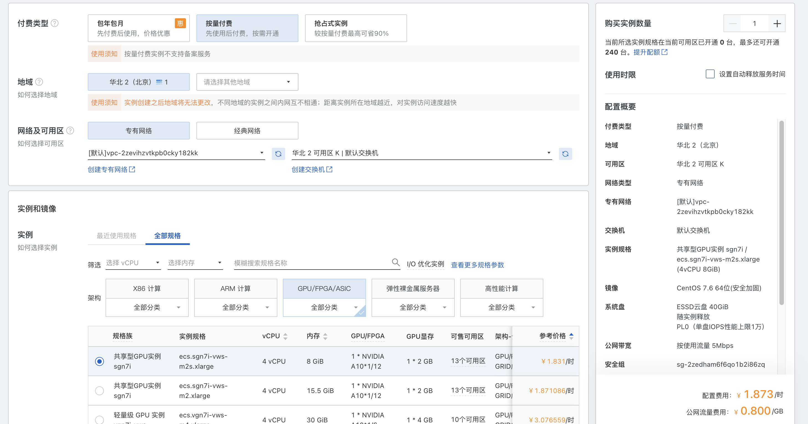
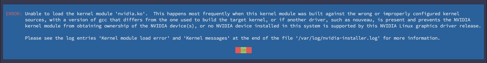
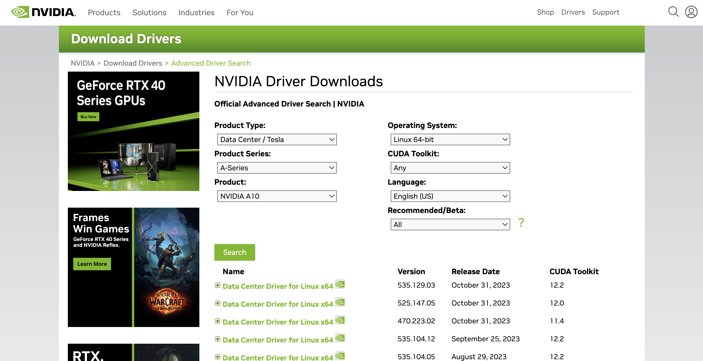
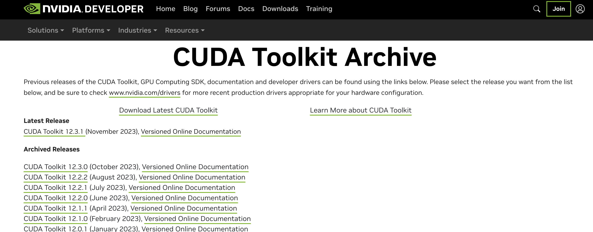
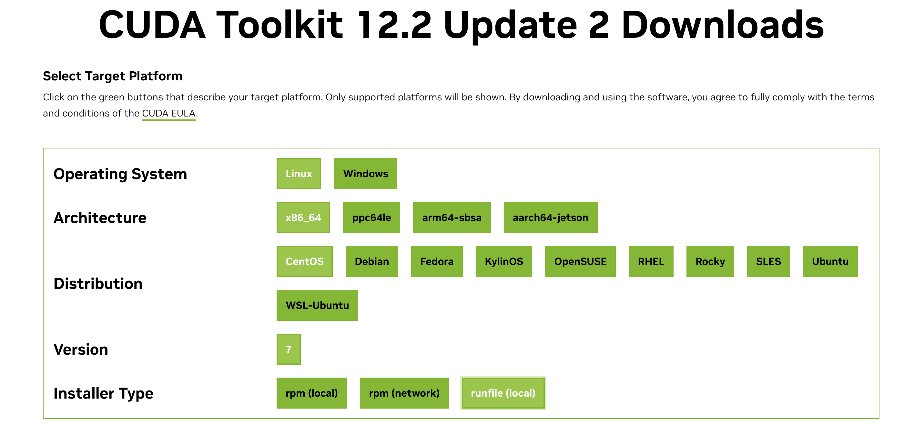

# WEEK049 - 在 Kubernetes 中调度 GPU 资源

在人工智能越来越普及的今天，GPU 也变得越来越常见，无论是传统的机器学习和深度学习，还是现在火热的大语言模型和文生图模型，GPU 都是绕不开的话题。最近在工作中遇到一个需求，需要在 Kubernetes 中动态地调度和使用 GPU 资源，关于 GPU 这块一直是我的知识盲区，于是趁着业余时间恶补下相关的知识。

## GPU 环境准备

学习 GPU 有一定的门槛，不仅是因为好点的显卡都价格不菲，而且使用它还要搭配有相应的硬件环境，虽然笔记本也可以通过显卡扩展坞来使用，但是性能有一定的损失。对于有条件的同学，网上有很多关于如何搭建自己的深度学习工作站的教程可供参考，对此我也没有什么经验，此处略过；对于没有条件的同学，网上也有很多白嫖 GPU 的攻略，我在 [week037-ai-painting-with-google-colab](../week037-ai-painting-with-google-colab/README.md) 这篇博客中也介绍了如何在 Google Colab 中免费使用 GPU 的方法；不过这些环境一般都是做机器学习相关的实验，如果想在上面做一些更底层的实验，比如安装 Docker，部署 Kubernetes 集群等，就不太合适了。

正在无奈之际，我突然想到了阿里云的云服务器 ECS 有一个按量付费的功能，于是便上去瞅了瞅，发现有一种规格叫 **共享型 GPU 实例**，4 核 CPU，8G 内存，显卡为 NVIDIA A10，显存 2G，虽然配置不高，但是足够我们做实验的了，价格也相当便宜，一个小时只要一块八：



于是便抱着试一试的态度下了一单，然后开始了下面的实验。但是刚开始就遇到了问题，安装 NVIDIA 驱动的时候一直报 `Unable to load the kernel module 'nvidia.ko'` 这样的错误:



在网上搜了很多解决方案都没有解决，最后才在阿里云的产品文档中找到了答案：阿里云的 GPU 产品有 **计算型** 和 **虚拟化型** 两种实例规格族，[可以从它们的命名上进行区分](https://help.aliyun.com/zh/egs/instance-naming-conventions)，比如上面我买的这个实例规格为 `ecs.sgn7i-vws-m2s.xlarge`，其中 `sgn` 表示这是一台采用 NVIDIA GRID vGPU 加速的共享型实例，它和 `vgn` 一样，都属于虚拟化型，使用了 [NVIDIA GRID 虚拟 GPU 技术](https://www.nvidia.cn/design-visualization/technologies/grid-technology/)，所以需要安装 GRID 驱动，具体步骤可以 [参考这里](https://help.aliyun.com/zh/egs/user-guide/install-a-grid-driver/)；如果希望手工安装 NVIDIA 驱动，我们需要购买计算型的 GPU 实例。

> 阿里云的产品文档中有一篇 [NVIDIA 驱动安装指引](https://help.aliyun.com/zh/egs/user-guide/installation-guideline-for-nvidia-drivers)，我觉得整理的挺好，文档中对不同的规格、不同的使用场景、不同的操作系统都做了比较详情的介绍。

于是我重新下单，又买了一台规格为 `ecs.gn5i-c2g1.large` 的 **计算型 GPU 实例**，2 核 CPU，8G 内存，显卡为 NVIDIA P4，显存 8G，价格一个小时八块多。

> 购买计算型实例纯粹是为了体验一下 NVIDIA 驱动的安装过程，如果只想进行后面的 Kubernetes 实验，直接使用虚拟化型实例也是可以的。另外，在购买计算型实例时可以选择自动安装 NVIDIA 驱动，对应版本的 CUDA 和 CUDNN 也会一并安装，使用还是很方便的。

### 安装 NVIDIA 驱动

登录刚买的服务器，我们可以通过 `lspci` 看到 NVIDIA 的这张显卡：

```
# lspci | grep NVIDIA
00:07.0 3D controller: NVIDIA Corporation GP104GL [Tesla P4] (rev a1)
```

此时这个显卡还不能直接使用，因为还需要安装 NVIDIA 的显卡驱动。访问 [NVIDIA Driver Downloads](https://www.nvidia.com/Download/Find.aspx)，在这里选择你的显卡型号和操作系统并搜索：



从列表中可以看到驱动的不同版本，第一条是最新版本 `535.129.03`，我们点击链接进入下载页面并复制链接地址，然后使用下面的命令下载之：

```
# curl -LO https://us.download.nvidia.com/tesla/535.129.03/NVIDIA-Linux-x86_64-535.129.03.run
```

这个文件其实是一个可执行文件，直接运行即可：

```
# sh NVIDIA-Linux-x86_64-535.129.03.run
```

安装过程中会出现一些选项，保持默认即可，等待驱动安装成功后，运行 `nvidia-smi` 命令应该能看到显卡状态：

```
# nvidia-smi
Thu Nov 24 08:16:38 2023       
+---------------------------------------------------------------------------------------+
| NVIDIA-SMI 535.129.03             Driver Version: 535.129.03   CUDA Version: 12.2     |
|-----------------------------------------+----------------------+----------------------+
| GPU  Name                 Persistence-M | Bus-Id        Disp.A | Volatile Uncorr. ECC |
| Fan  Temp   Perf          Pwr:Usage/Cap |         Memory-Usage | GPU-Util  Compute M. |
|                                         |                      |               MIG M. |
|=========================================+======================+======================|
|   0  Tesla P4                       Off | 00000000:00:07.0 Off |                    0 |
| N/A   41C    P0              23W /  75W |      0MiB /  7680MiB |      2%      Default |
|                                         |                      |                  N/A |
+-----------------------------------------+----------------------+----------------------+
                                                                                         
+---------------------------------------------------------------------------------------+
| Processes:                                                                            |
|  GPU   GI   CI        PID   Type   Process name                            GPU Memory |
|        ID   ID                                                             Usage      |
|=======================================================================================|
|  No running processes found                                                           |
+---------------------------------------------------------------------------------------+
```

### 安装 CUDA

[CUDA（Compute Unified Device Architecture）](https://docs.nvidia.com/cuda/cuda-toolkit-release-notes/index.html) 是 NVIDIA 推出的一种通用并行计算平台和编程模型，允许开发人员使用 C、C++ 等编程语言编写高性能计算应用程序，它利用 GPU 的并行计算能力解决复杂的计算问题，特别是在深度学习、科学计算、图形处理等领域。所以一般情况下，安装完 NVIDIA 驱动后，CUDA 也可以一并安装上。

在下载 NVIDIA 驱动时，每个驱动版本都对应了一个 CUDA 版本，比如上面我们在下载驱动版本 `535.129.03` 时可以看到，它对应的 CUDA 版本为 `12.2`，所以我们就按照这个版本号来安装。首先进入 [CUDA Toolkit Archive](https://developer.nvidia.com/cuda-toolkit-archive) 页面，这里列出了所有的 CUDA 版本：



找到 `12.2` 版本进入下载页面：



选择操作系统、架构、发行版本和安装类型，下面就会出现相应的下载地址和运行命令，按照提示在服务器中执行即可：

```
# wget https://developer.download.nvidia.com/compute/cuda/12.2.2/local_installers/cuda_12.2.2_535.104.05_linux.run
# sh cuda_12.2.2_535.104.05_linux.run
```

这个安装过程会比较长，当安装成功后，可以看到下面这样的信息：

```
===========
= Summary =
===========

Driver:   Installed
Toolkit:  Installed in /usr/local/cuda-12.2/

Please make sure that
 -   PATH includes /usr/local/cuda-12.2/bin
 -   LD_LIBRARY_PATH includes /usr/local/cuda-12.2/lib64, or, add /usr/local/cuda-12.2/lib64 to /etc/ld.so.conf and run ldconfig as root

To uninstall the CUDA Toolkit, run cuda-uninstaller in /usr/local/cuda-12.2/bin
To uninstall the NVIDIA Driver, run nvidia-uninstall
Logfile is /var/log/cuda-installer.log
```

## 在 Docker 容器中使用 GPU 资源

GPU 环境准备好之后，接下来我们先试着在 Docker 容器中使用它。由于是新买的系统，并没有 Docker 环境，所以我们要先安装 Docker，可以参考我之前写的 [week002-install-docker](../week002-install-docker/README.md) 这篇博客。

安装完 Docker 之后，执行下面的命令确认版本：

```
# docker --version
Docker version 24.0.7, build afdd53b
```

然后执行下面的命令来测试下 GPU 是否可以在容器中使用：

```
# docker run --gpus all --rm centos:latest nvidia-smi
docker: Error response from daemon: could not select device driver "" with capabilities: [[gpu]].
```

可以看到命令执行报错了，稍微 Google 一下这个错就知道，想在 Docker 中使用 NVIDIA GPU 还必须安装 `nvidia-container-runtime` 运行时。

### 安装 `nvidia-container-runtime` 运行时

我们一般使用 [NVIDIA Container Toolkit](https://docs.nvidia.com/datacenter/cloud-native/container-toolkit/latest/install-guide.html) 来安装 `nvidia-container-runtime` 运行时，根据官方文档，首先将 `nvidia-container-toolkit.repo` 文件添加到 yum 的仓库目录 `/etc/yum.repos.d` 中：

```
# curl -s -L https://nvidia.github.io/libnvidia-container/stable/rpm/nvidia-container-toolkit.repo | \
	tee /etc/yum.repos.d/nvidia-container-toolkit.repo
```

> 也可以使用 `yum-config-manager --add-repo` 来添加：
> 
> ```
> # yum install -y yum-utils
> # yum-config-manager --add-repo https://nvidia.github.io/libnvidia-container/stable/rpm/nvidia-container-toolkit.repo
> ```

然后使用 `yum install` 安装：

```
# yum install -y nvidia-container-toolkit
```

安装 NVIDIA Container Toolkit 之后，再使用下面的命令将 Docker 的运行时配置成 `nvidia-container-runtime`：

```
# nvidia-ctk runtime configure --runtime=docker
INFO[0000] Config file does not exist; using empty config 
INFO[0000] Wrote updated config to /etc/docker/daemon.json 
INFO[0000] It is recommended that docker daemon be restarted.
```

这个命令的作用是修改 `/etc/docker/daemon.json` 配置文件：

```
# cat /etc/docker/daemon.json
{
    "runtimes": {
        "nvidia": {
            "args": [],
            "path": "nvidia-container-runtime"
        }
    }
}
```

按照提示，重启 Docker 服务：

```
# systemctl restart docker
```

### 在容器中使用 GPU 资源

配置完 `nvidia-container-runtime` 运行时之后，重新执行下面的命令：

```
# docker run --gpus all --rm centos:latest nvidia-smi
Sat Nov 25 02:31:58 2023       
+-----------------------------------------------------------------------------+
| NVIDIA-SMI 470.161.03   Driver Version: 470.161.03   CUDA Version: 11.4     |
|-------------------------------+----------------------+----------------------+
| GPU  Name        Persistence-M| Bus-Id        Disp.A | Volatile Uncorr. ECC |
| Fan  Temp  Perf  Pwr:Usage/Cap|         Memory-Usage | GPU-Util  Compute M. |
|                               |                      |               MIG M. |
|===============================+======================+======================|
|   0  NVIDIA A10-2Q       On   | 00000000:00:07.0 Off |                  N/A |
| N/A   N/A    P0    N/A /  N/A |     64MiB /  1889MiB |      0%      Default |
|                               |                      |                  N/A |
+-------------------------------+----------------------+----------------------+
                                                                               
+-----------------------------------------------------------------------------+
| Processes:                                                                  |
|  GPU   GI   CI        PID   Type   Process name                  GPU Memory |
|        ID   ID                                                   Usage      |
|=============================================================================|
|  No running processes found                                                 |
+-----------------------------------------------------------------------------+
```

此时我换成了一台共享型 GPU 实例，所以显示的是 A10，驱动版本和 CUDA 版本要低一点，命令的输出表明我们在容器中已经可以访问 GPU 资源了。值得注意的是，我们运行的 `centos:latest` 镜像里本来是没有 `nvidia-smi` 命令的：

```
# docker run --rm centos:latest nvidia-smi
exec: "nvidia-smi": executable file not found in $PATH: unknown.
```

但是加上 `--gpus all` 参数之后就有这个命令了，真是神奇。

使用 `--gpus all` 参数可以让容器内访问宿主机上的所有显卡，也可以指定某张卡在容器中使用：

```
# docker run --gpus 1 --rm centos:latest nvidia-smi
```

或者这样：

```
# docker run --gpus 'device=0' --rm centos:latest nvidia-smi
```

接下来，我们再利用 tensorflow 的镜像来测试下是否可以在程序中使用 GPU 资源：

```
# docker run --rm -it --gpus all tensorflow/tensorflow:2.6.0-gpu bash
root@bacd1c7c8b6c:/# python3
Python 3.6.9 (default, Jan 26 2021, 15:33:00) 
[GCC 8.4.0] on linux
Type "help", "copyright", "credits" or "license" for more information.
>>>
```

在使用 tensorflow 镜像时要注意与 CUDA 版本的兼容性，[这里](https://www.tensorflow.org/install/source?hl=zh-cn#gpu) 有一份 tensorflow 版本和 CUDA 版本之间的对应关系，如果不兼容，会出现如下的报错：

```
# docker run --rm -it --gpus all tensorflow/tensorflow:latest-gpu bash
nvidia-container-cli: requirement error: unsatisfied condition: cuda>=12.3, please update your driver to a newer version, or use an earlier cuda container: unknown.
```

然后使用一段简单的 Python 代码来测试 GPU 功能：

```
>>> import tensorflow as tf
>>> print(tf.test.gpu_device_name())
```

如果一切正常，就会打印出 GPU 的设备名称：

```
/device:GPU:0
```

### Docker 19.03 之前

上面介绍的 `--gpus` 参数是在 Docker 19.03 版本之后才引入了，在 Docker 19.03 之前，我们也有几种方式来使用 GPU，第一种也是最原始的方式，通过 `--device` 参数将显卡设备挂载到容器里：

```
# docker run --rm -it \
	--device /dev/nvidia0:/dev/nvidia0 \
	--device /dev/nvidiactl:/dev/nvidiactl \
	--device /dev/nvidia-uvm:/dev/nvidia-uvm \
	tensorflow/tensorflow:2.6.0-gpu bash
```

第二种是使用英伟达公司开发的 [nvidia-docker](https://github.com/NVIDIA/nvidia-docker) 工具，这个工具对 docker 进行了一层封装，使得在容器中也可以访问 GPU 资源，它在使用上和 docker 几乎完全一样：

```
# nvidia-docker run --rm -it tensorflow/tensorflow:2.6.0-gpu bash
```

nvidia-docker 有两个版本：`nvidia-docker` 和 `nvidia-docker2`。nvidia-docker 是一个独立的守护进程，它以 [Volume Plugin](https://docs.docker.com/engine/extend/plugins_volume/) 的形式存在，它与 Docker 生态系统的兼容性较差，比如它和 docker-compose、docker swarm、Kubernetes 都不能很好地一起工作，因此很快被废弃。随后，官方推出了 nvidia-docker2，它不再是 Volume Plugin，而是作为一个 [Docker Runtime](https://docs.docker.com/engine/alternative-runtimes/)，实现机制上的差异，带来了巨大改进，从而和 Docker 生态实现了更好的兼容性，使用上也完全兼容 docker 命令，加一个 `--runtime=nvidia` 参数即可：

```
# docker run --rm -it --runtime=nvidia tensorflow/tensorflow:2.6.0-gpu bash
```

然而，随着 Docker 19.03 版本的发布，NVIDIA GPU 作为 Docker Runtime 中的设备得到了官方支持，因此 nvidia-docker2 目前也已经被弃用了。

## 在 Kubernetes 中调度 GPU 资源

终于到了这篇博客的主题，接下来我们实践一下如何在 Kubernetes 集群中调度 GPU 资源。和 Docker 一样，新买的服务器上也没有 Kubernetes 环境，我们需要先安装 Kubernetes，可以参考我之前写的 [week010-install-kubernetes](../week010-install-kubernetes/README.md) 这篇博客。

我们知道，Kubernetes 具有对机器的资源进行分配和使用的能力，比如可以指定容器最多使用多少内存以及使用多少 CPU 计算资源，同样，我们也可以指定容器使用多少 GPU 资源，但在这之前，我们需要先安装 `nvidia-container-runtime` 运行时，以及 NVIDIA 的设备插件。

### 安装 `nvidia-container-runtime` 运行时

通过上面的学习，我们通过安装 `nvidia-container-runtime` 运行时，在 Docker 容器中访问了 GPU 设备，在 Kubernetes 中调度 GPU 资源同样也需要安装这个 `nvidia-container-runtime`。如果 Kubernetes 使用的容器运行时是 Docker，直接参考上面的章节进行安装配置即可；但 Kubernetes 从 1.24 版本开始，改用 containerd 作为容器运行时，为了在 containerd 容器中使用 NVIDIA 的 GPU 设备，配置步骤稍微有些区别。

首先我们还是先安装 [NVIDIA Container Toolkit](https://docs.nvidia.com/datacenter/cloud-native/container-toolkit/latest/install-guide.html)，然后通过下面的命令将 `nvidia-container-runtime` 加入 containerd 的运行时列表中：

```
# nvidia-ctk runtime configure --runtime=containerd
```

这个命令实际上是对 containerd 的配置文件 `/etc/containerd/config.toml` 进行修改，内容如下：

```
    [plugins."io.containerd.grpc.v1.cri".containerd]
      default_runtime_name = "runc"
      snapshotter = "overlayfs"

      [plugins."io.containerd.grpc.v1.cri".containerd.runtimes]

        [plugins."io.containerd.grpc.v1.cri".containerd.runtimes.nvidia]
          runtime_engine = ""
          runtime_root = ""
          runtime_type = "io.containerd.runc.v2"

          [plugins."io.containerd.grpc.v1.cri".containerd.runtimes.nvidia.options]
            BinaryName = "/usr/bin/nvidia-container-runtime"
            SystemdCgroup = true
```

注意这个命令并不会修改 `default_runtime_name` 配置，我们需要手动将这个值修改为 `nvidia`:

```
      default_runtime_name = "nvidia"
```

然后重启 containerd 服务：

```
# systemctl restart containerd
```

### 安装 NVIDIA 设备插件

接下来，我们继续安装 [NVIDIA 设备插件](https://github.com/NVIDIA/k8s-device-plugin)。[设备插件（Device Plugins）](https://kubernetes.io/zh-cn/docs/concepts/extend-kubernetes/compute-storage-net/device-plugins/) 是 Kubernetes 用于管理和调度容器中设备资源的一种插件机制，它可以将物理设备（如 GPU、FPGA 等）暴露给容器，从而提供更高级别的资源管理和调度能力。

通过下面的命令将 NVIDIA 设备插件部署到集群中：

```
# kubectl create -f https://raw.githubusercontent.com/NVIDIA/k8s-device-plugin/v0.14.3/nvidia-device-plugin.yml
daemonset.apps/nvidia-device-plugin-daemonset created
```

从运行结果可以看出，设备插件本质上是一个 DaemonSet，运行 `kubectl get daemonset` 命令查看其是否启动成功：

```
# kubectl get daemonset -n kube-system
NAME                             DESIRED   CURRENT   READY   UP-TO-DATE   AVAILABLE   NODE SELECTOR            AGE
kube-proxy                       1         1         1       1            1           kubernetes.io/os=linux   90m
nvidia-device-plugin-daemonset   1         1         1       1            1           <none>                   43s
```

运行 `kubectl logs` 命令查看其启动日志：

```
# kubectl logs nvidia-device-plugin-daemonset-s97vk -n kube-system
I1126 04:46:34.020261       1 main.go:154] Starting FS watcher.
I1126 04:46:34.020321       1 main.go:161] Starting OS watcher.
I1126 04:46:34.020578       1 main.go:176] Starting Plugins.
I1126 04:46:34.020591       1 main.go:234] Loading configuration.
I1126 04:46:34.020668       1 main.go:242] Updating config with default resource matching patterns.
I1126 04:46:34.020829       1 main.go:253] 
Running with config:
{
  "version": "v1",
  "flags": {
    "migStrategy": "none",
    "failOnInitError": false,
    "nvidiaDriverRoot": "/",
    "gdsEnabled": false,
    "mofedEnabled": false,
    "plugin": {
      "passDeviceSpecs": false,
      "deviceListStrategy": [
        "envvar"
      ],
      "deviceIDStrategy": "uuid",
      "cdiAnnotationPrefix": "cdi.k8s.io/",
      "nvidiaCTKPath": "/usr/bin/nvidia-ctk",
      "containerDriverRoot": "/driver-root"
    }
  },
  "resources": {
    "gpus": [
      {
        "pattern": "*",
        "name": "nvidia.com/gpu"
      }
    ]
  },
  "sharing": {
    "timeSlicing": {}
  }
}
I1126 04:46:34.020840       1 main.go:256] Retreiving plugins.
I1126 04:46:34.021064       1 factory.go:107] Detected NVML platform: found NVML library
I1126 04:46:34.021090       1 factory.go:107] Detected non-Tegra platform: /sys/devices/soc0/family file not found
I1126 04:46:34.032304       1 server.go:165] Starting GRPC server for 'nvidia.com/gpu'
I1126 04:46:34.033008       1 server.go:117] Starting to serve 'nvidia.com/gpu' on /var/lib/kubelet/device-plugins/nvidia-gpu.sock
I1126 04:46:34.037402       1 server.go:125] Registered device plugin for 'nvidia.com/gpu' with Kubelet
```

如果看到日志显示 `Registered device plugin for 'nvidia.com/gpu' with Kubelet`，表示 NVIDIA 设备插件已经安装成功了。此时，我们也可以在 `kubelet` 的设备插件目录下看到 NVIDIA GPU 的 socket 文件：

```
# ll /var/lib/kubelet/device-plugins/ | grep nvidia-gpu.sock
```

但是安装也不一定是一帆风顺的，如果看到下面这样的日志：

```
I1126 04:34:05.352152       1 main.go:256] Retreiving plugins.
W1126 04:34:05.352505       1 factory.go:31] No valid resources detected, creating a null CDI handler
I1126 04:34:05.352539       1 factory.go:107] Detected non-NVML platform: could not load NVML library: libnvidia-ml.so.1: cannot open shared object file: No such file or directory
I1126 04:34:05.352569       1 factory.go:107] Detected non-Tegra platform: /sys/devices/soc0/family file not found
E1126 04:34:05.352573       1 factory.go:115] Incompatible platform detected
E1126 04:34:05.352576       1 factory.go:116] If this is a GPU node, did you configure the NVIDIA Container Toolkit?
E1126 04:34:05.352578       1 factory.go:117] You can check the prerequisites at: https://github.com/NVIDIA/k8s-device-plugin#prerequisites
E1126 04:34:05.352582       1 factory.go:118] You can learn how to set the runtime at: https://github.com/NVIDIA/k8s-device-plugin#quick-start
E1126 04:34:05.352585       1 factory.go:119] If this is not a GPU node, you should set up a toleration or nodeSelector to only deploy this plugin on GPU nodes
I1126 04:34:05.352590       1 main.go:287] No devices found. Waiting indefinitely.
```

表示没有找到 NVIDIA 设备，请检查显卡驱动是否安装，或者 containerd 的配置是否正确。

### 调度 GPU 资源

接下来，我们创建一个测试文件：

```
# vi gpu-test.yaml
```

文件内容如下：

```
apiVersion: v1
kind: Pod
metadata:
  name: gpu-test
spec:
  restartPolicy: OnFailure
  containers:
    - name: gpu-test
      image: tensorflow/tensorflow:2.6.0-gpu
      command:
        - python3
        - /app/test.py
      volumeMounts:
        - name: gpu-test-script
          mountPath: /app/
      resources:
        limits:
          nvidia.com/gpu: 1
  volumes:
    - name: gpu-test-script
      configMap:
        name: gpu-test-script
---
apiVersion: v1
kind: ConfigMap
metadata:
  name: gpu-test-script
data:
  test.py: |
    import tensorflow as tf
    print(tf.test.gpu_device_name())
```

这里我们仍然使用 `tensorflow/tensorflow:2.6.0-gpu` 这个镜像来测试 GPU 功能，我们通过 ConfigMap 将一段 Python 测试脚本挂载到容器中并运行，另外通过 `resources.limits.nvidia.com/gpu: 1` 这样的配置告诉 Kubernetes，容器的运行需要使用一张 GPU 显卡资源，Kubernetes 会自动根据 NVIDIA 设备插件汇报的情况找到符合条件的节点，然后在该节点上启动 Pod，启动 Pod 时，由于 containerd 的默认运行时是 `nvidia-container-runtime`，所以会将 NVIDIA GPU 挂载到容器中。

运行 `kubectl apply` 命令创建 Pod 和 ConfigMap：

```
# kubectl apply -f gpu-test.yaml
pod/gpu-test created
configmap/gpu-test-script created
```

运行 `kubectl get pods` 命令查看 Pod 的运行状态：

```
# kubectl get pods
NAME       READY   STATUS             RESTARTS      AGE
gpu-test   0/1     Pending            0             5s
```

如果像上面这样一直处理 Pending 状态，可以运行 `kubectl describe pod` 命令查看 Pod 的详细情况：

```
# kubectl describe pod gpu-test
Name:             gpu-test
Namespace:        default
Priority:         0
Service Account:  default
...
Events:
  Type     Reason            Age   From               Message
  ----     ------            ----  ----               -------
  Warning  FailedScheduling  19s   default-scheduler  0/1 nodes are available: 1 Insufficient nvidia.com/gpu. preemption: 0/1 nodes are available: 1 No preemption victims found for incoming pod.
```

出现上面这样的情况可能有两种原因：

1. 显卡资源已经被其他 Pod 所占用，默认情况下 NVIDIA 设备插件只支持卡级别的调度，并且显卡资源是独占的，我的这台服务器上只有一张显卡，如果已经有 Pod 占用了一张卡，那么其他的 Pod 就不能再使用该卡了；如果希望多个 Pod 共享一张卡，可以参考官方文档中的 [Shared Access to GPUs with CUDA Time-Slicing](https://github.com/NVIDIA/k8s-device-plugin#shared-access-to-gpus-with-cuda-time-slicing)；
2. NVIDIA 设备插件未成功安装，请参考上面的章节确认 NVIDIA 设备插件已经成功启动。

如果一切正常，Pod 的状态应该是 Completed：

```
# kubectl get pods
NAME       READY   STATUS      RESTARTS   AGE
gpu-test   0/1     Completed   0          7s
```

运行 `kubectl logs` 命令查看 Pod 日志：

```
# kubectl logs gpu-test
2023-11-26 05:05:14.779693: I tensorflow/core/platform/cpu_feature_guard.cc:142] This TensorFlow binary is optimized with oneAPI Deep Neural Network Library (oneDNN) to use the following CPU instructions in performance-critical operations:  AVX2 AVX512F FMA
To enable them in other operations, rebuild TensorFlow with the appropriate compiler flags.
2023-11-26 05:05:16.508041: I tensorflow/stream_executor/cuda/cuda_gpu_executor.cc:937] successful NUMA node read from SysFS had negative value (-1), but there must be at least one NUMA node, so returning NUMA node zero
2023-11-26 05:05:16.508166: I tensorflow/core/common_runtime/gpu/gpu_device.cc:1510] Created device /device:GPU:0 with 1218 MB memory:  -> device: 0, name: NVIDIA A10-2Q, pci bus id: 0000:00:07.0, compute capability: 8.6
/device:GPU:0
```

可以看到脚本成功打印出了 GPU 的设备名称，说明现在我们已经可以在 Kubernetes 中使用 GPU 资源了。

## 参考

* [Installing the NVIDIA Container Toolkit](https://docs.nvidia.com/datacenter/cloud-native/container-toolkit/latest/install-guide.html)
* [k8s 调度 GPU](https://www.cnblogs.com/linhaifeng/p/16111733.html)
* [docker使用GPU总结](https://www.cnblogs.com/linhaifeng/p/16108285.html)
* [NVIDIA device plugin for Kubernetes](https://github.com/NVIDIA/k8s-device-plugin#quick-start)
* [Schedule GPUs](https://kubernetes.io/docs/tasks/manage-gpus/scheduling-gpus/)
* [调度 GPU | Kuboard](https://kuboard.cn/learning/k8s-practice/gpu/gpu.html)
* [Kubernetes 教程：在 Containerd 容器中使用 GPU](https://icloudnative.io/posts/add-nvidia-gpu-support-to-k8s-with-containerd/)
* [容器中使用 GPU 的基础环境搭建](https://www.lxkaka.wang/docker-nvidia/)

## 更多

### 监控 GPU 资源的使用

* [Monitoring NVIDIA GPU Usage in Kubernetes with Prometheus](https://blog.kubecost.com/blog/nvidia-gpu-usage/)

### 设备插件原理

* [实现自己的设备插件](https://kubernetes.io/zh-cn/docs/concepts/extend-kubernetes/compute-storage-net/device-plugins/#device-plugin-implementation)
* [Kubernetes Device Plugin 原理讲解](https://blog.magichc7.com/post/Kubernetes-Device-Plugin.html)
