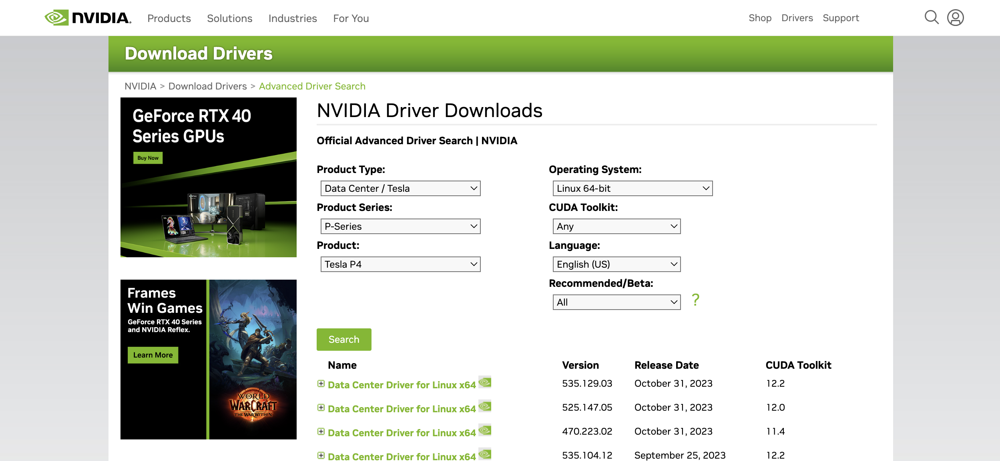

# WEEK049 - 在 Kubernetes 中调度 GPU 资源

在人工智能越来越普及的今天，GPU 也变得越来越常见，无论是传统的机器学习和深度学习，还是现在火热的大语言模型和文生图模型，GPU 都是绕不开的话题。最近在工作中遇到一个需求，需要在 Kubernetes 中动态地调度和使用 GPU 资源，关于 GPU 这块一直是我的知识盲区，于是趁着业余时间恶补下相关的知识。

## GPU 环境准备

学习 GPU 有一定的门槛，不仅是因为好点的显卡都价格不菲，而且使用它还要搭配有相应的硬件环境，虽然笔记本也可以通过显卡扩展坞来使用，但是性能有一定的损失。对于有条件的同学，网上有很多关于如何搭建自己的深度学习工作站的教程可供参考，对此我也没有什么经验，此处略过；对于没有条件的同学，网上也有很多白嫖 GPU 的攻略，我在 [week037-ai-painting-with-google-colab](../week037-ai-painting-with-google-colab/README.md) 这篇博客中也介绍了如何在 Google Colab 中免费使用 GPU 的方法；不过这些环境一般都是做机器学习相关的实验，如果想在上面做一些更底层的实验，比如安装 Docker，部署 Kubernetes 集群等，就不太合适了。

正在无奈之际，我突然想到了阿里云的云服务器 ECS 有一个按量付费的功能，于是便上去瞅了瞅，发现有一种规格叫 **共享型 GPU 实例**，4 核 CPU，8G 内存，显卡为 NVIDIA A10，显存 2G，虽然配置不高，但是足够我们做实验的了，价格也相当便宜，一个小时只要一块八：


于是便抱着试一试的态度下了一单，然后开始了下面的实验。但是刚开始就遇到了问题，安装 NVIDIA 驱动的时候一直报 `Unable to load the kernel module 'nvidia.ko'` 这样的错误:


在网上搜了很多解决方案都没有解决，最后才在阿里云的产品文档中找到了答案：阿里云的 GPU 产品有 **计算型** 和 **虚拟化型** 两种实例规格族，[可以从它们的命名上进行区分](https://help.aliyun.com/zh/egs/instance-naming-conventions)，比如上面我买的这个实例规格为 `ecs.sgn7i-vws-m2s.xlarge`，其中 `sgn` 表示这是一台采用 NVIDIA GRID vGPU 加速的共享型实例，它和 `vgn` 一样，都属于虚拟化型，使用了 [NVIDIA GRID 虚拟 GPU 技术](https://www.nvidia.cn/design-visualization/technologies/grid-technology/)，所以需要安装 GRID 驱动，具体步骤可以 [参考这里](https://help.aliyun.com/zh/egs/user-guide/install-a-grid-driver/)；如果希望手工安装 NVIDIA 驱动，我们需要购买计算型的 GPU 实例。

> 阿里云的产品文档中有一篇 [NVIDIA 驱动安装指引](https://help.aliyun.com/zh/egs/user-guide/installation-guideline-for-nvidia-drivers)，我觉得整理的挺好，文档中对不同的规格、不同的使用场景、不同的操作系统都做了比较详情的介绍。

于是我重新下单，又买了一台规格为 `ecs.gn5i-c2g1.large` 的 **计算型 GPU 实例**，2 核 CPU，8G 内存，显卡为 NVIDIA P4，显存 8G，价格一个小时八块多。

> 购买计算型实例纯粹是为了体验一下 NVIDIA 驱动的安装过程，如果只想进行后面的 Kubernetes 实验，直接使用虚拟化型实例也是可以的。另外，在购买计算型实例时可以选择自动安装 NVIDIA 驱动，对应版本的 CUDA 和 CUDNN 也会一并安装，使用还是很方便的。

### 安装 NVIDIA 驱动

登录刚买的服务器，我们可以通过 `lspci` 看到 NVIDIA 的这张显卡：

```
# lspci | grep NVIDIA
00:07.0 3D controller: NVIDIA Corporation GP104GL [Tesla P4] (rev a1)
```

此时这个显卡还不能直接使用，因为还需要安装 NVIDIA 的显卡驱动。访问 [NVIDIA Driver Downloads](https://www.nvidia.com/Download/Find.aspx)，在这里选择你的显卡型号和操作系统并搜索：



从列表中可以看到驱动的不同版本，第一条是最新版本 `535.129.03`，我们点击链接进入下载页面并复制链接地址，然后使用下面的命令下载之：

```
# curl -LO https://us.download.nvidia.com/tesla/535.129.03/NVIDIA-Linux-x86_64-535.129.03.run
```

这个文件其实是一个可执行文件，直接运行即可：

```
# sh NVIDIA-Linux-x86_64-535.129.03.run
```

安装过程中会出现一些选项，保持默认即可，等待驱动安装成功后，运行 `nvidia-smi` 命令应该能看到显卡状态：

```
# nvidia-smi
Thu Nov 24 08:16:38 2023       
+---------------------------------------------------------------------------------------+
| NVIDIA-SMI 535.129.03             Driver Version: 535.129.03   CUDA Version: 12.2     |
|-----------------------------------------+----------------------+----------------------+
| GPU  Name                 Persistence-M | Bus-Id        Disp.A | Volatile Uncorr. ECC |
| Fan  Temp   Perf          Pwr:Usage/Cap |         Memory-Usage | GPU-Util  Compute M. |
|                                         |                      |               MIG M. |
|=========================================+======================+======================|
|   0  Tesla P4                       Off | 00000000:00:07.0 Off |                    0 |
| N/A   41C    P0              23W /  75W |      0MiB /  7680MiB |      2%      Default |
|                                         |                      |                  N/A |
+-----------------------------------------+----------------------+----------------------+
                                                                                         
+---------------------------------------------------------------------------------------+
| Processes:                                                                            |
|  GPU   GI   CI        PID   Type   Process name                            GPU Memory |
|        ID   ID                                                             Usage      |
|=======================================================================================|
|  No running processes found                                                           |
+---------------------------------------------------------------------------------------+
```

### 安装 CUDA

[CUDA](https://docs.nvidia.com/cuda/cuda-toolkit-release-notes/index.html) 是 NVIDIA 推出的一种通用并行计算平台和编程模型，允许开发人员使用 C、C++ 等编程语言编写高性能计算应用程序，它利用 GPU 的并行计算能力解决复杂的计算问题，特别是在深度学习、科学计算、图形处理等领域。所以一般情况下，安装完 NVIDIA 驱动后，CUDA 也可以一并安装上。

在下载 NVIDIA 驱动时，每个驱动版本都对应了一个 CUDA 版本，比如上面我们在下载驱动版本 `535.129.03` 时可以看到，它对应的 CUDA 版本为 `12.2`，所以我们就按照这个版本号来安装。首先进入 [CUDA Toolkit Archive](https://developer.nvidia.com/cuda-toolkit-archive) 页面，这里列出了所有的 CUDA 版本：


找到 `12.2` 版本进入下载页面：


选择操作系统、架构、发行版本和安装类型，下面就会出现相应的下载地址和运行命令，按照提示在服务器中执行即可：

```
# wget https://developer.download.nvidia.com/compute/cuda/12.2.2/local_installers/cuda_12.2.2_535.104.05_linux.run
# sh cuda_12.2.2_535.104.05_linux.run
```

这个安装过程会比较长，当安装成功后，可以看到下面这样的信息：

```
===========
= Summary =
===========

Driver:   Installed
Toolkit:  Installed in /usr/local/cuda-12.2/

Please make sure that
 -   PATH includes /usr/local/cuda-12.2/bin
 -   LD_LIBRARY_PATH includes /usr/local/cuda-12.2/lib64, or, add /usr/local/cuda-12.2/lib64 to /etc/ld.so.conf and run ldconfig as root

To uninstall the CUDA Toolkit, run cuda-uninstaller in /usr/local/cuda-12.2/bin
To uninstall the NVIDIA Driver, run nvidia-uninstall
Logfile is /var/log/cuda-installer.log
```

## 在 Docker 容器中使用 GPU 资源

https://www.cnblogs.com/linhaifeng/p/16108285.html

## 在 Kubernetes 中调度 GPU 资源

Kubernetes 具有对机器的资源进行分配和使用的能力，比如可以指定容器最多使用多少内存以及使用多少 CPU 计算资源。

### 安装 NVIDIA 设备插件

https://github.com/NVIDIA/k8s-device-plugin#quick-start

### 调度 GPU 资源

https://kuboard.cn/learning/k8s-practice/gpu/gpu.html

https://www.cnblogs.com/linhaifeng/p/16111733.html

https://icloudnative.io/posts/add-nvidia-gpu-support-to-k8s-with-containerd/

## 监控 GPU 资源的使用

https://blog.kubecost.com/blog/nvidia-gpu-usage/

## 参考

* [k8s 调度 GPU](https://www.cnblogs.com/linhaifeng/p/16111733.html)
* [docker使用GPU总结](https://www.cnblogs.com/linhaifeng/p/16108285.html)
* [NVIDIA device plugin for Kubernetes](https://github.com/NVIDIA/k8s-device-plugin#quick-start)
* [Schedule GPUs](https://kubernetes.io/docs/tasks/manage-gpus/scheduling-gpus/)
* [调度 GPU | Kuboard](https://kuboard.cn/learning/k8s-practice/gpu/gpu.html)
* [Monitoring NVIDIA GPU Usage in Kubernetes with Prometheus](https://blog.kubecost.com/blog/nvidia-gpu-usage/)
* [Kubernetes 教程：在 Containerd 容器中使用 GPU](https://icloudnative.io/posts/add-nvidia-gpu-support-to-k8s-with-containerd/)
