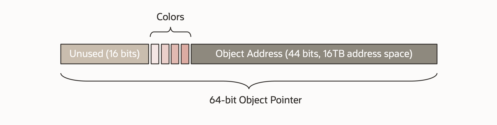
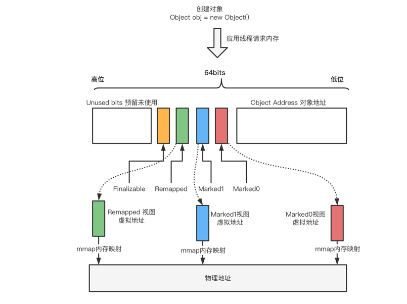
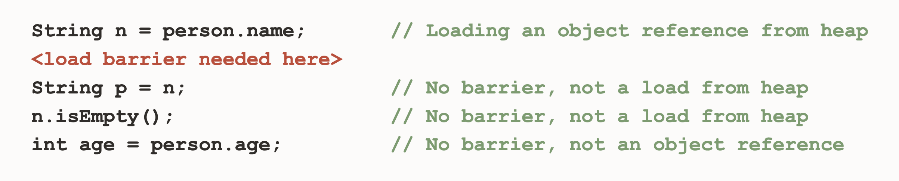
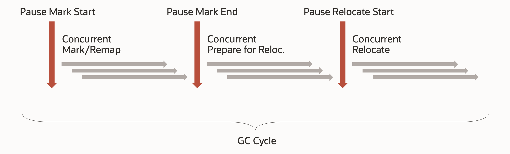
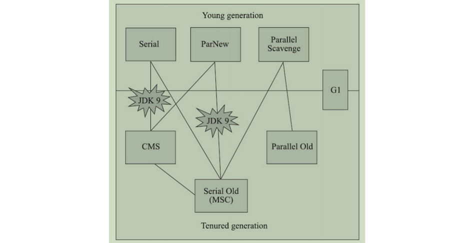

# WEEK050 - Java 21 初体验

2023 年 9 月 19 日，[Java 21](https://openjdk.org/projects/jdk/21/) 发布正式版本，这是 Java 时隔两年发布的又一个 LTS 版本，上一个 LTS 版本是 2021 年 9 月 14 日发布的 [Java 17](https://openjdk.org/projects/jdk/17/)：


Java 17 目前是使用最广泛的版本，但随着 Java 21 的发布，这一局面估计会很快被打破，这是因为 Java 21 可能是几年内最为重要的版本，它带来了一系列重要的功能和特性，包括 [记录模式](https://openjdk.org/jeps/440)，[`switch` 模式匹配](https://openjdk.org/jeps/441)，[字符串模板](https://openjdk.org/jeps/430)，[分代式 ZGC](https://openjdk.org/jeps/439)，[不需要定义类的 Main 方法](https://openjdk.org/jeps/445)，等等等等，不过其中最为重要的一项，当属由 [Loom 项目](https://openjdk.org/projects/loom/) 发展而来的 [虚拟线程](https://openjdk.org/jeps/444)。Java 程序一直以文件体积大、启动速度慢、内存占用多被人诟病，但是有了虚拟线程，再结合 [GraalVM](https://www.graalvm.org/) 的原生镜像，我们就可以写出媲美 C、Rust 或 Go 一样小巧灵活、高性能、可伸缩的应用程序。

转眼间，距离 Java 21 发布已经快 3 个月了，网上相关的文章也已经铺天盖地，为了不使自己落伍，于是便打算花点时间学习一下。尽管在坊间一直流传着 **版本任你发，我用 Java 8** 这样的说法，但是作为一线 Java 开发人员，最好还是紧跟大势，未雨绸缪，有备无患。而且最重要的是，随着 [Spring Boot 2.7.18 的发布，2.x 版本将不再提供开源支持](https://spring.io/blog/2023/11/23/spring-boot-2-7-18-available-now)，而 3.x 不支持 Java 8，最低也得 Java 17，所以仍然相信这种说法的人除非不使用 Spring Boot，要么不升级 Spring Boot，否则学习 Java 新版本都是势在必行。 

## 准备开发环境

我这里使用 Docker Desktop 的 [Dev Environments](https://docs.docker.com/desktop/dev-environments/) 作为我们的实验环境。Dev Environments 是 Docker Desktop 从 3.5.0 版本开始引入的一项新特性，目前还处于 Beta 阶段，它通过配置文件的方式方便开发人员创建容器化的、可复用的开发环境，结合 VSCode 的 [Dev Containers 插件](https://marketplace.visualstudio.com/items?itemName=ms-vscode-remote.remote-containers) 以及它丰富的插件生态可以帮助开发人员迅速展开编码工作，而不用疲于开发环境的折腾。


Dev Environments 的界面如上图所示，官方提供了两个示例供参考，一个是单容器服务，一个是多容器服务：

* [https://github.com/dockersamples/single-dev-env](https://github.com/dockersamples/single-dev-env)
* [https://github.com/dockersamples/compose-dev-env](https://github.com/dockersamples/compose-dev-env)

我们可以直接从 Git 仓库地址来创建开发环境，就如官方提供的示例一样，也可以从本地目录创建开发环境，默认情况下，Dev Environments 会自动检测项目的语言和依赖，不过自动检测的功能并不是那么准确，比如我们的目录是一个 Java 项目，Dev Environments 会使用 [docker/dev-environments-java](https://hub.docker.com/r/docker/dev-environments-java) 镜像来创建开发环境，而这个镜像使用的是 Java 11，并不是我们想要的。

> 如果自动检测失败，就会使用 [docker/dev-environments-default](https://hub.docker.com/r/docker/dev-environments-default) 这个通用镜像来创建开发环境。

所以我们还得手动指定镜像，总的来说，就是在项目根目录下创建一个 `compose-dev.yaml` 配置文件，内容如下：

```
services:
  app:
    entrypoint:
    - sleep
    - infinity
    image: openjdk:21-jdk
    init: true
    volumes:
    - type: bind
      source: /var/run/docker.sock
      target: /var/run/docker.sock
```

然后再使用 Dev Environments 打开该目录，程序会自动拉取该镜像并创建开发环境：


开发环境创建成功后，我们就可以使用 VSCode 打开了：


使用 VSCode 打开开发环境，实际上就是使用 VSCode 的 [Dev Containers 插件](https://marketplace.visualstudio.com/items?itemName=ms-vscode-remote.remote-containers) 连接到容器里面，打开终端，敲入 `java -version` 命令：

```
bash-4.4# java -version
openjdk version "21" 2023-09-19
OpenJDK Runtime Environment (build 21+35-2513)
OpenJDK 64-Bit Server VM (build 21+35-2513, mixed mode, sharing)
```

由于这是一个崭新的环境，我们还要为 VSCode 安装一些开发所需的插件，比如 [Extension Pack for Java](https://marketplace.visualstudio.com/items?itemName=vscjava.vscode-java-pack)：


至此我们就得到了一个非常干净纯粹的 Java 21 开发环境。

## 特性体验

接下来，我们就在这个全新的开发环境中一览 Java 21 的全部特性，包括下面 15 个 JEP：

* 430: [String Templates (Preview)](https://openjdk.org/jeps/430)
* 431: [Sequenced Collections](https://openjdk.org/jeps/431)
* 439: [Generational ZGC](https://openjdk.org/jeps/439)
* 440: [Record Patterns](https://openjdk.org/jeps/440)
* 441: [Pattern Matching for `switch`](https://openjdk.org/jeps/441)
* 442: [Foreign Function & Memory API (Third Preview)](https://openjdk.org/jeps/442)
* 443: [Unnamed Patterns and Variables (Preview)](https://openjdk.org/jeps/443)
* 444: [Virtual Threads](https://openjdk.org/jeps/444)
* 445: [Unnamed Classes and Instance Main Methods (Preview)](https://openjdk.org/jeps/445)
* 446: [Scoped Values (Preview)](https://openjdk.org/jeps/446)
* 448: [Vector API (Sixth Incubator)](https://openjdk.org/jeps/448)
* 449: [Deprecate the Windows 32-bit x86 Port for Removal](https://openjdk.org/jeps/449)
* 451: [Prepare to Disallow the Dynamic Loading of Agents](https://openjdk.org/jeps/451)
* 452: [Key Encapsulation Mechanism API](https://openjdk.org/jeps/452)
* 453: [Structured Concurrency (Preview)](https://openjdk.org/jeps/453)

### 字符串模板（预览版本）

字符串模板是很多语言都具备的特性，它允许在字符串中使用占位符来动态替换变量的值，这种构建字符串的方式比传统的字符串拼接或格式化更为简洁和直观。相信学过 JavaScript 的同学对下面这个 [Template literals](https://developer.mozilla.org/en-US/docs/Web/JavaScript/Reference/Template_literals) 的语法不陌生：

```
const name = 'zhangsan'
const age = 18
const message = `My name is ${name}, I'm ${age} years old.`
console.log(message)
```

如上所示，JavaScript 通过反引号 ` 来定义字符串模板，而 Java 21 则引入了一个叫做 **模版表达式（Template expressions）** 的概念来定义字符串模板。下面是一个简单示例：

```
String name = "zhangsan";
int age = 18;
String message = STR."My name is \{name}, I'm \{age} years old.";
System.out.println(message);
```

看上去和 JavaScript 的 Template literals 非常相似，但还是有一些区别的，模版表达式包含三个部分：

* 首先是一个 **模版处理器（template processor）**：这里使用的是 `STR` 模板处理器，也可以是 `RAW` 或 `FMT` 等，甚至可以自定义；
* 中间是一个点号（`.`）；
* 最后跟着一个字符串模板，模板中使用 `\{name}` 和 `\{age}` 这样的占位符语法，这被称为 **内嵌表达式（embedded expression）**；

当模版表达式运行的时候，模版处理器会将模版内容与内嵌表达式的值组合起来，生成结果。

不过，当我们执行上述代码时，很可能会报 `Invalid escape sequence (valid ones are  \b  \t  \n  \f  \r  \"  \'  \\ )` 这样的错：


这是因为字符串模板还只是一个预览特性，根据 [JEP 12: Preview Features](https://openjdk.org/jeps/12)，我们需要添加 `--enable-preview` 参数开启预览特性，使用 `javac` 编译时，还需要添加 `--release` 参数。使用下面的命令将 `.java` 文件编译成 `.class` 文件：

```
$ javac --enable-preview --release 21 StringTemplates.java 
Note: StringTemplates.java uses preview features of Java SE 21.
Note: Recompile with -Xlint:preview for details.
```

再使用下面的命令运行 `.class` 文件：

```
$ java --enable-preview StringTemplates
My name is zhangsan, I'm 18 years old.
```

从 Java 11 开始，我们可以直接运行 `.java` 文件了，参见 [JEP 330](https://openjdk.org/jeps/330)，所以上面的两个命令也可以省略成一个命令：

```
$ java --enable-preview --source 21 StringTemplates.java
```

#### `STR` 模版处理器

`STR` 模板处理器中的内嵌表达式还有很多其他写法，比如执行数学运算：

```
int x = 1, y = 2;
String s1 = STR."\{x} + \{y} = \{x + y}";
```

调用方法：

```
String s2 = STR."Java version is \{getVersion()}";
```

访问字段：

```
Person p = new Person(name, age);
String s3 = STR."My name is \{p.name}, I'm \{p.age} years old.";
```

内嵌表达式中可以直接使用双引号，不用 `\"` 转义：

```
String s4 = STR."I'm \{age >= 18 ? "an adult" : "a child"}.";
```

内嵌表达式中可以编写注释和换行：

```
String s5 = STR."I'm \{
    // check the age
    age >= 18 ? "an adult" : "a child"
}.";
```

#### 多行模板表达式

在 Java 13 的 [JEP 355](https://openjdk.org/jeps/355) 中首次引入了 **文本块（Text Blocks）** 特性，并经过 Java 14 的 [JEP 368](https://openjdk.org/jeps/368) 和 Java 15 的 [JEP 378](https://openjdk.org/jeps/378) 两个版本的迭代，使得该特性正式可用，这个特性可以让我们在 Java 代码中愉快地使用多行字符串。在使用文本块之前，定义一个 JSON 格式的字符串可能会写出像下面这样无法直视的代码来：

```
String json1 = "{\n" +
               "  \"name\": \"zhangsan\",\n" +
               "  \"age\": 18\n" +
               "}\n";
```

但是在使用文本块之后，这样的代码就变得非常清爽：

```
String json2 = """
               {
                 "name": "zhangsan",
                 "age": 18
               }
               """;
```

文本块以三个双引号 `"""` 开始，同样以三个双引号结束，看上去和 Python 的多行字符串类似，不过 Java 的文本块会自动处理换行和缩进，使用起来更方便。上面的文本块在 Java 中输出如下：

```
{
  "name": "zhangsan",
  "age": 18
}

```

注意开头没有换行，结尾有一个换行。而在 Python 中输出如下：

```

               {
                 "name": "zhangsan",
                 "age": 18
               }

```

不仅开头和结尾都有换行，而且每一行有很多缩进，这里可以看出 Python 的处理很简单，它直接把 `"""` 之间的内容原样输出了，而 Java 是根据最后一个 `"""` 和内容之间的相对缩进来决定输出。很显然，我们更喜欢 Java 这样的输出结果，如果希望 Python 有同样的输出结果，就得这样写：

```
json = """{
  "name": "zhangsan",
  "age": 18
}
"""
```

这在代码的可读性上就比不上 Java 了，这里不得不感叹 Java 的设计，在细节的处理上做的确实不错。

言归正传，说回字符串模板这个特性，我们也可以在文本块中使用，如下：

```
String json3 = STR."""
               {
                 "name": "\{name}",
                 "age": \{age}
               }
               """;
```

#### `FMT` 模板处理器

`FMT` 是 Java 21 内置的另一个模版处理器，它不仅有 `STR` 模版处理器的插值功能，还可以对输出进行格式化操作。**格式说明符（format specifiers）** 放在嵌入表达式的左侧，如下所示：

```
%7.2f\{price}
```

支持的格式说明符参见 [java.util.Formatter](https://cr.openjdk.org/~jlaskey/templates/docs/api/java.base/java/util/Formatter.html) 文档。

> 不过在我的环境里编译时，会报错 `cannot find symbol: variable FMT`，就算是把镜像更换成 `openjdk:22-jdk` 也是一样的错，不清楚是为什么。

### 有序集合

[Java 集合框架（Java Collections Framework，JCF）](https://docs.oracle.com/en/java/javase/21/docs/api/java.base/java/util/doc-files/coll-index.html) 为集合的表示和操作提供了一套统一的体系架构，让开发人员可以使用标准的接口来组织和操作集合，而不必关心底层的数据结构或实现方式。JCF 的接口大致可以分为 `Collection` 和 `Map` 两组，一共 15 个：


在过去的 20 个版本里，这些接口已经被证明非常有用，在日常开发中发挥了重要的作用。那么 Java 21 为什么又要增加一个新的 **有序集合（Sequenced Collections）** 接口呢？

#### 不一致的顺序操作

这是因为这些接口在处理集合顺序问题时很不一致，导致了无谓的复杂性，比如要获取集合的第一个元素：

|               | 获取第一个元素                   |
| ------------- | ------------------------------- |
| List          | list.get(0)                     |
| Deque         | deque.getFirst()                |
| SortedSet     | sortedSet.first()               |
| LinkedHashSet | linkedHashSet.iterator().next() |

可以看到，不同的集合有着不同的实现。再比如获取集合的最后一个元素：

|               | 获取最后一个元素           |
| ------------- | ------------------------- |
| List          | list.get(list.size() - 1) |
| Deque         | deque.getLast()           |
| SortedSet     | sortedSet.last()          |
| LinkedHashSet | -                         |

List 的实现显得非常笨重，而 LinkedHashSet 根本没有提供直接的方法，只能将整个集合遍历一遍才能获取最后一个元素。

除了获取集合的第一个元素和最后一个元素，对集合进行逆序遍历也是各不相同，比如 `NavigableSet` 提供了 `descendingSet()` 方法来逆序遍历：

```
for (var e : navSet.descendingSet()) {
    process(e);
}
```

`Deque` 通过 `descendingIterator()` 来逆序遍历：

```
for (var it = deque.descendingIterator(); it.hasNext();) {
    var e = it.next();
    process(e);
}
```

而 `List` 则是通过 `listIterator()` 来逆序遍历：

```
for (var it = list.listIterator(list.size()); it.hasPrevious();) {
    var e = it.previous();
    process(e);
}
```

由此可见，与顺序相关的处理方法散落在 JCF 的不同地方，使用起来极为不便。于是，Java 21 为我们提供了一个描述和操作有序集合的新接口，这个接口定义了一些与顺序相关的方法，将这些散落在各个地方的逻辑集中起来，让我们更方便地处理有序集合。

#### 统一的有序集合接口

与顺序相关的操作主要包括三个方面：

* 获取集合的第一个或最后一个元素
* 向集合的最前面或最后面插入或删除元素
* 按照逆序遍历集合

为此，Java 21 新增了三个有序接口：`SequencedCollection`、`SequencedSet` 和 `SequencedMap`，他们的定义如下：

```
interface SequencedCollection<E> extends Collection<E> {
    SequencedCollection<E> reversed();
    void addFirst(E);
    void addLast(E);
    E getFirst();
    E getLast();
    E removeFirst();
    E removeLast();
}

interface SequencedSet<E> extends Set<E>, SequencedCollection<E> {
    SequencedSet<E> reversed();
}

interface SequencedMap<K,V> extends Map<K,V> {
    SequencedMap<K,V> reversed();
    SequencedSet<K> sequencedKeySet();
    SequencedCollection<V> sequencedValues();
    SequencedSet<Entry<K,V>> sequencedEntrySet();
    V putFirst(K, V);
    V putLast(K, V);
    Entry<K, V> firstEntry();
    Entry<K, V> lastEntry();
    Entry<K, V> pollFirstEntry();
    Entry<K, V> pollLastEntry();
}
```

他们在 JCF 大家庭中的位置如下图所示：


有了这些接口，对于所有的有序集合，我们都可以通过下面的方法来获取第一个和最后一个元素：

```
System.out.println("The first element is: " + list.getFirst());
System.out.println("The last element is: " + list.getLast());
```

逆序遍历也变得格外简单：

```
list.reversed().forEach(it -> System.out.println(it));
```

### 分代式 ZGC

想要搞清楚 Java 21 中的 **分代式 ZGC（Generational ZGC）** 这个特性，我们需要先搞清楚什么是 ZGC。

#### ZGC 简介

[ZGC（The Z Garbage Collector）](https://wiki.openjdk.org/display/zgc) 是由 Oracle 开发的一款垃圾回收器，最初在 Java 11 中以实验性功能推出，并经过几个版本的迭代，最终在 Java 15 中被宣布为 [Production Ready](https://openjdk.org/jeps/377)，相比于其他的垃圾回收器，ZGC 更适用于大内存、低延迟服务的内存管理和回收。下图展示的是不同的垃圾回收器所专注的目标也各不相同：


低延迟服务的最大敌人是 GC 停顿，所谓 GC 停顿指的是垃圾回收期间的 **STW（Stop The World）**，当 STW 时，所有的应用线程全部暂停，等待 GC 结束后才能继续运行。要想实现低延迟，就要想办法减少 GC 的停顿时间，根据 [JEP 333](https://openjdk.org/jeps/333) 的介绍，最初 ZGC 的目标是：

* GC 停顿时间不超过 10ms；
* 支持处理小到几百 MB，大到 TB 量级的堆；
* 相对于使用 G1，应用吞吐量的降低不超过 15%；

经过几年的发展，目前 ZGC 的最大停顿时间已经优化到了不超过 1 毫秒（Sub-millisecond，亚毫秒级），且停顿时间不会随着堆的增大而增加，甚至不会随着 root-set 或 live-set 的增大而增加（通过 [JEP 376 Concurrent Thread-Stack Processing](https://openjdk.org/jeps/376) 实现），支持处理最小 8MB，最大 16TB 的堆：


ZGC 之所以能实现这么快的速度，不仅是因为它在算法上做了大量的优化和改进，而且还革命性的使用了大量的创新技术，包括：

* Concurrent：全链路并发，ZGC 在整个垃圾回收阶段几乎全部实现了并发；
* Region-based：和 G1 类似，ZGC 是一种基于区域的垃圾回收器；
* Compacting：垃圾回收的过程中，ZGC 会产生内存碎片，所以要进行内存整理；
* NUMA-aware：NUMA 全称 Non-Uniform Memory Access（非一致内存访问），是一种多内存访问技术，使用 NUMA，CPU 会访问离它最近的内存，提升读写效率；
* Using colored pointers：染色指针是一种将数据存放在指针里的技术，ZGC 通过染色指针来标记对象，以及实现对象的多重视图；
* Using load barriers：当应用程序从堆中读取对象引用时，JIT 会向应用代码中注入一小段代码，这就是读屏障；通过读屏障操作，不仅可以让应用线程帮助完成对象的标记（mark），而且当对象地址发生变化时，还能自动实现对象转移（relocate）和重映射（remap）；

关于这些技术点，网上的参考资料有很多，有兴趣的同学可以通过本文的更多部分进一步学习，其中最有意思的莫过于 **染色指针** 和 **读屏障**，下面重点介绍这两项。

#### 染色指针

在 64 位的操作系统中，一个指针有 64 位，但是由于内存大小限制，其实有很多高阶位是用不上的，所以我们可以在指针的高阶位中嵌入一些元数据，这种在指针中存储元数据的技术就叫做 **染色指针（Colored Pointers）**。染色指针是 ZGC 的核心设计之一，以前的垃圾回收器都是使用对象头来标记对象，而 ZGC 则通过染色指针来标记对象。ZGC 将一个 64 位的指针划分成三个部分：



其中，前面的 16 位暂时没用，预留给以后使用；后面的 44 位表示对象的地址，所以 ZGC 最大可以支持 2^44=16T 内存；中间的 4 位即染色位，分别是：

* Finalizable：标识这个对象只能通过 Finalizer 才能访问；
* Remapped：标识这个对象是否在转移集（Relocation Set）中；
* Marked1：用于标记可到达的对象（活跃对象）；
* Marked0：用于标记可到达的对象（活跃对象）；

此外，染色指针不仅用来标记对象，还可以实现对象地址的多重视图，上述 Marked0、Marked1、Remapped 三个染色位其实代表了三种地址视图，分别对应三个虚拟地址，这三个虚拟地址指向同一个物理地址，并且在同一时间，三个虚拟地址有且只有一个有效，整个视图映射关系如下：



这三个地址视图的切换是由垃圾回收的不同阶段触发的：

* 初始化阶段：程序启动时，ZGC 完成初始化，整个堆内存空间的地址视图被设置为 Remapped；
* 标记阶段：当进入标记阶段时，视图转变为 Marked0 或者 Marked1；
* 转移阶段：从标记阶段结束进入转移阶段时，视图再次被设置为 Remapped；

#### 读屏障

**读屏障（Load Barriers）** 是 ZGC 的另一项核心技术，当应用程序从堆中读取对象引用时，JIT 会向应用代码中注入一小段代码：



在上面的代码示例中，只有第一行是从堆中读取对象引用，所以只会在第一行后面注入代码，注入的代码类似于这样：

```
String n = person.name; // Loading an object reference from heap
if (n & bad_bit_mask) {
    slow_path(register_for(n), address_of(person.name));
}
```

这行代码虽然简单，但是用途却很大，在垃圾回收的不同阶段，触发的逻辑也有所不同：在标记阶段，通过读屏障操作，可以让应用线程帮助 GC 线程一起完成对象的标记或重映射；在转移阶段，如果对象地址发生变化，还能自动实现对象转移。

#### ZGC 工作流程

整个 ZGC 可以划分成下面六个阶段：



其中有三个是 STW 阶段，尽管如此，但是 ZGC 对 STW 的停顿时间有着严格的要求，一般不会超过 1 毫秒。这六个阶段的前三个可以统称为 **标记（Mark）阶段**：

* Pause Mark Start - 标记开始阶段，将地址视图被设置成 Marked0 或 Marked1（交替设置）；这个阶段会 STW，它只标记 GC Roots 直接可达的对象，GC Roots 类似于局部变量，通过它可以访问堆上其他对象，这样的对象不会太多，所以 STW 时间很短；
* Concurrent Mark/Remap - 并发标记阶段，GC 线程和应用线程是并发执行的，在第一步的基础上，继续往下标记存活的对象；另外，这个阶段还会对上一个 GC 周期留下来的失效指针进行重映射修复；
* Pause Mark End - 标记结束阶段，由于并发标记阶段应用线程还在运行，所以可能会修改对象的引用，导致漏标，这个阶段会标记这些漏标的对象；

ZGC 的后三个阶段统称为 **转移（Relocation）阶段**（也叫重定位阶段）：

* Concurrent Prepare for Relocate - 为转移阶段做准备，比如筛选所有可以被回收的页面，将垃圾比较多的页面作为接下来转移候选集（EC）；
* Pause Relocate Start - 转移开始阶段，将地址视图从 Marked0 或者 Marked1 调整为 Remapped，从 GC Roots 出发，遍历根对象的直接引用的对象，对这些对象进行转移；
* Concurrent Relocate - 并发转移阶段，将之前选中的转移集中存活的对象移到新的页面，转移完成的页面即可被回收掉，并发转移完成之后整个 ZGC 周期完成。注意这里只转移了对象，并没有对失效指针进行重映射，ZGC 通过转发表存储旧地址到新地址的映射，如果这个阶段应用线程访问这些失效指针，会触发读屏障机制自动修复，对于没有访问到的失效指针，要到下一个 GC 周期的并发标记阶段才会被修复。

#### 为什么要分代？

在 ZGC 面世之前，Java 内置的所有垃圾回收器都实现了分代回收（G1 是逻辑分代）：

| 垃圾回收器（别名）                   | 用法                      | 说明                             |
| --------------------------------- | ------------------------- | ------------------------------- |
| Serial GC、Serial Copying         | `-XX:+UseSerialGC`        | 串行，用于年轻代，使用复制算法 |
| Serial Old、MSC                   | `-XX:+UseSerialOldGC`     | 串行，用于老年代，使用标记-整理算法 |
| ParNew GC                         | `-XX:+UseParNewGC`        | Serial GC 的并行版本，用于年轻代，使用复制算法 |
| Parallel GC、Parallel Scavenge    | `-XX:+UseParallelGC`      | 并行，用于年轻代，使用复制算法 |
| Parallel Old、Parallel Compacting | `-XX:+UseParallelOldGC`   | 并行，用于老年代，使用标记-整理算法 |
| CMS、Concurrent Mark Sweep        | `-XX:+UseConcMarkSweepGC` | 并发，用于老年代，使用标记-清除算法 |
| G1、Garbage First                 | `-XX:+UseG1GC`            | 并发，既可以用于年轻代，也可以用于老年代，使用复制 + 标记-整理算法，用来取代 CMS |

这些分代回收器之间可以搭配使用，周志明老师在《深入理解 Java 虚拟机》这本书中总结了各种回收器之间的关系：



> 其中，Serial + CMS 和 ParNew + Serial Old 这两个组件在 Java 9 之后已经被取消，而 CMS 与 Serial Old 之间的连线表示 CMS 在并发失败的时候（Concurrent Mode Failure）会切换成 Serial Old 备用方案。

分代的基本思想源自于 [弱分代假说（Weak Generational Hypothesis）](https://docs.oracle.com/en/java/javase/21/gctuning/garbage-collector-implementation.html#GUID-71D796B3-CBAB-4D80-B5C3-2620E45F6E5D)，这个假说认为绝大部分对象都是朝生夕死的，也就是说年轻对象往往很快死去，而老对象往往会保留下来。根据这个假说，JVM 将内存区域划分为 **年轻代（Young Generation）** 和 **老年代（Old Generation）**，新生代又进一步划分为 **伊甸园区（Eden）**、**第一幸存区（S0）** 和 **第二幸存区（S1）**。

伊甸园区用来分配新创建的对象，如果没有足够的空间，就会触发一次 **年轻代 GC（Young GC，Minor GC）** 来释放内存空间，这里一般使用 **标记-复制（Mark-Copy）** 算法，将存活的对象标记下来，然后复制到一个幸存区中；年轻代的内存空间一般较小，所以可以更频繁地触发 GC，清理掉那些朝生夕死的对象，从而提高应用程序的性能；如果 GC 后伊甸园区还没有足够的空间存放新创建的对象，或者幸存区中某个对象的存活时间超过一定的阈值，这时就会将对象分配到老年代，如果老年代的空间也满了，就会触发一次 **老年代 GC（Old GC，Full GC）**；老年代的内存空间要大的多，而且其中的对象大部分是存活的，GC 发生的频率要小很多，所以不再使用标记-复制算法，而是采用移动对象的方式来实现内存碎片的整理。

但是在上面的 ZGC 的工作流程中，我们却没有看到分代的影子，这也就意味着每次 ZGC 都是对整个堆空间进行扫描，尽管 ZGC 的 STW 时间已经被优化到不到 1ms，但是其他几个阶段是和应用线程一起执行的，这势必会影响到应用程序的吞吐量。让 ZGC 支持分代是一项巨大的工程，开发团队足足花了三年时间才让我们有幸在 Java 21 中体验到这一令人激动的特性。

> 除了 ZGC，Java 11 之后还引入了一些新的垃圾回收器：
> 
> | 垃圾回收器        | 用法                    | 说明                                    |
> | --------------- | ---------------------- | --------------------------------------- |
> | ZGC             | `-XX:+UseZGC`          | 低延迟 GC，from JDK 11                   |
> | Epsilon GC      | `-XX:+UseEpsilonGC`    | No-op GC，什么都不做，用于测试，from JDK 11 |
> | Shenandoah      | `-XX:+UseShenandoahGC` | CPU 密集型 GC，from JDK 12               |

#### ZGC 实践

使用 `-XX:+PrintCommandLineFlags`，可以打印出 Java 的默认命令行参数：

```
$ java -XX:+PrintCommandLineFlags -version
-XX:ConcGCThreads=1 -XX:G1ConcRefinementThreads=4 -XX:GCDrainStackTargetSize=64 -XX:InitialHeapSize=128639872 -XX:MarkStackSize=4194304 -XX:MaxHeapSize=2058237952 -XX:MinHeapSize=6815736 -XX:+PrintCommandLineFlags -XX:ReservedCodeCacheSize=251658240 -XX:+SegmentedCodeCache -XX:+UseCompressedOops -XX:+UseG1GC 
openjdk version "21" 2023-09-19
OpenJDK Runtime Environment (build 21+35-2513)
OpenJDK 64-Bit Server VM (build 21+35-2513, mixed mode, sharing)
```

从上面的结果可以看出，Java 21 默认使用的仍然是 G1 垃圾回收器，它从 Java 9 就开始做为默认垃圾回收器了。

> 注意：Java 8 中默认的垃圾回收器是 Parallel GC。

如果想开启 ZGC，我们需要加上 `-XX:+UseZGC` 参数：

```
$ java -XX:+UseZGC -Xmx100M -Xlog:gc ZgcTest.java
```

其中 `-Xlog:gc` 参数表示打印出 GC 过程中的日志（就是 Java 8 的 `-XX:+PrintGC` 参数），输出结果如下：

```
[0.157s][info][gc] Using The Z Garbage Collector
[0.420s][info][gc] GC(0) Garbage Collection (Warmup) 14M(14%)->12M(12%)
[0.472s][info][gc] GC(1) Garbage Collection (System.gc()) 18M(18%)->8M(8%)
```

也可以使用 `-Xlog:gc*` 参数打印出 GC 过程中的详细日志（就是 Java 8 的 `-XX+PrintGCDetails` 参数），输出结果如下：

```
$ java -XX:+UseZGC -Xmx100M -Xlog:gc* ZgcTest.java
[0.010s][info][gc,init] Initializing The Z Garbage Collector
[0.011s][info][gc,init] Version: 21+35-2513 (release)
[0.011s][info][gc,init] Using legacy single-generation mode
[0.011s][info][gc,init] Probing address space for the highest valid bit: 47
[0.011s][info][gc,init] NUMA Support: Disabled
[0.011s][info][gc,init] CPUs: 4 total, 4 available
[0.011s][info][gc,init] Memory: 7851M
[0.011s][info][gc,init] Large Page Support: Disabled
[0.011s][info][gc,init] GC Workers: 1 (dynamic)
[0.011s][info][gc,init] Address Space Type: Contiguous/Unrestricted/Complete
[0.011s][info][gc,init] Address Space Size: 1600M x 3 = 4800M
[0.011s][info][gc,init] Heap Backing File: /memfd:java_heap
[0.011s][info][gc,init] Heap Backing Filesystem: tmpfs (0x1021994)
[0.012s][info][gc,init] Min Capacity: 8M
[0.012s][info][gc,init] Initial Capacity: 100M
[0.012s][info][gc,init] Max Capacity: 100M
[0.012s][info][gc,init] Medium Page Size: N/A
[0.012s][info][gc,init] Pre-touch: Disabled
[0.012s][info][gc,init] Available space on backing filesystem: N/A
[0.014s][info][gc,init] Uncommit: Enabled
[0.014s][info][gc,init] Uncommit Delay: 300s
[0.134s][info][gc,init] Runtime Workers: 1
[0.134s][info][gc     ] Using The Z Garbage Collector
[0.149s][info][gc,metaspace] CDS archive(s) mapped at: [0x0000006800000000-0x0000006800cb0000-0x0000006800cb0000), size 13303808, SharedBaseAddress: 0x0000006800000000, ArchiveRelocationMode: 1.
[0.149s][info][gc,metaspace] Compressed class space mapped at: 0x0000006801000000-0x0000006841000000, reserved size: 1073741824
[0.149s][info][gc,metaspace] Narrow klass base: 0x0000006800000000, Narrow klass shift: 0, Narrow klass range: 0x100000000
[0.357s][info][gc,start    ] GC(0) Garbage Collection (Warmup)
[0.357s][info][gc,task     ] GC(0) Using 1 workers
[0.357s][info][gc,phases   ] GC(0) Pause Mark Start 0.007ms
[0.366s][info][gc,phases   ] GC(0) Concurrent Mark 8.442ms
[0.366s][info][gc,phases   ] GC(0) Pause Mark End 0.005ms
[0.366s][info][gc,phases   ] GC(0) Concurrent Mark Free 0.000ms
[0.367s][info][gc,phases   ] GC(0) Concurrent Process Non-Strong References 1.092ms
[0.367s][info][gc,phases   ] GC(0) Concurrent Reset Relocation Set 0.000ms
[0.373s][info][gc,phases   ] GC(0) Concurrent Select Relocation Set 5.587ms
[0.373s][info][gc,phases   ] GC(0) Pause Relocate Start 0.003ms
[0.375s][info][gc,phases   ] GC(0) Concurrent Relocate 2.239ms
[0.375s][info][gc,load     ] GC(0) Load: 0.65/0.79/0.63
[0.375s][info][gc,mmu      ] GC(0) MMU: 2ms/99.7%, 5ms/99.9%, 10ms/99.9%, 20ms/99.9%, 50ms/100.0%, 100ms/100.0%
[0.375s][info][gc,marking  ] GC(0) Mark: 1 stripe(s), 2 proactive flush(es), 1 terminate flush(es), 0 completion(s), 0 continuation(s) 
[0.375s][info][gc,marking  ] GC(0) Mark Stack Usage: 32M
[0.375s][info][gc,nmethod  ] GC(0) NMethods: 889 registered, 90 unregistered
[0.375s][info][gc,metaspace] GC(0) Metaspace: 8M used, 8M committed, 1088M reserved
[0.375s][info][gc,ref      ] GC(0) Soft: 142 encountered, 0 discovered, 0 enqueued
[0.375s][info][gc,ref      ] GC(0) Weak: 747 encountered, 602 discovered, 224 enqueued
[0.375s][info][gc,ref      ] GC(0) Final: 0 encountered, 0 discovered, 0 enqueued
[0.375s][info][gc,ref      ] GC(0) Phantom: 146 encountered, 144 discovered, 143 enqueued
[0.375s][info][gc,reloc    ] GC(0) Small Pages: 7 / 14M, Empty: 0M, Relocated: 3M, In-Place: 0
[0.375s][info][gc,reloc    ] GC(0) Large Pages: 1 / 2M, Empty: 0M, Relocated: 0M, In-Place: 0
[0.375s][info][gc,reloc    ] GC(0) Forwarding Usage: 1M
[0.375s][info][gc,heap     ] GC(0) Min Capacity: 8M(8%)
[0.375s][info][gc,heap     ] GC(0) Max Capacity: 100M(100%)
[0.375s][info][gc,heap     ] GC(0) Soft Max Capacity: 100M(100%)
[0.375s][info][gc,heap     ] GC(0)                Mark Start          Mark End        Relocate Start      Relocate End           High               Low         
[0.375s][info][gc,heap     ] GC(0)  Capacity:      100M (100%)        100M (100%)        100M (100%)        100M (100%)        100M (100%)        100M (100%)   
[0.375s][info][gc,heap     ] GC(0)      Free:       84M (84%)          82M (82%)          82M (82%)          88M (88%)          88M (88%)          78M (78%)    
[0.375s][info][gc,heap     ] GC(0)      Used:       16M (16%)          18M (18%)          18M (18%)          12M (12%)          22M (22%)          12M (12%)    
[0.375s][info][gc,heap     ] GC(0)      Live:         -                 6M (6%)            6M (6%)            6M (6%)             -                  -          
[0.375s][info][gc,heap     ] GC(0) Allocated:         -                 2M (2%)            2M (2%)            3M (4%)             -                  -          
[0.375s][info][gc,heap     ] GC(0)   Garbage:         -                 9M (10%)           9M (10%)           1M (2%)             -                  -          
[0.375s][info][gc,heap     ] GC(0) Reclaimed:         -                  -                 0M (0%)            7M (8%)             -                  -          
[0.375s][info][gc          ] GC(0) Garbage Collection (Warmup) 16M(16%)->12M(12%)
[0.403s][info][gc,start    ] GC(1) Garbage Collection (System.gc())
[0.403s][info][gc,task     ] GC(1) Using 1 workers
[0.403s][info][gc,phases   ] GC(1) Pause Mark Start 0.006ms
[0.410s][info][gc,phases   ] GC(1) Concurrent Mark 7.316ms
[0.410s][info][gc,phases   ] GC(1) Pause Mark End 0.006ms
[0.410s][info][gc,phases   ] GC(1) Concurrent Mark Free 0.001ms
[0.412s][info][gc,phases   ] GC(1) Concurrent Process Non-Strong References 1.621ms
[0.412s][info][gc,phases   ] GC(1) Concurrent Reset Relocation Set 0.001ms
[0.414s][info][gc,phases   ] GC(1) Concurrent Select Relocation Set 2.436ms
[0.414s][info][gc,phases   ] GC(1) Pause Relocate Start 0.003ms
[0.415s][info][gc,phases   ] GC(1) Concurrent Relocate 0.865ms
[0.415s][info][gc,load     ] GC(1) Load: 0.65/0.79/0.63
[0.415s][info][gc,mmu      ] GC(1) MMU: 2ms/99.7%, 5ms/99.8%, 10ms/99.9%, 20ms/99.9%, 50ms/100.0%, 100ms/100.0%
[0.415s][info][gc,marking  ] GC(1) Mark: 1 stripe(s), 2 proactive flush(es), 1 terminate flush(es), 0 completion(s), 0 continuation(s) 
[0.415s][info][gc,marking  ] GC(1) Mark Stack Usage: 32M
[0.415s][info][gc,nmethod  ] GC(1) NMethods: 983 registered, 129 unregistered
[0.415s][info][gc,metaspace] GC(1) Metaspace: 9M used, 9M committed, 1088M reserved
[0.415s][info][gc,ref      ] GC(1) Soft: 155 encountered, 0 discovered, 0 enqueued
[0.415s][info][gc,ref      ] GC(1) Weak: 729 encountered, 580 discovered, 58 enqueued
[0.415s][info][gc,ref      ] GC(1) Final: 0 encountered, 0 discovered, 0 enqueued
[0.415s][info][gc,ref      ] GC(1) Phantom: 49 encountered, 47 discovered, 46 enqueued
[0.415s][info][gc,reloc    ] GC(1) Small Pages: 6 / 12M, Empty: 0M, Relocated: 1M, In-Place: 0
[0.415s][info][gc,reloc    ] GC(1) Large Pages: 2 / 4M, Empty: 2M, Relocated: 0M, In-Place: 0
[0.415s][info][gc,reloc    ] GC(1) Forwarding Usage: 0M
[0.415s][info][gc,heap     ] GC(1) Min Capacity: 8M(8%)
[0.415s][info][gc,heap     ] GC(1) Max Capacity: 100M(100%)
[0.415s][info][gc,heap     ] GC(1) Soft Max Capacity: 100M(100%)
[0.415s][info][gc,heap     ] GC(1)                Mark Start          Mark End        Relocate Start      Relocate End           High               Low         
[0.415s][info][gc,heap     ] GC(1)  Capacity:      100M (100%)        100M (100%)        100M (100%)        100M (100%)        100M (100%)        100M (100%)   
[0.415s][info][gc,heap     ] GC(1)      Free:       84M (84%)          84M (84%)          84M (84%)          92M (92%)          92M (92%)          82M (82%)    
[0.415s][info][gc,heap     ] GC(1)      Used:       16M (16%)          16M (16%)          16M (16%)           8M (8%)           18M (18%)           8M (8%)     
[0.415s][info][gc,heap     ] GC(1)      Live:         -                 4M (5%)            4M (5%)            4M (5%)             -                  -          
[0.415s][info][gc,heap     ] GC(1) Allocated:         -                 0M (0%)            2M (2%)            2M (2%)             -                  -          
[0.415s][info][gc,heap     ] GC(1)   Garbage:         -                11M (11%)           9M (9%)            1M (1%)             -                  -          
[0.415s][info][gc,heap     ] GC(1) Reclaimed:         -                  -                 2M (2%)           10M (10%)            -                  -          
[0.415s][info][gc          ] GC(1) Garbage Collection (System.gc()) 16M(16%)->8M(8%)
[0.416s][info][gc,heap,exit] Heap
[0.416s][info][gc,heap,exit]  ZHeap           used 8M, capacity 100M, max capacity 100M
[0.416s][info][gc,heap,exit]  Metaspace       used 9379K, committed 9600K, reserved 1114112K
[0.416s][info][gc,heap,exit]   class space    used 1083K, committed 1216K, reserved 1048576K
```

从日志中可以看到 ZGC 的整个过程。默认情况下并没有开启分代式 ZGC，如果想开启分代式 ZGC，我们还需要加上 `-XX:+ZGenerational` 参数：

```
$ java -XX:+UseZGC -XX:+ZGenerational -Xmx100M -Xlog:gc* ZgcTest.java
```

这个输出比较多，此处就省略了，从输出中可以看到不同分代的回收情况。关于 ZGC，还有很多微调参数，详细内容可参考 [ZGC 的官方文档](https://wiki.openjdk.org/display/zgc)。

### 记录模式

**记录模式（Record Patterns）** 是对 **记录类（Records）** 这个特性的延伸，所以，我们先大致了解下什么是记录类，然后再来看看什么是记录模式。

#### 什么是记录类（Records）？

记录类早在 Java 14 就已经引入了，它类似于 Tuple，提供了一种更简洁、更紧凑的方式来表示不可变数据，记录类经过三个版本的迭代（[JEP 359](https://openjdk.org/jeps/359)、[JEP 384](https://openjdk.org/jeps/384)、[JEP 395](https://openjdk.org/jeps/395)），最终在 Java 16 中发布了正式版本。

记录类的概念在其他编程语言中其实早已有之，比如 Kotlin 的 [Data class](https://kotlinlang.org/docs/data-classes.html) 或者 Scala 的 [Case class](https://docs.scala-lang.org/tour/case-classes.html)。它本质上依然是一个类，只不过使用关键字 `record` 来定义：

```
record Point(int x, int y) { }
```

记录类的定义非常灵活，我们可以在单独文件中定义，也可以在类内部定义，甚至在函数内部定义。记录类的使用和普通类无异，使用 `new` 创建即可：

```
Point p1 = new Point(10, 20);
System.out.println("x = " + p1.x());
System.out.println("y = " + p1.y());
System.out.println("p1 is " + p1.toString());
```

记录类具备如下特点：

* 它是一个 `final` 类；
* 它不能继承其他类，也不能继承其他记录类；
* 它的所有字段也是 `final` 的，所以一旦创建就不能修改；
* 它内置实现了构造函数，函数参数就是所有的字段；
* 它内置实现了所有字段的 `getter` 方法，没有 `setter` 方法；
* 它内置实现了 `equals()`、`hashCode()` 和 `toString()` 函数；

所以上面的示例和下面的 `Point` 类是等价的：

```
public final class Point {
    final int x;
    final int y;

    public Point(int x, int y) {
        this.x = x;
        this.y = y;
    }

    public int x() {
        return x;
    }

    public int y() {
        return y;
    }

    @Override
    public boolean equals(Object o) {
        if (this == o) return true;
        if (o == null || getClass() != o.getClass()) return false;
        Point point = (Point) o;
        return x == point.x && y == point.y;
    }

    @Override
    public int hashCode() {
        return Objects.hash(x, y);
    }

    @Override
    public String toString() {
        return "Point{" +
                "x=" + x +
                ", y=" + y +
                '}';
    }
}
```

我们也可以在记录类中声明新的方法：

```
record Point(int x, int y) {
    boolean isOrigin() {
        return x == 0 && y == 0;
    }
}
```

记录类的很多特性和 [Lombok](https://projectlombok.org/) 非常类似，比如下面通过 Lombok 的 `@Value` 注解创建一个不可变对象：

```
@Value
public class Point {
    int x;
    int y;
}
```

不过记录类和 Lombok 还是有一些区别的：

* 根据 [JEP 395](https://openjdk.org/jeps/395) 的描述，记录类是作为不可变数据的透明载体，也就是说记录类无法隐藏字段；然而，Lombok 允许我们修改字段名称和访问级别；
* 记录类适合创建小型对象，当类中存在很多字段时，记录类会变得非常臃肿；使用 Lombok 的 `@Builder` 构建器模式可以写出更干净的代码；
* 记录类只能创建不可变对象，而 Lombok 的 `@Data` 可以创建可变对象；
* 记录类不支持继承，但是 Lombok 创建的类可以继承其他类或被其他类继承；

#### 什么是记录模式（Record Patterns）？

相信很多人都写过类似下面这样的代码：

```
if (obj instanceof Integer) {
    int intValue = ((Integer) obj).intValue();
    System.out.println(intValue);
}
```

这段代码实际上做了三件事：

* **Test**：测试 `obj` 的类型是否为 `Integer`；
* **Conversion**：将 `obj` 的类型转换为 `Integer`；
* **Destructuring**：从 `Integer` 类中提取出 `int` 值；

这三个步骤构成了一种通用的模式：测试并进行强制类型转换，这种模式被称为 [模式匹配（Pattern Matching）](https://openjdk.org/projects/amber/design-notes/patterns/pattern-matching-for-java)。虽然简单，但是却很繁琐。Java 16 在 [JEP 394](https://openjdk.org/jeps/394) 中正式发布了 **`instanceof` 模式匹配** 的特性，帮我们减少这种繁琐的条件状态提取：

```
if (obj instanceof Integer intValue) {
    System.out.println(intValue);
}
```

这里的 `Integer intValue` 被称为 **类型模式（Type Patterns）**，其中 `Integer` 是匹配的断言，`intValue` 是匹配成功后的变量，这个变量可以直接使用，不需要再进行类型转换了。

匹配的断言也支持记录类：

```
if (obj instanceof Point p) {
    int x = p.x();
    int y = p.y();
    System.out.println(x + y);
}
```

不过，这里虽然测试和转换代码得到了简化，但是从记录类中提取值仍然不是很方便，我们还可以进一步简化这段代码：

```
if (obj instanceof Point(int x, int y)) {
    System.out.println(x + y);
}
```

这里的 `Point(int x, int y)` 就是 Java 21 中的 **记录模式（Record Patterns）**，可以说它是 `instanceof` 模式匹配的一个特例，专门用于从记录类中提取数据；记录模式也经过了三个版本的迭代：[JEP 405](https://openjdk.org/jeps/405)、[JEP 432](https://openjdk.org/jeps/432) 和 [JEP 440](https://openjdk.org/jeps/440)，现在终于在 Java 21 中发布了正式版本。

此外，记录模式还支持嵌套，我们可以在记录模式中嵌套另一个模式，假设有下面两个记录类：

```
record Address(String province, String city) {}
record Person(String name, Integer age, Address address) {}
```

我们可以一次性提取出外部记录和内部记录的值：

```
if (obj instanceof Person(String name, Integer age, Address(String province, String city))) {
    System.out.println("Name: " + name);
    System.out.println("Age: " + age);
    System.out.println("Address: " + province + " " + city);
}
```

仔细体会上面的代码，是不是非常优雅？

### `switch` 模式匹配

https://openjdk.org/jeps/441

### 外部函数和内存 API（第三次预览版本）

https://openjdk.org/jeps/442

### 未命名模式和变量（预览版本）

https://openjdk.org/jeps/443

### 虚拟线程

https://openjdk.org/jeps/444

### 未命名类和实例的 Main 方法（预览版本）

https://openjdk.org/jeps/445

### 作用域值（预览版本）

https://openjdk.org/jeps/446

### 向量 API（第六次孵化）

https://openjdk.org/jeps/448

### 弃用 Windows 32-bit x86 移植，为删除做准备

https://openjdk.org/jeps/449

### 准备禁用代理的动态加载

https://openjdk.org/jeps/451

### 密钥封装机制 API

https://openjdk.org/jeps/452

### 结构化并发（预览版本）

https://openjdk.org/jeps/453

## 参考

* [The Arrival of Java 21](https://blogs.oracle.com/java/post/the-arrival-of-java-21)
* [Java 版本历史](https://zh.wikipedia.org/wiki/Java%E7%89%88%E6%9C%AC%E6%AD%B7%E5%8F%B2)
* [Java 9 - 21：新特性解读](https://www.didispace.com/java-features/)
* [JDK11 升级 JDK17 最全实践干货来了 | 京东云技术团队](https://my.oschina.net/u/4090830/blog/10142895)
* [Java 21：下一个LTS版本，提供了虚拟线程、记录模式和模式匹配](https://www.infoq.cn/article/zIiqcmU8hiGhmuSAhzwb)
* [Hello, Java 21](https://spring.io/blog/2023/09/20/hello-java-21/)
* [Runtime efficiency with Spring (today and tomorrow)](https://spring.io/blog/2023/10/16/runtime-efficiency-with-spring)
* [GraalVM for JDK 21 is here!](https://medium.com/graalvm/graalvm-for-jdk-21-is-here-ee01177dd12d)
* [Java record vs Lombok，谁更胜一筹？](https://www.51cto.com/article/714379.html)
* [Record Patterns in Java 21 - Sip of Java](https://inside.java/2023/11/06/sip087/)

## 更多

### 垃圾回收

* [常见的 GC 算法（GC 的背景与原理）](https://learn.lianglianglee.com/%e4%b8%93%e6%a0%8f/JVM%20%e6%a0%b8%e5%bf%83%e6%8a%80%e6%9c%af%2032%20%e8%ae%b2%ef%bc%88%e5%ae%8c%ef%bc%89/13%20%e5%b8%b8%e8%a7%81%e7%9a%84%20GC%20%e7%ae%97%e6%b3%95%ef%bc%88GC%20%e7%9a%84%e8%83%8c%e6%99%af%e4%b8%8e%e5%8e%9f%e7%90%86%ef%bc%89.md)
* [常见的 GC 算法（ParallelCMSG1）](https://learn.lianglianglee.com/%e4%b8%93%e6%a0%8f/JVM%20%e6%a0%b8%e5%bf%83%e6%8a%80%e6%9c%af%2032%20%e8%ae%b2%ef%bc%88%e5%ae%8c%ef%bc%89/14%20%e5%b8%b8%e8%a7%81%e7%9a%84%20GC%20%e7%ae%97%e6%b3%95%ef%bc%88ParallelCMSG1%ef%bc%89.md)
* [7 kinds of garbage collection for Java](https://opensource.com/article/22/7/garbage-collection-java)
* [万字长文！深入详解Java垃圾回收（GC）机制](https://bbs.huaweicloud.com/blogs/296981)
* [Per Liden 的博客](https://malloc.se/)
* [Stefan Johansson 的博客](https://kstefanj.github.io/)
    * [GC progress from JDK 8 to JDK 17](https://kstefanj.github.io/2021/11/24/gc-progress-8-17.html)
    * [JDK 21: The GCs keep getting better](https://kstefanj.github.io/2023/12/13/jdk-21-the-gcs-keep-getting-better.html)
    * [Hazelcast Jet on Generational ZGC](https://kstefanj.github.io/2023/11/07/hazelcast-on-generational-zgc.html)

#### ZGC

* [An Introduction to ZGC: A Scalable and Experimental Low-Latency JVM Garbage Collector](https://www.baeldung.com/jvm-zgc-garbage-collector)
* [ZGC - Low Latency GC for OpenJDK](https://www.jfokus.se/jfokus18/preso/ZGC--Low-Latency-GC-for-OpenJDK.pdf)
* [ZGC - The Next Generation Low-Latency Garbage Collector](https://cr.openjdk.org/~pliden/slides/ZGC-OracleDevLive-2020.pdf)
* [一文读懂Java 11的ZGC为何如此高效](https://zhuanlan.zhihu.com/p/43608166)
* [代表Java未来的ZGC深度剖析，牛逼！](https://heapdump.cn/article/679812)
* [亚毫秒GC暂停到底有多香？JDK17+ZGC初体验](https://tech.dewu.com/article?id=59)
* [ZGC 关键技术分析](https://my.oschina.net/u/5783135/blog/10120461)
* [ZGC 最新一代垃圾回收器 | 程序员进阶](https://it-blog-cn.com/blogs/jvm/zgc.html)
* [新一代 Java垃圾回收神器：ZGC](https://www.yuanjava.cn/posts/ZGC/)
* [新一代垃圾回收器ZGC的探索与实践](https://tech.meituan.com/2020/08/06/new-zgc-practice-in-meituan.html)
* [Java 11 ZGC 和 Java 12 Shenandoah 介绍：苟日新、日日新、又日新](https://learn.lianglianglee.com/%E4%B8%93%E6%A0%8F/JVM%20%E6%A0%B8%E5%BF%83%E6%8A%80%E6%9C%AF%2032%20%E8%AE%B2%EF%BC%88%E5%AE%8C%EF%BC%89/15%20Java11%20ZGC%20%E5%92%8C%20Java12%20Shenandoah%20%E4%BB%8B%E7%BB%8D%EF%BC%9A%E8%8B%9F%E6%97%A5%E6%96%B0%E3%80%81%E6%97%A5%E6%97%A5%E6%96%B0%E3%80%81%E5%8F%88%E6%97%A5%E6%96%B0.md)

#### G1

* [G1 垃圾收集器原理详解](https://blog.csdn.net/a745233700/article/details/121724998)
* [深入分析G1垃圾收集器实现原理](https://juejin.cn/post/7050324680875442183)
* [Java 垃圾回收器之G1详解](https://pdai.tech/md/java/jvm/java-jvm-gc-g1.html)

#### CMS

* [Java中9种常见的CMS GC问题分析与解决](https://tech.meituan.com/2020/11/12/java-9-cms-gc.html)

### Java 历史版本特性一览

#### Java 20

* 429: [Scoped Values (Incubator)](https://openjdk.org/jeps/429)
* 432: [Record Patterns (Second Preview)](https://openjdk.org/jeps/432)
* 433: [Pattern Matching for switch (Fourth Preview)](https://openjdk.org/jeps/433)
* 434: [Foreign Function & Memory API (Second Preview)](https://openjdk.org/jeps/434)
* 436: [Virtual Threads (Second Preview)](https://openjdk.org/jeps/436)
* 437: [Structured Concurrency (Second Incubator)](https://openjdk.org/jeps/437)
* 438: [Vector API (Fifth Incubator)](https://openjdk.org/jeps/438)

#### Java 19

* 405: [Record Patterns (Preview)](https://openjdk.org/jeps/405)
* 422: [Linux/RISC-V Port](https://openjdk.org/jeps/422)
* 424: [Foreign Function & Memory API (Preview)](https://openjdk.org/jeps/424)
* 425: [Virtual Threads (Preview)](https://openjdk.org/jeps/425)
* 426: [Vector API (Fourth Incubator)](https://openjdk.org/jeps/426)
* 427: [Pattern Matching for switch (Third Preview)](https://openjdk.org/jeps/427)
* 428: [Structured Concurrency (Incubator)](https://openjdk.org/jeps/428)

#### Java 18

* 400: [UTF-8 by Default](https://openjdk.org/jeps/400)
* 408: [Simple Web Server](https://openjdk.org/jeps/408)
* 413: [Code Snippets in Java API Documentation](https://openjdk.org/jeps/413)
* 416: [Reimplement Core Reflection with Method Handles](https://openjdk.org/jeps/416)
* 417: [Vector API (Third Incubator)](https://openjdk.org/jeps/417)
* 418: [Internet-Address Resolution SPI](https://openjdk.org/jeps/418)
* 419: [Foreign Function & Memory API (Second Incubator)](https://openjdk.org/jeps/419)
* 420: [Pattern Matching for switch (Second Preview)](https://openjdk.org/jeps/420)
* 421: [Deprecate Finalization for Removal](https://openjdk.org/jeps/421)

#### Java 17 (LTS)

* 306: [Restore Always-Strict Floating-Point Semantics](https://openjdk.org/jeps/306)
* 356: [Enhanced Pseudo-Random Number Generators](https://openjdk.org/jeps/356)
* 382: [New macOS Rendering Pipeline](https://openjdk.org/jeps/382)
* 391: [macOS/AArch64 Port](https://openjdk.org/jeps/391)
* 398: [Deprecate the Applet API for Removal](https://openjdk.org/jeps/398)
* 403: [Strongly Encapsulate JDK Internals](https://openjdk.org/jeps/403)
* 406: [Pattern Matching for switch (Preview)](https://openjdk.org/jeps/406)
* 407: [Remove RMI Activation](https://openjdk.org/jeps/407)
* 409: [Sealed Classes](https://openjdk.org/jeps/409)
* 410: [Remove the Experimental AOT and JIT Compiler](https://openjdk.org/jeps/410)
* 411: [Deprecate the Security Manager for Removal](https://openjdk.org/jeps/411)
* 412: [Foreign Function & Memory API (Incubator)](https://openjdk.org/jeps/412)
* 414: [Vector API (Second Incubator)](https://openjdk.org/jeps/414)
* 415: [Context-Specific Deserialization Filters](https://openjdk.org/jeps/415)

#### Java 16

* 338: [Vector API (Incubator)](https://openjdk.org/jeps/338)
* 347: [Enable C++14 Language Features](https://openjdk.org/jeps/347)
* 357: [Migrate from Mercurial to Git](https://openjdk.org/jeps/357)
* 369: [Migrate to GitHub](https://openjdk.org/jeps/369)
* 376: [ZGC: Concurrent Thread-Stack Processing](https://openjdk.org/jeps/376)
* 380: [Unix-Domain Socket Channels](https://openjdk.org/jeps/380)
* 386: [Alpine Linux Port](https://openjdk.org/jeps/386)
* 387: [Elastic Metaspace](https://openjdk.org/jeps/387)
* 388: [Windows/AArch64 Port](https://openjdk.org/jeps/388)
* 389: [Foreign Linker API (Incubator)](https://openjdk.org/jeps/389)
* 390: [Warnings for Value-Based Classes](https://openjdk.org/jeps/390)
* 392: [Packaging Tool](https://openjdk.org/jeps/392)
* 393: [Foreign-Memory Access API (Third Incubator)](https://openjdk.org/jeps/393)
* 394: [Pattern Matching for instanceof](https://openjdk.org/jeps/394)
* 395: [Records](https://openjdk.org/jeps/395)
* 396: [Strongly Encapsulate JDK Internals by Default](https://openjdk.org/jeps/396)
* 397: [Sealed Classes (Second Preview)](https://openjdk.org/jeps/397)

#### Java 15

* 339: [Edwards-Curve Digital Signature Algorithm (EdDSA)](https://openjdk.org/jeps/339)
* 360: [Sealed Classes (Preview)](https://openjdk.org/jeps/360)
* 371: [Hidden Classes](https://openjdk.org/jeps/371)
* 372: [Remove the Nashorn JavaScript Engine](https://openjdk.org/jeps/372)
* 373: [Reimplement the Legacy DatagramSocket API](https://openjdk.org/jeps/373)
* 374: [Disable and Deprecate Biased Locking](https://openjdk.org/jeps/374)
* 375: [Pattern Matching for instanceof (Second Preview)](https://openjdk.org/jeps/375)
* 377: [ZGC: A Scalable Low-Latency Garbage Collector](https://openjdk.org/jeps/377)
* 378: [Text Blocks](https://openjdk.org/jeps/378)
* 379: [Shenandoah: A Low-Pause-Time Garbage Collector](https://openjdk.org/jeps/379)
* 381: [Remove the Solaris and SPARC Ports](https://openjdk.org/jeps/381)
* 383: [Foreign-Memory Access API (Second Incubator)](https://openjdk.org/jeps/383)
* 384: [Records (Second Preview)](https://openjdk.org/jeps/384)
* 385: [Deprecate RMI Activation for Removal](https://openjdk.org/jeps/385)

#### Java 14

* 305: [Pattern Matching for instanceof (Preview)](https://openjdk.org/jeps/305)
* 343: [Packaging Tool (Incubator)](https://openjdk.org/jeps/343)
* 345: [NUMA-Aware Memory Allocation for G1](https://openjdk.org/jeps/345)
* 349: [JFR Event Streaming](https://openjdk.org/jeps/349)
* 352: [Non-Volatile Mapped Byte Buffers](https://openjdk.org/jeps/352)
* 358: [Helpful NullPointerExceptions](https://openjdk.org/jeps/358)
* 359: [Records (Preview)](https://openjdk.org/jeps/359)
* 361: [Switch Expressions (Standard)](https://openjdk.org/jeps/361)
* 362: [Deprecate the Solaris and SPARC Ports](https://openjdk.org/jeps/362)
* 363: [Remove the Concurrent Mark Sweep (CMS) Garbage Collector](https://openjdk.org/jeps/363)
* 364: [ZGC on macOS](https://openjdk.org/jeps/364)
* 365: [ZGC on Windows](https://openjdk.org/jeps/365)
* 366: [Deprecate the ParallelScavenge + SerialOld GC Combination](https://openjdk.org/jeps/366)
* 367: [Remove the Pack200 Tools and API](https://openjdk.org/jeps/367)
* 368: [Text Blocks (Second Preview)](https://openjdk.org/jeps/368)
* 370: [Foreign-Memory Access API (Incubator)](https://openjdk.org/jeps/370)

#### Java 13

* 350: [Dynamic CDS Archives](https://openjdk.org/jeps/350)
* 351: [ZGC: Uncommit Unused Memory](https://openjdk.org/jeps/351)
* 353: [Reimplement the Legacy Socket API](https://openjdk.org/jeps/353)
* 354: [Switch Expressions (Preview)](https://openjdk.org/jeps/354)
* 355: [Text Blocks (Preview)](https://openjdk.org/jeps/355)

#### Java 12

* 189: [Shenandoah: A Low-Pause-Time Garbage Collector (Experimental)](https://openjdk.org/jeps/189)
* 230: [Microbenchmark Suite](https://openjdk.org/jeps/230)
* 325: [Switch Expressions (Preview)](https://openjdk.org/jeps/325)
* 334: [JVM Constants API](https://openjdk.org/jeps/334)
* 340: [One AArch64 Port, Not Two](https://openjdk.org/jeps/340)
* 341: [Default CDS Archives](https://openjdk.org/jeps/341)
* 344: [Abortable Mixed Collections for G1](https://openjdk.org/jeps/344)
* 346: [Promptly Return Unused Committed Memory from G1](https://openjdk.org/jeps/346)

#### Java 11 (LTS)

* 181: [Nest-Based Access Control](https://openjdk.org/jeps/181)
* 309: [Dynamic Class-File Constants](https://openjdk.org/jeps/309)
* 315: [Improve Aarch64 Intrinsics](https://openjdk.org/jeps/315)
* 318: [Epsilon: A No-Op Garbage Collector](https://openjdk.org/jeps/318)
* 320: [Remove the Java EE and CORBA Modules](https://openjdk.org/jeps/320)
* 321: [HTTP Client (Standard)](https://openjdk.org/jeps/321)
* 323: [Local-Variable Syntax for Lambda Parameters](https://openjdk.org/jeps/323)
* 324: [Key Agreement with Curve25519 and Curve448](https://openjdk.org/jeps/324)
* 327: [Unicode 10](https://openjdk.org/jeps/327)
* 328: [Flight Recorder](https://openjdk.org/jeps/328)
* 329: [ChaCha20 and Poly1305 Cryptographic Algorithms](https://openjdk.org/jeps/329)
* 330: [Launch Single-File Source-Code Programs](https://openjdk.org/jeps/330)
* 331: [Low-Overhead Heap Profiling](https://openjdk.org/jeps/331)
* 332: [Transport Layer Security (TLS) 1.3](https://openjdk.org/jeps/332)
* 333: [ZGC: A Scalable Low-Latency Garbage Collector (Experimental)](https://openjdk.org/jeps/333)
* 335: [Deprecate the Nashorn JavaScript Engine](https://openjdk.org/jeps/335)
* 336: [Deprecate the Pack200 Tools and API](https://openjdk.org/jeps/336)

#### Java 10

* 286: [Local-Variable Type Inference](https://openjdk.org/jeps/286)
* 296: [Consolidate the JDK Forest into a Single Repository](https://openjdk.org/jeps/296)
* 304: [Garbage-Collector Interface](https://openjdk.org/jeps/304)
* 307: [Parallel Full GC for G1](https://openjdk.org/jeps/307)
* 310: [Application Class-Data Sharing](https://openjdk.org/jeps/310)
* 312: [Thread-Local Handshakes](https://openjdk.org/jeps/312)
* 313: [Remove the Native-Header Generation Tool (javah)](https://openjdk.org/jeps/313)
* 314: [Additional Unicode Language-Tag Extensions](https://openjdk.org/jeps/314)
* 316: [Heap Allocation on Alternative Memory Devices](https://openjdk.org/jeps/316)
* 317: [Experimental Java-Based JIT Compiler](https://openjdk.org/jeps/317)
* 319: [Root Certificates](https://openjdk.org/jeps/319)
* 322: [Time-Based Release Versioning](https://openjdk.org/jeps/322)

#### Java 9

* 102: [Process API Updates](https://openjdk.org/jeps/102)
* 110: [HTTP 2 Client](https://openjdk.org/jeps/110)
* 143: [Improve Contended Locking](https://openjdk.org/jeps/143)
* 158: [Unified JVM Logging](https://openjdk.org/jeps/158)
* 165: [Compiler Control](https://openjdk.org/jeps/165)
* 193: [Variable Handles](https://openjdk.org/jeps/193)
* 197: [Segmented Code Cache](https://openjdk.org/jeps/197)
* 199: [Smart Java Compilation, Phase Two](https://openjdk.org/jeps/199)
* 200: [The Modular JDK](https://openjdk.org/jeps/200)
* 201: [Modular Source Code](https://openjdk.org/jeps/201)
* 211: [Elide Deprecation Warnings on Import Statements](https://openjdk.org/jeps/211)
* 212: [Resolve Lint and Doclint Warnings](https://openjdk.org/jeps/212)
* 213: [Milling Project Coin](https://openjdk.org/jeps/213)
* 214: [Remove GC Combinations Deprecated in JDK 8](https://openjdk.org/jeps/214)
* 215: [Tiered Attribution for javac](https://openjdk.org/jeps/215)
* 216: [Process Import Statements Correctly](https://openjdk.org/jeps/216)
* 217: [Annotations Pipeline 2.0](https://openjdk.org/jeps/217)
* 219: [Datagram Transport Layer Security (DTLS)](https://openjdk.org/jeps/219)
* 220: [Modular Run-Time Images](https://openjdk.org/jeps/220)
* 221: [Simplified Doclet API](https://openjdk.org/jeps/221)
* 222: [jshell: The Java Shell (Read-Eval-Print Loop)](https://openjdk.org/jeps/222)
* 223: [New Version-String Scheme](https://openjdk.org/jeps/223)
* 224: [HTML5 Javadoc](https://openjdk.org/jeps/224)
* 225: [Javadoc Search](https://openjdk.org/jeps/225)
* 226: [UTF-8 Property Files](https://openjdk.org/jeps/226)
* 227: [Unicode 7.0](https://openjdk.org/jeps/227)
* 228: [Add More Diagnostic Commands](https://openjdk.org/jeps/228)
* 229: [Create PKCS12 Keystores by Default](https://openjdk.org/jeps/229)
* 231: [Remove Launch-Time JRE Version Selection](https://openjdk.org/jeps/231)
* 232: [Improve Secure Application Performance](https://openjdk.org/jeps/232)
* 233: [Generate Run-Time Compiler Tests Automatically](https://openjdk.org/jeps/233)
* 235: [Test Class-File Attributes Generated by javac](https://openjdk.org/jeps/235)
* 236: [Parser API for Nashorn](https://openjdk.org/jeps/236)
* 237: [Linux/AArch64 Port](https://openjdk.org/jeps/237)
* 238: [Multi-Release JAR Files](https://openjdk.org/jeps/238)
* 240: [Remove the JVM TI hprof Agent](https://openjdk.org/jeps/240)
* 241: [Remove the jhat Tool](https://openjdk.org/jeps/241)
* 243: [Java-Level JVM Compiler Interface](https://openjdk.org/jeps/243)
* 244: [TLS Application-Layer Protocol Negotiation Extension](https://openjdk.org/jeps/244)
* 245: [Validate JVM Command-Line Flag Arguments](https://openjdk.org/jeps/245)
* 246: [Leverage CPU Instructions for GHASH and RSA](https://openjdk.org/jeps/246)
* 247: [Compile for Older Platform Versions](https://openjdk.org/jeps/247)
* 248: [Make G1 the Default Garbage Collector](https://openjdk.org/jeps/248)
* 249: [OCSP Stapling for TLS](https://openjdk.org/jeps/249)
* 250: [Store Interned Strings in CDS Archives](https://openjdk.org/jeps/250)
* 251: [Multi-Resolution Images](https://openjdk.org/jeps/251)
* 252: [Use CLDR Locale Data by Default](https://openjdk.org/jeps/252)
* 253: [Prepare JavaFX UI Controls & CSS APIs for Modularization](https://openjdk.org/jeps/253)
* 254: [Compact Strings](https://openjdk.org/jeps/254)
* 255: [Merge Selected Xerces 2.11.0 Updates into JAXP](https://openjdk.org/jeps/255)
* 256: [BeanInfo Annotations](https://openjdk.org/jeps/256)
* 257: [Update JavaFX/Media to Newer Version of GStreamer](https://openjdk.org/jeps/257)
* 258: [HarfBuzz Font-Layout Engine](https://openjdk.org/jeps/258)
* 259: [Stack-Walking API](https://openjdk.org/jeps/259)
* 260: [Encapsulate Most Internal APIs](https://openjdk.org/jeps/260)
* 261: [Module System](https://openjdk.org/jeps/261)
* 262: [TIFF Image I/O](https://openjdk.org/jeps/262)
* 263: [HiDPI Graphics on Windows and Linux](https://openjdk.org/jeps/263)
* 264: [Platform Logging API and Service](https://openjdk.org/jeps/264)
* 265: [Marlin Graphics Renderer](https://openjdk.org/jeps/265)
* 266: [More Concurrency Updates](https://openjdk.org/jeps/266)
* 267: [Unicode 8.0](https://openjdk.org/jeps/267)
* 268: [XML Catalogs](https://openjdk.org/jeps/268)
* 269: [Convenience Factory Methods for Collections](https://openjdk.org/jeps/269)
* 270: [Reserved Stack Areas for Critical Sections](https://openjdk.org/jeps/270)
* 271: [Unified GC Logging](https://openjdk.org/jeps/271)
* 272: [Platform-Specific Desktop Features](https://openjdk.org/jeps/272)
* 273: [DRBG-Based SecureRandom Implementations](https://openjdk.org/jeps/273)
* 274: [Enhanced Method Handles](https://openjdk.org/jeps/274)
* 275: [Modular Java Application Packaging](https://openjdk.org/jeps/275)
* 276: [Dynamic Linking of Language-Defined Object Models](https://openjdk.org/jeps/276)
* 277: [Enhanced Deprecation](https://openjdk.org/jeps/277)
* 278: [Additional Tests for Humongous Objects in G1](https://openjdk.org/jeps/278)
* 279: [Improve Test-Failure Troubleshooting](https://openjdk.org/jeps/279)
* 280: [Indify String Concatenation](https://openjdk.org/jeps/280)
* 281: [HotSpot C++ Unit-Test Framework](https://openjdk.org/jeps/281)
* 282: [jlink: The Java Linker](https://openjdk.org/jeps/282)
* 283: [Enable GTK 3 on Linux](https://openjdk.org/jeps/283)
* 284: [New HotSpot Build System](https://openjdk.org/jeps/284)
* 285: [Spin-Wait Hints](https://openjdk.org/jeps/285)
* 287: [SHA-3 Hash Algorithms](https://openjdk.org/jeps/287)
* 288: [Disable SHA-1 Certificates](https://openjdk.org/jeps/288)
* 289: [Deprecate the Applet API](https://openjdk.org/jeps/289)
* 290: [Filter Incoming Serialization Data](https://openjdk.org/jeps/290)
* 291: [Deprecate the Concurrent Mark Sweep (CMS) Garbage Collector](https://openjdk.org/jeps/291)
* 292: [Implement Selected ECMAScript 6 Features in Nashorn](https://openjdk.org/jeps/292)
* 294: [Linux/s390x Port](https://openjdk.org/jeps/294)
* 295: [Ahead-of-Time Compilation](https://openjdk.org/jeps/295)
* 297: [Unified arm32/arm64 Port](https://openjdk.org/jeps/297)
* 298: [Remove Demos and Samples](https://openjdk.org/jeps/298)
* 299: [Reorganize Documentation](https://openjdk.org/jeps/299)
