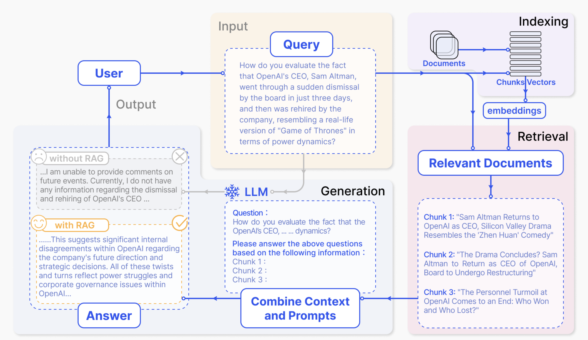

# WEEK051 - 提示工程学习笔记

在之前的笔记中，我们学习了很多大模型的使用技巧，比如 [实现一个划词翻译插件](../week040-chrome-extension-with-chatgpt/README.md)、[实现基于文档的问答助手](../week042-doc-qa-using-embedding/README.md)、[实现基于数据库的问答助手](../week047-structured-data-qa/README.md) 等等，在这些使用场景中，我们应该都或多或少听过 **提示工程（Prompt Engineering）** 这个概念；另外，在 [大模型应用开发框架 LangChain 学习笔记（二）](../week044-llm-application-frameworks-langchain-2/README.md) 这篇笔记中，我们学习了什么是 **智能体（Agent）**，并使用 LangChain 实现了几种不同类型的智能体，将提示工程技术发挥得淋漓尽致。那么到底什么是提示工程呢？提示工程又有哪些使用技巧呢？这篇笔记就来系统地学习下相关知识。

## 什么是提示工程

根据 [《Prompt Engineering Guide》](https://www.promptingguide.ai/zh) 这份指南中对提示工程的解释，**提示工程（Prompt Engineering）** 是一门关注于 **提示词（Prompt）** 的开发和优化的学科，能够帮助用户将大模型用于各种应用场景和研究领域，比如我们可以利用提示工程来提升大模型处理复杂任务的能力（如问答和算术推理）；或者实现大模型与其他生态工具的对接。

所谓提示词，说白了就是我们给大模型下发的指令，提示词写对了，大模型才能输出相应的结果，提示词写的越好，大模型输出的结果就越准确。提示词由下面的一个或多个要素组成：

* **指令（Instruction）**：给模型下达指令，或者描述要执行的任务；
* **上下文（Context）**：给模型提供额外的上下文信息，引导模型更好地响应；
* **输入数据（Input Data）**：用户输入的内容或问题；
* **输出指示（Output Indicator）**：指定输出的类型或格式；

提示词所需的格式取决于你完成的任务类型，并非所有以上要素都是必须的。比如在前面的笔记中，我通过下面的提示词实现了英汉翻译：

```
Translate this into Simplified Chinese:

The OpenAI API can be applied to virtually any task that involves understanding or generating natural language, 
code, or images.
```

这个提示词只包含了 **指令** 和 **输入数据** 两个部分。我还通过下面的提示词实现了基于文档的问答：

```
你是一个知识库助手，你将根据我提供的知识库内容来回答问题
已知有知识库内容如下：
1. 小明家有一条宠物狗，叫毛毛，这是他爸从北京带回来的。
2. 小红家也有一条宠物狗，叫大白，非常听话。
3. 小红的好朋友叫小明，他们是同班同学。
请根据知识库回答以下问题：小明家的宠物狗叫什么名字？
```

这里除 **指令** 和 **输入数据** 之外，还新增了 **上下文** 部分。可以看到，这些提示词都非常简单，而且效果也都还不错，这其实得益于大模型强大的自然语言处理能力。对于这种简单的任务，提示工程的作用并不明显。但是对于一些复杂的任务，比如算术和推理，或者解决大模型的局限性问题，比如幻觉和上下文限制等，不同的提示工程技术可以大大改善大模型的输出效果。

## 基本原则

提示工程是一门经验科学，提示词的细微差别可能会导致不一样的输出结果，甚至相同的提示工程技术，在不同模型之间也可能效果会有很大的差异，因此提示工程需要进行大量的实验和测试。尽管如此，编写提示词还是有一些通用的原则可以遵守的。

### 从简单开始

在设计提示词时，需要记住这是一个迭代的过程，需要大量的实验来获得最佳结果。避免从一开始就引入过多的复杂性，而应该从简单的提示词开始，然后不断地添加更多的元素和上下文，观察效果是否提高，在这个过程中对提示词进行版本控制。

比如你可以从零样本提示开始，如果效果不好，再改用少样本提示，如果效果还不好，再改用 [Fine-tuning](https://platform.openai.com/docs/guides/fine-tuning) 方案。

另外，当你面对一个复杂的大任务时，可以尝试将任务分解为更简单的子任务，通过构建不同的提示词来解决每个子任务。

### 使用指令

正如前文所述，指令是提示词的几大要素之一，通过指令可以完成一些简单任务，比如：分类、总结、翻译等。在 [OpenAI 的提示工程最佳实践](https://help.openai.com/en/articles/6654000-best-practices-for-prompt-engineering-with-openai-api) 中，建议将指令放在提示的开头，并使用一些诸如 `###` 或 `'''` 的分隔符来分隔指令和上下文：

```
总结下面的文本内容，将其中的要点以列表形式展示出来。

文本内容："""
{text input here}
"""
```

### 减少不精确的描述

确保你的提示词是明确的（Be specific）、具体的（Descriptive）、并且尽可能详细的（As detailed as possible），可以把和大模型的对话类比为和人的对话，沟通越直接，信息传递就越有效。比如下面是一个反例：

```
写一首关于 OpenAI 的诗
```

这个提示词就不够精确，我们应该对诗的内容做进一步描述才能让大模型更好的生成内容：

```
写一首鼓舞人心的关于 OpenAI 的短诗，聚焦最近的 DALL-E 产品发布（DALL-E 是一种文本到图像的机器学习模型），风格类似于莎士比亚。
```

下面是另一个描述不够精确的例子：

```
对该产品进行描述，描述应该相当简短，只有几句话，不能过多。
```

这个提示词啰里啰嗦，而且使用了一些模糊不清的概念，我们可以改得更直接、更具体、更简洁：

```
使用 3 到 5 句话描述该产品。
```

### 通过示例明确输出的格式

我们如果对模型的输出格式有特殊要求，最好提供几个示例，比如下面这个例子：

```
提取下面文本中的公司名称和成立时间。

以 JSON 格式输出：
[
    { "name": "XXX", "establish_time": "XXX" },
    { "name": "YYY", "establish_time": "YYY" }
]

文本内容："""
{text input here}
"""
```

这样的输出格式有一个好处，我们可以在程序中对大模型的输出进行可靠地解析。

### 避免说不要做什么

设计提示词的另一个常见技巧是避免说不要做什么，而是说要做什么。下面是一个反例：

```
下面是客户和代理商之间的对话。不要问客户的用户名和密码。不要重复回复的内容。

客户：我登录不了我的账号
代理商：
```

改成下面这样会更好：

```
下面是客户和代理商之间的对话。代理商将尝试诊断问题并给出解决方案，同时避免询问客户的个人信息（如用户名和密码），
当涉及到这些信息时，建议用户访问帮助文档：www.samplewebsite.com/help/faq

客户：我登录不了我的账号
代理商：
```

### 角色扮演

当我们使用大模型构建一个客服聊天机器人之类的对话系统时，可以在提示词中明确它的身份和意图，就像玩角色扮演一样，比如：

```
我希望你扮演面试官的角色。我会充当一名 Java 开发工程师的候选人，然后你要问我关于这个职位的面试问题。你要像面试官一样说话。
不要一次写下所有的对话，不要写解释，像面试官一样一个接一个地问我问题，然后等待我的答复。我的第一句话是 “你好”。
```

这时大模型就变成了一位 Java 面试官，这种技巧有时也被称为 **角色提示（Role Prompting）**。你也可以尝试其他角色，比如教师、小说家、医生、足球评论员，甚至可以让它扮演 Linux 终端、浏览器、Python 执行器等等，这里有大量案例可供参考：[Awesome ChatGPT Prompts](https://github.com/f/awesome-chatgpt-prompts)。

## 提示词框架

上面提到，一个提示词是由指令、上下文、输入数据和输出指示这几个要素中的一个或多个组成的，这其实就为如何编写提示词提供了一个基础框架，最初由 Elavis Saravia 在 [《Prompt Engineering Guide》](https://www.promptingguide.ai/introduction/elements) 中总结的。

除此之外，还有一些提示词框架对提示词的格式和内容做了更明确的定义，比如 Matt Nigh 的 [CRISPE 框架](https://github.com/mattnigh/ChatGPT3-Free-Prompt-List)：

* CR： Capacity and Role（能力与角色）。你希望 ChatGPT 扮演怎样的角色。
* I： Insight（洞察力），背景信息和上下文。
* S： Statement（指令），你希望 ChatGPT 做什么。
* P： Personality（个性），你希望 ChatGPT 以什么风格或方式回答你。
* E： Experiment（实验），要求 ChatGPT 为你提供多个答案。

云中江树的 [结构化提示词](https://github.com/EmbraceAGI/LangGPT)：

```
# Role: Your_Role_Name

## Profile

- Author: YZFly
- Version: 0.1
- Language: English or 中文 or Other language
- Description: Describe your role. Give an overview of the character's characteristics and skills

### Skill 1
1. xxx
2. xxx

### Skill 2
1. xxx
2. xxx

## Rules
1. Don't break character under any circumstance.
2. Don't talk nonsense and make up facts.

## Workflow
1. First, xxx
2. Then, xxx
3. Finally, xxx

## Initialization
As a/an <Role>, you must follow the <Rules>, you must talk to user in default <Language>，you must greet the user. 
Then introduce yourself and introduce the <Workflow>.
```

感兴趣的同学可以尝试一下。

## 提示工程技术

上面介绍了设计提示词时应该注意的基本原则，遵守这些原则有助于让大模型输出你期望的结果，另外，还有一些提示技术或技巧，也可以大大提高大模型的效果。

### 零样本提示（Zero-shot Prompting） vs. 少样本提示（Few-shot Prompting）

**零样本提示（Zero-shot Prompting）** 与 **少样本提示（Few-shot Prompting）** 是最基础的提示技术。零样本提示就是直接向模型输入文本以获取回答，比如：

```
文本：今天的天气真不错！
情感分类：
```

有些模型会直接输出分类结果：

```
积极
```

有些模型还会输出一些解释性的内容：

```
您的文本：“今天的天气真不错！”表示的是一种积极或正面的情感。
这种表达通常反映出满足、愉悦或幸福的情绪。因此，情感分类可以是“正面”或“积极”。
```

这可能并不是我们所想要的，这时，我们就可以通过少样本提示来引导大模型输出我们期望的格式：

```
文本：这是我读过最精彩的一本小说！
情感分类：积极

文本：这部电影内容一般般啊！
情感分类：消极

文本：这是一部关于友谊的电影。
情感分类：中性

文本：今天的天气真不错！
情感分类：
```

少样本提示通过提供一些包含输入和期望输出的示例，让大模型更好地理解我们的意图，因此，少样本提示通常比零样本提示有更好的表现，然而它是以消耗更多的 token 为代价的，并且当输入和输出文本很长时可能会达到上下文长度限制。

少样本提示技术由 Tom Brown 等人 2020 年在 [Language Models are Few-Shot Learners](https://arxiv.org/abs/2005.14165) 这篇论文中提出，这项技术利用了大模型的 **上下文学习（In-context Learning）** 能力，即大模型可以从少量的示例数据中学习新任务，而无需进行任何参数更新。Sewon Min 等人在 [Rethinking the Role of Demonstrations: What Makes In-Context Learning Work?](https://arxiv.org/abs/2202.12837) 这篇论文中做了更深入的研究，探讨了少样本提示是如何工作的？以及它为什么是有效的？论文中还总结了一些有趣的结论：

* 示例数据中的标签空间和输入文本的分布对于上下文学习至关重要，就算标签是错的也所谓；
* 整体格式也至关重要，当标签空间未知时，使用随机的单词作为标签也比不使用标签要好得多；

比如将上面的例子改成下面这样：

```
文本：这是我读过最精彩的一本小说！
情感分类：消极

文本：这部电影内容一般般啊！
情感分类：中性

文本：这是一部关于友谊的电影。
情感分类：积极

文本：今天的天气真不错！
情感分类：
```

尽管示例数据中的分类结果都是错的，但是大模型依然可以输出正确的结果。

如何构建少样本提示中的示例数据是另一个值得探讨的课题，目前已经有很多论文对此进行了研究。Tony Z. Zhao 等人在 [Calibrate Before Use: Improving Few-Shot Performance of Language Models](https://arxiv.org/abs/2102.09690) 这篇论文中提出：**提示词的格式、示例数据的选择以及示例数据的顺序都可能导致截然不同的性能。**

论文中进一步指出，出现这种现象的原因可以归结为如下几种偏差：

* **多数标签偏差（Majority label bias）**：当示例中的标签分布不平衡时会出现；
* **近因效应偏差（Recency bias）**：模型可能会出现在末尾重复标签的倾向；
* **常见令牌偏差（Common token bias）**：模型更倾向于生成常见令牌而不是罕见令牌；

为了克服这些偏差，论文中提出了一种方法，使用一个无内容的输入（如：`N/A`）来估计模型对每个答案的偏差，然后调整参数，使得对于这个输入的预测在所有答案上均衡。

关于示例数据的选择有几个普遍建议可供参考：

* 保持示例数据的多样化
* 与测试样本相关
* 并且以随机顺序排列

如果想更深入地学习相关的内容，下面这些论文可供参考：

* [Liu et al. 2021, What Makes Good In-Context Examples for GPT-3?](https://arxiv.org/abs/2101.06804)
    * 在嵌入空间中使用 kNN  聚类，选择与测试示例在语义上相似的示例
* [Su et al. 2021, Selective Annotation Makes Language Models Better Few-Shot Learners](https://arxiv.org/abs/2209.01975)
    * 提出了一种无监督的基于图的选择性注释方法
* [Rubin et al. 2021, Learning To Retrieve Prompts for In-Context Learning](https://arxiv.org/abs/2112.08633)
    * 使用 **对比学习（Contrastive Learning）** 来训练嵌入，以进行上下文学习样本选择
* [Zhang et al. 2022, Active Example Selection for In-Context Learning](https://arxiv.org/abs/2211.04486)
    * 使用 **强化学习（Reinforcement Learning, RL）** 中的 Q-learning 来做示例数据的选择
* [Lu et al. 2021, Fantastically Ordered Prompts and Where to Find Them: Overcoming Few-Shot Prompt Order Sensitivity](https://arxiv.org/abs/2104.08786)
    * 这篇论文论述了示例数据的顺序对模型效果的影响，并且证明了增加模型大小或包含更多的训练样本也不能保证降低方差，于是提出了一种基于熵的统计方法对候选数据进行排列

### 指令提示（Instruction Prompting）

在少样本提示中，我们提供少量示例数据的目的是向大模型解释我们的意图，那么，为什么我们不直接将我们的意图告诉大模型呢？

```
对下面的文本进行情感分类，分类结果可以是“积极”、“消极”或“中性”。

文本：今天的天气真不错！
情感分类：
```

能从指令中理解用户意图的模型我们称之为 **指令模型（Instructed LM）**，这些模型通过高质量的数据（包括指令、输入和输出）对预训练模型进行微调，以使语言模型更好地理解用户意图并遵循指令，这个过程叫做 **指令微调（Instruction Tuning）**。

Google 在 2021 年首次提出指令微调可以解锁大模型的指令理解能力，并发布了 [FLAN 模型](https://github.com/google-research/FLAN)；BigScience 紧随其后，发布了 [T0 模型](https://github.com/bigscience-workshop/t-zero)，相对 FLAN 来说，它的指令数据集更加丰富多样；正当 Google 和 BigScience 还在各种不同的标准任务上评估大模型能力提升时，OpenAI 却开始从另一个角度来评估人工智能，那就是如何更好地帮助人类解决问题，它将数据集从标准的 NLP 任务改成用户提交的真实问题，最终在 2022 年发布了 [InstructGPT 模型](https://github.com/openai/following-instructions-human-feedback)，并在 InstructGPT 的基础上训练出了风靡全球的 ChatGPT；之后还有 AllenAI 发布的 [TK-Instruct 模型](https://github.com/yizhongw/Tk-Instruct)，它使用了更大规模的指令数据集进行训练，并将 [指令集完全开源](https://github.com/allenai/natural-instructions)，推动了指令模型的发展。

这些指令模型都有对应的论文：

* **FLAN** - [Wei et al. 2021, Finetuned Language Models Are Zero-Shot Learners](https://arxiv.org/abs/2109.01652)
* **FLAN-T5** - [Chung et al. 2022, Scaling Instruction-Finetuned Language Models](https://arxiv.org/abs/2210.11416)
* **T0** - [Sanh et al. 2021, Multitask Prompted Training Enables Zero-Shot Task Generalization](https://arxiv.org/abs/2110.08207)
* **InstructGPT** - [Ouyang et al. 2022, Training language models to follow instructions with human feedback](https://arxiv.org/abs/2203.02155)
* **TK-Instruct** - [Wang et al. 2022, Super-NaturalInstructions: Generalization via Declarative Instructions on 1600+ NLP Tasks](https://arxiv.org/abs/2204.07705)

此外，指令微调常见的方法是 [RLHF](https://arxiv.org/abs/1706.03741)（Reinforcement Learning Human Feedback，来自人类反馈的强化学习），可以让模型被调整得更好地适应人类的偏好。

目前市面上的大语言模型基本上都是指令模型，在与指令模型交互时，我们要遵守上一节中介绍的基本原则，指令要求要详细，尽量具体和准确，避免说不做什么，而是说明要做什么。

指令提示和少样本提示可以组合使用，Seonghyeon Ye 等人在 [Investigating the Effectiveness of Task-Agnostic Prefix Prompt for Instruction Following](https://arxiv.org/abs/2302.14691) 论文中提出一种 **In-context Instruction Learning** 的方法，他们在提示词中包含了不同任务的多个示例：

```
任务：确定对话的发言人是 “代理商” 还是 “客户”
输入：我已经成功为你预定了机票。
输出：代理商

任务：确定问题所属的类别是 “数量” 还是 “位置”
输入：美国最古老的建筑是什么？
输出：位置

任务：对给定的电影评论进行分类，“积极” 还是 “消极”
输入：我猜视频游戏一定比电影有趣多了。
输出：
```

通过这种方式可以显著提高预训练模型和指令微调模型的零样本任务泛化性能。

### 思维链（CoT）

传统的少样本提示可以显著提高大模型在分类、翻译、生成等任务中的性能，但是在处理算术、常识、符号推理等任务时却不那么明显。Jason Wei 等人于 2022 年发表论文 [Chain-of-Thought Prompting Elicits Reasoning in Large Language Models](https://arxiv.org/abs/2201.11903)，提出了一种新的名为 **思维链（Chain of Thought, CoT）** 的提示技术，通过向大模型展示中间推理步骤实现了复杂的推理能力，结合少样本提示还可以获得更好的结果。

下面是思维链的一个经典示例：


左边是传统的提示技术，首先向大模型展示一个问题样例以及该问题的答案，我们希望大模型能直接给出答案，但是很可惜，结果是错的；右边是使用思维链提示技术，和左边一样，也是向大模型展示一个问题样例，但是接下来我们不是直接给出问题的答案，而是给出解答该问题的推理过程，这样大模型就会模仿你的推理步骤，并成功解决新的未知问题。

虽然思维链很强大，但是要注意的是，这种能力只有在足够大的语言模型上才会涌现（大于等于 100B），在较小的模型上使用思维链效果可能比标准提示更差。

在 Jason Wei 等人的论文发表后不久，Takeshi Kojima 等人也发表了一篇关于思维链的论文：[Large Language Models are Zero-Shot Reasoners](https://arxiv.org/abs/2205.11916)，论文中介绍了 **零样本思维链（Zero-Shot-CoT）** 技术，而 Jason Wei 等人提出的技术被称为 **少样本思维链（Few-Shot-CoT）**，和之前的思维链不同的是，零样本思维链不需要在提示词中给出解决问题的推理过程，而是直接在提示词中加上一句 **让我们逐步思考（Let's think step by step.）** 这样的话即可：


这么简单的一句话，竟然可以起到这么大的作用，着实让人意想不到。有趣的是，论文中还尝试了不少其他的提示词，最终发现 Let's think step by step. 效果最好：


不过，零样本思维链通常不如少样本思维链有效，只有当你没有太多的示例数据时可以尝试一下。此外，这个技巧除了用于解决复杂的推理问题，还适合生成一些连贯主题的内容，比如写长篇文章、电影剧本等。

### 自我一致性（Self-Consistency）

根据上面的学习我们知道，思维链提示是让大模型模仿示例数据生成一系列的推理步骤，最终解决用户问题，但是很显然，大模型在生成中间步骤时仍然是可能出错的。Xuezhi Wang 等人在 2022 年提出的一种改进思维链的方法，即 **自我一致性（Self-Consistency）**，参见论文 [Self-Consistency Improves Chain of Thought Reasoning in Language Models](https://arxiv.org/abs/2203.11171)。

自我一致性的想法很简单，通过多次执行 CoT 得到多个推理路径，然后在多个结果中投票选择最一致的答案：


从上图可以看出自我一致性方法整体包括三个步骤：

1. 构造 CoT 示例数据；
2. 通过大模型生成多个不同的推理路径（reasoning path）；
3. 使用多数投票（majority vote）的方法选出最一致的答案；

虽然这种方式有点大力出奇迹的感觉，但是它确实可以提高思维链在算术和常识推理等任务中的性能。在具体的使用过程中，还有两个问题值得注意：

1. 在生成多个推理路径时，一般将模型的温度值设置为 0.5，因为这个值如果设置过小会导致答案基本都一样，过大又会导致答案全都不一样，都会影响到最终的效果；
2. 需要生成多少个推理路径（也就是采样次数）也是一个问题，从论文结果来看，候选样本数越多，最终效果越好，论文中一共采样了 40 次，但在实际应用中不可能这样豪横，一般采样 5 次以上就能超过普通的思维链提示；

自我一致性本质上是一种集成学习方法，Xuezhi Wang 等人后来又对其进行了优化，提出了 **推理增强集成（Rationale-Augmented Ensembles）** 方法，通过改变示例顺序或使用模型生成的推理链来替换人工编写的推理链，在多个样本试验中引入随机性，然后通过多数投票来聚合模型输出，得到最终答案，参见论文 [Rationale-Augmented Ensembles in Language Models](https://arxiv.org/abs/2207.00747)。

### 最少到最多提示（Least-to-Most Prompting）

在 **零样本思维链（Zero-Shot-CoT）** 那篇论文中，作者提出了一种利用大模型进行两阶段推理的设想：


第一个阶段先进行问题的拆分并分段解答问题（Reasoning Extraction），然后第二阶段再进行答案的汇总（Answer Extraction），这给了最少到最多提示很大的启发。

**最少到最多提示（Least-to-Most Prompting，LtM）** 也是一种改进思维链提示的方法，由 Denny Zhou 等人在 [Least-to-Most Prompting Enables Complex Reasoning in Large Language Models](https://arxiv.org/abs/2205.10625) 这篇论文中提出。


LtM 提出的初衷是为了解决 CoT 泛化能力不足的问题：即通过人工编写的示例数据可能并不能够很好的迁移到别的问题当中去，这种泛化能力的不足会导致新的问题无法使用老的模板进行解决。所以一个思想就是：让大模型自己找到解决当前问题的思维链。

相比于自我一致性，LtM 明显更优雅一些，它的思路使用了分治的思想，首先将大问题拆分成小问题，然后依次解决小问题，最后解决大问题：

1. **问题拆解（Problem Reducing）**：第一步自上而下的分解问题，引导模型把问题拆分成子问题；
2. **子问题有序解答（Sequentially Solve Subquestions）**：第二步自下而上的依次解决问题，逐一回答子问题，并把子问题的回答作为下一个子问题回答的上文，循序渐进地解决问题，直到给出最终答案；在这个依次回答问题的过程中，问题由少变多，这也是 Least-to-Most 一词的来源。

### 思维树 (ToT)

传统的思维链提示，以及基于思维链的改进方法比如自我一致性，都存在着明显的缺陷：

* 对于局部，并没有对思考过程的不同分支进行探索，生成的思维链都是一条路走到黑，不会去思考每一步有没有其他分支的解决方案；
* 对于全局，没有利用任何类型的规划、前瞻以及回溯来帮助评估不同的选择，而这种启发式的探索正是人类解决问题的特性；真正的问题解决过程涉及反复利用可用信息来启动探索，进一步揭示更多信息，直到最终发现解决方法；

为解决这些不足，Shunyu Yao 等人在 2023 年 5 月发表了一篇论文 [Tree of Thoughts: Deliberate Problem Solving with Large Language Models](https://arxiv.org/abs/2305.10601)，提出了 **思维树（Tree of Thoughts，ToT）** 的框架，让语言模型可以探索多个推理路径，把解决问题视作在一棵树上的搜索，树上的每个节点代表问题以及到目前为止的思考过程：


ToT 允许语言模型在解决问题的中间过程进行探索，通过考虑多种不同推理路径并进行评估，同时具备向前看跟向后回溯的能力以获得更佳决策选择。一个完整的 ToT 包括下面四个过程：

1. **思考分解（Thought deconposition）** - 如何将推理中间过程分解成多个想法步骤

ToT 会根据问题属性去设计和分解中间的想法过程，每个想法应该足够小，使得语言模型可以生成有潜力跟多样的样本，同时又应该足够大，使得语言模型可以评估该想法解决问题的潜力；

2. **想法生成器（Thought generator）** - 如何根据当前状态生成候选想法

文中提供了 Sample 和 Propose 两个想法生成策略，前者利用 CoT prompt 多次采样，这种方式能保证多样性，在想法空间更宽泛时效果更佳，后者依据 "propose prompt" 依次生成想法，可以避免同一个上下文生成重复的想法，更适用于思维空间受限的场景；

3. **状态评估器（State evaluator）** - 如何启发性地评估状态

给定不同的当前状态，让状态评估器评估它们对于解决问题的帮助，以确定哪些状态值得继续探索，以及以何种方式探索；

4. **搜索算法（Search algorithm）** - 使用什么搜索算法

在 ToT 框架中，可以根据树形结构插入和使用不同的搜索算法，文中探索了两种相对简单的搜索算法：BFS 广度优先算法，每一步中保留最优潜力的 K 个状态；DFS 深度优先算法，优先探索最优潜力的状态，直到得到最终结果，或者超过当前状态被评估不可能解决问题就停止，如果是后者的话可以退回父节点，继续进行探索。

论文中使用 ToT 开展了三个不同的实验：24 点游戏、迷你填字游戏 和 创意文本生成，都取得了非常好的表现，论文作者还在 GitHub 上开源了他们的代码 [princeton-nlp/tree-of-thought-llm](https://github.com/princeton-nlp/tree-of-thought-llm)，感兴趣的同学可以尝试下。

另外，除了 Shunyu Yao 等人发表的这篇关于思维树的论文外，Jieyi Long 也发表了一篇类似的论文 [Large Language Model Guided Tree-of-Thought](https://arxiv.org/abs/2305.08291)，他提出由强化学习（Reinforcement Learning）训练出的 “ToT 控制器”（ToT Controller）来驱动树的搜索策略，这种方法的好处是可以从新的数据集学习，或是在自对弈的过程中学习，使得 ToT 系统可以不断进化。

一般来说执行 ToT 的过程中会涉及到多次大模型的调用，在处理大型任务时 token 的消耗会非常大，于是就有人将 ToT 框架的主要概念概括成了一段简短的提示词，指导 LLM 在一次提示中对中间思维做出评估，下面是一些示例。

[示例一](https://github.com/dave1010/tree-of-thought-prompting)：

```
Imagine three different experts are answering this question.
All experts will write down 1 step of their thinking,
then share it with the group.
Then all experts will go on to the next step, etc.
If any expert realises they're wrong at any point then they leave.
The question is...
```

[示例二](https://github.com/kyegomez/tree-of-thoughts)：

```
Three experts with exceptional logical thinking skills are 
collaboratively answering a question using the tree of thoughts method. 
Each expert will share their thought process in detail, 
taking into account the previous thoughts of others and admitting any errors.
They will iteratively refine and expand upon each other's ideas, giving credit where it's due.
The process continues until a conclusive answer is found.
Organize the entire response in a markdown table format.
The task is:
```

### 检索增强生成 (RAG)

实验表明，大型语言模型能够从海量数据中学习到广泛的世界知识，这些知识以参数的形式存储在模型中，经过适当的微调就能在下游任务中取得 SOTA 表现。但是模型容量再大，也很难记住所有知识，这类通用语言模型在处理 *知识密集型（knowledge-intensive）* 任务时仍旧存在一定的局限性，比如知识更新不及时、生成虚假信息以及对不存在来源的引用等问题，也就是我们所说的 *幻觉（hallucination）*。

治理幻觉的方式有很多，比如：在训练时提供更高质量的数据，对模型进行微调补充领域知识，在 RLHF 时给予奖励模型对数据真实性更高的倾向性，通过 Prompt 引导大模型避免生成缺乏依据的信息，以及这一节所介绍的 **检索增强生成（RAG，Retrieval Augment Generation）**。

> 大模型的幻觉并非一无是处，有研究者指出幻觉是让大模型产出创意的基础。

RAG 早在 GPT 等大模型出来之前就有了相关的研究，例如 [Facebook 在 2020 年](https://ai.facebook.com/blog/retrieval-augmented-generation-streamlining-the-creation-of-intelligent-natural-language-processing-models/) 的研究提出，将模型知识分为 *参数记忆（parametric memory）* 和 *非参数记忆（nonparametric memory）*，也就是内部信息和外部信息，同时结合这两类信息来回答用户问题可以提供更准确的回复，而且可以减少模型的幻觉。这里的外部信息可以是文档、数据库、网页、笔记、日志、图片、视频、甚至可以是从 API 获取的数据等等，通常我们将这些外部信息切块后保存在向量数据库中，然后基于用户输入的问题做检索。

一个典型的 RAG 包含两个主要的部分：

* 索引构建：首先准备和加载数据，将数据划分成小的数据块，然后对每个小数据块做向量表征存储，方便后续做语义检索；
* 检索和生成：基于用户输入的问题，尽可能地检索出最相关的数据块，将检索出的数据块作为上下文和用户问题一起组合成 prompt 让大模型生成回答。



Yunfan Gao 等人在 [Retrieval-Augmented Generation for Large Language Models: A Survey](https://arxiv.org/abs/2312.10997) 这篇论文中对 RAG 技术做了一个全面的总结，推荐阅读。

目前有很多开源的工具可以用来打造 RAG 系统，比如 [LangChain](https://python.langchain.com/docs/use_cases/question_answering/) 和 [LlamaIndex](https://docs.llamaindex.ai/en/stable/optimizing/production_rag.html) 的官方文档中都有很多关于 RAG 的示例可供参考。

### 生成知识提示（Generated Knowledge Prompting）

使用检索增强生成（RAG）可以让大模型根据外部知识回答用户问题，由此可见，整合外部知识可以改善大模型的表现，有趣的是，我们也可以通过大模型生成知识来提高它自身的能力。这是由 Jiacheng Liu 等人所提出的一种新型的提示工程技术，叫做 **生成知识提示（Generated Knowledge Prompting）**，在论文 [Generated Knowledge Prompting for Commonsense Reasoning](https://arxiv.org/abs/2110.08387) 中首次提出，使用生成知识提示不需要整合外部知识，相反，它直接从通用语言模型中生成知识，然后将这些知识作为上下文来回答用户的问题。


它的核心思想如上图所示，包含了两个步骤：

* 知识生成：在这个步骤中，我们提供少量的示例数据，要求大模型生成有关用户问题的一组事实，也就是知识；
* 知识集成：然后将这些生成的知识作为上下文来回答用户的问题；

### 自动提示工程师（APE）

通过上面的学习我们知道，任务性能在很大程度上取决于用于引导模型的提示的质量，而大多数有效的提示都是由人工手工制作的，那么有没有一种方法能自动生成提示呢？

其实，提示的本质就是通过输入一系列的前缀文本，增加获取所需输出的概率。因此，我们可以将它们视为可训练的参数，并通过梯度下降直接在嵌入空间中进行优化，针对这个问题目前有很多相关的研究，例如 [AutoPrompt](https://arxiv.org/abs/2010.15980)、[Prefix-Tuning](https://arxiv.org/abs/2101.00190)、[P-tuning](https://arxiv.org/abs/2103.10385) 和 [Prompt-Tuning](https://arxiv.org/abs/2104.08691) 等。

Yongchao Zhou 等人在论文 [Large Language Models Are Human-Level Prompt Engineers](https://arxiv.org/abs/2211.01910) 中提出了一种更简单的方法：**自动提示工程师（Automatic Prompt Engineer，APE）**。

APE 的目的是自动化进行指令生成和选择，通过 LLM 生成指令，将这些生成的指令放到一个指令池中，选择一个打分函数对这些指令进行打分，然后选择出分数最高的指令。整个过程可以概况为三步：

1. 给定一组输入输出对形式的示例数据，让 LLM 生成候选指令，比如：`{{Given desired input-output pairs}}\n\nThe instruction is`；
2. 对于给定数据集，制定一个打分函数，比如准确率或对数概率，我们希望找到一个指令能够令其最大化；
3. 使用迭代的蒙特卡洛搜索方法，通过提供类似语义的变体提示来改进最佳候选者，比如：`Generate a variation of the following instruction while keeping the semantic meaning.\n\nInput: ...\n\nOutput:...`

可以将整个工作流分为 **推理（Inference）**、**评分（Scoring）** 和 **采样（Resampling）** 三步，其最大的特点是三步都是基于 LLM 实现的，如下所示：


有趣的是，作者通过 APE 方法还发现了一个比人工设计的零样本 CoT 更好的提示：

**Let’s work this out in a step by step way to be sure we have the right answer.**

该提示在 MultiArith 上获得了 82.0 的性能得分：


另外，除了 APE，还有很多论文也对自动生成提示做了更深入的研究，比如：

* [Automatic Prompt Augmentation and Selection with Chain-of-Thought from Labeled Data](https://arxiv.org/abs/2302.12822)
    * 论文介绍了如何使用增强-修剪-选择的三步过程，自动构建思维链提示
* [Automatic Chain of Thought Prompting in Large Language Models](https://arxiv.org/abs/2210.03493)
    * 论文提出了一种 Auto-CoT 提示方法，采用聚类技术对问题进行多样性抽样并生成推理链来构建示例

### 主动提示（Active Prompting）

通过借鉴基于不确定性的 **主动学习（Active Learning）** 的思想，Shizhe Diao 等人提出了一种新的示例选择方法 **Active Prompting**，引入度量标准来表征不确定性，然后选择最不确定的问题作为示例数据，论文地址 [Diao et al. 2023, Active Prompting with Chain-of-Thought for Large Language Models](https://arxiv.org/abs/2302.12246)。

和 APE 一样，Active Prompting 也是一种自动生成提示的技术，它的流程图如下：


主要分四个阶段：

1. **不确定性评估（Uncertainty Estimation）**：针对数据集中的所有问题，向 LLM 重复请求 k 次，通过一定的算法对产生的答案计算不确定性；我们知道 LLM 的输出有一定的随机性，同一个问题得到的结果可能是稳定的也可能是不稳定的，第一步就是要找到数据集中的最不稳定的问题；
2. **选择阶段（Selection）**：选择不确定性指标最高的问题用于后续标注；
3. **标注阶段（Annotation）**：人工参与对选择的问题进行标注；
4. **推理阶段（Inference）**：使用这些人工标注的问题作为 CoT 的示例进行推理；

## 总结

提示工程是一门实践性很强的学科，需要针对不同的任务，采取不同的策略，不断尝试和探索，才能达到理想的效果。在这篇笔记中，我们学习了提示工程的概念和基本原则，以及一堆的提示工程技术或技巧，如少样本提示和思维链提示等，大大改善了大模型的推理能力。不过大模型在其他方面仍然存在很多不足，比如不擅长数值计算，无法求解复杂方程，不能访问外部知识和工具等，因此研究人员又提出很多想法希望对语言模型进行增强，比如检索增强、编程增强、工具增强等，这样的语言模型被称为 [增强语言模型（Augmented Language Models）](https://arxiv.org/abs/2302.07842)。通过结合外部知识和工具，我们就可以打造出更高级的智能体应用，我们将在下一篇笔记中继续学习相关的知识。

## 参考

* [提示工程指南](https://www.promptingguide.ai/zh/)
* [Learn Prompt](https://www.learnprompt.pro/)
* [Learn Prompting](https://learnprompting.org/zh-Hans/docs/intro)
* [Learning Prompt](https://learningprompt.wiki/)
* [Prompt Engineering | Lil'Log](https://lilianweng.github.io/posts/2023-03-15-prompt-engineering/)
* [NLP（十三）：Prompt Engineering 面面观](https://zhuanlan.zhihu.com/p/632369186)
* [Brex's Prompt Engineering Guide](https://github.com/brexhq/prompt-engineering)
* [The Prompt Landscape](https://blog.langchain.dev/the-prompt-landscape/)
* [HuggingLLM](https://github.com/datawhalechina/hugging-llm)
* [OpenAI Cookbook](https://github.com/openai/openai-cookbook)
* [Best practices for prompt engineering with OpenAI API](https://help.openai.com/en/articles/6654000-best-practices-for-prompt-engineering-with-openai-api)
* [OpenAI 官方提示工程指南 [译]](https://baoyu.io/translations/openai/openai-prompt-engineering-guides)
* [Instruction Tuning（FLAN、instructGPT、chatGPT）](https://blog.csdn.net/qq_39388410/article/details/128265846)
* [解密Prompt系列4. 升级Instruction Tuning：Flan/T0/InstructGPT/TKInstruct](https://cloud.tencent.com/developer/article/2245094)
* [解密Prompt系列9. 模型复杂推理-思维链基础和进阶玩法](https://cloud.tencent.com/developer/article/2296079)

## 更多

### 结构化 Prompt

* [如何写好Prompt: 结构化](https://www.lijigang.com/posts/chatgpt-prompt-structure/)
* [LangGPT 结构化提示词](https://aq92z6vors3.feishu.cn/wiki/RXdbwRyASiShtDky381ciwFEnpe)
* [LangGPT — Empowering everyone to create high-quality prompts!](https://github.com/EmbraceAGI/LangGPT)
* [Mr. Ranedeer: Your personalized AI Tutor!](https://github.com/JushBJJ/Mr.-Ranedeer-AI-Tutor)
* [CRISPE Prompt Framework](https://github.com/mattnigh/ChatGPT3-Free-Prompt-List)

### 应用产品

* [Open Prompt Studio](https://moonvy.com/apps/ops/) - AIGC 提示词可视化编辑器
* [ChatGPT Shortcut](https://www.aishort.top/) - 让生产力加倍的 ChatGPT 快捷指令
* [PromptPerfect](https://promptperfect.jinaai.cn/) - 将您的提示词提升至完美
* [LangGPT](https://github.com/yzfly/LangGPT) - Empowering everyone to create high-quality prompts!
* [Knit](https://promptknit.com/) - A better playground for prompt designers

### 其他

#### 定向刺激提示（Directional Stimulus Prompting）

[Guiding Large Language Models via Directional Stimulus Prompting](https://arxiv.org/abs/2302.11520)

**定向刺激提示（Directional Stimulus Prompting，DSP）**

[定向刺激提示](https://www.promptingguide.ai/zh/techniques/dsp)

#### 多模态思维链

[多模态思维链](https://www.promptingguide.ai/zh/techniques/multimodalcot)

#### 基于图的提示

[基于图的提示](https://www.promptingguide.ai/zh/techniques/graph)
