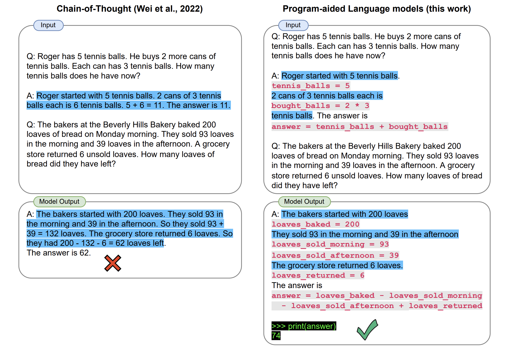

# WEEK052 - 提示工程学习笔记（二）

在 [上一篇笔记](../week051-prompt-engineering-notes/README.md) 中，我们学习了很多提示工程相关的技术，比如思维链（CoT）和最小到最多提示（Least-to-Most Prompting）等，显著改善了大模型的推理能力。尽管如此，我们常常还是会看到这样的现象：大模型可以准确地生成解决问题的逻辑步骤，但最终结果仍然不正确，通常这个结果是由于非常简单的错误引起的，比如数值计算错误、无法理解私有知识等。因此研究人员又提出很多想法希望对语言模型进行增强，最常见的思路有：检索增强、编程增强和工具增强，这样的语言模型被称为 [增强语言模型（Augmented Language Models）](https://arxiv.org/abs/2302.07842)。

## 检索增强

## 编程增强

正如前文所述，结合一些提示技术，语言模型能够准确地给出解决问题的推理步骤，但是，生成正确的推理步骤并不意味着它能正确的解决问题！推理过程中一个小小的算术错误都将导致最终结果的错误，这种错误通常被称为语言模型的 *组合性差距（Compositionality Gap）*，而且这个差距不会随着模型的增大和复杂度的增加而减小。

导致这个现象的根本原因是语言模型不擅长计算，如果能将计算从推理中解耦就好了，让语言模型只负责推理，将计算任务交给专门的计算模块，为了实现这一点，研究人员引入了代码模型来解决这个问题。

首先我们让代码模型产生解决问题的推理步骤，注意不需要模型产生实际的答案，而是生成与推理步骤对应的程序，这段程序是代码和自然语言的混合体（可以理解为带有注释的 Python 脚本），然后使用外部的代码解释器执行程序，从而生成最终的正确答案。这就是编程增强技术的基本思路。

### 程序辅助语言模型（PAL）

受 CoT 提示技术的启发，Luyu Gao 等人于 2022 年 11 月发表论文 [PAL: Program-aided Language Models](https://arxiv.org/abs/2211.10435)，提出了一种 **程序辅助语言模型（Program-aided Language Model, PAL）**，这种模型将问题分解为解决问题的推理步骤，每一步包含自然语言和 Python 代码，在生成这样的混合步骤后，我们可以通过 Python 解释器来执行代码，从而解决问题。

使用 PAL，我们只需要 LLM 生成解决问题的推理步骤，而无需生成结果，这种方法可以显著减小上文中提到的组合性差距。我们可以提供几个将问题分解为混合步骤的示例，通过少样本学习来生成这样的混合步骤。PAL 与 CoT 提示非常相似，它们之间的主要区别在于，PAL 中的提示是由交错的自然语言和程序代码组成，见下图：

PAL 与 CoT 提示的另一个区别是，PAL 使用的少样本示例中不包含最终结果，最终解决方案是由 Python 解释器生成的。

使用 PAL 推理过程中的每一步都通过编程语句进行增强，作者建议使用 Python 注释语法（即 # 字符）来生成基于自然语言的中间步骤，这使得基于语言的组件能够插入到生成的程序中。另外，作者观察到，为代码中的变量提供有意义的名称是有益的。

论文作者还给出了 PAL 的数据集和代码，有兴趣的可以 [研究一下](https://reasonwithpal.com/)。

https://www.promptingguide.ai/techniques/pal

### 思维程序提示（PoT）

[Program of Thoughts Prompting: Disentangling Computation from Reasoning for Numerical Reasoning Tasks](https://arxiv.org/abs/2211.12588)

## 工具使用

### TALM

[TALM: Tool Augmented Language Models](https://arxiv.org/abs/2205.12255)

### Toolformer

[Toolformer: Language Models Can Teach Themselves to Use Tools](https://arxiv.org/abs/2302.04761)

### 自动推理并使用工具 (ART)

[ART: Automatic multi-step reasoning and tool-use for large language models](https://arxiv.org/abs/2303.09014)

https://www.promptingguide.ai/zh/techniques/art

## 推理框架

### ReAct

[ReAct: Synergizing Reasoning and Acting in Language Models](https://arxiv.org/abs/2210.03629)

https://www.promptingguide.ai/zh/techniques/react

https://tsmatz.wordpress.com/2023/03/07/react-with-openai-gpt-and-langchain/

### SelfAsk

[Measuring and Narrowing the Compositionality Gap in Language Models](https://arxiv.org/abs/2210.03350)

https://ofir.io/Self-ask-prompting/

## 参考

* [Augmented Language Models: a Survey](https://arxiv.org/abs/2302.07842)
* [Prompt Engineering | Lil'Log](https://lilianweng.github.io/posts/2023-03-15-prompt-engineering/)
* [LLM Powered Autonomous Agents | Lil'Log](https://lilianweng.github.io/posts/2023-06-23-agent/)
* [解密Prompt系列12. LLM Agent零微调范式 ReAct & Self Ask](https://cloud.tencent.com/developer/article/2305421)
* [解密Prompt系列13. LLM Agent指令微调方案: Toolformer & Gorilla](https://cloud.tencent.com/developer/article/2312674)
* [从PaL到PoT，用程序辅助语言模型，释放大语言模型推理潜能](https://www.ai2news.com/blog/2965081/)
* [LLM+Tools，几篇LLM使用工具文章速览](https://zhuanlan.zhihu.com/p/641402205)
* [赋予大模型使用工具的能力：Toolformer与ART](https://blog.csdn.net/bqw18744018044/article/details/134489247)

## 更多
