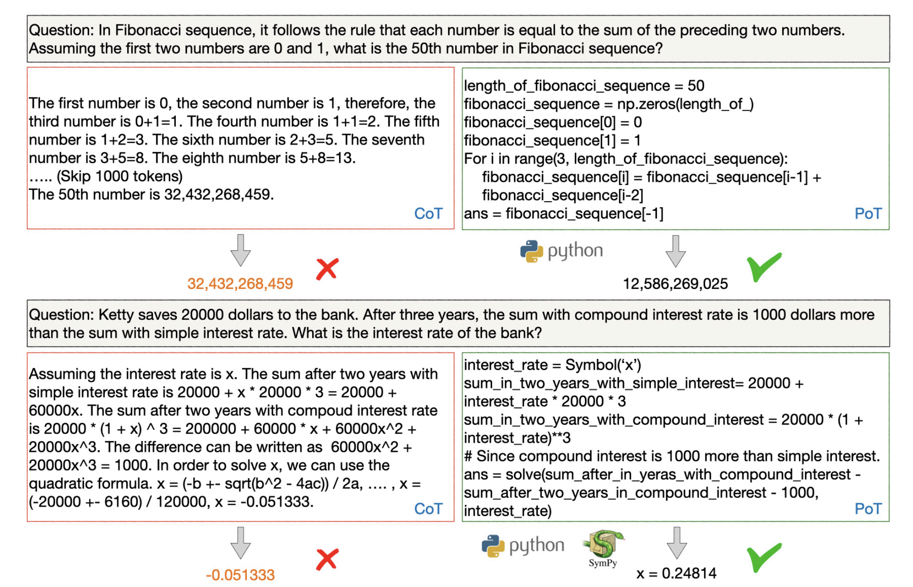
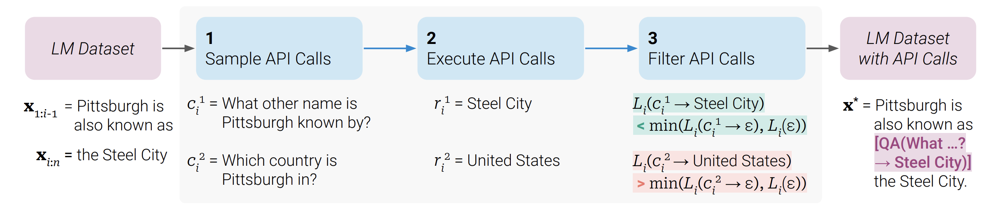
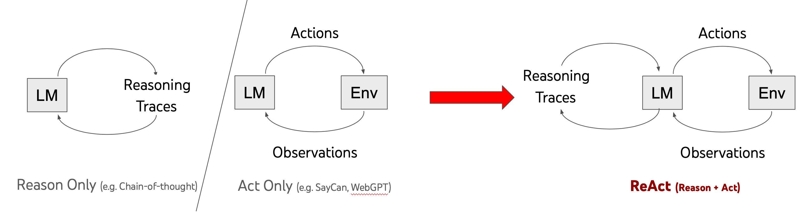
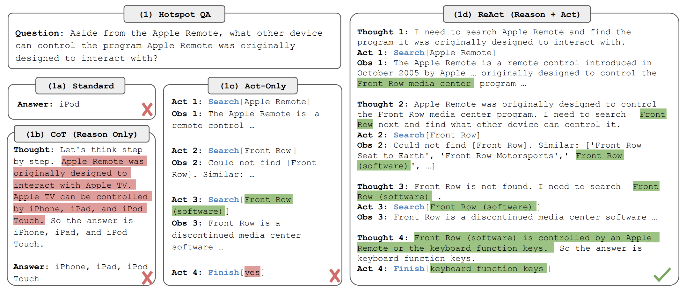
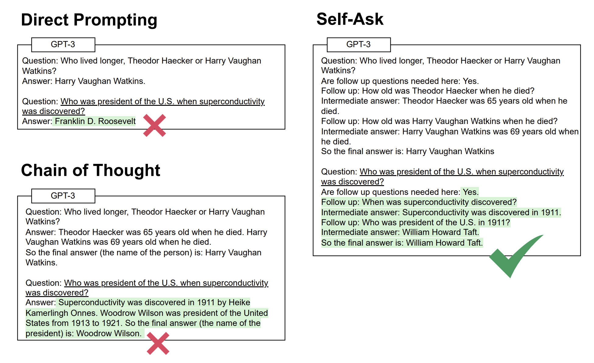

# WEEK052 - 提示工程学习笔记（二）

在 [上一篇笔记](../week051-prompt-engineering-notes/README.md) 中，我们学习了很多提示工程相关的技术，比如思维链（CoT）和最小到最多提示（Least-to-Most Prompting）等，显著改善了大模型的推理能力。尽管如此，我们常常还是会看到这样的现象：大模型可以准确地生成解决问题的逻辑步骤，但最终结果仍然不正确，通常这个结果是由于非常简单的错误引起的，比如数值计算错误、无法理解私有知识等。因此研究人员又提出很多想法希望对语言模型进行增强，最常见的思路有：检索增强、编程增强和工具增强，这样的语言模型被称为 [增强语言模型（Augmented Language Models）](https://arxiv.org/abs/2302.07842)。

## 检索增强

* [Retrieval-Augmented Generation for Knowledge-Intensive NLP Tasks](https://arxiv.org/abs/2005.11401)
* [Retrieval-Augmented Generation for Large Language Models: A Survey](https://arxiv.org/abs/2312.10997)

### Internet-Augmented Language Models

* [Internet-augmented language models through few-shot prompting for open-domain question answering](https://arxiv.org/abs/2203.05115)
* [Internet-Augmented Dialogue Generation](https://arxiv.org/abs/2107.07566)

## 编程增强

正如前文所述，结合一些提示技术，语言模型能够准确地给出解决问题的推理步骤，但是，生成正确的推理步骤并不意味着它能正确的解决问题！推理过程中一个小小的算术错误都将导致最终结果的错误，这种错误通常被称为语言模型的 *组合性差距（Compositionality Gap）*，而且这个差距不会随着模型的增大和复杂度的增加而减小。

导致这个现象的根本原因是语言模型不擅长计算，如果能将计算从推理中解耦就好了，让语言模型只负责推理，将计算任务交给专门的计算模块，为了实现这一点，研究人员引入了代码模型来解决这个问题。

首先我们让代码模型产生解决问题的推理步骤，注意不需要模型产生实际的答案，而是生成与推理步骤对应的程序，这段程序是代码和自然语言的混合体（可以理解为带有注释的 Python 脚本），然后使用外部的代码解释器执行程序，从而生成最终的正确答案。这就是编程增强技术的基本思路。

### 程序辅助语言模型（PAL）

受 CoT 提示技术的启发，Luyu Gao 等人于 2022 年 11 月发表论文 [PAL: Program-aided Language Models](https://arxiv.org/abs/2211.10435)，提出了一种 **程序辅助语言模型（Program-aided Language Model, PAL）**，这种模型将问题分解为解决问题的推理步骤，每一步包含自然语言和 Python 代码，在生成这样的混合步骤后，我们可以通过 Python 解释器来执行代码，从而解决问题。

使用 PAL，我们只需要 LLM 生成解决问题的推理步骤，而无需生成结果，这种方法可以显著减小上文中提到的组合性差距。我们可以提供几个将问题分解为混合步骤的示例，通过少样本学习来生成这样的混合步骤。PAL 与 CoT 提示非常相似，它们之间的主要区别在于，PAL 中的提示是由交错的自然语言和程序代码组成，见下图：


PAL 与 CoT 提示的另一个区别是，PAL 使用的少样本示例中不包含最终结果，最终解决方案是由 Python 解释器生成的。

使用 PAL 推理过程中的每一步都通过编程语句进行增强，作者建议使用 Python 注释语法（即 # 字符）来生成基于自然语言的中间步骤，这使得基于语言的组件能够插入到生成的程序中。另外，作者观察到，为代码中的变量提供有意义的名称是有益的。

论文作者还给出了 PAL 的数据集和代码，有兴趣的可以 [研究一下](https://reasonwithpal.com/)。

### 思维程序提示（PoT）

几乎在同一时间，Wenhu Chen 等人发表了论文 [Program of Thoughts Prompting: Disentangling Computation from Reasoning for Numerical Reasoning Tasks](https://arxiv.org/abs/2211.12588)，提出了 **思维程序提示（PoT）** 技术，它和 PAL 非常相似。论文的作者同样意识到，尽管大模型擅长复杂的推理，但是却往往在简单的算术计算上栽跟头，从而导致回答错误，通过引入代码增强提示方法可以改善这个问题，使得大模型能够准确地解决复杂的数值任务。

和 PAL 一样，PoT 也是利用 LLM 来生成包含自然语言语句和 Python 代码的混合逻辑步骤，然后，将代码部分放到 Python 解释器中执行，从而实现推理和计算的解耦：



从上图中可以看到，CoT 提示无法解决斐波那契数列这种迭代问题，也求解不了简单的三次方程，PoT 通过程序就可以轻松解决这些问题！

PoT 也分为 **少样本 PoT（Few-shot PoT）** 和 **零样本 PoT（Few-shot PoT）** 两种，而且作者发现，零样本 PoT 提示也可以达到很好的效果：


## 工具增强

检索增强扩展了模型获取信息的能力，编程增强扩展了模型解决问题的能力，如果抽象来看，他们实际上都是外部工具的调用，让模型负责推理，推理之外的事通过调用外部工具来实现。在 [大模型应用开发框架 LangChain 学习笔记（二）](../week044-llm-application-frameworks-langchain-2/README.md) 中，我们学习了 OpenAI 的插件机制和 Function Calling 功能，这些其实都是通过外部工具实现的。

关于工具增强，目前已经有不少的论文对此进行了研究，比如上文提到的 Internet-Augmented Language Models 将搜索引擎作为工具，PAL 和 PoT 将 Python 解释器作为工具，我们还可以将浏览器、计算器、QA 系统、翻译系统等等作为工具，比如 [LaMDA](https://arxiv.org/abs/2201.08239)、[BlenderBot 3](https://arxiv.org/abs/2208.03188)、[WebGPT](https://arxiv.org/abs/2112.09332) 等，不过这些方法要么是依赖于大量的人类监督，要么是事先通过少样本提示确定好什么任务中要使用什么工具，使用起来都不够灵活。相比之下，TALM 和 Toolformer 通过 **自我监督（self-supervised）** 机制，使语言模型能够学习如何以及何时使用工具，而不需要编写任务和工具的示例。

### TALM

2022 年 5 月，Aaron Parisi 等人发表论文 [TALM: Tool Augmented Language Models](https://arxiv.org/abs/2205.12255)，提出了 **工具增强语言模型** 的概念，算得上是工具增强技术的鼻祖了。TALM 和传统语言模型的区别在于，它会引导模型输出要调用的工具以及工具的参数，然后将工具调用的结果输入模型，得到最终的结果：


具体来说，TALM 使用了一种 **文本到文本的 API 调用（text-to-text API calls）** 方式，首先模型根据问题输出 `|tool-call` 这种特殊的格式，其中 `tool-call` 表示所使用的工具，然后输出 `tool input text`，表示文本形式的工具参数，后面紧接着输出 `|result` 固定格式，此时停止模型的输出，开始调用外部工具，然后将调用结果追加到刚生成的文本后面，再加上 `|output` 送回语言模型，从而生成最终的结果。下面是使用 TALM 调用天气工具的一个示例：


此外，TALM 采用 **自我对弈（self-play）** 的方法来扩充工具使用示例的数据集，每次模型与工具的交互，通过一种方法判断其是否能改善模型的输出，如果有改善，就扩展到数据集中，并将其用于语言模型的微调。

### Toolformer

Toolformer 是 Timo Schick 等人于论文 [Toolformer: Language Models Can Teach Themselves to Use Tools](https://arxiv.org/abs/2302.04761) 中提出的一种语言模型，和 TALM 一样，也是通过引导模型输出要调用的工具以及工具的参数，然后将工具调用的结果输入模型，最终得到期望的结果：


Toolformer 支持下面 5 种不同的工具：

* 计算器：让语言模型处理数学计算问题；
* QA 系统：避免语言模型生成错误的内容和幻觉；
* 搜索引擎：为语言模型提供最新的信息；
* 翻译系统：提高低资源语言的性能；
* 日历：让语言模型知道时间信息；

Toolformer 和 TALM 非常类似，这里就不过多赘述了，我们重点关注它的训练过程：



1. **LM Dataset**：首先我们需要有一批带有 API 调用标注的数据集，Toolformer 的方法很巧妙，它通过一段提示词和几个 API 调用示例，让语言模型自动生成这样的数据集；比如下面是生成 QA 系统 API 调用的示例：

```
Your task is to add calls to a Question Answering API to a piece of text. The questions should help you get
information required to complete the text. You can call the API by writing "[QA(question)]" where "question" is the
question you want to ask. Here are some examples of API calls:

Input: Joe Biden was born in Scranton, Pennsylvania.
Output: Joe Biden was born in [QA("Where was Joe Biden born?")] Scranton, [QA("In which state is Scranton?")] Pennsylvania.

Input: Coca-Cola, or Coke, is a carbonated soft drink manufactured by the Coca-Cola Company.
Output: Coca-Cola, or [QA("What other name is Coca-Cola known by?")] Coke, is a carbonated soft drink manufactured 
by [QA("Who manufactures Coca-Cola?")] the Coca-Cola Company.

Input: x
Output:
```

2. **Sample API Calls**：将每一个 API 调用表示为一个二元组（API 的名称和相应的输入），对于同一个位置 `i`，我们进行多次采样，生成不同的 API 调用 `ci1`、`ci2` 等；
3. **Excute API Calls**：执行上面生成的每个 API 调用得到结果 `ri1`、`ri2` 等；
4. **Filter API Calls**：计算模型在标记上的 *加权交叉熵损失（weighted cross entropy loss）*，只有大于阈值的 API 调用被保留，这意味着添加这个 API 调用及其结果有助于模型预测未来的标记；
5. **LM Dataset with API Calls**：至此就生成了一批带有 API 调用标注的数据集，然后在这个标注好的数据集上对语言模型进行微调，从而提高模型调用工具的性能。

Toolformer 的创新之处在于，仅使用少量的人工标注样本制造大量的自监督样本，理论上可以支持任意的 API 调用，但 Toolformer 也有一些局限性，比如不支持链式工具使用（使用一个工具的输出作为另一个工具的输入）或以交互方式使用（人工选择后采用 API 响应）。

### 自动推理并使用工具 (ART)

TALM 和 Toolformer 都是微调方案，相比于 Prompt 方案，在复杂问题规划上效果更好，但是很显然没有开箱即用的 Prompt 方案灵活。**自动推理并使用工具 (Automatic Reasoning and Tool-use, ART)** 是一种简单的工具增强的提示框架，由 Bhargavi Paranjape 等人于 2023 年发表的论文 [ART: Automatic multi-step reasoning and tool-use for large language models](https://arxiv.org/abs/2303.09014) 中提出，该框架的工作原理是在接到一个新任务时，从任务库中选择多步推理和使用工具的示范，然后在测试中，每当需要调用外部工具时，就暂停生成，将工具输出整合后再继续生成：


可以看出，ART 可以引导模型进行推理，同时还可以调用外部工具进行帮助，使得模型的性能得到提升。ART 相比于 Toolformer，不仅使用上更简单，而且没有 Toolformer 的局限性，支持链式调用和人工反馈，另外，ART 还支持手动扩展，只要简单地更新任务和工具库就可以修正推理步骤中的错误或是添加新的工具。

在 BigBench 和 MMLU 基准测试中，ART 在未见任务上的表现超过了少样本提示和自动 CoT，并且配合人类反馈后，它的表现超过了手写的 CoT 提示。

作者在 GitHub 上开源了 [ART 的实现代码](https://github.com/bhargaviparanjape/language-programmes)，有兴趣的可以参考一下。

### LLMs As Tool Makers（LATM）

[Large Language Models as Tool Makers](https://arxiv.org/abs/2305.17126)

[CREATOR: Tool Creation for Disentangling Abstract and Concrete Reasoning of Large Language Models](https://arxiv.org/abs/2305.14318)

https://cameronrwolfe.substack.com/p/can-language-models-make-their-own

## 任务规划

在上一篇笔记中，我们学习了不少改善大模型推理能力的提示技术，如思维链（CoT）、思维树（ToT）、最小到最多提示（Least-to-Most Prompting）等，在这一篇笔记中，我们又继续学习如何使用工具增强让大模型的能力得到更大的提升。尽量这两方面的研究都展示了令人印象深刻的效果，但是大模型在解决一些复杂任务时还是不尽如人意。于是研究人员开始将这两点结合起来，智能体的概念也随之浮出水面。

去年 6 月 23 日，OpenAI 的应用研究主管 Lilian Weng 在她的博客上发表了一篇文章 [LLM Powered Autonomous Agents](https://lilianweng.github.io/posts/2023-06-23-agent/)，她提出 **智能体 = 大模型 + 记忆 + 任务规划 + 工具使用**，如下图所示:


其中，记忆可以分为 **短期记忆** 和 **长期记忆**，将所有的上下文都视为模型的短期记忆，而外部向量存储和快速检索则视为模型的长期记忆；工具使用表示的是模型通过调用外部 API 获取模型权重中缺失的额外信息，可以参考上文中介绍的内容；任务规划对应的是大模型的推理能力，具体表现在两个方面：

* 任务分解：可以将大任务分解为多个更小的任务，生成行动计划，从而高效地处理复杂任务；
* 反思和改善：可以对过去的行动进行自我批评和自我反思，从错误中吸取教训并为未来的步骤进行改进，从而提高最终结果的质量。

### ReAct

**推理和行动（Reasoning and Acting，ReAct）** 是 Shunyu Yao 等人在 [ReAct: Synergizing Reasoning and Acting in Language Models](https://arxiv.org/abs/2210.03629) 这篇论文中提出的一种推理框架，作者通过语言模型以交错的方式生成 *推理轨迹* 和 *任务特定的行动*，从而在两者之间实现更大的协同效应：推理轨迹帮助模型诱导、跟踪和更新行动计划，并处理异常情况，而行动则使其能够与知识库或外部环境进行交互，以收集额外信息。

这类似于我们人类在处理复杂问题时的行为，通过推理和行动之间的紧密协同作用，使我们能够快速学习新任务并执行强大的推理和决策，即使面临不可预见的情况时，我们也能做到这一点。



下图是 ReAct 和其他提示技术的一个对比：



我们向语言模型提出一个问题：

```
除了苹果遥控器，还有哪些设备可以控制苹果遥控器最初设计用来交互的程序?
```

这个问题来自于 [HotpotQA](https://hotpotqa.github.io/)，这是一个需要复杂推理的问答数据集。可以看出无论是使用思维链提示（Reason Only）还是使用工具增强（Act-Only）得到的答案都是错的，只有将推理和行动两者结合起来，才能得到准确的答案。ReAct 首先通过推理明确下一步要做什么（Thought 1），接着执行一个动作（Act 1）发送查询请求，然后收到了一个观察（Obs 1），一直重复这个循环，直到达到结论（Act 4）。通过 ReAct 不仅得到了正常的答案，而且我们可以看到模型一步步解决问题的轨迹（*task solving trajectories*），具有很好的可解释性。

那么 ReAct 是如何工作的呢？其实还是通过少样本提示来实现的，ReAct 在提示中包含了少量的推理轨迹示例，推理轨迹由多个 **思考-操作-观察（Thought-Action-Observation）** 步骤组成，如下：

```
问题 科罗拉多造山带东部区域延伸到的区域的海拔范围是多少?
思考 1 我需要搜索科罗拉多造山带，找到科罗拉多造山带东段延伸的区域，然后找到该区域的海拔范围。
操作 1 搜索 [科罗拉多造山带]
观察 1 科罗拉多造山带是科罗拉多及其周边地区造山运动的一段。
思考 2 它没有提到东部地区。所以我需要查一下东部地区。
操作 2 查找 [东部地区]
观察 2 (结果 1 / 1) 东部区域延伸至高平原，称为中原造山带。
思考 3 科罗拉多造山运动的东部区域延伸到高平原。所以我需要搜索高平原，找到它的海拔范围。
操作 3 搜索 [高平原]
观察 3 高平原指的是两个截然不同的陆地区域之一。
思考 4 我需要搜索高平原（美国）
操作 4 搜索 [高平原（美国）]
观察 4 高平原是大平原的一个分区。从东到西，高平原的海拔从 1800 到 7000 英尺 (550 到 2130 米) 不等。
思考 5 高平原海拔高度从 1800 到 7000 英尺，所以答案是 1800 到 7000 英尺。
操作 5 结束 [1800 到 7000 英尺]
```

不同类型的任务可以使用不同的示例，比如对那些以推理为主要目标的任务，使用多个思考-操作-观察的步骤有助于任务的解决，而对于涉及许多操作步骤的决策任务来说，则较少使用思考。

论文还给出了 ReAct 在不同任务上的表现结果，在知识密集型推理任务如问答（[HotpotQA](https://hotpotqa.github.io/)）和事实验证（[Fever](https://fever.ai/resources.html)）方面，ReAct 通过与维基百科 API 交互，克服了思维链推理中普遍存在的幻觉和错误传播问题，生成了比没有推理痕迹的基准更易解释的类人任务解决轨迹。

论文结果显示，ReAct 在 Fever 上的表现优于 CoT，而在 HotpotQA 上落后于 CoT，作者对此进行了总结：

* ReAct 的结构性约束降低了它在制定推理步骤方面的灵活性；
* ReAct 在很大程度上依赖于它正在检索的信息，非信息性搜索结果阻碍了模型推理，并导致难以恢复和重新形成思想；

将链式思考、自我一致性、ReAct 几种提示方法结合起来，通常优于所有其他提示方法。

另外，在两个交互式决策型任务（[ALFWorld](https://alfworld.github.io/) 和 [WebShop](https://webshop-pnlp.github.io/)）上，只需一两个上下文示例的提示，ReAct 就实现了分别比模仿学习和强化学习方法高出 34% 和 10% 的成功率。不过要注意的是，尽管在这些类型的任务中，ReAct 的推理显露出优势，但目前基于提示的方法在这些任务上的表现与人类专家相差甚远。

ReAct 的实现代码在 [GitHub](https://github.com/ysymyth/ReAct) 上开源了，有兴趣同学的可以尝试下。另外，LangChain 基于 ReAct 的思想实现了 [Zero-shot ReAct Agent](https://python.langchain.com/docs/modules/agents/agent_types/react)，关于它的使用方法可以参考我之前写的 [大模型应用开发框架 LangChain 学习笔记](../week044-llm-application-frameworks-langchain-2/README.md)。

### MRKL

[MRKL Systems: A modular, neuro-symbolic architecture that combines large language models, external knowledge sources and discrete reasoning](https://arxiv.org/abs/2205.00445)

Modular Reasoning, Knowledge and Language (MRKL, pronounced "miracle")

### Self-ask Prompting

前面我们提到过一个概念叫 *组合性差距（Compositionality Gap）*，它表示语言模型能够准确地给出解决问题的推理步骤，但是最终回答却是错的这种现象。这一概念最早由 Ofir Press 等人在 [Measuring and Narrowing the Compositionality Gap in Language Models](https://arxiv.org/abs/2210.03350) 这篇论文中提出的，他们指出可以通过推理来缩小组合性差距，例如引发思维链，同时他们提出了一种新的方法，即 **自问自答（Self-ask）**，进一步改进了思维链的效果。

Self-ask 的工作原理是，模型在回答初始问题之前，明确地向自己提出后续问题并回答，直到不需要再提问为止：



Self-ask 有点类似于之前学过的 *最少到最多提示（Least-To-Most Prompting）*，将问题分解为更小的后续问题来解决。Self-ask 也依赖于少样本的思维链提示，但是不同于传统的思维链，Self-ask 在提示中不断的反问自己 `Are follow up questions needed here`，让模型生成后续问题，回答之后再继续反问自己，直到得到最终答案。得益于 Self-ask 的结构化提示，我们能够轻松地插入搜索引擎来回答后续问题，从而进一步提高准确性。

Self-ask 的原理很简单，实现起来也比较容易，可以参考 [GitHub](https://github.com/ofirpress/self-ask) 上的源码。

另外，Harsh Trivedi 等人提出的 [IRCoT（Interleaving Retrieval with Chain-of-Thought）](https://arxiv.org/abs/2212.10509) 方法，将 CoT 生成步骤和信息检索步骤交错使用，和 Self-ask 非常类似。

### Plan-and-Solve Prompting

[Plan-and-Solve Prompting: Improving Zero-Shot Chain-of-Thought Reasoning by Large Language Models](https://arxiv.org/abs/2305.04091)

## 参考

* [Augmented Language Models: a Survey](https://arxiv.org/abs/2302.07842)
* [Prompt Engineering | Lil'Log](https://lilianweng.github.io/posts/2023-03-15-prompt-engineering/)
* [LLM Powered Autonomous Agents | Lil'Log](https://lilianweng.github.io/posts/2023-06-23-agent/)
* [解密Prompt系列12. LLM Agent零微调范式 ReAct & Self Ask](https://cloud.tencent.com/developer/article/2305421)
* [解密Prompt系列13. LLM Agent指令微调方案: Toolformer & Gorilla](https://cloud.tencent.com/developer/article/2312674)
* [从PaL到PoT，用程序辅助语言模型，释放大语言模型推理潜能](https://www.ai2news.com/blog/2965081/)
* [LLM+Tools，几篇LLM使用工具文章速览](https://zhuanlan.zhihu.com/p/641402205)
* [赋予大模型使用工具的能力：Toolformer与ART](https://blog.csdn.net/bqw18744018044/article/details/134489247)
* [Teaching Language Models to use Tools](https://cameronrwolfe.substack.com/p/teaching-language-models-to-use-tools)
* [Can language models make their own tools?](https://cameronrwolfe.substack.com/p/can-language-models-make-their-own)
* [ReAct (Reason+Act) prompting in LLMs](https://tsmatz.wordpress.com/2023/03/07/react-with-openai-gpt-and-langchain/)
* [Self-ask Prompting – Ofir Press](https://ofir.io/Self-ask-prompting/)
* [Techniques to improve reliability](https://github.com/openai/openai-cookbook/blob/main/articles/techniques_to_improve_reliability.md)

## 更多

### 论文集锦

* [atfortes/LLM-Reasoning-Papers](https://github.com/atfortes/LLM-Reasoning-Papers)
* [DSXiangLi/DecryptPrompt](https://github.com/DSXiangLi/DecryptPrompt)
* [zjunlp/Prompt4ReasoningPapers](https://github.com/zjunlp/Prompt4ReasoningPapers)
* [Papers | Prompt Engineering Guide](https://www.promptingguide.ai/papers)
* [Bibliography | Learn Prompting](https://learnprompting.org/zh-Hans/docs/bibliography)

### 工具增强

* [LaMDA: Language Models for Dialog Applications](https://arxiv.org/abs/2201.08239)
* [BlenderBot 3: a deployed conversational agent that continually learns to responsibly engage](https://arxiv.org/abs/2208.03188)
* [WebGPT: Browser-assisted question-answering with human feedback](https://arxiv.org/abs/2112.09332)
* [Training Verifiers to Solve Math Word Problems](https://arxiv.org/abs/2110.14168)

### 提示工程安全

* [对抗性提示](https://www.promptingguide.ai/zh/risks/adversarial)
* [针对提示工程的破解技巧](https://learnprompting.org/zh-Hans/docs/category/-prompt-hacking)
